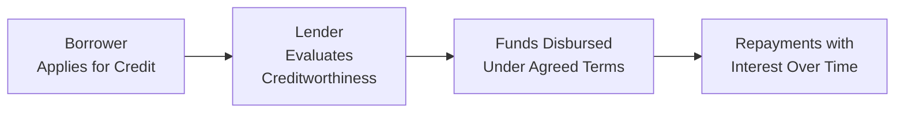

## 3.1 The Use of Credit

Using credit—essentially borrowing money—can feel like a double-edged sword. On one side, it’s an incredibly powerful tool that can help you or your clients reach big goals: purchasing a car, going back to school to sharpen new skills, starting a dream business, or even covering an unexpected bill that pops up out of nowhere. On the other side, it can turn into a recipe for stress and debt if used carelessly. I still remember a friend of mine who was so excited to get his very first credit card—he quickly discovered how easy it was to make purchases he “hadn’t planned on,” racking up more debt than he could manage. That’s basically the story if your credit usage goes unplanned or you don’t track how (and why) you’re borrowing.

In this section, we’ll walk through how credit works, the key factors to keep in mind when advising clients (or managing your own finances), and the best strategies for staying on top of debts in a way that actually strengthens long-term financial health. We’ll also mention some relevant regulations and consumer protection measures in Canada because, yes, lenders do need to follow specific rules to treat consumers fairly. Finally, we’ll explore how to keep a healthy credit score, how to use ratio tools such as the Total Debt Service (TDS) ratio to keep tabs on credit obligations, and how to consolidate debts effectively if—and only if—it makes sense in one’s financial situation.

Feel free to refer back to Chapter 2 (Net Worth and Cash Management Planning) for tips on how to best manage day-to-day cash flows, which often have a direct impact on your ability to repay borrowed funds. We’ll also see references to mortgage planning (Chapter 4) later on, where credit usage intersects the home-buying process at an even deeper level. Let’s dive in.

---

## Why Credit Matters

Credit, in the simplest terms, is the ability to borrow money or access goods and services with the understanding that you’ll pay for them later—often with interest. It’s not just about buying things you can’t afford at the moment. Used wisely, credit can serve as a critical stepping stone toward meeting life goals. For instance:
• Funding advanced education to boost future earning capacity.  
• Launching a small business or expanding an existing one.  
• Purchasing a home or an investment property (which you’ll see in Chapter 4, about mortgages).  
• Addressing emergencies or unexpected expenses without liquidating long-term investments.  

The key is “used wisely.” This means staying within comfortable repayment limits, leveraging credit for strategic purposes (like investing in something that will grow your future income), and crafting a plan for repaying loans or credit card balances on time.

### A Quick Look at Definitions

• Credit Score: A numerical expression of your creditworthiness, commonly ranging from 300 to 900 in Canada. Higher scores signal lower risk to lenders.  
• Debt Service Ratio (DSR): Measures the portion of your income dedicated to debt repayments. The Total Debt Service (TDS) ratio is a prime example, expressing how much of your gross monthly income goes toward meeting your existing debt obligations plus your housing costs.  
• Overextension of Credit: When debt obligations become excessive relative to your available income or cash flow capacity, leading to potential missed payments or financial strain.  
• Consumer Protection: Laws and regulations (both federal and provincial) that promote fair lending practices and aim to protect borrowers from deceptive or predatory lenders.

---

## Key Considerations When Using Credit

As a financial planner or an individual consumer, you’ll want to keep an eye on several factors before taking on credit:

### Interest Rates

The interest rate is, in essence, your “cost” for borrowing money. Whether it’s a fixed or variable rate, always analyze how much you’ll owe over time. A small difference in the rate can significantly affect how much you pay in total interest. For example, a credit line offering 8% interest might initially sound okay, but it can balloon if it’s maintained over many years with minimal repayment of principal.

### Credit Terms and Repayment Schedules

Make sure you (or your clients) understand the repayment schedule. Is it a monthly, weekly, or bi-weekly installment? Are there any hidden fees or specific conditions (e.g., a penalty if you pay off the balance too soon)? Some credit products have what’s called an “amortization period,” which spans several years, while other forms—like credit cards—technically never close if you keep rolling over your balance. Ensuring the repayment obligations match your cash flow is key.  

### Fees and Penalties

In Canada, lenders must disclose fees (though sometimes the disclosure is not as front-and-center as it should be). Among the costs you might see:  
• Annual fees on credit cards.  
• Origination fees on certain loans.  
• Prepayment penalties.  
• Late payment fees.  

These costs can add up and offset any perceived benefits of a lower interest rate.

### The Role of Consumer Protection

Canada has federal acts like the Bank Act and the Consumer Protection Legislation that require lenders (especially large financial institutions) to be transparent with borrowers. However, these rules can vary by province, which is important if your client’s finances straddle multiple jurisdictions. Either way, the principle is to ensure that clients aren’t blindsided by hidden charges or unfair credit terms.

---

## Credit Score: Why It Matters, and How to Improve It

I’ve heard countless times from clients, “Do credit scores really matter that much?” The short answer is yes. In Canada, two major credit bureaus—Equifax and TransUnion—compile credit histories and calculate credit scores. Your credit report includes details on how timely you pay your bills, how much outstanding debt you have, and the types of credit accounts you use.

### The Impact of a Good Score

• Lower Interest Rates: A strong credit score can help you (or your clients) qualify for lower interest loans, saving thousands of dollars in the long term.  
• More Negotiating Power: Lenders might be more flexible on terms or fees when they see a lower-risk profile.  
• Fewer Hurdles: Strong credit often makes it easier to secure mortgages, lines of credit, or even something as simple as an apartment lease or cellphone plan.

### Tips for Keeping It Healthy

• Pay On Time: A late payment stays on your record. Even if you can only make the minimum payment on a credit card, do it on time.  
• Keep Utilization Low: Credit utilization is basically how much of your available credit you’re using. Keeping that ratio below 30% (some experts aim for even lower) can boost your score.  
• Monitor Your Credit Report: You’d be surprised how many credit reports have outright errors in them. Equifax and TransUnion Canada both offer ways to dispute errors.  
• Avoid Excessive Credit Applications: Opening multiple new credit accounts in a short period can bring down your credit score.

---

## Understanding the Debt Service Ratio

An essential part of deciding whether to extend credit—or to take out credit yourself—is understanding your capacity to repay. One way to evaluate this is by calculating your TDS ratio.


\text{TDS Ratio} = \frac{\text{Total monthly debt payments + housing costs}}{\text{Gross monthly income}} \times 100\%


This figure should ideally remain below a certain threshold. Lenders often like to see TDS ratios under 40–42%. Some might allow slightly higher if you have a stellar credit score or large assets, but crossing 45% can be risky territory.

Whether you’re working with a client or assessing your own situation, a TDS ratio that’s too high indicates you might be heading toward overextension. This is a red flag to consider adjusting (or postponing) those borrowing decisions.

---

## Overextension: The Hidden Danger

Ever see someone juggling a bunch of credit cards, lines of credit, personal loans, auto loans, and more? It can quickly become overwhelming. Overextension isn’t just about being in debt; it’s about lacking the ability to comfortably repay that debt while also covering normal living expenses.

### Warning Signs of Overextension

• Struggling to make minimum monthly payments.  
• Relying on one credit product (like a second credit card) to pay off another.  
• Using credit to fund basic living costs (like groceries or utility bills) on a regular basis.  
• Consistent worry over finances, noticing that interest costs keep piling up and overshadow any repayments.

When a client is overextended, it becomes a challenge to maintain a healthy credit score and puts them at risk of serious financial distress. Talking about these red flags with clients (or paying attention to them yourself) is crucial. In many of these scenarios, taking a step back to review your budget or reevaluate spending priorities is an absolute must.

---

## Developing a Solid Debt Repayment Strategy

Sometimes, a client’s debt load might already be substantial. Don’t panic; a carefully structured debt repayment plan can often get things back on track—and help them breathe easier over time.

### Rank Debts by Interest Rate

The “avalanche method,” for example, focuses first on paying off the highest-interest debts. This approach helps minimize the total interest paid. Alternatively, the “snowball method” tackles the smallest balances first to build emotional momentum through small but frequent victories. Each has merits; it often depends on the client’s personality, risk tolerance, and the nature of their debts.

### Consolidation: When Is It Helpful?

Consolidation involves rolling multiple debts into a single product—preferably one with a lower interest rate or more favorable terms. This can simplify monthly payments and can help reduce costs. However, it’s not a magic bullet:
• You need to maintain disciplined spending. Otherwise, the credit lines you just paid off (via consolidation) can become maxed out again, leading to an even deeper hole.  
• Carefully check the new product’s interest rate and total fees. A slightly lower rate with heavy fees might not be a real benefit.  

### Monitoring Progress

Encourage a regular check-in—perhaps monthly or quarterly—to track how much progress is being made. Celebrate debt reductions, and reassess your strategy if needed. Maintaining momentum is half the battle in clearing debt.

---

## Real-world Example: A Case Study

Let’s look at a hypothetical situation that might illustrate how a single change in interest rate or credit approach can make a big difference.

Imagine a client named Sarah. She has:
• A $10,000 credit card balance at 19% interest.  
• A $5,000 line of credit at 9% interest.  

She’s decided to pay off the credit card as fast as possible because the interest costs are so high. By throwing any available cash flow straight into that balance rather than making only the minimum monthly payment, Sarah projects she can clear the debt in about 12 months. Meanwhile, she continues making the minimum payment on the line of credit. Once the credit card is paid down, she plans to funnel those freed-up monthly payments directly into the line of credit to clear it out.

Now, picture an alternate scenario where Sarah simply made minimum payments on everything. It might take her many additional years to clear the credit card—and she’d pay a fortune in added interest. This example shows how simply prioritizing certain debts can drastically cut total interest and reduce stress.

---

## Visualizing the Credit Process

Below is a simple Mermaid diagram that illustrates a generalized flow of how credit is accessed and repaid:

From the lender’s perspective, the big question is: “Can the borrower pay us back?” That’s why credit reviews include your credit report, employment status, and sometimes your TDS ratio. From the borrower’s perspective, it’s about ensuring the repayment structure aligns with available cash flow.

---

## Staying on the Right Side of the Law: Canadian Consumer Guidelines

In Canada, consumer protection laws and guidelines exist to keep lending fair and transparent. While the specifics vary by province, here are some key resources and considerations:

• Financial Consumer Agency of Canada (FCAC): Monitors financial institutions, ensures compliance, and offers free educational resources and tools for managing credit.  
• Canadian Investment Regulatory Organization (CIRO): Oversees investment dealers and mutual fund dealers. When providing advice about debt instruments tied to investment accounts, it’s essential to align with CIRO guidelines.  
• Credit Bureaus (Equifax, TransUnion): Provide detailed credit reports, which consumers are entitled to access for free (at least once a year via mail-in requests).  

---

## Helpful Tools and Resources

• FCAC’s Budget Planner Tool  
  (https://itools-ioutils.fcac-acfc.gc.ca/YFT-OOY/YTFL-OOYL-eng)  
  Perfect for understanding monthly cash flow, identifying where cuts can be made, and figuring out how much you can allocate to accelerated debt repayment.

• Equifax and TransUnion  
  (https://www.equifax.ca, https://www.transunion.ca)  
  Clients should use these sites to check their credit reports. Errors are more common than you think.

• Recommended Reading  
  – “The Wealthy Barber” by David Chilton  
  – “Money Management For Canadians All-In-One For Dummies”  
  – “Stop Over-Thinking Your Money!” by Preet Banerjee  

• Canadian Securities Institute (CSI)  
  Offers specialized courses that delve deeper into personal debt management and financial services advice. These can be valuable for professionals who need continuing education credits or individuals who want to refine their personal finance strategies.

---

## Practical Tips and Best Practices

• Always read the fine print: If there’s any confusion about an interest rate, penalty, or fee, ask before you sign or agree to the loan.  
• Build an emergency fund: Even a small “rainy day” stash can prevent you from leaning on credit cards for emergency expenses.  
• Communicate with lenders: If you sense you’re struggling to make a payment, reach out to your lender. Many will offer temporary relief or modified payment schedules.  
• Steer clear of payday loans: Their extremely high interest rates can trap borrowers in a vicious cycle.

---

## Common Pitfalls

• Impulse Purchases: When credit is easily accessible, it’s easy to buy items you can’t afford.  
• Ignoring Credit Score: Small missed payments add up fast, and damage can linger for years.  
• Rolling Balances Over: Keeping a recurring balance on a credit card means you might be paying interest on interest.  
• Failing to Reassess: As personal circumstances change (like a job loss or an income boost), it’s important to revisit credit usage and repayment strategies.

---

## Conclusion

Credit isn’t inherently good or bad—it’s a tool. Much like a hammer can help you build a sturdy house or put a large hole in the wall, the outcome depends on how you use it. By understanding interest rates, repayment schedules, and your (or your client’s) capacity to carry new debt, you can effectively leverage credit to achieve financial goals rather than bury yourself under monthly interest charges.

Keep your credit score healthy, stay within safe debt service ratios, and lean on consolidation if—and only if—it makes sense for your broader financial plan. By focusing on these fundamentals, you’ll be in a better position to seize opportunities when credit is necessary, all while steering clear of the very real pitfalls of debt overextension.

Remember to check references like the Financial Consumer Agency of Canada for official resources, and don’t hesitate to adopt free budgeting tools to keep yourself and your clients on top of daily and monthly spending decisions. For more insights on how credit interacts with larger debt concerns—like mortgages—Chapter 4 (Financial Planning and Mortgages) awaits you!

---

## Test Your Knowledge: Mastering Credit and Debt Management



### Which of the following best describes why a credit score is important in Canada?

- [ ] It’s used only to calculate your monthly mortgage payment.
- [x] It influences the interest rates lenders will offer you.
- [ ] It determines whether you’re eligible for government welfare programs.
- [ ] It has no impact on any financial application you make.

> **Explanation:** Credit scores are used by lenders to gauge risk. The higher your credit score, the better the terms (notably interest rates) you’ll generally receive.

### What is typically the main goal of debt consolidation?

- [ ] Increasing your total debt amount.
- [ ] Hiding your credit history from lenders.
- [x] Combining multiple debts into one with lower overall interest.
- [ ] Ensuring debts remain indefinite.

> **Explanation:** Debt consolidation allows you to merge multiple high-interest debts into a single new debt instrument that hopefully offers a lower interest rate and simpler repayment.

### Which institution oversees consumer information about credit and helps ensure fair lending in Canada?

- [ ] The provincial government exclusively.
- [x] The Financial Consumer Agency of Canada (FCAC).
- [ ] The World Bank.
- [ ] The Canadian Pay Equity Commission.

> **Explanation:** The Financial Consumer Agency of Canada (FCAC) monitors federally regulated financial entities, provides publications, and ensures transparency in lending practices.

### What does a high Total Debt Service (TDS) ratio indicate?

- [ ] You have a high credit score.
- [ ] You must have at least three credit cards.
- [x] Your monthly debt obligations take up a large portion of your gross monthly income.
- [ ] You’ve successfully consolidated your debts.

> **Explanation:** The TDS ratio shows the percentage of your income needed to cover monthly debt payments and housing costs. A high TDS ratio means you’re devoting a large chunk of your income to debt, indicating potentially higher risk.

### Which of the following is a potential warning sign of overextension?

- [x] Regularly using one credit card to pay off another credit card’s balance.
- [ ] Paying off your monthly balances in full.
- [x] Consistently only making minimum monthly payments.
- [ ] Keeping a TDS ratio under 30%.

> **Explanation:** If you’re constantly juggling credit or only meeting minimums, it might mean you’re stretching your repayments too thin, increasing the likelihood of financial trouble.

### What is often the biggest benefit of having a strong credit score?

- [x] Qualifying for loans at better interest rates.
- [ ] Total exemption from provincial taxes on interest.
- [ ] Automatically receiving monthly subsidies from lenders.
- [ ] Never having to provide documentation when applying for a loan.

> **Explanation:** A robust credit score signals to lenders that you’re less risky, and you’ll generally receive more favourable interest rates and easier loan terms.

### When might a variable interest rate be risky?

- [x] When rates are projected to rise significantly in the near future.
- [ ] When your credit score is too high.
- [x] When you’re on a very tight budget and are sensitive to payment fluctuations.
- [ ] When you have no existing debt.

> **Explanation:** Variable rates can be advantageous when rates are stable or likely to fall, but in an environment where interest rates rise sharply or if your cash flow is tight, a variable rate could lead to financial strain.

### How can monitoring your credit report help maintain financial health?

- [x] You can catch errors in your report and dispute them.
- [ ] It’s not necessary to check, as errors never happen.
- [ ] It exclusively improves your TDS ratio.
- [ ] It replaces the need for budgeting or savings.

> **Explanation:** Mistakes on credit reports are common, and spotting them early can prevent unnecessary credit penalties. It doesn’t negate the need for proper budgeting, though.

### Why is it crucial to read the fine print in any loan or credit agreement?

- [x] To understand all fees, penalties, and payment terms.
- [ ] Because lenders enjoy adding entertaining stories to the print.
- [ ] It’s not crucial; your credit card covers all legal discrepancies.
- [ ] Fine print is usually identical for all loan types.

> **Explanation:** Loan agreements might contain hidden charges, prepayment penalties, or other details that significantly affect the total cost. Always verify the terms before signing.

### True or False: The avalanche method of debt repayment focuses on paying off debts with the smallest balance first.

- [ ] True
- [x] False

> **Explanation:** The avalanche method prioritizes debts in order of highest interest rate to lowest, not the smallest balance. Paying off the highest-interest debt first helps minimize total interest charges over time.


