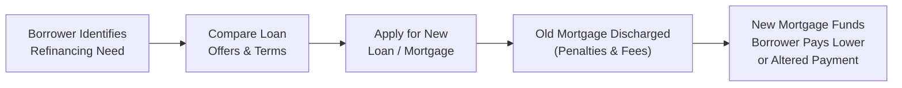

## 3.2 Refinance Debt to Meet Goals

Refinancing debt can feel a bit like hitting the “reset” button. You’re swapping out an old loan or mortgage for a new one with (hopefully) better terms, like a lower interest rate, a different amortization period, or maybe more flexibility in your repayment schedule. But—um—refinancing isn’t always straightforward. There can be hidden penalties, legal fees, or just plain old confusion over whether it’s the right move in the long run. This section explores the nitty-gritty of refinancing, focusing on how it can help you or your clients consolidate debt, free up extra monthly cash, and aim for important milestones, like paying off a mortgage before retirement or investing in a new opportunity.

Refinancing is often associated with mortgages, but it can apply to any type of loan—student debt, car payments, investment accounts with margin loans, or credit card balances. Regardless of the debt’s shape or size, the principle is the same: Replace existing debt with a new product that’s more closely aligned with your current or future financial goals.

Below, we’ll dive into the nuances of refinancing in Canada—exploring typical mortgage break fees, changing market conditions, how to consolidate multiple high-interest debts under one new loan, and how to evaluate your or your client’s long-term objectives before taking the plunge.

### Understanding the Basics of Refinancing

Refinancing means obtaining a new loan under different terms to pay off an existing obligation. Often, people refinance to:

• Get a lower interest rate.  
• Change a variable rate to a fixed rate (or vice versa).  
• Adjust the amortization schedule (i.e., length of time to repay).  
• Consolidate multiple debts into one loan.  
• Tap into equity on an existing asset, such as a home.  

The logic behind refinancing is straightforward: if you can reduce the overall cost of borrowing or better align your debt payments with your financial game plan, refinancing might make sense. But it’s crucial to consider sometimes-overlooked factors: the potential penalties for early repayment, new loan administrative fees, legal costs, and how these might whittle away the financial benefits.

### Potential Benefits of Refinancing

• Lower Monthly Payments: Securing a reduced interest rate often translates into smaller monthly payments. This frees up cash flow to invest, save, or apply to other expenses.  
• Debt Consolidation: Combine various obligations (credit cards, lines of credit, personal loans) into a single, manageable payment at a possibly lower interest rate.  
• Access to Home Equity: If you own a home with significant built-up equity, a refinance can offer funds for renovations or major life events like education costs.  
• Restructured Repayment Terms: You might decide to shorten your amortization period to become debt-free sooner. Or, if your monthly budget is tight, you could extend the amortization to lower monthly payments (though this could raise total interest paid over the life of the loan).  

### Mortgage Refinancing in Canada

Refinancing a mortgage is one of the most common scenarios in which people pursue a refinance strategy. Let’s say you purchased your home five years ago, locking in a fixed interest rate of 5%. Suddenly, the market shifts, and rates are hovering around 3.5%. Do you break your current mortgage and refinance at the lower rate? Possibly—but you need to consider penalty fees and figure out how long you’ll remain in the new mortgage to recoup the costs.

As a well-known guideline, many lenders in Canada charge the greater of:

• Three months’ interest on your mortgage balance, or  
• The Interest Rate Differential (IRD)—the difference between your old rate and current market rate multiplied by the number of months remaining in your term.  

Either charge can be substantial, especially if you’ve got a large outstanding balance or if interest rates shifted significantly from when you first signed.

#### Penalties and Fees

• Prepayment Penalty: For closed mortgages, there almost always is a prepayment penalty if you refinance before the term is up.  
• Appraisal Fee: The house might need a fresh appraisal to determine current market value.  
• Legal Fees: Lawyers or notaries often need to handle the paperwork for discharging your old mortgage and registering the new one.  
• Administrative Fees: Lenders may charge extra for setting up or closing out certain products.  

If these penalties exceed the interest savings you’re expecting, then the refinance might not be as sweet a deal as it appears at first glance. Always do the math or get professional advice. (I once spoke to a friend who was so excited at the new lower rate she could get but nearly fainted when she saw how big her penalty was for leaving her old mortgage early. She calculated she’d need to live in the refinanced home for at least three more years to break even and actually come out ahead.)

### Consolidating High-Interest Debts with Refinancing

Sometimes, clients have accumulated multiple high-interest debts—credit cards with 19.99% APR, maybe an auto loan at 8%, and a personal line of credit at prime plus something. Refinancing into one consolidated loan at a lower overall rate can dramatically trim monthly interest expenses.

For instance, consider funneling that variety of debts into a refinanced mortgage or tapping into a Home Equity Line of Credit (HELOC). You might bring your effective rate down to maybe 5% or 6%, if your home equity and credit profile allow it. While this may transform multiple bills into a single payment, it’s critical that borrowers address any overspending or financial issues that led to debt accumulation in the first place. Without new habits—like better budgeting or planning (see Chapter 2.3: Cash Management Planning)—clients can wind up racking up fresh credit card balances after the refinance, digging themselves an even bigger hole.

### Variable vs. Fixed Rates 

Refinancing can involve shifting from a fixed-rate product to a variable rate—or the other way around. Each approach has pros and cons:

• Fixed Rate: Predictability, consistent monthly payments, and protection against rate increases. If rates are on the rise in Canada, this can be reassuring—especially for folks nearing retirement who want stability.  
• Variable Rate: Payment amounts can fluctuate when the prime rate changes. If rates are falling or are expected to remain stable, variable rates can be cheaper.  

A carefully considered strategy is essential here: if rates are forecasted to keep rising, a fixed-rate mortgage might be the better bet. If there’s a strong possibility rates will drop, a variable rate could score you savings over time.

### Considering Prepayment Penalties and Fees

Let’s look at an example:

Imagine you have an existing mortgage balance of CAD 300,000 at 4.5%. You have three years left in a five-year term. A new lender is offering 3.2% for five years. This might net you a monthly payment decrease of about CAD 250. Let’s say that works out to CAD 3,000 saved annually. Great, right?

But—ah—hold on. If your mortgage penalty is CAD 5,000, plus legal fees of around CAD 1,200, plus an appraisal costing another CAD 350, you’re looking at roughly CAD 6,550 at the outset. Based on a CAD 3,000/year savings, it’ll take you a bit more than two years to break even. If you plan to stay put for a lot longer, the refinance can be worthwhile. If you might sell your home or move within a year, you’ll end up in the red.

Fight the urge to be dazzled by the new interest rate. Always do the break-even analysis and check your overall plan—like how soon you want that mortgage entirely paid off, whether you plan to upgrade homes, etc.

### Refinancing and Home Equity

Refinancing your mortgage is often an opportunity to access your home’s equity. Home equity is the difference between the property’s current market value and whatever amounts you owe on it. Tapping into that equity can help fund renovations, pay for a child’s education, or cover an emergency expense. Just keep in mind: you’re securing that debt against your home. Missing payments can ultimately lead to foreclosure or a forced sale. That’s a risk no one wants.

If you or your clients use a refinance to invest in, say, an RRSP (Registered Retirement Savings Plan) or a TFSA (Tax-Free Savings Account) portfolio, you’re employing leverage. This can amplify gains if markets do well, but it also magnifies losses if markets dip. As always, investment leverage requires robust risk management (see Chapter 5: Investment Management).

### Aligning Refinance with Long-Term Goals

Refinancing should always fit into a borrower’s broader financial strategy. Here are a few scenarios:

• Maximizing Retirement Savings: A soon-to-retire couple might seek to reduce their monthly outflow, freeing up room to top up RRSPs or TFSAs.  
• Accelerating Payoff: Another couple might aim to crush their mortgage sooner by refinancing to a shorter amortization, thus paying more principal every month.  
• Keeping Payments Predictable: A family worried about rate volatility might lock in a predictable fixed rate for five or ten years.  
• Funding an Investment: Some may refinance with the goal of leveraging equity to invest in a business or income property.  

Each scenario has different risk parameters, and not all underwriting guidelines are the same. Lenders will assess your debt ratios, credit score, and property appraisal before approving a refinance.

### Best Practices and Common Pitfalls

Best Practices:  
• Perform a Break-Even Analysis. Make a simple but thorough calculation: how many months of interest savings does it take to recoup your penalty and fees?  
• Check the Loan Terms. Beyond just the rate, compare prepayment options, portability, and possible future break fees.  
• Budget & Cash Flow Management. Especially if you’re consolidating debts, set up a realistic budget to avoid building new balances on old credit lines.  
• Goal Alignment. Clarify your priority: is it minimizing monthly payments, paying off debt faster, or freeing up cash for other goals?

Common Pitfalls:  
• Underestimating Penalties. Some mortgages carry steep break fees; always read the fine print.  
• Failing to Adjust Habits. Consolidating debt without resolving the cause of overspending can lead right back into trouble.  
• Chasing the Lowest Rate Blindly. The best rate in the world means little if you don’t recoup your penalty costs or if hidden fees overshadow your savings.  
• Extending the Amortization Too Far. Lower monthly payments might be appealing, but stretching out the life of the loan can result in more interest over time.

### Practical Example

Let’s run through a simplified scenario:

1. Original Mortgage: CAD 400,000 at 4.8%, with 3 years left in a 5-year term. The monthly payment is around CAD 2,300 (hypothetical figure).  
2. Refinancing Offer: 3.5% for a fresh 5-year term, with monthly payments dropping to about CAD 2,000.  
3. Costs to Break the Mortgage:  
   – Penalty: CAD 6,000  
   – Legal & Admin Fees: CAD 1,500  
   – Appraisal: CAD 400  
   – Total: CAD 7,900  

You lower your payment by CAD 300 per month. You’ll need almost 26 months (about two years and two months) to break even. If you plan on staying in the home for at least three or four more years, it can be worth it. In addition, your monthly cash flow has improved by CAD 300, which might be directed toward a TFSA or paying off something else. If your top priority is to eliminate debt, consider a slightly higher payment schedule or a shorter amortization with your new term.

### Real-World Case Study

Imagine a homeowner, Emily, who had a mortgage for five years at 4.2% with a big Canadian lender. After two years, rates nosedived to about 2%. She debated refinancing. But the cost to break her mortgage was the IRD penalty, and the difference between her rate and the new discounted rate was quite large. Her penalty ended up being CAD 8,000.

After investigating, she found the new mortgage would drop her monthly payments by around CAD 500. She’d break even in about 16 months. Because Emily expected to stay in her home for at least ten more years, she proceeded with the refinance. She used the monthly savings to ramp up contributions to her RRSP. Four years later, global interest rates soared. Emily had locked in her new rate before the spike, meaning she had a stable, low-rate mortgage throughout the economic upswing. That’s a refinance success story, but it hinged on her doing her homework, analyzing the break-even point, and planning a long enough timeline.

### Insight from Regulators & Tools

• Canada Mortgage and Housing Corporation (CMHC): Provides an extensive range of guides and resources on refinance strategies. See https://www.cmhc-schl.gc.ca.  
• Canadian Bankers Association (CBA): Explains mortgage financing best practices at https://cba.ca.  
• Provincial Securities Commissions & CIRO (Canadian Investment Regulatory Organization): For those who might refinance for investing or to adjust margin loans, check ciro.ca for the latest regulatory guidelines. (Historically, IIROC and the MFDA existed as separate bodies, but they merged into CIRO as of January 1, 2023, so references to the old organizations are for historical context only.)  
• Open-Source Mortgage Calculators: The Financial Consumer Agency of Canada (FCAC) provides a Mortgage Qualifier and Payment Calculator at https://itools-ioutils.fcac-acfc.gc.ca/MQ-HQ/MQ-EAPH-eng. These can help you ballpark monthly payments and total loan costs when considering a refinance.  

### Using a Flowchart to Visualize the Refinancing Process

Below is a simple Mermaid.js flowchart illustrating the refinance process:

• Step A: Recognize the refinance opportunity (lower rates, consolidation need, etc.).  
• Step B: Compare lenders, check rates, fees, and terms.  
• Step C: Gather documents, secure approval, pass appraisal.  
• Step D: Pay off the old mortgage or loan, factoring in any penalties.  
• Step E: Start repayment under the new (ideally improved) conditions.

### Summation

Refinancing can be a strategic move if done wisely. The key is thoroughly understanding the break-even calculation and ensuring the new loan truly aligns with your personal or clients’ long-term financial targets. Maybe it’s about broadening your cash flow to invest in your child’s education, or maybe the main aim is to reduce monthly payments to brace for a potential job loss or put away extra funds for retirement. Refinancing, when combined with a disciplined approach to budgeting and debt management, can shift your finances onto a more sustainable, more comfortable path.

Yet it’s never a magic bullet: you can’t simply roll your old debt into a new one and keep spending the same way. Address underlying habits so that the refinanced debt doesn’t balloon all over again. By carefully analyzing the penalties, fees, and overall interest savings—and by factoring in your personal timeline—you can decide if now’s the right time to pull the trigger on a refinance strategy.

Remember, what’s best for your neighbor, coworker, or friend might not necessarily be best for you. Always factor in your unique circumstances: job stability, whether you’ll need to move soon, your outlook for the economy, and your ability to manage your finances responsibly. Good luck, and keep your eyes on those interest rates!

---

## Test Your Knowledge: Refinancing and Debt Reorganization



### Which of the following best describes the primary motivation to refinance a mortgage?

- [ ] To increase the total interest paid over the life of the loan  
- [x] To secure more favorable loan terms, such as a lower interest rate  
- [ ] To boost the amount owed on the mortgage  
- [ ] To extend the repayment indefinitely  

> **Explanation:** Refinancing is generally pursued to achieve better (or more aligned) loan terms. Individuals typically seek a lower interest rate, reduced monthly payments, or a different amortization period.

### When considering a refinance, which cost is most often the largest obstacle to recouping savings?

- [ ] Appraisal costs  
- [x] Mortgage prepayment penalties  
- [ ] Legal representation costs  
- [ ] Administrative filing fees  

> **Explanation:** In Canada, mortgage prepayment or break penalties can be significant, especially for closed mortgages. They often dwarf other refinancing fees and can undermine projected savings.

### A borrower with multiple high-interest credit card debts, a car loan, and a personal line of credit might consider mortgage refinancing primarily for which reason?

- [x] To consolidate various debts into one lower-interest instrument  
- [ ] To increase monthly payments and shorten the amortization period  
- [ ] To avoid paying off any existing loans  
- [ ] To improve their credit score instantaneously  

> **Explanation:** Debt consolidation is a common reason to refinance. By rolling several high-interest debts into a new or refinanced mortgage, you can reduce interest expenses and simplify payments.

### In a "variable-rate" mortgage, which of the following statements is most accurate?

- [ ] The rate remains the same throughout the entire term.  
- [ ] The borrower is prohibited from making lump sum payments.  
- [x] The interest rate fluctuates based on a reference rate (like prime).  
- [ ] It always leads to lower overall interest costs.  

> **Explanation:** A variable-rate mortgage adjusts to changes in a reference interest rate, often the lender’s prime rate, resulting in potential ups and downs in the borrower’s monthly payment or interest portion.

### When calculating the break-even point for a refinance, which calculation is most relevant?

- [x] Total refinancing costs ÷ monthly interest savings  
- [ ] Total refinancing costs ÷ total monthly household expenses  
- [x] Penalty fees ÷ anticipated property value appreciation  
- [ ] New mortgage amount ÷ old mortgage amount  

> **Explanation:** The break-even calculation generally compares the total upfront costs (including penalties, fees, etc.) to the monthly savings achieved by the lower interest rate. Dividing the former by the latter yields the approximate number of months required to “break even.”

### A primary risk of rolling unsecured debt (e.g., credit card balances) into a refinanced mortgage is:

- [x] Converting unsecured debt into debt secured by your home  
- [ ] Automatically improving one’s credit rating  
- [ ] Inability to sell the home for five years  
- [ ] Having no closure costs  

> **Explanation:** By consolidating unsecured debt into your mortgage, you’re tying that debt to your home. Failing to make payments can lead to foreclosure and the loss of your property.

### Which of the following best describes a HELOC (Home Equity Line of Credit)?

- [x] A line of credit secured by your home equity  
- [ ] A mandatory condition for all mortgage refinances  
- [x] A type of fixed-rate mortgage platform  
- [ ] A government subsidy program  

> **Explanation:** A HELOC is a revolving credit line using the borrower’s home equity as collateral. It can offer flexibility but also carries the potential pitfall of further debt if not used responsibly.

### If a borrower wants absolute predictability in payments over the next five years, which would likely be the preferred product?

- [ ] Variable-rate mortgage  
- [x] Fixed-rate mortgage  
- [ ] Open mortgage with no term  
- [ ] Credit card-based financing  

> **Explanation:** A fixed-rate mortgage locks in the interest rate for the duration of the term, providing stable monthly payments free from short-term interest rate fluctuations.

### Which Canadian agency is a go-to resource for detailed information on mortgages, refinancing, and homeowner tools?

- [ ] Canada Pension Plan Investment Board (CPPIB)  
- [ ] Statistics Canada  
- [x] Canada Mortgage and Housing Corporation (CMHC)  
- [ ] Canadian Broadcasting Corporation (CBC)  

> **Explanation:** The CMHC offers a wide range of resources related to mortgages and housing, including refinance tips and calculators, at https://www.cmhc-schl.gc.ca.

### True or False: CIRO is Canada’s current self-regulatory organization for overseeing investment dealers and mutual fund dealers, having replaced the MFDA and IIROC.

- [x] True
- [ ] False

> **Explanation:** Effective June 1, 2023, the Mutual Fund Dealers Association of Canada (MFDA) and the Investment Industry Regulatory Organization of Canada (IIROC) amalgamated into the Canadian Investment Regulatory Organization (CIRO), thereby replacing those separate entities.


