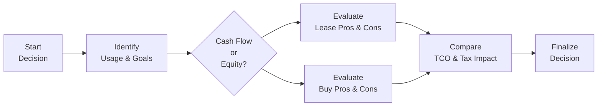

## 3.3 Understand a Lease-versus-Buy Situation

So, I still remember a friend who called me late one evening — she was stuck comparing lease offers and loan rates for a new car and felt overwhelmed about what to choose. Honestly, it’s one of those decisions many people face at some point, whether for a personal car, a family minivan, or even business equipment. Should you lease or should you buy? And maybe you’re sitting there, sipping your coffee and wondering the same thing. Let’s unpack the essentials and see which route could make the most sense.

### Laying Out the Basics

A lease is basically a contractual agreement that allows you to use an asset in exchange for regular payments over a set term. Buying (by using cash or financing) leads to full ownership — sometimes with a loan or mortgage attached, sometimes outright if you’ve got those extra funds saved.

In the context of debt planning (see also 3.1 on The Use of Credit), understanding lease-versus-buy decisions is essential for anyone aiming to manage liabilities effectively. The choice affects your net worth (arguably also relevant to 2.1 Net Worth Planning), personal or business cash flow (2.3 Cash Management Planning), and future obligations. It might even have broader implications if you’re planning to borrow to invest (3.4 Borrow to Invest) or if you want to preserve liquidity for tax-sheltered investments (see 6.1 Tax Planning Strategies).

Below, we’ll compare the two options in depth, discuss tax consequences, examine total costs, and provide practical examples that apply to both personal and business contexts in Canada.

---

### Key Drivers in the Decision

There isn’t a one-size-fits-all answer here. The right choice depends on a few key factors:

• Total Cost of Ownership (TCO): Depreciation, financing or leasing costs, maintenance, repairs, insurance, and any relevant taxes or fees.  
• Usage Period: Do you plan to use the asset for only a few years or keep it for a decade or more?  
• Cash Flow and Liquidity: How much can you pay up front? Can you handle monthly financing costs, or do you prefer minimal initial cash outlay?  
• Flexibility vs. Ownership: Do you need the freedom to modify or use the asset extensively without restrictions?  
• Tax Advantages: Especially relevant to business owners, who can write off certain costs such as lease payments or depreciation.

Think of it as a balancing act — you’re trying to weigh short-term advantages (like lower monthly payments) against long-term benefits (like building equity in the asset).

---

### Lease: Pros, Cons, and Common Situations

Leasing is essentially paying for the asset’s depreciation plus interest for the period you use it. You’ll typically sign a contract for a certain term (for example, three or four years for a car, or several years for a piece of business equipment).

#### Potential Advantages of Leasing

• Lower Monthly Payments: Since you’re effectively paying for the depreciation over the lease term, your monthly outlay is usually lower than a loan payment on a purchase of the same item.  
• Lower Upfront Costs: Most leases require minimal or no down payment, which may free up cash for other investment or lifestyle needs.  
• Frequent Upgrades: You can lease an asset, use it for the duration, then walk away or sign a new lease for a newer model. This is especially appealing for rapidly advancing technology, like specialized business equipment or the latest car model.  
• Possible Tax Deductions for Businesses: Lease payments are often tax-deductible as business expenses (see Canada Revenue Agency [CRA] guidelines at https://www.canada.ca/en/revenue-agency.html). Keep in mind there are limits on lease deductibility for vehicles and other specific equipment.

#### Potential Disadvantages of Leasing

• No Ownership Equity: After the term, you generally return the asset unless you choose to buy it outright at the residual (end-of-lease) value. You don’t build equity.  
• Restrictive Terms: Mileage caps on vehicles, regulations around usage or modifications, potential fees for wear and tear, etc. A family with a rambunctious toddler or two might discover that “excessive wear” can be pretty expensive!  
• Potential End-of-Lease Costs: If you exceed the mileage allowance or return the asset in poor condition, you could face hefty charges.  
• Ongoing Commitments: If you lease again and again, you’re perpetually locked in monthly payments.

---

### Buy: Pros, Cons, and Common Situations

Buying can be done with cash you have on hand or by financing through a loan. Let’s break it down.

#### Potential Advantages of Buying

• Building Equity: As you pay down your loan or if you buy with cash, you own the asset. You could eventually sell it, trade it in, or pass it on.  
• Freedom of Use: Want to repaint your car hot pink? Switch out the sound system? Go for it — you’re the owner.  
• Potential Long-Term Savings: If you keep the asset for many years, continuing to use it well past when lease payments would have ended, you could come out financially ahead.  
• Financing Flexibility: With historically low interest rates (though they can fluctuate), you might secure a favorable loan. Meanwhile, you can allocate your savings toward other investments.

#### Potential Disadvantages of Buying

• Higher Monthly Payments (If Financed): Because you’re paying for the entire cost of the asset, not just depreciation, monthly payments can be substantially higher.  
• Upfront Cash: If you decide to pay cash, you tie up capital that could have earned returns in other investments or supported your liquidity.  
• Depreciation Risk: Some assets, especially vehicles, can depreciate quickly. You’re on the hook for the difference in value if you need to sell or trade in earlier than expected.  
• Maintenance and Repair Costs: Once warranties expire, you take on all those costs.

---

### A Closer Look at Total Cost of Ownership (TCO)

One of the biggest misunderstandings is focusing solely on monthly payments or short-term costs. Yes, lease payments might be lower, but the overall TCO matters just as much. This includes:

• Depreciation  
• Interest/financing costs  
• Insurance premiums  
• Maintenance (regular service, replacement parts)  
• Potential end-of-lease fees and extended warranties  
• Opportunity cost (if you spend savings on buying, you lose potential investment returns)

For a basic illustration, imagine you’re considering a family van. Both the lease and finance scenarios carry an interest rate of, say, 5%. The lease might be $400/month, while a purchase loan might be $600/month — but after four years, in the purchase scenario, you’ll own a van that might be worth something on the used market, whereas in the lease scenario, you return it. Weigh the final data points carefully. Sometimes, the difference can be surprising.

---

### A Quick Net Present Value (NPV) Check

If you want to get fancy, you can compare the present value of the total lease costs versus the present value of the total purchase costs (including any down payments, maintenance, and final salvage value). A simplified formula for the monthly payment on a standard loan is:


\text{Monthly Payment} = \frac{P \times i}{1 - (1 + i)^{-n}}


• \\(P\\) = principal or original amount financed  
• \\(i\\) = monthly interest rate (annual rate divided by 12)  
• \\(n\\) = total number of monthly payments in the term

For a deeper look, you might discount each future cash flow and compare which scenario has a lower net present cost. If math isn’t your idea of a good time, fear not — there are free or low-cost lease-versus-buy calculators out there from major banks or finance websites. They plug in all these variables for you. (Also see recommended calculators via RBC, BMO, or even third-party tools.)

---

### Residual Value: The Hidden Gamechanger

Residual value is basically what the asset is estimated to be worth at the end of your lease term. A high residual value can make your monthly lease payments lower, since you’ll be financing less of the depreciation. But it can also make it expensive if you try to buy the asset at the lease’s end. On the flip side, if you purchase an asset — especially one that holds its value well — you might reap a nice chunk of money down the line if you ever decide to sell.

---

### Tax Considerations in Canada

Business owners take note: If you’re leasing an asset primarily for business purposes, you might deduct some or all of that lease cost from your taxable income (subject to CRA guidelines). There are, however, limits on the maximum monthly amount you can claim for a leased passenger vehicle. Also, the CRA will only allow deductions if the asset is truly for business use.  

On the buying side, you might claim a Capital Cost Allowance (CCA) to account for depreciation on a purchased asset. The rules differ for vehicles and other classes of property, so always check the CRA’s guidelines and be prepared to back up your claims with thorough records. (For more on compliance issues, see the references at the end of this section or consult a tax professional.)

---

### Lifestyle and Business Requirements

To me, this might just be the biggest deciding factor: your personal or business goals. For instance, let’s say you’re an up-and-coming professional with client-facing responsibilities. Maybe you want a new vehicle every three or four years so you look modern and professional in your field. Leasing might be more economical because you avoid large outlays every few years, and you don’t have to worry about selling or trading in a used vehicle.  

Now consider a family with young kids: They may prefer stability. They can buy a sturdy vehicle, endure the “rough love” inflicted by kids, then drive it for a decade. In the end, that approach might lead to overall savings because monthly costs will eventually drop to zero once the loan is fully paid off.  

From a business angle, entrepreneurs might find leasing heavy machinery beneficial for preserving working capital. However, if the machinery or equipment holds its value and is crucial to your operations for over a decade, it might make more sense to buy and capitalize on the CCA you’ll claim on the asset’s depreciation.

---

### Let’s Do a Quick Real-World Example

On a personal note, I once debated leasing a new sedan that was listing for \$35,000. The lease option was \$400/month for four years with an optional buyout of \$18,000 at lease end. The finance option was \$660/month for five years to own outright, with no balloon payment.  

• Lease Route: After four years, I’d have paid \$400 × 48 = \$19,200. If I wanted to keep the car, I’d pay \$18,000. That puts me at \$37,200 total, though the vehicle might be worth \$20,000 if well maintained. If I didn’t buy it, I’d basically have spent \$19,200 and walked away.  

• Buy Route: After five years at \$660/month, that’s \$39,600. Then the car (by that time) might be worth \$12,000 on the used market. My net cost is effectively \$27,600 ( i.e., \$39,600 – \$12,000).  

If I stop the buy analysis at year four, I still haven’t fully paid off the loan, but I have built equity in the vehicle. So, you see how it can hinge on your plans: Is that car going to serve me for years seven, eight, or even nine? Do I like the feeling of no monthly payment in the future? Or do I prefer the convenience that a lease arrangement offers?

---

### Diagram: Simplified Lease-vs-Buy Decision Flow

Below is a quick visual diagram to help you think of the key steps. It’s quite simplified but should illustrate the general flow:

As shown, you start with your usage goals (A → B). Then, you check if you prefer more monthly flexibility (C → D) or prefer building ownership (C → E). Finally, you compare the total cost of ownership (TCO) and any tax consequences (D & E → F), and hopefully make your final call (F → G).

---

### Common Pitfalls and How to Avoid Them

• Ignoring Maintenance and Wear-and-Tear: Lease contracts can penalize you if the asset is returned in below-acceptable condition. Factor that in.  
• Overlooking Insurance Costs: Premiums can vary based on the financing or leasing arrangement. Double-check with your insurer.  
• Underestimating the Duration of Use: If you’re unsure how long you’ll need the asset, that complicates the cost-benefit calculation.  
• Not Checking CRA Limits: If you’re deducting lease payments and the monthly lease cost is above the CRA’s threshold for passenger vehicles, for example, you might not be able to deduct the entire payment.  
• Not Considering the Opportunity Cost: Especially for big-ticket items, paying cash might tie up funds you could invest or use for other financial goals.

---

### Additional Resources and References

If you’re curious about official regulations or want to see real-world guidelines, consider these:

• [Canada Revenue Agency (CRA)](https://www.canada.ca/en/revenue-agency.html) – for rules on tax deductions, lease payment deductibility, and capital cost allowance.  
• [Industry Canada](https://www.ic.gc.ca/eic/site/icgc.nsf/eng/home) – for business financing and consumer regulations.  
• [Canadian Investment Regulatory Organization (CIRO)](https://www.ciro.ca/) – Canada’s present-day self-regulatory body overseeing investment dealers and mutual fund dealers. (Historical references, including the MFDA and IIROC, are now defunct.)  
• Lease-Versus-Buy Calculators – major Canadian banks often provide online tools to run different scenarios.  
• “Canadian Business and the Law” by Dorothy DuPlessis et al. – a helpful textbook for understanding contractual obligations, especially in a Canadian legal context.  

For small-business-specific questions, you might also look ahead to “Financial Planning for Small Business” (see Chapter 15), as well as tax planning insights in Chapters 6 and 7.

---

### Final Thoughts

Anyway, if you’re like my friend who nearly lost sleep over the question, “Should I lease or buy?” — remember there’s no universal right answer. It boils down to how you prioritize monthly affordability, long-term ownership, cash flow needs, and, of course, lifestyle preferences. With a bit of research (and maybe a quick chat with a financial planner — or a friend who’s been there), you can make a decision that aligns with your goals.

And hey, if you’re still unsure, using a spreadsheet or an online lease-vs-buy calculator is a straightforward first step. Compare all the costs, weigh your comfort with risk and usage restrictions, consider the tax angles, and see where that leads you. You’ve got all the tools. Now it’s just about putting them into practice.

---

## Test Your Knowledge: Lease vs. Buy Essentials



### Comparing the total cost of ownership (TCO) between leasing and buying generally requires you to:

- [ ] Consider only the monthly payment in each scenario.
- [x] Examine depreciation, financing costs, maintenance, insurance, and potential residual value. 
- [ ] Add just financing charges to the retail price of the asset.
- [ ] Focus solely on the interest portion of lease payments.

> **Explanation:** TCO includes all relevant costs, such as depreciation, interest or lease fees, maintenance, and insurance. Ignoring any of these factors can skew your final decision.

### Which of the following is typically an advantage of leasing an asset?

- [x] Lower monthly payments than buying. 
- [ ] Automatic full ownership of the asset after the lease.
- [x] Potential tax deduction if for business use.
- [ ] The asset will always appreciate, guaranteeing profit.

> **Explanation:** Leasing usually has lower monthly payments and potential tax benefits (if used for business and within CRA guidelines). However, you won’t automatically own the asset unless explicitly stated in the lease contract, and assets like vehicles usually depreciate.

### Why might a family prefer to buy, rather than lease, a vehicle?

- [x] They can keep the vehicle longer once it is paid off.
- [ ] They want to pay more in monthly costs indefinitely.
- [ ] They prefer to keep mileage restrictions.
- [ ] They want to lose money on depreciation.

> **Explanation:** Families often value long-term stability. After making monthly payments (if financed), they eventually own the vehicle outright and no longer have recurring lease obligations or mileage restrictions.

### When conducting a lease-vs-buy analysis, which factor is NOT typically considered?

- [x] The color of the paint as it affects insurance rates in the next province.
- [ ] The impact of interest rates on monthly payments.
- [ ] The possibility of mileage or usage restrictions in a lease.
- [ ] Potential tax write-offs if used for business purposes.

> **Explanation:** Interest rates, usage restrictions, and tax implications all matter, while paint color has little to no bearing on a standard lease-vs-buy analysis (unless your insurer has some extremely unusual policy!).

### A lease contract usually involves:

- [x] Paying for the asset’s depreciation plus interest.
- [ ] Immediately owning the asset outright.
- [x] An option (in some cases) to purchase the asset at lease-end.
- [ ] No monthly payments but a large lump sum at the end of the term.

> **Explanation:** Lease payments primarily cover depreciation and interest. Some leasing agreements include a buyout option, but typically, you do not own the asset unless you pay that amount.

### For Canadian business owners, which statement is TRUE regarding taxes on leased vehicles?

- [x] A portion of lease payments can be deducted, up to CRA limits.
- [ ] All leased vehicles can be fully deducted, with no limit.
- [ ] Mileage restrictions do not apply to any leased vehicles.
- [ ] The CRA does not allow vehicle lease deductions under any circumstance.

> **Explanation:** Canada Revenue Agency (CRA) allows business owners to deduct a portion of their lease payments, subject to prescribed limits and compliance conditions.

### What happens if you exceed the mileage cap in a typical vehicle lease?

- [x] You may be charged an additional fee per kilometer.
- [ ] You have no option to keep the vehicle at the end.
- [x] The CRA can waive future lease payments.
- [ ] You automatically convert to a purchase.

> **Explanation:** Most vehicle leases charge an additional per-kilometer fee if you exceed the agreed-upon mileage limit. This can significantly increase your costs.

### When might buying result in better long-term savings than leasing?

- [x] If you plan to keep the asset for many years after it is paid off.
- [ ] If you always need the latest technology and plan to upgrade constantly.
- [ ] If you prefer to use the asset only during its most reliable years.
- [ ] If you want reduced monthly payments.

> **Explanation:** One of the best arguments for buying is the long-term cost savings that come when you own the asset after financing. With leasing, you perpetually pay and never fully own the item unless you buy it at lease-end.

### Which of the following is considered a potential pitfall of leasing?

- [x] End-of-lease fees for excessive wear and tear.
- [ ] Building equity in the asset over time.
- [ ] Having a shorter contract term than typical financing.
- [ ] Consistent monthly payments with no final balloon payment.

> **Explanation:** With leasing, you don’t build equity, and you can face additional charges for excess wear and tear. Shorter lease terms can sometimes be a pro, depending on your needs, but it can also lead to repeated leasing cycles and never-ending monthly bills.

### Leasing a vehicle for business can be preferable over buying it if:

- [x] True
- [ ] False

> **Explanation:** This can be true in situations where cash flow is tight, the vehicle needs frequent upgrades, or the business can benefit from the lease payment deductions (subject to CRA rules). However, individual circumstances vary, so it’s not automatically the best choice for everyone.


