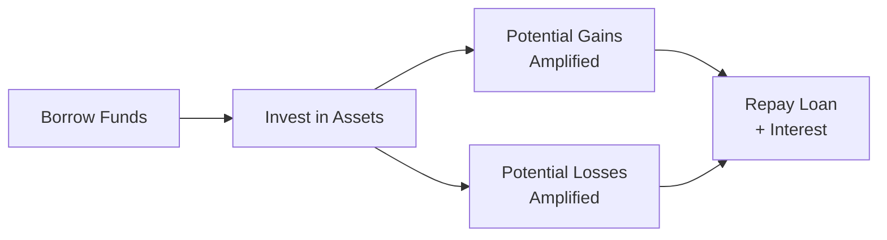

## 3.4 Borrow to Invest

Borrowing to invest—often called leveraged investing—can be a powerful strategy to potentially magnify returns. But as with any powerful tool, leverage has its pitfalls. If the investments underperform, you still have to repay your loan plus the interest you racked up. I remember meeting a friend—let’s call her Sarah—who learned this lesson the hard way during a market downturn. She’d taken out a hefty line of credit to buy into a “can’t miss” tech pick, confident she’d double her money in no time. Fast-forward a year, and she found herself facing a big chunk of debt plus a share price that had stumbled badly. In this section, we’ll explore how this strategy works, how it can fit into a Canadian financial plan, and what to consider to ensure that any borrowing approach aligns well with a person’s risk tolerance, time horizon, and life goals.

  
### Understanding Leveraged Investing  

Leveraged investing is the practice of investing with borrowed funds. The theory behind it is straightforward: if you can borrow money at a rate lower than the returns you expect to make in the market, you can amplify your returns. Suppose you borrow at 4% annual interest, and your investments earn an average annual return of 7%. You net a 3% return on the borrowed funds, in theory.

But—and this is a big “but”—if things go sideways and your returns dip below the cost of borrowing (or go negative), you risk magnifying your losses. You might end up underwater, having to pay back the original loan and interest out of pocket. This risk dimension is what makes leveraged investing a strategy best reserved for certain conditions and certain investors.

  
### The Canadian Context: Tax Considerations  

In Canada, one main incentive for borrowing to invest is the potential tax deductibility of investment loan interest when the borrowed funds purchase income-producing investments. The Canada Revenue Agency (CRA) sets guidelines about which situations qualify. Generally, if you borrow funds exclusively to purchase assets that have the potential to generate taxable investment income (like dividends or interest), that interest can be claimed as a deduction on your tax return.

Yet it’s not an all-or-nothing arrangement:  
• The borrowed funds have to be used for eligible investments.  
• The investment must have the potential to earn income (rental property, stocks that pay dividends, etc.).  
• The interest expense must be reasonable and supported by documentation.  

If you venture into margin loans—a typical scenario with some brokerage accounts—then you might have additional paperwork to manage. The key is maintaining meticulous records to clarify what portion of your debt is actually generating income or was used specifically for investment. For an in-depth breakdown, see the Canada Revenue Agency’s website (https://www.canada.ca/en/revenue-agency.html) or consult with a tax professional.

  
### Who Should Consider Borrowing to Invest?  

Not everyone is a good candidate for leveraged investing. A few basic filters come to mind:

• Risk Tolerance: If simply seeing your portfolio value dip by 5% knocks you off your seat, leveraging might cause you too many sleepless nights. Leveraged positions exaggerate both gains and losses, so you should have a stomach for volatility.  
• Time Horizon: Borrowing to invest might be more suitable for folks with a longer timeline—think 5 to 10 years or more—so they can ride out fluctuations. Short-term horizons make the interest costs riskier.  
• Cash Flow Stability: In Canada, you might be able to deduct interest costs for certain loans. But you still have to pay that interest. If your paycheck is already tight, having an extra monthly liability could be stressful.  
• Overall Debt Burden: Before leveraging, re-check other debts (like mortgages, credit cards, or car loans). If they carry high interest or large monthly obligations, layering on more debt might not be wise.  

  
### The Role of Asset Allocation  

Before you leap in, step back and think about asset allocation. Borrowing to invest is not about throwing all your borrowed money into a single stock. It’s about working within the context of a balanced asset mix. Check out Chapter 5 on Investment Management for a refresher on portfolio theory, diversification, and performance measurement. A properly allocated portfolio helps mitigate some risk while still offering growth potential.  

  
### Stress Testing Your Plan  

Let’s be honest: interest rates don’t remain static. If your plan hinges on, say, a 4% borrowing rate, what happens if rates creep to 6% or 7%? Suddenly, that carefully forecasted margin between cost and returns narrows. It’s a good practice to do a “stress test”—plug in a few alternative scenarios:  

• Scenario A: Interest +2% higher than your base assumption.  
• Scenario B: Short-term investment returns that are half your original forecasts.  
• Scenario C: Both happen at once—a double whammy.  

If your plan can survive these stress tests or if you have a safety net (like enough leftover cash flow or a readily available line of credit that can handle a shortfall), that’s encouraging. If it collapses under moderate changes, you may want to rethink the scope of your leverage.

  
### Example: Tax-Related Impact of Loan Interest  

Let’s walk through a simplified scenario. Carlos borrows C$50,000 at a 5% interest rate to invest in an exchange-traded fund (ETF) that pays an average 2% annual dividend and sees about 6% average annual capital appreciation.  

• Annual interest cost on the loan = C$50,000 × 5% = C$2,500.  
• Suppose the ETF’s total annual return (capital gains + dividends) = 8%. That’s C$4,000 in total gains.  
• If it qualifies, Carlos can deduct the C$2,500 interest on his tax return. Assume his marginal tax rate is 30%. He effectively recovers C$750 in tax savings (C$2,500 × 30%).  

So effectively, his net interest cost is C$1,750 (C$2,500 – C$750). If the ETF indeed returns 8% (C$4,000), his “net” profit from the investment (ignoring capital gains taxes on sale or any other costs) looks like around C$2,250. That’s a simplified glimpse, but it helps illustrate how borrowing costs can be buffered by tax savings when interest is deductible.  

Yet, if the ETF only returns 2–3% or even goes negative, this rosy scenario quickly fades. He’d still have to pay that C$2,500 in interest annually, interest deductibility or not.

  
### Emotion and Market Timing  

When you borrow to invest, it’s not enough just to do the math. Humans are emotional creatures, myself included. Investors who take leverage sometimes feel extra pressure if markets dip—“Should I sell everything now?” or “Should I buy more, double down?” Without a clear plan, fear and greed can lead to poor decisions. That’s why continuous monitoring and periodic rebalancing are crucial. See Chapter 5.3 on Measuring Portfolio Performance for tips on how to track and evaluate ongoing results.

  
### Case Study: Bear Market Blues  

Imagine an investor named Avni who borrows money in early 2022 expecting strong returns from an energy sector ETF. But soon after leveraging her portfolio, oil demand weakens due to unforeseen global events, and share prices slump by 20%. She faces not only the paper loss in her initial investment, but also an obligation to keep paying monthly interest on the borrowed funds. Meanwhile, her confidence gets battered. The moral: Avni’s net worth can quickly drop if the decline persists, and if she’s forced to liquidate to cover the loan or interest payments, she might lock in losses permanently.  

  
### Forms of Leverage  

Below are a few ways people in Canada commonly borrow to invest:

• **Margin Loans**: Brokerage firms let clients borrow a portion of the cost of stocks or other securities. The securities themselves serve as collateral. However, if your holdings drop below a certain limit, you might get a margin call, forcing you to deposit more funds or sell assets.  
• **Home Equity Lines of Credit (HELOCs)**: Some homeowners tap into their home equity for investment capital. Interest rates may be relatively lower than unsecured loans, and interest might be tax-deductible if the borrowed funds are used strictly for eligible investments.  
• **Investment Loans**: Financial institutions sometimes offer specialized investment loans for individuals with certain asset levels or existing accounts. The terms, interest rates, and collateral requirements vary.  

  
### The Legal and Regulatory Landscape  

In Canada, the newly established Canadian Investment Regulatory Organization (CIRO) oversees investment dealers and looks after market integrity across equity and debt marketplaces. Advisors must comply with CIRO’s regulations on leverage practices, especially when they recommend borrowing to invest. Failure to provide adequate disclosure or to assess suitability can result in regulatory penalties.  
   
You’ll also find valuable resources and guidelines from your provincial securities commission, clarifying how advisors and dealers should handle leveraged investing, from explaining the risks to prospective clients to ensuring that documentation is in order.  

  
### Keeping Safety Nets in Place  

One big principle: you don’t want to compromise your emergency fund or other essential insurance measures just to invest on margin. Life is unpredictable, so consider how big your “rainy-day fund” should be. If you get laid off or face a major medical expense, you still need to manage your monthly debt servicing.  

You might also want to ensure you have proper insurance coverage. (For example, see Chapters 10 through 13 regarding life insurance, disability insurance, and general insurance considerations.) You don’t want to lose your home or your health coverage if your leveraged strategy gets caught in a storm.

  
### Practical Tips for Borrowing to Invest  

• Align with Your Financial Goals: Don’t leverage just because you heard a friend making easy money. Make sure any borrowed funds truly fit into your overall financial plan. Revisit Chapter 1 on setting client goals.  
• Monitor Your Ratios: Keep an eye on your total debt service ratios. If your monthly debts consume too big a chunk of your monthly income, you’re in dicey territory.  
• Avoid Over-concentration: Diversify your investments. This rule is paramount when using borrowed money, because the stakes are higher.  
• Have an Exit Strategy: Market conditions can shift quickly. Understanding when you’ll close positions, how you’ll repay the loan, or if you’ll hold your levered position for the long haul is key to avoiding panic.  
• Continuously Educate Yourself: Keep an eye on updates from CIRO (https://www.ciro.ca/) on leveraging guidelines, CRA bulletins on interest deductibility, and any relevant provincial securities commission updates.  

  
### Visualization: Amplified Risk and Return Flow  

Below is a Mermaid diagram illustrating how leveraged investing can amplify both gains and losses:

In this diagram, the starting point is borrowing funds (A). That borrowed capital goes into investments (B). Ideally, you want to see amplified gains (C) and remain mindful that losses (D) can become amplified just as easily. In either scenario, you still have the obligation to repay the loan plus any interest accrued (E), which remains non-negotiable.

  
### A Brief Word on Real Estate Investing as Leverage  

Real estate is another popular domain for leveraged investing in Canada. When you buy an investment property, you effectively use a mortgage to finance a substantial portion of the purchase price. Potentially, you benefit from both rental income and property value appreciation. The same principles apply:  

• Watch interest rates. A jump in your mortgage rate can cut into your cash flow.  
• Maintain a buffer for property expenses (maintenance, taxes, insurance).  
• Ensure that if tenants miss payments or the property stays vacant, you can still manage mortgage payments.  

Real estate leverage can be especially potent, but it’s not immune to risk. A dip in market values could leave you with negative equity. If you’re forced to sell in a down market, you could come out behind.

  
### Seeking Professional Guidance  

It’s usually wise to talk with a qualified financial planner or a tax professional before you jump into borrowed-money strategies. They can advise on:

• Your personal risk profile.  
• The tax implications of your plan.  
• Whether your existing debts are structured optimally.  
• How to integrate borrowing to invest without jeopardizing your broader financial security.  

The Canadian Securities Institute (CSI) has specialized courses dealing with margin, securities lending, and leveraged investment strategies. If you’re an advisor, taking these courses ensures you understand the complexities involved.  

  
### Additional Resources  

• **CIRO** (https://www.ciro.ca/): Canada’s self-regulatory body for investment dealers, overseeing how advisors handle leveraged investments.  
• **Provincial Securities Commissions**: Provide compliance guidelines specific to each region.  
• **CRA** (https://www.canada.ca/en/revenue-agency.html): Provides official rules on the tax deductibility of interest.  
• **Investopedia** (https://www.investopedia.com): Check out “Margin Trading and Leverage” for a global perspective on best practices.  
• **Recommended Book**: “Tax-Efficient Investing for Canadian Investors” by Bryan Lee.  
• **Online Courses**: The Canadian Securities Institute offers specialized modules on using margin and leveraged strategies safely.

  
### Putting It All Together  

Leveraged investing unfolds at the intersection of finance, psychology, and careful planning. It can deliver outsized returns when markets rise or hamper portfolios severely during downturns. The key is to ensure that adding leverage fits into a broader strategy that includes robust emergency savings, proper insurance, and a realistic view of what debt servicing entails.

If you’re a financial professional, you also have a duty to guide clients responsibly, abiding by CIRO and provincial securities rules. Borrowing to invest can quickly become a high-risk proposition if rushed into blindly. But when carefully planned, stress tested, and continually monitored, leveraging can be a valid strategy for investors seeking to boost their long-term growth potential.

---

## Test Your Knowledge: Borrowing to Invest Strategies



### Which of the following best describes leveraged investing?
- [ ] Investing solely in low-risk government bonds.  
- [x] Using borrowed funds to purchase assets in order to amplify returns (and losses).  
- [ ] Buying an index fund with only your own capital.  
- [ ] Reducing overall market exposure to lower volatility.  

> **Explanation:** Leveraged investing refers to using borrowed funds to potentially amplify gains (or losses).

### What is one potential tax advantage of borrowing to invest in Canada?
- [ ] You can deduct 100% of your capital losses from employment income.  
- [x] Interest on loans for eligible income-producing investments may be tax-deductible.  
- [ ] You can deduct the principal payments on your loan.  
- [ ] You can only claim loan interest deductions if you buy shares of foreign companies.  

> **Explanation:** The CRA allows deduction of interest on loans used to purchase eligible income-producing assets, helping reduce net borrowing costs.

### What is a margin call?
- [ ] A legal requirement to reinvest all dividends automatically.  
- [ ] A penalty fee for investors who borrow from multiple lenders.  
- [x] A demand from your brokerage to deposit more money or sell securities when account equity falls below a certain level.  
- [ ] A reward program that reduces interest rates the longer you hold your investment.  

> **Explanation:** In a margin account, if your holdings lose value and your equity drops below the broker’s requirements, you get a margin call to increase your collateral.

### Which of the following is an important step before deciding to leverage investments?
- [ ] Closing all other lines of credit automatically.  
- [ ] Guaranteeing a minimum 10% annual return on your chosen investment.  
- [x] Stress-testing the potential impact of interest rate increases and market downturns.  
- [ ] Only borrowing from non-traditional lenders to keep your finances private.  

> **Explanation:** Proper planning includes evaluating how changes in interest rates and market performance affect your ability to repay and remain solvent.

### What makes real estate a levered investment?
- [ ] Real estate transactions are exempt from borrowing constraints.  
- [x] Mortgages allow buyers to purchase property largely with borrowed money, amplifying gains or losses.  
- [ ] Real estate never loses value.  
- [ ] Borrowers are not obligated to pay interest on mortgage loans if the property doesn’t appreciate.  

> **Explanation:** A mortgage is a form of leverage—using borrowed funds (with the property as collateral), which magnifies both potential gains and losses.

### Which option below is a key risk when you borrow to invest?
- [x] Magnified losses if the value of the investment declines.  
- [ ] Higher guaranteed returns from the borrowed capital.  
- [ ] Exemption from interest payments during a bear market.  
- [ ] Protection from any personal liability when investments lose value.  

> **Explanation:** Losses become more severe since you’re responsible for repaying the borrowed funds along with interest, regardless of the market being down.

### Under Canadian regulations, who oversees advisors in matters of leveraged investing?
- [ ] The historical Investment Industry Regulatory Organization of Canada (IIROC) that still operates independently.  
- [x] The Canadian Investment Regulatory Organization (CIRO).  
- [ ] The Canada Revenue Agency.  
- [ ] The Bank of Canada.  

> **Explanation:** CIRO, effective since 2023, is Canada’s national self-regulatory body for investment dealers, including oversight of leverage practices.

### To ensure suitability for leveraged strategies, an advisor should:
- [ ] Automatically recommend leverage to all new clients.  
- [ ] Encourage clients to use maximum leverage for maximum returns.  
- [ ] Dismiss any concerns about the client’s monthly debt obligations.  
- [x] Assess a client’s risk tolerance, goals, and cash flow before recommending leveraged investing.  

> **Explanation:** An advisor should perform proper due diligence, including analyzing a client’s financial position, risk appetite, and objectives to confirm whether leveraging is suitable.

### Which statement is usually true regarding interest rate fluctuations for those who borrow to invest?
- [ ] Rising rates only affect corporate borrowers, not individual investors.  
- [ ] Rates never impact margin loans.  
- [x] Increasing interest rates reduce the net return on borrowed funds, raising the risk of negative outcomes.  
- [ ] Interest rates and investment returns always move in the same direction.  

> **Explanation:** When rates climb, the cost of borrowing goes up. This can shrink or eliminate the margin between your investment returns and your borrowing costs.

### True or False: With leveraged investing, the obligation to repay the borrowed principal plus interest remains, even if your investment underperforms.
- [x] True  
- [ ] False  

> **Explanation:** The borrower always owes the lender principal and interest, no matter how the underlying investment performs.


