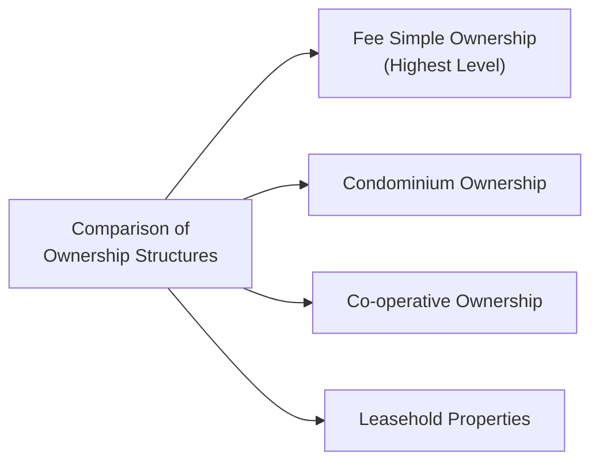
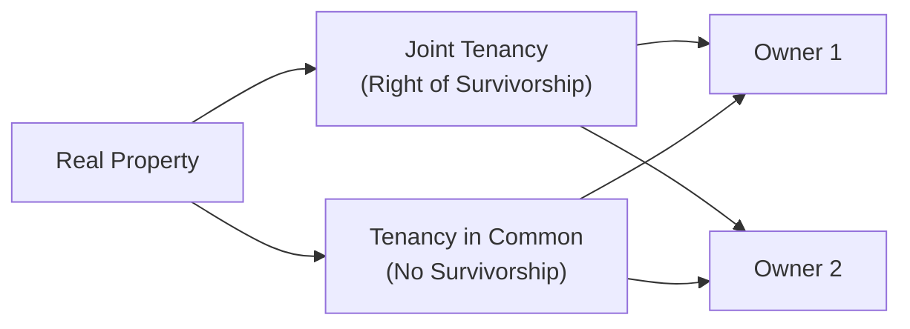

## 4.1 Legal Considerations of Owning Real Estate

It’s exciting to think about buying real estate—who doesn’t picture that beautiful family home with a cozy backyard or a sleek downtown condo with an incredible city view? But, um, before you plunk down your hard-earned savings (and possibly sign a 25-year mortgage!), it’s good to know exactly what you’re getting into. Real estate laws in Canada can feel complex. However, understanding them is critical to making solid financial decisions that align with your overall financial plan.

Below, we’ll dive into various forms of property ownership, ways multiple people can hold title, and important legal documents you’ll likely encounter along the way. I’ll share a few personal anecdotes and maybe a story or two—because real estate is, after all, about people and their dreams of home and financial security. Let’s jump in!

---

## Understanding Different Forms of Property Ownership

In Canada, there are several ways to hold real estate, each with its own unique legal structure, rights, and obligations. The form of ownership you choose will influence not only how you use the property but also your financial exposure, responsibilities, and long-term plans.

### Fee Simple (Freehold) Ownership

Fee simple is often described as the most “complete” form of property ownership. Honestly, this is what most people think of when they picture buying a standalone house. With fee simple ownership, you get the right to:
• Possess the property.  
• Use it as you wish (subject to local bylaws and zoning).  
• Transfer or pass it on to someone else in your will.

However, it’s not absolute. Municipal regulations (like noise bylaws, zoning, building permits, etc.) and private restrictions (e.g., easements that allow utility companies access to your land) can still limit what you can do. But generally, if you want to put up a fence, build a deck, or plant a little veggie garden, fee simple ownership gives you considerable freedom—just make sure you follow local building codes!

### Condominium (Strata) Ownership

Buying a condominium means you own your individual unit or suite, plus you share ownership of common areas such as hallways, gyms, rooftop terraces, or parking garages. You become a member of a condominium corporation (often called a “strata corporation” in some provinces like British Columbia). This corporation sets rules, manages maintenance, and collects monthly fees.

If you’ve ever visited a condo building with meticulously maintained lobbies, you’ll know those monthly fees pay for the cleaning and repairs in common areas. Of course, it also means you must live in harmony with condo bylaws—things like pet restrictions, noise control, or guidelines for renovating your unit could apply. I had a friend who once had to practically petition the entire condo board to allow a small dog. It was more complicated than you’d think, so definitely read those bylaws before you buy!

### Co-operative Ownership

In a co-operative, or “co-op,” you don’t own real estate in the traditional sense. Instead, you own shares in a corporation that itself owns the property. Your shares give you the right to occupy a specific unit. The corporation collectively decides how the building is managed (maintenance, renovations, and so forth).

Co-ops sometimes have strict rules about who can buy in, because your co-owners have an interest in ensuring the community remains stable and financially secure. Financing can also be trickier because you’re technically purchasing shares rather than real property. However, co-ops can provide a very communal, supportive living environment.

### Leasehold Properties

Leasehold properties typically occur on land owned by government agencies, First Nations communities, or trusts. Instead of purchasing the land outright, you lease the right to occupy and use the land for a:

• Defined term (e.g., 50 or 99 years).  
• Specific annual fee or lease payment.  

When the lease ends—maybe in 50 years—rights to the land may revert to the original owner. This form of ownership is fairly common for certain waterfront properties, land on Indigenous reserves, or university-owned housing lands. For many folks, the biggest question is: what happens when the lease period nears its end, and how does that affect the property’s value?

---

The diagram above shows four major ownership structures in Canada, each branching from a central node of “Comparison of Ownership Structures.”

---

## Multiple Parties Holding Title

Real estate is often owned by more than one person, whether they’re spouses, family members, business partners, or friends who want to buy a place together. It’s super important to understand how your title is registered, because it can have big legal and financial consequences down the line.

### Joint Tenancy (Joint Tenants with Right of Survivorship)

Joint tenancy is commonly used by married or common-law couples who want the property to pass automatically to the surviving partner upon one owner’s death. Each joint tenant technically owns an undivided 100% interest in the property (strange to imagine, but that’s how the law sees it). If one dies, the property automatically goes to the other—you don’t have to go through probate for that portion.

A friend of mine discovered just how helpful joint tenancy can be when her spouse passed away unexpectedly. Because they were joint tenants, she avoided the complexities of probate for their home. But keep in mind, once you put someone else on title as a joint tenant, you can’t just remove them if you have, you know, a falling out. So choose your co-owner(s) wisely.

### Tenancy in Common

Tenancy in common is different. Instead of each owner having an undivided 100% interest, each owner holds a specific percentage. For instance, you might own 50%, your sibling might own 30%, and your cousin might own 20%. Importantly, there is no right of survivorship. If one owner passes away, that person’s share goes to their estate—or to whoever inherits under their will or the rules of intestacy (the default rules if there is no will).

If you’re going in on an investment property with friends, you may choose tenancy in common so you each have your own chunk of ownership that can be passed to your beneficiaries if something happens to you.

---

In this diagram, the “Real Property” node leads to the two main forms of concurrent ownership: Joint Tenancy (with right of survivorship) and Tenancy in Common (no automatic survivorship).

---

## The Matrimonial or Family Home

Many provinces and territories in Canada have laws giving special legal protection to married or common-law spouses in the “matrimonial home” or “family home.” This is typically the property you both occupy and consider your primary residence. If you’re living in Ontario, for instance, the Family Law Act states that both spouses have an equal right to occupy the matrimonial home, and neither can sell or mortgage it without the other’s consent—regardless of who is on title.

When divorce or separation enters the picture, the value of that family home is generally subject to equal division. This can lead to a few surprises: sometimes, a spouse who’s not on title might still have significant rights to the property or a share of its value. Be sure to discuss these details in a prenuptial or cohabitation agreement if you want clarity (though “romantic” is not exactly the word I’d use to describe these legal documents, they can be extremely important to your financial plan).

---

## Key Legal Documents

When you purchase real estate in Canada, you’ll likely encounter several important legal documents. Familiarizing yourself with them is crucial:

• Purchase and Sale Agreement: The primary contract between buyer and seller. It sets out the purchase price, closing date, conditions (e.g., financing, inspection), and any other negotiated terms.  
• Title Search & Registration: This is how you confirm the seller owns what they say they own, and that there are no unexpected liens, caveats, or easements. Your real estate lawyer will typically conduct this search.  
• Mortgage or Charge: The legal document that gives the lender security against your property. If you fail to make mortgage payments, they can (in a worst-case scenario) take the property and sell it to recover the loan amount.  

I remember when I bought my first home, the thick stack of papers at the lawyer’s office was honestly intimidating. But they walked me through everything thoroughly, from the disclaimers about mortgage default insured through CMHC to the final signature. Make sure you get that same level of explanation so you really understand what you’re signing!

---

## Working with Professionals

### Real Estate Lawyer

Before finalizing any deal, it’s strongly advised to consult a real estate lawyer. They’ll:
• Review your Agreement of Purchase and Sale.  
• Perform the title search and ensure there are no unexpected liens or claims.  
• Prepare the mortgage documents and close the transaction on your behalf.  

They can also guide you if any red flags surface, like zoning issues or environmental concerns.

### Licensed Mortgage Broker

In Canada, mortgage brokers are licensed professionals who help you find a mortgage product that suits your financial situation. They’ll:
• Shop around at different lenders.  
• Explain various interest rate options (fixed vs. variable).  
• Clarify mortgage terms and prepayment options.  

The broker’s compensation typically comes from the lender, not the customer, but it’s still a good idea to compare quotes independently on open-source or free mortgage calculators (like the ones on the FCAC or major bank websites). That’s how you’ll know if you’re getting a good deal.  

In addition, if you’re working with a financial advisor who’s a member of the Canadian Investment Regulatory Organization (CIRO)—the current national self-regulatory body—be sure they integrate your mortgage into your overall financial plan. Coordinating your mortgage with your retirement savings, insurance needs, and investment strategy can help ensure you’re making financially sound decisions.

---

## Potential Risks

No property purchase is completely risk-free. Your job as a financial planner—or simply a careful buyer—is to identify these risks so you can reduce or avoid them where possible.

• Zoning and Bylaw Restrictions: Let’s say you want to renovate an old garage into a second suite. Municipal zoning laws might flag your property as single-use only. A quick call to the city’s planning department could save unhappy surprises.  
• Special Levies or Assessments in Condominiums: If the condo board decides major repairs are needed, such as redoing the roof or upgrading the HVAC system, each unit owner might have to pay a share. These costs can be substantial.  
• Property Defects: Undisclosed structural problems or environmental hazards (like mold or soil contamination) can be extremely expensive to fix. That’s why home inspections are crucial.  
• Spousal/Partner Rights: Even if your spouse or partner’s name isn’t on title, provincial family laws might entitle them to a share or limit your right to sell.  
• Lease Expirations (for Leasehold Properties): If a lease term is nearing its end, resale value could be affected, and your mortgage options might shrink.  

I’ve heard countless tales from families who overlooked a musty smell in the basement and then discovered a serious mold issue post-closing. An ounce of prevention truly is worth a pound of cure in real estate!

---

## Practical Real-World Example

Imagine you’re helping a couple—Emily and John—who are married and buying their first home. They want to set up their ownership as joint tenancy for that “automatic transfer” feature. Nevertheless, they’re also aware that in the event of a marital breakdown, their home is considered a matrimonial home under provincial family law, meaning they’ll each hold specific rights.

Now, the property is a freehold townhouse, so they don’t have to worry about condo fees or special assessments. But let’s say the property has a narrow driveway and local bylaws restrict expansions or structural changes. Emily and John might have been thinking about eventually adding a second-floor extension or renting out the basement. If local laws forbid that, it might impact their future plans or property values.

This example shows how these legal forms, ownership structures, and municipal restrictions can overlap, affecting everything from estate planning to property value and spousal rights.

---

## Glossary

• **Fee Simple (Freehold) Ownership**: The highest level of property ownership, allowing the owner to possess, use, and transfer the property, subject to government rules.  
• **Condominium (Strata) Ownership**: Ownership of a specific unit plus a shared interest in common areas.  
• **Co-operative Ownership**: Ownership of shares in a corporation granting occupancy rights to a specific unit.  
• **Joint Tenancy (with Right of Survivorship)**: A form of concurrent ownership where multiple owners each hold an equal and undivided share. If one dies, their share passes to the survivors automatically.  
• **Tenancy in Common**: Co-owners each hold a specific share of the property (which can be unequal). Each owner’s share can pass independently to their heirs.  
• **Matrimonial / Family Home**: A property used as the family residence by spouses or partners, often subject to special protections under family law.  
• **Encumbrance**: Any legal claim or lien on the property—such as a mortgage, tax arrears, or easements—that can affect ownership rights.  
• **Title Search**: Validates legal ownership and checks for any encumbrances on record.

---

## Additional Resources and References

• **Canada Mortgage and Housing Corporation (CMHC)**  
  Website: [https://www.cmhc-schl.gc.ca](https://www.cmhc-schl.gc.ca)  
  Offers information on mortgage insurance, homeownership guides, and real estate market data.

• **Financial Consumer Agency of Canada (FCAC)**  
  Website: [https://www.canada.ca/en/financial-consumer-agency.html](https://www.canada.ca/en/financial-consumer-agency.html)  
  Provides resources for homebuyers, mortgage checklists, and budgeting advice.

• **Provincial/Territorial Land Title Offices**  
  Look up local land title offices to perform title searches, check land ownership, and monitor encumbrances.

• **Open-Source Mortgage Calculators**  
  Many Canadian banks (e.g., RBC, TD) and the FCAC website host user-friendly mortgage calculators to help you compare different interest rates, payment schedules, and amortization periods.

• **CIRO (Canadian Investment Regulatory Organization)**  
  Website: [https://www.ciro.ca](https://www.ciro.ca)  
  For official updates and ensuring your financial advisor is current with national self-regulatory guidelines.

---

## Suggested Books and Courses

• **Real Estate Law for Financial Planners and Advisors (Canadian Edition)**  
  Explores advanced topics in Canadian property law, ownership structures, and case studies.

• **The Canadian Home Buyer’s Guide** (CMHC)  
  A comprehensive review of costs, legal considerations, and financial planning for new homeowners.

• **Online Courses** (Coursera, edX, etc.)  
  Look for courses on “Canadian Property Law Fundamentals” or “Real Estate Finance” to refine your expertise.

---

In my opinion, real estate ownership is one of those critical building blocks of a long-term wealth strategy in Canada. But every coin has two sides, right? Ownership can bring major financial benefits—appreciation, rental potential, and emotional security—but it comes with legal complexities and obligations that can be overwhelming if you don’t prepare. By understanding different ownership structures, your rights as an owner, and the formalities involved, you’ll be miles ahead in ensuring your real estate choices fit comfortably into your broader financial plan.

Anyway, that’s the story on legal considerations. Don’t be afraid to consult the pros—a qualified real estate lawyer, a licensed mortgage broker, and a financial advisor who can wrap it all into your overall financial strategy. Armed with reliable information, you’ll be that much closer to buying or advising on real estate like a seasoned professional.

---

## Test Your Knowledge: Legal Real Estate Essentials in Canada



### Which form of property ownership in Canada offers the most complete set of rights and is subject only to government or private restrictions?

- [x] Fee Simple Ownership (Freehold)
- [ ] Condominium (Strata) Ownership
- [ ] Co-operative Ownership
- [ ] Leasehold Property

> **Explanation:** Fee simple ownership provides the broadest bundle of rights, limited mainly by government bylaws and private easements.

### What key characteristic differentiates tenancy in common from joint tenancy?

- [ ] It applies to only one property at a time
- [ ] It requires more than two owners
- [x] It does not include the right of survivorship
- [ ] It is exclusively employed for investment properties

> **Explanation:** With tenancy in common, each owner holds a specific share passed to their heirs upon death, unlike joint tenancy, which features automatic survivorship.

### In a co-operative housing arrangement, what do buyers actually own?

- [ ] The land on which the building sits
- [ ] A specific unit within the building
- [x] Shares in a corporation that owns the property
- [ ] An interest in a lease that grants occupancy

> **Explanation:** Co-op buyers own shares in the corporation; those shares entitle them to occupy a specific unit.

### Why might a family lawyer caution a married couple about the "matrimonial home"?

- [ ] Because the title reverts to the bank at retirement
- [ ] Because resale requires condo board approval
- [x] Because special legal rules and spousal rights apply to its division
- [ ] Because the property must be passed down to children

> **Explanation:** Provinces often provide laws giving spouses equal rights to occupy and share the home's value in divorce or separation.

### What common risk do condominium owners face that freehold owners typically do not?

- [x] Special levies or assessments for communal repairs
- [ ] The risk of lenders foreclosing
- [ ] Zoning restrictions
- [ ] Increases in property taxes

> **Explanation:** Condo corporations can levy special assessments on unit owners to fund major repairs, a key difference from freehold ownership.

### Under joint tenancy with right of survivorship, when one co-owner dies, the deceased’s share:

- [x] Automatically transfers to the surviving co-owner(s)
- [ ] Must be sold on the open market
- [ ] Goes directly to the deceased’s children
- [ ] Requires approval from the condominium corporation

> **Explanation:** Joint tenancy includes automatic right of survivorship, meaning ownership passes immediately to the surviving tenant(s).

### Which of the following best describes a leasehold property?

- [ ] Ownership of the building but not the land
- [ ] A movable home, such as a mobile trailer
- [x] A right to use property for a set term, often on government or trust-owned land
- [ ] A short-term rental property

> **Explanation:** Leasehold property involves renting the land for a defined period, even though you might own structures on it.

### One advantage of working with a licensed mortgage broker is:

- [ ] They make all real estate laws irrelevant
- [ ] Their fee is always cheaper than the bank’s interest rates
- [ ] They guarantee no property inspection is needed
- [x] They can shop the mortgage application around to multiple lenders on your behalf

> **Explanation:** Mortgage brokers connect borrowers to different lenders, often finding better rates or terms.

### Why is a title search performed?

- [ ] To calculate interest on a mortgage
- [ ] To estimate property taxes for the following year
- [ ] To determine a listing price
- [x] To confirm legal ownership, check liens, and verify any encumbrances

> **Explanation:** A title search ensures the seller has clear title to the property and identifies existing encumbrances like liens or easements.

### True or False: In all Canadian provinces, if your name is not on the property title, you have no rights to the home.

- [ ] True
- [x] False

> **Explanation:** Many provinces offer statutory protections for matrimonial or family homes, granting spousal rights even if one spouse isn’t on title.


