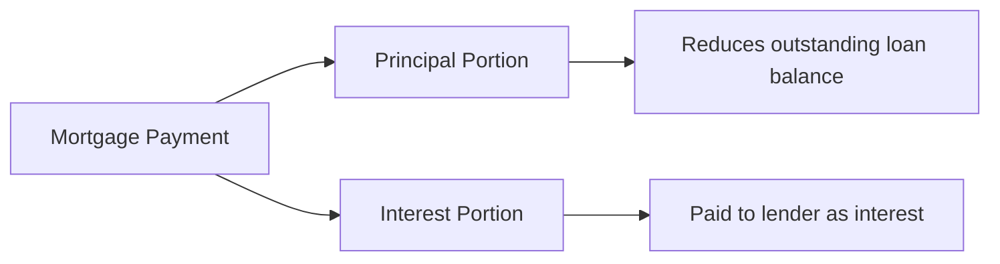

## 4.2 Mortgage Planning

Mortgage planning is such a pivotal part of financial well-being in Canada (and, honestly, most places around the world). I remember helping my aunt, who had always rented, decide whether to finally buy a place of her own. She was so nervous—believe me, she asked every question under the sun. We spent hours poring over mortgage rates, terms, and budgeting scenarios. That experience really drove home just how important (and sometimes downright intimidating) the mortgage process can be. So let’s break it down step by step and, hopefully, clear away a bit of that confusion.

### Mortgage Basics

A mortgage is essentially a secured loan used to purchase or maintain real estate, with the property itself acting as collateral. If the borrower fails to meet the loan obligations, the lender can claim the property. It’s a big commitment, so clarity on mortgage concepts is crucial.

• Principal: The original or remaining amount owed on your mortgage—the raw balance before piling on interest.  
• Interest Rate: The percentage the lender charges for lending you money. This may be fixed (locked in for the term), variable (moving with market rates), or adjustable (tied to a reference rate, which can reset at predetermined intervals).  
• Term: The length of time your mortgage rate and conditions are set. In Canada, terms commonly range from 1 to 5 years, though longer terms do exist.  
• Amortization Period: The total time it would take to pay off your mortgage in full if you follow your payment schedule as outlined. You’ll often see 25-year or 30-year amortizations in Canada.

If you picture a mortgage payment, a portion goes to paying off the principal (reducing the actual debt) and another portion goes to interest.

In the diagram above, the payment you make (A["Mortgage Payment"]) is split into principal (B["Principal Portion"]) and interest (C["Interest Portion"]). The principal portion chips away at the outstanding balance (D["Reduces outstanding loan balance"]), while the interest portion represents the cost of borrowing (E["Paid to lender as interest"]). Over time, with a typical fixed-rate mortgage, more of your payment gradually goes toward principal and less toward interest.

### Conventional vs. High-Ratio Mortgages

One of the first decisions you’ll likely encounter is whether your mortgage will be conventional or high-ratio.

• Conventional Mortgage:  
  – Requires a down payment of at least 20% of the property’s purchase price.  
  – Default (mortgage) insurance is not mandatory.  
  – Your loan-to-value ratio (LTV) is typically 80% (or lower) of the property’s value.

• High-Ratio Mortgage:  
  – Required if your down payment is less than 20%.  
  – Must be insured by an institution such as the Canada Mortgage and Housing Corporation (CMHC), Sagen, or Canada Guaranty.  
  – The added cost of insurance (often rolled into your mortgage payments) protects lenders if you default.  

An example: Suppose you want to purchase a condo for C$500,000 and can only put down C$50,000. Your loan is C$450,000, which is 90% of the condo’s value. You’ll need mortgage default insurance, making this a high-ratio mortgage. That insurance premium might be anywhere from a few thousand dollars up to about 4% of the loan amount, depending on how close to that 20% threshold you are.

### Methods to Reduce Interest Costs and Penalties

Nobody wants to throw money away on interest, right? So here are some strategies to consider if you’re looking to reduce the lifetime cost of your mortgage:

• Accelerated Payments:  
  – Instead of paying monthly, you might opt for accelerated weekly or bi-weekly payments.  
  – This can effectively squeeze in extra payments each year—great for cutting down the amortization period.  
  – For instance, a $2,000 monthly payment translates to $24,000 a year, but an accelerated bi-weekly schedule might result in paying around $26,000 to $27,000 each year, with the extra amount directly reducing principal.

• Lump-Sum Prepayments:  
  – Many mortgages allow a certain portion (e.g., 10-20% of the original principal) annually without penalty.  
  – Pop a one-time bonus into your mortgage principal, or maybe direct any tax refund to it.  
  – This is a pretty powerful way to save on long-term interest; you’re knocking out part of that principal before it racks up future interest charges.

• Refinancing or Renegotiation:  
  – If interest rates drop or your financial situation changes, you might consider refinancing to secure a better rate or change the amortization length.  
  – Watch out for penalties tied to breaking your mortgage early. Calculate carefully—sometimes the cost of the penalty might outweigh the interest savings, at least in the short run.

• Shortening the Amortization:  
  – Shortening your amortization from, say, 25 years to 20 years will mean higher monthly payments but often massive interest savings over the life of the loan.  
  – This strategy is best for individuals with stable incomes, who can confidently handle bigger payments.

### Mortgage Features and Clauses

It’s worth digging into a mortgage’s finer details—those small clauses can either save you money or create headaches if you don’t read the fine print.

• Portability:  
  – Lets you transfer your existing mortgage balance, interest rate, and terms to a new property if you move.  
  – Handy if you love your current interest rate and don’t want to break your mortgage.

• Assumability:  
  – Lets a new (qualified) buyer assume your mortgage if you sell the property.  
  – This can be a selling feature in a high-interest-rate environment because your buyer might jump at your lower rate.

• Prepayment Privileges:  
  – Allows you to pay extra on your mortgage (beyond the regular schedule) without penalty, often limited to a certain percentage of the original principal each year.

• Rate Conversion (for variable-rate mortgages):  
  – You can typically switch to a fixed rate if it looks like interest rates are going to climb.  
  – Conditions vary by lender, so always check the terms.

### Real Estate Investing and Self-Directed Mortgages

Maybe you’re thinking beyond just owning a primary residence: real estate can be a cornerstone of a broader investment portfolio. But proceed with a little caution—real estate investing can magnify gains and losses depending on market conditions, leverage, and your capacity for property management.

• Real Estate Investing:  
  – Rental Income: Potential monthly cash flow (if property is tenanted).  
  – Long-Term Capital Appreciation: Property values can increase over time, but, of course, they can also slip.  
  – Management & Expenses: Dealing with tenants, vacancies, repairs, and property taxes is no small matter. You should factor in property managers if you’re not up for those tasks yourself.  
  – Leverage: Taking out mortgages on multiple properties amplifies returns if the market rises but also amplifies losses if values or rental income drop.

• Self-Directed Mortgages:  
  – Certain registered accounts in Canada (like a self-directed RRSP) may hold a mortgage.  
  – With these setups, you might even borrow from your own RRSP to finance a mortgage on a personal property.  
  – There are strict rules from the Canada Revenue Agency (CRA). Typically, third-party trust companies administer these.  
  – Ensure compliance with all CRA requirements to avoid unintended tax consequences.

### Using Funds from Registered Retirement Savings Plans (RRSPs) to Purchase a Home

The Canadian Home Buyers’ Plan (HBP) is quite popular among first-time buyers. Honestly, it’s how I got my first place—I remember being so excited to use my RRSP funds as part of the down payment.

• Home Buyers’ Plan (HBP) Basics:  
  – Qualifying individuals can withdraw up to C$35,000 from an RRSP to purchase or build a first home.  
  – If you’re a couple and both qualify, that’s a potential combined withdrawal of $70,000.  
  – These withdrawals are tax-free as long as you repay them within 15 years.

• Repayment Requirements:  
  – You have to start repaying the annual portion of the withdrawn funds to your RRSP beginning two years after the withdrawal.  
  – If you miss a payment, that missed portion counts as taxable income for the year.

• Impact on Retirement Savings:  
  – Pulling money out of an RRSP reduces the funds compounding tax-free.  
  – Make sure you can realistically repay—or at least factor in how short-term depletion of your retirement pot might affect your long-term goals.

### Mortgage Planning Strategies

Below are some strategic moves that can help you or your clients stay on track:

• Debt-Service Ratio Analysis:  
  – Gross Debt Service (GDS) Ratio: The percentage of your gross income needed to cover housing-related costs (mortgage payments, property taxes, heating, and 50% of condo fees).  
  – Total Debt Service (TDS) Ratio: Takes the GDS calculation and adds any other debt obligations such as car loans or credit cards.  
  – The Office of the Superintendent of Financial Institutions (OSFI) offers guidelines under “Guideline B-20,” which sets recommended thresholds to ensure you’re not maxed out.

• Fixed vs. Variable Interest Rate:  
  – A fixed rate offers predictability—your payments stay the same over the term.  
  – A variable rate may be lower initially, but payment amounts (or the portion of interest vs. principal) can fluctuate if prime rates change.  
  – Think about your risk tolerance: If you sleep better knowing your payments won’t shift, a fixed rate might be best.

• Regular Mortgage Check-Ins:  
  – Schedule a review every few years or whenever you have a big life change (job change, new baby, or a big jump in income).  
  – Keep an eye on shifts in interest rates or your own financial situation—maybe you got a raise and can afford larger payments to shorten that amortization.

• Real Estate Investors:  
  – Plan for property taxes, rental income taxes, maintenance, and potential vacancies.  
  – Factor in capital cost allowance if looking at a long-hold strategy for taxation.  
  – Understand that real estate cycles can be volatile, so build contingency reserves.

### Glossary

• Principal: The amount you originally borrow or the current outstanding balance on the mortgage.  
• Amortization Period: The total time to be free of mortgage debt if payments are made as scheduled.  
• Term: The set number of years your mortgage rate and conditions remain in effect before renewal.  
• Refinancing: Replacing an existing mortgage with a new one, often to secure better terms or cash out some of the home’s equity.  
• Prepayment Penalty: A fee charged when you exceed allowable prepayments or break the mortgage before the term ends.  
• Home Buyers’ Plan (HBP): A federal program enabling tax-free withdrawals from RRSPs to fund the purchase of a principal residence.  
• GDS (Gross Debt Service) Ratio: The percentage of gross monthly income spent on key housing costs (mortgage, property taxes, heating, and half of condo fees).  
• TDS (Total Debt Service) Ratio: The chunk of your gross monthly income covering housing costs plus all other debt payments.  
• Default Insurance: Insurance coverage for lenders when the down payment is under 20%. It protects lenders in case of borrower default.

### References and Additional Resources

• Office of the Superintendent of Financial Institutions (OSFI):  
  – Visit https://www.osfi-bsif.gc.ca for guidelines on mortgage underwriting (Guideline B-20) and more regulatory details for Canadian financial institutions.  

• Canada Mortgage and Housing Corporation (CMHC):  
  – https://www.cmhc-schl.gc.ca  
  – Offers detailed guides on homebuying, mortgage loan insurance, housing market data, and more.  

• CIRO (Canadian Investment Regulatory Organization):  
  – https://www.ciro.ca  
  – The current national self-regulatory organization (SRO) for investment dealers and mutual fund dealers in Canada. (Note: Mortgage lending itself is not under CIRO’s direct purview, but CIRO maintains standards for overall financial advice, including budgeting, risk management, and suitability recommendations.)

• Financial Consumer Agency of Canada (FCAC):  
  – https://www.canada.ca/en/financial-consumer-agency/services/mortgages.html  
  – Great resource for mortgage calculators, interactive budgeting tools, and guidance on mortgage prepayment penalties.

• Open-Source Mortgage Calculators:  
  – Look for GitHub repositories or official FCAC calculators that help you compare amortization schedules, track your payments, or test prepayment scenarios.

• Books, Articles, and Courses:  
  – “The Canadian Mortgage Handbook” (updated editions from leading mortgage professionals).  
  – Articles on mortgage renewal strategies, penalty calculations, and more at FCAC’s website.  
  – Local real estate boards or continuing education programs offered by The Canadian Real Estate Association (CREA).

Mortgages might seem complex, but with a plan that aligns with your financial profile, you can navigate them with confidence. And honestly, it’s really about ensuring you stay informed about the many options, conditions, and “tricks” (like accelerated payments) that can keep your interest expenses down. Anyway, let’s deepen your understanding with a short quiz—feel free to skip around or confirm how much of this stuff you’ve really absorbed!

## Test Your Knowledge: Mortgage Planning Essentials



### Which of the following statements best describes a high-ratio mortgage?

- [ ] It requires at least 20% down payment.  
- [ ] It never requires default mortgage insurance.  
- [x] It involves a down payment of less than 20% and requires default insurance.  
- [ ] It only applies to commercial properties.  

> **Explanation:** A high-ratio mortgage is one where the borrower puts down less than 20%, meaning the lender typically requires mandatory mortgage default insurance.

### What is the main advantage of an accelerated bi-weekly payment schedule?

- [ ] It completely eliminates interest charges.  
- [x] It can shorten the amortization period and reduce total interest costs.  
- [ ] It extends the term to improve cash flow.  
- [ ] It reduces property taxes.  

> **Explanation:** With accelerated bi-weekly payments, you're effectively making an extra payment or two each year, which directly attacks the principal sooner and saves on total interest over time.

### Which of the following is true about mortgage refinancing?

- [x] It can be used to obtain a lower interest rate or change terms, but may involve a penalty.  
- [ ] It is always free of charge.  
- [ ] It only applies to variable-rate mortgages.  
- [ ] It is illegal in Canada.  

> **Explanation:** Refinancing replaces your current mortgage with a new one and may trigger a penalty if you break your contract. However, it can potentially save you money in the long run if rates have dropped significantly.

### How does default mortgage insurance protect lenders?

- [ ] By lowering the borrower’s interest rate.  
- [ ] By guaranteeing the borrower will always make payments on time.  
- [ ] By covering the home’s maintenance costs.  
- [x] By compensating the lender if the borrower defaults.  

> **Explanation:** Mortgage default insurance is specifically designed to protect the lender against losses in the event that the borrower can’t make their mortgage payments.

### Which of the following typically refers to the total length of time it takes to pay off a mortgage fully with regular payments?

- [x] Amortization period  
- [ ] Mortgage term  
- [ ] Repayment frequency  
- [ ] Principal portion  

> **Explanation:** The amortization period is the overall timeline for eradicating the mortgage balance, while the term is the shorter interval at which the interest rate and contract conditions can be renegotiated.

### Under the Home Buyers’ Plan, how much can a qualifying individual withdraw from their RRSP to purchase a home?

- [ ] C$20,000  
- [ ] C$25,000  
- [x] C$35,000  
- [ ] C$75,000  

> **Explanation:** The Canadian Home Buyers’ Plan allows a first-time homebuyer (or someone who hasn’t owned a home in at least five years) to withdraw up to $35,000 tax-free.

### Which of these is a benefit of a portable mortgage?

- [x] You can transfer the existing rate and terms to a new property.  
- [x] You avoid having to break your current mortgage if you move home.  
- [ ] You can borrow an unlimited amount of additional funds without reapplying.  
- [ ] It prevents your property taxes from increasing.  

> **Explanation:** Portability allows moving your mortgage to a new property without incurring penalties or losing a favorable rate. However, it does not provide unlimited additional funds.

### A self-directed mortgage inside an RRSP:

- [ ] Is automatically insured by CMHC with no premiums.  
- [ ] Has no rules or regulations from the CRA.  
- [ ] Places no risks on the borrower.  
- [x] Must comply with CRA requirements and is administered by a trust company.  

> **Explanation:** A self-directed mortgage can indeed be located within a registered plan but must meet CRA guidelines. Usually, a trust company oversees it to ensure compliance.

### How do GDS (Gross Debt Service) and TDS (Total Debt Service) ratios differ?

- [ ] TDS only includes mortgage payments, whereas GDS includes all debts.  
- [ ] GDS and TDS are interchangeable terms.  
- [x] GDS measures housing costs relative to income, while TDS includes all debt obligations (housing plus other debts).  
- [ ] TDS calculates interest only, whereas GDS calculates principal.  

> **Explanation:** The key difference is that TDS adds other debt payments (credit cards, car loans, etc.) to the housing costs considered in GDS.

### The purpose of a prepayment penalty is to:

- [x] Compensate the lender if the borrower pays more than allowed or breaks the mortgage early.  
- [ ] Reduce the borrower’s monthly interest rate automatically.  
- [ ] Eliminate mortgage insurance fees.  
- [ ] Ensure that mortgage terms can never be changed.  

> **Explanation:** A prepayment penalty is a fee that protects the lender by covering some of the interest they lose if the borrower pays off the mortgage earlier than agreed or makes payments beyond the permitted prepayment privileges.


