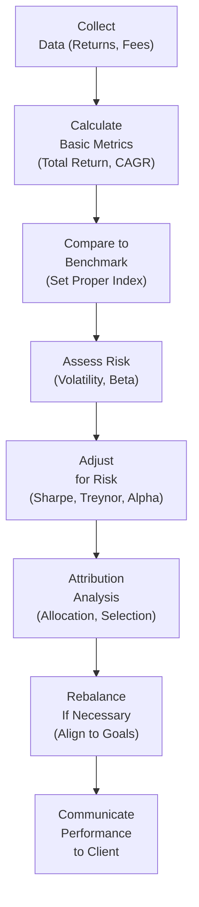

## 5.3 Measuring Portfolio Performance

Measuring portfolio performance can sometimes feel like scanning a stack of your old report cards—there’s a bit of nervous excitement as you wait for the numbers to confirm (or challenge) your expectations. In many ways, this exercise is just as critical as selecting the right investments in the first place. After all, how can you possibly improve your investment strategy without first checking how well it’s working now?

In this section, we'll break down the most common methods of calculating a portfolio’s overall performance, relate those methods to benchmarks, and show you how to interpret the results in a meaningful way. We'll also weave in some personal-ish stories, because, honestly, investments can get a tad dry without them. But let’s also keep it practical: by the time you reach the end, you’ll know precisely how to measure how well (or poorly) the portfolio is faring, and you’ll have some realistic yardsticks for comparison.

Feel free to cross-reference this discussion with the other parts of Chapter 5: Investment Management, particularly 5.1 (Modern Portfolio Theory) and 5.2 (Helping Your Clients Choose the Right Investment). You can also look back to Chapter 1 for more on risk profiles and ethics in dealings with clients, ensuring that performance measurement is not only technically sound but also ethically and professionally aligned.

--------------------------

### Why Performance Measurement Matters

So, why bother? Perhaps you—or someone you know—has said, “Well, I’ve made some money this year, so that’s enough for me.” But if you’re making 2% returns in a period when similar portfolios are making 8%, there might be room for improvement—or you might have missed some big style advantage or risk factor. To avoid such blind spots, it’s crucial to use:

• Consistent yardsticks (benchmarks)  
• Defined time horizons  
• Clear, standardized, and risk-adjusted metrics  

And, if we’re working within Canadian compliance frameworks, there's an added imperative: the Canadian Investment Regulatory Organization (CIRO) has comprehensive guidelines on how to report portfolio performance to clients. This fosters transparency and comparability across the industry.

--------------------------

### Benchmarks: Setting a Fair Bar

A benchmark is how you “grade” a portfolio’s performance. Let’s say your portfolio is a mix of 60% equities and 40% fixed income. A popular approach would be to find an index or a combination of indices that resemble that mix—like 60% in a broad equity index (think S&P/TSX Composite for Canadian equities or S&P 500 for U.S. equities) and 40% in a bond index (like the FTSE Canada Universe Bond Index). If your portfolio is primarily Canadian equity, you might compare it to the S&P/TSX Composite Index. For balanced portfolios, you might even do a “benchmark blend,” weighting each index by the portfolio’s asset mix.

The key is that the benchmark should reflect the same general risk, region, and asset class exposures as your portfolio. If your portfolio invests heavily in small-cap stocks, a large-cap index like the S&P/TSX Composite might not be the truest comparison. Balancing the composition of your portfolio with a relevant benchmark is the first step to measuring performance fairly.

----------------------------------

### Common Performance Metrics

Measuring portfolio performance isn’t just about how much money you made (or lost). You also have to consider risk, time horizon, and consistency. Below are some of the most widely recognized metrics:

#### Total Return

“Total Return” is one of the simplest measures and usually forms the bedrock of your assessment. It includes:
• Capital gains (or losses) on the investments  
• Dividends, interest, or distributions received  

If, for instance, you buy shares at $100 and then sell them at $110 after receiving $2 in dividends, your total return is:
• Capital gain = $110 − $100 = $10  
• Dividends = $2  
• Total Return = $12  

To express this as a percentage return against your initial investment of $100:
  

\text{Total Return (\%)} = \frac{(110 - 100) + 2}{100} \times 100\% = 12\%


Seems straightforward, right? Just remember to incorporate any fees or commissions so you’re looking at net, not gross, returns whenever possible.

#### Compound Annual Growth Rate (CAGR)

Maybe you left your investment untouched for three years—did you average 12% per year for those three years? Not necessarily. Total return over multiple years can be a bit deceptive if you don’t convert it to an annual average that accounts for compounding. That’s where CAGR steps in.

CAGR is your annualized rate of return that smooths out the volatility. If you started with $1,000 and ended with $1,500 after three years, the CAGR is the annual growth rate “as if” your portfolio grew at a steady pace each year.

Formally:


\text{CAGR} = \left(\frac{\text{Ending Value}}{\text{Beginning Value}}\right)^{\frac{1}{\text{Number of Years}}} - 1


Let’s throw in a quick example:


\text{Beginning Value} = \$1{,}000,\quad \text{Ending Value} = \$1{,}500,\quad \text{Time horizon} = 3\ \text{years}


\text{CAGR} = \left(\frac{1500}{1000}\right)^{\frac{1}{3}} - 1 = (1.5)^{\frac{1}{3}} - 1 \approx 0.145 - 1 = 0.145 = 14.5\%


In other words, the investment grew by about 14.5% per year, compounded, even though the actual year-to-year changes might have zigzagged.

#### Sharpe Ratio

Ever know someone who brags about a 20% return, but when you dig in, you discover they took wild gambles to get there? Or they put everything into one risky stock? The Sharpe Ratio helps you see how much risk was taken to generate an investment’s “excess return.” Specifically, the “excess return” is portfolio return minus the risk-free rate (e.g., yield on a 3-month T-Bill).

Mathematically:


\text{Sharpe Ratio} = \frac{R_{p} - R_{f}}{\sigma_{p}}


where:
• \\(R_{p}\\) = Return of the portfolio  
• \\(R_{f}\\) = Risk-free rate  
• \\(\sigma_{p}\\) = Standard deviation (volatility) of the portfolio’s return  

The higher the Sharpe, the better your risk-adjusted return. For instance, a Sharpe Ratio of 1.0 or above is generally considered healthy in many contexts (though it depends on the asset class and market conditions).

#### Treynor Ratio

Similar to Sharpe but focuses on systematic risk (beta) rather than total volatility. Beta measures how much your portfolio swings relative to the broader market. If the portfolio’s beta is 1.2, it’s theoretically 20% more volatile than the market. The Treynor Ratio formula is:


\text{Treynor Ratio} = \frac{R_{p} - R_{f}}{\beta_{p}}


• \\(\beta_{p}\\) = portfolio beta relative to a chosen market index.  

So if you’re only concerned with market-related (systematic) risk (rather than total volatility), the Treynor Ratio is your friend. A higher ratio means you’re more efficiently compensated for taking on systematic risk.

#### Alpha

Alpha is often referred to as the “secret sauce” of active management. It’s the difference between a portfolio’s actual returns and the expected returns based on its risk characteristics (like beta) relative to a benchmark. If your portfolio is expected to return 8% (based on the market’s movements and your beta) but returns 10%, your alpha is +2%. A negative alpha suggests underperformance relative to what the portfolio “should” have earned.

You can picture alpha as the special skill (or luck) component in management. Knowing how to interpret alpha helps separate random chance from genuine management skill.

--------------------------

### Evaluating Consistency Across Multiple Periods

One of the toughest things about measuring performance is that markets, and personal lives, can be random. Sometimes, a manager or strategy is on fire for six months, then flops for the next three. That’s why you want to look at:

• Rolling returns (e.g., 3-year or 5-year rolling periods)  
• Multi-year averages (e.g., 3-year, 5-year, 10-year performance)  
• Comparisons under different market conditions (bear vs bull markets)  

For instance, you might say: “This portfolio has averaged 8% per year for the last 10 years, consistently topping the blended S&P/TSX Composite + FTSE Canada Bond Index by 1%.” That’s a good sign. A single quarter of underperformance or outperformance often doesn’t say much about the manager’s skill or the portfolio’s viability.

--------------------------

### Attribution Analysis: The “Why” Behind the Numbers

Simply seeing that a portfolio outperformed by 2% is nice—but what caused this difference? That’s where “attribution analysis” comes in. It breaks down:

• Asset allocation: Did selecting more (or less) from equities/bonds/cash help or hurt performance relative to the benchmark?  
• Sector selection: Was there a tilt toward tech over energy—did that help or hinder?  
• Security selection: Maybe the overall weighting was fine, but certain individual stocks or bonds produced significant alpha (positive or negative).  
• Market timing: Did changes in equity or bond exposure throughout the year cause some of the out- or under-performance?  

A good attribution analysis might reveal, for example, that your outperformance was mainly driven by an overweight in the technology segment when it was booming. Or that you “timed” a strategic move into short-term bonds right before interest rates rose. This helps you see if the manager’s action or the broader market factors are behind the results.

--------------------------

### Risk-Adjusted Returns: Don’t Just Focus on the Number

We’ve all met the person who brags about their “huge returns,” right? But if you dig deeper, maybe they took on a staggering amount of risk, or they concentrated their entire portfolio in one tiny stock. If you are unlucky, that can blow up in your face.

In more formal finance terms, delivering a monstrous return while piling on risk just isn’t as impressive as delivering a moderately high return at a moderate or low risk. That’s why metrics like the Sharpe or Treynor ratio, described above, exist. They help investors and advisors compare how efficient a portfolio is at turning risk into reward.

--------------------------

### Fees and Expenses: The Not-So-Hidden Drag

Put simply, gross return minus expenses (like management fees, trading costs, etc.) = net return. Always keep track of the difference. For instance, a fund might produce a respectable 10% gross return, but if you’re paying a 2% Management Expense Ratio (MER), your net return is 8%. That’s why, when you’re comparing two portfolios or two managers, ensure you’re lining up all-in net returns. 

• Management Expense Ratio (MER): Typically includes the management fee, trailing commissions, and administrative fees inside a fund.  
• Trading costs: Frequent buying and selling can lead to higher commissions and transaction fees.  

When you disclose performance to a client, you want to be transparent about net returns—some investment professionals prefer to show both gross and net for completeness, but the net figure is typically more relevant to real-life results, especially for planning.

--------------------------

### The Importance of Periodic Rebalancing

Even if your portfolio does well, it can “drift” from its original asset allocation over time. For example, your equities might surge in a bull market and become a more substantial percentage of your portfolio. Rebalancing involves selling a little of what’s skyrocketed to “top up” the asset classes that haven’t grown as much—or vice versa. This helps you:

• Maintain your risk profile  
• Lock in some gains from strong performers  
• Potentially benefit from buying lower-priced assets  

In Chapter 2 (Net Worth and Cash Management Planning), we covered how essential it is to keep your financial plan dynamic. Rebalancing is the portfolio-level reflection of that principle—ensuring your actual holdings align with the client’s risk tolerance and objectives set out at the start (see Chapter 1.5 on Determining Your Client’s Risk Profile).

--------------------------

### Transparent Client Communication

Clients often feel uneasy about their investments if they don’t understand how performance is being measured or if they see a big negative number with no explanation. Clear, timely, and transparent reporting is crucial.

• Provide performance updates in plain language, beyond just the numbers.  
• Compare the performance to an agreed-upon or relevant benchmark.  
• Disclose fees upfront, show net returns.  
• Offer risk-adjusted metrics like Sharpe or Treynor so clients can see the relationship between risk and returns.  

Per regulations by the Canadian Investment Regulatory Organization (CIRO), performance reporting must meet strict standards where returns are disclosed net of fees and explained in a manner that everyday clients can grasp. Similarly, the Canadian Securities Administrators (CSA) issues rules on the clarity and fairness of client statements. The goal: to keep it transparent so that Canadians can make informed decisions about their investments.

--------------------------

### Practical Example: A Balanced Portfolio

Suppose you have a Canadian balanced portfolio:

• 50% in Canadian equities  
• 40% in Canadian bonds  
• 10% in global equities  

An appropriate benchmark might be:

• 50% S&P/TSX Composite Index  
• 40% FTSE Canada Universe Bond Index  
• 10% MSCI World Index  

Now, let’s say the manager reports:

• Portfolio total annual return: 7.5%  
• Benchmark total annual return: 7.0%  
• Cash distributions (dividends/interest): 2.5% out of that 7.5%  
• Beta relative to the benchmark: 0.95  
• Standard deviation of the portfolio: 8.0%  
• Risk-free rate: 1.0%  

If you want to be thorough, you might examine:

1. Sharpe Ratio = (7.5% − 1.0%) / 8.0% = 6.5% / 8.0% ≈ 0.81  
2. Treynor Ratio = (7.5% − 1.0%) / 0.95 ≈ 6.5% / 0.95 ≈ 6.84%  
3. Alpha: If your benchmark returned 7.0% and your portfolio had about the same volatility or beta as that benchmark, your alpha might be about +0.5%.  

You notice the portfolio is slightly outperforming the benchmark. You also check that the portfolio’s risk numbers (e.g., standard deviation, beta) are in line with expectations. Then you attribute outperformance to:

• Slight overweight in technology stocks in Canadian equities when that sector performed well.  
• Underweight in certain cyclical sectors that had a tough year.  

When presenting these results to the client, you might keep the conversation friendly and to the point, emphasizing how the performance aligns with the client’s target risk tolerance and timeline for investing, and being transparent about fees.

--------------------------

### Visualizing the Process: A Simple Flow of Performance Measurement

Below is a Mermaid flowchart that highlights the general flow of measuring and analyzing portfolio performance. (Note: The text in each node is wrapped with square brackets and double quotes, per the instructions.)

Explanation of the flow:
1. Gather data on returns, fees, etc.  
2. Calculate basic metrics (total return, CAGR, etc.).  
3. Compare performance to a relevant benchmark.  
4. Evaluate portfolio risk via standard deviation, beta, etc.  
5. Use risk-adjusted metrics (Sharpe, Treynor, Alpha).  
6. Perform attribution analysis to see what drove performance (asset allocation, security selection, market timing).  
7. Decide if the portfolio needs rebalancing.  
8. Clearly communicate results and next steps to the client.

--------------------------

### Additional References & Resources

• CIRO’s guidelines on performance reporting and compliance:  
  https://www.ciro.ca  
• Canadian Securities Administrators (CSA) documentation on disclosure rules and reporting standards for client statements.  
• widely recognized benchmark providers, e.g., S&P (https://www.spglobal.com), MSCI, FTSE Russell.  
• The CFA Institute’s Global Investment Performance Standards (GIPS) guide best practices for calculating and reporting performance.  
• Online performance tools like Portfolio Visualizer or Morningstar can help you compare your portfolio metrics to industry benchmarks.  
• Books such as “Winning the Loser’s Game” by Charles D. Ellis for insights into portfolio performance and benchmarking.  
• In prior chapters (e.g., Chapter 1.5, Determining Your Client’s Risk Profile and Chapter 5.1, Modern Portfolio Theory), you can find deeper discussions on how risk tolerance and diversification inform performance measurement.

--------------------------------

### Bringing It All Together

Measuring how your portfolio’s doing shouldn’t be treated as an afterthought—it’s integral to the entire investment planning process. By benchmarking properly, calculating total and risk-adjusted returns, accounting for fees, rebalancing periodically, and explaining all this clearly to clients, you help keep the investment plan on the right track. 

Performance is more than a single number; it’s a comprehensive look at returns, volatility, and sources of gains or losses. As you manage or advise on investments, incorporate these metrics into a consistent review process. This helps ensure the portfolio remains aligned with the client’s short-term spending needs and long-term goals, as well as the risk tolerance you hashed out at the start.

If you’re feeling that flush of excitement when your portfolio edges out the benchmark, that’s great. But also consider the flip side: sometimes, “losing” by less than the market in a downturn is equally (if not more) impressive. Keep a sense of perspective, rely on objective data, and always match your performance lens to the client’s goals and capacity for volatility. At the end of the day, a well-measured and well-understood portfolio is a sign that you—or your advisor—are doing a thorough job.

--------------------------------

## Put Knowledge to the Test: Measuring Portfolio Performance Quiz



### Which metric directly includes dividends or interest in its calculation of returns?

- [ ] Sharpe Ratio
- [ ] Treynor Ratio
- [x] Total Return
- [ ] Alpha

> **Explanation:** Total Return takes into account all forms of returns, including capital gains (or losses) and income (dividends, interest) from the investment.

### What does the Compound Annual Growth Rate (CAGR) primarily help investors understand?

- [ ] How to minimize tax obligations
- [ ] The probability of a market crash
- [x] The annualized rate of return over a specific multi-year period
- [ ] The weighted average cost of capital

> **Explanation:** CAGR shows the annualized return, assuming compounding, making it easier to compare multi-year performances.

### When calculating the Sharpe Ratio, which type of risk measure is used in the denominator?

- [x] Standard deviation of the portfolio's returns
- [ ] The risk-free rate
- [ ] Portfolio beta
- [ ] The 10-year government bond yield

> **Explanation:** The Sharpe Ratio uses the standard deviation (a measure of total variability) of the portfolio’s returns in the denominator to determine the risk-adjusted return.

### If a portfolio's beta is 1.2, and it experiences a return of 10% while the risk-free rate is 2%, which metric best indicates how well the portfolio rewarded its exposure to market risk?

- [ ] Sharpe Ratio
- [x] Treynor Ratio
- [ ] Alpha
- [ ] CAGR

> **Explanation:** The Treynor Ratio divides the portfolio’s excess return by beta, focusing specifically on systematic (market) risk.

### Which of the following best describes “Alpha” in portfolio measurement?

- [ ] The volatility of a portfolio compared to the market
- [x] The difference between actual return and expected return based on portfolio risk factors
- [ ] The average of returns over a period
- [x] A measure of skill (or luck) in active management over a benchmark

> **Explanation:** Alpha is the portion of return not explained by the general market’s movement and indicates whether a manager is adding or losing value compared to a risk-adjusted “expected” return.

### What is the primary purpose of attribution analysis?

- [x] To determine what portion of a portfolio’s performance was due to allocation, security selection, or market timing decisions
- [ ] To forecast future interest rates
- [ ] To calculate the internal rate of return (IRR)
- [ ] To identify bond duration

> **Explanation:** Attribution analysis breaks down performance drivers, clarifying whether gains or losses stem from sector/asset-class allocations, individual stock selections, or timing strategies.

### Which item can be considered part of a fund’s management expense ratio (MER)?

- [x] The fund’s marketing, management, and administrative fees
- [ ] The client’s personal income tax obligations
- [x] Trailing commissions
- [ ] Stock price appreciation

> **Explanation:** The MER covers ongoing costs of running the fund, including management fees, administrative costs, and possibly trailing commissions. It does not include an investor’s personal taxes.

### Why is it important to integrate fees when measuring portfolio performance?

- [ ] Because fees always remain constant year over year
- [ ] To align with fixed-income weighting decisions
- [ ] Fee data does not need to be included
- [x] They reduce the net return and give a more realistic measure of actual performance

> **Explanation:** Failing to account for fees paints an overly optimistic picture. Net performance tells the real story of how much investors actually earn.

### What is periodic rebalancing intended to accomplish?

- [ ] Lock the investor into previous winners
- [ ] Remove all equity holdings from a portfolio
- [ ] Guarantee that the portfolio’s return never goes down
- [x] Realign the portfolio with its target asset allocation or risk profile

> **Explanation:** Rebalancing brings the portfolio back to its optimal structure, preventing any one asset class from drifting too far from the intended weighting.

### True or False: The Canadian Investment Regulatory Organization (CIRO) replaced the pre-existing SROs—IIROC and MFDA—making them historical references only.

- [x] True
- [ ] False

> **Explanation:** The MFDA and IIROC merged and formed the new organization effective January 1, 2023, officially renamed the Canadian Investment Regulatory Organization (CIRO) as of June 1, 2023.


