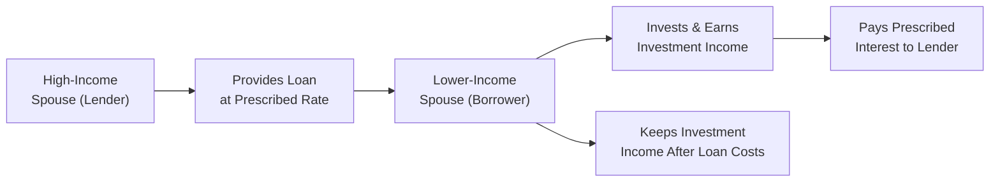

## 6.2 Income Splitting

Income splitting is a cornerstone strategy for families and individuals who want to optimize their overall tax situation. In the simplest terms, it’s about allocating income to a family member in a lower tax bracket. Suppose you and your spouse are at significantly different income levels. When you split or shift some of that higher income to the lower-income spouse, it reduces the total tax your family pays. It sounds almost too good to be true, but it’s completely legal—as long as you follow the rules laid out in the Income Tax Act, particularly Sections 74.1–74.5, which govern “attribution.” If you do it right, you can potentially save thousands of dollars over the long term.

Before we start, let me share a little story that might sound familiar. Years ago, a friend of mine, let’s call him Adam, was earning a hefty salary while his spouse, Beatrice, was in part-time work. Adam found himself paying a high marginal tax rate, while Beatrice was sitting in a much lower bracket. We played around with some numbers, and—would you believe it—by rethinking their joint finances, they discovered that careful income splitting (through a spousal RRSP) would save them a good chunk in taxes every year. That’s the power of being mindful about who pays tax on which portion of the family income.

Below, we’ll explore several ways to split income, from spousal RRSPs and prescribed rate loans to family trusts and the rules around splitting pension income. Each comes with its own complexities and restrictions, so be sure to stay compliant with the attribution rules and consult with a qualified tax professional for guidance tailored to your family’s situation.

## Why Income Splitting Matters

Income splitting is popular in Canada because we have a progressive tax system. Put another way, the first dollars of income are taxed at a lower rate; as you earn more, you climb into higher marginal brackets. If all of a couple’s or family’s income is concentrated in one person’s hands, that individual may be taxed at a high rate—and ironically, the other spouse might be paying little to no tax at all. By sharing (or shifting) income, you can smooth out that disparity.

From a financial planning perspective, well-structured income splitting can do the following:
• Reduce total family tax liability, leaving more after-tax dollars to invest, spend, or save.  
• Equalize retirement savings, which can be a big deal if one spouse is out of the workforce for extended periods (e.g., child-rearing, caregiving).  
• Provide flexibility in estate planning.  

That said, it’s crucial to plan carefully because the government does not want taxpayers to artificially shift income without substance. Hence, the so-called “attribution rules” come into play to ensure that any attempt to bypass normal tax obligations can be traced back to the higher-income taxpayer.

## Basic Principles and Attribution Rules

The Canadian Income Tax Act has sections dedicated to the concept of attribution (Sections 74.1 through 74.5). In a nutshell, these rules say that if you try to transfer or “attribute” income-producing property to your spouse or child purely to benefit from their lower marginal tax rate, that income might be “attributed” back to you—i.e., you’re still stuck paying tax on it. Don’t panic, though. There are plenty of ways around the attribution rules if you structure things correctly:

• Use spousal RRSPs.  
• Set up a formal loan at the Canada Revenue Agency (CRA) prescribed rate.  
• Comply with formal trust arrangements, ensuring the trust is set up and run correctly.  
• Use legitimate pension income splitting by completing Form T1032 during tax filing.

The key is to ensure that your arrangements comply with legitimate financial planning methods rather than attempts to circumvent tax laws. 

## Common Mechanisms for Income Splitting

### Spousal RRSP

A spousal RRSP is an account owned by the lower-income spouse (or common-law partner) but contributed to by the higher-income spouse. This is one of the simplest yet most effective ways to split income. 

When the higher-income spouse contributes to a spousal RRSP:
• That spouse gets the tax deduction (thus reducing their taxable income).  
• The contributed funds belong to the lower-income spouse, who will withdraw them in retirement, hopefully at a lower tax rate.  

This strategy can be particularly effective if you foresee your spouse’s future tax bracket being significantly lower than yours. However, note the “three-year attribution rule”: if the spouse withdraws from the spousal RRSP within three years of a contribution, that amount can be attributed back to the contributor and taxed at the higher rate. 

Below is a simple diagram showing the flow:

In this flowchart, the high-income spouse contributes to the spousal RRSP. The money grows. Once retirement arrives, the lower-income spouse withdraws the funds. If everything is done correctly and enough time has passed since the last contribution, the withdrawals are taxed in the lower-income spouse’s hands—resulting in potential tax savings for the couple.

### Prescribed Rate Loans

A prescribed rate loan is another popular method. It works like this: the higher-income spouse lends money to the lower-income spouse (or a family trust) at the CRA’s prescribed interest rate. This rate is set quarterly and is often quite low. 

• The borrower invests the money and hopefully earns a return higher than the prescribed loan interest.  
• Only the prescribed loan interest must be paid back to the lender each year.  
• The lower-income spouse reports the investment income.  
• The lender (higher-income spouse) reports the interest received on the loan.

Why does it matter that the interest is charged at the prescribed rate? Because if you simply gifted the funds or loaned them interest-free, the attribution rules would typically require you, the original holder, to pay tax on any income or gains. By formalizing the loan at the prescribed rate and ensuring timely payment of interest, you avoid that attribution. Just be sure to document the loan properly and pay interest on time.

Let’s see a quick conceptual flow:

If all is done properly, the net investment income above the prescribed interest can be taxed in the lower spouse’s hands, thus reducing the family’s total bill.

### Family Trusts

Family trusts can be a more sophisticated approach to income splitting. Essentially, you establish a trust (often with the help of a lawyer or notary public), and family members can be named as beneficiaries. The assets inside the trust generate income, which can be allocated (or “distributed”) among the beneficiaries—ideally, those in lower tax brackets. 

It sounds straightforward but can be quite complex. Trusts come with their own tax rates, compliance requirements, and nuanced rules about beneficiary distributions. The trust itself may pay tax at the highest marginal rate on any undistributed income. So, if the trust doesn’t distribute the income in the same tax year, you could lose the advantage of splitting. Family trusts need to be set up with a clear purpose—estate planning, business succession, or something more than simply shifting income. 

When done correctly:  
• The trust can shift income among beneficiaries who may be in lower brackets.  
• It can protect family assets from certain creditors or claims.  
• It can support intergenerational wealth transfer strategies.  

However, one must pay attention to the “tax on split income” (TOSI) rules if minors or related adults get dividends from a private corporation. TOSI can impose high rates on split income if it doesn’t meet specific exemptions. Always consult a tax specialist when dealing with trusts.

### Pension Income Splitting

Pension income splitting is a simpler concept compared to the other strategies. If you (or your spouse) receive eligible pension income—like from a registered pension plan or from certain annuities—you can split up to 50% of that pension income with your spouse. You do this on your annual tax return by filing Form T1032 (Joint Election to Split Pension Income).

Here’s why it’s cool:  
• If one spouse receives a large pension and is in a high tax bracket, shifting some of that income onto the other spouse’s return can reduce the total tax.  
• This measure can also boost or preserve certain income-tested benefits (like Old Age Security) if it helps lower the net income of the higher-income spouse.

It’s administered simply by making the election during tax time. Compared to the complexity of spousal RRSPs or prescribed rate loans, pension splitting can be a quick fix—but it only works for individuals who are actually receiving eligible pension income.

### Other Considerations

You might come across additional strategies, such as paying an adult child a fair salary for legitimate work in the family business or using specialized corporate structures to split dividends among family members. Although these can also reduce overall family taxes, they are subject to the “tax on split income” (TOSI) if the recipients (like adult children) aren’t actively involved in the business. Consequently, any improper or contrived arrangement risks being invalidated by the CRA.  

## Best Practices and Pitfalls

It’s easy to get excited about how much money you can save with income splitting, but a few pitfalls and best practices should be top of mind:

• Documentation: Especially with prescribed rate loans, you must have a written loan agreement and ensure the prescribed interest is paid by January 30 each year. Missing a payment can trigger attribution, undoing your efforts.  
• Mind the Attribution Rules: The Income Tax Act is explicit. If you transfer property or make it appear you are transferring property, but you remain in control or your spouse has not paid fair market value for it, you could still be responsible for the income tax.  
• Respect the “Three-Year Rule” for Spousal RRSPs: If your spouse withdraws from the spousal RRSP before the end of the third calendar year after the latest contribution, it’s you who gets taxed on that withdrawal.  
• TOSI: If you’re splitting income with an adult child via dividends or trust distributions, watch out for the tax on split income if that child is not meaningfully contributing to the business.  
• Professional Advice: Income splitting can be intricate. Each family’s situation is unique, so always consult a qualified tax adviser, financial planner, or lawyer with expertise in Canada’s tax laws.  

One more anecdote: A couple I worked with tried to implement a prescribed rate loan arrangement. They had a formal loan document, but in the second year they forgot to pay the interest on time. The CRA attributed the entire investment income for that year back to the higher-income spouse—exactly what they were trying to avoid. After some hair-pulling and late-night reading of CRA’s bulletins, they realized the importance of paying interest on time. They fixed it going forward, but that second year was lost savings, and it wasn’t fun for them to deal with. The moral? A small detail can have big repercussions.

## Practical Example: Prescribed Rate Loan in Action

Let’s explore a simple example. Assume the CRA’s prescribed rate is 2%. Charlotte is in a 45% marginal tax bracket, while her spouse Dan is in a 25% bracket. Charlotte lends Dan $100,000 under a formal written agreement at 2% annual interest. 

• Dan invests the $100,000 in a balanced portfolio returning roughly 5%. Over the course of a year, that’s $5,000 in investment income.  
• Dan owes Charlotte $2,000 in interest (2% of $100,000). Dan can deduct the interest cost if the borrowed money is used to earn business or investment income, subject to certain rules.  
• Charlotte will report the $2,000 interest as income, taxed at 45%. The total tax on that interest is $900.  
• Dan has $5,000 in returns but pays out $2,000 in interest, netting $3,000. That $3,000 is taxed in Dan’s hands at 25%, or $750.  
• Total combined tax = $900 + $750 = $1,650.  

Had Charlotte invested the funds herself at 5%, she would have been taxed on $5,000 at 45%, which would be $2,250. By using a prescribed rate loan, they saved $600 in this simplified example. This difference can grow significantly with larger amounts or higher returns.

## Family Trust Case Study: Funding a Child’s Education

Imagine parents who set up a family trust to hold an investment portfolio. The beneficiaries are their three children, ranging from ages 10 to 16. Over time, the trust invests in dividend-paying stocks and income-producing assets. Each year, the trust distributes enough funds to cover some of the children’s private-school tuition. Because the children are minors, the trust arrangement must be carefully structured to avoid attribution. Often, more advanced methodologies might be needed, like ensuring the trust invests in capital-gain-producing assets or distributing funds in a tax-efficient manner.  

If done properly by an experienced lawyer or accountant, the children might pay little or no tax on the distributions because of their low income. However, if the trust arrangement fails to meet the technical requirements or if the distributions are not documented properly, the CRA may attribute the income back to the parents. Mistakes in this space can be costly, so it’s advisable to work with legal and tax professionals who understand the intricacies of trust law.

## Regulatory Landscape and Guidance

Although income splitting primarily involves tax law rather than securities regulation, it’s worth mentioning that any investments used in these strategies must be purchased and advised upon by qualified individuals. As of January 1, 2023, the Mutual Fund Dealers Association of Canada (MFDA) and the Investment Industry Regulatory Organization of Canada (IIROC) were amalgamated into the Canadian Investment Regulatory Organization (CIRO). CIRO is now the single self-regulatory organization overseeing investment dealers and mutual fund dealers. If you need professional investment advice, ensure you work with a CIRO-registered advisor. This helps ensure ethical standards, compliance, and protection for investors.

For official guidance:

• Canada Revenue Agency Prescribed Rates:  
  https://www.canada.ca/en/revenue-agency/services/tax/prescribed-interest-rates.html  
• Form T1032 (Joint Election to Split Pension Income):  
  https://www.canada.ca/en/revenue-agency/services/forms-publications/forms/t1032.html  
• Income Tax Circulars:  
  https://www.canada.ca/en/revenue-agency/services/tax/technical-information/income-tax/information-circulars.html  

## Recommended Resources

If you want more in-depth reading on income splitting and broader tax strategies, consider:

• “Managing Your Personal Taxes” by CPA Canada  
• “Family Trusts: A Comprehensive Guide for Canadian Taxpayers” by Taxnet Pro  
• CRA’s online “Information Circulars” for technical details on attribution rules  
• Online courses and seminars hosted by professional bodies such as CPA Canada or FP Canada  

## Conclusion

Income splitting is a powerful technique that can help Canadian families reduce their overall tax burden while allowing more effective use of financial resources. From a strategic lens, it’s not just about saving tax today—often it’s about aligning the timing of income with lower brackets, ensuring each spouse can build retirement assets, and protecting family wealth for future generations.

But remember the golden rule: always follow the letter of the law. If you set up a spousal RRSP, don’t forget about the three-year rule. If you do a prescribed rate loan, pay the interest on time—every time. If you establish a trust, thoroughly document all transactions. It’s better to do it right from the start than to face unwelcome surprises down the road.

Most importantly, plan for your family’s unique goals. Seek professional guidance when necessary, and keep detailed records. With the right approach, income splitting can be one of the most rewarding pillars of a well-built financial plan.

-----

## Test Your Knowledge: Income Splitting Strategy Quiz



### Which of the following best describes the main purpose of income splitting?

- [ ] Avoiding all taxation by transferring assets to offshore accounts
- [ ] Paying no taxes by claiming multiple personal exemptions
- [ ] Converting all income to dividend income for the higher-income spouse
- [x] Allocating income to a lower tax bracket family member to reduce overall tax

> **Explanation:** Income splitting involves strategizing to have income taxed in a lower bracket, thereby reducing the total family tax. It must be done legally and within the attribution rules.

### Spousal RRSP contributions allow which of the following?

- [x] The higher-income spouse to get the tax deduction, while the lower-income spouse benefits from withdrawals
- [ ] No tax deduction at all
- [ ] Immediate withdrawal privileges without penalty
- [ ] Combining spousal RRSP with corporate dividends

> **Explanation:** A spousal RRSP is owned by the lower-income spouse but funded by the higher-income spouse, helping them get a deduction and eventually allowing the lower-income spouse to be taxed on withdrawals.

### What is a key requirement for a prescribed rate loan to avoid attribution?

- [ ] The loan must be interest-free
- [ ] No formal paperwork is required
- [x] Interest must be charged at the CRA’s prescribed rate and paid on time
- [ ] The lender must waive repayment at least once annually

> **Explanation:** For a prescribed rate loan to avoid attribution, the borrower must pay interest at or above the prescribed rate each year, and documentation of this arrangement is essential.

### In pension income splitting, how much of eligible pension income can typically be split?

- [x] Up to 50%
- [ ] Up to 10%
- [ ] 100% of all investment income
- [ ] There is no limit; any amount can be split

> **Explanation:** Under current Canadian tax law, up to half of eligible pension income can be split with a spouse on Form T1032.

### Which of the following is a potential penalty or risk if interest payments on a prescribed rate loan are missed?

- [x] The entire investment income could be attributed back to the lender
- [ ] The loan becomes void and no repayment is necessary
- [ ] The CRA will automatically lower the prescribed rate
- [ ] No significant penalty applies as long as you eventually catch up

> **Explanation:** If a family member does not pay interest on time, the attribution rules will kick in, causing the investment income to be attributed back to the higher-income spouse.

### What is a key benefit of establishing a family trust for income splitting?

- [x] Distributing investment income to beneficiaries who might be in lower tax brackets
- [ ] Evading all taxes by hiding assets
- [ ] Automatically eliminating future capital gains taxation
- [ ] Guaranteeing no restrictions on trust distributions

> **Explanation:** A family trust can distribute income to beneficiaries potentially in lower brackets, but it must follow proper trust and tax rules.

### When considering a spousal RRSP, what is the “three-year rule”?

- [ ] The spousal RRSP must be fully collapsed within three years
- [ ] You can only contribute for three years followed by a two-year break
- [x] Withdrawals within three years of contribution might be attributed back to the contributor
- [ ] You must wait three years before opening a spousal RRSP

> **Explanation:** If the lower-income spouse withdraws funds from a spousal RRSP within three years of a contribution, the amount may be taxed back to the contributing spouse.

### Which of the following is true regarding the “tax on split income” (TOSI) rules?

- [x] They may apply to dividends paid to family members who are not actively involved in the business
- [ ] They have no impact on family trusts or minors
- [ ] They only apply to spousal RRSP withdrawals
- [ ] They were repealed in 2010

> **Explanation:** TOSI applies particularly to dividends or distributions to family members who are not actively engaged in the business, preventing inappropriate forms of income splitting.

### Which statement about income splitting and documentation is correct?

- [x] Proper documentation, such as written loan agreements, is crucial to avoid income attribution
- [ ] Documentation is unnecessary because CRA rarely audits personal financial arrangements
- [ ] Liability insurance always covers mistakes made in family trusts
- [ ] Income splitting can only occur if authorized by a court order

> **Explanation:** To avoid attribution issues, documentation is essential. This includes written loan agreements, trust agreements, and record of interest payments.

### The primary advantage of pension income splitting for couples is:

- [x] Potentially reducing the higher-income spouse’s marginal tax rate
- [ ] Avoiding all taxes on the pension income if spouses elect together
- [ ] Eliminating the need for filing Form T1032
- [ ] Guaranteeing an increased contribution room for both spouses

> **Explanation:** By splitting pension income, you can shift a portion of it to the lower-income spouse, potentially lowering the marginal tax rate of the higher-income spouse and saving on overall taxes.


