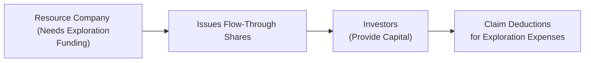

## 6.3 Tax Shelters

Tax shelters can be an incredibly powerful mechanism for individuals and businesses looking to reduce, defer, or otherwise manage their tax obligations. That said—like many powerful tools—they also come with potential pitfalls. Before diving in, I have to share a personal anecdote: I once had a friend who was so excited by the idea of “not paying taxes” that she almost invested in a questionable “art donation program.” The promoter promised huge tax deductions but couldn’t explain how the artwork was valued, nor could he show an official Canada Revenue Agency (CRA) tax shelter registration or other credentials. Luckily, she paused, did more research, and (phew!) never put a dime into that scheme. This anecdote illustrates the fine line between “smart tax planning” and “questionable or abusive tax shelters.”

In this section, we’ll walk through these concepts step by step, clearing up relevant rules, shedding light on legitimate structures, and pointing out red flags you’ll want to watch out for. The goal is to ensure that you, as a financial planner, understand not just the broad strokes of tax shelter strategies but also how to help clients evaluate the economic substance of any arrangement. Let’s jump in.

## Defining Tax Shelters in Canada

When people hear “tax shelter,” they might initially think of shady dealings or off-the-books bank accounts. In reality, the definition of a tax shelter in Canada is broader. The CRA generally sees a tax shelter as any arrangement where some combination of deductions, credits, or deferrals shelter part or all of a taxpayer’s income from tax. This includes:

• Government-endorsed registered plans such as Registered Retirement Savings Plans (RRSPs) and Registered Education Savings Plans (RESPs).  
• Certain specialized investments like flow-through shares.  
• Other registered vehicles or structures that result in significant tax benefits.  
• Arrangements that must be registered with the CRA because they promise tax benefits (often identified with a tax shelter number).

On a practical level, legitimate tax shelters are not about “tax evasion” but about taking advantage of allowances specifically built into the Income Tax Act—things like saving for retirement or education in a tax-advantaged account. However, there is a line between legitimate and abusive. The CRA often zeroes in on shelters whose primary or sole objective is to reduce or eliminate taxable income without any real commercial purpose to the investment.

## Major Types of Tax Shelters

### RRSPs and RESPs

One of the easiest ways to illustrate the concept of a tax shelter is to look at RRSPs. When an individual contributes funds to an RRSP, they can deduct that amount from their taxable income for the year, effectively reducing the tax owed. The tax is deferred until withdrawal—usually in retirement, when a person’s marginal tax rate might be lower. RESPs similarly shelter investment income from tax until withdrawn for educational purposes, while also allowing one to access government grant money for a child’s post-secondary education.

Both RRSPs and RESPs are typically not regarded as “controversial” tax shelters. They are specifically set up by the government to promote policies like retirement savings and higher education. Clients will often be well-versed in these structures, so they might not need extensive convincing, but you still want to ensure your clients know contribution limits, potential penalties, and the best ways to invest those funds.

### Flow-Through Shares

Flow-through shares are that unique spark of tax strategy brilliance found almost exclusively in Canada’s resource sectors. If you’ve never encountered them, let’s walk through the basics.

Flow-through shares allow certain resource exploration companies (most commonly in mining, oil and gas, or renewable energy) to transfer eligible exploration and development expenses to investors who purchase the shares. The investors then claim these transferred expenses as deductions on their personal returns. That’s powerful because it can significantly reduce an investor’s taxable income. If you’re curious how the structure might look, here’s a quick schematic in Mermaid:

Basically, the resource company (A) needs capital for exploration, so it issues special shares (B) to investors (C). Investors get valuable tax deductions (D), which reflect the company’s eligible exploration or development expenses. It’s like the expenses “flow through” from the company to the shareholders.

These flow-through shares can be extremely beneficial—assuming the underlying investment actually pays off. If the exploration is unsuccessful or the company’s future prospects dim, the shares might perform poorly. So the economic substance matters every bit as much as the tax benefits.

### Other Potentially Controversial Shelters

Many “limited partnership” or “capital cost allowance” shelters have passed through the Canadian landscape over the years. Some were legitimate; others less so. Typically, the CRA will look closely at:

• Whether the value of the property or asset involved has been inflated.  
• Whether the arrangement is structured primarily for tax reasons (with no significant business purpose).  
• Whether the promoter is guaranteeing tax benefits that seem too good to be true.  
• Whether the arrangement has a valid tax shelter registration number with the CRA.

The CRA mandates that any promoter (the entity selling or marketing the shelter) must register the arrangement if it meets the criteria for a tax shelter. Failing to register, or providing misleading info, can lead to penalties. The CRA also has broad powers under the General Anti-Avoidance Rule (GAAR) to deny tax benefits that arise from “abusive” arrangements. 

## Economic Substance Versus Tax Motive

Let’s pause to consider something known as “economic substance.” If you think about it, a healthy investment or commercial transaction should have a genuine business or financial purpose—like exploring a new gold deposit or investing in a wide range of stocks for retirement. If the only reason for an arrangement is to generate a tax loss or credit, the CRA is likely to raise an eyebrow.

Economic substance can be summarized by questions like:  
• Is there a real asset or flow of funds behind the investment?  
• Could the investment generate potential returns on its own merits?  
• Are there real risks involved beyond just losing out on the tax benefit?

Planners and clients alike should weigh these factors to avoid the trap of so-called “abusive” or “sham” shelters. If the arrangement fails the economic substance sniff test, it can spell big trouble if the CRA or the courts come calling.

## The CRA and Tax Shelter Registration

Promoters of tax shelters must apply for and receive a tax shelter identification number from the CRA if they’re offering an arrangement that meets certain thresholds of promised deductions or credits. This ID number does not guarantee that the arrangement is valid—it’s essentially just a registration. The CRA’s website on tax shelters (https://www.canada.ca/en/revenue-agency/services/tax/businesses/topics/tax-shelter.html) outlines the basic obligations and warns that not every registered arrangement is automatically acceptable. After all, unscrupulous promoters might still try to push questionable offerings while brandishing a “registered tax shelter” label.

## The Appeal and Risk of Flow-Through Shares

Flow-through shares deserve another quick highlight, partly because they’re so often touted as a legitimate tax shelter with a little bit of excitement behind them. Let’s drill down:

• The Resource Incentive: Flow-through shares are often used by junior mining or energy companies that need exploration dollars. By renouncing or “flowing through” their exploration and development expenses, they attract investors who want tax deductions.  
• Potential Deduction Stacking: Investors can deduct expenses against their incomes and may also get additional tax credits (for instance, the federal Mineral Exploration Tax Credit, if available).  
• Speculative Upside: If the company strikes gold—or extracts oil or gas efficiently—the share price might surge.  
• Potential Pitfalls: The underlying investment is often in a high-risk sector. Exploration is never guaranteed to succeed. If the company doesn’t make a genuine effort or fails entirely, the shares might become worthless. The investor might still benefit from the tax deduction, but the overall returns could disappoint.

The CRA’s Guide to Flow-Through Shares (https://www.canada.ca/en/revenue-agency/services/forms-publications/publications/t4068/guide-flow-through-shares.html) is a must-read if you plan to recommend these arrangements to clients. It covers the mechanics, forms required, deadlines, and more.

## Best Practices for Evaluating a Tax Shelter

It doesn’t matter if we’re talking about an RESP, a flow-through share, or the next big “limited partnership.” The fundamental approach to advice remains the same:

- Check Registration and Official Documentation  
  Make sure the arrangement is properly registered with the CRA (if it meets the threshold) and that the promoter can produce the relevant ID number. 

- Investigate Economic Substance  
  Ask whether the investment has commercial merit beyond the tax break. If the pitch is all about “getting a big tax deduction,” that’s a caution flag.

- Understand the Timelines  
  RRSPs, TFSAs, and RESPs have contribution and withdrawal rules. Flow-through shares have deadlines for renouncing expenses. Missing these deadlines can lead to penalties.

- Assess Risk Tolerance  
  Particularly with flow-through shares or limited partnerships, the risk can be substantial. Ensure the investment aligns with the client’s overall risk profile. For instance, a retiree with modest savings might find high-risk exploration shares very ill-suited to their needs.

- Apply All Relevant Regulatory Considerations  
  While the CRA deals with tax matters, the Canadian Securities Administrators (CSA) monitors compliance with securities regulations (https://www.securities-administrators.ca). Ensure that any security or offering you recommend is in line with CSA guidelines.

- Watch Out for “Too Good to Be True”  
  If a client is being pitched an investment that promises huge tax credits or is suspiciously complex, always advise them to get a second opinion from a qualified tax professional or lawyer.

## Case Study: Rick’s Resource Investment

Let’s walk through a hypothetical scenario: Rick, an engineer in Alberta, is approached by a local promoter touting flow-through shares in a brand-new lithium exploration company. The pitch? “Invest $10,000, get $10,000 in exploration expenses to write off immediately, plus maybe a provincial tax credit, plus the company’s shares might double if they find a lithium deposit.” Rick, who’s in a high-income bracket, is intrigued. After all, he could reduce his taxable income significantly this year. But here’s what Rick should do before handing over his cheque:

• Verify that the promoter has a CRA-issued tax shelter registration number.  
• Review the company’s geological reports or at least a credible summary of their prospects (economic substance).  
• Look at the share’s offering memorandum and check if the investment is approved under provincial securities laws.  
• Consider the maximum amount he can deduct based on his personal tax situation.  
• Weigh the actual risk: Lithium exploration is a fairly specialized field with no guaranteed success. Is he ready to lose his principal if the exploration fails?  

If Rick checks these boxes and still believes in the opportunity, investing might be reasonable. If the promoter responds with vague or evasive answers—red flag. Rick might walk away.

## Tax Shelter and Anti-Avoidance Rules

Canada’s Income Tax Act includes robust anti-avoidance rules. The General Anti-Avoidance Rule (GAAR) is designed to catch “transactions or arrangements that are primarily for the purpose of obtaining a tax benefit” and misuse or abuse the Act. Canadian courts have historically looked for an arrangement’s “spirit and intent.” If an arrangement violates that spirit, the CRA can—and often will—deny the claimed deductions or credits.

As a financial planner, you don’t need to be a lawyer, but you do need a working familiarity with where that line might be. When in doubt, consult specialized tax counsel or a reputable accounting professional.

## Working with Clients

Let’s be honest: Many clients get excited about “saving taxes.” It’s a sweet temptation, right? But one of the biggest challenges is balancing that excitement with a sober view of the potential risks. Remind clients:

• “Tax deferral” is not “tax elimination.” Eventually, the government collects its due—maybe at a lower rate, but it’s still money that must leave the client’s pocket.  
• “Tax strategies” must align with overall financial goals. It’s rarely wise to invest in something purely because of the tax angle.  
• Complexity can be your enemy. The more convoluted an arrangement, the harder it is to defend or maintain compliance.

## Real-World Examples of Tax Shelter Abuse

Over the years, the CRA has cracked down on donation tax shelters, film credit shelters, and inflated real estate partnerships that promised improbable returns. Common threads in these abusive deals include:

• Inflated appraisals (e.g., an artwork or property is “valued” far beyond the real market price).  
• Circular fund flows (digital “money” going in and out on paper with no real transaction).  
• Vague or misleading marketing that focuses solely on “big tax refunds.”  
• Promoters who cannot answer basic questions about the structure.  
• A lack of real risk (one hallmark of a sham is when the promoter effectively “guarantees” a tax benefit with no mention of possible downsides).

The fact that something is legally registered does not necessarily mean it will stand up to scrutiny. Clients who get entangled in a CRA audit over an abusive shelter often face penalties, interest, and in some situations, the heartbreak of seeing their entire investment vanish.

## Strategies to Avoid Common Pitfalls

• Conduct Thorough Due Diligence: Ask for legal or accounting opinions. Check the CRA’s official releases or bulletins for warnings.  
• Document Everything: Keep careful records of promotional materials and advice in case the CRA reviews the transaction.  
• Respect Client Suitability: If a client is risk-averse, a high-risk exploration share might not be suitable, regardless of the tax deduction.  
• Stay Current with Legislation: Tax rules and incentive programs can shift yearly (federal budgets, provincial changes, etc.).  
• Seek Collaboration: Engage with tax lawyers, accountants, and other experts if the structure is complex.

## Additional Resources

• CRA’s Tax Shelter Overview:  
  <https://www.canada.ca/en/revenue-agency/services/tax/businesses/topics/tax-shelter.html>  

• Flow-Through Share Guidance:  
  <https://www.canada.ca/en/revenue-agency/services/forms-publications/publications/t4068/guide-flow-through-shares.html>  

• Canadian Securities Administrators (CSA):  
  <https://www.securities-administrators.ca/>  

• Recommended Reading:  
  “Canadian Taxation of Flow-Through Entities” by Wolters Kluwer for advanced discussions on flow-through entities.

## A Note on Regulatory Bodies

As of 2025, remember that the Canadian Investment Regulatory Organization (CIRO) has replaced the former Mutual Fund Dealers Association of Canada (MFDA) and the Investment Industry Regulatory Organization of Canada (IIROC). Any references to these older bodies should be understood as historical. CIRO now oversees investment dealers, mutual fund dealers, and marketplace integrity in Canada. It remains important to recommend only those products that comply with CIRO and CSA regulations when evaluating or marketing any tax shelter arrangement.

## Conclusion

Tax shelters—whether in the form of RRSPs, RESPs, flow-through shares, or other specialized ventures—offer a legitimate way to manage and reduce tax obligations. However, caution is paramount. The difference between prudent tax planning and participating in an abusive arrangement that can be shut down by the CRA often boils down to understanding the underlying economic substance, verifying registration and compliance, and ensuring the client’s investment objectives align with the proposed shelter.

If you, or your client, ever feel uneasy about the specifics of a tax shelter, step back. Ask: “Does this arrangement have real commercial value?” and “Is this primarily about the tax benefit?” By taking a thoughtful, diligent approach, you can help clients incorporate tax shelters responsibly into their broader financial strategies.

Remember my story about my friend and the art donation scheme? The promoter never could produce a credible valuation or a tax shelter registration number. And that’s exactly the type of scenario that can land you in hot water with the CRA. Knowing how to spot red flags, or at least when to slow down and ask questions, can make all the difference. 

Stay informed, stay inquisitive, and keep your client’s best interests at heart.

--------------------------------------------------------------------------------

## Test Your Knowledge: Canadian Tax Shelters and Flow-Through Shares



### Which of the following best describes a tax shelter in Canada's context?

- [ ] A plan primarily designed to evade taxes by hiding income.  
- [x] An arrangement that provides deductions or credits to reduce or defer taxable income.  
- [ ] An account that only the very wealthy can access.  
- [ ] An illegal scheme prohibited by the CRA.  

> **Explanation:** In Canada, a tax shelter is an arrangement that offers tax benefits like deferrals or credits. While some can be legitimate (e.g., RRSPs, RESPs, flow-through shares), a few might be abusive, prompting scrutiny from the CRA.

### Which of the following is a registered plan that defers taxes until withdrawal?

- [x] A Registered Retirement Savings Plan (RRSP)  
- [ ] A Tax-Free Savings Account (TFSA)  
- [ ] A Guaranteed Investment Certificate (GIC)  
- [ ] A Mortgage-Backed Security (MBS)  

> **Explanation:** RRSPs allow individuals to deduct contributions and defer taxes until withdrawals, often at a lower marginal rate in retirement. TFSAs, while also tax-advantaged, do not defer tax on contributions (they are made with after-tax dollars).

### Why are flow-through shares considered a unique tax shelter option in Canada?

- [x] They allow resource companies to pass exploration expenses to investors for deduction.  
- [ ] They produce guaranteed returns.  
- [ ] They are limited to the technology sector only.  
- [ ] They require zero capital outlay.  

> **Explanation:** Flow-through shares let resource companies “flow” their eligible exploration and development expenses to investors, who then claim these expenses as deductions. They can be high-risk, high-reward ventures.

### What is the primary role of the Canadian Securities Administrators (CSA) regarding tax shelters?

- [ ] They issue corporate tax rates for flow-through shares.  
- [x] They regulate the offering of securities and ensure compliance with securities laws.  
- [ ] They set federal tax policy for resource exploration.  
- [ ] They administer federal budgets and pass tax legislation.  

> **Explanation:** The CSA oversees securities regulation to protect investors and maintain fair markets. Tax policy and rates remain within federal and provincial jurisdiction, while the CSA focuses on how securities are issued and marketed.

### When evaluating a potential tax shelter, which question about economic substance is most relevant?

- [x] “Is there a genuine business or commercial purpose beyond reducing taxes?”  
- [ ] “How quickly can I get my money back?”  
- [x] “Does the arrangement carry a reasonable degree of risk and potential return?”  
- [ ] “Will the CRA help me recover losses if the shelter fails?”  

> **Explanation:** Evaluating economic substance involves verifying that the transaction isn’t only a tax-driven arrangement. Genuine business purpose and inherent risk are key indicators that it isn’t an abusive or sham shelter.

### What crucial document should a “promoter” obtain for certain tax shelter offerings?

- [x] A CRA tax shelter registration number  
- [ ] An offshore banking license  
- [ ] A personal guarantee from the Prime Minister  
- [ ] A CSA waiver of compliance  

> **Explanation:** A tax shelter registration number is required if the promoter is offering an arrangement that meets the CRA’s criteria for a tax shelter. This registration number doesn’t guarantee the shelter’s validity but is legally required.

### Which statement best describes the General Anti-Avoidance Rule (GAAR)?

- [x] It allows the CRA to deny tax benefits from abusive transactions that violate the spirit of tax laws.  
- [ ] It guarantees that all tax deductions will be accepted if registered.  
- [x] It prevents individuals from investing in TFSAs.  
- [ ] It has no relationship to the Income Tax Act.  

> **Explanation:** The GAAR is intended to prevent “abusive” tax arrangements and transactions. It’s essential to ensure the arrangement isn’t solely designed to circumvent tax statutes without genuine substance.

### If a client’s primary objective is “avoiding taxes at all costs,” which is the best step a financial planner should take?

- [x] Stress the importance of the investment’s underlying economic purpose and the risks involved.  
- [ ] Encourage immediate investment to maximize tax benefits.  
- [ ] Guarantee that their tax plan will never be audited.  
- [ ] Avoid discussing potential CRA scrutiny.  

> **Explanation:** A planner should help clients maintain realistic goals. Focusing solely on tax avoidance often leads to decisions not anchored in solid economic fundamentals, increasing risk and exposure to regulatory challenges.

### Which of the following indicates a possible red flag of an abusive tax shelter?

- [x] The promotion focuses exclusively on “huge tax refunds” with no mention of real commercial risk or returns.  
- [ ] The share or partnership interests come with prospectuses and full disclosure.  
- [ ] The arrangement is clearly described in the CRA’s official bulletins.  
- [ ] The investment risk is communicated openly.  

> **Explanation:** If the pitch only highlights massive refunds and neglects genuine investment risk or economic purpose, it’s a strong sign of a possibly abusive shelter. Full disclosure and balanced risk discussion generally indicate legitimacy.

### The following statement is TRUE regarding tax deferral in RRSPs:

- [x] Tax is eventually paid upon withdrawal, potentially at a lower marginal rate.  
- [ ] Tax deferral means you never have to pay taxes on RRSP withdrawals.  

> **Explanation:** RRSPs allow you to defer taxes until retirement or future withdrawals. At that point, you pay taxes on the withdrawn amount, though possibly at a lower rate if your income is reduced.


