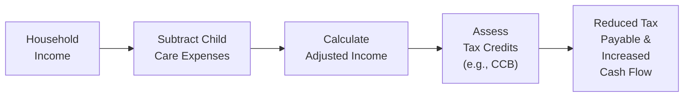
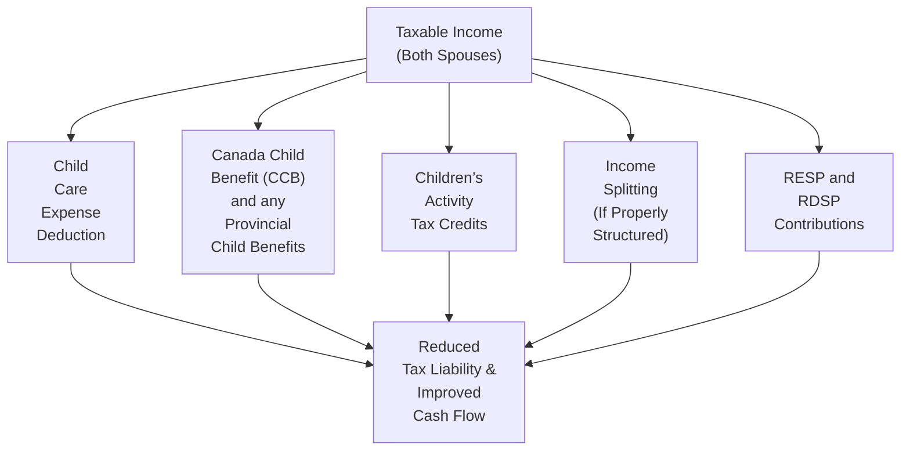

## 7.1 Tax Planning and Children

Let’s kick things off with a simple story: I once met a couple—let’s call them Sandra and Vik—who were totally overwhelmed when trying to figure out how to afford daycare for their toddler. They had heard that Canada offers all sorts of tax credits and benefits, but they had no idea where to start. Maybe you’ve been in a similar spot, fumbling for receipts, daydreaming about tax credits you aren’t even sure exist, or scratching your head while wondering “Which spouse reports child care expenses on the return?” That’s basically where they were.

Truth is, the Canadian system has a range of tax strategies that can help families with children significantly reduce their overall tax burden and put more money back into their monthly budget. So, let’s spend some time exploring those strategies—child care expense deductions, the Canada Child Benefit, children’s activities credits, income splitting, registered account setups, planning for children with disabilities, and more. By the end of this, you’ll feel way more confident about helping families (maybe even your own) enjoy a more secure financial future.

Before we dive in, it’s worth noting that we’re focusing specifically on Canadian tax regulations. Much of what you’ll see here is grounded in the federal Income Tax Act (Canada), and the details come from the Canada Revenue Agency (CRA). I’ll point you in the right directions for further reading and official tools—like the Child and Family Benefits Calculator—so you can run the numbers yourself.

Let’s get started!

-------------------------

### The Importance of a Comprehensive Tax Plan for Families

Building a family is expensive. It’s not just about diapers and daycare—though those are crucial considerations—but also the myriad ways children affect a household’s income, cash flow, and potential tax liabilities. A good tax plan can deliver real benefits by:

• Decreasing your taxable income through legitimate deductions and credits.  
• Increasing after-tax monthly cash flow by leveraging government programs such as the Canada Child Benefit (CCB).  
• Helping families invest in their children’s education and well-being with vehicles like Registered Education Savings Plans (RESPs) and strategies for children with disabilities.

Let’s look at how it all connects. The following diagram shows a very simplified flow of how child-related tax strategies might reduce overall taxes payable:

This diagram is not all-encompassing—there are plenty of add-ons and side strategies—but it gives a sense of how child-related deductions and credits filter through a family’s tax situation.

-------------------------

### Child Care Expense Deductions

So, let’s say you’re forking over a significant chunk of your monthly salary for daycare. It’s painful—but guess what? That cost may be partially deductible. Under the Income Tax Act (Canada), the lower-income spouse typically claims the child care expense deduction, thereby reducing their taxable income. In some scenarios—such as if the lower-income spouse is in school, incarcerated, hospitalized, or disabled—the higher-income spouse may be able to claim the deduction. But in the usual case, it’s the lower-income partner filing.

Eligible child care expenses include fees for daycare centres, nannies, babysitters, boarding schools, and certain summer camps. The maximum deduction you can claim for each child depends on their age, and it’s higher if the child has a disability. As a rough guideline:  
• For a child under age 7 (at the end of the year), the maximum annual deduction is typically up to CAD 8,000 per child.  
• For a child aged 7 through 16, the limit is often around CAD 5,000 per child.  
• For a child with a severe disability, the limit can be higher, typically around CAD 11,000 per child.

Before you just punch in some random figures, though, keep your receipts and statements organized. The CRA can—and sometimes does—ask for documentation to prove you actually incurred those expenses. The CRA’s official site (https://www.canada.ca/en/revenue-agency.html) offers guidelines on precisely which expenses qualify and which do not. Also, check out the “Mastering Tax, 2023” by CCH Wolters Kluwer for a deeper discussion on intricacies like partial-year claims and special circumstances.

#### Quick Example:  
Imagine Dina and Jacque. Dina has the lower income at CAD 40,000, and Jacque earns CAD 70,000. Daycare fees for their three-year-old child total CAD 6,000 per year. Let’s assume Dina claims the child care deduction of CAD 6,000, effectively reducing her taxable income from CAD 40,000 down to CAD 34,000. That’s a direct reduction in the taxable income line, which can produce a few hundred dollars (or more) in actual tax savings, depending on their combined provincial and federal marginal rates.

-------------------------

### Canada Child Benefit (CCB)

If I had a toonie for every parent who asked me how the Canada Child Benefit (CCB) might affect them, I’d, well, probably buy a few boxes of diapers. The CCB is a tax-free monthly payment designed to support families in covering the costs of raising children under 18. The key word here is “tax-free”—you won’t pay further tax on these amounts.

The amount you receive under the CCB depends on:  
• Your family’s net income.  
• The number and ages of your children.  
• Whether a child is eligible for the Child Disability Benefit (CDB).

Payments are recalculated every July based on the family’s adjusted net income from the previous year. That means big changes in income can shift your CCB entitlements significantly from one payment period to another. If you’re a financial planner or you’re planning your own finances, you’ll want to build these monthly amounts into your family’s budget or cash flow plan. 

For instance, parental leave or a job change can swing your annual income in ways that can raise or lower your future CCB. If you’re looking for a quick estimate, try the CRA’s own Child and Family Benefits Calculator (https://www.canada.ca/en/revenue-agency/services/child-family-benefits/child-family-benefits-calculator.html). It’s fairly user-friendly.

#### Minimizing Surprises  
One important note: If your income spikes unexpectedly, you could find yourself receiving more in CCB payments than you’re really entitled to, because your CCB was determined based on the prior year’s info. This might lead to the unpleasant surprise of having to repay some of the benefit the following year. So keep your adviser in the loop about major changes so you can estimate (and set aside money for) any potential clawbacks.

-------------------------

### Children’s Activities Tax Credits

A while back, the federal government offered dedicated tax credits for children’s fitness and arts activities, but those have been phased out at the federal level. However, some provinces (like Manitoba, British Columbia, and others) continue to offer credits or tax advantages for children’s sports or other extracurricular activities. 

If your province has such a credit:  
• Make sure you gather official receipts from the organization that runs the activity.  
• Keep track of relevant deadlines for claiming these credits.  
• Let your tax adviser know about any changes in provincial tax laws, because these can shift year to year.

The credit itself may be fairly small (for instance, it might reduce your provincial tax by a certain percentage of eligible fees), but who doesn’t like saving even a little money? If you’re paying for the activity anyway—like hockey camp or music lessons—why not take advantage of any local or provincial breaks?

#### Practical Tip  
Check your provincial or territorial government’s website or consult a local tax professional to confirm whether the credit still exists in your region and how much of an impact it can have.

-------------------------

### Income Splitting Opportunities

Canada used to have more generous forms of income splitting for families, but many of those have been eliminated or significantly curtailed. Still, there are legitimate strategies to split income when done carefully within the bounds of the Canadian tax rules. Two common strategies might be:

• **Prescribed Rate Loans:** A higher-income spouse lends funds to a family trust at the prescribed interest rate set by the CRA (which changes quarterly). If done correctly, the income or gains on those investments can be taxed in the hands of the beneficiary (e.g., children) instead of attributing back to the parent. You must ensure that the interest is paid annually and that the trust is properly set up to avoid attribution rules.  

• **Family Trusts for Children:** With a properly drafted trust agreement and by following the rules in the Income Tax Act, you may be able to effectively split investment income among family members in lower tax brackets. But again, be absolutely sure you meet all compliance requirements—Canada’s “attribution rules” can zap the tax benefit if you fail to structure or maintain the trust properly.

#### Attribution Rules in Brief
Attribution rules basically say: if you, as a higher-income parent, gift or lend money to your minor child, any resulting income (like dividends or interest) might still be attributed back to you for tax purposes. However, capital gains might be taxed in the child’s hands. The rules are fairly intricate. If you want the official read-through, check out the Income Tax Act (https://laws-lois.justice.gc.ca/eng/acts/I-3.3/)—a bit of a dense read, but definitely thorough.

-------------------------

### Registered Accounts for Children (Prelude to RESP, RDSP, etc.)

Registered tax-sheltered accounts are powerful tools for long-term saving and tax management. You may already be familiar with the Registered Education Savings Plan (RESP). An RESP helps parents (and sometimes grandparents or other contributors) save for a child’s post-secondary education while benefiting from government grants (like the Canada Education Savings Grant) and tax-deferred growth. We’ll talk about this in more detail in Section 7.2, but for now, know that an RESP is often one of the first accounts to consider when you have children.

Additionally, for a child with disabilities, there is the Registered Disability Savings Plan (RDSP), which we will discuss in Section 7.3. Similar logic applies—think government grants, tax-deferred growth, and specialized rules that encourage you to save for future care and expenses.

Because these accounts are so important, be sure to coordinate them with the rest of your family’s financial plan. Sometimes parents overlook how these registered accounts can impact their overall net worth projections, debt repayment strategies, or investment risk profile. If you have multiple children, you might weigh how to allocate contributions or ensure each child’s plan is getting the maximum matching grants available.

-------------------------

### Planning for Children with Disabilities

Families with children who have disabilities face unique financial and tax planning challenges. The good news is, Canadian tax policy recognizes these challenges and offers specific supports, such as:

• **The Disability Tax Credit (DTC):** A non-refundable tax credit that can significantly reduce income tax for a person with a disability or those who provide support. Eligibility depends on the child’s impairment and a medical practitioner’s certification.  

• **Child Disability Benefit (CDB):** This adds on to the Canada Child Benefit for families who care for a child who qualifies for the DTC. If your child is DTC-eligible, you may receive an additional monthly amount per child.  

• **RDSP (Registered Disability Savings Plan):** A tax-advantaged savings program that helps parents and caregivers set aside money over the long run for the child’s future care and living costs. The government might match contributions through the Canada Disability Savings Grant (CDSG) and, depending on family income, might also contribute the Canada Disability Savings Bond (CDSB). More details are given in Section 7.3.

In addition to these specific vehicles, keep an eye on overlapping considerations, such as provincial assistance for children with special needs, respite care subsidies, or specialized medical expense tax credits. Accurate recordkeeping is crucial because disability-related claims can require additional paperwork (e.g., T2201 Disability Tax Credit Certificate).

-------------------------

### Documentation and Recordkeeping

Let’s be honest: gathering and storing receipts is kind of boring, but it’s also essential if you want to ensure you’ll get all the tax savings you’re entitled to—and avoid stress during any CRA review. If you can, keep a dedicated folder or digital file for each child for each year. Put in:  
• Child care receipts (e.g., for daycare, nannies, babysitters, camps).  
• Activity-based receipts (if your province offers children’s activity credits).  
• Official documents supporting disability status, if applicable.  
• Statements of accounts for RESPs, RDSPs, or other investment structures you’ve set up for your children.  
• Any forms or schedules you use in your tax filing.

You might also keep a spreadsheet summarizing everything. That way, you won’t be frantically flipping through old envelopes and shoeboxes (or cursing yourself for losing half your receipts) come tax time.

-------------------------

### Putting It All Together: A Brief Case Study

Let’s circle back to Sandra and Vik from my little story. Here’s how they ended up using multiple tax strategies:

1. **Child Care Expense Deduction:** Since Sandra earned less than Vik, she claimed CAD 8,000 in daycare fees for their two kids under seven. This shaved several thousand dollars off her taxable income.  
2. **Canada Child Benefit (CCB):** Their combined net income determined their monthly CCB. Sandra double-checked the estimated annual CCB using the CRA Child and Family Benefits Calculator. They updated their net family income after Vik got a raise mid-year, preparing for the possibility of a lower monthly payment next year.  
3. **Children’s Activity Credit:** They live in a province that still has a children’s fitness tax credit. Sandra saved receipts from their daughter’s soccer program, netting them a modest provincial tax credit.  
4. **Prescribed Rate Loan:** Vik made a loan to a family trust at the CRA’s prescribed interest rate. The trust invested in dividend-paying stocks. Capital gains remain in the trust for the children. They were super careful to meet the annual interest payment requirement to avoid attribution.  
5. **RESP Setup:** They started an RESP for their kids, making sure to capture the maximum annual Canada Education Savings Grant.  
6. **Recordkeeping:** They kept a digital vault of receipts and statements. It was a bit tedious, but they realized it could literally save them thousands of dollars in taxes and potential headaches.

-------------------------

### Best Practices & Pitfalls

• **Consult a Professional:** Tax and family situations can get complicated. If in doubt, talk to an accountant, tax lawyer, or licensed financial planner who specializes in family taxation.  
• **Stay Informed of Regulatory Changes:** Tax laws are dynamic. For instance, a province might introduce or phase out certain credits or change the parameters of existing ones. Regularly check the CRA website (https://www.canada.ca/en/revenue-agency.html) and the new self-regulatory body for the investment industry, CIRO (https://www.ciro.ca), for updates.  
• **Beware of Attribution Rules:** If you attempt to split income to get a better tax rate, be aware that most straightforward “gifts” or “transfers” to minor children can trigger attribution. The strategies must be precisely set up to be effective.  
• **Check for Overpayments or Underpayments of CCB:** If your income changes mid-year, keep track of how it could affect next year’s CCB.  
• **Organize Paperwork:** This cannot be stressed enough. The CRA can ask for supporting documentation at any time, and you’ll want to be prepared.

-------------------------

### Additional Resources for Deep Dives

1. **Canada Revenue Agency — Official Website**  
   https://www.canada.ca/en/revenue-agency.html  
   From forms to “My Account” to child benefit calculators, the CRA website is your main official reference for anything tax-related.

2. **CRA Child and Family Benefits Calculator**  
   https://www.canada.ca/en/revenue-agency/services/child-family-benefits/child-family-benefits-calculator.html  
   A quick and straightforward way to see if you qualify for the CCB and how much you might receive.

3. **Income Tax Act (Canada)**  
   https://laws-lois.justice.gc.ca/eng/acts/I-3.3/  
   If you want to get really into the weeds (or if you just enjoy reading legal texts late at night), here’s the official legislation.

4. **“Mastering Tax, 2023” by CCH Wolters Kluwer**  
   A comprehensive guide to Canadian tax legislation, including family-specific details.

5. **CIRO (Canadian Investment Regulatory Organization)**  
   https://www.ciro.ca  
   Oversees investment dealers and sets regulatory policies. While much of its focus is on firms and advisors, it’s still a valuable resource for the latest in compliance and investor protection in Canada.

-------------------------

### Visual Overview

To tie everything together visually, here’s another quick diagram summarizing how the main child-focused tax benefits flow into a family’s overall financial plan:

Each strategy (child care expense deductions, CCB, children’s activities credits, etc.) potentially reduces overall taxes or increases disposable income. When combined carefully, families can ease the financial burden that comes with raising children and build a stronger foundation for the future.

-------------------------
  
All in all, tax planning when you have kids can get a bit complicated: you’ll find yourself juggling receipts, going online to check your CCB amounts, and maybe triple-checking whether you can write off that two-day soccer camp. But, well, that’s kind of life with kids—adaptable, a little chaotic, but deeply rewarding when you see your kids thriving and know your finances are in order.

-------------------------
  
## Test Your Knowledge: Tax Planning and Children Strategies



### Which spouse generally claims the child care expense deduction?

- [ ] Whichever spouse has a higher level of earned income.
- [ ] Whichever spouse is older.
- [x] Whichever spouse has the lower net income, unless special circumstances apply.
- [ ] It must alternate each year between spouses.

> **Explanation:** The Income Tax Act generally mandates that the lower-income spouse claim child care expenses. Special exceptions exist if the lower-income spouse is in school, hospitalized, disabled, or incarcerated.

### Regarding the Canada Child Benefit (CCB), which statement is correct?

- [ ] The CCB is considered taxable income to the lower-income spouse only.
- [x] The CCB is a tax-free benefit recalculated annually based on family net income.
- [ ] You must repay the CCB in full if your income increases by more than 5%.
- [ ] The CCB is only applicable to children aged 14 and above.

> **Explanation:** The CCB is a tax-free monthly payment, and the amount is recalculated each July based on the family’s prior year net income.

### Which of the following is true about children’s activity tax credits in Canada?

- [ ] Federal children’s fitness and arts tax credits are still available for all taxpayers.
- [x] Certain provinces continue to offer activity-based tax credits even though the federal credits ended.
- [ ] Only federally governed organizations provide eligible receipts.
- [ ] Credits automatically apply without the need for receipts or documentation.

> **Explanation:** The federal children’s fitness and arts credits have ended, but some provinces have introduced or maintained their own versions. Always keep receipts.

### Which best describes how prescribed rate loans can help with income splitting?

- [ ] The prescribed rate loan ensures no interest is ever paid to the lender.
- [ ] These loans are prohibited by the Income Tax Act.
- [ ] The loan must be interest-free to remain valid.
- [x] Income can be taxed in the hands of lower-income family members, provided the loan is set up and administered properly.

> **Explanation:** If the principal is loaned at the prescribed CRA interest rate and interest is paid on time, the investment income can be taxed to the beneficiary rather than attributed back to the lender.

### What is the chief purpose of the RESP?

- [ ] To avoid capital gains tax on a family’s primary residence.
- [ ] To provide an alternative to RRSP withdrawals.
- [x] To save for a child’s post-secondary education, benefiting from grants and tax-deferred growth.
- [ ] To split pension income between spouses.

> **Explanation:** RESPs allow parents and other contributors to save for a child’s education, often attracting government grants such as the Canada Education Savings Grant.

### Which statement about the Disability Tax Credit (DTC) is accurate?

- [x] It’s a non-refundable credit that can reduce federal income tax for individuals with severe disabilities.
- [ ] It’s limited solely to physical disabilities.
- [ ] It’s refundable in all circumstances.
- [ ] It cannot be transferred to a supporting family member.

> **Explanation:** The DTC is a non-refundable credit designed to reduce taxable income for individuals or their supporting family members, provided the qualifying criteria and certification (on form T2201) are satisfied.

### If a family’s income substantially increases mid-year, how might that impact their Canada Child Benefit (CCB)?

- [ ] It has no impact on next year’s CCB amount.
- [x] Their entitlement may decrease the following benefit year, potentially leading to overpayment concerns.
- [ ] They will automatically receive a higher CCB the following year.
- [ ] All future CCB payments are frozen for the next 24 months.

> **Explanation:** The CCB is recalculated every July using the previous year’s net income. A big income jump may lower the family’s CCB in the next benefit cycle, sometimes causing overpayment issues.

### What do attribution rules aim to prevent?

- [ ] The use of an RESP for post-secondary education.
- [ ] Families from claiming child care expenses.
- [x] Improper or artificial income splitting by attributing certain income back to the original transferor.
- [ ] Eligibility for health insurance benefits.

> **Explanation:** The tax authorities created attribution rules to deter high-income earners from shifting or “laundering” income through lower-income family members in a way that circumvents tax obligations.

### Which of the following tasks is critical for proper documentation?

- [x] Keeping receipts and statements for child-related expenses and activities.
- [ ] Only relying on your memory to recall exact amounts spent.
- [ ] Discarding nannies’ receipts after one year.
- [ ] Delaying the filing of income tax returns indefinitely.

> **Explanation:** Organized records for child care expenses, activity fees, and registered accounts are key to substantiating claims and ensuring full compliance with CRA reviews.

### True or False: The Child Disability Benefit (CDB) is always taxable income for the family.

- [x] True 
- [ ] False

> **Explanation:** Actually, this is a trick. The Child Disability Benefit (CDB) is typically a supplement to the CCB and is tax-free. If you chose “True,” review your understanding: the monthly amounts received for children with disabilities are generally not taxable.


