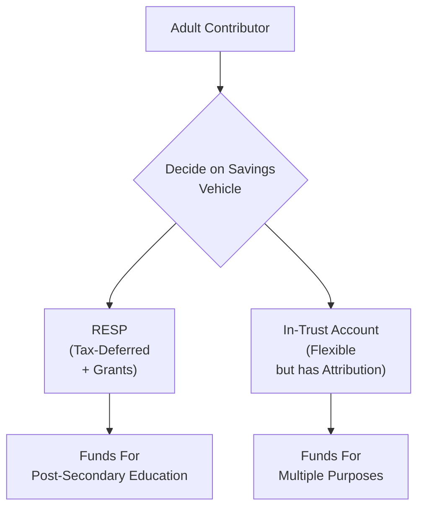

## 7.2 Tax-Planning Strategies Using Registered Education Savings Plans (RESPs) and Informal In-Trust Accounts

Saving for a child’s future often leads us to juggle between everyday bills, trying to keep a healthy emergency fund, and thinking about university or college costs that might sneak up faster than we plan. And then, when the talk of “tax optimization” or “RESPs” pops up, it’s easy for our eyes to glaze over. But hang on—there are some serious perks to learning the basics of a Registered Education Savings Plan (RESP), as well as considering other ways to save and invest on behalf of a minor, like Informal In-Trust Accounts. Let’s explore how both can help families build an education fund efficiently, minimize taxes (legally, of course!), and potentially capture government grants that pad those savings over time.

Sometimes I like to joke that if I started an RESP for my dog, I’d do it—if only the rules would allow it—but I guess the government wants a human beneficiary for these plans. Anyway, let’s get rolling.

--------------------------------------------------------------------------------

### Understanding the Role of RESPs in Your Financial Plan

The Registered Education Savings Plan (RESP) is a cornerstone for most Canadians who want to put away savings for a child’s post-secondary education. Chapter 7 as a whole deals with “Tax Planning Using Registered and Trust Accounts,” so in this section, we’ll dive into the nitty-gritty of how RESPs create tax advantages and how to avoid common pitfalls. We’ll also look at Informal In-Trust Accounts, which can be a complementary tool—especially if you’re looking to manage larger gifts or plan for a broader range of financial needs than just post-secondary schooling.

#### Purpose of an RESP

RESPs exist to help parents, grandparents, or anyone else (like that favorite aunt or uncle) chip in toward a child’s secondary and post-secondary educational expenses. The big draw? The government offers grants that boost your contributions. Plus, the funds inside the RESP grow tax-deferred—meaning you’re not paying tax on capital gains, dividends, or interest as long as the funds remain within the plan.

That tax-deferral can produce a compounding effect over several years, creating a larger pot for your child (the beneficiary) by the time they’re headed off to college, university, or sometimes even a trade school. When the child receives Educational Assistance Payments (EAPs) from the plan, the growth and government grants are taxed in the child’s hands, which usually leads to minimal tax owing because students often have low incomes.

Below is a simple flowchart illustrating how funds move in an RESP:

In this diagram, a parent or subscriber contributes to an RESP. The funds can grow on a tax-deferred basis until withdrawal. When the child enrolls in a qualifying program, they can receive EAPs, which helps cover tuition and living expenses.

--------------------------------------------------------------------------------

### Government Grants and Additional Incentives

A major advantage of RESPs is the availability of government grants, which directly boost your savings. It’s like free money (with conditions, of course).

#### Canada Education Savings Grant (CESG)

CESG is the bread and butter of RESP grants. For most families, the federal government will match 20% of the first $2,500 contributed per year, up to a maximum of $500 a year. Over the lifetime of the plan, a beneficiary can receive a maximum of $7,200 in CESG. That’s not too shabby, right?

There are also additional CESG amounts for lower-income families—so the rate can be even higher if the family’s income is below certain thresholds. This is all spelled out on the Government of Canada’s site (links provided in the references section).

#### Canada Learning Bond (CLB)

The Canada Learning Bond is specifically targeted at children from lower-income families. The government provides an initial amount (typically $500) and then subsequent annual deposits until the child turns 15 (up to a certain total amount, usually $2,000). No personal contributions are required to receive the Canada Learning Bond, which is pretty awesome if you’re strapped for cash but still want to start some form of education saving. Don’t forget that you still need an RESP for the child to receive the CLB!

#### Provincial Grants

Certain provinces sweeten the deal even more with grants or tax credits. For instance, Quebec has a credit called the Quebec Education Savings Incentive (QESI). The amounts and eligibility criteria vary from province to province, so financial planners need to delve into local rules to maximize these benefits for clients. Whenever you set up an RESP, it’s important to let your financial institution know which province you reside in and ensure they process any provincial grants or credits you may be eligible for.

--------------------------------------------------------------------------------

### Contribution Limits and Withdrawals

The government will throw in these grants, but they also keep some rules in place to prevent “overstuffing” an RESP and grabbing more free cash than they planned.

• There’s no formal annual limit on what you can plow into an RESP, but the lifetime contribution limit per beneficiary is $50,000.  
• You can continue contributing as long as the plan is open and the beneficiary is eligible, but remember the CESG limit—when you max that out, you won’t receive additional grant matching.  
• Since the growth in the plan is not taxed until withdrawal, the EAPs withdrawn for education are included in the beneficiary’s taxable income. Because many students have little to no taxable income, the actual tax paid on those amounts can be negligible.  

Now, a cautionary tale: If Junior goes to culinary school, that’s awesome, but if they decide not to pursue any post-secondary education at all, the portion of the RESP that came from government grants must be repaid to the government. The contributions themselves (your original principal) always remain yours, but the investment income portion (growth and interest earned) that is not used for educational purposes might be subject to a penalty tax if you collapse the plan. Some folks reallocate the plan to another child in the family if that’s an option. So, plan carefully and keep the lines of communication open with your kids.

--------------------------------------------------------------------------------

### Informal In-Trust Accounts: An Alternative or a Complement?

RESPs might be considered the “easy button” for education savings, but comprehensive planning often involves other accounts that can supplement or serve different purposes. An Informal In-Trust Account is one such tool. Picture it like this: you open an investment account for a minor child—no elaborate legal trust documents, just “in trust” in the name of that child. But there are important tax rules to note, especially the attribution rules under Canadian tax law.

#### Structure and Purpose of an In-Trust Account

An in-trust account is opened by an adult on behalf of a minor. The adult (trustee) contributes funds or property to the account. The idea is that these funds are owned by the child, but managed by the trustee until the child reaches the age of majority. It’s “informal” because it lacks the robust documentation of a formal trust. That can be both good (less setup cost, simpler to open) and not-so-good (possible complications if the setup isn’t properly documented).

Common reasons to use an in-trust account:  
• Gift money or investments to a child for general enrichment or future expenses not strictly limited to education.  
• Keep capital gains taxed in the child’s hands instead of the parent’s, subject to strict compliance with the attribution rules.  
• Provide a ready mechanism for grandparents or other family members to make direct monetary gifts for the child’s benefit outside an RESP’s constraints.

A quick note: Unlike an RESP, there’s no government grant aspect to in-trust accounts, so you won’t see the free 20% top-up or the CLB. But you also aren’t restricted to spending the funds on education. And that’s the big difference—flexibility to use the funds for any need the child might have when they grow older.

--------------------------------------------------------------------------------

### Attribution Rules and Tax Implications

We often say that the “Income Tax Act giveth, and the Income Tax Act taketh away.” Attribution rules illustrate this principle perfectly. When you gift money to a minor to invest on their behalf, the government wants to ensure you’re not simply “income splitting” to dodge taxes.

• **Interest and Dividend Income**: Typically, interest and dividends earned in an in-trust account for a minor will be attributed back to the contributor (the adult) and included in the adult’s taxable income. That means you can’t just wave a magic wand and have that income taxed at the child’s lower rate.  
• **Capital Gains**: Here’s a twist, though—capital gains generated within an in-trust account are not attributed back. They’re usually taxable in the child’s hands. This can be a big plus if you hold growth-oriented investments (like equities that appreciate over time) with limited dividend yields. The gains can be taxed at the child’s (much lower) rate when eventually realized.

**But be careful**: If the CRA sees any sign that the adult is benefiting from or controlling the funds for personal use, or that the child doesn’t really “own” the account, they might reassess the arrangement. This could lead to the full amount of capital gains or other income being attributed back to the adult. Proper documentation and a clear paper trail can help prove the funds are genuinely for the child’s benefit.

--------------------------------------------------------------------------------

### Management and Transfer of Assets

At some point, the child hits the age of majority—maybe 18 or 19, depending on your province—and legally, the money is theirs. No ifs, ands, or buts about it. That can be nerve-wracking if you’re not sure about your child’s financial responsibility at that age. Some parents worry that their 18-year-old might suddenly convert an in-trust account full of carefully accumulated funds into a brand-new sports car. There’s no guarantee they won’t!

So, from a practical standpoint, it’s wise to:  
• Regularly talk to your kid about budgeting, investing, and financial decision-making.  
• Make sure the child understands the long-term goals you had in mind (maybe it’s to help fund a wedding, buy a first house, pay for trade school, etc.).  
• Keep thorough records of all contributions, showing that the money truly belongs to the child.

--------------------------------------------------------------------------------

### Comparing RESPs and Informal In-Trust Accounts

It might help to see the differences and similarities at a glance:

| Feature                             | RESP                                           | Informal In-Trust Account                                 |
| ----------------------------------- | ---------------------------------------------- | --------------------------------------------------------- |
| Main Purpose                        | Post-secondary education funding               | Flexible, can be used for any purpose benefitting child   |
| Government Grants Available         | Yes (CESG, CLB, potentially provincial grants) | No                                                       |
| Contribution Limits                 | $50,000 lifetime limit per beneficiary         | No specific limit, but watch gifting and tax rules        |
| Taxation of Investment Income       | Tax-deferred inside the plan                   | Attribution rules apply; capital gains can remain with child |
| Ownership of Funds                  | Subscriber can close/roll over if child not in school | Child is legal owner; trustee manages until age of majority |
| Proof/Documentation                 | Formal application and plan contract           | Can be easier to open, but more risk of CRA scrutiny if not well documented |

--------------------------------------------------------------------------------

### Best Practices, Pitfalls, and Common Strategies

1. **Start Early**: The sooner you start an RESP, the more you’ll benefit from compound growth and government matching. Time is on your side if you begin when the child is very young.  
2. **Maximize Grants First**: Because the government basically hands out free money via the CESG, it often makes sense to fulfill the annual $2,500 contribution (if possible) before contributing money to other investments intended for the child.  
3. **Use an In-Trust Account for Surplus Savings**: If you’ve maxed out RESP grant opportunities or need more flexibility (perhaps for a gap year or travel, or you want the funds available for something other than post-secondary tuition), consider an in-trust account. But be mindful of the attribution rules.  
4. **Be Strategic About Investment Choices**: In an RESP, the tax-deferred environment and matching grants make it conducive to a broad range of investments. In an in-trust account, you may want to emphasize holdings that produce capital gains over interest or dividends to reduce attribution.  
5. **Keep Personal Use Out**: Resist the temptation to dip into an in-trust account for personal reasons. Doing so can provoke the CRA to question the validity of the “gift.”  
6. **Plan for the Unexpected**: If a beneficiary doesn’t attend post-secondary schooling, you might redirect the RESP to a sibling, or if there’s no suitable alternate beneficiary, you may pay taxes plus an additional penalty on accumulated income. Meanwhile, an in-trust account always remains the property of the child.  
7. **Documentation Is King**: Maintain a clear paper trail to show how funds are contributed and used. This can literally save you from a big headache if audited.  
8. **Coordinate With Overall Financial Goals**: Consider your own retirement and other family objectives. Throwing every spare dollar into a child’s RESP can overshadow your own future security. Balance is key.

--------------------------------------------------------------------------------

### Practical Example: Combining an RESP with an In-Trust Account

Imagine you have twin kids, Nora and Lucas. You get an RESP for each right when they’re born, quickly hooking into the annual CESG. By the time they’re six, you’ve managed to contribute consistently, and the account is on a solid path—nice job. You also anticipate receiving a sizeable inheritance from an uncle who wants some of it to go specifically for the kids’ future, not necessarily for education. An informal in-trust account can house that inheritance. With smart investing focused on capital-appreciation stocks or growth funds, any capital gains remain in Nora’s or Lucas’s hands, potentially taxed at a very low rate.

If one child doesn’t pursue post-secondary education or only completes a shorter program, you’ll still have that in-trust account for general life needs. Meanwhile, you’ve tapped maximum CESG grants in the RESP. This is a very real scenario many families navigate, and combining these strategies can provide both structure and flexibility.

--------------------------------------------------------------------------------

### Diagrams for Quick Reference

Below is a simple diagram comparing the main structures:

• The adult contributor has multiple pathways to save for a minor child.  
• For education, the RESP is specialized with grants and tax deferral.  
• For broader uses or additional savings beyond education, the in-trust account can be utilized (mindful of the tax rules).

--------------------------------------------------------------------------------

### Key Regulatory and Resource References

• [Canada Revenue Agency (CRA) – Registered Education Savings Plan Information](https://www.canada.ca/en/revenue-agency/services/tax/individuals/topics/registered-education-savings-plans-resps.html)  
• [Employment and Social Development Canada – RESP Overview](https://www.canada.ca/en/employment-social-development/services/learning-education/education-savings/resp.html)  
• [CIRO – Canadian Investment Regulatory Organization](https://www.ciro.ca) for current regulatory guidance on investment dealers and their obligations in opening accounts like RESPs or in-trust accounts.  
• “RESPs, RRSPs, and RRIFs: A Personal Finance Primer” (book) for deeper dives into plan structures and strategies.  
• Don’t forget the Canadian Investor Protection Fund (CIPF) for understanding how your accounts are protected if a CIRO member firm becomes insolvent.

--------------------------------------------------------------------------------

### Glossary

• **RESP (Registered Education Savings Plan):** A tax-sheltered investment plan to help individuals save for post-secondary education.  
• **CESG (Canada Education Savings Grant):** Government grant matching a portion of an RESP contributor’s deposit (typically 20% on the first $2,500, up to $500 per year).  
• **CLB (Canada Learning Bond):** A government contribution for RESPs aimed at children in lower-income families, no personal deposit required.  
• **In-Trust Account (Informal Trust):** An account opened by an adult on behalf of a minor without a formal trust deed, subject to specific tax attribution rules and other considerations.  

--------------------------------------------------------------------------------

### Conclusion: Structuring Your Child’s Financial Future

RESPs and in-trust accounts both play a pivotal role in a well-rounded financial plan—especially if you have young children or plan to support a niece, nephew, or grandchild. RESPs attract government grants that effectively hand you free money for the child’s education, while in-trust accounts offer flexibility and, if handled wisely, beneficial tax treatment of capital gains.

Just remember: plan early, plan proactively, and keep crystal-clear documentation. And do talk with a qualified advisor if you’re unsure how these structures integrate with your personal situation. Because there’s nothing more satisfying than helping the next generation graduate with minimal student debt—so they can get started on the rest of their life without that extra financial burden.

--------------------------------------------------------------------------------

## Test Your Knowledge: Tax Planning with RESPs and In-Trust Accounts



### Which of the following is a key advantage of an RESP over an informal in-trust account?

- [ ] More flexible use of funds for non-educational expenses  
- [ ] Immediate ownership of funds by the minor  
- [x] Eligibility for government grants such as the CESG  
- [ ] Guaranteed tax-free withdrawals for the child  

> **Explanation:** RESPs qualify for government grants like the CESG, which is a major advantage over standard in-trust accounts that do not offer such government top-ups.

### What is the maximum lifetime contribution limit for an RESP beneficiary?

- [ ] $25,000  
- [ ] $100,000  
- [x] $50,000  
- [ ] There is no limit  

> **Explanation:** The lifetime contribution limit for each RESP beneficiary is $50,000, as set by the federal guidelines.

### In an informal in-trust account, which type of income is typically not attributed back to the contributor?

- [ ] Dividends  
- [ ] Interest  
- [x] Capital gains  
- [ ] All of the above are attributed back  

> **Explanation:** Under the Income Tax Act, dividends and interest earned in an in-trust account for a minor generally attribute back to the original contributor. However, capital gains can be taxable in the minor’s hands, providing a potential tax advantage.

### Which government body currently acts as Canada’s Self-Regulatory Organization for investment dealers and mutual fund dealers?

- [ ] IIROC  
- [ ] MFDA  
- [x] CIRO  
- [ ] CIPF  

> **Explanation:** As of January 1, 2023, the Canadian Investment Regulatory Organization (CIRO) is the national self-regulatory organization overseeing investment dealers, mutual fund dealers, and market integrity. IIROC and MFDA are historical entities.

### Where does the investment growth in an RESP get taxed when withdrawn for post-secondary education?

- [x] In the beneficiary’s hands  
- [ ] In the subscriber’s hands  
- [ ] At the corporate tax rate  
- [ ] It isn’t taxed at all  

> **Explanation:** Educational Assistance Payments (EAPs)—which include the growth and the government grants—are generally taxed in the beneficiary’s hands, who is often in a low tax bracket while in school.

### Which of the following is a common pitfall when setting up an informal in-trust account?

- [x] Lack of proper documentation leading to CRA re-assessment  
- [ ] Access to unlimited government grants  
- [ ] High account setup fees  
- [ ] Mandatory contributions every year  

> **Explanation:** A lack of proper documentation is a frequent downfall. The CRA might challenge the legitimacy of the trust arrangement if records don’t clearly show that the funds genuinely belong to the minor.

### True or false: In an in-trust account, if the child is 16 and wants to withdraw funds, the trustee is not obligated to allow it if they see it as a frivolous use.

- [x] True  
- [ ] False  

> **Explanation:** Because the child is still a minor, the trustee retains legal authority to administer and protect the funds until the child reaches the age of majority, even if the child requests an early withdrawal for non-beneficial reasons.

### Which statement best describes the Canada Learning Bond (CLB)?

- [x] A government contribution for lower-income families that requires no personal deposit  
- [ ] An incentive from provincial governments only  
- [ ] A special bond that pays a fixed interest rate to children  
- [ ] A top-up program for high net worth families  

> **Explanation:** The Canada Learning Bond is specifically targeted at lower-income families, and no personal contributions are needed to receive it. It’s credited directly to the child’s RESP once established.

### What is the usual penalty if an RESP is collapsed because the beneficiary does not pursue post-secondary education?

- [ ] Loss of all contributions  
- [ ] A 50% tax on contributions  
- [x] Return of all grants and an additional tax on investment growth  
- [ ] No penalty if it’s under $10,000  

> **Explanation:** If the beneficiary doesn’t attend a qualifying institution, the statutory rules require repayment of any government grants, and the accumulated income may be taxed with an additional penalty if not transferred to another eligible beneficiary.

### True or False: When a beneficiary turns the age of majority, assets in an informal in-trust account become their legal property and can be used at their discretion.

- [x] True  
- [ ] False  

> **Explanation:** Once the child reaches the age of majority (18 or 19, depending on the province), the funds in an in-trust account legally belong to the beneficiary, meaning it’s fully their decision how to use them.


