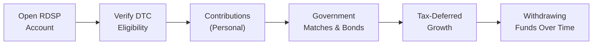

## 7.3 Registered Disability Savings Plan (RDSP)

Before we dive into the specifics of the Registered Disability Savings Plan (RDSP), let me share a quick personal anecdote. Several years ago, I had a close friend—let’s call her Sarah—whose younger brother lived with a severe physical disability. They had heard about the RDSP but didn’t fully understand how to set it up or why it might be beneficial. Over coffee one afternoon, we unpacked the details: from eligibility for the Disability Tax Credit (DTC) to how the government matching grants and bonds could help them save. By the end of our chat, the plan made total sense for their family. Now, Sarah’s brother has a growing fund that will help support him for many years to come.

I mention this story because the RDSP can sometimes feel like a maze of rules, eligibility criteria, and terms. But if you stick around, I think you’ll find it’s a vital tool in your tax and financial planning arsenal—especially if you or someone close to you is living with a disability. And hey, you might even inspire a friend (like Sarah) to take advantage of a program that can bring a lot of peace of mind.

Below, we’ll walk through each key aspect of the RDSP, from how to set it up and maintain eligibility, to maximizing government contributions, to strategic considerations for estate planning. Let’s get started.

---

### Purpose and Eligibility

The RDSP is designed to ensure long-term financial security for individuals with disabilities. The primary requirement is that the beneficiary of the RDSP must be eligible for the Disability Tax Credit (DTC), which itself has criteria determined by the Canada Revenue Agency (CRA). In other words, if you don’t have DTC eligibility, you can’t open or maintain an RDSP. Individuals can continue to receive RDSP contributions up to the end of the calendar year in which they turn 59.

If you’re not yet familiar with the Disability Tax Credit: it’s a non-refundable tax credit intended to help offset some of the extra costs associated with living with a disability. Once qualified for the DTC, you can be a beneficiary of an RDSP. A beneficiary, in this context, refers to the person with the disability in whose name the plan is opened, and who will ultimately benefit from plan withdrawals.

Key points on eligibility:
• The beneficiary must be a Canadian resident.  
• The beneficiary must have a valid Social Insurance Number (SIN).  
• The beneficiary must qualify for the DTC.  
• Contributions can be made up to the beneficiary’s age of 59 (end of that calendar year).  

If you’re wondering, “So... how does that help in the long run?”, keep in mind that RDSPs can significantly multiply personal contributions through government matching programs, making them incredibly valuable over time.

---

### Government Contributions (Canada Disability Savings Grant and Canada Disability Savings Bond)

One of the most attractive features of an RDSP is the potential to receive two different forms of government assistance: the Canada Disability Savings Grant (CDSG) and the Canada Disability Savings Bond (CDSB). These programs are designed to encourage Canadians to invest in the long-term financial well-being of individuals with disabilities.

#### Canada Disability Savings Grant (CDSG)

The CDSG is effectively a matching program. Depending on the beneficiary’s family income level, the government will match a percentage of contributions made by the plan holder:

• On the first $500 contributed each year, the government will often match 300% (meaning you put in $500, and the government throws in $1,500).  
• On the next $1,000 contributed each year, there can be a 200% match (so you put in $1,000, and the government adds $2,000).  
• There is an annual cap on the grant you can receive (up to $3,500 in matching dollars per year), and a lifetime maximum of $70,000 in total CDSG benefits per beneficiary.

Now, the exact matching formula can shift over time. The government sometimes updates the thresholds and matching rates to reflect policy changes or to provide greater support to low-income families. As a best practice, verify the current formula through official Government of Canada channels—since the last thing you want is to miss out on new or improved matching benefits.

An example:  
Suppose you contribute $1,500 in a given year. The first $500 might be matched at 300% (grant of $1,500), and the next $1,000 could be matched at 200% (grant of $2,000). So your total $1,500 personal contribution generates an additional $3,500 from the government, up to the annual limit. This is a big deal: a small out-of-pocket amount might balloon your overall RDSP balance.

#### Canada Disability Savings Bond (CDSB)

Unlike the CDSG, which requires you to contribute your own funds, the Canada Disability Savings Bond (CDSB) is available to low- or modest-income beneficiaries with disabilities and does not require any personal contribution. If the beneficiary’s family income falls below a certain threshold, the government deposits an annual bond directly into the RDSP. That deposit could be up to $1,000 a year, with a lifetime maximum of $20,000.

This is crucial for those who may have difficulty making regular contributions but still want to build a stable financial foundation for the future. The bond is essentially a direct infusion of funds, and it underscores the government’s commitment to ensuring that individuals with disabilities—regardless of their personal financial situation—can grow some long-term savings.

#### Diagram: RDSP Overview

Below is a simple visual representation of how an RDSP might be structured, highlighting the flow from personal contributions, government grants, and bonds:

In this diagram:
• A highlights opening an RDSP account, often through a financial institution.  
• B indicates confirming DTC eligibility (mandatory).  
• C shows personal contributions made by the plan holder.  
• D represents government grants (CDSG) and bonds (CDSB).  
• E denotes tax-sheltered growth inside the plan.  
• F reflects the withdrawal stage, where funds are eventually accessed by the beneficiary.

---

### Tax Treatment and Withdrawals

An RDSP’s tax advantages are a major draw, but pay attention to the associated rules. If you withdraw too soon or don’t follow the timeline for holding grants/bonds, you might have to repay some government contributions.

#### Tax-Deferred Growth

All investment earnings accumulated within the RDSP remain sheltered from tax until they’re withdrawn. This means you can buy bonds, stocks, mutual funds, GICs, or other eligible investment vehicles (the selection depends on the financial institution and your risk profile) and benefit from compounding without paying tax on your investment returns annually. This structure is akin to the well-known Registered Retirement Savings Plan (RRSP) in that regard, though the RDSP is specifically for disability savings.

Think of it as letting your contributions, your grants, and your bond money work for you in a little protected bubble, compounding year after year, so that, hopefully, by the time you need it, the nest egg is significantly larger than if you were taxed yearly on growth.

#### Withdrawal Rules

When you withdraw from the RDSP, the contributions are split into two components for tax purposes:

1. The original contributions you made (the principal) are not taxable when withdrawn.  
2. Grants, bonds, and any earnings (interest, dividends, capital gains, etc.) are taxable in the beneficiary’s hands.

Let’s say you withdraw $10,000, and $4,000 of that represents your contributions. That $4,000 is not taxed. But the remaining $6,000 (composed of government matching funds, bond funds, and income earned in the plan) becomes taxable income in the beneficiary’s hands in the year of withdrawal.

##### Early Withdrawals and the 10-Year Hold

Here’s a sticky point: If you withdraw funds within 10 years of receiving a grant or bond, you will generally have to repay $3 of grant and/or bond money for every $1 withdrawn (up to the entire amounts of grants and bonds received in the preceding 10 years). This mechanism is known as the “assistance holdback amount”—it’s the government’s way of ensuring people use the plan for long-term saving rather than short-term needs.

So, if you’re tempted to withdraw funds early, be very aware of the potential clawback. The best approach: plan your RDSP usage carefully to avoid losing these valuable government contributions.

#### Lifetime Disability Assistance Payments (LDAPs)

Lifetime Disability Assistance Payments (LDAPs) are regularly scheduled withdrawals that can begin at any time but must start by the end of the year in which the beneficiary turns 60. LDAPs continue for the beneficiary’s entire life, or until the funds are exhausted. These payments are intended to support ongoing living expenses, such as housing, medical care, or daily necessities.

The formula for LDAPs can feel a bit complicated, partly because there is a maximum annual withdrawal limit that depends on the beneficiary’s age, life expectancy, and the total value in the plan. It’s wise to talk with a financial advisor or consult the CRA guidance to determine how best to structure this so you don’t overshoot or undershoot the plan’s withdrawal thresholds.

---

### Strategic Considerations

While the nuts and bolts of the RDSP are important, it’s equally valuable to think about how the RDSP fits into a larger financial strategy or estate plan. Let’s look at a few scenarios.

#### Maximize Government Matching

To get the most out of your RDSP, try to make regular, consistent contributions. By contributing enough each year to trigger the maximum annual grant (up to $3,500 from the government, assuming you fall within the relevant income thresholds), you set yourself up for a significant boost over time. Ideally, ensure you contribute at least $1,500 each year (to get the max matching on the first $500 at 300% and the next $1,000 at 200%). However, if your or your family’s income is lower, you could see even more beneficial matching rates.

Also note that “carry-forward” provisions exist, allowing beneficiaries to catch up on unused CDSG and CDSB entitlements from the past 10 years (subject to eligibility and annual maximums). This means if you miss out on some years, you might still be able to recoup some of that lost government contribution, although you can’t do it all in a single year.

#### Long-Term Estate Planning

Let’s say you’re a parent or caregiver for an adult child with a disability. You may be worried about what happens after you’re gone. The RDSP can be part of a solution, providing a structured stream of income through LDAPs or lump-sum withdrawals that support the beneficiary’s needs indefinitely. Combine the RDSP with a carefully structured trust—such as a Henson Trust, which is common for individuals receiving disability benefits who need to preserve those benefits—and you have a cohesive plan that secures your loved one’s financial future.

Pro tip: If you’re building an estate plan, consider naming the child with a disability as a beneficiary of your RRSP, TFSA, or life insurance policy, but coordinate with the RDSP. Doing so can help minimize complexities, and you might even direct certain bequests or insurance benefits straight into the RDSP, if allowed and if it fits the strategy. Always consult a legal and tax professional because each province has its own rules and the interplay between social benefits, trusts, and estates can get tricky.

#### Interaction with Income Assistance Programs

One of the biggest questions people ask is: “Will the RDSP reduce my disability benefits?” That depends on your province or territory. Fortunately, in most provinces, RDSP withdrawals do not reduce social assistance or disability benefits. The provincial governments usually consider RDSPs exempt assets for benefit calculations, but it’s still wise to confirm the local regulations.

There are sometimes additional complexities—for instance, if the withdrawals become large enough, they might affect other income-tested programs like the Guaranteed Income Supplement (GIS) once the beneficiary reaches retirement age. Remember: rules can change, so always check with local authorities to ensure up-to-date information.

---

### Case Study Example: Maria’s RDSP

Maria is 30 years old and has been eligible for the DTC since she was 25. Her annual income is fairly modest. Her parents, who also want to help ensure Maria has a secure future, decide to open an RDSP in her name. Let’s see how the plan unfolds:

• Initial Contribution: Maria’s parents contribute $1,500 in the first year.  
• Matching Grant (CDSG): The government matches the first $500 at 300% = $1,500. Then it matches the next $1,000 at 200% = $2,000. So the total CDSG for that year is $3,500.  
• Canada Disability Savings Bond (CDSB): Because Maria’s family income is below a certain threshold, she also qualifies for a $1,000 bond deposited straight into her RDSP without requiring any additional personal contribution.  
• End of Year 1: Maria’s RDSP has $1,500 (parents’ money) + $3,500 (CDSG) + $1,000 (CDSB) = $6,000. Any growth on these amounts is tax-deferred.  

Imagine repeating this annually for 20 years, factoring in possible changes in matching rates, carry-forwards, and varying contributions. By the time Maria approaches retirement age, she may have a substantial fund ready for her to draw on when she needs it most.

---

### Regulatory Context: CIRO and Investor Protection

As of 2023, the new Canadian Investment Regulatory Organization (CIRO) supervises investment dealers and mutual fund dealers, having replaced two defunct predecessor self-regulatory organizations (the Mutual Fund Dealers Association of Canada—MFDA—and the Investment Industry Regulatory Organization of Canada—IIROC). If you’re opening an RDSP via a mutual fund dealer or an investment dealer, you are now dealing under the purview of CIRO, and your assets are protected by the Canadian Investor Protection Fund (CIPF). CIPF became Canada’s sole investor protection fund in 2023 as well. If a member firm becomes insolvent, CIPF covers client assets according to its coverage limits. For additional details or official updates, visit https://www.ciro.ca.

Although the RDSP is primarily governed by the CRA and Employment and Social Development Canada (ESDC), it’s good to be aware of these regulatory changes. Make sure your financial advisor—whether they used to be under IIROC or the MFDA—is now recognized by CIRO.

---

### Practical Tips and Pitfalls

• Tip: Even if you can’t contribute the full $1,500 to get the maximum annual $3,500 grant, every dollar helps. Smaller contributions still get matched at generous rates—just less total grant.  
• Tip: Watch the 10-year hold. If you know you’ll need the funds sooner, consider how it might affect your grants and bonds. You might still open the plan but carefully plan withdrawals so you don’t lose out on substantial government assistance.  
• Pitfall: Forgetting to maintain DTC eligibility. If you lose your DTC status, the RDSP may need to be closed. You might have to repay grants and bonds, and your plan could end up taxed differently.  
• Pitfall: Missing out on carry-forward provisions. If you fail to track unused CDSG or CDSB entitlements, you could leave free money on the table.  

---

### Glossary

• **Registered Disability Savings Plan (RDSP)**: A registered investment plan intended to provide long-term financial stability for individuals with disabilities. Eligibility depends on the Disability Tax Credit.  
• **Canada Disability Savings Grant (CDSG)**: A government grant that matches contributions to an RDSP up to a specific annual and lifetime maximum.  
• **Canada Disability Savings Bond (CDSB)**: A bond contribution from the government for low- or modest-income families, which does not require personal contributions.  
• **Lifetime Disability Assistance Payments (LDAPs)**: Recurring, periodic withdrawals from an RDSP intended to give long-term income support to the beneficiary.  

---

### Additional Resources

• **CRA’s Registered Disability Savings Plan**:  
  https://www.canada.ca/en/revenue-agency/services/tax/individuals/topics/registered-disability-savings-plan-rdsp.html

• **Employment and Social Development Canada – RDSP Overview**:  
  https://www.canada.ca/en/employment-social-development/services/disability-savings.html

• **Financial Planning for Canadians with Disabilities (CPA Canada)**:  
  This specialized guide delves deeper into RDSP management, trusts, and estate planning strategies for Canadians with disabilities.

• **CIRO (Canadian Investment Regulatory Organization)**:  
  https://www.ciro.ca for regulatory updates, connections to CIPF coverage, and the latest developments in the investment landscape.

---

From my own experience, and from seeing how RDSPs have helped my friend Sarah’s brother and countless others, I truly believe the RDSP stands as one of the most beneficial programs that families and individuals with disabilities can access. Yes, there are intricacies and you need to maintain some discipline around contributions and withdrawals. But the payoff—a future that’s more secure, with better financial flexibility—is worth the effort.

I hope this overview equips you with the knowledge to get started, or to help a friend or a client look into establishing an RDSP. Remember, you’re not just opening an account; you’re building a long-term financial foundation that supports and empowers persons with disabilities to live with greater freedom and stability.

---

## Test Your Knowledge about Registered Disability Savings Plans (RDSP)



### Which of the following statements best describes who may qualify as a beneficiary of an RDSP?

- [ ] Any Canadian resident over age 50.
- [x] A Canadian resident with a valid Social Insurance Number who qualifies for the Disability Tax Credit (DTC).
- [ ] Anyone receiving social assistance from the provincial government.
- [ ] Anyone who is an immediate family member of a disabled individual.

> **Explanation:** The beneficiary of an RDSP must be eligible for the Disability Tax Credit (DTC), a Canadian resident, and have a valid SIN.

---

### What is the maximum annual grant the government may provide via the Canada Disability Savings Grant (CDSG)?

- [ ] $2,000
- [ ] $5,000
- [x] $3,500
- [ ] $1,500

> **Explanation:** Currently, the CDSG can provide up to $3,500 in matching contributions per year, subject to the beneficiary’s family income and contribution amounts.

---

### Which of the following accurately describes the Canada Disability Savings Bond (CDSB)?

- [x] A government bond contribution for low- or modest-income beneficiaries that does not require any personal contribution.
- [ ] A bond matching program requiring a minimum contributor deposit of $1,000.
- [ ] A bond that only becomes available if the beneficiary has contributed over $2,000 each year.
- [ ] None of the above.

> **Explanation:** The CDSB is a direct bond provided to low- and modest-income beneficiaries with disabilities, without requiring personal contributions.

---

### How are grants, bonds, and investment earnings taxed upon withdrawal from an RDSP?

- [ ] They are never taxed.
- [x] They are taxed as income in the hands of the beneficiary when withdrawn.
- [ ] They are taxed as capital gains in the hands of the contributor.
- [ ] They become subject to a special 50% flat tax at withdrawal.

> **Explanation:** When withdrawn, any grants, bonds, and earnings within the RDSP are taxable to the beneficiary, while personal contributions (principal) are returned tax-free.

---

### What is a key consideration of the “10-year hold” rule in an RDSP?

- [ ] There is no penalty for withdrawal at any time.
- [ ] It only applies to individuals with high income.
- [x] If you withdraw funds that were contributed as grants or bonds within the last 10 years, you must repay a portion of those government contributions.
- [ ] The “10-year hold” does not apply to bonds or grants.

> **Explanation:** The “assistive holdback” requires you to repay grants and bonds if you withdraw those amounts within 10 years of receipt.

---

### Which term describes recurring payments that can start at any time but must begin by the end of the year the beneficiary turns 60?

- [ ] Contribution-based payments
- [x] Lifetime Disability Assistance Payments (LDAPs)
- [ ] Permanent Disability Payments (PDPs)
- [ ] Guarantee Disability Assistance Payments (GDAPs)

> **Explanation:** LDAPs are periodic withdrawals intended to provide ongoing financial support throughout the beneficiary’s life, starting no later than the end of the year in which they turn 60.

---

### In many provinces, how do RDSP withdrawals affect disability benefits?

- [x] RDSP withdrawals are often excluded when determining disability assistance.
- [ ] RDSP withdrawals immediately disqualify one from provincial disability benefits.
- [ ] RDSP withdrawals are taxed at 50% for beneficiaries, reducing their net benefit.
- [ ] Provincial rules do not allow RDSP withdrawals at all.

> **Explanation:** Generally, RDSP withdrawals do not reduce an individual’s provincial disability benefits. However, it is crucial to confirm local rules as they may vary.

---

### Which government body replaced the MFDA and IIROC through an amalgamation in 2023?

- [ ] Canadian Mutual Securities Organization
- [ ] Financial Services Regulatory Authority
- [x] Canadian Investment Regulatory Organization (CIRO)
- [ ] Chartered Investor Oversight Council

> **Explanation:** After amalgamation, the two former self-regulatory organizations (MFDA and IIROC) are now replaced by CIRO, which regulates both investment dealers and mutual fund dealers.

---

### Which provincial or federal department primarily governs the rules and regulations for the RDSP in Canada?

- [x] The Canada Revenue Agency (CRA) and Employment and Social Development Canada (ESDC)
- [ ] Your local city council
- [ ] The Department of Finance exclusively
- [ ] CIRO

> **Explanation:** The CRA and ESDC are primarily responsible for the RDSP. CIRO oversees investment dealers but does not set RDSP tax regulations.

---

### True or False: If the beneficiary loses Disability Tax Credit (DTC) eligibility, they can continue the RDSP without changes for as long as they wish.

- [ ] False
- [x] True, but only under certain circumstances for a limited grace period.
  
> **Explanation:** If the beneficiary is no longer DTC-eligible, the RDSP might have to be closed or adjusted, though there are special rules that allow a temporary grace period. After that period, the plan usually terminates unless the beneficiary re-qualifies for the DTC.


