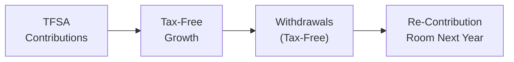

## 7.4 Tax-Free Savings Accounts (TFSAs)

Sometimes, I hear people say, “Wait, another registered account? Between RRSPs, RESPs, and TFSAs, how do I keep track of all these acronyms?” I completely get that. It can feel a bit overwhelming. But, trust me, TFSAs—Tax-Free Savings Accounts—are among the most flexible and valuable tools in Canada’s financial planning landscape. Whether you’re new to investing or a seasoned pro, a TFSA provides a unique way to shelter investment growth and earn tax-free income on your contributions.

Below, we’ll explore how TFSAs work, how to avoid common pitfalls, and how you can leverage them—no matter if you’re saving for a house, building an emergency fund, or planning a comfortable retirement. Let’s dive in.

## Purpose and Key Features

TFSAs were introduced back in 2009 as a way to encourage Canadians to save more. The underlying idea is pretty simple: you contribute after-tax dollars, your investments grow tax-free, and you can withdraw your money without paying additional tax. That’s the big plus right there—those withdrawals, including any investment gains you’ve earned, are completely tax-free.

• Eligibility: You must be at least 18 years old and have a valid Social Insurance Number (SIN).  
• Contribution Limits: The government sets an annual limit that grows with inflation. For instance, in 2023, it was $6,500. However, the annual limit has changed over time, so you always want to double-check the latest figure.  
• Unused Room Accumulates: If you don’t contribute the maximum in one year, you keep the unused room—indefinitely.  
• Withdrawals: You can take out funds anytime. The best part is that you get that contribution room back in the following calendar year.

TFSAs may not reduce your taxable income like RRSP contributions do, but because the withdrawals are tax-free, they are especially powerful if you expect to be in a higher tax bracket in the future or if you simply appreciate the flexibility of withdrawing funds without penalty.

I remember the first time I used my TFSA for an emergency. I had some unexpected car repairs—one of those “uh-oh” moments. Being able to grab the money hassle-free, and knowing it wouldn’t haunt me at tax time, was pretty amazing.

## Contribution Rules and Limits

A critical piece of the TFSA puzzle is understanding how much you can contribute and when. Let’s walk through that.

### Annual Contribution Limit

The government revises the annual contribution limit from time to time. While it started at $5,000 per year in 2009, it has since risen for many (although not all) years. For instance, in 2023 it was $6,500. But you should verify the current year’s limit on the Canada Revenue Agency (CRA) website or by checking your MyAccount on CRA for the exact figure.

The government indexes the contribution limit to inflation. So it may change every few years, giving you a little more room—like an automatic “inflation raise” for your savings capacity. If you hold multiple TFSAs across different financial institutions, the overall limit applies to all of them combined, not to each account individually.

### Cumulative Contribution Room

One of the best advantages with TFSAs is that your unused contribution space piles up over the years. Let’s say you were eligible to contribute $6,500 in 2023 but only chipped in $4,000. That remaining $2,500 of unused room doesn’t vanish. You can carry it forward and use it in any future year.

And here’s a neat twist: if you withdraw money from your TFSA, you get that contribution room back—but not until the following calendar year. So in that sense, you can think of a TFSA as “breathing.” You deposit, grow your money tax-free, withdraw for something urgent or important (like a car or an emergency), and next year, you can re-contribute that amount.

Let’s illustrate with a quick example:
• In 2022, Marie contributed $6,000 (the limit that year was actually $6,000).  
• In early 2023, Marie needed $3,000 from her TFSA for a surprise expense and withdrew it.  
• For 2023, her new overall limit was $6,500 plus any leftover space from previous years. But she only regains that additional $3,000 of room when 2024 starts.  

It’s something to keep in mind to avoid confusion or, worse, an accidental over-contribution.

## Tax and Investment Growth

### Non-Taxable Earnings

Inside your TFSA, any interest, dividends, or capital gains your investments earn are set aside in a neat little tax-free bubble. Whenever you withdraw them, you don’t pay any additional tax. So, if you’re investing in something with strong potential for growth—like equities or higher-yield bonds—the gains you make won’t be subject to tax.

This is especially appealing if you’ve already maximized your Registered Retirement Savings Plan (RRSP) contributions, or if you anticipate that you might be in a higher tax bracket down the road. By growing your savings in a TFSA, you avoid future taxes on these gains altogether. Some folks even prefer to stash their US dividend-paying stocks into a TFSA to shelter them from Canadian taxes on those dividends (though keep in mind that sometimes there can be withholding taxes from the US side, but that’s another story).

### Over-Contribution Penalties

But watch out: TFSAs come with a strict over-contribution rule. If you contribute beyond your current available room, you’ll be fined a penalty of 1% per month on the excess amount. That’s a 12% annual penalty if you leave the over-contribution sitting there for a year. Ouch.

Over-contributions typically happen if you’re not careful about your “room,” maybe because you have multiple TFSAs with different banks or brokers. Some individuals lose track of how much they’ve withdrawn and re-contributed in the same year. Checking your CRA MyAccount from time to time is a good strategy to avoid this hassle. If you ever do slip up, the CRA website provides instructions on how to correct the situation, but it can be a bit of a process.

## Strategic Considerations

One reason TFSAs are often the darling of financial planning is their adaptability to a variety of goals. Let’s look at some typical uses.

### Emergency Fund

I like to think of TFSAs as great “rainy-day shelters.” Because you can withdraw contributions tax-free and re-contribute them the next year, you have a lot of freedom to use it whenever you need. Unlike an RRSP, your withdrawal isn’t going to increase your taxable income in the year you pull it out. Plus, withdrawing from a TFSA won’t affect federal government benefits like Old Age Security (OAS) or the Guaranteed Income Supplement (GIS). This means that low-income seniors or individuals receiving income-tested benefits can hold assets in their TFSA without worrying about those benefits getting clawed back.

### Retirement Supplement

While RRSPs are still a top choice for many Canadians’ core retirement planning, TFSAs fit quite nicely as an additional pool of funds you can draw from without creating taxable income. There are no mandatory withdrawal rules on a TFSA. Compare that to a Registered Retirement Income Fund (RRIF), which forces you to withdraw a minimum amount each year once you convert your RRSP. TFSAs, on the other hand, just sit there and let you do whatever you want. You can keep the money invested, withdraw some in your 70s for travel, or pass it on to loved ones. It’s up to you.

### Estate Benefit

Let’s say you get to that fantastic stage where you’ve built a decent TFSA and you want to plan its eventual transfer. When you name a spouse or common-law partner as the “successor holder,” the account seamlessly shifts to them on your death without affecting their contribution room. They basically step into your place, and the TFSA remains tax-free. In addition, if set up properly with beneficiary designations, those assets can pass outside of probate, potentially simplifying estate settlement. Again, always check your province’s laws or talk to a specialized estate attorney, because each province has different rules around estate matters.

## Illustrating the TFSA Flow

Sometimes a quick visual can help. Here’s a (simplified) diagram of how money flows in a TFSA—contributions, growth, withdrawal, and re-contribution:

• A: You deposit after-tax dollars to your TFSA.  
• B: Your money grows inside the account—could be interest, dividends, or capital gains—tax-free.  
• C: You withdraw when needed, again tax-free. It won’t even appear in your taxable income.  
• D: The amount withdrawn is added back to your contribution room at the start of the next calendar year.

## Practical Examples and Case Studies

### Saving for a Home Down Payment

Avery is a 29-year-old software engineer who plans to buy a condo in two or three years. Avery systematically contributes $500 a month to a TFSA, investing in a conservative portfolio of GICs and low-volatility bonds. Because the TFSA’s growth is tax-free, Avery keeps more of any interest or capital appreciation. When Avery’s ready to purchase that property, the withdrawal can happen at any time—and none of it is taxed. This is especially helpful compared to saving in a non-registered account where interest or capital gains would be taxed along the way.

### Supplementing Retirement Income

Judy is a retiree who’s already drawing from a small pension and a RRIF. She would like a bit more monthly income to cover hobbies and occasional travel. Judy invests in dividend-paying stocks within her TFSA. The dividends flow into the TFSA tax-free, and every few months, she pulls out what she needs to pay for plane tickets or that new set of golf clubs. Because TFSAs have no mandatory withdrawal requirement, if she wants to skip withdrawing for a while, that’s her choice.

### Estate Transfer

Ron and Cynthia are in their late 60s, each with a TFSA. They name each other as “successor holder.” When Cynthia passes away, Ron automatically takes over Cynthia’s TFSA as if it were his own—no hassle, no additional tax. Because it transfers over seamlessly, it doesn’t eat into Ron’s existing TFSA room. This can be a big advantage in estate planning. Meanwhile, Cynthia has named her adult children as contingent beneficiaries. If Ron predeceases her, the children get the funds—still tax-free up to the date of Cynthia’s death. After that date, any additional growth in the account might be subject to taxes for the estate, so it’s key to note that detail.

## Best Practices and Pitfalls

• Track Your Room: Use the CRA’s MyAccount to verify your available TFSA contribution room, especially if using multiple institutions.  
• Avoid Over-Contributions: Over-contributing might mean a 1% monthly penalty until corrected.  
• Keep Detailed Records: If you withdraw funds “mid-year,” remember you cannot re-contribute those amounts until the next calendar year.  
• Stay Informed: Contribution limits change, so do the rules around estate planning.  
• Plan Your Asset Mix: Some people invest entirely in cash or GICs in their TFSA, while others choose growth-oriented assets. There isn’t a one-size-fits-all approach. It depends on your risk tolerance, time horizon, and goals.

## Glossary

• Tax-Free Savings Account (TFSA): A registered Canadian investment account into which individuals can deposit after-tax dollars, with all withdrawals (including income and capital gains) being tax-free.  
• Contribution Room: The total amount eligible to be contributed in a given year plus any unused contribution limit from previous years and recontributions from prior withdrawals.  
• Over-Contribution Penalty: A monthly 1% tax on the excess portion of your TFSA contributions beyond your available limit.  
• Successor Holder: Typically, a spouse or common-law partner who inherits the TFSA on the account holder’s death and continues it without affecting their own contribution room.

## References and Additional Resources

• [CRA - Tax-Free Savings Account (TFSA)](https://www.canada.ca/en/revenue-agency/services/tax/individuals/topics/tax-free-savings-account.html)  
• [Provincial Laws on Probate](https://www.ontario.ca/page/wills-and-powers-attorney) (Ontario example; check your own province)  
• “The Procrastinator’s Guide to Retirement” by David Trahair  
• [CIRO](https://www.ciro.ca) for regulatory updates if you are investing in securities through a dealer; CIRO oversees investment dealers in Canada.

Much like other accounts raised in Chapter 7 (such as Registered Education Savings Plans in 7.2), TFSAs are an essential tool in a holistic tax and estate plan. By learning the ins and outs—annual limits, flexibility, and strategic placements—you can help yourself or your clients reach a range of financial objectives. So whether it’s an emergency fund, a nest egg for a new hobby, or a supplement to your retirement, remember that TFSAs are not just a “nice to have”—they can be a cornerstone of a well-rounded financial strategy.

## Test Your Knowledge: TFSA Essentials and Strategies



### Which of the following best describes a core advantage of contributing to a TFSA?

- [ ] Contributions are tax-deductible when made.  
- [x] Withdrawals, including investment income, are always tax-free.  
- [ ] The account automatically locks in for 10 years.  
- [ ] You are required to remove your funds at age 71.  

> **Explanation:** The TFSA’s main selling point is that withdrawals, including any growth, are tax-free. Unlike an RRSP, contributions are not tax-deductible, and there’s no mandatory withdrawal age.

### What happens to unused TFSA contribution room at the end of a year?

- [ ] You lose it.  
- [ ] It converts into RRSP contribution room.  
- [x] It carries forward indefinitely for future use.  
- [ ] It must be used within three years.  

> **Explanation:** Any unused room is added to your total limit the following year and remains available indefinitely.

### Why might someone choose to hold a high-growth investment in their TFSA?

- [x] Capital gains generated in a TFSA are never taxed upon withdrawal.  
- [ ] Because TFSAs always provide higher interest than other accounts.  
- [ ] Because TFSAs only allow GICs or interest-bearing products.  
- [ ] Because you must hold only Canadian stocks in a TFSA.  

> **Explanation:** TFSAs let you keep the entirety of your investment gains tax-free, making them an excellent space to shelter high-growth stocks or funds from tax.

### When is your TFSA contribution room replenished after a withdrawal?

- [ ] Immediately after the withdrawal.  
- [ ] One month after the withdrawal.  
- [ ] When you turn 65.  
- [x] On January 1st of the following calendar year.  

> **Explanation:** The amount you withdraw is added back to your available TFSA contribution room at the start of the next calendar year.

### Which statement is true about over-contributions to a TFSA?

- [ ] No penalties apply to over-contributions.  
- [ ] Over-contributions are allowed if you withdraw within the same year.  
- [x] A 1% penalty per month is charged on the excess amount.  
- [x] You can rectify the over-contribution by withdrawing the excess.  

> **Explanation:** The CRA levies a 1% per month penalty on the over-contributed amount. To fix the problem, generally, you must withdraw the excess and file any necessary forms.

### How does naming a spouse or common-law partner as successor holder help with estate planning for TFSAs?

- [ ] They inherit it, but it counts toward their own TFSA contribution room.  
- [x] They continue the TFSA tax-free without affecting their own room.  
- [ ] It triggers tax on any accumulated gains.  
- [ ] It forces a mandatory distribution to all heirs.  

> **Explanation:** A successor holder can essentially step into the deceased’s place and continue the TFSA, preserving its tax-free status without eating into their personal contribution room.

### Which of these is one reason TFSAs are useful for retirees?

- [ ] TFSA withdrawals create taxable income and reduce OAS.  
- [x] TFSA withdrawals do not affect OAS or GIS benefits.  
- [ ] TFSA withdrawals must begin at age 71.  
- [ ] TFSAs cannot hold dividend-paying stocks.  

> **Explanation:** Because TFSA withdrawals are not taxable, they won’t reduce income-tested benefits like OAS or GIS.

### What is the key difference between a TFSA and an RRSP?

- [ ] RRSPs have no maximum annual contribution limit.  
- [x] TFSA contributions are made with after-tax dollars, and withdrawals are tax-free.  
- [ ] RRSPs force you to withdraw everything by age 40.  
- [ ] TFSAs are the only registered account for Canadians.  

> **Explanation:** RRSP contributions are tax-deductible and withdrawals are taxable, whereas TFSA deposits are after-tax and withdrawals are tax-free.

### How can investors determine their available TFSA contribution room?

- [ ] By calling the bank.  
- [ ] By guessing based on last year.  
- [x] By checking their CRA MyAccount or official CRA documentation.  
- [ ] By contacting CIRO.  

> **Explanation:** CRA’s MyAccount is the best and most accurate source for contribution room details. CIRO supervises financial firms, not personal TFSA records.

### TFSA withdrawals are tax-free. True or False?

- [x] True  
- [ ] False  

> **Explanation:** One of the main features of a TFSA is that withdrawals—including any investment growth—are completely tax-free.


