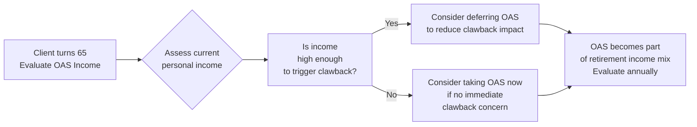
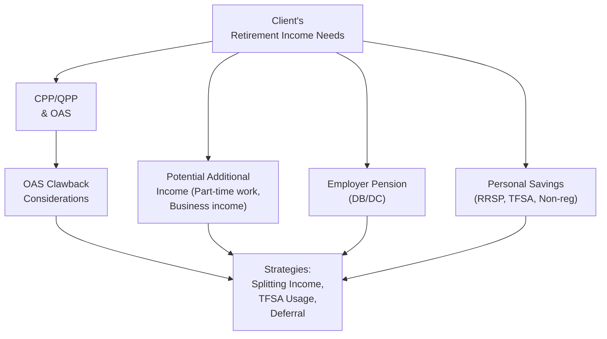

## 8.2 The Impact of OAS on Retirement Plans

Have you ever watched a friend or family member navigate retirement and wondered, “How exactly do government benefits fit into all this?” Many folks tap into Old Age Security (OAS) when they turn 65, but they’re unsure about what it really does for them. Personally, I used to think OAS was automatic and that no planning was needed—boy, I was in for a surprise! This section focuses on helping you confidently guide your clients through the nuances of OAS and how it can shape their retirement plans.

OAS is like a “basic building block” of Canada’s retirement landscape. The government typically wants to ensure that seniors have at least a certain minimum income each month. But OAS isn’t just about turning 65 and filling out a form. There are residency requirements, the possibility of deferring (delaying) benefits to get a higher payout, and an income-based “clawback” that can take a real bite out of OAS payments for higher earners. We’ll explore each of these topics, show how OAS interacts with other pillars of retirement income, and look at some strategies to help clients retain as much of their OAS as possible.

Below, we dive into the details. But don’t worry—think of this as a friendly chat, sprinkled with some real-life examples, case studies, and a couple of diagrams that (hopefully) make everything a little less stressful.

---

## Why OAS Matters in Personal Retirement Planning

OAS is Canada’s monthly pension for seniors aged 65 and older. Unlike the Canada Pension Plan (CPP), which you pay into through payroll contributions, OAS is funded through general tax revenues. It doesn’t matter whether you had a salary job, ran a small business, or spent years traveling and working odd jobs. If you have enough years of residence in Canada, you’re entitled to OAS.

Yet OAS alone won’t typically cover all your retirement needs—think of it as a base layer in a layered retirement income cake (the other layers might be CPP/QPP, employer pension, RRSP or TFSA withdrawals, RRIF withdrawals, investment income, etc.). For many clients, OAS is a welcome monthly amount that helps cover essentials, like groceries and utility bills. Understanding how it works also helps you integrate it into a broader financial plan—particularly by considering the “clawback” threshold and how deferring OAS might dovetail with other retirement accounts.

---

## Key Features of OAS

### Residency Requirements and Eligibility

Unlike CPP or QPP, eligibility for OAS is tied primarily to your years of residence in Canada. Here’s the usual checklist:
• You must be 65 or older.  
• You must be a Canadian citizen or legal resident at the time your OAS application is approved.  
• You need to have lived in Canada for at least 10 years after turning 18 to receive even a partial benefit.  
• To get the full OAS pension, you generally need 40 years of residency in Canada after age 18.

So, if you have a client named Irene who immigrated to Canada in her 20s and is now 65, you’ll want to check how many years she’s lived in Canada. If she has 40 or more years under her belt, she’s likely to qualify for the full pension. If not, she might get a partial amount, prorated based on how many years she’s been a resident.

OAS eligibility details are available through official government resources, including:  
• www.canada.ca/en/services/benefits/publicpensions/cpp/old-age-security.html

### The OAS Monthly Benefit

The actual amount of OAS changes quarterly because it’s indexed to the Consumer Price Index (CPI)—so it stays in line with inflation. Let’s say the maximum monthly OAS is (hypothetically) around $700. That’s not going to make someone wealthy by any means, but it can form a valuable part of someone’s retirement puzzle. Once you know how OAS interacts with the rest of your client’s personal finances, you can help them keep more of it.

### Deferring Your OAS

There’s an option to delay receiving OAS for up to five years (i.e., from 65 to 70). For each month (or year) of deferral, your client’s ultimate OAS payments increase by a specified percentage. Why would someone want to wait for money they’re entitled to? It can make sense if:  
• They’re still working and have a high income at 65, possibly pushing them into the OAS clawback zone.  
• They expect (or hope) to live a long time, so they want to lock in a higher monthly benefit.  
• They want to coordinate with other benefits (like CPP deferral) to optimize overall income.

Deferring OAS is a bit like waiting to open a birthday present—if you wait, the present might get bigger. But if your client doesn’t anticipate living beyond their early 80s or has pressing financial needs immediately at 65, maybe deferral isn’t the best bet. It’s all about running the numbers to see when the “break-even point” hits.

Below is a high-level flowchart illustrating how you might decide whether to defer OAS:

In practical terms, financial planning software—like RazorPlan or Snap Projections—lets you model the “take at 65 vs. defer to 70” scenarios. And it’s super handy for visualizing break-even ages and total lifetime benefits under different assumptions of longevity, investment returns, inflation, and more.

---

## OAS “Clawback” (Recovery Tax)

The OAS clawback is formally known as the OAS Recovery Tax. It’s designed to “recover” some or all of a retiree’s OAS from those whose income is considered high in retirement. This system aims to target OAS at individuals who most need more support.

### How the Clawback Works

Each year, the federal government sets an income threshold. If your net income exceeds that threshold, you’re required to repay a portion of OAS at tax time. If your income is high enough, you may have to repay the full benefit.

Specific thresholds can be found at:  
• www.canada.ca/en/revenue-agency.html

Let’s imagine Liam is 69 years old. He has the following sources of retirement income:
• OAS of $700/month  
• RRIF withdrawals of $2,000/month  
• Employment pension of $1,000/month  
• Taxable investment income of $500/month  

When you add all that up, it might be that Liam’s net income surpasses the annual OAS clawback threshold. If that’s the case, the government will calculate how much OAS Liam needs to repay, either partially or entirely, when he files his tax return.

### Minimizing the Clawback

It can seem a bit disheartening if you see OAS disappearing because of high taxable income. But there are strategies to lessen the impact:

• Pension Income Splitting: This is where you shift some eligible pension income to a spouse in a lower tax bracket, reducing your net income and possibly lowering or avoiding the clawback.  
• Timing RRSP-to-RRIF Conversions: Perhaps you delay large RRSP withdrawals until after age 71 or plan those withdrawals in lower-income years.  
• TFSA Contributions: Income from a TFSA isn’t counted as taxable, so it won’t push you into clawback territory. You could encourage your client to rely more on TFSA withdrawals if high overall income is a risk.  
• Deferring OAS: If the client is still working or has a big chunk of income at 65, deferring OAS to 66, 67, or beyond might help them dodge the clawback.

Here’s an example. Let’s say your client, Sarah, is 64, still working full-time, and is fully eligible for OAS at 65. If she starts OAS immediately at 65, her employment income plus OAS might exceed the clawback threshold. She’d be forced to pay back a good chunk. But if Sarah defers OAS until she quits or significantly reduces her work hours at, say, age 67, she might avoid the clawback on those OAS payments while also receiving a steeper monthly benefit.

---

## Household Context and Spousal Income

Often, two spouses or common-law partners plan retirement together. One spouse might have a high pension, while the other has little or no personal pension. If you can split certain pension incomes between them, you might reduce the family’s overall tax burden and potentially sidestep the OAS clawback. Although OAS itself usually can’t be “split,” the knock-on effect of splitting other pensions can reduce your net income, thus reducing or eliminating the OAS clawback.

### Example of Spousal Income Splitting

Meet Robert and Jean. Robert has a large defined benefit pension that pays $50,000 per year. Jean’s pension is much smaller, maybe $10,000. If Robert claims all $50,000 himself, his net income might be high enough to trigger the OAS clawback. But if he’s able to split that pension income partially with Jean, they might each fall below the clawback threshold. This allows them to hold onto their OAS. Meanwhile, their total household income remains the same, but the “who gets taxed” part changes, which can make a huge difference at tax time.

Keep in mind that each client’s situation is unique. Some might not have a spouse or they live in provinces with different tax rates at various brackets. Always ground your analysis in the actual numbers. Many advisors employ robust retirement planning software or spreadsheets to model scenarios quickly.

---

## How to Incorporate OAS into a Retirement Plan

### Steps for Advisors

1. **Estimate OAS Eligibility**  
   Confirm if the client meets the residency requirement for full or partial OAS. Check how many years they’ve lived in Canada since age 18.

2. **Determine Income Needs**  
   Look at Section 8.1 (Retirement Income Needs Analysis) if you need a refresher. You want to see if the client genuinely needs OAS at age 65 or if they can afford to defer.

3. **Forecast Net Income**  
   Project the client’s income from all sources: RRIF withdrawals, employment pensions, part-time work, business income, investment income, and so forth. This helps gauge whether the clawback will hit.

4. **Review Spousal Dynamics**  
   Evaluate who has the higher income and check if pension income splitting is possible. Minimizing the family’s total combined net income can preserve more OAS.

5. **Assess Deferral Pros and Cons**  
   Weigh the client’s health, lifestyle, and expected longevity. Perhaps run scenarios with financial planning software to see how deferral to 67 or 70 would change the client’s net lifetime benefits.

6. **Strategize with TFSA**  
   Encourage clients to rely on TFSAs if a large portion of their other sources (like to-be-withdrawn RRIF amounts) risk pushing them over the clawback threshold.

7. **Review Annually**  
   Income and personal circumstances can change quickly, especially in early retirement. An annual review ensures the chosen strategy (deferral length, investment approach, and withdrawal pattern) remains optimal.

Below is a simplified diagram showing how OAS fits into a typical retirement plan structure:

---

## Potential Pitfalls and Best Practices

• **Pitfall**: Ignoring the clawback threshold. High-income clients might assume they’ll get full OAS but then are shocked by how much they have to repay.  
• **Pitfall**: Not considering deferral for still-working seniors. They may ignore the advantage of deferring and lose out on potentially higher lifetime benefits.  
• **Pitfall**: Overlooking spouse or partner. Income splitting or joint planning is crucial and can save thousands in taxes.  
• **Best Practice**: Use planning tools and calculators. The Government of Canada website has basic OAS calculators. Third-party software is great for scenario analysis.  
• **Best Practice**: Discuss RRIF withdrawal timing early. Exceeding the clawback threshold can be mitigated if planned well in advance.  
• **Best Practice**: Keep up-to-date on legislative changes. CIRO (Canadian Investment Regulatory Organization) updates or new government announcements can alter thresholds or deferral rules.

---

## Practical Example and Case Study

### Mr. and Mrs. Chan

Mr. Chan (age 65) is a retired schoolteacher receiving a $40,000 annual pension. Mrs. Chan (age 64) did not work outside the home but contributed to CPP part-time during her 40s and 50s, and expects a modest CPP benefit. They both qualify for OAS at 65.

• Mr. Chan is about to start OAS, but his net income is already teetering near the clawback threshold because of his large pension plus some investment income.  
• Mrs. Chan can’t claim OAS until next year, but she can split part of Mr. Chan’s pension income when she turns 65 (because she’ll likely be in a lower bracket).  
• They consider deferring Mr. Chan’s OAS for 3 years until 68. This raises his future monthly OAS significantly but means giving up some payments now.  
• Using Snap Projections (software) for scenario planning, they see that deferring both Mr. Chan’s OAS and Mrs. Chan’s OAS for a year or two is beneficial in the long run. It reduces the chance of immediate clawback, and they’ll likely have higher combined OAS benefits after age 70.

In practice, you’d run a few “what if” scenarios. One scenario might show minimal deferral; another might show both deferring to age 70. You can compare total lifetime dollar amounts from OAS, factoring in inflation, potential clawback, and their life expectancies.

---

## Additional Resources and References

• **Official Government Information**  
  – Canada’s Old Age Security:  
    https://www.canada.ca/en/services/benefits/publicpensions/cpp/old-age-security.html  
  – CRA OAS clawback thresholds:  
    https://www.canada.ca/en/revenue-agency.html  

• **Financial Planning Tools**  
  – RazorPlan (Canadian financial planning software)  
  – Snap Projections (Holistic scenario analysis for Canadian retirees)  

• **Further Reading**  
  – “Tax-Efficient Retirement Income Planning” by the Canadian Securities Institute.  
  – “Income Splitting in Canada: Rules and Strategies” (various online guides).  
  – For regulatory updates, especially post-2023 changes and CIRO references: https://www.ciro.ca  

---

It might seem overwhelming, but OAS intricacies are just another piece of the retirement puzzle. Helping your clients maintain their OAS benefits without incurring a big clawback requires a thorough understanding of their total income, potential spousal splitting, and the art of timing. If you can become adept at weaving OAS seamlessly into your clients’ retirement plans, you’ll be providing real value—potentially saving them thousands of dollars over their retirement years. So, who said OAS was just a simple check at 65? With thoughtful planning and a bit of strategy, OAS can be optimized to help ensure a smoother, more secure retirement.

---

## Test Your Knowledge: OAS Optimization Strategies



### In determining eligibility for the full Old Age Security (OAS) pension, which of the following is the key requirement?

- [ ] Having made sufficient contributions to OAS throughout one’s working career.
- [x] Meeting the residency requirement of 40 years in Canada after age 18.
- [ ] Having a spouse who is already receiving OAS benefits.
- [ ] Earning less than the annual OAS clawback threshold.

> **Explanation:** OAS is funded by general tax revenues and does not require contributions. To qualify for the full OAS payout, individuals typically must reside in Canada for 40 years after turning 18.

---

### Which of the following best describes the OAS clawback (OAS Recovery Tax)?

- [ ] A penalty applied when you don’t apply for OAS at age 65.
- [ ] An additional fee only imposed on individuals who did not make enough OAS contributions.
- [x] A repayment of OAS benefits that applies if your income exceeds specific thresholds.
- [ ] A reduction in OAS if you choose to continue working past age 60.

> **Explanation:** OAS has an income threshold. If your net income surpasses that threshold, you may be required to repay part or all of your OAS, commonly referred to as the clawback.

---

### What is the primary reason someone might choose to defer receiving OAS beyond age 65?

- [ ] They are automatically ineligible for any benefits if they work beyond age 65.
- [x] They receive an increased monthly benefit for each month of deferral.
- [ ] They avoid having to file taxes until they eventually collect OAS.
- [ ] They receive more TFSA contribution room as a result of deferral.

> **Explanation:** Deferring OAS increases the monthly payout. This strategy can be beneficial for those expecting a longer lifespan or wanting to reduce potential clawback while they still have high employment income.

---

### Which of the following income sources would NOT typically affect OAS clawback?

- [ ] RRIF withdrawals.
- [ ] Employment pension.
- [x] TFSA withdrawals.
- [ ] Taxable investment income.

> **Explanation:** Income from a TFSA is not taxed and does not count towards net income for the purposes of calculating the OAS clawback, whereas other sources (employment pension, RRIF, taxable investment income) do count.

---

### Why might spousal income splitting be beneficial concerning the OAS clawback?

- [x] It can potentially lower each spouse’s net income, helping to reduce or avoid the clawback.
- [ ] It increases the eligible OAS payment for the higher-income spouse.
- [x] It may balance out incomes so both spouses stay below the clawback threshold.
- [ ] It is required by law for couples over age 65.

> **Explanation:** By shifting eligible pension income from one spouse to another, you can keep each individual’s net income in a lower tax bracket and below the OAS clawback threshold.

---

### If a client continues to work full-time at age 65 and is likely to trigger a clawback, one recommended strategy is:

- [x] Deferring OAS until their income is lower.
- [ ] Converting all RRSPs to RRIFs immediately at 65.
- [ ] Transferring OAS directly to a spouse’s account.
- [ ] Implicitly ignoring the clawback because it’s unavoidable.

> **Explanation:** Deferring OAS until the client reduces their working hours or stops working can help them avoid clawback during those high-income years.

---

### Which of the following statements is TRUE about partial OAS?

- [x] It may be granted if someone has fewer than 40 years of Canadian residency after age 18.
- [ ] It is a special grant for individuals who apply for OAS after age 70.
- [x] It is calculated proportionally based on how many years you have lived in Canada if under the full requirement.
- [ ] It’s only available to Canadian citizens who never left the country.

> **Explanation:** It’s possible to receive a partial OAS if you don’t have enough residency years for a full benefit. The benefit amount is proportional to the number of residency years.

---

### One key benefit of using financial planning software like RazorPlan or Snap Projections is:

- [ ] They remove the need to file taxes.
- [ ] They bypass the OAS clawback automatically.
- [x] They allow you to model scenarios, such as deferring OAS or splitting pension income, to see projected long-term outcomes.
- [ ] They provide access to a special government grant program.

> **Explanation:** By using such tools, advisors can efficiently create multiple scenarios to decide on the best timing for OAS or the optimal split of pension income. This ensures data-driven retirement strategies.

---

### Which of the following is the best description of the “break-even point” in the context of OAS deferral?

- [ ] The income level at which the OAS clawback starts to apply.
- [x] The age or date at which cumulative deferred OAS payments surpass the amount you would have received if taken earlier.
- [ ] The point at which you can split OAS with a spouse.
- [ ] The moment your annual OAS equals your CPP payment.

> **Explanation:** When deferring OAS, the break-even point is when the additional amounts you receive from deferring surpass the total OAS you would have collected had you started earlier.

---

### The OAS program is funded by:

- [x] General tax revenues of the Canadian government.
- [ ] Contributions made by Canadians through payroll deductions, similar to CPP.
- [ ] Sales taxes on goods and services only.
- [ ] Non-repayable loans from provincial governments.

> **Explanation:** OAS is financed from general tax revenues, differentiating it from CPP/QPP, which are funded through employee and employer contributions.


