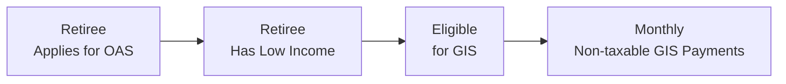

## 8.3 The Impact of GIS on Retirement Plans

Sometimes when we think about retirement planning, we focus mostly on Canada Pension Plan (CPP/QPP) or Old Age Security (OAS) benefits. But if you or your clients have relatively low income, the Guaranteed Income Supplement (GIS) can be a bit of a game changer. And let’s admit it: the GIS guidelines can feel like they’re written in another language. It certainly did to me—years ago, I remember flipping through these forms with my uncle, realizing that half of what we were trying to figure out was buried in footnotes and tiny disclaimers. Once we got a handle on it, though, it totally transformed his cash flow and gave him a lot more peace of mind in retirement.

Below, we’ll explore what GIS is all about, why it matters for retirement planning, and how to approach it in a way that ensures you’re not accidentally giving up valuable benefits. We’ll also sprinkle in some practical strategies, real-life illustrations, references to current Canadian regulations, and a couple of cautionary tales so we can (hopefully!) learn from others’ mistakes.

### Overview of the GIS Benefit

The Guaranteed Income Supplement (GIS) is a non-taxable monthly benefit paid to certain Old Age Security (OAS) recipients who have little or no other income. If you recall from earlier in this chapter, OAS by itself aims to provide a basic pension to Canadians over 65. However, OAS alone may not be enough for people with limited means—so that’s where GIS steps in to top up monthly income.

GIS has the following main characteristics:
• Non-taxable benefit.  
• Income-tested (or means-tested): the higher your overall income, the lower your GIS benefit.  
• Updated regularly for inflation.  
• Requires annual renewal: Generally, recipients must file their income tax return each year to maintain GIS eligibility.  

Service Canada (https://www.canada.ca/en/services/benefits/publicpensions/cpp/old-age-security/guaranteed-income-supplement.html) has the latest thresholds. Remember that the specific income cutoffs can vary depending on whether you’re single, widowed, married, or in a common-law relationship. 

### GIS Eligibility and Marital Status

Eligibility for GIS depends heavily on your marital status and the combined household income for married or common-law partners. In a nutshell, if you’re single, the government looks solely at your own income, while if you’re married or in a common-law relationship, they consider what both of you earn together. This is what folks mean by “household income.”

It’s worth noting that if you and your spouse have separated or if one of you is hospitalized or living in a long-term care facility, the formula may adjust accordingly. In these edge cases, the rules can get complicated. That’s why thorough record-keeping and timely notification to Service Canada are crucial.

### Why GIS Matters for Retirement Plans

You might be thinking, “Okay, so GIS is basically a bonus for low-income retirees. Great. But how does that fit into an overall financial plan?” The short answer: it can significantly impact when and how you draw income from various sources. GIS is means-tested, which means your ability to collect the supplement is affected by nearly all other types of income, whether it’s from CPP, QPP, pensions, RRSP withdrawals, or part-time work.

An important reminder is that because GIS is non-taxable, holding onto it can be extremely beneficial—especially for those who are on the cusp of that income cutoff. If you’re just a few dollars above the threshold, you might lose out on thousands of dollars of GIS benefits. Careful planning can help reduce “countable” income while still supporting a comfortable lifestyle.

### How Income Is Measured for GIS Purposes

When we say “income,” we’re talking about nearly all forms of income that show up on your tax return (and sometimes even those that don’t). For example:
• CPP/QPP payments.  
• RRSP or RRIF withdrawals.  
• Rental income.  
• Investment income (interest, dividends, and capital gains).  
• Part-time employment income.  
• Other government benefits like the Canada Pension Plan Disability Benefit, if applicable.

While GIS itself is not taxable and doesn’t show on your return as taxable income, it is absolutely reduced by increases in your total net income from other sources. That is the main issue: every extra dollar you bring in from somewhere else can lead to a corresponding decline in your GIS benefit.

### Practical Strategies to Preserve GIS

When we talk about preserving GIS, it’s all about controlling when and how you receive your income. Here are a few strategies (and no, they’re not guaranteed silver bullets, but they can be major difference-makers):

• Use TFSAs Wisely: Income or gains you earn within a Tax-Free Savings Account (TFSA) do not affect your GIS. A TFSA can therefore be a fantastic vehicle for low-income seniors who want to save or invest without jeopardizing their supplement.  
• RRSP Timing: Large RRSP withdrawals will raise your income in that tax year, potentially bumping you above the GIS threshold. One approach is deferring significant RRSP withdrawals until later years—or staggering them over several years—to avoid a sharp spike in any single year’s income.  
• Delaying OAS or CPP/QPP: If you can afford to do so, deferring your OAS or CPP/QPP could lower your current income enough to qualify for a higher GIS. Later, once you begin receiving those pensions, you might lose some or all of your GIS, but at least you’ve taken advantage of the higher monthly pension from your OAS or CPP/QPP deferral. It’s a balancing act: sometimes you gain more in the early years by maximizing GIS, but you also want enough retirement income overall.  
• Check for Part-Time Work Impact: Part-time or seasonal work can be a lifeline for many seniors who want extra cash or just enjoy staying active. But there’s a moment where that extra income results in the partial or total loss of GIS benefits. Coordinating your schedule and tracking your annual taxable income helps ensure that your total net income stays below the threshold—if that’s your priority.  

Before implementing these strategies, you want to consider your overall financial picture. For instance, deferring an OAS payment might help you collect GIS early on, but you might also be missing out on some guaranteed income. Or maybe your partner’s situation is different, and being strategic about your combined income means you can push both of you below the threshold.

### Personal Anecdote: Managing the “GIS Gap”

Let me share a small story: I once worked with a family friend named Teresa who was around 65 and living mostly off her small company pension, modest savings, and partial OAS. We realized her total annual income hovered just above the GIS cutoff. By moving some of her RRSP savings into a TFSA (when her marginal tax rate was low), Teresa reduced her taxable income. The following year, she qualified for GIS and ended up with a net increase of thousands of dollars in her pocket. She commented that the difference was enough to cover her property taxes and a few extra groceries. Doing the math on these seemingly tiny differences in income can have a huge impact on day-to-day life.

### Deferral Options and Lifetime Income Strategy

Financial advisors often grapple with the decision of whether to encourage clients to defer OAS or CPP/QPP. As we outlined before, deferring OAS or CPP/QPP can raise your monthly pension and potentially allow you to collect GIS in the interim. But be careful: if you postpone those benefits for too long, you might rely on your personal savings more than you’d like, or you might face the risk of poor health limiting your ability to enjoy those extra benefits later in life.

Balancing your lifetime income strategy means you should evaluate your health, family longevity history, personal budget, and other assets. The point is to weigh potential GIS benefits now against guaranteed higher OAS or CPP/QPP benefits in the future. Many retirees might elect a partial deferral—like waiting a year or two—just so they can stay under the threshold for an extra 12 to 24 months.

### How CIRO, CIPF, and Historical SROs Fit In

You might be wondering how Canada’s current regulatory body or investor protection funds factor into the conversation. Well, historically, there were two self-regulatory organizations (SROs) in Canada for investment dealers and mutual fund dealers: the Investment Industry Regulatory Organization of Canada (IIROC) and the Mutual Fund Dealers Association of Canada (MFDA). However, as of January 1, 2023, these two defunct predecessor SROs have been amalgamated into the Canadian Investment Regulatory Organization (CIRO). CIRO is now Canada’s official national self-regulatory body, overseeing registered investment dealers and mutual fund dealers, and ensuring that markets remain fair and transparent.

For investor protection, the Canadian Investor Protection Fund (CIPF) became the country’s sole investor protection fund on January 1, 2023, after merging with the MFDA IPC. CIPF operates independently from CIRO and helps protect clients’ assets if a CIRO member firm becomes insolvent. While this change in regulatory structure and investor protection mainly affects investment accounts, it’s good to remember that if you hold your retirement savings through a CIRO-regulated dealer, CIPF coverage might apply if the firm goes bankrupt. That said, CIPF doesn’t come into play with GIS itself—it’s simply part of the broader landscape that ensures your investments are safeguarded.

### Reporting and Renewal Requirements

GIS isn’t something you sign up for once and never think about again. Because it’s an income-tested, means-tested benefit, you have to renew it each year when you file your income tax return or provide updated financial information. If you fail to submit your return in time or don’t provide all the necessary details, you risk losing your GIS payments. Service Canada generally sends reminder letters, but it’s best to be proactive and ensure your or your client’s file remains current.

### Common Pitfalls and How to Avoid Them

One of the biggest pitfalls is not understanding how drastically a small increase in income can reduce your GIS. Retirees sometimes take out a one-time large withdrawal from their RRSP to fund a home repair or a family trip, only to discover it drastically reduced their GIS the following year. Another pitfall is failing to track changes in marital status. If you get married (or divorced) in retirement, you need to promptly inform Service Canada, or else you might get overpaid or underpaid GIS, resulting in future backlog issues.

Also be mindful of inadvertently locking up too much money in the “wrong” type of account. If you or your clients rely heavily on non-registered investing while ignoring the benefits of TFSAs, you could push your income beyond the threshold. It’s all about strategic allocation.

### Visual Overview of GIS Eligibility Flow

Below is a simplified Mermaid flowchart illustrating the progression from OAS to checking low income, to GIS eligibility, to receiving those monthly payments.

• Retiree Applies for OAS: You or your client are 65 or older and file the necessary forms.  
• Retiree Has Low Income: You meet specific thresholds.  
• Eligible for GIS: Your net income is below the annually determined limit.  
• Monthly Non-taxable GIS Payments: The government pays you a monthly top-up to OAS.

### Using Community Resources and Tools

Sometimes, folks want to do a quick check to see if their income might qualify for GIS. Community organizations, legal aid clinics, and even certain open-source benefits calculators can help approximate your annual income and check your likely eligibility. It’s always smart to use the official Service Canada resources for a final word, but if these informal calculators help you plan how much RRSP to withdraw or how many hours to work, that’s worth the extra few minutes online.

Recommended references for deeper exploration:
• Government of Canada – GIS details: https://www.canada.ca/en/services/benefits/publicpensions/cpp/old-age-security/guaranteed-income-supplement.html  
• “Retirement Income for Low-Income Seniors,” a booklet found through many community legal aid organizations (contact local groups to see if they have an updated version).  
• CIRO website (for current regulatory information, especially about your investment firm): https://www.ciro.ca  

### Incorporating GIS into Your Broader Financial Plan

GIS can’t be viewed in isolation. Managing your tax situation, your monthly cash flow, and your estate plan might all have a ripple effect on your GIS entitlement. As we covered earlier in our discussions about net worth (Chapter 2) or tax planning strategies (Chapter 6), each piece of your financial puzzle interacts with the others. The timing of your RRSP withdrawals, your spouse’s retirement date, your OAS deferral, and how you structure your investments can either help you preserve GIS or inadvertently disqualify you.

Yes, it can be tricky—but that’s what financial planning is all about. And in any case, it’s never a bad idea to consult with a qualified professional before making big decisions. You want to ensure you’re not giving up thousands of dollars in guaranteed income simply because of a poorly timed retirement withdrawal.

### Balancing GIS Against Other Needs

Of course, life doesn’t always revolve around collecting government benefits. You may have short-term financial goals, like enjoying a well-deserved vacation, helping grandkids with education expenses, or renovating your home to age in place more comfortably. If meeting those goals means taking a chunk of cash out of your RRSP, that might be the right move—just remember it could cost you some or all of your GIS for a year or more. The question is balancing those priorities and fully understanding the trade-offs.

### Key Takeaways

GIS is one of the most crucial elements of the Canadian social safety net for retirees. Because it’s non-taxable and means-tested, every dollar counts when it comes to preserving eligibility. With a bit of careful planning—particularly around TFSAs, OAS or CPP/QPP deferral, RRSP withdrawals, and part-time work income—you can optimize retirement cash flow without unnecessarily losing out on GIS. 

Above all, remember that every situation is unique. Personal health, family dynamics, and even the prospect of returning to the workforce may enter into your decision-making. Don’t hesitate to seek expert guidance or free resources. And yes, always keep an eye on official updates from the Government of Canada, as thresholds can change year to year.

-----

## Test Your Knowledge on GIS and Retirement Plans



### Which statement best describes the Guaranteed Income Supplement (GIS)?

- [ ] A taxable benefit added to Canada Pension Plan (CPP) payments.  
- [ ] A mandatory contribution program for high-income earners.  
- [x] A non-taxable monthly benefit for low-income OAS pensioners.  
- [ ] A refundable tax credit benefit for everyone over 65.  

> **Explanation:** GIS is a distinct, non-taxable benefit offered to Old Age Security (OAS) recipients who have low income, not part of CPP or a tax credit program.

### Which of the following incomes has the most direct impact on reducing GIS benefits?

- [x] RRSP withdrawals in a given tax year.  
- [ ] Income from a Tax-Free Savings Account (TFSA).  
- [ ] Non-taxable inheritances.  
- [ ] Gifts from family members.  

> **Explanation:** RRSP withdrawals primarily increase reported taxable income, which can reduce or eliminate GIS benefits. TFSA withdrawals do not affect GIS since they are not considered taxable income.

### How does marital status generally affect GIS?

- [ ] Only one spouse can ever be eligible for GIS.  
- [x] Household income of both spouses is considered to determine eligibility.  
- [ ] Spouses must pool their RRSPs before applying for GIS.  
- [ ] Marriage automatically disqualifies both partners from GIS.  

> **Explanation:** GIS is means-tested based on combined household income for married or common-law partners, so both spouses’ incomes are relevant.

### What is a reasonable strategy for reducing taxable income to preserve GIS?

- [ ] Converting all your assets into cash and storing it at home.  
- [ ] Not reporting your income on tax returns.  
- [ ] Stop contributing to any registered plan.  
- [x] Shifting savings to a TFSA to avoid raising taxable income.  

> **Explanation:** Income earned in a TFSA is not counted as taxable income, which can help keep total net income below GIS thresholds.

### How do part-time earnings affect GIS?

- [ ] Part-time earnings are always exempt from GIS calculations.  
- [ ] Only half of part-time earnings count against GIS.  
- [x] They may increase your taxable income and reduce your GIS benefit.  
- [ ] You can earn any amount part-time without impacting GIS.  

> **Explanation:** Part-time earnings often increase taxable income. Since GIS is means-tested, higher income can reduce or eliminate your GIS entitlements.

### What is one potential upside of deferring Old Age Security (OAS)?

- [ ] OAS benefits terminate if you delay them past age 65.  
- [ ] It ensures GIS is never clawed back in the future.  
- [x] You may receive a higher OAS pension amount and potentially qualify for GIS in the interim.  
- [ ] Deferral doubles the GIS amount.  

> **Explanation:** Delaying OAS increases the monthly OAS benefit. During the deferral period, lower OAS income can also boost or maintain GIS eligibility if other income stays below the threshold.

### Which organization currently regulates Canada’s investment dealers and mutual fund dealers?

- [ ] The defunct Investment Industry Regulatory Organization of Canada (IIROC).  
- [x] The Canadian Investment Regulatory Organization (CIRO).  
- [ ] The former Mutual Fund Dealers Association (MFDA).  
- [ ] The Canada Investor Protection Fund (CIPF).  

> **Explanation:** IIROC and MFDA (the two predecessor SROs) were amalgamated into CIRO on January 1, 2023. CIPF is the sole investor protection fund now, but not an SRO.

### What is the main purpose of renewing GIS eligibility annually?

- [x] Ensure GIS entitlement aligns with the claimant’s latest financial information.  
- [ ] Allow the claimant to withdraw more from RRSP.  
- [ ] Guarantee application approval for five years.  
- [ ] Prevent seniors from working after 65.  

> **Explanation:** Because GIS is income-tested, annual renewal helps the government verify that the recipient’s income still qualifies under the guidelines.

### Why might a large, one-time RRSP withdrawal be detrimental to GIS benefits?

- [ ] It permanently disqualifies you from future OAS benefits.  
- [x] It increases annual taxable income, potentially reducing GIS eligibility.  
- [ ] It eliminates the need to renew your GIS application.  
- [ ] It transforms the RRSP into an ineligible account type.  

> **Explanation:** A large RRSP withdrawal spikes your taxable income in that year, which may push you over the GIS threshold and reduce or eliminate the supplement.

### True or False: TFSAs are considered taxable income for GIS calculations.

- [ ] True  
- [x] False  

> **Explanation:** Income earned and withdrawn from a TFSA does not appear as taxable income and therefore does not reduce GIS eligibility.


