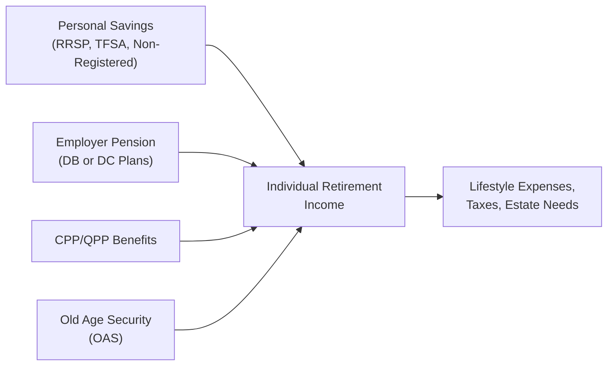

## 8.4 The Impact of CPP/QPP on Retirement Plans

Sometimes, when I think about retirement benefits in Canada, I can’t help but remember how relieved I felt the first time I checked my estimated Canada Pension Plan (CPP) retirement payout. It was like that feeling when you realize your rainy-day fund might actually cover more than just a leaky roof. But let’s dive deeper: the Canada Pension Plan (CPP) and the Quebec Pension Plan (QPP) are cornerstones of retirement planning for millions of Canadians. Understanding how they fit into your client’s overall financial picture is super important, especially when you’re juggling multiple sources of income like personal savings, employer pension plans, and Old Age Security (OAS).

Below, we’ll explore the fundamentals of CPP/QPP, how and when to start receiving benefits, plus how these pensions can be integrated into a broader financial plan. We’ll also highlight how disability and survivor benefits come into play, along with references and tools (like My Service Canada Account) that can help you or your clients get an accurate forecast of their entitlements.

### Why CPP/QPP Matters
The CPP/QPP provides contributory, earnings-related pensions aimed at replacing part of a worker’s income if they retire, become disabled, or pass away. Employees and employers both chip in—though self-employed individuals pay the combined employee/employer amount themselves. For folks living in Quebec, the QPP stands in parallel to the CPP, offering very similar structures and benefit formulas (with some administrative differences).

Unlike employer pensions or personal savings such as Registered Retirement Savings Plans (RRSPs), the CPP/QPP is mandatory for most workers, meaning almost everyone who earns a salary in Canada will participate. Because the program is so widespread and the contributions show up on every pay stub, it’s easy to take for granted. But trust me, there’s a lot more to the plan than meets the eye.

### The Foundation of Contributions
Both the CPP and QPP require contributions from the employee (or self-employed person) as well as a matching contribution from their employer. Each year, the federal government announces the contribution rate along with the Year’s Maximum Pensionable Earnings (YMPE), which determines the maximum amount of earnings on which participants must pay.

• If you’re employed, you’ll see CPP/QPP deductions on your paycheque, and your employer will remit an equal amount.  
• If you’re self-employed, you’ll cough up both halves, which can feel hefty, but remember—you’re contributing to a plan that will pay you a monthly pension for the rest of your life upon retirement (and provide disability or survivor benefits in some cases).

Contribution rates do change from year to year, so you’ll want to confirm the current numbers with official sources like [Canada.ca](https://www.canada.ca/en/services/benefits/publicpensions/cpp.html) for CPP or [Retraite Québec](https://www.retraitequebec.gouv.qc.ca) for QPP. Also, remember that contribution changes are sometimes phased in gradually to ensure that workers and businesses can adjust.

### Basic Benefit Calculation
CPP/QPP benefits are earnings-related. In other words, the more you contribute, and the longer your contribution period, the higher your benefit. The actual formula can be a bit complex, factoring in something called the “dropout provision” that excludes low-earning years (such as when you took time off to care for children). For a detailed breakdown of how your personal numbers are calculated, My Service Canada Account (CPP) or Retraite Québec’s online tools (QPP) can provide a personalized estimate. Checking these early and frequently is a real eye-opener—it’s like peeking behind the curtain at what your future monthly income might look like.

### When to Take CPP/QPP
One of the most common questions I hear goes something like: “Should I start my CPP/QPP right at 60, or should I wait until I’m 70?” Well, it depends. Taking it early will result in a permanent reduction in the monthly amount, while delaying benefits until after 65 provides a permanent increase. Specifically:

• Earliest start age is 60 (with a monthly reduction).  
• Standard start age is 65 (no reduction or enhancement).  
• Latest deferral is up to 70 (with an enhancement to your monthly benefit).

In choosing when to start, consider factors like current and expected future income, health status, family longevity history, and personal cash-flow needs. If you strongly suspect that you’ll live well into your 90s, deferring can really boost total lifetime benefits. On the other hand, if you need the money earlier for living expenses or have personal health concerns, taking benefits sooner might be a better fit.

### Diagram: Timing Options for CPP/QPP

Below is a Mermaid.js diagram illustrating the different age-based timing options for CPP/QPP retirement benefits and their respective adjustments:

```mermaid
flowchart LR
    A["Start CPP/QPP<br/> at Age 60"] -->|Permanent Reduction<br/> (~0.6% per month Before 65)| B["Lower Monthly<br/> Benefit"]
    A2["Start CPP/QPP<br/> at Age 65"] -->|No Reduction or<br/> Enhancement| B2["Base Monthly<br/> Benefit"]
    A3["Start CPP/QPP<br/> at Age 70"] -->|Permanent Increase<br/> (~0.7% per month After 65)| B3["Higher Monthly<br/> Benefit"]
```

As shown, each arrow between the start age option (60, 65, or 70) leads to a distinct monthly outcome—lower pension if you start early, “base” pension at 65, or higher pension if you delay up to 70.

### Integrating CPP/QPP with Employer Pensions and OAS
Most Canadians will have a mix of retirement income sources. In fact, it’s quite common to see individuals combining:

• Government-sponsored benefits (CPP/QPP + Old Age Security)  
• Employer pension plans (Defined Benefit or Defined Contribution)  
• Personal pensions like RRSPs, Tax-Free Savings Accounts (TFSAs), or other investments  

Coordinating these streams effectively is key to minimizing taxes and ensuring you’ve got enough cash flow in your early retirement years, while still leaving something for later. Some folks choose to stagger the start date of each benefit to avoid pushing themselves into higher tax brackets. For instance, if you’ve already started collecting an employer pension in your early 60s and you only need a little bit more income, you might want to delay CPP/QPP to 70 and get a higher monthly payout later, once your other income sources begin to diminish or your personal funds start to run low.

### Disability and Survivor Benefits
Though we often fixate on retirement pensions, both CPP and QPP provide disability and survivor benefits. These can be crucial safety nets for individuals who become disabled before retirement age or for families who suffer the loss of a spouse or parent. Let’s briefly outline them:

• CPP/QPP Disability: Offers monthly benefits to contributors with a series of eligibility requirements. The main requirement is that the person must have made sufficient contributions and has a severe and prolonged disability.  
• Survivor Benefits: If a contributor passes away, the surviving spouse/common-law partner or dependent children may receive partial income support. This typically includes a one-time death benefit and an ongoing monthly payment.

#### Key Considerations for Disability and Survivor Benefits
1. Eligibility depends on both the severity of disability (for disability benefits) and a valid contribution history.  
2. Survivor benefits and death benefits are calibrated based on how long and how much the deceased contributed.  
3. Individuals might need to coordinate these benefits with private insurance plans or group employee benefit packages.

### Strategic Planning for Clients
From a financial advisor standpoint, you’ll want to create an integrated game plan. Here’s how you might approach discussing CPP/QPP with a client:

• Current Income and Expenses: Evaluate whether the client needs the income ASAP at 60 or if they can hold off for a bigger payoff by delaying.  
• Life Expectancy and Health: Conduct a gentle conversation around family medical history, lifestyle, and overall health, acknowledging it’s a bit of a guess.  
• Tax Bracket Management: Explore how adding CPP/QPP income at different times affects the client’s marginal tax rate.  
• Coordination with Employer and Personal Plans: Align the start of CPP/QPP benefits with the drawdown of RRSPs, TFSAs, or other investments for optimized results.  
• Spousal/Partner Considerations: Decide whether each spouse will start benefits at different times to balance household cash flow and taxes.  
• OAS Clawback Risk: For higher-income clients, check whether adding CPP/QPP too soon might push them into an Old Age Security (OAS) clawback.

### Example: Early Start vs. Late Start
Imagine a client, Elizabeth, who is 60 years old, healthy, and has a family history of longevity (think grandparents who lived into their late 90s). Elizabeth has only a small workplace pension plus some TFSA savings, so she’s a bit worried about running out of money if she’s around for a very long time.

• If Elizabeth takes CPP at 60, she’ll receive a permanent reduction (for example, around 36% lower than the full age 65 pension). She’ll get immediate cash flow, but the smaller monthly amount keeps applying for her entire life.  
• If Elizabeth delays until 70, her payment might grow by over 40% relative to the standard 65 benefit. Of course, she’ll wait 10 years to see that money, but once she starts collecting, the monthly amount could be significantly higher. Over a long horizon (e.g., living into her 90s), deferral has strong potential benefits.

In her case, deferring might be optimal, particularly given her health outlook and family history. Yet for someone else with severe health issues or who needs immediate income, taking it at 60 could make perfect sense. It’s all about personal circumstances.

### Diagram: Overview of Retirement Income Sources



In this diagram, multiple pillars (personal savings, employer pensions, CPP/QPP, OAS) all feed into a retiree’s total income. From there, it’s allocated toward lifestyle expenses, taxes, and estate objectives.

### Using My Service Canada Account
When planning for CPP, it’s helpful to get a real number to anchor your decisions. My Service Canada Account (accessible at [https://www.canada.ca/en/employment-social-development/services/my-account.html](https://www.canada.ca/en/employment-social-development/services/my-account.html)) can provide estimates of your future benefit amount. If you’ve lived or worked in Quebec, you would also check [Retraite Québec](https://www.retraitequebec.gouv.qc.ca) for an estimate of QPP benefits.

• These estimates are projections, so keep in mind that your future earnings, inflation, and any changes to the plan’s structure may alter the final figure.  
• Using these tools early in your career can actually motivate you to increase your personal savings, especially if you see that your expected CPP/QPP check might not be as large as you hoped.

### Best Practices
• Revisit your client’s preferred CPP/QPP start date every few years. Life events—like a job change, health surprises, or market downturns—can impact the overall plan.  
• Keep an eye on contribution rates and maximum pensionable earnings. Changes can affect both the cost of contributing (especially for self-employed individuals) and the ultimate benefit.  
• Educate clients about the interplay between CPP/QPP, OAS, and other potential support programs.  
• Encourage clients to consider survivor and disability benefits as part of their broader risk management strategy.  

### Common Pitfalls
• Taking benefits too early without analyzing the financial trade-off.  
• Forgetting to factor in potential survivor benefits that could fulfill some family protection needs.  
• Overlooking the possibility of deferral even for a short period, which can still result in a meaningful monthly increase.  
• Ignoring how CPP/QPP income could nudge a client into a higher marginal tax bracket, especially if they’ve got significant RRSP withdrawals or an early workplace pension.  

### Real-World Scenario: Early Retirement with a Twist
Let’s say Roger retires from his job at 62 due to a downsizing. He’s got a moderate severance package and a small personal RRSP. He’s unsure about when to start CPP. He logs in to My Service Canada Account to check his estimates:

• At 62, the monthly payout is about $1,000.  
• At 65, the payout would be about $1,300.  
• At 70, it jumps to around $1,800.

Initially, Roger plans to take the early CPP because he figures, “Hey, I might as well get something right now.” But after looking at his severance, along with an honest conversation about his health, he decides to use part of the severance to cover living expenses for a couple of years. Then he’ll take CPP at 65 or maybe wait until 66 or 67, depending on how his expenses shape up. The final decision ends up giving him a better monthly payout for the rest of his retirement.

### References and Additional Resources
• [Canada Pension Plan (CPP)](https://www.canada.ca/en/services/benefits/publicpensions/cpp.html)  
• [Quebec Pension Plan (QPP)](https://www.retraitequebec.gouv.qc.ca)  
• [CPP & QPP Calculators](https://www.canada.ca/en/employment-social-development/services/my-account.html)  
• [CIRO Resources](https://www.ciro.ca) (Canada’s national self-regulatory organization, overseeing investment dealers and mutual fund dealers)  

Stay updated with all regulations and contribution changes by checking official bulletins from government sites and CIRO. Remember that the Mutual Fund Dealers Association of Canada (MFDA) and the Investment Industry Regulatory Organization of Canada (IIROC) were replaced by CIRO on January 1, 2023, so any reference to those bodies is strictly historical.

By combining the knowledge of CPP/QPP with other key retirement income sources, you’re well on your way to constructing robust retirement strategies that deliver security and peace of mind.

---

## Test Your Knowledge: CPP/QPP Retirement Strategies



### Which of the following statements best describes the Canada Pension Plan (CPP) and the Quebec Pension Plan (QPP)?

- [x] They are contributory, earnings-related pensions that replace part of a worker’s income in retirement.
- [ ] They are tax-free investment vehicles for self-employed individuals only.
- [ ] They are non-contributory pensions funded entirely by the government.
- [ ] They apply only to individuals who earn below a certain income threshold.

> **Explanation:** Both CPP and QPP are contributory, earnings-related plans shared between employees and employers (or paid in full by the self-employed). They provide partial income replacement for retirement and certain other life events.

### Under the CPP/QPP, what happens if you decide to start receiving benefits at age 60?

- [x] You receive a reduced monthly pension amount for the rest of your life.
- [ ] You receive a significant tax credit on your future contributions.
- [x] You no longer qualify for Old Age Security (OAS) benefits.
- [ ] You will automatically receive survivor benefits.

> **Explanation:** Starting benefits at age 60 results in a permanent reduction in the monthly pension. This is done to account for the earlier start date and the fact that you’ll receive payments for a longer period.

### Which of the following factors should an individual consider when deciding the ideal age to start CPP/QPP?

- [x] Their current cash-flow needs, health status, and family longevity.
- [ ] Their exact tax bracket at the time of starting benefits is irrelevant.
- [ ] Only the size of their RRSP balances.
- [ ] Whether or not they have a Group RRSP.

> **Explanation:** Clients should look at their financial situation (cash flow), plus life expectancy factors like family health history. Tax considerations also come into play, though the exact bracket isn’t the only factor.

### How do CPP/QPP disability benefits differ from the regular retirement pension?

- [x] Disability benefits are paid to eligible individuals who can’t work due to a severe, prolonged disability before retirement age.
- [ ] Disability benefits are paid only after age 65.
- [ ] Disability benefits are offered only to self-employed individuals.
- [ ] Disability benefits are paid out at a higher rate if one retires early.

> **Explanation:** If a contributor becomes disabled and meets the eligibility requirements, they receive a monthly benefit. It’s designed to replace income for those who can’t work due to significant health issues before normal retirement.

### If a couple wants to optimize retirement income, which of the following strategies could they consider?

- [x] Delaying one spouse’s CPP/QPP to age 70 while the other starts at 65.
- [ ] Transferring all RRSP funds to CPP for faster growth.
- [x] Having both spouses claim CPP/QPP at 60 regardless of need.
- [ ] Taking no CPP/QPP benefits until age 75.

> **Explanation:** One spouse might delay to age 70 if they expect to live long and want a higher lifelong benefit. The other might claim earlier for cash flow. RRSPs are not “transferred” to CPP.

### Which official resource provides personalized CPP projections for Canadian workers?

- [x] My Service Canada Account.
- [ ] Canadian Pension Index Portal.
- [ ] CIRO’s official website on retirement.
- [ ] Heritage Canada’s cultural grants page.

> **Explanation:** My Service Canada Account offers personalized estimates of your CPP benefits. QPP participants can use tools on the Retraite Québec site.

### Which statement about survivor benefits is accurate?

- [x] They provide partial income to a spouse or dependents if a CPP/QPP contributor passes away.
- [ ] They are available only after the survivor reaches age 70.
- [x] They replace 100% of the deceased’s pension indefinitely.
- [ ] They are fully integrated with private life insurance plans.

> **Explanation:** Survivor benefits offer partial income for eligible spouses or dependents. They do not replace the entire pension, and the rules vary by beneficiary classification.

### Which of the following is a potential pitfall when deciding to draw CPP/QPP early?

- [x] Permanently reducing your monthly benefit without carefully evaluating your lifetime financial needs.
- [ ] locked-in RRSP rules that unexpectedly limit your withdrawals.
- [ ] Automatically having to pay higher employment insurance premiums.
- [ ] Losing access to the Tax-Free Savings Account.

> **Explanation:** Drawing CPP/QPP early leads to a permanent monthly reduction, so evaluating one’s future retirement expenses and longevity prospects is critical.

### How can CPP/QPP be effectively integrated with other types of retirement savings?

- [x] By managing the timing of withdrawals and coordinating with RRSPs, TFSAs, and employer pensions.
- [ ] By contributing employer pension funds directly into CPP/QPP.
- [ ] By requiring that OAS be converted into CPP/QPP at age 65.
- [ ] By claiming both CPP/QPP and OAS benefits immediately after graduation from college.

> **Explanation:** Integrating CPP/QPP with other retirement pillars often involves strategic timing so as to optimize tax and cash flow when combined with other savings or employer pensions.

### True or False: Individuals who are self-employed pay both the employer and employee shares of CPP/QPP contributions.

- [x] True
- [ ] False

> **Explanation:** Self-employed individuals are responsible for the full contribution, whereas employees share the cost with their employers.


