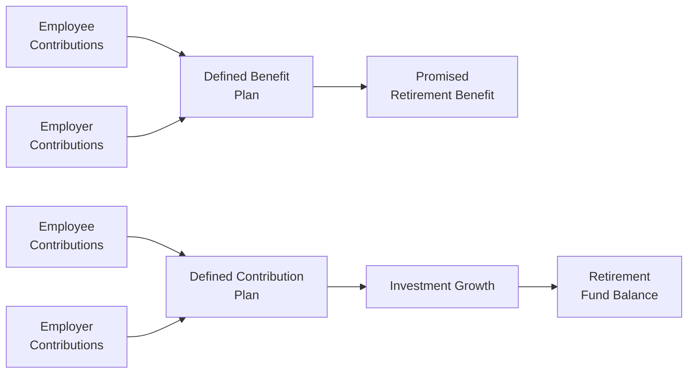
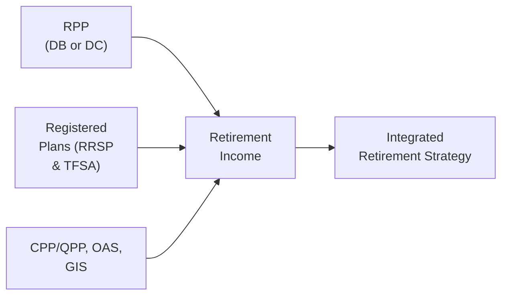

## 8.5 The Impact of Registered Pension Plans on Your Retirement Plans

Picture this. You’ve been working hard for years and saving up for retirement, happily contributing to a pension plan your employer sponsors. Then comes that day when you start planning your retirement income in detail, and you realize you’re not entirely sure what your Registered Pension Plan (RPP) means for your future cash flow. Sound familiar? Well, you’re not alone. Many Canadians have an RPP but aren’t fully aware of how it works, especially in conjunction with other assets like personal RRSPs or TFSAs and with government programs like Old Age Security (OAS) and the Canada Pension Plan (CPP).

In Canada, RPPs are registered with the Canada Revenue Agency (CRA) and are subject to pension legislation. Depending on the jurisdiction, you may also find provincial regulations that shape exactly how these plans function—from vesting schedules to locking-in provisions. Below, we’ll explore how RPPs can significantly influence your retirement planning. We’ll talk about the two main types (Defined Benefit and Defined Contribution), vesting, locked-in rules, what happens when you leave an employer, spousal rights, and how to coordinate your RPP income with the rest of your retirement strategy. And don’t worry, we’ll keep things as simple and friendly as we can, with a few personal reflections and examples thrown in, so you can feel empowered when evaluating your RPP.

### Why RPPs Matter in Retirement Planning

First things first, an RPP is intended to offer you a stable foundation for retirement income beyond government programs (OAS, GIS, CPP/QPP). But how does stability manifest? Think of RPPs as an employer-based safety net. Employers and employees each contribute, with the specific formula depending on whether it’s a Defined Benefit (DB) or Defined Contribution (DC) plan. Over time, these contributions grow or accrue benefits, eventually forming a key pillar of your retirement. 

In this sense, RPPs matter because they are often the largest single source of retirement income for many Canadians besides CPP/QPP—especially if you’ve spent a good part of your career with the same employer or in the same sector. RPPs can offer:
• Professional management of retirement funds.  
• Potential tax advantages during your working years.  
• A structured, mandatory savings mechanism that can help with planning discipline.

### Basic Types of Registered Pension Plans

Most RPPs in Canada fall under two general categories: Defined Benefit (DB) plans and Defined Contribution (DC) plans. Let’s do a quick rundown:

#### Defined Benefit (DB) Plans

A DB plan promises to pay you a certain monthly or annual amount in retirement based on a formula. Typically, that formula might be something like:

Monthly Retirement Benefit = (Average Salary × Years of Service × Accrual Rate)

So if your accrual rate is 2% (often expressed as 0.02 in calculations), your average final salary is $60,000, and you worked 25 years, your annual pension might be $60,000 × 25 × 0.02 = $30,000 a year. This is a simplified example, but it shows how a DB plan usually ties your payout to your final or average salary plus years of service.

• Pros:  
  – Predictability: You basically know what you’ll get in retirement.  
  – Longevity protection: DB plans often provide life pensions.  
  – Less investment risk: The employer (or plan sponsor) shoulders the risk of ensuring enough funding to meet promised benefits.

• Cons:  
  – Limited transparency: You might not see daily “account balances.”  
  – If the plan sponsor faces funding issues, benefits could be impacted.  
  – Less portability: Taking the commuted value out can be complex and may forfeit guaranteed lifetime income.

#### Defined Contribution (DC) Plans

With a DC plan, you have an individual account where both you and your employer contribute. Those contributions are then invested, often depending on your selected investment options or default plan designs. The final retirement amount is uncertain because it depends on the returns earned.

• Pros:  
  – Transparency: You can see your “account value” and watch it grow (or shrink).  
  – Potential for higher returns if the market performs well.  
  – Some flexibility in how funds are invested.

• Cons:  
  – No guaranteed retirement income level.  
  – The investment risk is on you, the participant.  
  – Potential for lower returns if markets underperform.

To visualize the high-level difference between DB and DC plans:

In a DB plan (left side), there’s a promised benefit at retirement calculated by a formula. In a DC plan (right side), the employee ends up with whatever the accumulated capital plus investment returns amounts to.

### Vesting: When the Money Actually Becomes Yours

When I got my first job with a mid-sized organization, I remember glancing at my pension statement and thinking, “Wait, is this all mine?” That’s where vesting rules come in. Vesting determines when you have the legal right to keep your employer’s contributions to your pension. Your own contributions, of course, are always yours.

Most provinces in Canada have legislation stating that contributions vest either _immediately_ or after a certain short time period (often two years). Once you’re vested, you don’t lose the employer contributions if you quit or move to another job. Here’s a quick illustration:

Let’s say you started working on January 1, 2022, and your pension plan has a two-year vesting rule. If you decide to leave before January 1, 2024, you forfeit the employer’s portion (but of course keep your own contributions). Stay beyond that date, and all the money, including the employer’s share, is truly “locked in” for your benefit.

### Locked-In Provisions: Keeping Your Funds Safe (and Unavailable)

One of the big features of RPPs is that the funds are usually locked in. Once those contributions have been made—whether by you or your employer—legislation restricts accessing them as a lump sum before retirement. Why? The goal is to keep your retirement nest egg intact rather than see it used for other purposes. 

This locked-in restriction holds even if you decide to leave the plan or change employers. In many circumstances, you’ll end up moving the commuted (or lump-sum) value of your DB pension, or the balance of your DC plan, into something called a Locked-In Retirement Account (LIRA). There, it remains locked in until at least the earliest permissible retirement age or as mandated by legislation (often in the range of 55 to 65, depending on provincial rules).

An essential part of locked-in provisions is that the lumpsum can’t simply be cashed out in full if you’re short on funds. Yes, sometimes there are small exceptions for extreme financial hardship, severely shortened life expectancy, or small balances, but these are typically narrow exceptions governed by specific provincial or federal rules.

### Spousal Rights Under Pension Legislation

In many jurisdictions, the spouse of the plan member has certain rights and entitlements to a portion of the pension. This comes into effect most notably in two scenarios:  
• Relationship Breakdown: If spouses separate or divorce, pension benefits accumulated during the relationship are often considered family property or something akin to it. Laws differ by province, but typically a portion of the pension benefits is allocated to the ex-spouse, reflecting the time the couple was together.  
• Death of the Plan Member: If the plan member passes away, there are legislative and plan-specific stipulations on whether the spouse can receive a survivor pension.  

In any DB pension, elected forms of pension often require spousal consent if you want to choose a form of pension that doesn’t provide a survivor benefit. In a DC plan, there may be rules that require the proceeds to be used to purchase a survivor annuity for your spouse, unless your spouse waives that right.

### Portability: Transferring Benefits

What happens if you leave your employer before retirement? Um, let’s be honest, it’s pretty common these days. In a DB plan, you may have the option to either keep your benefits in the plan (a deferred pension) or transfer out the commuted value (the present value of your future pension payments) to a LIRA, a new employer’s pension plan (if the new plan accepts transfers), or in rare cases an RRSP (although typically you’re subject to locked-in rules, so an RRSP might not be an option unless it’s a locked-in arrangement).

For DC plans, the process is simpler: the balance in your account—once vested—transfers to a LIRA or a new pension plan that meets the required conditions. However, keep in mind you usually can’t just withdraw these funds as cash unless the balance is below a certain “small amount” threshold set by provincial or federal rules.

#### Knowing When to Stay: The DB Conundrum

A big question for DB plan members: “Should I transfer out my commuted value, or should I keep the guaranteed pension?” Sometimes that guaranteed pension is worth its weight in gold, especially if you have a good accrual formula and a well-funded plan. On the other hand, some folks like to take the commuted value, especially if the plan fixes interest rates or other actuarial assumptions in a way that might yield a higher lumpsum than you could replicate on your own. But remember, going the lumpsum route puts the investment risk on you—no more “guaranteed” monthly checks.

### Coordinating RPP Benefits with Other Retirement Income Sources

You might have an RRSP, a TFSA, perhaps even a non-registered investment account. Plus, you have government benefits (OAS, GIS, and CPP/QPP). How do you piece these together in a coherent plan, ensuring that your retirement income is both secure and tax-efficient?

• RRSP/RRIF Integration: The presence of a robust DB pension might reduce your need for large RRSP contributions. Or if you maximize your DC pension contributions, your RRSP deduction room might be affected by the pension adjustment (PA). Knowing how much you can contribute to your RRSP after factoring in your RPP contributions is crucial to avoid over-contribution.  
• TFSA Synergies: TFSAs can be a brilliant complement to RPPs because withdrawals are tax-free, providing flexibility in retirement. If your RPP provides the bulk of your income, you can use your TFSA in retirement to manage your marginal tax rate by balancing out how much you draw from taxable vs. non-taxable sources.  
• Government Benefits: Receiving large DB pension payments might reduce or eliminate your eligibility for the Guaranteed Income Supplement (GIS) if your retirement income surpasses the threshold. Similar logic applies to provincial income-tested programs. Carefully planning your retirement date and understanding the interplay between RPPs and government benefits can help optimize your net after-tax income.

Here’s a quick flowchart to visualize how all these elements can come together in a retirement plan:

The goal is to ensure these components don’t conflict but rather support each other.

### Case Study: Julie and Her DB Pension

Let’s say Julie, age 50, has worked at a provincial utility for 25 years. She’s in a DB plan that promises her a 1.8% accrual rate based on her best five years’ earnings. Since the plan is quite stable, she’s pretty confident in her future pension. She’s also done some math (with an advisor) that suggests she’ll receive about $38,000 per year from this pension at age 65.

But she also has $150,000 in personal RRSPs and a TFSA she’s contributed to for years. She wonders if she should take early retirement at 60 or keep working until 65 to maximize her DB pension. Because her plan has an early retirement reduction (like a 0.5% penalty per month of early retirement before 65), she may permanently reduce her pension by retiring early. That might leave her with only $32,000 a year if she stops working at 60. In that case, she could tap her RRSP or TFSA to bridge the gap until 65. Alternatively, continuing to work could net her a higher pension, reduce or eliminate the early retirement penalty, and allow her TFSA assets to keep growing. 

Strategies like bridging to 65 can be beneficial, but require careful calculations to see if the total lifetime value is better one way or the other. Pension legislation, DB plan rules, personal health considerations, and investment outlook all factor into Julie’s decision.

### Common Pitfalls and Challenges

• Not understanding vesting rules, then leaving a company just months before your employer’s portion vests.  
• Withdrawing from the pension prematurely for a “small amount” if authorized, and then lacking the retirement savings you need later.  
• Overestimating the stability of a DB plan. While they are generally safe, some plans face funding deficits that could lead to benefit reductions.  
• Failing to consider marginal tax rates in retirement. A large DB plan might push you into a higher tax bracket, though better planning can mitigate that.  
• Not coordinating spousal benefits, especially in the event of a divorce or death.  

### Best Practices 

• Stay informed about your plan’s rules. Request and review your pension statements regularly, paying attention to any changes in the plan’s funding status.  
• Coordinate with your RRSP, TFSA, or other savings vehicles. Maximize deductions and credits while being mindful of your Pension Adjustment (PA) or Past Service Pension Adjustment (PSPA).  
• If considering a lumpsum commuted value from a DB plan, consult a qualified advisor or an actuary. There are big pros and cons.  
• Keep in mind that RPP rules differ across Canada. Ontario, for example, has the Pension Benefits Act administered by the Financial Services Regulatory Authority of Ontario (FSRA). Similarly, Alberta has its own guidelines under the Superintendent of Pensions. Federal rules apply if you work in federally regulated industries (like banking or telecom).  
• Consider estate planning aspects. If you pass away, will your spouse or beneficiary receive survivor benefits or a lumpsum? This is crucial for your overall financial plan.  

### Quick Glossary Recap  

**Defined Benefit (DB) Plan** – A pension plan guaranteeing a specific retirement income, typically based on salary and years of service.  
**Defined Contribution (DC) Plan** – Retirement income depends on contributions and investment returns in an individual account.  
**Vesting** – The point at which the employee has irrevocable ownership of employer contributions to the pension plan.  
**Locked-in Funds** – Pension funds generally not withdrawable before retirement age, except in extraordinary circumstances.  
**Commuted Value** – The lumpsum present value of future DB pension payments, calculated with actuarial assumptions.  
**LIRA (Locked-In Retirement Account)** – A registered account into which you can transfer locked-in pension funds if you leave your employer or terminate your pension plan membership.

### Regulatory Landscape: CIRO, CRA, and Provincial Regulators

If you’re seeking more official guidelines or just want to do your own deep dive into the nuances of RPP regulations, consult the CRA Registered Plans Directorate:
(https://www.canada.ca/en/revenue-agency/services/tax/registered-plans.html)

You should also know that Canada’s new self-regulatory organization, the Canadian Investment Regulatory Organization (CIRO), oversees investment dealers and mutual fund dealers across the country. Historical references to the Mutual Fund Dealers Association (MFDA) and the Investment Industry Regulatory Organization of Canada (IIROC) now point to CIRO. For official updates, visit https://www.ciro.ca.

Lastly, pension oversight in Canada is partly a provincial affair:  
• Ontario: Financial Services Regulatory Authority of Ontario (FSRA)  
• Alberta: Superintendent of Pensions  
• British Columbia: Pension Benefits Standards Act, regulated by the BC Financial Services Authority  
• Federal: Overseen by the Office of the Superintendent of Financial Institutions (OSFI) for federally regulated employers  

### Bringing It All Together

RPPs can form a solid foundation for your retirement. But you’ll need to integrate them thoughtfully with your other investments, your spouse’s pension entitlements, and government programs to really optimize your retirement income. The key is to stay informed, understand the plan’s rules, and be aware of the legal framework that shapes benefits, vesting, and portability. If you ever feel overwhelmed, don’t hesitate to seek out a professional advisor who can help clarify the math and the best next steps.

After all, your retirement should be about security, enjoyment, and—ideally—peace of mind. And understanding your RPP, with all its intricacies, is a significant step in making sure you’ll have that peace of mind when you need it most.

---

**References & Additional Resources**  

• CRA Registered Plans Directorate: https://www.canada.ca/en/revenue-agency/services/tax/registered-plans.html  
• Financial Services Regulatory Authority of Ontario (FSRA): https://www.fsrao.ca/  
• Alberta Superintendent of Pensions: https://www.alberta.ca/superintendent-of-pensions.aspx  
• Pension Benefits Standards Act (BC): https://www.bcfsa.ca/  
• CIRO (Canadian Investment Regulatory Organization): https://www.ciro.ca  
• Provincial Pension Benefit Acts (e.g., Ontario Pension Benefits Act)  

---

## Test Your Knowledge: The Impact of Registered Pension Plans on Your Retirement Plans



### What is the primary difference between a Defined Benefit (DB) plan and a Defined Contribution (DC) plan?

- [x] A DB plan promises a specific payout at retirement, while a DC plan’s payout depends on contributions and investment returns.
- [ ] A DC plan guarantees a pension amount for life, while a DB plan does not.
- [ ] DB plans have higher risk for employees, whereas DC plans do not involve risk.
- [ ] DC plans are typically government-sponsored, while DB plans are run by private employers.

> **Explanation:** In a DB plan, you have a defined payout formula. In a DC plan, contributions are defined, but the actual final amount at retirement depends on how well the investments perform.

### Which of the following best describes vesting in an RPP?

- [ ] The date an employee is hired. 
- [x] The point at which an employee has irrevocable ownership of employer contributions. 
- [ ] The age at which an employee can retire. 
- [ ] The total years of service required for maximum pension benefits.

> **Explanation:** Vesting means that employer contributions become the employee’s property; if the employee leaves a job before vesting, those employer contributions typically revert back to the employer.

### What does the term “locked-in funds” refer to?

- [ ] Investment returns that cannot be accessed due to poor performance. 
- [ ] Funds transferred to a TFSA. 
- [x] Contributions that cannot generally be withdrawn as a lump sum before retirement. 
- [ ] A non-registered account used for early retirement withdrawals.

> **Explanation:** Locked-in funds are pension monies that legislation generally restricts from being withdrawn in cash before retirement age, to ensure they are eventually used for retirement purposes.

### Why might a spouse be entitled to part of your pension under Canadian pension legislation?

- [x] Because spouses often have legal entitlements to a share of pension benefits upon relationship breakdown or upon death of the plan member. 
- [ ] Because spouses automatically co-manage all financial assets. 
- [ ] Because the federal government requires spousal co-ownership of all pensions. 
- [ ] Pensions are never divisible under Canadian law.

> **Explanation:** Spouses commonly have rights to a share of pension benefits from the date of marriage or cohabitation because such benefits are typically viewed as a joint marital asset in many jurisdictions.

### If you leave a Defined Benefit (DB) plan early, what is the commuted value?

- [ ] The cost of closing your pension plan. 
- [x] The present value of your future pension payments. 
- [ ] A fixed penalty that must be paid to the employer. 
- [ ] The same as your employee contributions plus employer match.

> **Explanation:** The commuted value is the lumpsum, actuarial-based calculation of what your future DB pension is worth today, taking into account interest rates, life expectancy, and other factors.

### Which of the following factors most directly affects the pension you receive from a Defined Contribution (DC) plan?

- [ ] How many children you have. 
- [ ] Your spouse’s income level. 
- [x] The investment returns on the contributions made over time. 
- [ ] The employer’s overall corporate profits each year.

> **Explanation:** In a DC plan, total pension value is influenced primarily by the performance of the underlying investments chosen for your contributions (and any employer contributions).

### What key risk does a DB plan sponsor typically bear?

- [x] Investment and funding risk. 
- [ ] The employee’s personal financial risk. 
- [ ] No risk, since employees fund the plan entirely. 
- [ ] Only administrative risks, not investment risks.

> **Explanation:** With a Defined Benefit plan, the plan sponsor is on the hook to ensure sufficient funds are in place to pay promised benefits, thus bearing investment and longevity risk.

### Which of the following best describes an advantage of leaving your pension in a well-funded DB plan rather than transferring out the commuted value?

- [x] You retain a predictable lifetime income. 
- [ ] You can use the commuted value for day trading. 
- [ ] You are free from spousal entitlements. 
- [ ] You avoid paying any future taxes on the pension.

> **Explanation:** One main advantage of staying is that you keep a defined monthly benefit for life, protecting you from outliving your assets in retirement.

### How do RPPs generally interact with TFSAs in a retirement plan?

- [x] TFSAs can complement RPP income by providing tax-free withdrawals, helping balance out taxable income streams. 
- [ ] TFSAs must be collapsed if you have an RPP. 
- [ ] RPP and TFSA are identical tax vehicles. 
- [ ] Contributing to an RPP disqualifies you from having a TFSA.

> **Explanation:** Using TFSAs can help manage your overall tax burden in retirement because you can draw on tax-free TFSA savings to control your marginal tax rate when combined with RPP income.

### True or False: Provinces regulate RPPs in Canada, but there is also a federal component for certain industries.

- [x] True
- [ ] False

> **Explanation:** While provincial legislation regulates most RPPs, federally regulated industries (like banking and telecom) are covered under federal rules. The Office of the Superintendent of Financial Institutions (OSFI) oversees those pension plans at the federal level.


