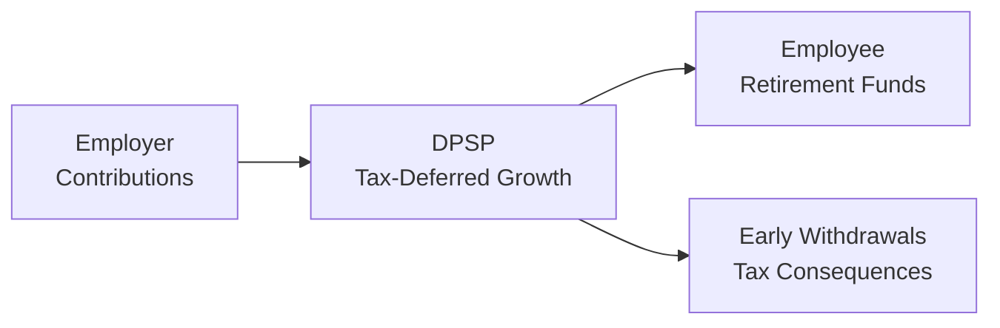

## 8.6 Deferred Profit Sharing Plans

If you’ve ever heard a co-worker exclaim, “We got profit sharing this year!” while you were sipping coffee in the break room, chances are they might’ve been talking about a Deferred Profit Sharing Plan (DPSP). But you might be wondering what that really means. Is it just free money? A hidden retirement nest egg? A complicated arrangement with strings attached? Well, let’s explore.

DPSPs can be fantastic for employees because they’re employer-sponsored plans that allow you to receive a share of your company’s profits—tax-deferred—until withdrawal. And yes, in many cases, no direct employee contributions are required: the employer funds it. That might sound like a dream come true, but as with most retirement vehicles in Canada, there are nuances.

We’ll walk you through how DPSPs work, why they matter, and how to integrate them into a comprehensive retirement strategy. Along the way, we’ll also compare them to other registered plans and highlight best practices. Let’s get into it.

---

## Understanding the Basics of DPSPs

### What Is a Deferred Profit Sharing Plan?

A Deferred Profit Sharing Plan is a type of registered plan in Canada designed to allow employers to share their company’s profits by making contributions on behalf of employees. Generally, employees can’t contribute; only employers do. Funds in the plan grow tax-deferred, meaning you won’t pay taxes on contributions or investment gains until you withdraw them, usually in retirement (or sometimes when you leave the company).

When I was starting out in financial services, I remember being both fascinated and a bit intimidated by the idea of a DPSP. A friend of mine kept telling me, “DPSPs are basically free money from your boss!”—and yes, it kinda is, but it’s also a bit more complex. There are vesting schedules, limits, and tax considerations. This chapter will help you demystify it all.

### Key Benefits of DPSPs

• Employer-Sponsored: The employer alone makes contributions. Employees do not need to contribute.  
• Tax-Deferred Growth: Funds in a DPSP are not taxed until the employee withdraws them.  
• Additional Retirement Savings: DPSPs can be a valuable supplement to an employee’s personal Registered Retirement Savings Plan (RRSP) or other employer-sponsored plans.  
• Vesting and Retention: Employers utilize vesting schedules to incentivize employees to stick around.

---

## How DPSPs Work

### Employer Contributions and Profit Sharing

The fundamental premise is: an employer who had a good year (i.e., made profits) might share a specific portion of that profit with employees. The employer picks how much to contribute overall, then allocates it to individual employees.

Contributions go directly into the DPSP in each employee’s name. The amount contributed depends on the company’s guidelines, typically based on a percentage of salary or wages.

### Tax-Deferred Growth

While in the plan, contributions (and any investment growth) are sheltered from taxes. This is what we call “tax-deferred growth.” You’re not going to pay taxes on any of those contributions or gains until you actually—or eventually—take the money out.

### Pension Adjustment (PA)

Let’s talk about the Pension Adjustment, or PA. Whenever your employer invests in a DPSP or a Registered Pension Plan (RPP) on your behalf, the government deems that you’ve already used up a portion of your tax-advantaged savings space. This is called a Pension Adjustment. It reduces your RRSP contribution room for the following tax year, ensuring that you don’t accumulate an unfair advantage in tax-sheltered retirement savings across multiple plans.

Put simply: if your employer puts money into a DPSP on your behalf, your available RRSP contribution for next year is reduced proportionately. If you wonder why your Notice of Assessment from the Canada Revenue Agency (CRA) is showing less RRSP room than you expected, your DPSP might be a factor.

### Common Vesting Schedules

Vesting is the process in which ownership of employer contributions comes into your hands after a certain timeframe or condition. A typical vesting schedule might be something like:

• Immediate Vesting: You’re 100% owed any contributions from day one.  
• Cliff Vesting: Employees have to stay for, say, two years or more before they “vest” (100% ownership at once).  
• Graded Vesting: A portion of the contributions become yours each year—maybe 20% ownership the first year, 40% after two years, 60% after three years, and so on.

It’s important to know your vesting schedule because if you leave the company before you’re fully vested, you might lose some (or all) of the employer’s DPSP contributions on your behalf.

### Interplay With Other Plans (RPPs and RRSPs)

Many employers offer Group RRSPs, Registered Pension Plans, or a combination thereof. Sometimes they add a DPSP on top of these plans as a further incentive. It’s common to see a Group RRSP and DPSP combined: employees contribute to the Group RRSP, while the employer matches with DPSP contributions, or vice versa. This strategy can be attractive to employers: DPSP contributions have lower payroll tax implications than direct bonuses. Meanwhile, employees get tax-sheltered retirement contributions. Win-win, right?

That said, keep in mind these contributions can reduce your RRSP room, as previously mentioned. So if you’re mapping out a personal financial plan, factor your DPSP’s Pension Adjustment into your calculations.

---

## Quick Visual Overview

Below is a simple Mermaid diagram to illustrate the typical flow of funds in a DPSP context:

• Box A represents the employer’s profit-sharing contributions.  
• Box B represents the DPSP, where funds grow tax-deferred.  
• Box C represents the funds eventually becoming part of the employee’s retirement.  
• Box D shows what happens if you take early withdrawals—you’ll face taxes right away and potentially other penalties in certain provinces.

---

## Tax Considerations

### Tax-Deferred Until Withdrawal

Picture your DPSP balance as a pot of money you don’t pay taxes on until you take it out. Once withdrawn, it’s added to your taxable income for that year. This can matter a lot if you withdraw a hefty amount in a single lump-sum at a high marginal tax rate. Usually, it’s more tax-efficient to roll that money into another registered plan (like a RRSP or a Registered Retirement Income Fund [RRIF] upon retirement), if allowed, to continue deferring taxes.

### Early Withdrawals and Penalties

If you withdraw funds early (before retirement or leaving your job), the amount you take out is immediately taxable as income. Some provinces may also charge additional early withdrawal penalties. So a DPSP isn’t your rainy-day piggy bank. Use it as part of your strategic, long-term retirement planning. You generally only access it when you retire or when you depart from your employer.

---

## Integrating DPSPs into Comprehensive Financial Plans

Think of a DPSP as just one ingredient in the recipe for a robust retirement plan. If your employer offers a DPSP, that’s often a valuable perk. Combine that with your RRSP, TFSA, or even a spousal RRSP if that fits your family’s needs. The main advantage is that the DPSP contributions from your employer come at no direct cost to you, and can supercharge your retirement savings.

### Example Scenario

Let’s say you earn $80,000 a year working for a medium-sized Canadian corporation. Your employer contributes 5% of your salary into a DPSP if the company meets specific profit targets. That’s $4,000 a year. Over time, the balance in your DPSP can grow substantially, especially if the underlying investments perform well.

However, remember that your Pension Adjustment (PA) will reduce your RRSP room. If your PA is $4,000, your normal RRSP contribution limit for the next tax year will fall by that amount. That’s not necessarily bad—it just prevents double-dipping into multiple tax shelters at once.

---

## Vesting and Employee Retention

Employers frequently use vesting schedules to motivate employees to stay longer. The more extended and well-structured the vesting, the higher the retention. And from an employee’s point of view, a DPSP can feel like a loyalty bonus. The day you pass your vesting period is a day of financial significance—money that’s officially yours. 

I recall a friend who worked at a manufacturing firm that offered fantastic DPSP contributions. He planned to switch jobs but decided to wait until after his three-year mark so he could become fully vested. That single decision earned him thousands in extra money he would have lost otherwise. So always check the plan’s rules—and consider them carefully in your career decisions.

---

## Potential Downsides and Pitfalls

1. **Not Actually “Free” If You Leave Early**: If your employer’s DPSP has a long vesting schedule and you leave your job too soon, you might walk away with nothing—or with only a partial share of the employer’s contributions.  
2. **RRSP Room Reduction**: Some folks forget about the Pension Adjustment. Your RRSP contribution limit is not as high if your DPSP is receiving substantial employer contributions. That might feel limiting if you have the means and desire to make large personal RRSP contributions.  
3. **Early Withdrawal Taxes**: Taking money out early can create an immediate tax liability, possibly pushing you into a higher tax bracket that year.  
4. **Plan Restrictions**: Funds in a DPSP must generally remain locked in until retirement or termination of employment. This can create a liquidity challenge if you need to access funds unexpectedly.  

---

## Real-World Case Study

### Anita’s Dilemma

Anita has been working at TechSpark Inc. for five years. Her base salary is $90,000, and each year her employer contributes 6% of her salary into a DPSP if the company meets its growth targets (it has every year so far). She’s fully vested after three years, so any employer contribution is hers to keep.

Now, Anita is considering changing jobs for a higher salary. The new company offers a smaller DPSP, only 3%, but also includes a performance-based cash bonus. Anita wonders what’s better for her future: more immediate cash each year or a bigger employer-sponsored retirement benefit?

She weighs the possible outcomes:  
• If she stays at TechSpark five more years, her DPSP might grow significantly.  
• If she moves, her base pay increases. But she’s not sure if that small DPSP is enough to compensate for the potential retirement growth she’d get at TechSpark.

In the end, Anita decides to stay, at least for a couple more years, to see if her DPSP accumulates enough to justify missing out on that other job’s compensation. This process highlights that a DPSP can significantly influence career decisions—because it’s not always just about the salary, but also about the long-term wealth-building potential.

---

## Practical Tips for Advisors and Clients

• Review Vesting: Always check how contributions vest. Encourage clients (or if you’re the client, remind yourself) to stay at least until vested if possible.  
• Monitor PA: Advisors and financial planners should incorporate the Pension Adjustment in annual tax planning and retirement projections.  
• Consolidate or Transfer: At retirement or job termination, DPSP funds can typically be transferred to RRSPs or RRIFs. This defers taxes further.  
• Maximize Overall Strategy: DPSPs are part of the bigger puzzle. Combine them with TFSAs, RRSPs, and other investments for balanced retirement planning.

---

## Aligning with Canadian Regulations

DPSPs have to follow certain rules set by the Canada Revenue Agency (CRA). The maximum contribution level, conditions about who’s eligible, and rules around withdrawals are all regulated. Furthermore, oversight can come from the Canadian Investment Regulatory Organization (CIRO)—which currently supervises investment dealers and mutual fund dealers in Canada—to ensure plan compliance and protect investors’ interests.

Historically, you might hear references to the Mutual Fund Dealers Association (MFDA) or the Investment Industry Regulatory Organization of Canada (IIROC). These were the predecessor self-regulatory organizations (SROs). But as of January 1, 2023, they amalgamated into CIRO. Now everything is under one roof. If you’re looking for official guidelines, or you’re just curious about best industry practices, visit CIRO’s website at [https://www.ciro.ca](https://www.ciro.ca).

---

## Using DPSPs as a Recruitment Tool

Some employers add DPSPs to their benefits packages to attract and retain quality employees. If you’re an employer reading this and thinking, “Huh, I’ve never offered a DPSP before—am I missing out on a great employee perk?” Then you might explore it further. Offering a DPSP can be more tax-effective for the employer compared to paying out bonuses in cash, and employees value the chance to build retirement savings with minimal out-of-pocket costs.

From the employee standpoint, a DPSP might even be more appealing than a pure bonus, because bonuses are typically taxed heavily in the year they’re paid. Meanwhile, DPSPs help you grow your retirement portfolio with immediate tax-deferral. It’s not always an easy calculation, though, because employees might prefer more flexible compensation. But if you’re in an environment where long-term retention truly matters, a DPSP can be a powerhouse.

---

## DPSP Contribution Limits

The CRA sets annual limits on how much can be contributed to a DPSP in a given year. Generally, the limit is tied to a pension formula, which includes metrics like the employee’s salary. Since these rules can change, it’s important to check current limits on the CRA’s DPSP webpage at:  
[https://www.canada.ca/en/revenue-agency/services/tax/registered-plans/dpsp.html](https://www.canada.ca/en/revenue-agency/services/tax/registered-plans/dpsp.html)

Keep in mind that DPSP contributions essentially come out of your total “tax-sheltered allowance” for the year. So if your employer is contributing a large chunk on your behalf, you may end up with less personal RRSP contribution room. If your overall goal is to maximize every drop of tax-deferred space, that means you should carefully track your Notice of Assessment each year and plan accordingly.

---

## What Happens at Retirement

When you retire, or if you terminate employment (sometimes including early retirement), you generally have several options for your DPSP:

• **Transfer to a Registered Retirement Savings Plan (RRSP)**: You can often keep the tax-deferred status going by transferring your DPSP balance directly to an RRSP, assuming there’s adequate room or it’s a direct plan-to-plan transfer.  
• **Transfer to a Registered Retirement Income Fund (RRIF)**: If you’re already at retirement age, you might transfer the DPSP proceeds into an RRIF and start drawing income in a tax-efficient manner.  
• **Take Cash**: You can withdraw the entire amount as a lump sum, but that triggers immediate taxation. This might not be ideal if you’re already in a high tax bracket, but sometimes people prefer or need to do it.  
• **Purchase an Annuity**: Certain individuals may choose to purchase an annuity with their DPSP funds, ensuring a guaranteed income stream in retirement.

Each option comes with distinct tax consequences and planning considerations. If the DPSP is large and you’re on the cusp of retirement, it might be worth discussing these options with a financial planner so you can weigh the pros and cons (like how an annuity might lock in guaranteed income but potentially at a lower rate, or how an RRIF might give you more flexibility but also more market risk).

---

## Strategies for Maximizing DPSPs

1. **Stay Until Fully Vested**: If possible, align your career moves with vesting schedules—this can preserve tens of thousands of dollars in employer contributions.  
2. **Coordinate With Your RRSP**: If your DPSP’s Pension Adjustment is high, you might tweak your personal RRSP contributions to stay within your overall available tax-sheltered room.  
3. **Invest Appropriately**: Within your DPSP, choose or guide your employer to offer a diversified lineup of investments—equities, bonds, or balanced funds—depending on your risk tolerance and overall financial plan.  
4. **Monitor Performance**: Check your statements regularly. It sounds obvious, but you’d be surprised how many people ignore their DPSP because contributions are “automatic.” Don’t let it be out of sight, out of mind.  
5. **Plan Your Withdrawals Wisely**: If you do leave or retire, consider rolling over the DPSP into a suitable registered plan or carefully plan the timing of your withdrawals to minimize taxes.

---

## Common Questions (FAQ)

**Q: Can I just take the money whenever I want?**  
A: Typically, no. DPSP funds are locked in for retirement or termination of employment. Early withdrawal triggers taxes and possible penalties.

**Q: Do I still accrue a Pension Adjustment if I’m not fully vested?**  
A: Yes, your Pension Adjustment is calculated based on contributions, not on whether you’re vested. So you’ll lose that RRSP room even if you end up forfeiting the DPSP money by leaving early.

**Q: Is a DPSP the same as a profit-sharing bonus?**  
A: Not exactly. A profit-sharing bonus is usually paid in cash. A DPSP is a registered plan that holds contributions until withdrawal—often the “profit share” is directly contributed to the plan on behalf of the employee.

**Q: Are DPSPs only for large companies?**  
A: Companies of various sizes can offer DPSPs. It depends on the employer’s financial health and policy decisions.

---

## Additional Resources

• **Canadian Revenue Agency (CRA)**:  
  [https://www.canada.ca/en/revenue-agency/services/tax/registered-plans/dpsp.html](https://www.canada.ca/en/revenue-agency/services/tax/registered-plans/dpsp.html)  
  This is the official source for DPSP rules and limits.

• **Canadian Investment Regulatory Organization (CIRO)**:  
  [https://www.ciro.ca](https://www.ciro.ca)  
  Use CIRO’s resources for guidance on investment regulations and plan oversight in Canada.

• **“Canadian Retirement Planning Made Easy” (Book)**:  
  Discusses DPSPs among other employer-sponsored retirement vehicles. Offers deeper context and case studies.

• **Open-Source Financial Tools**:  
  Tools such as the “RRSP vs. DPSP Simulator” available on various personal finance forums might help compare the impact of contributions on your annual tax situation.

---

## Conclusion

At the end of the day, a Deferred Profit Sharing Plan can be a powerful addition to your retirement toolkit. Even though it often feels like a “no-brainer” to accept free money from your employer, it’s crucial to understand vesting schedules, the Pension Adjustment that affects your RRSP room, and the potential tax implications of early withdrawal.

If you plan wisely, coordinate the DPSP with your other savings vehicles, and pay attention to vesting, you can reap real benefits from employer contributions. Whether you’re an employee looking to maximize your savings or an employer exploring ways to reward and retain staff, a DPSP might be the right fit. Just remember: it’s not all about the fancy labels—ultimately, it’s about building a secure, comfortable retirement. And that’s something all of us can appreciate.

---

## Test Your Knowledge: Deferred Profit Sharing Plans in Canada



### In a Deferred Profit Sharing Plan (DPSP), who generally contributes?

- [x] Only the employer
- [ ] Only the employee
- [ ] Both employee and employer
- [ ] The government

> **Explanation:** With a DPSP, the employer makes contributions on behalf of employees. DPSPs do not typically allow employee contributions.

### Which of the following describes vesting in a DPSP?

- [x] Ownership of employer contributions by the employee after meeting specific conditions
- [ ] Automatic ownership of contributions on the first day
- [ ] The process of determining market returns
- [ ] A tax deduction calculation used by the CRA

> **Explanation:** Vesting is the schedule under which employees gain ownership of the employer’s contributions. It may not be immediate.

### What is the primary tax advantage of DPSP contributions?

- [x] They grow tax-deferred until withdrawal
- [ ] They are always tax-free forever
- [ ] They are exempt from payroll taxes
- [ ] They increase an employee’s RRSP room

> **Explanation:** DPSP contributions grow tax-deferred, and both contributions and returns are taxed only when withdrawn. They reduce RRSP room (through the Pension Adjustment) rather than increase it.

### What happens if an employee withdraws DPSP funds early?

- [x] The withdrawn amount is taxed as income in that year
- [ ] The funds remain tax-exempt
- [ ] The employee owes capital gains tax only
- [ ] No taxes or penalties apply

> **Explanation:** Early withdrawals from a DPSP are generally included in your taxable income for that year. Provincial penalties may also apply.

### Which factor is crucial in coordinating a DPSP with other retirement plans?

- [x] The Pension Adjustment (PA)
- [ ] A forced early withdrawal
- [x] Vesting schedules
- [ ] Lump-sum taxation at 50%

> **Explanation:** The Pension Adjustment affects your RRSP contribution room. Vesting schedules also matter for deciding when you fully own these contributions.

### Which organization currently oversees Canada’s investment dealers, including DPSP compliance concerns?

- [x] The Canadian Investment Regulatory Organization (CIRO)
- [ ] The Mutual Fund Dealers Association (MFDA)
- [ ] The Investment Industry Regulatory Organization of Canada (IIROC)
- [ ] The Canadian Investor Protection Fund (CIPF)

> **Explanation:** CIRO is the current self-regulatory organization. The MFDA and IIROC no longer exist as separate entities; they were amalgamated into CIRO.

### Which is a common issue if you leave your employer before you are fully vested?

- [x] Loss of some or all employer contributions
- [ ] Additional RRSP room granted
- [x] No tax consequences at all
- [ ] Forced purchase of an annuity

> **Explanation:** Leaving before being fully vested can result in forfeiting unvested employer contributions. This is a key pitfall of DPSPs.

### Which statement best describes how DPSP contributions interact with RRSP contribution limits?

- [x] DPSP contributions trigger a Pension Adjustment that reduces your RRSP limit
- [ ] DPSP contributions do not affect RRSP room at all
- [ ] DPSP contributions increase your RRSP room
- [ ] DPSP contributions are fully exempt from CRA reporting

> **Explanation:** A Pension Adjustment (PA) applies, reducing your RRSP contribution room for the following year.

### At retirement, how can accumulated DPSP funds typically be handled?

- [x] They can be transferred into an RRSP or RRIF, or paid out in cash
- [ ] They must be forfeited if not used
- [ ] They can only be converted into company stock
- [ ] They must be spent on health insurance

> **Explanation:** At retirement or job termination, you generally have multiple options including transferring DPSP funds to RRSPs or RRIFs, or withdrawing them as cash (although that triggers immediate taxation).

### True or False: A DPSP is funded by the employee through regular payroll deductions.

- [x] True
- [ ] False

> **Explanation:** Actually, this one is a trick. Typically, the DPSP is funded by the employer, not the employee. In certain rare structures or combined plans, employees may contribute to a parallel plan, but by definition, a DPSP itself is usually employer-funded. 


