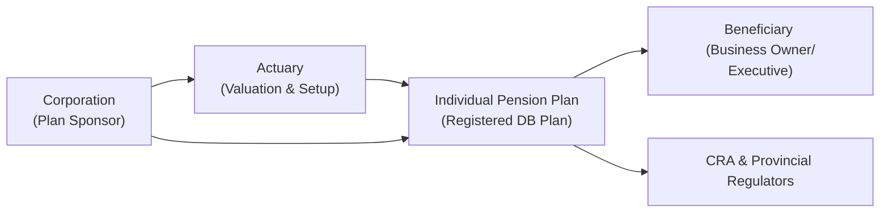

## 8.7 Individual Pension Plans

Maybe you’ve heard a friend or a colleague mention that their accountant or actuary recommended something called an Individual Pension Plan (IPP). Perhaps you nodded politely, having no idea what they were talking about—but ironically felt that small spike of curiosity we all get when someone touts a unique (and potentially lucrative) retirement strategy. So, let’s clear up the mystery around IPPs once and for all. We’ll talk about what these plans entail, how they’re structured, and why they might be appealing to certain high-income earners or business owners. 

It can be easy to mix up IPPs with other retirement savings vehicles in Canada, like Registered Retirement Savings Plans (RRSPs) or group RRSPs. But Individual Pension Plans are fundamentally different due to their defined benefit nature, their potential for larger tax sheltering, and their additional administrative requirements. Let’s walk through the core concepts, the setup process, and even a few potential pitfalls so you can decide for yourself whether an IPP is worth exploring.

--------------------------------------------------------------------------------

### Overview of Individual Pension Plans (IPPs)

An Individual Pension Plan (IPP) is a type of defined benefit (DB) pension plan, commonly established for a single individual or a very small group of employees—often business owners with a corporation or high-earning executives. The plan sponsor is typically the corporation itself, which contributes funds to the IPP on behalf of the plan member (the individual). These contributions tend to be more generous than what most people can accomplish strictly in an RRSP, especially for those over the age of 40 with consistent T4 income from their corporation.

#### Why IPPs Can Be Attractive

• **Higher Contribution Limits:** Unlike RRSPs whose annual contribution limits are tied to a certain percentage of your earned income (18% in many circumstances), IPPs use actuarial formulas to determine contribution levels. For an older individual with a strong income history, these contributions can be significantly higher.

• **Defined Benefit Security:** IPPs promise a specific retirement income—set by an actuary—based on factors like years of service and salary, bringing a sense of predictability that some might find comforting. 

• **Potentially Larger Tax Deductions:** Contributions to an IPP are tax-deductible to the sponsoring corporation, which could effectively lower corporate tax liabilities—always a nice perk if you’re juggling corporate finances.

• **Creditor Protection:** IPPs often fall under pension legislation that protects pension assets from creditors. That means, if something unfortunate happens—like business insolvency or personal liability—pension assets in an IPP may be far safer than regular corporate or personal assets.

On the flip side, setting up and running an IPP isn’t all sunshine and daisies. Let’s look at the complexity, the fees, and the ongoing compliance burden.

--------------------------------------------------------------------------------

### Key Components of an IPP

When you first hear about IPPs, it’s easy to think it’s basically an RRSP, but maybe with fancier packaging. In truth, an IPP has a few key moving parts unique to its nature as a defined benefit plan.

1. **Plan Sponsor (Employer/Corporation)**  
   The plan sponsor is usually the individual’s own corporation (for owner-managers) or an executive’s employer. This entity establishes the IPP in order to provide (and fund) retirement benefits for the plan member.  

2. **Plan Member (Employee)**  
   Typically, this is the high-income business owner or executive. In smaller setups, there’s often just one or two members in the entire plan—hence the term “Individual” Pension Plan.

3. **Actuarial Valuation**  
   Since IPPs are defined benefit plans, they rely on actuarial valuations to determine how much money needs to be contributed to meet the promised benefit. Variables include age, years of service, salary, and expected investment returns. Actuaries recalculate these numbers periodically—often every three years—to ensure accuracy.

4. **Benefits and Contributions**  
   The IPP’s core promise is a specific pension payout at retirement. Contributions are carefully calibrated to hit that target. If actual investment returns fall short of assumptions, the plan sponsor may be able to inject additional tax-deductible contributions to cover the shortfall. However, if performance exceeds assumptions, “surplus” rules could limit further contributions.

5. **Regulatory Compliance**  
   IPPs must adhere to Canada Revenue Agency (CRA) requirements and other pension rules. This includes filing annual or periodic reports, ensuring that the plan is properly funded, and meeting all the rules unique to registered pension plans in Canada.

--------------------------------------------------------------------------------

### How IPP Contributions Are Determined

A hallmark of defined benefit plans lies in how contributions are calculated. Unlike RRSPs, where the formula is straightforward—18% of previous year’s earned income up to a limit—the IPP contribution formula is more intricate and relies on future pension obligations.  

Below is a simplified conceptual representation of an actuary’s present value calculation for a retirement annuity:

$$
\text{Present Value} = \sum_{t=1}^{N} \frac{\text{Annual Benefit} \times \text{Survival Probability}_t}{(1 + r)^t}
$$

Where:
- \\( N \\) = the number of years (from now until the end of retirement)  
- \\( r \\) = the assumed discount rate or expected rate of return  
- \\( \text{Survival Probability}_t \\) = the probability that the individual will still be alive in year \\( t \\)  

In simpler terms, an actuary determines how much money must be set aside now (and in subsequent years) so the plan can fulfill its pension promises later. Each IPP is unique because it’s tailored to the individual’s age, compensation, and retirement goals.

--------------------------------------------------------------------------------

### Comparison: IPP vs. RRSP

It’s common to wonder: Why not just use (or stick with) an RRSP—even a group RRSP—especially if it’s simpler to manage? Let’s explore a few distinctions.

- **Contribution Flexibility:**  
  RRSPs come with a strict annual limit. IPPs might permit substantially higher contributions, especially if you’re older and your corporation can shoulder bigger deductions.

- **Administrative Complexity:**  
  RRSPs are simple: open an account, invest, abide by contribution limits. IPPs, on the other hand, require an actuary’s oversight, potential annual or triennial valuations, and more paperwork.

- **Costs to Set Up and Maintain:**  
  An IPP can be expensive—legal fees, actuarial fees, potential trustee fees, and compliance costs. RRSPs cost comparatively less to maintain, although you’ll lose out on certain extras that come with an IPP.

- **Creditor Protection:**  
  IPPs often enjoy robust creditor protection under pension legislation. RRSPs have some creditor protection, but not to the same extent (depending on provincial legislation and how the RRSP is structured).

- **Surplus or Shortfall:**  
  With an IPP, if your plan assets grow more than anticipated, your administrative team may declare a surplus, which can halt additional contributions. If your investments underperform, your corporation can often top up with further tax-deductible contributions. RRSPs don’t allow that kind of “do-over” if the portfolio tanks.

For small-business owners who feel they’ve maxed out their RRSP potential, have stable corporate earnings, and are at least in their 40s or 50s, an IPP could be a compelling next step.

--------------------------------------------------------------------------------

### Setting Up and Administering an IPP

If you’ve ever started your own business, you know new ventures have contracts and paperwork, legal docs, and probably the odd frustrating phone call to the government. Well, setting up an IPP can sort of feel like starting a mini pension business for yourself:

1. **Engage a Professional Actuary**  
   You typically begin by consulting an actuary, who will create or customize a defined benefit plan. This step is crucial because the plan must align with CRA guidelines and reflect your personal compensation history, age, and retirement objectives.

2. **Plan Registration**  
   The actuary will help draft the plan text. You’ll also need to register the plan with the CRA and any relevant pension regulatory bodies in your province. This ensures your contributions and any investment earnings remain tax-sheltered.

3. **Initial Funding and Possibly “Past Service” Contributions**  
   Once the plan is up and running, you can make an initial contribution based on your years of service and salary up to the establishment date. This might let you claim a bigger deduction early on.  
   - “Past service” is a big reason IPPs can be very attractive. If you have multiple years of T4 income history, the plan can allow you to top up contributions for those prior years, subject to CRA rules.

4. **Ongoing Contributions**  
   Each year—or at intervals determined by your actuary—you’ll contribute the required amount, factoring in any shortfalls or adjustments required to keep the plan on track.

5. **Periodic Actuarial Valuations**  
   An actuarial valuation is usually required every three years (though some plans may choose to do it more often). This is when the actuary recalculates what’s needed for future obligations based on actual investment returns, changes in membership (if any), or new retirement timelines.

6. **Administrative Follow-Through**  
   The sponsor must file annual returns, keep track of contributions, ensure the plan invests responsibly, and abide by pension regulations. This is key to maintaining the plan’s registered status.

IPPs, while potentially lucrative, do require a bit of extra elbow grease (and cost) each year or every few years to keep them compliant and on track.

--------------------------------------------------------------------------------

### The Role of Investment Performance

One really distinctive feature of an IPP is how it accommodates fluctuations in market returns:

• **Underperformance → Additional Corporate Contributions**  
  If your investment returns fall below the plan’s assumed rate, you’ll likely have a shortfall. The government allows the plan sponsor (your corporation) to cover that gap with additional tax-deductible contributions.  

• **Outperformance → Surplus Situations**  
  If your plan’s investments exceed expectations, you’ll have a surplus. Surplus assets in a DB pension plan are often locked away for future benefit improvements or contribution holidays. In an IPP, you typically can’t just pull that “extra” money out without incurring serious tax nightmares—nor can you keep piling in more contributions. 

For some, the ability to add extra contributions in an underperformance scenario is a plus—especially for stable corporations with consistent cash flow. However, it can feel restrictive if you prefer the simplicity and total control of a personal RRSP.

--------------------------------------------------------------------------------

### Creditor Protection

IPPs enjoy robust legal protections. Assets typically cannot be seized by creditors in the event of business or personal bankruptcy (subject to provincial pension legislation). This can be a huge advantage for professionals like doctors, lawyers, or small-business owners who worry about lawsuits or debt claims. Compared to typical corporate or personal assets, which can be fair game in insolvency, a properly established pension plan stands on much firmer ground, generally speaking.

--------------------------------------------------------------------------------

### Potential Pitfalls and Challenges

• **Higher Costs and Ongoing Maintenance:**  
  This is the big one. Engaging actuaries, lawyers, and trustees can run up annual bills. Make sure the tax benefits and retirement enhancements outweigh the red tape.

• **Locking Up Liquidity:**  
  The funds in an IPP are locked in, meaning you can’t freely withdrawal them whenever you’d like. That’s actually somewhat true for many pension or retirement vehicles, but the IPP’s rules can be quite strict, with provincial pension standards layered in.

• **Early Retirement or Plan Termination:**  
  If you retire early or wind down the plan prematurely, you might trigger special rules or bridging benefits. This can complicate your retirement planning if you’re uncertain about your future timeline.

• **Potential Surplus Constraints:**  
  Surplus rules might sound good (yay, extra money in the plan!), but ironically it can impede ongoing tax deductions. A “pension surplus” can lead to contribution holidays and other regulatory complexities.

For a small-business owner or executive used to controlling all aspects of finances, the forced structure of an IPP can be either a blessing (it ensures you save) or a frustrating burden.

--------------------------------------------------------------------------------

### Practical Case Study: Ron, the Small-Business Owner

Let’s walk through a short anecdote. Ron is 50 and owns a successful engineering consultancy. He’s been contributing to his RRSP for years and has a decent chunk of retirement savings. But now, his corporate earnings have grown to the point where hitting his RRSP limit doesn’t make a meaningful dent in his tax burden anymore. Plus, he wants to supercharge his retirement contributions for the next 10-15 years.

• **Step 1: Actuary Consultation**  
  Ron meets with an actuary, who calculates that an IPP could allow him to contribute nearly twice as much annually as his RRSP limit would allow, given his age and salary. Additionally, they find he has “past service” from the time he started drawing corporate wages in his early 40s. 

• **Step 2: Plan Setup**  
  Ron’s corporation establishes the IPP. He completes the plan texts following the actuary’s template, and they register with the CRA. The plan is official a couple of months later.

• **Step 3: Initial Contribution**  
  The actuary determines that, to fund the pension for his past service years plus the current year, the corporation can contribute a large lump sum. Ron’s accountant is thrilled because it significantly reduces the corporation’s taxable income in that year.

• **Step 4: Ongoing Maintenance**  
  Every few years, the actuary updates the plan assumptions. If Ron’s IPP investments do well, they may reduce or hold off on further contributions. If the markets drop, the plan sponsor has to contribute more.

Ron’s IPP is costlier to maintain than a straightforward RRSP, but he’s excited by the higher annual deductions the corporation can take and the sense that a defined benefit is waiting for him in retirement.

--------------------------------------------------------------------------------

### Additional Regulatory and Tax Considerations

• **CRA Regulations and Guidelines**  
  All IPPs must abide by CRA rules regarding registration, contributions, plan documentation, and valuations. Check the CRA’s official page on registered plans here:  
  https://www.canada.ca/en/revenue-agency/services/tax/registered-plans.html  

• **Canadian Investment Regulatory Organization (CIRO)**  
  Although CIRO (formerly New SRO, a merger of defunct IIROC and MFDA) typically oversees investment dealers and marketplace integrity, it’s good to note that any mutual funds or securities held within your IPP might fall under the regulatory environment that CIRO supervises. Always confirm your advisors and actuaries are fully qualified and operating under correct compliance guidelines. Refer to CIRO at https://www.ciro.ca.

• **Professional Actuaries**  
  The Canadian Institute of Actuaries (CIA) sets standards for actuaries in Canada. Make sure your chosen actuary is a member in good standing with the CIA to ensure your plan is set up correctly.

• **Creditor Protection Legislation**  
  Most pension legislation ensures these plans are well-sealed from creditors. Details vary by province, so consult legal counsel if you need ironclad clarity on how your IPP might be protected.

• **Tax Reporting and Corporate Deductions**  
  Your corporation claims contributions as a business expense. Be sure to track them accurately, and maintain open communication with your accountant so you don’t miss any deadlines or fail to provide required documentation.

--------------------------------------------------------------------------------

### Best Practices

• **Plan Early, Plan Thoroughly:**  
  While you can set up an IPP anytime, it works best if you foresee at least a few years of stable corporate income. The earlier you get it implemented in your mid-career or later, the more you stand to benefit from the plan’s structure.

• **Monitor Investment Policies:**  
  Just because your contributions are “locked in” doesn’t mean you ignore how it’s invested. Work with a licensed portfolio manager or advisor to select an asset mix aligned with your risk tolerance and your plan’s actuarial assumptions.

• **Keep Up with Valuations:**  
  Resist the temptation to cut corners on actuarial valuations. Inadequate funding or missed valuations can cause big headaches if the CRA decides your plan is offside.

• **Think Holistically:**  
  Coordinate your IPP strategy with your other retirement savings vehicles. If you have a spousal RRSP, TFSA, or syndicated group pension from another job, all these puzzle pieces must fit together.

• **Communicate with Professionals:**  
  You’ll likely need an actuary, a lawyer familiar with pension law, and an accountant who understands corporate tax planning. Clear communication among all parties is key.

--------------------------------------------------------------------------------

### Mermaid Diagram: IPP Structure at a Glance

Below is a simplified diagram of how the main parties interact in an Individual Pension Plan arrangement:

- A["Corporation (Plan Sponsor)"]: The business that sets up and funds the plan.  
- B["Actuary (Valuation & Setup)"]: The specialist who calculates required contributions.  
- C["Individual Pension Plan (Registered DB Plan)"]: Where the funds are held and invested.  
- D["Beneficiary (Business Owner/ Executive)"]: The individual who eventually receives the pension.  
- E["CRA & Provincial Regulators"]: Government bodies providing oversight and ensuring compliance.

--------------------------------------------------------------------------------

### Additional Resources

1. **CRA Official Guidelines on Registered Plans**  
   https://www.canada.ca/en/revenue-agency/services/tax/registered-plans.html

2. **Canadian Institute of Actuaries**  
   https://www.cia-ica.ca  – Ensures professional standards among actuaries.  

3. **Individual Pension Plans: A Comprehensive Guide (RBC Wealth Management)**  
   Discusses case studies and advanced strategies.  

4. **CIRO (Canadian Investment Regulatory Organization)**  
   https://www.ciro.ca – Canada’s Self-Regulatory Organization overseeing market integrity and investment dealers.

--------------------------------------------------------------------------------

### Conclusion

An Individual Pension Plan can be a powerful retirement planning tool, especially for business owners or high-income executives who crave higher contribution potential than an RRSP alone can offer. Yes, it requires more careful thought, ongoing maintenance, and professional fees. But for the right person, the possibility of greater tax deductions, enhanced creditor protection, and the security of a defined benefit pension can far outweigh the complexity.

Maybe it’s worth having that chat with your actuary or accountant. Sure, you’ll jump through more hoops than you would with a simple RRSP. But if you can comfortably handle the administrative overhead, an IPP might set you up for a cozier retirement—complete with the peace of mind that you’ve maximized every possible advantage Canada’s tax code has to offer.

--------------------------------------------------------------------------------

## Test Your Knowledge: Individual Pension Plans in Canada



### 1. Which of the following best describes an Individual Pension Plan (IPP)? 
- [ ] A defined contribution plan funded solely by employee contributions.
- [ ] A government-sponsored pension plan covering all Canadians.
- [x] A defined benefit plan often set up by small corporations or high-income earners.
- [ ] A non-registered supplemental retirement plan with no tax advantages.

> **Explanation:** An IPP is a defined benefit pension plan commonly used by owner-managers or high-income executives.  

### 2. Which group is most likely to benefit from establishing an IPP?
- [x] Older, high-income individuals with a corporation seeking larger retirement contributions.
- [ ] Newly hired part-time employees who have no earned income history.
- [ ] Individuals who want a plan with extremely low administrative costs.
- [ ] Students who have no existing T4 income.

> **Explanation:** IPPs are generally ideal for older executives or business owners with stable T4 income and a corporation to fund the plan.  

### 3. In an IPP, which factor primarily determines the required contribution amounts?
- [ ] The amount of available RRSP room.
- [ ] A simple percentage of the plan member’s salary.
- [x] Actuarial calculations based on age, salary, and expected investment returns.
- [ ] A flat rate defined by the CRA for all IPPs in Canada.

> **Explanation:** Contributions in an IPP are calculated using actuarial valuations to fund a specified benefit.  

### 4. What happens if the IPP investments underperform compared to the plan’s assumptions?
- [ ] The government suspends the plan for non-compliance.
- [ ] The plan member must close the plan.
- [x] The corporation can make additional tax-deductible contributions to cover the shortfall.
- [ ] Nothing is allowed; the plan cannot be adjusted after inception.

> **Explanation:** One advantage of an IPP is that if returns fall short, the sponsoring corporation may top up contributions to keep the plan fully funded.  

### 5. Which statement about IPP surplus rules is correct?
- [ ] Any surplus is automatically paid out to the plan sponsor tax-free.
- [ ] Surplus funds cannot exist in a defined benefit plan.
- [x] Surplus might restrict or reduce future contributions until the surplus is used or adjusted.
- [ ] Surplus rules apply solely to group RRSPs and not IPPs.

> **Explanation:** If the IPP experiences stronger-than-expected returns, resulting in a surplus, the plan might be required to pause or reduce contributions.  

### 6. Which of the following is considered a potential drawback of IPPs?
- [ ] Minimal administrative requirements.
- [x] Creation and maintenance expenses, including actuarial fees.
- [ ] Ineligibility for past service contributions.
- [ ] The inability to carry forward unused RRSP room into the plan.

> **Explanation:** IPPs generally involve higher administrative and actuarial costs.  

### 7. Which of the following is a key advantage of IPPs for small-business owners?
- [x] Funds in an IPP enjoy strong creditor protection under pension legislation.
- [ ] Employer contributions are not tax-deductible.
- [ ] They are substantially easier to set up than an RRSP.
- [ ] There is no limit to the amounts contributed.

> **Explanation:** Creditor protection is a significant advantage of IPPs.  

### 8. Which professional is most critical in setting up and calculating contributions for an IPP?
- [ ] Dentist
- [ ] Realtor
- [x] Actuary
- [ ] Insurance underwriter

> **Explanation:** An actuary is necessary for accurately determining the funding requirements for a defined benefit plan like an IPP.  

### 9. How often are actuarial valuations typically performed for an IPP?
- [ ] Only once at plan inception.
- [ ] Every year without exception.
- [ ] Whenever the plan sponsor feels it is necessary.
- [x] Approximately every three years, or as required by the plan and regulations.

> **Explanation:** IPPs usually undergo actuarial valuations every three years to ensure they remain fully funded.  

### 10. True or False: IPPs can allow for larger tax sheltering compared to RRSPs, especially for older individuals. 
- [x] True
- [ ] False

> **Explanation:** Due to the defined benefit structure and actuarial basis, IPPs often permit larger contributions, making them especially beneficial for older, high-earning individuals.  




