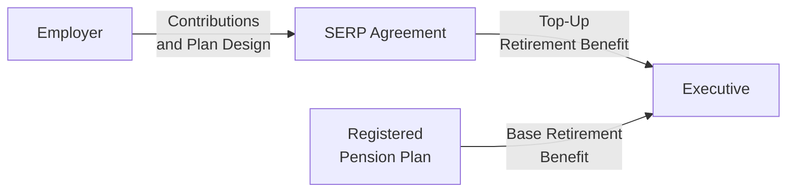

## 8.8 Supplemental Executive Retirement Plans

Supplemental Executive Retirement Plans (SERPs) are specially designed employer-sponsored arrangements that offer executive-level employees additional retirement income beyond what’s available under Registered Pension Plans (RPPs). Sometimes, an RPP alone doesn’t do the trick for high-income earners who bump up against annual contribution or benefit limits. That’s where SERPs step in, “topping up” your retirement income so it aligns more closely with your lifestyle and compensation level. In other words, if your standard RPP is capped by Canadian tax law, a SERP ensures that you get a well-rounded—and often quite generous—retirement benefit.

SERPs can look a bit different from regular pension plans. They’re typically non-registered (or partially registered) and subject to different rules. Although they’re not governed by the same strict pension legislation as RPPs, SERPs remain subject to employment law, income tax rules, and contractual obligations. So, let’s walk through the structure, benefits, uncertainties, and best practices associated with these plans. And if you’ve ever wondered how top executives somehow keep their retirement nest eggs so well-padded, read on.

---

### Why SERPs Matter

Perhaps you’ve chatted with a friend who’s an executive. You know, the one who seems to have it all figured out: nice home, comfortable lifestyle, big responsibilities at work, and a fairly complicated compensation package. The friend’s big question: “Will my workplace pension really cover me after all these years of high-level management?” Now, for many executives, a regular pension plan alone isn’t going to replace a sufficient percentage of their pre-retirement income, especially once you consider Canada’s Income Tax Act constraints on RPPs. 

For instance, if you’re earning well beyond the average salary, you’ll probably hit your pension limits pretty quickly. SERPs fill that gap. They top up what your registered plan can’t provide, bridging the difference so your overall retirement benefit is in line with what the employer intends to deliver to key executives.

Some key terms you’ll see in the SERP world include:

• Supplemental Executive Retirement Plan (SERP): An additional or “top-up” pension benefit beyond standard RPP limits, usually targeted at executives or highly compensated individuals.  
• Non-Registered Plan: A plan not registered under the Canada Revenue Agency (CRA) rules, meaning contributions and growth can be taxed very differently than in an RPP.  
• Vesting Schedule: The timeline over which benefits become guaranteed or “owned” by the employee.  
• Top-Up Benefit: The incremental portion of the pension benefit that goes beyond standard RPP limits.

---

### How SERPs Complement RPPs

Before we jump into the nitty-gritty, let’s set the foundation with a high-level look at how SERPs fit alongside RPPs and other retirement offerings. In a registered pension plan—like a Defined Benefit (DB) or Defined Contribution (DC) arrangement—there are maximum allowable contributions or benefit formulas that align with CRA guidelines. If the employer is aiming to replace, say, 70% of an executive’s pre-retirement income but the RPP alone can only provide 50% due to government-imposed limits, the company may add a SERP to cover the “missing” 20%.

Below is a simple illustration of how SERPs top up an executive’s ultimate retirement benefit. Imagine building blocks. The RPP forms the base. Then on top of that, you have an additional “SERP block” that pushes your total retirement benefit back up to the employer’s intended target.

---

In this diagram, you see two arrows converging on the executive’s ultimate retirement payout. One arrow is the Registered Pension Plan, representing the base level of retirement income, and the other is the SERP, representing the top-up. This synergy helps ensure the executive’s retirement income stays aligned with their earnings.

---

### Types of SERP Designs

SERP designs can vary significantly depending on an organization’s objectives, budget, and overall compensation philosophy. Here are a few of the most common design structures you’ll spot:

1. Fully Employer-Funded SERPs  
   • In these, the employer shoulders the entire funding burden.  
   • Sometimes employers hold assets in a special account or trust to back up the promise, although such funding may or may not be legally protected.  
   • Vesting schedules can require the executive to remain with the company for a set number of years, or meet certain performance goals, in order to lock in the SERP benefits.

2. Partially Funded or Informally Funded SERPs  
   • An employer may choose not to officially “set aside” money in a trust. Instead, it funds the obligations informally out of the company’s general assets when they become due.  
   • This means the executive is effectively an unsecured creditor; in the event of employer insolvency, the SERP benefits could be at risk.

3. “Top Hat” Plans  
   • Sometimes the term “top hat” plan is used for these executive-level SERPs in the U.S. context, but certain Canadian plans might incorporate similar concepts.  
   • The idea is to provide “excess” or “excess benefit” coverage above the standard RPP.

4. Hybrid Plans  
   • Some SERPs might combine registered and non-registered components within the same overarching structure.  
   • The result is that part of the plan is subject to CRA pension rules, while the rest is non-registered.  

Though the above are broad categories, the key idea is that SERPs can be designed flexibly to suit the employer’s and the executive’s needs—subject to tax and legal restrictions, of course.

---

### Vesting Schedules and Eligibility Criteria

SERPs might also include additional eligibility or performance criteria. For example, an employer may say, “You’ll get your SERP top-up only if you stay with us for at least five years,” or “Your SERP benefits only vest if the company meets certain profit targets three years in a row.” The reason is that these plans are often used as a retention tool, a way for the employer to keep and motivate key talent. 

• Vesting: The concept that an employee “earns” the right to keep the SERP benefits. If the executive leaves too soon or fails to meet certain criteria, they might forfeit all or part of the SERP.  

• Performance Milestones: The plan can tie vesting or payout multipliers to essential metrics like stock performance, profit levels, or other corporate objectives important to the employer.

---

### SERPs and Taxation

Despite their flexibility, SERPs do come with some intricacies around tax and funding:

• Non-Registered Status: Because SERPs are primarily non-registered, the typical tax advantages you see in RPPs—like sheltering investment returns until retirement—may not apply in the same way. Often, these benefits are taxed as you earn them or are fully taxable at the time of payout.  
• Funding Methods: Some employers hold funds in a special trust, or use a Retirement Compensation Arrangement (RCA). RCAs can be complicated structures that involve a 50% refundable tax to the CRA, ensuring tax deferral is limited.  
• Payout Timing: SERP benefits might be paid as a lump sum or periodic stream upon retirement, depending on the arrangement and the executive’s needs. The point of taxation often depends on when the funds become “constructively received.”  
• Employer Tax Deduction: Employers usually get a tax deduction at the time the benefits are paid out to the executive, though specific structures can alter the timing.

In short, if you’re dealing with SERPs and the law, you almost always want professional legal and tax advice to avoid unpleasant misunderstandings. This is especially true because SERP rules aren’t uniform across provinces or industries; they may also be subject to scrutiny if there’s a suspicion the arrangement was primarily set up to sidestep taxation.

---

### Regulation and Governance

SERPs aren’t typically covered by the pension regulatory bodies that oversee RPPs. In 2025, Canada’s self-regulatory organization for investment dealers and mutual fund dealers is the Canadian Investment Regulatory Organization (CIRO). CIRO, which replaced the now-defunct MFDA and IIROC, offers general guidelines about disclosure of executive compensation. If the employer is a publicly traded company, additional governance rules from securities regulators also apply.

• CIRO (https://www.ciro.ca) ensures that registered investment dealers and mutual fund dealers follow best practices for disclosing and structuring executive-level benefits and compensation.  
• Employment and Contract Law: Because SERPs usually don’t have the same pension legislation protections, they fall under contract law. The plan is governed by the contract (or plan text) between the employer and employee, so clarity is crucial.

Also, do remember that the Canadian Investor Protection Fund (CIPF) now stands as the sole investor protection fund in Canada. This coverage safeguards client assets held at CIRO member firms in case of a firm’s insolvency. But SERPs, which are effectively an employer’s contractual promise to pay, aren’t typically covered by CIPF.

---

### Potential Benefits and Pitfalls

Let’s take a look at some of the biggest advantages and pitfalls of SERPs:

#### Benefits

• Income Replacement Levels: SERPs help executives replace a more realistic percentage of pre-retirement income if the standard RPP hits contribution caps.  
• Retention Tool: Tying SERP vesting or payouts to retention or performance can encourage key leaders to stay long-term.  
• Custom Design: Employers have more freedom to tailor these plans compared to the prescriptive rules applying to RPPs.  
• Boosting Team Morale: Clear communication around SERPs can help executives plan confidently, building loyalty and trust.

#### Pitfalls and Risks

• Creditor Risk: If the SERP is unfunded or only informally funded, there’s a risk that the employer’s creditors might have first claim on assets if the company goes under.  
• Tax Complexity: The tax treatment of SERPs can be tricky, and any slip-up could lead to unexpected tax bills.  
• Potential Changes: SERPs are easier for employers to amend, reduce, or even discontinue compared to RPPs (though any contractual obligations must be respected).  
• Regulatory Changes: Tax laws and guidelines around SERPs can shift, so the plan design might need revisiting to remain compliant.

---

### Practical Example: Tanya’s SERP

Let’s look at a simplified example to highlight the mechanics of SERPs. Suppose Tanya, an executive at a mid-sized tech company, is earning $300,000 per year. The company’s goal is to provide a DB pension that replaces 2% of final average earnings for each year of service, up to 35 years of service. Under the Income Tax Act, the maximum pension from a registered plan is capped. After years of service, Tanya’s DB pension from the RPP alone might only replace 50% of her pre-retirement income. The employer wants to ensure she gets 60%.

So, the employer sets up a SERP to provide that extra 10%. This arrangement states:  

• Tanya’s total income replacement from RPP + SERP should be 60%.  
• The SERP is entirely employer-funded.  
• Payout starts at age 65 (Tanya’s normal retirement age), and the SERP portion is subject to a five-year vesting schedule—meaning she must remain with the company for five more years to lock in her SERP rights.  
• If the employer invests the SERP assets in an account earmarked for Tanya but not legally separated from the company, that means there’s some insolvency risk. She’s basically reliant on the company’s overall financial health.  

---

### Funding SERPs: Approaches and Considerations

As we discussed, some businesses choose to fund SERPs using RCAs, while others use letters of credit or corporate-owned life insurance. Let’s unpack a couple of these briefly:

• Retirement Compensation Arrangements (RCAs): The employer contributes to a special trust, and a 50% refundable tax is withheld by the CRA. When benefits are paid out, the CRA returns part of that withheld tax. This structure can be costly but provides some assurance that funds are there to pay the benefit.  
• Letters of Credit: In some provinces, a letter of credit may be used, guaranteeing payment to fund SERP obligations. This can mitigate the insolvency risk, although the intricacies can be complicated.  
• Corporate-Owned Life Insurance: An employer might hold life insurance on the executive’s life. Upon the executive’s retirement or the occurrence of certain trigger events, the insurance proceeds can fund the SERP obligations. It’s not always a perfect solution, though.

No matter how the SERP is funded, keep in mind the plan’s solvency risk, tax consequences, and cost considerations. In any scenario, you’ll want specialized advice from accountants, lawyers, and actuaries.

---

### SERPs vs. Other Executive Arrangements

SERPs are often just one piece of a broader executive compensation package. You might see them paired with:

• Deferred Profit Sharing Plans (DPSPs)  
• Restricted Share Units (RSUs) or Performance Share Units (PSUs)  
• Stock Options  
• Cash Bonuses

While SERPs are specifically about retirement income, these other vehicles address different aspects of compensation, like short-term performance or equity participation. That’s why it’s essential for advisors (and the executives themselves) to see the big picture. You don’t want to overfund or underfund the retirement component at the expense of other financial priorities.

---

### Incorporating SERPs into Retirement Planning

When working on a personal financial plan, an advisor must factor in:

1. Timing of Payouts: If the SERP is paid as a lump sum, how does that affect your tax bracket in your first year of retirement?  
2. Defined Benefit vs. Defined Contribution: Is the SERP a guaranteed series of payments or an account-based model (which rises or falls with investments)?  
3. Integration with Government Programs: From Old Age Security (OAS) to the Canada Pension Plan (CPP/QPP), an executive should look at the overall retirement puzzle. Sometimes receiving a large SERP in one year can push you into OAS clawback territory.  
4. Estate Planning: SERPs generally end when the employee passes away, unless the arrangement specifically provides survivor benefits. So do you need separate life insurance or spousal support planning?  
5. Changing Tax Landscapes: Changes in tax legislation might require plan amendments. Advisors should be vigilant and keep up to date on new rules or upcoming changes that impact SERPs.

---

### Real-World Story: A Surprise Tax Bill

Let me share a quick anecdote—I once chatted with a CFO from a mid-tier manufacturing firm. She had a SERP designed so that upon retirement (at age 60), she’d get a large lump sum representing her top-up benefit. Great news, right? Well, the problem was that her personal marginal tax rate skyrocketed in that one year, creating a pretty hefty tax liability. 

Had she spaced the SERP payout in increments over a few years—or arranged for a different structure—she could’ve potentially smoothed out the tax burden. Moral of the story: the SERP’s design isn’t just about how much you get, but also about how and when you get it.

---

### Legal and Contractual Considerations

SERPs typically hinge on an employment agreement or a stand-alone SERP contract. This means that if there’s any dispute about entitlements, top-up amounts, or payout timing, the parties might find themselves in court under employment or contract law. That can be a complicated process—especially if you consider wrongful dismissal claims, changes in corporate control (mergers or acquisitions), or personal events like divorce (where SERPs might be considered part of the family property).

In addition, while SERPs aren’t locked in under pension legislation, provincial family law statutes or separation agreements might require that a portion of the SERP value be allocated to an ex-spouse in the event of marital breakdown. It’s wise to clarify such potential outcomes well in advance with legal counsel.

---

### Best Practices for Setting Up and Maintaining SERPs

1. Seek Expert Guidance  
   • Engage experienced pension lawyers, actuaries, tax advisors, and HR professionals to ensure the plan is sound and meets compliance requirements.  
   • If you have a wide executive team, consider using specialized executive compensation consultants to keep SERPs aligned with market practices.

2. Emphasize Clarity in Plan Documents  
   • Spell out vesting schedules, eligibility for benefits, triggers for payouts, and whether performance requirements link to higher or lower SERP payouts.  
   • Make sure employees know the exact conditions under which they might forfeit benefits.

3. Monitor Funding Levels  
   • If you’re using an RCA or specialized trust, review it regularly to confirm that enough assets are set aside.  
   • If the SERP is unfunded, keep in mind the potential exposure and communicate the solvency risk to participants.

4. Plan for Possible Contingencies  
   • What happens if there’s a merger or acquisition? Do the SERP obligations transfer to the new entity?  
   • Ensure that the plan includes provisions for early retirement, disability, or termination without cause.

5. Provide Employee Education  
   • Executives should understand how SERPs differ from their registered pension plan: how it’s taxed, what their risk exposure is, and how it fits into their personal retirement strategy.  
   • Encourage them to speak with a personal tax advisor to see if receiving a SERP as a lump sum could trigger OAS clawbacks or a spike in their marginal tax rate.

---

### SERPs and the Evolving Regulatory Environment

The switch from the predecessor SRO frameworks (MFDA and IIROC) to CIRO is a recent example of how the regulatory scene can shift in Canada. While these self-regulatory changes primarily affect investment and compliance practices, they also underscore that everything in finance is subject to continual evolution. SERP sponsors and participants should remain watchful of updates to:

• CRA rules and guidance on RCAs  
• Provincial employment standards and family law changes  
• Transparency and disclosure requirements from securities legislation  

The constant thread here is that SERPs aren’t just “set it and forget it.” They need active monitoring.

---

### Putting It All Together

SERPs can be a powerful tool for ensuring that key executives receive robust retirement benefits in line with their contributions to a company’s success. They help overcome the limitations placed on RPPs, especially for individuals who earn salaries beyond the typical range. However, they also come with unique funding, vesting, and legal complexities—plus potential tax surprises if not carefully structured.

Whether you’re an advisor helping your executive clients plan for retirement, or you’re a business designing compensation strategies for top talent, you’ll want to thoroughly explore all aspects of SERPs:

• Evaluate the right design (fully funded vs. informally funded).  
• Understand how taxation will apply at different points in time.  
• Align with overall corporate compensation strategies and personal financial goals.  
• Stay informed about new guidelines from CIRO and the CRA.  

In short, approach SERPs with a healthy dose of caution, plenty of expert advice, and an eye toward the unique needs of the executives they’re meant to serve.

---

### Additional Resources

If you’d like to dive deeper into SERPs and related subjects, here are some places to start:

1. CIRO (Canadian Investment Regulatory Organization): https://www.ciro.ca  
   • Check for the latest rules on compensation disclosure and best practices.  

2. “Executive Compensation and Retirement Benefits in Canada”  
   • This publication by governance associations or executive HR consultants includes in-depth discussions on structuring SERPs, plus case studies.  

3. Canada Revenue Agency (CRA) Guides  
   • CRA provides guidelines on how Retirement Compensation Arrangements (RCAs) and non-registered plans are taxed.  

4. Pension and Benefits Organizations  
   • Groups like the Canadian Pension & Benefits Institute (CPBI) or the International Foundation of Employee Benefit Plans (IFEBP) often host conferences and webinars on advanced pension planning topics.

5. Legal and Tax Advisors  
   • For drafting the actual plan documents, ensuring you don’t run afoul of contract law, or for addressing unique provincial rules, consult specialized pension lawyers and tax accountants.

---

### Key Takeaways

• SERPs top up benefits beyond RPP limits—popular among high-earning executives who want to maintain their standard of living in retirement.  
• They may carry substantial tax and funding complexities, requiring specialized advice.  
• Flexible design means SERPs can be shaped to reward retention, performance, or longevity.  
• They’re governed by contract law, not standard pension legislation.  
• Monitor them carefully for changes in business goals or regulations.  

Remember, SERPs can be a win-win: employees get the retirement income they need, and employers get a powerful incentive to keep top talent aboard. Just be sure to read the fine print, plan carefully, and keep an eye on both current obligations and future legislative developments.

---

## Test Your Knowledge of Supplemental Executive Retirement Plans



### Which of the following best describes the main purpose of a Supplemental Executive Retirement Plan (SERP)?

- [ ] To provide the only retirement income source for an executive.
- [x] To top up retirement benefits beyond the limits of a Registered Pension Plan.
- [ ] To replace Old Age Security (OAS) benefits.
- [ ] To circumvent all federal tax obligations for executives.

> **Explanation:** SERPs are designed to add benefits beyond those allowed through an RPP, ensuring higher-earning employees can maintain their desired standard of living in retirement.

### Which of the following is generally TRUE about the regulatory oversight of SERPs in Canada?

- [ ] They are fully governed by provincial pension regulators.
- [ ] They are uniform across all provinces and subject to CIPF protection.
- [ ] They are always insured by a federal insurance program specifically for SERPs.
- [x] They are typically not governed by pension legislation and rely on contractual terms.

> **Explanation:** SERPs typically fall outside pension legislation, so they depend more on contractual agreements governed by employment and contract law.

### What is a key risk for an executive participating in a non-funded or informally funded SERP?

- [x] Becoming an unsecured creditor if the company becomes insolvent.
- [ ] Immediate taxation at the time contributions are deposited.
- [ ] Inability to ever receive the vested SERP benefits.
- [ ] Automatically losing membership in the RPP.

> **Explanation:** If the SERP is unfunded, the executive may not receive promised benefits if the employer faces insolvency. They stand in line with other creditors.

### When might a large SERP lump sum payout create an unexpected financial burden for a retiree?

- [ ] If it is spread over many years.
- [x] If it significantly increases the retiree’s marginal tax rate in a single year.
- [ ] If it pays out in monthly increments.
- [ ] If the employer defers payment until 10 years after retirement.

> **Explanation:** A single large lump sum can push the retiree’s income into a higher tax bracket, resulting in substantial taxes due in one year.

### Which statement about vesting in a SERP is most accurate?

- [x] Vesting schedules can be used to encourage executives to remain with the company longer.
- [ ] SERPs always remove vesting provisions for executives.
- [x] Vesting is automatically granted by provincial pension regulators.
- [ ] Once hired, an executive is fully vested on day one.

> **Explanation:** Employers often use vesting schedules as a retention strategy, tying SERP benefits to executive tenure or performance milestones.

### If a company funds its SERP obligations using a Retirement Compensation Arrangement (RCA), what tax consequence typically applies to contributions?

- [x] A 50% refundable tax is remitted to the CRA.
- [ ] No tax is applied until the employee withdraws.
- [ ] A 75% non-refundable surtax is applied.
- [ ] Contributions are fully tax-free under the Income Tax Act.

> **Explanation:** Contributions to an RCA generally face a 50% refundable tax, which the CRA refunds proportionately when benefits are paid.

### Which factor below is LEAST likely to be considered when determining a SERP’s design?

- [x] Canada Pension Plan inflation calculations for all Canadians.
- [ ] The executive’s total compensation and target retirement income.
- [x] The tax limits on contributions to registered retirement vehicles.
- [ ] The employer’s solvency or funding strategy.

> **Explanation:** While overall inflation can be considered, SERP design is mainly about bridging the gap caused by RPP contribution/benefit limits, executive compensation levels, and the employer’s financial capacity.

### What is generally TRUE in comparing a SERP with a Group RRSP?

- [ ] Contributions to a Group RRSP do not affect RRSP contribution room.
- [x] SERPs can provide benefits above the RPP limits, while Group RRSPs remain subject to standard RRSP contribution limits.
- [ ] SERPs are only for low-income workers, whereas Group RRSPs are for executives only.
- [ ] Both are fully locked in and regulated by pension authorities.

> **Explanation:** A key difference is that SERPs aren’t subject to the same statutory contribution restrictions as Group RRSPs, allowing higher top-up benefits.

### How might a merger or acquisition impact a SERP arrangement?

- [x] The new entity may assume the SERP obligations, or it could alter them, depending on contractual terms.
- [ ] SERPs are never affected by corporate restructuring.
- [ ] The SERP is automatically terminated with no recourse.
- [ ] The executive is forced to transfer the SERP into an RPP.

> **Explanation:** Under merger or acquisition scenarios, the acquiring company might take on or renegotiate existing SERP obligations, but it depends heavily on the original contract and applicable law.

### SERPs are generally designed to offer executives a replacement ratio of pre-retirement income that…

- [x] Exceeds the standard benefits under an RPP alone.
- [ ] Is almost never more than 10% of pay.
- [ ] Replaces 100% of final salary no matter what.
- [ ] Eliminates the need for personal savings entirely.

> **Explanation:** The whole point of a SERP is to provide “top-up” benefits that, when added to an RPP, more closely approximate a higher replacement ratio for executives.


