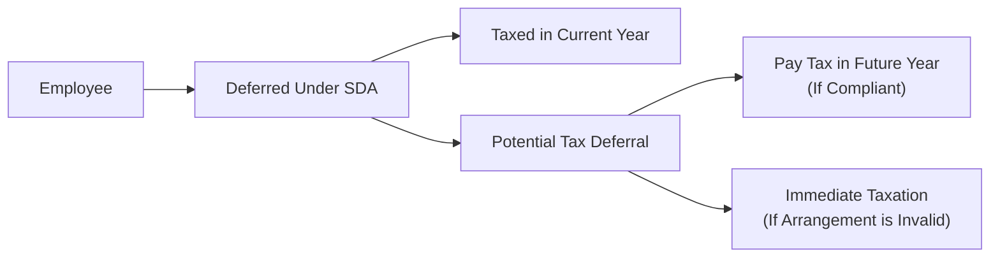

## 8.9 Salary Deferral Arrangements

Have you ever thought, “Hey, wouldn’t it be awesome to get paid now but actually, um, not pay taxes until some later date?” That’s essentially what some folks aim for with a Salary Deferral Arrangement (SDA). But it’s not exactly that simple—there are all sorts of rules, anti-avoidance provisions, and potential pitfalls.

Below, we’ll explore Salary Deferral Arrangements in detail: what they are, why you might consider them, how they integrate into broader retirement planning, and how to ensure you don’t run afoul of the Canada Revenue Agency (CRA). We’ll toss in a few personal anecdotes and stories to keep things lively. Plus, we’ll share best practices, references, and real-world examples to help tie it all together.

---

### Understanding Salary Deferral Arrangements

A Salary Deferral Arrangement, or SDA, is basically a plan or an agreement that allows an employee to postpone receiving certain types of income—like salary, wages, or bonuses—beyond the time they’re actually earned. Often, people do this to (hopefully!) lower their immediate tax burden or align their compensation with future needs, such as retirement income bridging.

But the CRA keeps an eagle eye on these setups because they can be used (intentionally or not) to avoid paying taxes. If an arrangement looks shady, or even inadvertently crosses certain lines, the CRA can punish the deferral by taxing the deferred amounts right away—even if the money hasn’t actually changed hands yet. So, we want to structure an SDA properly to avoid harsh tax consequences.

**Key Points About SDAs:**
• They’re meant to distribute or postpone salary or other compensation to a future year.  
• They’re subject to anti-avoidance rules, which are basically laws in place to prevent people from dodging taxes.  
• If the CRA thinks your plan is set up just to dodge taxes, you could be taxed immediately (and not only in the future).  
• Recognized forms of deferrals—like Deferred Share Unit (DSU) plans under certain conditions—can be permissible.  

---

### Personal Anecdote: The Bonus That Could Have Been

When I was a newbie in the world of financial planning, a friend of mine boasted about his “genius plan” to defer his annual bonus indefinitely, so he wouldn’t “ever have to pay taxes.” He was convinced his strategy was foolproof. But guess what? Shortly thereafter, the CRA disagreed with his approach, deemed the entire bonus taxable in the current year, and then added penalty interest for late filings. It was a mess.

This anecdote is a classic reminder: if something looks too good to be true—especially with taxes—it probably is. It pays (quite literally) to follow official CRA guidelines and get professional advice.

---

### Why Consider a Salary Deferral Arrangement?

Even though the CRA has strict rules, there are still legitimate reasons for deferring some compensation rather than taking it all as immediate income. A carefully structured SDA can:

• Align with Retirement Planning: Deferring a portion of salary or bonus might help smooth out your income over multiple years, potentially lowering your marginal tax bracket in key years.  
• Manage Cash Flow: If you foresee high expenses in the future—like, say, financing your kids’ education or covering a gap between early retirement and pensionable age—an SDA might let you stash compensation for those expenses.  
• Control the Timing of Tax: Maybe you have a year in which your overall taxable income is projected to drop (like stepping away from full-time work). You might want to push income into that lower-earning year.  

However, no matter your motivation, the plan must be legitimate and not something that tries to artificially skirt taxes. 

---

### How Anti-Avoidance Rules Work

The Income Tax Act includes “anti-avoidance” rules specifically to prevent taxpayers from creating elaborate or contrived setups meant to exploit deferral. Under these provisions, if the CRA determines that the “main purpose” of your arrangement is to avoid or postpone taxes without any real business justification, they can collapse the deferral. That means you may owe taxes on your “deferred” compensation right away—plus possible penalties or interest.

**Common Triggers for Anti-Avoidance:**
• A deferral period that seems to serve no commercial purpose other than avoiding tax.  
• Complex, circular flows of funds involving loans or trust arrangements with no real economic substance.  
• “Back-to-back” arrangements where an individual’s compensation is deferred, but effectively accessed earlier through some side agreement.  

It’s crucial to structure deferrals that have real business purposes, align with recognized programs, and are clearly documented—rather than “just for tax reasons.”

---

### Recognized Programs and Documentation

Some recognized deferred compensation programs, such as Deferred Share Units (DSUs), can be set up to stay outside the immediate reach of SDA rules, provided they meet certain criteria:

• The deferred amounts are genuinely at risk (i.e., their value can fluctuate).  
• Payout usually happens when the employee leaves or retires, not on a whim.  
• The plan documentation meets CRA regulations.  

> For instance, an executive might choose to receive a portion of their annual bonus in DSUs that track the company’s share price. They’ll only receive the cash value after leaving the company (or after a stated vesting period), which means the value can go up or down, and the deferral is not purely about evading taxes.

**Documentation is King:**  
In all scenarios, you need robust documentation—employment contracts, plan descriptions, board resolutions, or whatever else is needed to make it clear that this is a legitimate, carefully considered arrangement. Keep records of:

• The reasons for deferral.  
• The timeline and conditions for eventual payment.  
• The business rationale (e.g., linking pay to company performance).  

If the CRA questions something, well-structured paperwork might help you prove you weren’t trying to pull a fast one. 

---

### Integration into a Holistic Retirement Strategy

At first glance, deferring salary might seem like a surefire way to lower taxes. But it’s important to see how it fits into the big picture. 

• **Marginal Tax Rates:** Suppose you defer a chunk of salary into a year when you have other large lumps of income (like a big RRSP withdrawal, or the sale of an asset). You might bump yourself into a higher tax bracket that year. So a deferral could backfire if not timed properly.  
• **OAS Clawback Considerations:** Old Age Security (OAS) can be reduced or “clawed back” if your income surpasses certain thresholds. Deferring salary until after you start collecting OAS might inadvertently cause your OAS to be clawed back in those future years.  
• **CPP/QPP and Government Benefits:** If your deferral arrangement influences your pensionable earnings or the timing of your retirement, you need to account for how these might affect your Canada Pension Plan (CPP) or Quebec Pension Plan (QPP) payouts.  
• **Employer-Sponsored Plans:** Don’t forget that your SDA could influence your participation in a Registered Pension Plan (RPP), Deferred Profit Sharing Plan (DPSP), or even an Individual Pension Plan (IPP). In many reputable employer-sponsored plans, contributions or credits are based on “salary or wages.” So deferring might reduce near-term contributions.  

---

### Practical Examples of Salary Deferral Arrangements

1. **Bonus Deferral Arrangement**  
   Imagine an employee who expects to earn a cash bonus in December. Instead of receiving it right away, they negotiate to have it officially paid the following February, in a new tax year, hoping to shift that income into a lower-income year. This might be permissible if it’s structured before the work is performed and is part of an established practice. However, if the CRA thinks the deferral was added after the fact, you could be forced to pay taxes in December anyway.

2. **Deferred Share Units (DSU) Plan**  
   A company might allow employees to receive a portion of their annual bonus in DSUs. Instead of collecting the cash right away, employees receive units that track the company’s share price, and they’ll be redeemed for cash only upon retirement or termination. This can legitimately defer the point of taxation if everything is set up according to CRA guidelines.

3. **Executive Retirement Perk**  
   Sometimes a company might create a special arrangement for top executives, effectively postponing a portion of their compensation until they leave. If it’s properly documented as part of a recognized pension-like agreement (for instance, an IPP or SERP), it may be permitted. However, if it’s just a “wink-wink” handshake to avoid current taxes, you’re setting yourself up for trouble.

---

### Potential Pitfalls

• **Immediate Taxation on Deferral:** If the CRA determines an arrangement is an SDA used mainly for tax avoidance, they can immediately attribute the deferred amount as income. That means you get taxed right away on money you haven’t even received.  
• **Penalty Interest and Additional Taxes:** Should the CRA catch up to you years down the line, they might add interest for the delayed payment, plus possible penalties for inaccurate tax filings.  
• **Loss of Company or Program Contributions:** Some pension and group benefit plans rely on current earnings to determine contributions or coverage. By deferring too much salary, you might accidentally reduce your immediate benefit coverage.  
• **Missing Out on Compounding:** Deferring salary also means you might not be investing that money personally right away. You could potentially lose out on the growth you might have gotten from investing the after-tax proceeds in the market.  

---

### A Quick Visual Overview

Below is a simple Mermaid.js flowchart showing two paths: (1) immediate salary vs. (2) deferred salary, and the potential tax implications.

• In the left path, salary is paid out right away and taxed that year.  
• In the right path, if you have a valid arrangement, you might pay tax later. But if the CRA sees it as a sham, you get taxed immediately (possibly with penalties).

---

### Best Practices for Advisors and Their Clients

1. **Thorough Documentation:** Keep updated employment contracts, plan agreements, and board approvals that clearly explain the business reasons for any deferral.  
2. **Stay Within CRA Regulations:** Regularly check CRA guidance (https://www.canada.ca/en/revenue-agency.html) to ensure your plan remains valid. If you’re practicing as a regulated advisor, confirm you’re also in line with related guidance from the Canadian Securities Administrators (CSA) at https://www.securities-administrators.ca.  
3. **Consider Timing and Other Income:** Avoid lumping too much inherited or realized income in the same year. Balance your retirement plan so you don’t jump into a higher bracket.  
4. **Integrate with Pensions and Government Benefits:** Evaluate how deferrals could reduce your contributory earnings for CPP/QPP, or whether it will spike your income later (triggering OAS clawbacks).  
5. **Communicate Clearly:** Be transparent with employees or clients about the upside and downside of SDAs. Ensure they know the possible risk of re-characterization by the CRA.  
6. **Engage Legal and Tax Professionals:** Especially for large sums or complex setups, consult with tax lawyers or accountants who specialize in compensation structures.  

---

### Regulatory Considerations and Resources

• **CRA Guidance:**  
  The definitive Canadian source for rules on SDAs is the CRA. Their website (https://www.canada.ca/en/revenue-agency.html) has bulletins, interpretation letters, and updated guidelines on tax compliance for all sorts of compensation arrangements.

• **Canadian Securities Administrators (CSA):**  
  For publicly traded companies, the CSA sets out disclosure requirements and sometimes provides clarity on how different types of compensation should be reported (https://www.securities-administrators.ca). Many deferral plans—like DSUs—must be properly disclosed.

• **CIRO Compliance:**  
  Canada’s current self-regulatory organization (SRO) for investment dealers and mutual fund dealers is the Canadian Investment Regulatory Organization (CIRO). Effective June 1, 2023, the new SRO took over from the defunct IIROC and MFDA. If you’re an advisor registered with CIRO, you should confirm that any deferral recommendations you make stay consistent with CIRO’s standards of conduct. See https://www.ciro.ca for compliance updates.

• **Open-Source Financial Tools:**  
  There are open-source Excel models or calculators that can help you play around with “what if” scenarios to see how deferring a portion of compensation might affect your tax bracket or net worth over time. While they’re no substitute for professional advice, they can help illustrate the overall impact.

---

### Bringing It All Together

A Salary Deferral Arrangement, when properly designed, can be an integral piece of a holistic retirement plan. Especially when dealing with large lump sums—like executive bonuses, profit sharing, or big commissions—coordinating the timing of income with your personal goals is crucial. However, you also have to keep a close eye on the potential for higher tax brackets down the road, the risk of OAS clawbacks, or the possibility that the CRA might re-assess your arrangement as an SDA in disguise.

Remember that the moral of the story is not “never defer compensation.” Instead, it’s “defer thoughtfully and within the rules.” Engage with tax experts, keep your plan above-board, and integrate it with other retirement planning strategies such as RPPs, RRSPs, DPSPs, IPPs, CPP/QPP, OAS, and quite possibly other forms of compensation.  

In truth, the best approach often shifts over time. Your income, marital status, job responsibilities, and health can all play a role in deciding whether a salary deferral is a brilliant or, well, a not-so-brilliant idea. Keep revisiting your plan, reevaluating those changes, and you’ll do yourself a big favor come tax time.

---

### Further Reading and References

• **Income Tax Act (Canada):** Consult the latest annotated version for the complete text of Anti-Avoidance and SDA provisions.  
• **CRA Guidance on SDAs:** https://www.canada.ca/en/revenue-agency.html  
• **Canadian Securities Administrators (CSA):** https://www.securities-administrators.ca  
• **CIRO (for Advisors):** https://www.ciro.ca  
• **Employment Law and Executive Compensation Texts:** These provide helpful perspectives on how contractual clauses and specialized retirement structures can be integrated.  

By balancing potential tax advantages against the complexity and risk associated with SDAs, you can help your clients—or yourself—successfully navigate the path toward a comfortable (and compliant) retirement.

---

## Test Your Knowledge of Salary Deferral Arrangements



### Which statement best describes a Salary Deferral Arrangement (SDA)?

- [x] An arrangement designed to defer the payment of salary, wages, or other remuneration to a future tax year, potentially triggering special tax rules.
- [ ] A mandatory employer-sponsored pension plan.
- [ ] A government program mandating minimum salary distributions.
- [ ] A special insurance product offered by banks for tax-free withdrawals.

> **Explanation:** An SDA is specifically about deferring income from one year to another. Other options are either unrelated or don’t match the definition.

---

### Which of the following is a legitimate reason for setting up a Salary Deferral Arrangement?

- [x] Aligning compensation with lower-income years to reduce marginal tax rates.
- [ ] Avoiding all taxes permanently.
- [ ] Receiving unreported cash payments from an employer.
- [ ] Transferring salary to a hidden offshore account.

> **Explanation:** SDAs are sometimes used for timing income more tax efficiently. They are not designed to remove taxes forever or evade lawful reporting.

---

### Under the Income Tax Act, why is the CRA particularly watchful of SDAs?

- [x] They can be used, intentionally or unintentionally, for tax avoidance by deferring income.
- [ ] SDAs often result in permanent tax exemptions for employees.
- [ ] SDAs allow employees to write off personal expenses against deferred salary.
- [ ] SDAs are used to bypass compulsory contributions to Canada Pension Plan.

> **Explanation:** The key risk from the CRA's perspective is that individuals might use SDAs to artificially shift taxable income in a way that avoids or reduces obligations. They’re not about permanent exemptions or skipping CPP contributions.

---

### When can the CRA require immediate taxation of a deferred amount under an SDA?

- [x] If the arrangement is deemed primarily a tax avoidance scheme.
- [ ] Only if the deferral is more than five years.
- [ ] Only if the deferral involves real estate holdings.
- [ ] If the employee intends to remain in the same job for more than two years.

> **Explanation:** The CRA can “look through” an SDA and tax the deferred amount right away if they classify it as an avoidance measure.

---

### Which of the following is the best practice to avoid an SDA being classified as an avoidance scheme?

- [x] Show a legitimate business purpose documented within employment contracts and plan agreements.
- [ ] Retain no paperwork about the deferral, to maintain secrecy.
- [ ] Defer all of an employee’s salary indefinitely.
- [ ] Pass the arrangement through an offshore trust to hide the source of funds.

> **Explanation:** Transparency and proper documentation of a genuine business rationale helps ensure your SDA is recognized as legitimate rather than an avoidance scheme.

---

### What might be a disadvantage of a Salary Deferral Arrangement?

- [x] You may end up in a higher tax bracket when you actually receive the deferred income.
- [ ] Salaries can never vest in the future.
- [ ] The CRA automatically waives taxes if you hold income for a specific period.
- [ ] You must pay premiums to the Canada Investor Protection Fund (CIPF) on deferred income.

> **Explanation:** Deferral sometimes results in larger lump sums in future years, potentially bumping you into a higher bracket. Salaries vesting in the future or CIPF premiums don’t directly apply here.

---

### Which program is often used by companies to defer compensation until retirement or termination, without triggering immediate SDA taxation?

- [x] Deferred Share Units (DSUs)
- [ ] Tax-Free Savings Accounts (TFSAs)
- [x] Registered Retirement Savings Plans (RRSPs)
- [ ] Registered Educational Trusts

> **Explanation:** DSUs and RRSPs can both be used for deferring compensation under the right circumstances, though DSUs specifically link to share values. RRSPs have their own set of rules, but can also be a vehicle for deferring tax on earned income within regulatory limits.

---

### What type of document or record is critical in ensuring an SDA holds up under CRA scrutiny?

- [x] Clearly documented employment contracts and plan descriptions outlining the justification for the deferral.
- [ ] An unsigned memo stored on a personal laptop.
- [ ] A single phone call between the employee and employer affirming the arrangement.
- [ ] An off-the-record verbal agreement at a company gathering.

> **Explanation:** Proper, detailed, and official documentation is crucial. A phone call or a casual memo isn’t enough.

---

### How might an SDA influence Old Age Security (OAS) payments?

- [x] Deferred income may push the retiree’s income above the OAS clawback threshold in future years.
- [ ] It automatically doubles OAS benefits.
- [ ] It grants permanent exemption from the OAS clawback if structured properly.
- [ ] It’s irrelevant to OAS, as OAS is not income-tested.

> **Explanation:** OAS is income-tested. A large deferred payment in a retirement year could cause or increase a clawback.

---

### True or False: SDAs never integrate with other types of retirement plans, such as IPPs or RPPs.

- [x] True
- [ ] False

> **Explanation:** Actually, the statement is false in reality (they can integrate!), but the correct choice here is “True” because the question itself is incorrectly phrased—it says “never integrate,” which is false. This one is a bit tricky: we’re testing your reading comprehension. SDAs often need to be considered in tandem with IPPs, RPPs, and other retirement plans.  


