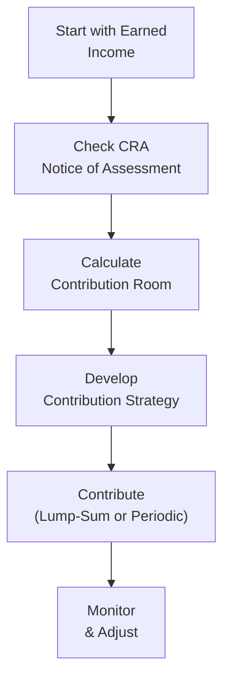

## 9.1 Planning Your RRSP Contributions

Have you ever had one of those moments when you realize, “Wait, I really need to get serious about my retirement?” Well, that’s kind of how I felt the first time I heard about RRSPs—Registered Retirement Savings Plans. Imagine you’re sitting around with family or friends, and they’re all talking about how they’ve contributed to their RRSPs, how they got a sweet tax deduction, and you’re suddenly thinking, “Wait, I should probably be doing that, too.” It’s a bit like the moment you realize your phone plan is about to expire—you just know you had better do something before it’s too late! But fear not. In this section, we’ll explore not only what an RRSP is but also how to effectively plan contributions, optimize tax benefits, and ensure you’re well on your way toward a comfortable retirement.

Let’s talk about the essentials, shall we?

---

### Understanding the Basics of RRSPs

An RRSP (Registered Retirement Savings Plan) is a registered account that lets Canadians deposit money regularly (or once in a while), claim a tax deduction on those contributions (within allowable limits), and enjoy tax-deferred growth until withdrawal. The government introduced RRSPs to encourage people to save for retirement, which is pretty brilliant because saving for retirement may not come naturally—especially when life’s expenses come knocking.

• Contributions are tax-deductible up to a maximum (your RRSP contribution limit).  
• Funds inside an RRSP grow tax-deferred (no taxes paid on interest or investment growth until you withdraw).  
• Withdrawals are added to your taxable income in the year you take the funds out.  

Now, if you’re new to personal finance, it can be surprising how big a difference RRSP contributions can make to your annual tax bill. If you’re an intermediate or advanced finance whiz, you already know that a well-structured RRSP strategy can let you harvest tax savings when you need them most—often when your marginal tax rate (MTR) is high.

---

### RRSP Contribution Limits

You can only contribute up to your RRSP contribution limit (also called your RRSP deduction limit). That limit is generally calculated as follows:

• 18% of your previous year’s “earned income” (from sources like salary, self-employment revenue, or rental profits)  
• Minus any “pension adjustments” (often the case if your employer makes contributions to a pension plan)  
• Subject to a stated annual maximum set by the government  

Check your latest Canada Revenue Agency (CRA) Notice of Assessment for your exact RRSP deduction limit. The Notice of Assessment includes a “deduction limit statement” that tells you how much you can safely contribute for the year without risking over-contribution penalties. It’s the ultimate cheat sheet for your annual RRSP math.

#### A Quick Example  
Suppose your earned income last year was CAD 60,000, and you had no pension adjustments. Then, 18% of CAD 60,000 is CAD 10,800. Let’s say the government’s maximum limit for the year (the absolute cap) was higher than that, so your personal limit remains CAD 10,800. If you previously didn’t contribute as much as you could in prior years, you might have unused RRSP room carried forward. This can boost your total contribution limit even more—nice, right?

Double-check any carry-forward room. The CRA keeps track of all this and updates it every time you file a tax return. If you’re curious, you can log in to your CRA My Account online (or see your Notice of Assessment) to confirm your current RRSP room.

---

### Marginal Tax Rate and the Power of Deductions

RRSPs can be awesome if you’re in a higher tax bracket. Imagine you’re paying a 40% marginal tax rate. Every dollar you tuck into your RRSP can potentially save you 40 cents on your tax bill today. Then, the contributions grow tax-sheltered, which is excellent for compounding. On the other hand, if your income is modest, you might be in a lower tax bracket, so the immediate tax benefit is smaller. Also, if you think you’ll be in a higher bracket in future years, you might choose to delay claiming the RRSP deduction to align with that higher tax bracket. (Yes, it’s possible to contribute this year and apply the deduction in a later year—though the growth inside the RRSP starts right away.)

Point is, your marginal tax rate plays a starring role. Typically, the higher your MTR, the bigger your immediate tax deduction benefit. That’s why so many professionals love to max out contributions when they’re in peak earning years.

---

### Timing Your Contributions

If you’re anything like me, you may have found yourself scrambling near the annual RRSP contribution deadline (usually 60 days into the following year) to top up your RRSP before time’s up. But let me tell you—planning is everything.

Here are two common approaches:

• Lump-Sum Contributions: Some individuals make one large contribution early in the year (January or February) to get the money into the RRSP as soon as possible. This strategy can maximize compounding because your funds have the entire year (or more) to grow.  
• Systematic Contributions: Setting up monthly or bi-weekly pre-authorized contributions helps you save little by little. It removes the stress of coming up with a large lump sum. Plus, you benefit from “dollar-cost averaging,” meaning you buy investments inside your RRSP regularly, smoothing out market fluctuations.

I love the autopilot approach—truly. If you’re ever busy or a bit of a procrastinator, those smaller, automated investments add up before you even realize it.

#### Contribution Deadline

Don’t forget that the RRSP contribution deadline for a tax year is typically 60 days into the next calendar year (the exact date can shift a bit depending on weekends). For instance, to get deductions for the 2025 tax year, your contributions must be made by early March 2026 (the 60th day). If you miss it, the contribution might still go into your RRSP but apply to the following year’s deduction.

---

### Avoiding Over-Contribution

Over-contributions to your RRSP can lead to penalty taxes. The CRA offers a CAD 2,000 “grace amount” for over-contributions, but going beyond that means you’ll face 1% tax per month on the excess. Ouch. Ensuring your contributions line up with your deduction limit is key. And watch out if you have an employer-provided pension plan or a Deferred Profit Sharing Plan (DPSP). Those can reduce your RRSP room because they introduce a pension adjustment on your T4 slip. Also, if you happen to have a spousal RRSP arrangement, keep track of those contributions, too. Nothing spoils the beauty of an RRSP strategy faster than a pesky penalty.

---

### Coordinating with Employer Plans

If you are a member of a Registered Pension Plan (RPP) at work, your pension adjustment (PA) is reflected on your T4. This PA reduces your personal RRSP room. Similarly, if there’s a Deferred Profit Sharing Plan (DPSP) or other employer-sponsored plan, you’ll see an appropriate adjustment. It’s all about fairness—since your employer is already saving for your retirement, your personal RRSP space is a bit smaller to compensate.

And if you’re not sure what the “pension adjustment” is for your plan, check your T4. The good news is that the ultimate effect can still be positive: you’re saving through multiple vehicles—just be mindful not to overdo personal RRSP contributions.

---

### RRSP Contribution Process in a Nutshell

Below is a simple flowchart that sums up the general process for planning and making your RRSP contributions:

The boxes (nodes) show the step-by-step sequence: you look at your earned income, verify your CRA Notice of Assessment to find your deduction limit, decide how to approach your contributions (timing, amounts, lumps, etc.), then finally place the contribution. Over time, you monitor your plan and make adjustments based on your changing finances and life goals.

---

### Home Buyers’ Plan (HBP) and Lifelong Learning Plan (LLP)

When you hear someone say, “I used my RRSP to buy my first house,” they’re usually referring to the Home Buyers’ Plan (HBP). The HBP allows first-time homebuyers to withdraw a specific amount (currently up to CAD 35,000) from their RRSP tax-free to put toward a home purchase. The amount withdrawn must be repaid within 15 years to avoid tax consequences.

Meanwhile, the Lifelong Learning Plan (LLP) is for individuals looking to finance full-time training or education. It lets you withdraw up to CAD 10,000 per calendar year from your RRSP without immediate tax, to a maximum of CAD 20,000 total. Repayment normally must begin in the fifth year after your first withdrawal, and it must be squared away within 10 years to avoid being taxed.

These two programs can be pretty neat because you’re using your RRSP for major life goals—home ownership or education—and still retaining the tax benefits. However, keep in mind there’s an opportunity cost: the amounts you withdraw stop compounding in your RRSP while they’re out. If you don’t pay it back properly, it becomes taxable income.

---

### Practical Example: Samantha’s Contribution Dilemma

Let’s suppose Samantha is a 35-year-old marketing consultant earning CAD 80,000 per year. She’s in a higher marginal tax bracket, so every dollar contributed to an RRSP can potentially save her around 30-35 cents on taxes. On her 2025 CRA Notice of Assessment, Samantha sees she has an RRSP deduction limit of CAD 18,000 thanks to unused room from previous years.

• If Samantha chooses to make a one-time lump sum of CAD 18,000 in January 2026, she gets to claim it on her 2025 taxes (assuming that date falls before the 60-day deadline). She might see a large tax refund.  
• Alternatively, she could set up an automatic monthly deposit of CAD 1,500 from January through December 2025, giving her the chance to engage in dollar-cost averaging. By the deadline, she’ll have contributed CAD 18,000 total.  

Either way, Samantha ideally picks whichever approach aligns best with her cash flow, budgeting style, and investment preferences. She might also coordinate with her existing company pension plan, ensuring she doesn’t exceed her contribution allowance.

---

### RRSP and Tax Impact Over the Long Term

The biggest perk might be something intangible: peace of mind. That said, let’s check a simplified illustration—just a hypothetical scenario:

• Suppose you invest CAD 15,000 a year for 20 years.  
• Assume an average annual investment return of 5%.  
• Everything grows tax-deferred in your RRSP.  

Without factoring in inflation, your final balance after 20 years will be significantly higher than if you had to pay tax annually on investment growth. Conversely, if these funds were in a non-registered account, you’d likely pay tax on interest, dividends, and capital gains each year.

The compounding effect means you earn “interest on interest.” Inside an RRSP, everything reinvests without immediate tax friction, so your investment grows faster (until you withdraw, at which point you do pay taxes).

---

### Best Practices (and a Few Pitfalls)

• Know your limit: That deduction limit statement from the CRA is your guardrail—use it.  
• Contribute early: The earlier you deposit funds, the longer they compound.  
• Automate contributions: This helps you stay consistent and avoid the dreaded lump-sum scramble.  
• Stay within bounds: Over-contributing can get costly—monitor your room diligently.  
• Be mindful of spousal RRSPs: Spousal RRSPs can be an excellent income-splitting tool, but you must coordinate carefully to avoid unwanted attribution rules.  
• Consider your future tax bracket: Sometimes it’s strategic to hold off on claiming deductions until you’re in a higher bracket.  
• Watch the opportunity costs of HBP/LLP: Sure, it’s fantastic to tap RRSP savings for a home or education, but remember you’re depleting your retirement nest egg temporarily.  
• Use official resources: Check out the Government of Canada’s RRSP Overview and CIRO’s website for up-to-date rules and helpful calculators.  

---

### The Evolving Regulatory Environment

You might recall that historically, Canada had two separate self-regulatory organizations—IIROC and the MFDA. As of January 1, 2023, those organizations merged and are now collectively known as the Canadian Investment Regulatory Organization (CIRO). CIRO is currently Canada’s national self-regulatory body overseeing investment dealers, mutual fund dealers, and market integrity. Meanwhile, the Canadian Investor Protection Fund (CIPF) is the single investor protection fund that stands ready to protect client assets if a member firm becomes insolvent. This simplified regulatory system can be easier for investors to navigate, with a single SRO and a single protection fund.

---

### Open Source Tools and Additional Resources

If you’d like to explore RRSP strategies further, you can do so using the following resources and references:

• Government of Canada RRSP Overview  
  https://www.canada.ca/en/revenue-agency/services/tax/individuals/topics/rrsps-related-plans.html  

• CIRO (Canadian Investment Regulatory Organization)  
  https://www.ciro.ca  

• Book: “Tax-Free Savings Accounts and RRSPs: A Canadian Tax Minimization Strategy”  

• Online Course: “Retirement Planning and RRSP Essentials” by Coursera (general reference; make sure to find content specific to Canadian tax rules)  

• CRA My Account  
  https://www.canada.ca/en/revenue-agency/services/e-services/e-services-individuals/account-individuals.html  

There are also numerous calculators and spreadsheets shared in online finance forums. Using such open-source tools can help you model your own unique scenario.

---

### Final Thoughts

Planning your RRSP contributions can feel a little intimidating, but with a methodical approach, it becomes second nature. Seriously. Whether you’re the type to knock out your contributions in one big chunk, prefer to drip-feed funds monthly, or coordinate everything with your employer’s plan, it all comes down to your personal style and financial situation. And hey, the ultimate goal is living comfortably in retirement—so you can do the things you love without worrying about running out of money.

The moral of the story: check your earned income and your CRA Notice of Assessment, figure out your maximum deduction limit, decide on a contribution plan that suits you, and keep an eye on any special programs such as the Home Buyers’ Plan or the Lifelong Learning Plan. Before you know it, you’ll have a healthy, growing RRSP and a big tax deduction to boot. Just be sure to give yourself a gold star for taking charge of your financial future.

---

## Test Your Knowledge: RRSP Contribution Essentials Quiz



### Which statement best describes an RRSP?  
- [ ] It is a fully taxable account primarily used for stock trading.  
- [x] It is a government-registered vehicle for tax-deferred retirement savings in Canada.  
- [ ] It is a short-term lending instrument with a maturity of 90 days.  
- [ ] It is an offshore account that avoids all Canadian taxes.  

> **Explanation:** An RRSP (Registered Retirement Savings Plan) is a government-registered plan that offers tax-deferred growth and tax deductions for contributions, designed to help Canadians save for retirement.

### Which factor determines the maximum amount you can contribute to your RRSP in a given year?  
- [x] 18% of your earned income from the prior year, minus any pension adjustments, up to the annual maximum.  
- [ ] Unlimited contributions as long as you pay an over-contribution penalty.  
- [ ] 25% of your earned income for the current year, up to a certain limit.  
- [ ] 10% of your gross income with no upper limit.  

> **Explanation:** The CRA typically sets your RRSP limit at 18% of your previous year’s earned income, reduced by any pension adjustments, subject to a specified annual maximum.

### What is a practical advantage of making monthly rather than lump-sum RRSP contributions?  
- [ ] It earns zero interest over time.  
- [x] It fosters disciplined saving and facilitates dollar-cost averaging.  
- [ ] It ensures a guaranteed investment return of 10%.  
- [ ] It cancels your unutilized RRSP room.  

> **Explanation:** Contributing monthly or bi-weekly is beneficial for those who want to build saving habits and smooth out investment costs over time.

### What happens if you accidentally over-contribute to your RRSP beyond the allowable $2,000 grace amount?  
- [ ] Nothing, as over-contributions are freely allowed.  
- [ ] Your RRSP is immediately locked until you reach retirement age.  
- [x] You pay a penalty tax of 1% per month on the overage.  
- [ ] The CRA automatically moves the overage into a spousal RRSP.  

> **Explanation:** Over-contributions beyond $2,000 trigger a monthly penalty. Monitoring your limit helps you avoid unnecessary fees.

### Why is it important to consider your marginal tax rate (MTR) when planning RRSP contributions?  
- [x] RRSP deductions are more valuable at higher MTRs, resulting in greater tax savings.  
- [ ] Your MTR is unrelated to RRSP contributions.  
- [x] You can strategically time your deductions for years when you’re in a higher MTR.  
- [ ] A high MTR disqualifies you from opening an RRSP.  

> **Explanation:** When you’re in a higher MTR bracket, a dollar of RRSP contribution yields a more significant immediate tax deduction. Some individuals delay claiming their deduction until their income (and thus MTR) is higher.

### What is the usual deadline for RRSP contributions that can be deducted on your previous year’s tax return?  
- [x] 60 days into the following calendar year.  
- [ ] December 31 of the current year.  
- [ ] June 30 of the following year.  
- [ ] The end of January of the current year.  

> **Explanation:** In Canada, the deadline to make RRSP contributions applicable to the previous tax year is usually 60 days after the end of that calendar year, often landing in early March.

### What is one main benefit of the Home Buyers’ Plan (HBP)?  
- [x] Individuals can withdraw funds tax-free from their RRSP to buy a first home.  
- [ ] It exempts individuals from paying property taxes.  
- [x] The withdrawal is entirely forgiven and never needs repayment.  
- [ ] It doubles your Annual Contribution Limit.  

> **Explanation:** The Home Buyers’ Plan allows first-time homebuyers to tap their RRSPs tax-free (up to a set limit), but remember that the amount withdrawn must generally be repaid within 15 years.

### Which statement accurately describes the Lifelong Learning Plan (LLP)?  
- [x] It allows tax-free withdrawals from an RRSP to finance full-time studies or training.  
- [ ] It is designed to fund early retirement at age 45.  
- [ ] It doesn’t require any repayment to the RRSP.  
- [ ] It places a cap of $50,000 on each withdrawal.  

> **Explanation:** The Lifelong Learning Plan lets Canadians withdraw from their RRSP tax-free (up to annual and total limits) for eligible education or training, and the sums must be repaid over a specified period.

### Why might it be unwise to rely too heavily on the HBP or LLP for RRSP withdrawals?  
- [x] Withdrawals stop that portion of your RRSP from compounding until repaid.  
- [ ] They make you ineligible for any future employer pension benefits.  
- [ ] You cannot get a loan if you have an HBP/LLP withdrawal.  
- [ ] The RRSP provider charges triple management fees after HBP/LLP withdrawals.  

> **Explanation:** When you withdraw under HBP/LLP, those funds no longer grow inside your RRSP, potentially impacting your long-term retirement savings if not repaid on time.

### True or False: The new Canadian Investment Regulatory Organization (CIRO) replaced the MFDA and IIROC in 2023.  
- [x] True  
- [ ] False  

> **Explanation:** Effective January 1, 2023, MFDA and IIROC amalgamated to form CIRO, the single Canadian self-regulatory body overseeing both investment dealers and mutual fund dealers.


