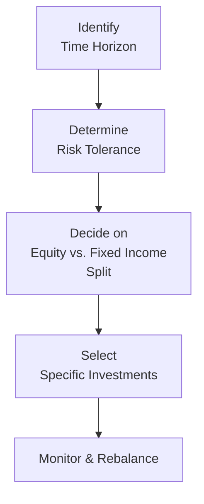

## 9.2 Selecting the Right Investments for Your RRSP

Selecting the right mix of investments for your RRSP can feel both intimidating and exciting. After all, you’re effectively building your financial future, ensuring that you have enough money set aside to enjoy a comfortable retirement. And honestly, who wouldn’t want to retire with a sense of security (and maybe a bit of extra “fun money” to chase those dreams)? Whether you’re a seasoned investor or brand new to the Canadian retirement planning world, this section guides you through setting up a long-term strategy that aligns with your personal goals, time horizon, and risk tolerance.

Below, we’ll explore several key considerations for RRSP investment selection and offer practical examples, personal anecdotes, and references to official Canadian resources that can help you along the way.

---

## The RRSP Environment in Canada

A Registered Retirement Savings Plan (RRSP) is a government-registered account that allows eligible Canadians to save for retirement in a tax-advantaged way. Contributions to an RRSP can be deducted from your taxable income, and investment growth inside the account is tax-deferred until withdrawal. Because of this tax deferral, you essentially benefit from “borrowing” some of the government’s money to grow your investments faster—provided you stick to the plan and keep your RRSP accumulation intact until you retire.

When it comes to oversight, the Canadian Investment Regulatory Organization (CIRO) is now the authoritative self-regulatory body for investment dealers and mutual fund dealers in Canada. If you’re seeking further guidance on investor protection measures, deposit insurance, or complaint processes, be sure to visit CIRO’s official resources at https://www.ciro.ca.

Another key protection pillar for Canadians is the Canadian Investor Protection Fund (CIPF), which provides coverage for eligible client accounts if a CIRO member firm becomes insolvent. CIPF is independent of CIRO and replaced previous protections by the MFDA IPC and the legacy CIPF for IIROC. While CIPF won’t protect you from market volatility, it provides coverage if your investment dealer fails.

---

## Why the Right Investments Matter

Selecting the right investments in an RRSP isn’t just about chasing the hottest stock or the top-performing mutual fund. It’s about creating a portfolio that meets your personal objectives, risk tolerance, time horizon, and desired lifestyle in retirement. Here are some questions you might ask yourself:

• How many years remain until I plan to retire (my time horizon)?  
• How comfortable am I with market fluctuations (my risk tolerance)?  
• Do I need easy access to my money before retirement (my liquidity needs)?  
• Do I prefer a hands-on or hands-off investment approach?

Answering these questions helps you build a personalized roadmap that guides which assets fit best in your RRSP.

---

## Diversification and Risk Tolerance

Think of your RRSP like a fruit basket: if you only fill it with apples, you miss the vitamins (and taste) that come from bananas, oranges, or berries. In investing terms, diversification is the practice of spreading your money across various asset classes—such as equities, fixed-income, cash, and alternative investments—so that no single event can wipe out your entire retirement nest egg.

• Asset Allocation: This involves splitting your portfolio among different categories, usually between equities (stocks or equity funds), fixed-income (bonds or bond funds), and cash or equivalent instruments (GICs, money market funds).  
• Building Around Risk: If you’re younger with a longer timeline, you might lean into equities for growth. If you’re closer to retirement, you might hold more safe-haven assets like government bonds and GICs to preserve capital.  

### A Quick Visual on Asset Allocation

Below is a simple Mermaid.js diagram to illustrate an overview of how decisions around asset allocation often flow, depending on time horizon and risk tolerance:

• A["Identify Time Horizon"] = Figure out how long until retirement and other relevant life events.  
• B["Determine Risk Tolerance"] = Gauge how comfortable you are with market fluctuations.  
• C["Decide on Equity vs. Fixed Income Split"] = The core step in asset allocation.  
• D["Select Specific Investments"] = Choose mutual funds, ETFs, stocks, bonds, or GICs.  
• E["Monitor & Rebalance"] = Review your portfolio regularly.

---

## Core Investment Options for Your RRSP

Your RRSP can house a variety of investment vehicles, from very safe interest-bearing instruments like Guaranteed Investment Certificates (GICs) to growth-oriented assets like equities or equity-based ETFs. Here are some core options:

### Guaranteed Investment Certificates (GICs)
GICs offer a guaranteed rate of return over a specified term, usually ranging from a few months to several years. They offer stability and predictability, which can be a good fit for risk-averse or near-retirement investors. However, check the interest rate carefully; if it’s too low, inflation may slowly erode your returns in real terms.

### Bonds and Bond Funds
Bonds are fixed-income securities issued by governments or corporations to raise capital. They pay interest (the “coupon”) and repay the principal at maturity. For those looking for a bit more yield than GICs while still keeping risk relatively moderate, bonds or bond mutual funds and ETFs can be an excellent choice.

### Equities (Stocks) and Equity Funds
Equity investments have greater potential for growth but also come with higher volatility. Younger investors, or those with a high risk tolerance, might seek capital appreciation from equities. Equities can be held individually or through pooled structures like mutual funds or ETFs.

### Exchange-Traded Funds (ETFs)
ETFs are baskets of investments—often tracking an index or a particular sector—that trade like stocks on an exchange. They generally have lower fees than actively managed mutual funds, though you should still compare total costs among different ETFs.

### Mutual Funds
Mutual funds pool money from many investors and invest in a variety of securities according to the fund’s objective. They can be actively managed or index-based. Actively managed mutual funds charge higher MERs (Management Expense Ratios), which can erode net returns over time, especially if performance doesn’t beat the benchmark.

### Cash or Money Market Funds
Some portion of your RRSP may be held in cash or near-cash instruments, especially if you’re approaching retirement or simply want some liquid “dry powder” to take advantage of future investment opportunities. Money market funds are a short-term, low-volatility place to park your cash while earning a modest interest rate.

---

## Personal Anecdote: My First RRSP Allocation

When I opened my very first RRSP, I—like many Canadians—didn’t really know what I was doing. I stuffed all my contributions into a single equity mutual fund recommended by a friend’s financial advisor. After a few nerve-racking months of watching the share price bounce around, I realized I was way more anxious about volatility than I’d anticipated. Over time, I learned about diversification and started layering in some GICs, bond funds, and a few carefully selected equities. That shift gave me peace of mind and a more balanced growth path. Now—years later—I love knowing I’ve got a “fruit basket” of assets in my RRSP, not just a single type of fruit.

---

## Balancing Growth with Risk Tolerance and Time Horizon

Balancing growth and safety depends on your personal risk appetite. There’s no “one-size-fits-all” approach:

• Younger Investors: Might tilt heavily toward equities (individual stocks, equity ETFs, growth-oriented mutual funds). If they’re comfortable with volatility, they can ride out market ups and downs over a few decades.  
• Mid-Career Professionals: Could opt for a balanced approach, splitting funds between equities and bonds (perhaps 60/40, 50/50, or whatever suits personal circumstances).  
• Near-Retirees or Retirees: Often more conservative, allocating a large portion of their RRSP to fixed-income instruments, defensive stocks, and interest-bearing assets (like GIC ladders) to preserve capital.

Below is a sample chart showing how a hypothetical asset allocation might shift as one approaches retirement:

| Life Stage           | Equity Allocation | Fixed-Income Allocation | Cash/Other |
|----------------------|-------------------|-------------------------|------------|
| Early Career (20s)   | 80%              | 15%                     | 5%         |
| Mid Career (30s-40s) | 60%              | 35%                     | 5%         |
| Near Retirement (50s)| 40%              | 50%                     | 10%        |
| Retiree (60+)        | 20%              | 65%                     | 15%        |

This table isn’t a blueprint—rather, it’s a conversation starter. Everyone’s unique.

---

## Periodic Rebalancing

Market changes can cause your portfolio’s original asset mix to drift away from your target. If equities rise significantly, you might end up overweight in stocks and inadvertently increase your portfolio’s risk profile. Periodic rebalancing means trimming some gains from the “overweight” asset class and reallocating to the “underweight” areas.

1. Establish a Rebalancing Schedule: Some people rebalance quarterly, others annually, but the main point is consistency.  
2. Set Thresholds: You might decide to rebalance if an asset class deviates by more than 5% from its target.  
3. Watch Out for Transaction Costs: Especially if you’re using individual stocks or ETFs, frequent rebalancing incurs costs. Use a strategy that balances discipline with cost efficiency.  

If you are a do-it-yourself investor, rebalancing can be as simple as logging into your online broker and placing trades once or twice a year. If you work with an advisor, they often handle the rebalancing for you, guided by your Investment Policy Statement (IPS).

---

## Evaluating Fees and Management Expenses

Fees are a silent drain on your returns. Over an investment lifetime, they can significantly reduce your overall nest egg. Within an RRSP, it’s crucial to weigh fees against the value you’re receiving. A 0.2% difference in annual fees might not sound like much, but compounded over 30 years, it can be huge.

### Management Expense Ratios (MERs)
• MERs apply to mutual funds and certain ETFs.  
• Includes management fees, operating expenses, and sometimes trailing commissions.  
• Keep your eye on the MER; it can range from less than 0.10% for certain index ETFs to over 2.5% for specialized or actively managed funds.

### Comparing Actively Managed Funds vs. Index Funds
• Actively Managed: A professional manager aims to beat a benchmark through strategic or tactical allocation. Higher fees.  
• Index Funds or Index ETFs: Aim to replicate the returns of an index (e.g., S&P/TSX Composite). Generally lower costs.  

In practice, some investors value active management for specialized expertise or if the manager has a consistent record of beating (or at least matching) the benchmark net of fees. Others like the straightforward, cost-effective approach of indexing.

---

## Example: Cost Comparison Between an Actively Managed Mutual Fund and an ETF

Let’s do a simple scenario comparing how fees might affect a $10,000 initial investment, growing at an annualized rate of 6% before fees, over 20 years.

Let:
• Actively managed mutual fund MER = 2.0%  
• Index ETF MER = 0.25%  

In KaTeX terms, if r is the annual return before fees, and m is the MER, then the net return for each year is approximately (r - m). Over 20 years, an initial principal \\(P_0\\) grows to \\(P_{20}\\) as:


P_{20} = P_0 \times (1 + (r - m))^{20}


Working it out:
• For the mutual fund, \\(r = 0.06, m = 0.02\\), net return = 0.04  
• For the ETF, \\(r = 0.06, m = 0.0025\\), net return = 0.0575  

After 20 years:
• Mutual Fund: \\(10,000 \times (1.04)^{20} \approx 10,000 \times 2.19 = 21,900\\)  
• ETF: \\(10,000 \times (1.0575)^{20} \approx 10,000 \times 3.06 = 30,600\\)

That’s a gap of nearly $8,700 favoring the lower-fee ETF in this simplified example. Of course, actual performance varies, and sometimes active managers can add value. But it’s critical to be mindful of how fees chip away at your returns over the long run.

---

## Mapping Investment Selection to Overall Financial Plans

It’s important to ensure that your RRSP doesn’t operate in a silo. Ideally, the decisions you make for your RRSP work in tandem with other financial planning considerations, such as:

• Debt Management (covered in Chapter 3)  
• Tax Planning using Registered Accounts (see Chapter 7)  
• Retirement Income Needs Analysis (see Chapter 8)  
• Insurance Products and Coverage (Chapters 10, 11, 12, and 13)  

By blending your RRSP strategy with a comprehensive plan, you bolster your chances of hitting those crucial life goals—like buying a home, sending your kids to college, or traveling the world once you retire.

---

## Case Study: Shifting from Aggressive Growth to Balanced

Let’s take a hypothetical (but typical) scenario:

Salma is 36 years old and has been investing aggressively since her 20s. She holds mostly tech stocks and equity ETFs, which have done well in bull markets. She recently got married, is planning to start a family soon, and now feels a little uneasy about her high exposure to volatile sectors.

• Time Horizon: Salma doesn’t plan to retire for another 25-30 years, so she can still handle some risk.  
• Changes in Life Circumstances: With plans for children, she wants a more stable portfolio.  
• RRSP Rebalancing Decision: She shifts about 20% of her equity holdings into a bond ETF and another 10% into a GIC ladder. This helps cushion her portfolio from market cliffs while still leaving a solid chunk in equities.  
• Ongoing Monitoring: Twice a year, Salma reviews her portfolio with her advisor. She remains open to further adjustments should her risk tolerance or life circumstances change again.

Salma’s example shows how people’s risk tolerance can evolve thanks to major life events (marriage, kids, job change). Always re-evaluate your RRSP strategy in light of new realities.

---

## Additional Tools and Resources

Below are a few trusted resources for further exploration:

• **CIRO Regulatory Guidance on Investment Suitability and KYC**  
  https://www.ciro.ca/investors/investor-tools  
  Learn more about regulations in Canada, including how dealers and advisors must follow Know Your Client rules.  

• **CIA (Canadian Institute of Actuaries)**  
  https://www.cia-ica.ca/  
  Offers risk management insights, which can be applied to personal financial planning and retirement modeling.  

• **CSA (Canadian Securities Administrators) Investor Tools**  
  https://www.securities-administrators.ca/  
  For additional investor education, resources, and regulations on securities markets in Canada.  

• **Recommended Reading**  
  “The Four Pillars of Investing” by William Bernstein — a user-friendly yet profound look at asset allocation, market history, and investor psychology.

---

## Best Practices and Common Pitfalls

• **Start Early**: The power of compounding can be extraordinary over multiple decades. Start your RRSP contributions as soon as feasible.  
• **Stay Disciplined**: Don’t let short-term market noise change your long-term plan.  
• **Watch Fees**: Paying attention to MERs and trading commissions can save you thousands over the life of the account.  
• **Avoid Market Timing**: Attempting to jump in and out at the “perfect” time usually backfires. Invest consistently (e.g., monthly contributions) to average out the cost over time.  
• **Update Your Strategy**: As your life evolves—marriage, kids, promotions, or even the dreaded mid-life crisis—tweak your RRSP allocations accordingly.  

---

## Glossary (Key Terms)

• **GIC (Guaranteed Investment Certificate)**: A time deposit offering a guaranteed rate of return over a set period, with minimal risk.  
• **ETFs (Exchange-Traded Funds)**: Basket of securities that trade like stocks on an exchange, often tracking an index or sector.  
• **Mutual Funds**: Professionally managed portfolios of securities (stocks, bonds, or both) sold in units.  
• **Asset Allocation**: The proportion of different asset classes held in your portfolio, such as equities, fixed income, cash, and other alternative assets.  
• **Management Expense Ratio (MER)**: The cost of operating a fund, reflected as an annual percentage of the fund’s average net assets.

---

## Conclusion

Selecting the right investments for your RRSP is like crafting a retirement tapestry—each thread should blend to create a picture of security, growth, and peace of mind. When you align your RRSP with your personal goals, time horizon, and risk tolerance, you set yourself up for success in your golden years. Keep an eye on fees, remember to rebalance regularly, and stay flexible as life throws new adventures your way.

With consistent discipline, knowledge, and the right professional advice, your RRSP can become one of the most valuable pillars of your overall retirement strategy. So take a deep breath, seize the opportunity, and remember: you got this!

---

## Test Your Knowledge: Selecting Investments for Your RRSP Quiz



### Which of the following is an example of a low-risk investment often used in an RRSP?

- [ ] Equity mutual fund
- [x] Guaranteed Investment Certificate (GIC)
- [ ] High-growth technology stock
- [ ] Cryptocurrency

> **Explanation:** GICs guarantee a fixed rate of return and carry relatively low risk compared to equities and other speculative assets.  

### What is the most important reason to diversify your RRSP portfolio?

- [ ] Simplify fee calculations
- [x] Reduce the overall risk by spreading investments across asset classes
- [ ] Comply with government investment rules
- [ ] Enhance tax deductions

> **Explanation:** By diversifying across various asset classes (equities, bonds, cash, etc.), you reduce the impact of a downturn in any single investment on your overall portfolio.  

### Which best describes the potential advantage of an actively managed mutual fund?

- [x] It may outperform its benchmark after fees if the fund manager makes successful investment decisions
- [ ] It always has lower fees than an index fund
- [ ] It never experiences market fluctuation
- [ ] It is always safer than a corporate bond

> **Explanation:** An actively managed mutual fund can outperform its benchmark if the manager’s skill and strategy exceed the additional fees. However, there’s no guarantee of outperformance.  

### Why might you rebalance your RRSP portfolio?

- [x] To realign your holdings with your target asset allocation after market fluctuations
- [ ] To avoid paying any taxes on capital gains
- [ ] To maximize your management expenses
- [ ] To immediately increase your short-term returns

> **Explanation:** Rebalancing keeps your portfolio aligned with your original strategy, preventing it from becoming overweight in a single asset class.  

### Which of the following statements about fees is correct?

- [x] They can significantly reduce returns over the long term
- [ ] They have no impact on investment growth in an RRSP
- [x] They should be compared when choosing between mutual funds and ETFs
- [ ] They are fixed and the same across all products

> **Explanation:** Fees (e.g., MERs) may seem small, but can seriously erode returns over decades. It’s vital to compare fees between different investment vehicles.  

### What is the main difference between an ETF and a mutual fund?

- [x] ETFs trade like individual stocks, while mutual fund units are typically priced once per day
- [ ] Mutual funds always charge lower MERs
- [ ] ETFs are not allowed in RRSPs
- [ ] Mutual funds are free from management expenses

> **Explanation:** ETFs can be bought and sold throughout the trading day on an exchange. Mutual funds are usually priced at the end-of-day net asset value.  

### When might it make sense to increase the portion of bonds and GICs in your RRSP?

- [x] When you are approaching retirement or have a lower risk tolerance
- [ ] When trying to maximize short-term volatility
- [x] When seeking to protect capital despite possibly lower returns
- [ ] When interested in high-growth speculative investments

> **Explanation:** Shifting towards fixed-income instruments can help preserve capital as you approach retirement or if you need lower volatility.  

### Which of the following resources focuses on providing risk management insights that could apply to retirement planning?

- [ ] CIPF
- [x] Canadian Institute of Actuaries (CIA)
- [ ] Canadian Investor Protection Fund (CIPF)
- [ ] Estate planning law firms

> **Explanation:** The CIA (https://www.cia-ica.ca/) provides resources and research on risk management, which can support sophisticated retirement planning insights.  

### How can asset allocation change across different life stages?

- [x] Younger investors often hold more equities for long-term growth, while retirees typically show a higher allocation toward bonds and GICs
- [ ] Older investors focus solely on cryptocurrencies, whereas younger investors hoard cash
- [ ] All investors always have the same allocation
- [ ] There’s no need to change asset allocation at different life stages

> **Explanation:** Risk tolerance and time horizon naturally change over a person’s life, prompting shifts in the mix of equities vs. fixed income.  

### True or False: Government regulators (like CIRO) fully protect investments from market volatility.

- [x] True
- [ ] False

> **Explanation:** This is a bit tricky. Regulators and organizations like the CIPF protect investors if a member firm becomes insolvent, but they do not guarantee protection from normal market volatility and investment losses.


