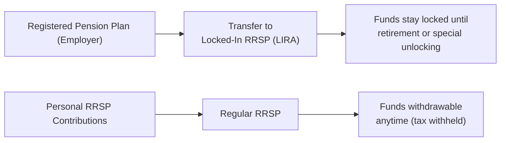
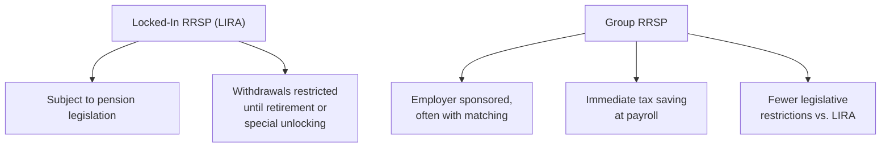

## 9.3 Locked-In RRSPs and Group RRSPs

If you've ever had a company pension plan but then left your job, or if you’re currently part of an employer-sponsored retirement savings program, you’ve probably come across some of these terms: Locked-In RRSP, LIRA, Group RRSP, and vesting. At first glance, this entire realm of acronyms can feel like trying to navigate a maze—trust me, it can get confusing fast. But let's break it down step by step and, hopefully, clear the fog.

Sometimes, we're in a hurry to figure out exactly what to do with our retirement savings. Should we keep them where they are? Transfer them to a new arrangement? A client once told me, "I just want to make sure I’m not losing any of my money." That is the driving concern for most people, right? So let's dive into these topics in detail and highlight ways you can make the most of locked-in funds and Group RRSPs, all while respecting the different legislative requirements across Canada.

---

### Defining Locked-In RRSP (LIRA)
A "locked-in" Registered Retirement Savings Plan (RRSP) is typically established when pension funds leave a registered pension plan (RPP) and flow into an individual RRSP-like account. In many jurisdictions, this account is referred to as a Locked-In Retirement Account (LIRA). The funds inside a LIRA (or locked-in RRSP) come from pension money that is governed by provincial or federal pension legislation, which means there are strict rules about withdrawals, possible unlocking exceptions, and how and when you can access that cash. Essentially, these funds are ring-fenced to ensure they are used for retirement purposes.

In Canada, the specifics—like how much can be unlocked, under what circumstances (financial hardship, shortened life expectancy, non-residency of Canada, small-balance exceptions, etc.)—vary from province to province. And if your pension plan was under federal regulation (for instance, if you worked in a federally regulated industry like banking or telecommunications), then federal pension legislation will apply instead.

#### A Quick Anecdote
There was a colleague of mine—let’s call him James—who left a railway company job. He had a decent chunk of money in the company’s defined benefit pension plan. Rather than leaving the pension in place, he decided to transfer the commuted value of his pension into a LIRA. It took him a bit of time to navigate the rules, especially around the maximum transfer limits and the fact that he couldn’t just dip into the funds for a home renovation. But in the end, he felt more in control of his retirement assets because he could invest them in mutual funds that he chose himself. This is one of the pros of locked-in arrangements—you have more say in how the assets are invested—but you lose the immediate accessibility you might be used to with a regular RRSP.

---

### Legislative Framework for Locked-In Funds
Locked-in funds aren’t like your typical RRSP contributions that you can withdraw any time (albeit with tax consequences). Once funds are locked in, legislation dictates you generally can’t withdraw them before retirement. Each province has its own set of pension statutes (sometimes influenced by or aligned with federal rules if you’re in a federally regulated industry). Here are a few highlights:

• Ontario’s Financial Services Regulatory Authority (FSRA) oversees locked-in accounts established under Ontario’s Pension Benefits Act.  
• Alberta’s Superintendent of Pensions oversees locked-in arrangements within that province.  
• Federally regulated pensions (e.g., certain telecommunications, interprovincial transportation, banking, etc.) fall under federal pension rules.  

And so on for each province or territory. The main idea is that these locked-in accounts are there for your retirement, and unlocking provisions are intentionally strict.

#### Unlocking Provisions
Though it’s called “locked-in,” there are certain provisions, sometimes summarized as “hardship unlocking,” or “financial hardship unlocking,” depending on your province:

• Financial Hardship: If you face specific, provincially recognized hardships (like risk of eviction or certain medical expenses), you might unlock a portion of the account.  
• Shortened Life Expectancy: If you face a serious medical condition that shortens your life expectancy, many provinces allow partial or total unlocking.  
• Non-Residency: Individuals who have permanently left Canada sometimes qualify for unlocking based on non-residency.  
• Small-Balance Exception: If the LIRA balance is below a particular threshold and you’re of a certain age, you might be able to unlock it in full.  

Given these differences, it’s crucial to consult the relevant provincial or federal pension legislation for your situation. Trust me, you don’t want to be halfway through a request for release of funds only to discover your chosen method is ineligible in your region.

---

### Differences Between a Regular RRSP and a Locked-In RRSP (LIRA) 
It can help to visualize the difference between these two vehicles. Let's look at a quick diagram:

- A regular RRSP holds your personal contributions and is flexible—you can withdraw funds (though generally not recommended for retirement planning reasons, and it triggers taxes).  
- A locked-in RRSP/LIRA arises from a pension plan transfer, and the withdrawal rules are far more stringent.  

---

### Practical Considerations and Best Practices
• Label Your Funds Correctly: Ensure you know which account is truly locked in, so you don’t accidentally set up a withdrawal from the wrong place.  
• Check Transfer Restrictions: Some pensions only allow partial transfers to locked-in accounts, while the rest remains in the pension.  
• Know Your Unlocking Rules: If you anticipate a possible need to unlock funds (like a planned move out of Canada), do your homework early.  

Oh, and a small cautionary tale: I once had a client who assumed everything was done automatically. He left his job, believed all his pension funds were transferred to a locked-in RRSP, and never reviewed the account statements. A year later, he found out that half the funds had remained in the old plan due to plan transferring restrictions. Communication with the old plan sponsor and his financial institution got messy. Had he checked earlier, he might have had more options for investment or better rates. Always monitor your account transfers, folks!

---

### Group RRSPs: An Overview
Moving on to Group RRSPs: these are employer-sponsored RRSP arrangements that operate on a group basis. Employers set them up to simplify retirement savings for employees. Some key highlights:

• Contributions by Payroll Deduction: You, as an employee, can contribute to the plan directly out of your paycheck. This often means the contribution is made before tax withholding, creating immediate tax savings.  
• Employer Matching: Many employers offer a matching scheme—in other words, they’ll put in a certain percentage for every dollar you contribute, like 50% or 100% match up to a cap. Over time, these matches can make a huge difference in growing your nest egg.  
• Vesting: Depending on the plan’s rules, you might have to work at the company for a certain period before you “vest” in those employer contributions. Once you’re vested, the employer’s contributions (and the investment earnings on them) are yours to keep.  

Unlike a formal Registered Pension Plan, a Group RRSP is typically not covered by the same pension benefit legislation. Instead, it follows the general RRSP rules under the Income Tax Act. However, some employers impose internal rules (like short-term lock-in or vesting) to ensure employees don’t just join the plan, grab the employer match, and leave. So yes, there may be restrictions, but these are not always mandated by pension legislation; rather, they come from the group plan’s policy or from labor contracts negotiated between employees and the employer.

---

### Why Group RRSPs Can Be Attractive
1. Immediate Tax Benefit: Contributions are made via payroll deduction, so the amount you contribute typically reduces your taxable income at source. This means you don’t need to wait until you file your tax return to enjoy the deduction’s impact.  
2. Employer Match: This can be a direct boost to your retirement savings. If you contribute $100 and your employer contributes $100, well, you’ve just doubled your investment instantly.  
3. Convenience and Discipline: It’s often easier to contribute regularly when it comes straight off your pay, and you’re much less tempted to spend that money on daily expenses.  

---

### Vesting Rules and Plan Limitations
In a Group RRSP context, “vesting” refers to the point at which the employee becomes entitled to the employer’s portion of contributions. Some workplaces might say, "You’re 100% vested from Day 1," meaning you’re free to keep the employer’s deposits even if you quit after a month. Other workplaces may have a graduated schedule where you gain 20% vesting per year, for example, meaning if you leave before five years, you won’t keep the entire portion of the employer match.

#### Transfer Out or Withdraw?
In most Group RRSPs, you can transfer out your funds if you leave the employer—typically to your own personal RRSP, to another financial institution, or to a new Group RRSP plan if the new employer allows it. But timing and any fees or penalty charges vary widely. Some plans might also have rules around withdrawal prior to retirement. That said, because a Group RRSP is still “just” an RRSP, it doesn’t carry the same locked-in legislative restrictions that come with pension plans or LIRAs. However, watch out for any internal employer restrictions or specific vesting constraints. People sometimes forget to read the fine print and assume they have the same flexibility as a personal RRSP.

A quick personal story: A friend, let’s call her Linda, decided she wanted to dip into her Group RRSP to pay for a wedding. She was under the impression that it would be as straightforward as raiding her personal RRSP. But her employer plan had a one-year lock-in on matched contributions for new hires. Linda could withdraw her own contributions only, but not the matching portion until that one-year period passed—this caused a bit of stress right before her big day. So always read those details!

---

### Visual Comparison of Locked-In RRSPs (LIRAs) vs. Group RRSPs
Here’s a simplified diagram to help you see the differences at a glance:

---

### Common Pitfalls
1. **Confusing Locked-In with Non-Locked Funds:** Some individuals are shocked when they discover they can’t withdraw from their locked-in account in the same way as they can from a normal RRSP. Always confirm your account type.  
2. **Missing Out on Matching:** If you’re in a Group RRSP but not contributing enough to max out the employer match, you’re leaving free money on the table.  
3. **Ignoring Vesting Schedules:** An employee might quit a job a month before they fully vest, potentially forfeiting a substantial chunk of employer contributions.  
4. **Forgetting Legislation Differences:** Ontario’s unlocking provisions won’t be the same as Alberta’s. If you move provinces, or if your pension is federally regulated, get updated guidance.  

---

### Potential Expansion into Pension-Like Arrangements
Some Group RRSPs are used in tandem with more formal vehicles like Deferred Profit Sharing Plans (DPSPs) or even Registered Pension Plans. Each has unique rules. For instance, a firm might say, “We have a basic RPP for everyone, plus we offer a Group RRSP for optional extra contributions.” This layering can also affect your total RRSP deduction limit because DPSP or RPP contributions reduce the amount you can put into your personal RRSP, but it might be worth it for the free employer matching.

---

### The Regulatory Landscape
As of 2025, all mutual fund dealers and investment dealers are consolidated under the Canadian Investment Regulatory Organization (CIRO). Historically, the Mutual Fund Dealers Association of Canada (MFDA) and Investment Industry Regulatory Organization of Canada (IIROC) were the separate self-regulatory organizations (SROs). But now, if you’re dealing with a financial advisor registered under CIRO, they’re subject to the new, unified rulebook. This is more about compliance and oversight than it is about locked-in or Group RRSP rules specifically, but it’s good to know who regulates your advisor.

When it comes to the protection of client assets, the Canadian Investor Protection Fund (CIPF) is now the single investor protection fund in Canada (after merging with the former MFDA Investor Protection Corporation). So if your CIRO member firm goes insolvent, CIPF coverage protects your assets (including your RRSPs, LIRAs, etc.) up to prescribed limits.

---

### Real-World Example: Financing a Home with RRSP Savings
Let’s talk about one scenario that touches both locked-in and non-locked-in funds: the Home Buyers’ Plan (HBP). Under the Home Buyers’ Plan, you can withdraw up to a certain limit (currently $35,000) from your RRSP to buy or build a qualifying home. But if your account is locked in (i.e., a LIRA), that portion isn’t eligible for the HBP because pension legislation restricts those withdrawals. Meanwhile, if you have a Group RRSP, you might be able to use your personal contributions for the HBP—though check with your employer to be sure they don’t have additional plan-specific restrictions. The employer’s matching deposits might be locked in for a period of time as part of the group arrangement but typically remain outside formal pension legislation.

---

### Strategies for Maximizing Benefits
• **Contribute enough to get full employer matching** in your Group RRSP—it's like an instant return on investment.  
• **Don’t rely solely on locked-in funds** to cover short-term or medium-term expenses. Entering retirement with locked-in capital is great for future income security, but it’s not liquid if you need to pay off sudden debt.  
• **Monitor your plan’s documents** regularly. Plans change, employers adjust matching policies, and legislation can shift.  
• **Seek professional advice** when transferring from your pension to a LIRA. You want to ensure the correct amounts are allowed under the Income Tax Act’s pension transfer limits.  

---

### Glossary
• **Locked-In Retirement Account (LIRA):** An RRSP-like account that holds pension assets and follows pension legislation. Withdrawals are typically restricted until retirement or certain unlocking events.  
• **Vesting:** The process by which an employee becomes fully entitled to the employer’s contributions within a pension or Group RRSP plan.  
• **Employer Matching:** An arrangement where employers match some portion of an employee’s contributions.  

---

### Additional Resources and References
Below are some references for further reading and official guidelines:

• Pension Legislation by Province:  
  – Ontario’s Financial Services Regulatory Authority (FSRA):  
    https://www.fsrao.ca/  
  – Alberta’s Superintendent of Pensions:  
    https://www.alberta.ca/pensions.aspx  

• Canada Revenue Agency (CRA) on Locked-In RRSP and Pension Transfers:  
  – https://www.canada.ca/en/revenue-agency.html  

• “Group RRSPs and Pensions: A Comparative Analysis,” Canadian Tax Journal (an insightful article exploring how Group RRSPs stack up against formal pension plans in terms of tax and legislative treatment).  

• CIRO (Canadian Investment Regulatory Organization) for up-to-date regulatory matters:  
  – https://www.ciro.ca  

If you sense that specific rules have changed or have become more nuanced since your plan documents were created, it’s always wise to verify legislation from official government sources or consult a qualified retirement specialist.

---

### Pulling It All Together
At the end of the day (or the end of your career), you want to have a robust nest egg for retirement. Locked-In RRSPs (LIRAs) protect those pension-originated dollars for your future self, ensuring they’re not casually withdrawn. Group RRSPs can supercharge your savings with employer matching, letting you skip the dreaded “I’ll do it next year” trap by automatically funneling money off each paycheck.

However, keep your eyes open for plan-specific rules and provincial or federal legislation. This may sound like a lot of legal-speak—because it is! But once you’ve wrapped your head around it, you’ll find that these programs can be incredibly empowering. They combine discipline (locking your funds up, or letting your employer do payroll deductions) with significant incentives (tax savings, employer match), working together to give you a more secure retirement future.

And that’s it! That is, hopefully, enough detail to help you understand the difference between locked-in accounts and Group RRSPs, plus some tips on how to make smart choices. Stay curious, keep asking questions, and review your plan regularly. You’ll be well on your way to building a confident retirement strategy.

---

## Test Your Knowledge: Locked-In RRSPs and Group RRSPs in Canada



### Which statement best describes a Locked-In RRSP (LIRA)?
- [ ] It is an RRSP that allows free withdrawals at any time.  
- [x] It is an RRSP-like account holding pension assets under provincial or federal pension legislation with restricted withdrawals.  
- [ ] It is an RRSP plan exclusively offered to self-employed individuals.  
- [ ] It is an RRSP plan that does not require any contributions from the plan holder.  

> **Explanation:** A Locked-In RRSP or LIRA is governed by pension legislation and typically restricts withdrawals until retirement or specific unlocking events.

### What is one key benefit of participating in a Group RRSP?
- [x] Receiving employer-matching contributions.  
- [ ] Having no contribution limits.  
- [ ] Gaining unrestricted access to pension funds at any time.  
- [ ] Avoiding payroll taxes on non-RRSP income.  

> **Explanation:** Many employers offer matching contributions in a Group RRSP, which can significantly accelerate an employee’s retirement savings.

### In most cases, why are withdrawals from a LIRA or Locked-In RRSP restricted?
- [ ] To prevent investing in higher-risk assets.  
- [ ] To incentivize employees to change jobs frequently.  
- [x] To ensure that pension-originated funds are preserved for retirement, in line with pension legislation.  
- [ ] To fund an emergency shelter policy at the federal level.  

> **Explanation:** Locked-in regulations ensure the funds remain dedicated to retirement and cannot be withdrawn at will unless certain unlocking criteria are met.

### Under what circumstance might someone with a Locked-In RRSP be allowed to unlock funds early?
- [ ] They want to buy a classic sports car.  
- [ ] They have decided to pursue higher education.  
- [x] They meet specific financial hardship conditions established by provincial or federal pension legislation.  
- [ ] They feel their investments are underperforming and prefer a different institution.  

> **Explanation:** Early unlocking typically requires meeting legislated criteria, such as financial hardship, shortened life expectancy, or non-residency.

### What is vesting in the context of a Group RRSP?
- [x] The process through which an employee becomes entitled to the employer’s matched contributions.  
- [ ] The procedure by which divorce settlements are determined.  
- [x] The rule that outlines how long an employee must remain to fully own the employer’s portion of contributions.  
- [ ] The method of calculating required minimum withdrawals at age 71.  

> **Explanation:** Vesting determines when an employee has the right to keep the employer’s share of contributions; some plans have an immediate vesting, while others have a graduated schedule.

### Which of the following is a common pitfall when dealing with locked-in accounts?
- [x] Believing the funds can be withdrawn for any purpose, anytime.  
- [ ] Forgetting that these accounts offer no tax deductions.  
- [ ] Not realizing these accounts are government guaranteed at 100%.  
- [ ] Overcontributing to the account without penalty.  

> **Explanation:** A typical misunderstanding is that locked-in funds work like standard RRSPs, leading people to assume they can withdraw any time, which isn’t the case.

### A key difference between a Locked-In RRSP and a Group RRSP is:
- [x] Locked-in accounts are governed by pension legislation, while Group RRSPs follow standard RRSP rules under the Income Tax Act.  
- [ ] Group RRSPs do not allow any contributions from employees.  
- [x] Locked-in accounts offer immediate withdrawal at age 18, while Group RRSPs do not allow withdrawals until age 65.  
- [ ] Group RRSPs are only available to self-employed professionals.  

> **Explanation:** Locked-in accounts remain under strict pension oversight, whereas Group RRSPs are employer-sponsored arrangements covered by RRSP rules, often supplemented by internal plan guidelines but not the same legislation as locked-in pension assets.

### In a Group RRSP, what role does "payroll deduction" play?
- [x] It allows the employee to contribute to their RRSP before income tax is deducted, providing immediate tax relief.  
- [ ] It eliminates the need to file income tax returns.  
- [ ] It guarantees investment returns by the employer.  
- [ ] It exempts the employee from paying provincial taxes.  

> **Explanation:** One of the greatest advantages of a Group RRSP is that contributions are often deducted from paycheques pre-tax, offering an immediate reduction in taxable income.

### Why might a person be unable to use funds in a LIRA for the Home Buyers’ Plan (HBP)?
- [ ] The Canada Revenue Agency disallows any RRSP contributions for the HBP.  
- [x] Pension legislation typically prevents unlocking of those locked-in funds for HBP purposes.  
- [ ] The LIRA automatically converts to cash once an HBP withdrawal is initiated.  
- [ ] The HBP only applies to individuals over age 70.  

> **Explanation:** Locked-in funds are not eligible for withdrawal under the HBP; the standard unlocking rules would override the HBP allowance.

### True or False: Under the new self-regulatory organization (CIRO), MFDA and IIROC continue to exist separately for regulatory oversight of Group RRSPs.
- [x] True  
- [ ] False  

> **Explanation:** As of 2025, the MFDA and IIROC have amalgamated into CIRO. References to MFDA or IIROC are now strictly historical; for current regulation, CIRO oversees dealers and marketplaces.


