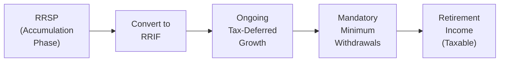
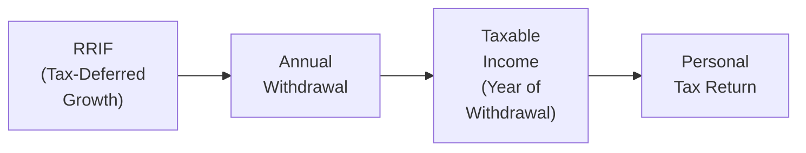

## 9.4 Registered Retirement Income Funds

Do you ever find yourself a bit overwhelmed trying to figure out exactly what happens to your Registered Retirement Savings Plan (RRSP) once you turn 71? Well, you’re definitely not alone. It’s such a common question in retirement planning circles. So, let’s roll up our sleeves and tackle the world of Registered Retirement Income Funds (RRIFs)—the next phase of your RRSP journey. Even if some of this sounds like Greek at first, I promise we’ll break it all down into digestible pieces.

Remember: The transition from RRSP to RRIF is practically universal for Canadian retirees who want an income stream in their golden years. If you’re looking to maintain tax-deferral benefits while drawing down funds, a RRIF might just be your go-to option.

Let’s dig in with a friendly but thorough look at everything you need to know about RRIFs.

---

Understanding the Basics of RRIFs

Picture this: you’re 71 years old (or getting close to it). You’ve done a good job saving your money in your RRSP over the years. Unfortunately—or fortunately, depending on your perspective—the Canada Revenue Agency (CRA) says you can’t keep that RRSP forever in its current form. By December 31 of the year you turn 71, you have to do something: either collapse the RRSP and pay full taxes, purchase an annuity, or convert it to a RRIF.

And guess what? Most people convert their RRSP to a RRIF. Why? Because a RRIF is kind of like an RRSP’s sibling, but with withdrawal rules specifically designed to give you a structured retirement income. The money inside the RRIF continues to grow on a tax-deferred basis, but you are required to take out at least a minimum withdrawal amount each year.

It’s really a solution that solves two problems at once: 
• It extends the life of your savings (you don’t pay tax on everything all at once).  
• It provides you with regular or periodic income throughout retirement.

Here’s a quick diagram to illustrate how a RRSP typically transitions to a RRIF:

In the diagram above, once your RRSP hits maturity (by age 71 at the latest), it gets converted to a RRIF. Your investments continue growing tax-deferred in the RRIF, but you must make annual withdrawals that are counted as taxable income.

---

RRIF Minimum Withdrawal Requirements

One of the hallmark features of a RRIF is the mandatory annual withdrawal. The exact minimum you must withdraw is based on a factor prescribed by the CRA that aligns with your age (or, optionally, your spouse’s age if you’d like a slightly lower withdrawal schedule). 

I remember the first time I saw those withdrawal factors—my colleague looked at me, smiled, and said, “Once you start your RRIF, there’s no going back.” And it’s true, once you set up your RRIF, the minimum withdrawal is locked in each year according to the relevant factor. You can always withdraw more, but never less. Honestly, the logic here is to ensure that all the tax-deferred dollars you’ve tucked away don’t stay untouched indefinitely.

For example, the CRA sets a broad schedule like:

• At age 72, the default factor for your RRIF minimum withdrawal might hover around 5.28%.  
• By your mid-80s, that factor can jump to over 8%.  
• By age 95 or older, the RRIF withdrawal factor can be well into the teens.

The idea is that, as you get older, your annual withdrawal rate goes up. That slowly transitions your savings into actual spendable retirement money—and, from the government’s perspective, it means they’ll see tax revenue from the funds you’ve deferred for all those years.

---

Taxation of RRIF Withdrawals

Let’s talk taxes. The funds in your RRIF continue to grow on a tax-deferred basis, which is fantastic. However, the moment you withdraw money, that withdrawal is taxed as ordinary income. So, if you’re using your RRIF to supplement your retirement lifestyle—pay for groceries, spoil the grandkids, travel—those withdrawals count toward your total income in that specific tax year.

One strategy I’ve seen is to try and juggle the withdrawal timing to stay in a lower marginal tax bracket. People often coordinate their withdrawal amounts with other income sources: Old Age Security (OAS), the Canada Pension Plan (CPP) or Quebec Pension Plan (QPP), part-time work, or even investment income. The big gotcha is that if you withdraw too much, you could bump yourself up a tax bracket or risk having your OAS or other benefits clawed back.

Here’s a second diagram that simplifies the tax flows:

The cameo role in this flowchart is the CRA, which steps in when you file your personal income tax return to ensure that the withdrawals made from your RRIF are subjected to income tax according to your overall taxable income bracket.

---

Choosing Your Withdrawal Frequency

RRIFs give you flexibility in how you receive your money—monthly, quarterly, semi-annually, or annually. Let’s say you prefer a steady monthly “paycheque.” You can set that schedule up. On the flip side, maybe you only want a single spectacular withdrawal once a year—especially if you’re the type to keep your funds invested for as long as possible. That’s also an option.

There’s no single “best way” that covers everyone, though. It really depends on your cash flow needs, personal budgeting style, and your tax situation. If you need to spread out your spending throughout the year, monthly or quarterly might be the way to go. If you draw it all at once, you must be sure you’re not going to push yourself into a higher tax bracket inadvertently if that lumps up with other incomes.  

---

Strategies to Minimize Tax When Drawing from a RRIF

Managing your RRIF effectively can be like solving a puzzle. The puzzle pieces are:  

• Minimum annual withdrawals and their steadily rising rates  
• Your other retirement income streams (pensions, part-time wages, etc.)  
• Potential spousal payment strategies  
• Beneficiary designations to optimize estate and spousal rollovers  

Small differences in timing and amounts can lead to pretty significant changes in how much tax you pay. Let’s look at some popular tactics:

• Splitting withdrawals or using a younger spouse’s age: If your spouse is younger, you can choose to base your RRIF minimum withdrawal on their age. This leads to a smaller mandatory payout, meaning you keep more of your retirement savings sheltered for a longer period.  
• Coordinating with your other income sources: Maybe you want to time a RRIF withdrawal in a year when you know you’ll have less overall income, so it won’t feel like such a big chunk is eaten away by taxes.  
• Taking advantage of pension income tax credits: Some provinces and the federal government allow pension income splitting and tax credits for certain types of retirement income, including RRIF withdrawals after age 65.  
• Avoiding big lumps at once: Withdrawing massive amounts in one shot can push you into a higher marginal tax rate. Frequent smaller withdrawals—or carefully structured annual withdrawals—sometimes help you stay within a more favorable bracket.

In real life, a friend of mine decided to wait until the end of December to withdraw from her RRIF to let the investments grow for practically the entire year. That approach worked for her because she had other forms of monthly income. However, if you actually need monthly cash flow, waiting until December might be unrealistic. As you can see, it’s all about your personal situation.

---

Spousal RRIFs and Rollovers: Why They Matter

Spousal RRIFs work similarly to spousal RRSPs. Basically, these are RRIFs funded from spousal RRSPs, generally used to split retirement income between partners for tax efficiency. 

If you pass away, your surviving spouse can often roll your RRIF over on a tax-deferred basis into their own RRIF or RRSP (depending on their age), so the full taxation of lump-sum withdrawal can be avoided. This is a big part of estate planning: ensuring the RRIF goes to the right beneficiaries so your loved ones aren’t hit with an enormous tax bill right upon your death.

While we’ll talk more about estate considerations in Chapter 18, it’s worth noting that beneficiary designations on your RRIF can make or break the efficiency of your estate transfer.  

---

Investment Options Inside a RRIF

Remember: just because your RRIF is a “retirement income vehicle” doesn’t mean your actual investment choices must be drastically different from what you had inside your RRSP. People often continue to hold:

• Mutual funds  
• Stocks  
• Bonds  
• Guaranteed Investment Certificates (GICs)  
• Exchange Traded Funds (ETFs)  

Your primary difference here is that, instead of continuous accumulation, you’re planning for decumulation—providing a reliable income stream or drawing down on capital in a structured manner. For instance, you might allocate a chunk of your RRIF into stable, lower-volatility instruments for short-term withdrawal needs while keeping some growth-oriented assets for the long run. Asset allocation might pivot a bit as you age, focusing more on capital preservation and stable fixed income.  

---

Practical Case Study: Richard’s RRIF Dilemma

To put some real-world context around these ideas, let’s check out a hypothetical story about Richard:

Richard, age 72, recently converted his RRSP (worth $400,000) to a RRIF. He also receives CPP and OAS, totaling around $18,000 per year. This year, his RRIF minimum withdrawal factor is about 5.4% (just a ballpark figure used for illustration). That means he has to withdraw at least $21,600 ($400,000 × 0.054) this year. Even though $21,600 might be more than he needs to live on, he can’t go below that amount legally. That $21,600 is counted as taxable income, on top of his $18,000 from CPP/OAS, so his total annual income for the year is $39,600.  

If Richard decides to withdraw extra from his RRIF for a big vacation—say, $10,000 more—he’d have a total of $49,600 in income. That might place him in a higher tax bracket (depending on his provincial rates). So, he’ll need to weigh whether the extra money is worth the additional tax cost.  

Richard’s other strategy might be to base the minimum withdrawal factor on his spouse’s age if she’s younger, lowering the mandatory payout and potentially easing his tax burden.  

---

Common Pitfalls and Challenges

• Not designating a beneficiary: If you forget to designate a beneficiary, then upon your death, your RRIF might be paid out to your estate. That can lead to delays and potentially higher taxes.  
• Taking large lump-sum withdrawals at an inopportune time: Doing so can spike your marginal tax rate, especially if it coincides with other big income sources in the same year.  
• Overlooking ongoing investment risk: A huge chunk of your wealth is in this single structured asset. If the investments inside your RRIF are risky or misaligned, you could lose capital you needed for retirement.  
• Misaligning with other retirement accounts: Perhaps you also have a TFSA or a non-registered account. If you don’t coordinate them, you might miss out on the best overall distribution and tax minimization opportunities.  

---

Best Practices

• Start planning early: Don’t wait until you’re 71 to figure out your RRIF approach. If you have time, consider how an annuity or partial annuitization might complement your RRIF strategy.  
• Keep track of your age-based factors: Set reminders about how your required minimum withdrawal factor is changing every year.  
• Diversify your RRIF investments: Blend stable, income-producing assets with moderate growth assets if appropriate.  
• Watch the bigger picture: Planning your withdrawals with other income streams—like OAS, GIS, CPP/QPP—might help you maximize your net after-tax income.  
• Estate planning synergy: Ensure you properly designate beneficiaries (or a “successor annuitant,” in the case of a spouse).  

---

Glossary

• RRIF Minimum Withdrawal: The mandated annual payout expressed as a percentage of the fair market value of the RRIF at the start of the year.  
• Spousal RRIF: A RRIF opened in a spouse’s name using funds from a spousal RRSP, often used to split retirement income for tax efficiency.  
• Tax Deferral: The postponement of taxes on invested or reinvested earnings until withdrawal.  

---

References and Additional Resources

• [CRA RRIF Home Page](https://www.canada.ca/en/revenue-agency/services/tax/individuals/topics/rrif.html) – For official rules on minimum withdrawal factors, taxation, and yearly updates.  
• [CIRO (Canadian Investment Regulatory Organization)](https://www.ciro.ca/) – CIRO provides guidelines and oversight for retirement accounts and distribution requirements. CIRO emerged in 2023 after the amalgamation of the former IIROC and MFDA and is now Canada’s national self-regulatory organization overseeing investment dealers, mutual fund dealers, and market integrity.  
• The Canadian Investor Protection Fund (CIPF) – The sole fund protecting client assets if a member firm becomes insolvent.  
• “Retirement Income Planning” by The Canadian Institute of Financial Planning (Online Course) – A recommended deep dive into strategies and case studies for creating effective retirement income plans.  

---

I hope all these details help you see the bigger picture of how RRIFs fit into your financial world. Yes, the rules can sometimes feel a bit rigid (especially when you look at those minimum withdrawal charts), but the flexibility to choose your payment frequency, investment portfolio, and withdrawal strategy can really be used to your advantage. And if you’re feeling uncertain, you can always engage a financial planner or accountant to help steer you in the right direction.

Anyway, the main takeaway is this: a RRIF can be one of the most effective ways to turn your hard-earned RRSP contributions into a long-lasting income stream—while minimizing taxes and giving yourself a comfortable retirement.

Take it step by step, coordinate carefully with your other income sources, and you’ll be well on your way to maximizing the benefits of a RRIF.

---

## Test Your Knowledge: Registered Retirement Income Funds Quiz



### Which of the following statements best describes a RRIF (Registered Retirement Income Fund)?  
- [ ] It’s an account that can be opened at any age with no age limit.  
- [x] It’s a continuation of an RRSP where funds remain tax-deferred but with mandatory withdrawals.  
- [ ] It’s another name for a non-registered brokerage account.  
- [ ] It’s only available to Canadians who are 65 years old.  

> **Explanation:** A RRIF is indeed a continuation of an RRSP. After a certain age (71), RRSPs must be converted into a RRIF or used to purchase an annuity. The funds remain tax-deferred, but there are mandatory minimum annual withdrawals.

### Which factor is used to determine the minimum annual withdrawal rate for a RRIF?  
- [ ] The historical rate of return on the RRIF.  
- [x] The plan holder’s age (or their spouse’s age).  
- [ ] The current inflation rate in Canada.  
- [ ] The prime lending rate determined by the Bank of Canada.  

> **Explanation:** The minimum withdrawal depends on a factor tied to the plan holder’s (or spouse’s) age. The older the individual, the higher the minimum percentage mandated by the CRA.

### If you withdraw more than the RRIF minimum in a given year, how are these extra funds treated for tax purposes?  
- [x] They are taxable in the year of withdrawal like other RRIF withdrawals.  
- [ ] They are completely tax-free.  
- [ ] They are taxed only when the RRIF is closed.  
- [ ] There is an additional 25% penalty if you exceed the minimum.  

> **Explanation:** Any amount above the minimum is simply added to your annual taxable income. There is no special penalty for exceeding the minimum, but it can push you into a higher tax bracket.

### What happens if you do not designate a beneficiary on your RRIF?  
- [ ] The RRIF funds transfer automatically to your spouse tax-free.  
- [x] The RRIF becomes part of your estate and may incur probate fees and additional taxes.  
- [ ] The RRIF balance is seized by the CRA.  
- [ ] The funds are transferred to a provincial unclaimed property registry.  

> **Explanation:** When no beneficiary is named, the RRIF assets typically go to your estate, possibly leading to probate and complications when settling taxes.

### Which of the following is a benefit of basing your RRIF withdrawal schedule on your younger spouse’s age?  
- [x] It reduces the mandatory withdrawal rate, allowing more tax deferral for longer.  
- [ ] It eliminates any minimum withdrawal requirement completely.  
- [x] It may lower overall taxable income in the early years.  
- [ ] It ensures you can make tax-free withdrawals immediately.  

> **Explanation:** Your spouse’s younger age can lower the minimum annual withdrawal percentage, so you may keep more money tax-deferred for a longer time. It does not eliminate RRIF minimum withdrawals entirely, nor does it make them tax-free.

### What is a Spousal RRIF?  
- [x] A RRIF funded by transfers from a spousal RRSP, usually for tax and income-splitting benefits.  
- [ ] A joint non-registered account for couples.  
- [ ] A short-term savings account that any spouse can set up.  
- [ ] A product offered only in Quebec.  

> **Explanation:** A Spousal RRIF is most commonly used when a Spousal RRSP has been established for income-splitting and continued tax deferral for the spouse.

### Which of the following is a common pitfall when planning RRIF withdrawals?  
- [x] Forgetting to designate beneficiaries.  
- [ ] Making monthly withdrawals rather than an annual withdrawal.  
- [x] Taking large lump-sum withdrawals that may lead to higher marginal tax rates.  
- [ ] Purchasing guaranteed investments.  

> **Explanation:** Neglecting to designate a beneficiary and taking large lump-sum withdrawals at inopportune times are frequent pitfalls, potentially triggering greater taxes or complications upon death.

### If you die while holding a RRIF, which statement is true regarding your spouse or common-law partner?  
- [x] They can roll it over into their own RRIF or RRSP, deferring taxes.  
- [ ] They must liquidate the entire RRIF immediately.  
- [ ] They can only inherit 50% of the RRIF tax-free.  
- [ ] They must pay probate fees but avoid all taxes.  

> **Explanation:** In most cases, provided the proper beneficiary or successor annuitant designation is made, the spouse can roll it over on a tax-deferred basis to their own RRIF or RRSP.

### At what age must RRSPs be collapsed, leading to a conversion to a RRIF, annuity purchase, or withdrawal of funds?  
- [x] By December 31 of the year the plan holder turns 71.  
- [ ] When the plan holder turns 55.  
- [ ] When the plan holder reaches 65.  
- [ ] At any age the plan holder chooses.  

> **Explanation:** All registered retirement savings must typically be converted or collapsed by December 31 of the year the holder turns 71, per CRA regulations.

### True or False: A RRIF can hold many of the same investments previously held in an RRSP, such as stocks, bonds, mutual funds, or GICs.  
- [x] True  
- [ ] False  

> **Explanation:** A RRIF has essentially the same investment freedoms as an RRSP. You’re not restricted in the types of investments you can keep in your RRIF.


