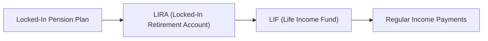

## 9.5 Life Income Funds

Life Income Funds (LIFs) are specialized retirement income vehicles designed to provide a regulated, steady stream of income from locked-in pension funds. LIFs resemble Registered Retirement Income Funds (RRIFs)—and, in many ways, function quite similarly—except for additional constraints intended to ensure retirees don’t exhaust these funds too soon. 

Think of it this way: a friend of mine always felt excited about rolling over her company pension into an individual plan after leaving her job. She was thrilled to gain some control. But when she first learned about the concept of “locked-in,” she paused and said, “Uh, so... does this mean I can’t touch my money whenever I want?” Indeed, that’s part of the deal: retirement legislation wants to make sure we don’t burn through our pension in a matter of years. And that’s where LIFs come into play.

Below, we’ll dive into everything you need to know about LIFs, from their legislative underpinnings to their minimum and maximum withdrawal rules, partial unlocking provisions, and the big question: how do you make sure you choose the right LIF option that best aligns with your retirement goals?

---

### Understanding the Basics of LIFs

A LIF is essentially a locked-in account that you typically open by transferring funds from your Locked-In Retirement Account (LIRA) or directly from a pension plan. The idea is to enable pension plan members to generate sustainable monthly, quarterly, or annual income throughout their retirement. However, LIFs go beyond simply paying out; they come with rules, constraints, and features distinct from regular RRIFs.

Some highlights to keep in mind:
• LIFs can only be funded with “locked-in” pension money.  
• You cannot contribute new money (from your personal bank account or an unregistered account) to a LIF.  
• Depending on the province or federal jurisdiction, there are rules setting minimum and maximum withdrawals.  
• Part of the intention is to avoid prematurely depleting retirement capital so you can rely on an income for life.  

---

### Where Does the Legislation Come From?

In Canada, pension legislation can either be federal (if you worked in industries such as banking, telecommunications, or cross-provincial transportation) or provincial (for employees of most other sectors). Each jurisdiction has slightly different regulations, especially around maximum withdrawals and the ability to unlock or withdraw lump sums in special circumstances.

• Federal legislation is governed primarily by the Pension Benefits Standards Act (PBSA). This is where you’d look if your pension plan is federally regulated. A direct link is often helpful for reference:  
  https://laws-lois.justice.gc.ca/eng/acts/P-36.5/

• Provincial legislation is regulated by each province’s respective act—e.g., Ontario’s Pension Benefits Act (overseen by the Financial Services Regulatory Authority of Ontario, or FSRA) or British Columbia’s Pension Benefits Standards Act (overseen by the BC Financial Services Authority).  
  – Ontario: https://www.fsrao.ca/  
  – British Columbia: https://www.fic.gov.bc.ca/

Checking which legislation applies to your money is crucial: if your original pension plan sits under federal rules, your LIF will be governed by federal regulations. If your pension is provincial, you’ll need to look to that province’s LIF rules for guidance.

---

### Minimum and Maximum Withdrawals

Let’s talk about the big difference between a LIF and a RRIF. In a RRIF, the government sets a minimum withdrawal you must take out each year after the year you establish your RRIF, with no maximum limit. A LIF, on the other hand, usually follows the same minimum withdrawal thresholds as a RRIF, but also imposes a maximum annual withdrawal limit.

Why is there a maximum withdrawal? Well, legislators want to ensure that, years down the road, you still have income left to live on. This maximum is often determined by a formula set out in pension regulations. Depending on your age and the applicable legislation, the calculation sets a certain percentage beyond which you can’t withdraw.

You might be thinking, “But... what if I need more money than the maximum allows?” Indeed, that can be tricky. Different provinces might permit certain unlocking provisions or one-time lump-sum withdrawals. If you ever find yourself in that situation, you may need to check if you qualify under specific hardships or medical situations. We’ll explore that soon.

---

#### An Illustrative Example

Let’s say you’re 65 and you have $500,000 in your Ontario-regulated LIF on January 1st of the current year. Suppose the maximum annual withdrawal factor (for your age) under Ontario rules comes to 7.38%. This means the maximum you can withdraw for that year is:
  
  $500,000 × 7.38% = $36,900

(Note: This number is just an illustration; actual rates vary year to year and by jurisdiction.)

Your minimum withdrawal might be, for example, 4.00% (or $20,000). Thus, in that scenario, you must take at least $20,000 but no more than $36,900 over the year, typically in installments that can be monthly, quarterly, or annually, depending on your preferences and your financial institution’s policy.

---

### Unlocking Provisions: Getting Access to Your Funds

When it comes to locked-in funds, the word “unlocking” may sound magical—and in some ways, it is. Various jurisdictions allow certain unlocking features for LIFs under specific circumstances, such as:

• Financial hardship: You might qualify if you’re facing low income, high medical costs, or threats of eviction.  
• Shortened life expectancy: If a physician confirms a severely reduced life expectancy, that individual may be able to unlock some or all of their LIF funds.  
• Small balance unlocking (for older individuals): Some provinces permit unlocking if your total locked-in assets are below a certain threshold (like a “small-pot” rule).  
• One-time partial unlocking: Some jurisdictions allow up to 50% of a newly formed LIF to be unlocked when you first transfer from a LIRA/Pension Plan. Ontario used to have this provision available for individuals who meet certain age requirements.

Remember, these rules vary widely by province. Federal pension rules also offer some unlocking under certain conditions. So it’s important to confirm exactly which legislation applies.

---

### Why Do LIF Rules Vary So Much?

You might be asking, “Seriously, why can’t we have a single, unified rule set for LIFs?” Well, each province sees fit to protect the retirement income of its residents in a slightly different way. Provincial legislators design their laws with local contexts, historical precedents, and unique social policy in mind. And the federal government has its own approach for specific industries under its jurisdiction. 

While this can be frustrating if you’re searching for straightforward rules, it also ensures a measure of flexibility where each province can tailor solutions to the needs of its citizens. 

---

### Converting a LIF to Other Income Products

Many people wonder whether they can convert a LIF into an annuity at some point. Yes, typically you can. Usually, if you decide you want a guaranteed stream of income that is no longer subject to annual maximum limits (but also has less flexibility), you can purchase a life annuity from an insurance company using the money in your LIF. This can be a strategic move if you want to lock in a predictable income for as long as you live. 

Just keep in mind: once you switch to an annuity, there is no going back. The lumpsum ownership of that money is gone—transformed into the insurance contract that sends you periodic income checks. Some people forego the annuity approach to maintain flexibility in their withdrawals; others prefer the peace of mind an annuity can deliver, especially if they worry about running out of money in extreme old age.

---

### Practical Example with Names and Numbers

Imagine Linda, age 60, with a LIRA valued at $250,000 in a province with specific LIF regulations. Linda wants to start drawing an income from this retirement nest egg. Let’s follow her steps:

1. Linda meets with her financial advisor, who checks with the provincial regulators to see if Linda can convert her LIRA to a LIF at age 60. (Most jurisdictions allow conversion when you satisfy certain age requirements, typically earmarked around “early retirement” ages.)  
2. Once the LIF is opened, Linda’s annual minimum withdrawal for the first year is based on her age (60). She also has a maximum withdrawal factor that sets a cap.  
3. Linda chooses to withdraw monthly to smooth out her cash flow. She and her advisor set up an automatic monthly deposit from the LIF into her chequing account.  
4. Linda realizes that her maximum for the year might not be enough to cover an unexpected medical expense. She explores whether partial unlocking is available under a “financial hardship” clause. If so, she may apply to the pension regulatory authority for unlocking. If not, she’ll need to manage within the maximum or look for other funding sources.

This real-life scenario highlights the interplay of rules, planning, and personal financial goals. The key is always to confirm the specifics of your own jurisdiction before making decisions and to consult with a knowledgeable financial planner or resource.

---

### LIF vs. RRIF: Core Differences

Someone might ask you at a dinner party, “So, what’s the difference between a LIF and a RRIF, again?” And, trust me, if you don’t sort that out, you might get that slightly glazed-over look from your well-meaning friends. So let’s break it down easy:

• Locked-In Funds vs. Non-Locked-In: A RRIF can hold any registered funds that originated from an RRSP (or a spousal RRSP, group RRSP, etc.), whereas a LIF holds locked-in assets coming from a pension plan or LIRA.  
• Maximum Withdrawal Limit: A RRIF only has a minimum withdrawal. The LIF has both a minimum (similar to an RRIF) and a maximum.  
• Legislative Variation: RRIFs are governed primarily by the federal Income Tax Act. LIFs are impacted by both the federal Income Tax Act (for the tax rules component) and pension laws (federal or provincial).  
• Unlocking Provisions: RRIFs don’t require unlocking because the funds aren’t locked in to begin with. LIFs need unlocking if you want to exceed maximum limits or withdraw capital in special scenarios.

---

### A Quick Glimpse at the Flow of Funds

To visualize how the LIF sits in the broader retirement structure, here’s a simple Mermaid diagram. You’ll see how locked-in pension funds move and ultimately produce retirement income.

In practice, you might go directly from a pension plan to a LIF, or you might first move from the pension plan to a LIRA, and then convert the LIRA to a LIF when you’re ready to begin retirement income.

The crucial step is the conversion to a LIF, because that’s when you finalize the annual withdrawal schedule—deciding exactly how much you’ll get paid each month or quarter (subject to min/max rules).

---

### Administration, Tax, and Reporting

From a tax perspective, LIF withdrawals are treated as ordinary income for the year in which you receive them. This means your financial institution will typically withhold tax at source if you exceed certain designated thresholds, and you’ll also need to report these amounts on your annual return. The financial institution or plan administrator will issue a T4RIF slip, similar to what you’d expect from a RRIF.

For estate planning considerations, any remaining funds in your LIF upon death will typically pass to your designated beneficiary (often a spouse). Certain spousal rights and locked-in rules may apply, depending on legislation. If you have a spouse or common-law partner at the time of your death, there may be mandatory spousal entitlements under pension legislation. Check your province’s (or the federal) rules on beneficiary designations and spousal entitlements for clarity.

---

### Potential Pitfalls and How to Avoid Them

1. **Ignoring Maximum Limits**  
   It seems obvious, but sometimes folks forget that LIFs have an annual maximum. If you accidentally request more than the maximum, your financial institution won’t process that extra withdrawal—unless you qualify under unlocking provisions. Always plan your income needs early.

2. **Lack of Knowledge About Unlocking Provisions**  
   One frustration is not knowing you had an option to unlock funds in hardship situations. If you’re facing heavy financial stress, consult your provincial or federal pension regulator’s website (or your financial advisor) to see if you qualify.

3. **Procrastinating the Conversion**  
   Some people wait too long to convert their LIRA or locked-in pension into a LIF, only to realize they need the income right away. Alternatively, others convert too early, not realizing they could keep funds growing tax-sheltered for longer. Timing matters.

4. **Overlooking Legislation Differences**  
   People move around in their careers. Perhaps you worked in a federally regulated industry (like a bank) but ended up at a provincially regulated job. If you have multiple pension pots, watch out for the differences. You might need more than one LIF if you want to keep them separate, or you might be able to consolidate if the pension legislation allows.

5. **Neglecting Spousal Rights**  
   In many jurisdictions, your spouse or common-law partner has rights to your pension. Make sure you discuss designations and entitlements, as well as how LIF rules might override or influence typical beneficiary designations.

---

### Strategies for Maximizing LIF Potential

• **Use Partial Unlocking Wisely**: If your province allows you to unlock a portion (say 50%) of your LIF upon conversion, carefully consider whether you want to do so. If you do unlock a chunk, that portion becomes non-locked-in and can be managed in a regular RRSP or RRIF. That could provide flexibility if you anticipate upcoming large expenses, but it also might expose you to spending that principal more easily.  

• **Coordinate with Other Income Sources**: LIF income is just one part of your retirement story. You may also have Canada Pension Plan (CPP), Old Age Security (OAS), a company pension, personal savings, or TFSAs. A fundamental practice is to ensure that your LIF withdrawal schedule fits neatly with these other sources so you don’t withdraw more than needed—and avoid paying higher taxes prematurely.  

• **Consider an Annuity for Stability**: Some people with a LIF find that once they reach a certain age, they’d prefer to convert some or all of their savings into a life annuity—thus ensuring they never outlive their money. While it reduces flexibility, it also removes some longevity risk.  

• **Stay Current on Regulatory Changes**: The rules around LIFs can and do change from time to time. For the most up-to-date information on LIF legislation and associated processes, check official resources like those linked earlier, or consult the Canadian Investment Regulatory Organization (CIRO) website at https://www.ciro.ca for regulatory updates.  

• **Seek Professional Advice**: Talk to a qualified financial advisor (preferably one familiar with LIF rules in your jurisdiction). Use open-source financial tools or calculators provided by pension authorities. And if you’re part of a professional association, check resources like “Life Income Funds Explained” by Advocis.

---

### Glossary

• **LIF (Life Income Fund)**: A regulated registered account designed to provide retirement income from locked-in pension assets. It is subject to minimum withdrawals (similar to RRIFs) and maximum withdrawal rules set in pension legislation.  
• **Maximum Withdrawal Limit**: A legislated cap on annual LIF withdrawals, preventing premature depletion of the underlying funds.  
• **Unlocking Provisions**: Special legislated rules allowing individuals to withdraw or convert a portion of funds from a locked-in plan, typically due to financial hardship, reduced life expectancy, or small balance unlocking.  

---

### Additional Resources

• Federal Pension Legislation (for federally regulated pensions):  
  https://laws-lois.justice.gc.ca/eng/acts/P-36.5/  

• Provincial Regulators:  
  – Ontario (FSRA): https://www.fsrao.ca/  
  – British Columbia (BCFSA): https://www.fic.gov.bc.ca/  

• Advocis Resource:  
  “Life Income Funds Explained” (Article) – Check https://www.advocis.ca for relevant publications.

• CIRO (Canadian Investment Regulatory Organization):  
  For ongoing regulatory updates, check https://www.ciro.ca.

These references will help you stay informed about legislation, best practices, and any rule changes that could affect your LIF.

---

### Pulling It All Together

Life Income Funds serve as a critical piece in the retirement puzzle for many Canadians, ensuring funds derived from pension plans remain available throughout retirement. By balancing a minimum withdrawal requirement (like a RRIF) with a maximum cap, a LIF speaks directly to the need for long-term security. But as helpful as that is, it also comes with restrictions. A retired friend once remarked, “I feel safer, sure, but I also get a little antsy knowing there’s a maximum.” That kind of tension is exactly what the government’s aiming for: sufficient freedom to enjoy retired life but enough structure to ensure you don’t run out of money too soon.

If there is any single takeaway, it’s this: always confirm which legislation applies to your LIF, and don’t be shy about exploring whether unlocking provisions might help you at specific points in your retirement journey. Combined with solid tax planning, good budgeting, and wise asset allocation, a LIF can bring tremendous peace of mind. Consider it one of the robust building blocks in a well-thought-out retirement strategy—right alongside TFSAs, RRIFs, government benefits like CPP/QPP, and of course, that sense of personal financial empowerment we’re all after.

---

## Test Your Knowledge: Life Income Fund Essentials Quiz



### 1. Which of the following best describes a Life Income Fund (LIF)?

- [x] A registered account that holds locked-in pension assets and enforces minimum and maximum withdrawal limits.
- [ ] A defined benefit pension plan offering guaranteed lifetime income.
- [ ] A savings account with no legislated withdrawal rules.
- [ ] A group RRSP managed by your employer.

> **Explanation:** A LIF is specifically designed to receive locked-in pension funds, ensuring both minimum and maximum withdrawals under legislation.

### 2. True or False: All Canadian LIFs follow exactly the same rules, regardless of province or federal jurisdiction.

- [ ] True
- [x] False

> **Explanation:** Each province (or the federal government) maintains distinct regulations, which can result in variations in minimum/maximum withdrawal limits and unlocking provisions.

### 3. Which of the following is NOT a common unlocking provision generally found in provincial or federal legislation?

- [ ] Financial hardship unlocking.
- [ ] Shortened life expectancy unlocking.
- [ ] Small balance unlocking for older clients.
- [x] Transfer of all LIF assets to an unregistered investment account without conditions.

> **Explanation:** Typically, LIF assets cannot be freely moved to an unregistered account without meeting specific unlocking provisions.

### 4. How is the maximum annual withdrawal limit for a LIF generally determined?

- [ ] By the financial advisor’s discretion.
- [x] By a legislative formula, dependent on age and the account’s value.
- [ ] By the Canada Revenue Agency’s standard RRSP rules.
- [ ] By the monthly rate of inflation.

> **Explanation:** Maximum limits are set by pension legislation, often tied to age-based formulas published by the relevant jurisdiction.

### 5. What key difference distinguishes a LIF from a RRIF?

- [x] A LIF imposes a maximum withdrawal limit, whereas a RRIF does not.
- [ ] A LIF generally allows penalty-free withdrawals before age 55.
- [ ] A RRIF requires funds to be sourced only from locked-in pension assets.
- [ ] A RRIF provides no minimum withdrawal requirement.

> **Explanation:** The hallmark of a LIF is that it has both a minimum and a maximum withdrawal, whereas a RRIF has no maximum.

### 6. Under typical Canadian regulations, how are withdrawals from a LIF treated for tax purposes?

- [x] They are treated as ordinary income and reported on a T4RIF slip.
- [ ] They are entirely tax-free if under the annual maximum limit.
- [ ] They are exempt from provincial taxes but subject to federal taxes.
- [ ] They are only taxed if the spouse is the annuitant.

> **Explanation:** Withdrawals from a LIF are usually considered taxable income, much like RRIF withdrawals, and are reported on a T4RIF slip.

### 7. In which situation might unlocking a portion of a LIF be possible?

- [x] Proving financial hardship (e.g., eviction risk, low income).
- [ ] Desiring funds simply to invest in a new vehicle.
- [x] Having a physician certify a severely shortened life expectancy.
- [ ] Preferring a different bank for your investments.

> **Explanation:** While definitions and limits vary by jurisdiction, financial hardship and shortened life expectancy are two recognized unlocking provisions. A personal preference like buying a new vehicle does not typically qualify.

### 8. What is one advantage of converting a LIF to an annuity?

- [x] It guarantees a set stream of income for life, removing some longevity risk.
- [ ] It completely eliminates all taxation on withdrawals.
- [ ] It waives the need to report withdrawals on your tax return.
- [ ] It increases your maximum withdrawal limit each year automatically.

> **Explanation:** Converting a LIF to a life annuity generally provides a guaranteed income stream for as long as you live. Taxes are still due and you do not avoid reporting income.

### 9. When setting up a LIF, who is responsible for determining whether the funds are governed by federal or provincial legislation?

- [x] The individual and/or their financial institution, based on the originating pension’s regulatory body.
- [ ] The Canada Revenue Agency automatically determines it upon tax filing.
- [ ] The nearest courthouse or provincial court system.
- [ ] CIRO decides for every LIF in Canada.

> **Explanation:** The origin of the pension plan dictates whether federal or provincial legislation applies, and individuals typically confirm with their plan sponsor or financial institution.

### 10. A LIF has no maximum withdrawal limit and can be fully redeemed at any time.

- [ ] True
- [x] False

> **Explanation:** A fundamental aspect of a LIF is enforcing maximum annual withdrawal limits. Complete redemption is typically restricted unless unlocking provisions apply.


