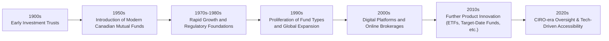

## 1.1 How has the Mutual Fund Industry Evolved?

Sometimes I like to think back to my very first time hearing about mutual funds. I was a college student, with about $100 to my name, and I remember someone saying, “Hey, you can invest in the stock market.” My reaction was basically, “Um, that’s for fancy millionaires, right?” Then I discovered that mutual funds let small investors pool their resources together, so even beginners with minimal cash could have access to a broad basket of investments. It’s pretty amazing how such a simple concept—pooling money—has evolved into one of the largest cornerstones of the global financial market.

Below, we’ll explore how the mutual fund industry got started, how it grew into the modern power it is today, how regulations in Canada have shaped (and continue to shape) investor protection, and how technological changes open new doors for anyone who wants to invest—even if you have just a few bucks in your savings account.

---

### The Early Beginnings

The concept behind mutual funds is actually straightforward: a group of individuals pools their money, and professional managers invest that pooled capital in a diversified set of securities—like stocks, bonds, or other instruments—on behalf of all participants. Originally, this was seen as a huge blessing for people who lacked the resources or expertise to invest in individual securities. 

Historically, in the early 1900s, some of the earliest versions of mutual funds (in the broad global sense) could be found in Europe. By the mid-20th century, this idea started taking hold in North America. In Canada, the pioneering mutual funds mostly aimed to provide fixed-income and stock exposure to average folks who wanted to save for retirement or other long-term goals. Although the variety of funds was extremely limited back then (a handful of funds, really), they represented a major leap forward in making investing more accessible.

But let’s take a quick look at a rough timeline that summarizes key points along the journey:

#### Early Investment Trusts
• The forerunners of mutual funds were sometimes called “investment trusts,” pooling resources from a small group of wealthy individuals.  
• These trusts were relatively unregulated and offered limited transparency.  

#### Introduction of Modern Canadian Mutual Funds
• By the 1950s, more structured funds emerged in Canada, focusing on providing a mix of equity and fixed-income investments to everyday investors.  
• These were still relatively straightforward products without the variety we see now.

---

### Growth Through the Decades

Fast forward to the 1970s and 1980s, and you’ll notice more mutual fund offerings popping up in Canada. The investment landscape was evolving, and many Canadians started turning to mutual funds as a mainstay in their Registered Retirement Savings Plans (RRSPs). 

• New Regulations: Regulators laid down foundational rules to protect investors, ensuring clear disclosures about fund objectives, fees, and risks.  
• Popularity Surge: Mutual funds saw accelerated inflows because they were seen as “one-stop” solutions—investors got diversification, professional management, and an accessible way to put money to work.  

By the 1990s, competition among fund companies heated up. Equity markets were booming; technology was advancing; more Canadians wanted in. The mutual fund industry responded with new products: specialty sector funds (think technology or healthcare), global funds, and even some early signs of “alternative” strategies that used derivatives.

---

### The Role of Regulation and Oversight

In Canada, the regulatory environment has always been crucial in shaping the mutual fund industry. Over the decades, regulations evolved to prioritize transparency, reduce conflicts of interest, and protect the average investor. Currently, the main national self-regulatory body is the Canadian Investment Regulatory Organization (CIRO). (It was formed when the Investment Industry Regulatory Organization of Canada (IIROC) and the Mutual Fund Dealers Association of Canada (MFDA) amalgamated. Those defunct SROs no longer exist as separate entities.)

Today, CIRO enforces rules that ensure mutual funds:

• Disclose fees, risk ratings, and performance data transparently.  
• Operate under a rigorous compliance framework, ensuring minimal misconduct.  
• Provide simplified prospectuses, which highlight the key features and costs of the fund.  

#### Simplified Prospectuses

A simplified prospectus condenses the essential details of a mutual fund into a more reader-friendly format. Let’s face it, reading a massive 100-page legal document is daunting! The simplified prospectus shares the same core information but in a manner that’s easier to digest, emphasizing:

• The fund’s investment objective.  
• Risk levels and the possibility of losses.  
• Fees and costs to the investor, including management fees, operating expenses, and any sales charges.  
• Historical performance, typically shown with disclaimers like “past performance is no guarantee of future results.”

#### CSA and Other Key Institutions

On top of CIRO, the Canadian Securities Administrators (CSA) coordinate provincial and territorial securities regulators. They foster consistent regulations across the country, making sure everyone plays by a similar rulebook. If you’re curious, check out the CSA website at:  
• [Canadian Securities Administrators (CSA)](https://www.securities-administrators.ca/)

Meanwhile, the Canadian Investor Protection Fund (CIPF) provides assurance to clients of insolvent dealer members. CIPF has become Canada’s sole investor protection fund, so if a regulated dealer can’t meet its obligations, CIPF steps in to ensure client assets are protected (subject to coverage limits and terms).

---

### Broadening Product Diversity

As the industry matured, mutual fund manufacturers recognized that investors had increasingly varied goals, timelines, and risk appetites. Originally, you might have chosen between a basic equity fund and maybe a bond fund—done. But now, there’s a seemingly endless array of specialized products. Let’s highlight some:

• Sector Funds: Focus on specific industries (e.g., tech, utilities, healthcare).  
• International Funds: Invest broadly outside of Canada, or in specific global regions (Asia, Europe, or emerging markets).  
• Target-Date Funds: Automatically adjust their asset allocation as the investor approaches retirement (heavy in equities early, shifting to safer assets later).  
• Structured Products: Often use derivatives or other instruments to create a customized risk-return profile.  
• ESG Funds: Designed to invest in companies meeting specific Environmental, Social, and Governance criteria.

At the same time, the line between mutual funds and other pooled vehicles—such as Exchange-Traded Funds (ETFs)—started blurring. ETFs began as index-tracking vehicles but later evolved to have actively managed strategies, too. While ETFs are typically traded on stock exchanges, the push for innovation in the mutual fund space is partly driven by competition from ETFs.

---

### Impact of Technology

I still remember the first time I purchased mutual funds through an online brokerage. There was this moment of disbelief—like, “Wait, I just bought into a diversified portfolio with a few clicks?” Technology has transformed how we buy, sell, and monitor mutual funds, making it more convenient and cost-effective. Key trends:

• Online Brokerages: Platforms offering easy selection, comparison, and purchase of mutual funds. In many cases, you can set up automated contributions.  
• Robo-Advisors / Digital Advice Platforms: These technology-driven solutions make portfolio recommendations using algorithms, then automatically invest your money in mutual funds or ETFs tailored to your preferences.  
• Real-Time Data and Analytics: Today’s investors can track performances daily, if they wish. Open-source tools like [Portfolio Visualizer](https://www.portfoliovisualizer.com/) let you backtest and compare historical performance data.  

All of this accelerates the democratization of finance. Investors no longer need large sums of money or a specialized finance degree. They can log on, watch a few educational videos, use an online interface, and invest in a mutual fund that meets their budget and needs.

---

### Regulatory Shifts in the 2020s: Emphasis on Investor Protection

This decade brought changes, too. With the formation of CIRO, the single national self-regulatory organization, the mutual fund industry aims to minimize duplication and confusion that once existed when there were separate SROs. Now, mutual fund dealers follow a cohesive rulebook, which:

• Mandates robust suitability and “Know Your Client” (KYC) processes.  
• Requires deeper discussions about risk tolerance, time horizon, and investment objectives (see Chapter 4: Getting to Know the Client).  
• Sets higher standards for marketing materials and investor disclosures to ensure transparency and fairness.  

When you meet with a mutual fund sales representative, they’re guided by these regulations to understand your financial situation and recommend suitable mutual fund products. That’s part of the reason we explore the KYC and suitability requirements deeply in later sections of this course.

---

### Real-World Example: How Innovation Can Surface

I chatted with a friend last year who launched an “alternative energy” mutual fund that invests primarily in green energy producers. This fund uses a combination of direct equities and carefully selected derivative instruments to mitigate some volatility. The fund’s objective is to capture the growth of this sector while buffering against short-term price swings. Interestingly, such a product might not have existed 20 years ago—either because it was too niche or because the regulatory framework wasn’t as mature (and also because the market demand for ESG-type products was less pronounced).

This story illustrates how mutual funds don’t stand still: they adapt to investors’ evolving demands, reflect the shifting environment, and remain subject to regulatory guardrails built to protect investors.

---

### Why Understanding the Industry’s History Matters

So why bother with any of this history stuff? Because it’s more than trivia. If you’re going to be a mutual fund sales representative, you need to appreciate:

• Regulatory Approach: Canada’s stringent oversight stems from lessons learned over decades—compliance is built into the DNA of the industry.  
• Product Variety and Complexity: Funds aren’t just basic stock or bond pools anymore. Knowing the diversity helps you match client needs with the right solutions.  
• Transparency and Trust: Historical emphasis on transparency leads many Canadians to trust mutual funds as part of their retirement strategy.  

In short, you’re stepping into a field that’s heavily shaped by the past. The regulations and best practices in place today are direct results of the industry’s evolution and occasional missteps.

---

### Best Practices and Potential Pitfalls

• Stay Informed: Product innovation is continuous. Subscribe to industry journals or follow updates from the [Investment Funds Institute of Canada (IFIC)](https://www.ific.ca/) to stay on top of new types of funds.  
• Watch Out for Overly Exotic Products: Some structured or alternative funds carry features that can be harder to understand. Conduct thorough due diligence before recommending them.  
• Leverage Technology—Wisely: Digital platforms can streamline your work but also bring new risks (like data security or the temptation to skip the personal touch in client advice).  
• Communicate Clearly: The mutual fund world is full of acronyms and jargon—always strive to speak in plain language with your clients.  

---

### Practical Resources for Further Exploration

1. [Canadian Investment Regulatory Organization (CIRO)](https://www.ciro.ca/) – Offers resources on the history of mutual funds and current regulations.  
2. [Canadian Securities Administrators (CSA)](https://www.securities-administrators.ca/) – Check here for national regulatory updates and harmonized rules.  
3. [Investment Funds Institute of Canada (IFIC)](https://www.ific.ca/) – Industry statistics, best practices, and historical data on Canadian mutual funds.  
4. [Portfolio Visualizer](https://www.portfoliovisualizer.com/) – An open-source online tool for historical fund performance analysis and portfolio building.  
5. “Common Sense on Mutual Funds” by John C. Bogle – Although this has a U.S. focus, many of the principles and historical perspectives on money management are insightful for Canadian advisors as well.  

---

### Closing Thoughts

Anyway, if you think about it, the Canadian mutual fund industry started as a tiny seed: a small group of resourceful folks pooling their money to access professional management. Now, it has blossomed into a massive, multifaceted ecosystem with thousands of options for every type of investor. Whether that’s a young adult just starting to build a nest egg, or a retiree aiming to preserve wealth and generate steady income—there’s a mutual fund solution built for that purpose. And the role of the mutual fund sales representative is essentially to simplify this complexity, help clients navigate it, and ensure they’re making informed, suitable decisions.

Keep this evolution in mind as you move through the subsequent sections of this text. Understanding the roots of the mutual fund industry provides context for why it’s shaped the way it is—and how you, as a representative, can deliver value in a well-regulated environment that prioritizes investor protection.

---

## Quiz: Evolution of Mutual Funds in Canada



### Which of the following best describes the original purpose of mutual funds?

- [x] To pool resources from multiple investors and provide professional management.
- [ ] To trade only in industry-specific sectors.
- [ ] To invest exclusively in complex derivative products.
- [ ] To bypass regulatory oversight.

> **Explanation:** Mutual funds originated as pooled investment vehicles that allowed individuals to combine their resources and benefit from professional money management.

### What is one major reason why regulators in Canada require fund companies to provide a simplified prospectus?

- [x] To ensure that key details (objective, fees, risk) are transparently presented and easy for investors to understand.
- [ ] To limit the sales potential of new funds in the market.
- [ ] To add complexity to the investing process.
- [ ] To discourage investors from buying multiple funds.

> **Explanation:** Simplified prospectuses increase transparency and make it easier for everyday investors to grasp essential information about a fund.

### During which period did the mutual fund industry in Canada witness a surge in the number of product offerings, including sector-specific funds?

- [ ] Early 1900s
- [x] 1990s
- [ ] Late 1800s
- [ ] 1970

> **Explanation:** By the 1990s, the proliferation of specialty and global funds greatly expanded product offerings beyond traditional equity and bond funds.

### Which regulatory body currently oversees mutual fund dealers and investment dealers in Canada?

- [ ] Mutual Fund Dealers Association of Canada (MFDA)
- [ ] Investment Industry Regulatory Organization of Canada (IIROC)
- [x] Canadian Investment Regulatory Organization (CIRO)
- [ ] Canadian Investor Protection Fund (CIPF)

> **Explanation:** MFDA and IIROC are no longer separate entities. They amalgamated and formed CIRO, the new self-regulatory organization for investment and mutual fund dealers.

### What key benefit do robo-advisors bring to the mutual fund landscape?

- [x] Automated, algorithm-based portfolio recommendations and efficient rebalancing.
- [ ] Elimination of all fees and charges associated with mutual funds.
- [x] Accessible, user-friendly online interfaces for reviewing and purchasing funds.
- [ ] Guaranteed returns above inflation.

> **Explanation:** Robo-advisors offer user-friendly digital platforms and automated investment decisions, making it easier to select and monitor mutual fund portfolios.

### In Canada, which organization offers protection to investors if a member dealer becomes insolvent?

- [x] Canadian Investor Protection Fund (CIPF)
- [ ] Canadian Securities Administrators (CSA)
- [ ] The Federal Government
- [ ] The Bank of Canada

> **Explanation:** CIPF safeguards the assets of clients if their regulated dealer fails, subject to specified coverage limits.

### Which is a primary reason the mutual fund industry continues to introduce new, specialized products?

- [x] To address the evolving needs, objectives, and risk appetites of diverse investors.
- [ ] To make mutual funds more exclusive and limited.
- [x] To remain competitive against other investment vehicles like ETFs.
- [ ] To complicate the selection process for financial representatives.

> **Explanation:** By innovating and offering specialty or structured products, fund companies meet investors’ changing requirements and keep pace with competition.

### Why did the mutual fund industry experience substantial growth in Canada during the 1970s–1980s?

- [x] Regulatory frameworks improved disclosures and investor protections, increasing public trust.
- [ ] Mutual funds guaranteed 100% returns.
- [ ] The Canadian stock market was declared risk-free.
- [ ] Investors were no longer permitted to buy individual securities.

> **Explanation:** Enhanced regulation and broader awareness of mutual funds played pivotal roles in boosting investor confidence and industry growth in that era.

### How have online brokerages changed the way Canadians access mutual funds?

- [x] They allow easy, sometimes automated buying and selling of funds with just a few clicks.
- [ ] They only permit the purchase of bonds, not mutual funds.
- [ ] They require in-person appointments for every transaction.
- [ ] They block all investors except high net-worth clients.

> **Explanation:** Digital platforms have democratized access to mutual funds, enabling users at all capital levels to transact conveniently.

### True or False: ETFs eliminated the need for mutual funds entirely.

- [x] True
- [ ] False

> **Explanation:** While ETFs compete with mutual funds, mutual funds remain a strong choice for many investors due to their different fee structures, management styles, and purchase/redemption processes. They coexist rather than replace each other.


