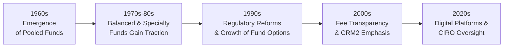

## 1.1 How has the Mutual Fund Industry Evolved?

Sometimes, we only realize an industry’s transformation when we compare its humble beginnings to its modern-day complexities. That’s definitely the case with mutual funds in Canada. I still remember, back in my early 20s, my father chuckling as he handed me an old mutual fund certificate: "I bought this so you’d learn how investing works," he said. At that time, the idea of pooling money with other investors seemed so foreign to me. But fast-forward to now—mutual funds have grown into a huge, highly regulated sector, offering a dizzying array of products and services that cater to just about every investment goal you can imagine. Let’s dig in and see how all this came to be, and why it matters so much for the mutual fund sales representative.

### Early Days and Initial Growth

The roots of Canada’s mutual fund industry can be traced back to the 1960s, when a small number of pooled funds—essentially money collected from different investors—began operating. These vehicles were perceived as a convenient way for the average person to get professional investment management and diversify across different asset classes. Before this, many people thought you needed significant wealth to invest in stocks or bonds directly. With a mutual fund, they could suddenly participate in the markets with as little as a few hundred dollars.

Even though the 1960s might sound like ancient history, the appeal of pooling funds remains surprisingly modern. If you can’t—let’s say—buy 20 different stocks on your own, you can buy one mutual fund that invests in those stocks on your behalf. Over the 1970s and 1980s, the choice of funds expanded from just simple equity or fixed-income funds to balanced strategies. These balanced funds combined both stocks and bonds in a single product. That alone encouraged more people to get involved; they could get a “one-stop shop” for multiple asset classes, mitigating risk through diversification.

### Regulatory Developments and Investor Protection

As the mutual fund industry started to accelerate, it naturally caught the eyes of regulators who wanted to ensure investors were protected. Fast-forward a few decades (and skipping a lot of red tape stories), it’s impossible to talk about mutual funds in Canada without mentioning the crucial role of regulatory bodies such as the Canadian Securities Administrators (CSA). The CSA is an umbrella organization of provincial and territorial securities regulators that coordinates regulations nationwide. Their numerous national instruments—like NI 81-101 (Mutual Fund Prospectus Disclosure) and NI 81-102 (Investment Funds)—clarify what responsibilities fund companies and dealers have toward investors.

Today, mutual fund dealers are overseen by the Canadian Investment Regulatory Organization (CIRO). If you’re brand-new to the industry, you might hear people refer to MFDA or IIROC, but those two defunct organizations were amalgamated into CIRO on January 1, 2023, and renamed effectively June 1, 2023. CIRO oversees all investment dealers and mutual fund dealers across Canada. Its rules ensure mutual fund sales representatives (or “dealing representatives,” to use a broader term) follow strict guidelines:

• They must understand their clients’ financial situations (the Know Your Client or KYC requirement).  
• They must be transparent about fees and disclose important details before money changes hands.  
• They have to address potential conflicts of interest.  
• They must fulfill their obligation to recommend suitable products and strategies.

In other words, it’s not just about selling funds; it’s about doing so ethically and responsibly.

### Product Innovation and Variety

The mutual fund product shelf has grown—big time—since those early days. Originally, you might see a straightforward equity fund or a bond fund, but now the industry offers:

• Money market funds for short-term, low-volatility investments.  
• Target-date funds that automatically adjust their asset mixes over time.  
• Thematic sector funds focusing on areas like technology, healthcare, or renewable energy.  
• Global funds helping investors diversify beyond Canadian borders.  
• Funds that mimic exchange-traded structures (often with lower fees and more frequent pricing).  
• Sustainable or Environmental, Social, and Governance (ESG) funds for socially responsible investing.  

If you’re like me, you might occasionally swoon over some of these new ideas—like the first time I heard about a “green energy” fund. It felt forward-thinking, and it tapped into values-based investing. But because the market is so crowded, product innovation can also come with complexity. Investors and sales representatives alike need to keep a close eye on what exactly each fund holds, the management style, and how it aligns with an investor’s goals and risk tolerance.

### Fee Structures, Transparency, and Declining Costs

It’s worth pausing on the subject of fees. Years ago, many funds carried relatively high sales loads (commissions) or redemption fees, plus ongoing management fees that could be more than most folks realized. A typical conversation would be, "Sign here, and we’ll set you up with a front-end load." Investors might not have entirely understood what that meant, especially with multiple share classes floating around.

But times have changed. Now investors can choose from a variety of fee structures:

• No-load or low-load products  
• Fee-based advisory accounts where the cost is more transparent  
• ETFs (Exchange-Traded Funds) that operate similarly to mutual funds but sometimes charge lower management fees  
• Ongoing management expense ratios (MERs) that have generally trended downward  

Several national regulatory initiatives, like the Client Relationship Model (CRM2) reforms, aimed to clarify exactly what skill and service investors pay for. The result is that Canadians today are more aware of how fees affect overall returns. Because clients have more data at their fingertips and ask tougher questions, mutual fund sales representatives have to be ready to explain fees thoroughly. If we’re not, there’s a good chance our credibility will take a hit.

### Technology and the Shift in Client Expectations

I’m still amazed at how I used to drive to my investment advisor’s office on a Saturday morning to get an update on my holdings or sign documents. Now that’s all happening online. The dramatic shift to digital channels has given clients 24/7 access to performance data, research materials, and easy-to-use robo-investing platforms. People expect transparency, but they also want speed and convenience—and yes, quite a bit of reassurance if the market becomes volatile.

What does that mean for a mutual fund sales representative? We’re no longer just product pushers. We’re expected to be educators, relationship managers, and technology navigators. And let’s face it: if you’re dealing with younger investors used to digital everything, you better be comfortable using video calls and e-signatures. 

### Heightened Importance of Education and Professionalism

The increasing sophistication of mutual funds has come with an even greater emphasis on professionalism, ethics, and continual learning. From the 1990s onward, major educational providers like the Canadian Securities Institute (CSI) introduced mandatory courses—everything from the Canadian Securities Course (CSC) to specialized courses like “Fundamentals of Mutual Funds.” Now, the Conduct and Practices Handbook (CPH) makes sure that new entrants to the profession understand ethical obligations, disclosure requirements, and the broader regulatory climate.

With today’s environment of advanced compliance checks and the always-on cycle of product innovation, it’s not enough to read one textbook or take a single course. Ongoing professional development is essential. And it’s still fun, if you ask me, because you’re continually encountering new ideas and strategies.

### Diagram: Timeline of the Industry’s Evolution

Below is a simplified visual timeline showing a few key eras in the mutual fund industry’s growth in Canada:

• 1960s: Small group of pooled funds introduced.  
• 1970s-80s: Rapid growth of fund companies, with balanced funds appearing.  
• 1990s: Increased regulatory scrutiny leads to reforms, more variety in product types.  
• 2000s: Shift toward transparency on fees, culminating in regulatory acts like CRM2.  
• 2020s: CIRO emerges as the national self-regulator; digital technologies drive new client expectations.

### Common Pitfalls and Challenges

While the mutual fund industry’s evolution has brought countless opportunities, it also harbors risks and challenges:

• Complexity Overload: With thousands of funds to choose from, it can be overwhelming for both investors and advisors.  
• Fee Misunderstandings: Clients may forget ongoing costs or fail to recognize how these costs impact net returns.  
• Regulatory Compliance: Failing to properly know your client (KYC) or to adhere to conflict-of-interest policies can lead to disciplinary actions.  
• Market Volatility: With global markets increasingly interconnected, a downturn in one part of the world can affect performance across diverse portfolios.  

It’s crucial for mutual fund sales representatives to keep these issues on their radar, discuss them frankly with clients, and use compliance resources to stay in line with regulations.

### Case Study: Sylvia’s Shift to Target-Date Funds

Let’s consider a short scenario. Sylvia, a 45-year-old professional, has always contributed to a basic equity mutual fund. As she nears retirement, she’s worried about market downturns. Her representative suggests adding a target-date fund that automatically becomes more conservative in its asset mix as she approaches a predicted retirement date.

In the past, Sylvia might not have had such specialized options, or the fees and underlying mechanics might have been less transparent. However, thanks to product innovation and regulatory requirements on disclosure, Sylvia receives a detailed breakdown of her target-date fund’s strategy, fees, and historical performance. She feels confident that the fund is aligned with her timeline, especially now that critical details like underlying fees and asset rebalancing schedules are spelled out clearly.

### Practical Insights and Best Practices

• Always Start with KYC: Truly understanding a client’s financial goals, time horizon, and risk tolerance is the bedrock of suitable recommendations.  
• Emphasize Transparency: Break down fee structures, including management fees and MERs, in a way that resonates with your client’s level of financial literacy.  
• Stay Educated: The mutual fund industry is in constant flux. Make it your habit to stay updated through professional courses, conferences, and regulatory notices.  
• Leverage Technology: Embrace digital tools that give clients speedy access to their account details and performance dashboards, and use these tools yourself to deliver personalized communication.  
• Discuss Risk Early: Be proactive about explaining how market fluctuations can affect the value of a fund. Emphasize that diversified funds can mitigate but not eliminate risk.  

### Glossary of Key Terms

• “Mutual Fund”: A pool of money from many investors, used to buy stocks, bonds, or other securities, providing diversification and professional management.  
• “CIRO (Canadian Investment Regulatory Organization)”: The current self-regulatory body overseeing all investment and mutual fund dealers in Canada (since 2023).  
• “CSA (Canadian Securities Administrators)”: An umbrella organization of Canada’s provincial and territorial securities regulators that coordinates securities regulation across jurisdictions.  
• “Know Your Client (KYC)”: The requirement for advisors to gather relevant client information—financial background, risk tolerance, etc.—to ensure suitable recommendations.  
• “Pooled Funds”: Collective investments that allow multiple investors to gain exposure to a variety of underlying securities and spread out costs.  
• “Disclosure”: The legal obligation to provide investors with all material information about a product before they invest (e.g., fees, objectives, and risks).  
• “Innovation in Funds”: The creation of new fund types—like thematic and ESG-focused funds—to meet shifting client demands and market realities.

### Additional Resources

• [CIRO Website (https://www.ciro.ca/)](https://www.ciro.ca/) for updates on the latest rules and regulations governing mutual fund dealers.  
• [CSA Website (https://www.securities-administrators.ca/)](https://www.securities-administrators.ca/) for National Instruments that guide how mutual funds should be managed and distributed, including NI 81-101 and NI 81-102.  
• [SEDAR+ (https://www.sedar.com/)](https://www.sedar.com/), transitioning to SEDAR+, for public filings, fund prospectuses, and financial statements.  
• “Fundamentals of Mutual Funds” (CSI publication) for a technical deep dive into the structure and operation of mutual funds.  
• “Canadian Securities Course (CSC)” for a broader overview of the Canadian securities markets and foundational regulatory frameworks.  
• [Investor Education Fund (https://www.getsmarteraboutmoney.ca/)](https://www.getsmarteraboutmoney.ca/) for open-source educational materials and tools aimed at helping Canadians understand fees, products, and best practices.

---

We’ve come a long way since the 1960s, and the mutual fund industry’s evolution likely won’t slow down anytime soon. As a mutual fund sales representative, it’s crucial to appreciate this history, embrace regulatory developments, and adapt to new product designs so you can guide your clients effectively in a streamlined but rapidly shifting marketplace. And if you ask me, it’s a pretty exciting corner of the financial world to be in—one that offers the chance to help everyday people secure their financial futures while navigating an ever-changing landscape of innovation and regulation.

## Test Your Knowledge: Evolution of Mutual Funds in Canada Quiz



### Which factor initially fueled the growth of mutual funds in the 1960s?

- [x] Accessibility to professional investment management for everyday investors
- [ ] Introduction of target-date funds
- [ ] CRM2 fee disclosure requirements
- [ ] The amalgamation of IIROC and MFDA

> **Explanation:** In the 1960s, mutual funds were perceived as a convenient way for ordinary people to gain professional investment management and diversification, which propelled industry growth.

### Which of the following items has been a significant regulatory focus for mutual funds?

- [x] Disclosure, including fees and conflicts of interest
- [x] KYC obligations
- [ ] Eliminating all investment risk
- [ ] Guaranteeing returns to investors

> **Explanation:** Regulators focus on transparency about fees, proper KYC processes, and ensuring that mutual fund representatives address conflicts of interest. Risk elimination and return guarantees are not feasible or regulated in this manner.

### Why did fee structures become a prominent topic in the mutual fund industry?

- [x] Investors and regulators demanded more transparency.
- [ ] Fees were entirely eliminated.
- [ ] The government subsidized low-fee fund classes.
- [ ] Investors are no longer required to pay fees.

> **Explanation:** Over time, the industry moved toward greater clarity and transparency around fees, driven by both investor and regulatory requirements.

### Which regulatory body currently oversees mutual fund dealers in Canada (effective 2023)?

- [x] CIRO (Canadian Investment Regulatory Organization)
- [ ] MFDA
- [ ] IIROC
- [ ] The Bank of Canada

> **Explanation:** MFDA and IIROC were combined into CIRO. CIRO is now the national self-regulatory organization for both mutual fund dealers and investment dealers.

### What is one reason target-date funds have gained popularity?

- [x] Their asset allocation automatically shifts as the client gets closer to the target date.
- [ ] They guarantee positive returns by the target date.
- [x] They offer a simplified way to balance risk over time.
- [ ] They charge no fees whatsoever.

> **Explanation:** Target-date funds automatically adjust their allocations, becoming more conservative as the investor approaches retirement or a specific future date, which appeals to clients seeking diversified and dynamic investment strategies.

### In Canada, how do “Know Your Client” rules help investors?

- [x] They ensure representatives gather relevant personal and financial information to recommend suitable products.
- [ ] They guarantee a profit on all mutual fund investments.
- [ ] They are only required for high-net-worth accounts.
- [ ] They allow representatives to submit trades without client consent.

> **Explanation:** KYC rules compel representatives to collect key information (financial situations, risk tolerance, objectives) so that any recommended investment is aligned with the client’s profile.

### Which statement best describes the trend in mutual fund fees?

- [x] Fees have generally become more transparent and sometimes lower due to competition and regulatory pressure.
- [ ] Fees are strictly regulated to remain constant.
- [x] New share class structures have been introduced to meet varied investor needs.
- [ ] Fees cannot be charged on mutual funds sold in Canada.

> **Explanation:** Over time, regulatory changes and market competition have led to more transparency and, in some cases, lower fees. The introduction of new share classes also addresses different client preferences.

### What is an example of a product innovation in mutual funds?

- [x] The development of ESG or socially responsible funds
- [ ] Imposing identical fees on every type of fund
- [ ] Limiting funds to only Canadian stocks
- [ ] Banning the use of technology in fund management

> **Explanation:** Innovation in mutual funds includes expanding into new areas like thematic and ESG funds to meet changing investor demands and values.  

### Which of the following is a key resource for information on Canadian mutual fund prospectuses?

- [x] SEDAR+ (currently transitioning from SEDAR)
- [ ] The Bank of Canada website
- [ ] Online retail shopping websites
- [ ] Consumer Protection Canada for non-financial products

> **Explanation:** SEDAR+ (the successor to SEDAR) is the main repository for regulatory filings, including mutual fund prospectuses and financial statements.

### Are mutual funds in Canada required to disclose material risks and fees before an investor buys into the fund?

- [x] True
- [ ] False

> **Explanation:** Mandatory disclosure of fees, risks, and objectives is a legal requirement in Canada to ensure investors can make informed decisions.


