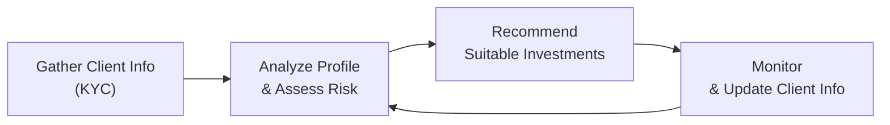

## 1.5 Why are The Know Your Client Rule and Suitability Important?

Picture this: You walk into a financial advisor’s office, ready to set up a plan for your future. You’ve saved some cash, you’re excited (and maybe a bit nervous), and you don’t quite know which investments make sense. Then your advisor says, “Uh, so… how much do you have, and do you want to buy some stocks?” That’s basically skipping all the important steps to determine what you really need, right? And that’s where the Know Your Client (KYC) rule and the principle of Suitability come into play. They’re not just fancy industry buzzwords; they form the bedrock of responsible investing and ethical advice in Canada’s securities environment.

This section explores the KYC (Know Your Client) requirement in depth, outlines the essential Suitability assessment process, and highlights why both are so important for both the advisors (or mutual fund sales representatives) and the clients they serve. We’ll trace these rules back to some regulatory references (like CIRO and CSA), offer practical examples, and hopefully ease any confusion along the way.

Remember: these guidelines aren’t just for compliance’s sake. They safeguard investors by ensuring their money is allocated in an informed, appropriate manner. Failing to follow them can mean real consequences—financially, professionally, and legally. So let’s dive in.

  
### The Cornerstone: Know Your Client (KYC)

The KYC rule is exactly what it sounds like: You, as a mutual fund sales representative (or any investment advisor, really), must do your best to truly understand your client’s personal and financial situation. If you don’t know who your client is, you can’t possibly give proper advice. That’s the bottom line.

• Personal Circumstances: You need to figure out basic facts like the client’s age, family setup, employment status, future goals, and timeline for investments. Is your client a recent grad paying off student loans, or a retiree living off pension income? That makes a huge difference in how you’ll shape recommendations.  
• Financial Details: This includes the size of their current assets, liabilities, monthly cash flow, and net worth. Do they own a home? Are they renting? How much disposable income do they realistically have to invest?  
• Investment Background and Experience: Are they financial newbies, or seasoned market veterans who read The Economist daily? Understanding a client’s previous forays into investing helps you gauge how much risk might be acceptable.

#### Why KYC Protects Everyone

• Investor Protection: Without KYC, an advisor could give risky or ill-fitting recommendations. Clients can end up confused or frustrated, and perhaps lose money they can’t afford to lose.  
• Regulatory Compliance: CIRO (the Canadian Investment Regulatory Organization) sets and enforces the KYC rule in Canada. Non-compliance can result in fines or suspensions.  
• Professional Integrity: If an advisor doesn’t do proper KYC, their reputation usually tanks. Word gets around, and you lose trust—arguably the biggest asset in this field.

#### Ongoing Nature of KYC

Ever tried sticking to the same workout routine you had ten years ago? Your lifestyle and needs have probably changed. It’s the same with KYC. You never do it once and forget it. You have to keep checking in with clients. Did they get married, have kids, or lose a job? Are they about to send their kids to college or retire early? These life changes mean your recommendations need to be updated.

  
### The Suitability Obligation

Once you gather the data from the KYC step, you must decide which products or strategies are suitable for the client. Suitability takes all that knowledge and funnels it into specific recommendations. Essentially, it’s saying: “Given this client’s goals, risk tolerance, resources, and time horizon, is recommendation X truly a fit?”

• Suitability Criteria:  
  – Investment Objectives (e.g., capital preservation, income generation, long-term growth)  
  – Risk Tolerance (e.g., conservative, moderate, aggressive)  
  – Time Horizon (e.g., short-term liquidity needs, multi-year investment timeframe)  
  – Investment Knowledge (how comfortable or experienced the client is)

Just because a product has historically high returns doesn’t mean it’s suitable. Some products carry higher volatility or liquidity constraints. If your client needs their money for a dream vacation in six months, you don’t want to tie it up in long-term, thinly traded securities.

  
### KYC + Suitability in Action

To see how this unfolds in real-life scenarios, consider the following mini case study:

• Elaine is 28, single, with a stable job in marketing. She has a small emergency fund and wants to start investing monthly toward a future home down payment. She’s curious about equities, but also feels jittery about stock market fluctuations.  
• After applying a risk profile questionnaire (e.g., from a recognized tool like Finametrica or Riskalyze), you find that Elaine has a moderate risk tolerance.  
• Because Elaine expects to buy a property in five years, you might suggest a balanced mutual fund (part equity, part bond), a short-to-medium-term bond fund, or a combination that doesn’t sacrifice too much liquidity and exposes her to a moderate level of market movement.  
• If you recommended a highly speculative small-cap equity fund that soared last year, that might not be suitable because it could equally plummet before she needs her money.  

Something as simple as that. But ignoring Elaine’s financial timeline and risk tolerance would be a big no-no in the eyes of CIRO, not to mention her own comfort level.  

  
### The Role of Documentation

A big chunk of KYC and Suitability is good documentation. After all, how would you remember the intricate details of every client’s profile if you don’t record them systematically? In practice, you’ll often use:

• Client Application Forms: Where you record the basic personal/financial info.  
• Risk Profile Questionnaires: Tools to learn about how each client perceives risk and reward.  
• Meeting Notes: Summaries of each chat with the client, including changes to circumstances.  
• Ongoing Reviews: Periodic statements and updates that encourage the client to raise any changes.

Documentation also proves—if regulators ask—that you did your job correctly. It’s evidence that you took the right steps and recommended suitable products based on the info you had.

  
### Regulatory Framework in Canada

If you’re curious where all these rules come from, it’s primarily a collaborative effort spearheaded by the Canadian Securities Administrators (CSA), the umbrella group of provincial and territorial securities regulators, and enforced by CIRO at a national level. Historically, MFDA and IIROC were separate SROs, but as of January 1, 2023, they amalgamated into the Canadian Investment Regulatory Organization (CIRO). Their combined rules and guidelines frame the modern approach to KYC and Suitability across all types of investment dealers and mutual fund dealers in Canada.

CIRO’s rulebook outlines specific KYC obligations (including National Instrument 31-103 – Registration Requirements, Exemptions and Ongoing Registrant Obligations, which also sets out that “registered firms and individuals must take reasonable steps to know a client’s financial circumstances”).

To learn more, check out the CIRO website at https://www.ciro.ca or the CSA site at https://www.securities-administrators.ca. You can also find reference materials like “Suitability: A Conscientious Advocate’s Method,” which provides a legal scholar’s perspective on fulfilling suitability obligations ethically and compliantly.

  
### Penalties and Risks of Non-Compliance

Most advisors do take KYC and Suitability seriously. But slip-ups can happen when rushing, overconfident, or simply negligent. And when mistakes occur:

• Client Financial Losses: If the recommendation is unsuitable and the market goes south, the client could lose more than they can afford.  
• Regulatory Actions: These might include fines, suspensions, or permanent bans from the industry.  
• Civil Lawsuits: Clients can sue for compensation if they believe you acted negligently or breached your obligations.  
• Reputational Damage: Word-of-mouth matters. One high-profile misstep can endure in the minds of potential clients—and the broader public—far beyond any official penalty.

It’s not a situation you want to be in, trust me. Personally, I recall a colleague who skipped an annual review with a client, only to discover much later that the client’s personal circumstances had changed dramatically. The portfolios that had once been just fine suddenly became totally misaligned with the client’s new situation. It cost the firm an official reprimand—and cost the colleague a lot of professional embarrassment.

  
### Suitability Is Not a One-Time Deal

The suit you bought five years ago might not fit you today. It’s the same with financial products. Suitability calls for ongoing monitoring and adjustments. When a client’s personal situation changes, the recommended investment strategy should be re-examined. Consider:

• New Additions to the Family: A child’s arrival can totally reshape financial priorities.  
• Major Health Events: A sudden disability or long-term illness can call for more accessible, lower-risk assets.  
• Early Retirement: This can compress the timeline for investments.  
• Layoffs and Career Shifts: A job loss reduces capacity for risk; a raise or new career might allow for different goals.

Keep the lines of communication open. Remind clients to let you know whenever something big happens in their lives. A proactive approach is your secret weapon here.

  
### A Visual Overview

Here’s a quick flowchart using Mermaid.js that captures how the KYC and Suitability process typically looks at a high level:

• Step 1: Gather all relevant client information (KYC).  
• Step 2: Analyze the data, focusing on risk tolerance, time horizon, and objectives.  
• Step 3: Make suitable suggestions.  
• Step 4: Continuously monitor, and if anything changes, circle back to Step 2.

  
### Best Practices and Common Pitfalls

• Best Practices:  
  – Use a structured client questionnaire and review it at least annually.  
  – Keep thorough notes of every client interaction.  
  – Offer educational resources so clients understand the rationale behind your recommendations.  
  – Encourage clients to be transparent about any major life or financial changes.

• Common Pitfalls:  
  – Relying on a “once and done” approach to KYC.  
  – Ignoring small details (like a client’s unexpected debt or near-future cash requirement).  
  – Making assumptions about risk tolerance without a formal assessment.  
  – Overlooking changes in the market environment that might suddenly render a once-suitable product inappropriate.

  
### Practical Examples and Real-World Scenarios

1. The Retiree with a Surprising Appetite for Risk  
   – Sometimes you’ll meet a retired person who still wants to keep a chunk of their portfolio in growth-oriented equities. While retirees often need stable income, not all are entirely risk-averse. If it aligns with their knowledge, goals, and ability to handle volatility, it may still be suitable.  

2. The Recent College Grad with Big Dreams  
   – A 22-year-old who’s just started working might say, “I want to quadruple my account in two years.” That’s a red flag if they also tell you they have monthly student loan payments and no emergency fund. Getting them to consider a diversified, slightly more conservative plan might be prudent, focusing first on a foundation of stable assets or building a small emergency fund.  

3. The Surprise Inheritance  
   – Imagine your client suddenly inherits a large sum. With more money in hand, they might have bigger or different investment goals, and even a new risk appetite. Promptly updating their KYC info paves the way for better tailored advice.

All these scenarios underscore that “Know Your Client” and “Suitability” can’t be reduced to a simple formula. There’s a strong human element that demands real conversation, empathy, and prudent decision-making.

  
### Tools and Technologies

Beyond pen-and-paper solutions, digital tools can help streamline the KYC and Suitability processes:

• Finametrica and Riskalyze: These are risk-profiling tools that measure a client’s comfort with market volatility. While not specifically Canadian, they offer standardized questionnaires.  
• CRM Systems: Customer relationship management (CRM) platforms help keep client data updated and secure. Many CRMs now integrate with risk assessment modules.  
• Open-Source Financial Calculators: Tools from public repositories (e.g., GitHub’s open-source financial libraries) can run quick portfolio analyses if you’re comfortable with coding or spreadsheets.

Using these tools can reduce human error and maintain consistent processes. But never forget the personal touch—technology can’t replace real dialogue.

  
### Strengthening the Advisor-Client Relationship

One of the great side effects of a thorough KYC and Suitability process is a stronger, more trusting advisor-client relationship. Clients can sense when you’re genuinely interested in their well-being. It’s not unusual to spend more time listening than talking at the beginning. By hearing about their fears, hopes, and what they genuinely understand about investing, you build a collaborative environment. That means fewer misunderstandings, fewer impulsive decisions, and better long-term results—for both parties.

  
### Drawing Connections Throughout the Course

You’ll see references to KYC and Suitability popping up in various other chapters of this handbook:

• Chapter 4 on “Getting to Know the Client” delves even deeper into the practical steps of client communication and planning.  
• Chapter 5 on “Behavioural Finance” will talk about biases—like overconfidence or loss aversion—that color the KYC process (because clients won’t always fully realize their biases).  
• Chapter 17 on “Mutual Fund Dealer Regulation” covers all sorts of regulatory obligations, including KYC rules, account opening formalities, and how these revolve around CIRO guidelines.

Keep these links in mind. They’re not just repeated content; they help form a consistent framework so you can confidently navigate the obligations of a mutual fund sales representative.

  
### Further Resources and References

• CIRO: The Canadian Investment Regulatory Organization, https://www.ciro.ca  
• Canadian Securities Administrators (CSA): https://www.securities-administrators.ca  
• National Instrument 31-103 – Registration Requirements, Exemptions and Ongoing Registrant Obligations  
• “Suitability: A Conscientious Advocate’s Method” – A scholarly look into the ethical and legal underpinnings of Suitability  
• Online Tools like Finametrica or Riskalyze for standardized risk profiling questionnaires  

Check them out for more nuanced discussions on compliance, risk measurement, and ethical considerations.

  
### Conclusion

So, is the KYC rule and Suitability principle just about ticking a box to comply with regulations? Definitely not. They serve as the backbone of responsible, empathetic, and successful financial advising. By understanding who your client is and aligning products with their unique profile, you build trust, minimize risk, and help clients reach their goals in a sustainable way.

Sure, it requires extra time and diligent record-keeping. But from the client’s perspective, it’s exactly what they (and regulators) expect: a personalized approach that puts their interests first. Get these elements right, and you’ll stand out as a professional who truly cares about your clients’ well-being.  

  
## Essential KYC and Suitability Principles Quiz



### Which statement best describes the Know Your Client (KYC) rule?

- [ ] It’s only concerned with obtaining a client's signature on the risk disclosure documents.
- [x] It’s a requirement that the representative gather essential personal, financial, and investment information about the client.
- [ ] It means the client must report all daily transactions to the dealer.
- [ ] It’s used exclusively to compare performance against benchmarks.

> **Explanation:** The KYC rule requires the representative to obtain and evaluate sufficient information about the client’s personal and financial situation, risk tolerance, and objectives. Simply obtaining a signature is not enough.

### What is the primary purpose of Suitability in the investment process?

- [x] To ensure recommended investments match the client’s objectives, risk tolerance, and financial status.
- [ ] To evaluate if the client is willing to pay high fees.
- [x] To safeguard both the client and the advisor by making proper, risk-appropriate recommendations.
- [ ] To simplify all documentation requirements.

> **Explanation:** Suitability is about giving advice aligned with the client’s unique profile, including their goals, knowledge, and risk appetite. It also benefits the advisor by reducing legal and regulatory risks.

### Why is KYC an ongoing process rather than a single event?

- [x] Because clients’ objectives, financial circumstances, and risk tolerances can change over time.
- [ ] Because regulators demand weekly re-assessment.
- [ ] Because it helps advisors track the client’s daily expenses.
- [ ] Because it applies only to short-term accounts.

> **Explanation:** KYC must be continually updated as personal and financial contexts evolve. This ensures recommendations remain appropriate and timely.

### What could happen if a representative fails to follow KYC and Suitability requirements?

- [x] The representative and dealership may face regulatory penalties and client lawsuits.
- [ ] The client's investments automatically become insured against losses.
- [ ] The client is likely to receive better returns.
- [ ] It has no real consequences if the markets are stable.

> **Explanation:** Non-compliance can lead to serious ramifications, including legal actions, fines, suspensions, or reputational harm.

### Which of the following is a best practice for ensuring Suitability?

- [x] Recurring reviews of a client’s risk profile and investment objectives.
- [ ] Recommending only the highest-yield fund you can find.
- [x] Maintaining thorough records of client consultations.
- [ ] Avoiding all discussion of potential risks.

> **Explanation:** Suitability is not about guesswork; it involves regular reviews, proper documentation, and clear disclosure of risks.

### How does a risk profile questionnaire assist in the KYC process?

- [x] It helps identify a client’s comfort level with gains and losses.
- [ ] It guarantees markets won’t fluctuate.
- [ ] It automatically picks the best mutual fund.
- [ ] It focuses on advisors’ commission structure.

> **Explanation:** Risk questionnaires help quantify a client’s tolerance for volatility, making it easier to tailor appropriate recommendations.

### What type of client changes often prompt a new Suitability review?

- [x] Marriage, career shifts, inheritance, or major health issues.
- [ ] Basic details like a client’s favorite color.
- [x] Changes in the client’s net worth or family situation.
- [ ] General talk about economic news on television.

> **Explanation:** Major lifestyle changes, new financial resources, or unexpected events typically require a re-assessment to ensure the portfolio still aligns with the client’s objectives and risk profile.

### What is the most direct benefit of thorough KYC and Suitability practices for the client?

- [x] Recommendations that fit the client’s specific needs and tolerance for risk.
- [ ] Guarantees that all investments will make a profit.
- [ ] Access to secret market information.
- [ ] Fewer disclosure documents to sign.

> **Explanation:** By tailoring investment recommendations to the client’s personal and financial background, the advisor helps manage expectations and protect the client from taking on undue risk.

### Which of the following describes a common pitfall in applying Suitability?

- [x] Failing to update a client’s profile after significant life changes.
- [ ] Maintaining accurate, detailed records of every meeting.
- [ ] Asking client questions about risk tolerance.
- [ ] Suggesting a balanced portfolio for a moderate investor.

> **Explanation:** Suitability requires diligence over time. Not updating a client’s profile is a major oversight and can render previous recommendations unsuitable.

### The Canadian Investment Regulatory Organization (CIRO) was formed as an amalgamation of MFDA and IIROC, effectively:

- [x] Overseeing both investment dealers and mutual fund dealers in Canada since 2023.
- [ ] Replacing the Canadian Securities Administrators (CSA).
- [ ] Eliminating all compliance responsibilities.
- [ ] Only enforcing federal banking regulations.

> **Explanation:** CIRO merges the roles of the former MFDA and IIROC, creating a single regulatory body for the investment industry. It does not replace the CSA or remove compliance requirements; it centralizes them.


