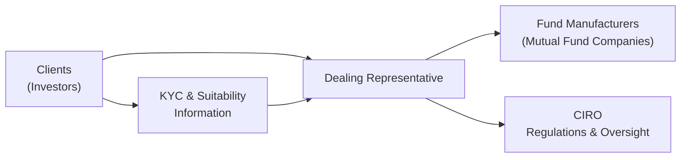

## 1.6 What is the Role of a Mutual Fund Sales Representative?

Being a Mutual Fund Sales Representative, also known under the official regulatory title of Dealing Representative, is about so much more than just showing customers a list of funds and hoping they buy something. If you’ve been thinking, “Isn’t this just another sales job?”—well, I get it. I remember my first foray into the financial world, standing behind the desk at a small advisory branch, nervously flipping through prospectuses. I thought my job was to simply talk about performance numbers and maybe some risk factors. But as I soon discovered, this role often involves being part educator, part problem-solver, and yes, part financial therapist (people can get pretty emotional about money, after all).

Below, we’ll dive into the unique responsibilities that define a Mutual Fund Sales Representative’s job in Canada. We’ll break down the skills, knowledge, ethical obligations, and compliance requirements needed to thoroughly serve clients and meet the high professional standards expected by the Canadian Investment Regulatory Organization (CIRO). We’ll also explore how real-world examples, close collaboration with other professionals, and diligent record-keeping combine to form the backbone of this critical function in the financial industry.

  
### Evolving Purpose and Core Responsibilities

The main mission of a Mutual Fund Sales Representative is to be the bridge between the client—who needs guidance on how best to invest—and the fund manufacturers, who produce mutual funds with a variety of objectives, strategies, and risk tolerances. Essentially, you’re the frontline professional helping people to understand and navigate the world of mutual funds, whether they want to achieve short-term goals (like saving for a car) or long-term dreams (like building retirement wealth).

But it’s not just about explaining product features. A key component of being a Dealing Representative is proactively staying on top of market trends, economic indicators, and regulatory changes. You’re also responsible for collecting and understanding all relevant details about your clients—from their risk tolerance and existing asset mix to their life goals and personal timelines. Armed with that knowledge, you can recommend funds or portfolio structures that genuinely fit their situation. As you’ll see in Chapter 1.5 on the Know Your Client (KYC) rule and suitability requirements, it’s not enough to simply pitch the “flavour-of-the-month” fund. You need to ensure that every recommendation is suitable given the client’s overall profile and best interests.

#### Client Education and Empowerment
Representatives don’t just make suggestions; they also empower clients through education. Let’s say you have a client who’s never really followed the stock market. They might have heard terms like “NAV,” “MER,” or “bond duration,” but they have zero clue what they actually mean. Part of your job is to break it down into plain language:

• What does it mean when a fund invests in equities, and how might that correlate to higher (but potentially more volatile) returns?  
• What are the tax implications for different types of funds? (See Chapter 6 on Tax and Retirement Planning for a deeper look.)  
• Why is understanding your client’s time horizon so critical to picking the right blend of conservative vs. growth-oriented funds?

During the process, it’s super helpful to equip clients with open-source tools (for instance, publicly available portfolio trackers, expense calculators, or educational resources offered by FP Canada) to help them grasp the “how” and “why” of their investments. This approach is vital for client retention because a well-informed client is more likely to feel confident and committed to their long-term investment strategy.

  
### Balancing Sales Targets and Client Best Interests

It’s no secret that sales targets and revenue generation are important—hey, we all have mortgages, families, and offices to keep running. However, one of the fundamental pillars of the Mutual Fund Sales Representative role is adhering to the principle of acting in your client’s best interest. This means if a client’s objectives align with a relatively conservative approach, you don’t push them into high-risk emerging market funds just to meet your monthly quota. Instead, you recommend solutions that truly match their timeline, risk tolerance, and growth expectations.

Under CIRO regulations (see Chapter 17 on Mutual Fund Dealer Regulation), representatives have accountability measures designed to ensure compliance and ethical behaviour. This includes independent reviews and potential spot-checks of recommendations, as well as the broader guidelines set by FP Canada if you’re working under a financial planning capacity. The essence of these regulations is to encourage a robust culture of honesty, transparency, and professionalism—an environment where the client can feel secure that their best interests come first.

  
### Collaboration with Other Professionals

Ever find yourself dealing with a client who has tax questions so complicated you feel like you need a PhD in accounting to unravel them? That’s precisely where collaboration comes in handy. A Dealing Representative often needs to coordinate with:

• Tax specialists or accountants for matters related to tax efficiency, estate planning, or complex corporate structures.  
• Portfolio managers, particularly if the client holds more advanced asset allocations involving derivative strategies or global diversification.  
• Insurance advisors if the client’s overall financial plan includes life or disability coverage, or if they’re looking into segregated funds (explored in Chapter 13 under Alternative Managed Products).

I remember the day a client brought a puzzle-like scenario: a small business owner wanting to invest corporate funds while also ensuring estate liquidity. We ended up creating a cross-functional team that included an accountant, a lawyer, and me—pipe in hand, metaphorically speaking. The synergy allowed us to address each angle: legal, fiscal, and investment strategy. That’s where the role of a representative goes beyond just “selling.” It’s about orchestrating the various components of a person’s financial life so the plan is cohesive.

  
### The Importance of Record-Keeping

Let’s be honest: record-keeping can feel a little dull sometimes. You might think, “Why do I need to store all these PDFs, keep track of every phone call, or ensure I get signatures for each step?” But from a compliance perspective—and from a practical one—thorough record-keeping is non-negotiable. Think of it like a well-organized library of a client’s financial life. It’s not just there for show; it’s there for your protection and the client’s protection.

If a client later has questions about why a particular recommendation was made, you can point to the conversation notes, the risk-tolerance questionnaire, the KYC updates, and the product disclosures. Furthermore, CIRO’s rules and standards for record-keeping are quite explicit. In the unfortunate event of disputes or audits, your documentation trail can make the difference between a smooth resolution and a messy legal ordeal. Chapter 17 (Mutual Fund Dealer Regulation) digs deeper into these regulatory specifics.

  
### Ethical Foundations: Suitability and Client Best Interest Standards

Dealing Representatives operate under something called “Client Best Interest Standards,” meaning everything you do must, at its core, benefit the client. This involves:

• Fully disclosing fees, commissions, and potential conflicts of interest.  
• Providing risk-adjusted performance information (for a glimpse into performance evaluation, check out Chapter 14).  
• Recommending products that align with the client’s risk profile, as established during the KYC process.  
• Refusing to engage in prohibited selling practices like misrepresentation or high-pressure tactics.

It might feel awkward at first to say, “Hey, let me outline all my commissions and possible conflicts,” because you might worry it’ll scare clients away. But ironically, transparency about compensation often fosters greater trust. Clients appreciate open dialogue about how you’re compensated and why you’re not just pushing products for a bigger bonus. Over the long haul, that trust forms the bedrock of a lasting client relationship—one built on credibility, not hidden agendas.

  
### A Scatter of Practical Examples

Let’s say you’re dealing with a new client named Mia. She’s 40 years old, single, has a moderate risk tolerance, and wants to retire by 65. She’s well-situated in her career, but she’s worried about potential market downturns. As a Mutual Fund Sales Representative, you’d typically:

• Conduct a thorough KYC interview with Mia, capturing her income, current savings, retirement goals, and comfort with volatility.  
• Educate her about different classes of mutual funds: from balanced funds that blend equities and fixed income (Chapter 12 explores equity and balanced mutual funds) to more conservative bond-heavy funds (discussed in Chapter 11).  
• Possibly illustrate the effect of compounding growth over 25 years and the historical risk-return profiles of different asset mixes.  
• Keep thorough notes and have Mia sign off on the recommended strategy, logging every key detail for regulatory compliance.

Now, imagine a second scenario with a client named Dan, who wants growth at all costs, invests heavily in a single high-risk emerging markets fund, and regularly day-trades on the side. You discover that Dan’s financial situation—like no emergency fund, lots of consumer debt—doesn’t really support such speculative behaviour. In that case, your role is to advise him responsibly by showing him how this approach might clash with his best interests (and possibly your compliance obligations under CIRO). You’d document your recommendations, inform him of the risks, and maybe even suggest a diversified portfolio that includes some safer corners of the market, even if that reduces immediate growth potential.

These real-world scenarios highlight the varied nature of a Dealing Representative’s job. Sometimes you’re bridging knowledge gaps, other times you’re reining in an overly ambitious investor. In all cases, you’re wearing multiple hats: educator, guide, compliance officer, relationship manager—you name it!

  
### Visual Overview of the Mutual Fund Sales Representative’s Role

Here’s a simplified Mermaid diagram showing how a Dealing Representative sits at the intersection of clients, fund manufacturers, and the broader regulatory environment:

In this diagram:  
• Clients rely on the Dealing Representative for tailored advice.  
• The Dealing Representative connects with Fund Manufacturers to source the right products.  
• CIRO regulations (plus additional compliance frameworks) guide the representative’s conduct.  
• KYC details flow back to the Dealing Representative so that suitable investments are made on the client’s behalf.

  
### Empowering Clients Through the Full Financial Planning Approach

Even if you focus primarily on selling mutual funds, it’s good to understand how broader financial planning can help your clients. Chapter 4 outlines the steps involved in this process: establishing relationships, gathering data, analyzing financial needs, developing strategies, and monitoring the plan. Mutual funds often form just one piece of a bigger puzzle that also includes insurance, estate, and tax planning conversations. When you embed mutual fund advice within a holistic financial planning approach, you can better ensure your recommendations align with all aspects of a client’s life. 

FP Canada publishes interesting frameworks and practice standards for those who want to delve into comprehensive advice. If you’re looking to elevate your practice or become a Certified Financial Planner (CFP®) down the road, exploring those guidelines can help you integrate mutual fund recommendations into a broader financial blueprint.

  
### The Ongoing Need for Continuous Learning

Financial markets are fluid—and that’s an understatement! Economic cycles, interest rates, new product developments, and even political climates can all prompt changes in investment environments. If a new type of Alternative Mutual Fund (Chapter 13 covers these) emerges that’s highly suitable for conservative investors looking for a twist, you need to be aware so that you can evaluate whether it fits your clients’ needs.

This is why continuous education is not just a regulatory requirement, but also an integral part of serving your clients well. Courses offered by the Canadian Securities Institute (CSI) can deepen your understanding of advanced investment strategies, while CIRO frequently updates role-based competencies on their website (https://www.ciro.ca/). By staying up to date, you protect your clients, your practice, and your professional reputation.

  
### Common Pitfalls and How to Avoid Them

Let’s face it: the real world is messy. There will be times you make recommendations that don’t pan out perfectly. Clients might get frustrated. Market cycles can turn negative faster than you can say “correction.” Here are some potential pitfalls to be mindful of:

• Overlooking the client’s emotional reaction to market volatility.  
• Failing to adequately document the rationale behind a specific recommendation.  
• Ignoring changes in a client’s life situation (like job loss, marriage, or an inheritance) that could drastically alter their financial goals.  
• Becoming so fixated on sales targets that you forget to ensure each product truly meets the client’s best interest standards.

The best ways to mitigate these issues are open communication, rigorous record-keeping, and frequent portfolio reviews. Also, check out Chapter 5 on Behavioral Finance, which discusses investor biases and emotional pitfalls. You can use that knowledge to quell fears or moderate overconfidence.

  
### Personal Reflection on Authentic Client Relationships

I’ll always recall a conversation with a long-time client who’d just gone through a divorce. She was panicked about her finances, worried she wouldn’t have enough savings left for retirement. We spent a few meetings just talking—no immediate trades, no new fund purchases—just re-evaluating her financial and life goals. Eventually, we built a fresh plan that balanced her need for stability with a moderate dose of equity growth. That moment highlighted for me that a Dealing Representative’s real value is not the ability to recite interest rate predictions or top-performing funds, but to genuinely listen and empathize.

These interpersonal moments highlight how trust and emotional intelligence can be just as important as mastering the technical side of mutual fund sales. In fact, clients are more likely to follow through on recommendations if they believe the representative truly understands their concerns. So, never underestimate the importance of empathy in this profession.

  
### Emphasizing Continuous Compliance and Ethics

You’ll often hear that compliance is “everyone’s responsibility.” For Dealing Representatives, this is undeniably true. This means:

• Ensuring all recommendations adhere to the regulation guidelines laid out by CIRO.  
• Keeping your registration current and up to date.  
• Disclosing all material facts to clients—especially potential conflicts of interest or compensation structures.  
• Participating in ongoing compliance training or continuing education units (CEUs).

Chapter 17 is dedicated to mutual fund dealer regulation and details the account-opening process, prohibited selling practices, and the steps you must take to meet KYC rules. You might feel a bit swamped by all the rules at first glance, but rest assured, these safeguards exist to protect the investing public and preserve trust in the industry. Embracing them wholeheartedly can actually enhance your credibility and help you build a long-term, stable practice.

  
### Tying It All Together

The role of a Mutual Fund Sales Representative spans from educator and advocate to compliance officer and strategic coordinator. You’re bridging the gap between clients—who come with unique life goals and varying levels of investment knowledge—and the vast arsenal of mutual fund resources available. By always prioritizing the client’s best interests, collaborating with experts in related fields, and staying on top of changing regulations, you’ll cultivate a practice rooted in integrity, professionalism, and client satisfaction.

For additional insights and deeper skills, you can reference the following:  
• CIRO’s role-based competencies: [https://www.ciro.ca/](https://www.ciro.ca/)  
• FP Canada’s professional guidelines and standards: [https://www.fpcanada.ca/](https://www.fpcanada.ca/)  
• The Canadian Securities Institute’s advanced courses on mutual funds and financial advisory strategies: https://www.csi.ca/

And remember, whether it’s the adrenaline rush of guiding a novice through his first balanced fund or the satisfaction of building a sophisticated portfolio for a seasoned investor, there’s tremendous reward in witnessing the tangible impact you can have on someone’s financial well-being. If you approach it with a genuine willingness to educate, empathize, and ethically serve, you’ll likely enjoy a fulfilling career that also fosters long-lasting client relationships.

  

## Test Your Knowledge of the Mutual Fund Sales Representative’s Role



### Which of the following statements best describes the core role of a Mutual Fund Sales Representative?

- [x] A professional who connects clients with suitable mutual fund products while adhering to KYC and best interest standards.
- [ ] A market analyst whose sole focus is forecasting mutual fund performance.
- [ ] A salesperson limited to presenting product brochures without client consultations.
- [ ] A back-office clerical worker who handles only administrative tasks.

> **Explanation:** The primary function of a Dealing Representative is to guide clients toward suitable mutual funds using thorough KYC practices, market knowledge, and ethical standards.

### What is one key reason that thorough record-keeping is crucial for a Mutual Fund Sales Representative?

- [x] It provides a detailed paper trail to support recommendations and meet CIRO compliance requirements.
- [ ] It helps representatives completely avoid disclosing commissions.
- [ ] It replaces the need for client conversations.
- [ ] It is only necessary for taxable accounts.

> **Explanation:** Keeping clear records of discussions, risk profiles, and recommendations creates transparency, better client service, and compliance with CIRO regulations.

### When might collaboration with external specialists (e.g., tax advisors) be important for a Dealing Representative?

- [ ] Only when a client holds more than one mutual fund.
- [x] When clients have complex tax, estate, or insurance needs that go beyond the representative’s direct expertise.
- [ ] Never; external specialists are typically unrelated to mutual fund sales.
- [ ] Only for high-net-worth investors with more than $1 million in assets.

> **Explanation:** Mutual fund representatives often encounter clients with multifaceted issues such as taxation, corporate structures, and estate planning. Collaboration ensures cohesive and comprehensive financial solutions.

### According to Client Best Interest Standards, a representative should:

- [x] Recommend products that align with the client’s long-term risk tolerance and objectives, regardless of sales commission potential.
- [ ] Suggest high-commission products first to meet sales goals faster.
- [ ] Avoid discussing fees to keep the conversation focused on performance.
- [ ] Only recommend the firm’s in-house funds to build company loyalty.

> **Explanation:** Best interest standards require transparency, suitability, and prioritizing the client’s needs over the representative’s or firm’s financial gain.

### Which of the following is an example of prohibited selling practices?

- [x] Pressuring a client to invest in a specific fund without addressing their risk profile.
- [ ] Advising a client of the potential risks before executing an order.
- [ ] Disclosing fee structures clearly to the client.
- [x] Providing suitable recommendations aligned with the client’s KYC data.

> **Explanation:** High-pressure sales tactics violate regulatory rules by disregarding the client’s unique needs and potentially undermining informed decision-making.

### Why is continuous education important for a Mutual Fund Sales Representative?

- [x] Financial markets, regulations, and product offerings evolve constantly, requiring up-to-date knowledge.
- [ ] It only matters for senior representatives.
- [ ] once someone is licensed, no further learning is required.
- [ ] It is less important than solely focusing on sales quotas.

> **Explanation:** Continuous education is essential to remain informed about regulatory changes, product innovations, and market shifts, ensuring that client recommendations are always relevant and valid.

### Which regulatory entity oversees mutual fund dealers today in Canada?

- [x] CIRO, which emerged from the amalgamation of IIROC and the MFDA in 2023.
- [ ] The Investment Industry Regulatory Organization of Canada (IIROC) in its current form.
- [ ] The Mutual Fund Dealers Association (MFDA) in its current form.
- [ ] No single entity governs mutual fund dealers.

> **Explanation:** As of 2023, the Canadian Investment Regulatory Organization (CIRO) is the national self-regulatory body overseeing investment dealers, mutual fund dealers, and marketplace operations.

### If a client is intimidated by finance terminology, what is a good approach for a Dealing Representative?

- [x] Simplify jargon, use analogies, and offer open-source tools or resources for better understanding.
- [ ] Advise them to seek a different representative who uses only technical language.
- [ ] Skip the details and focus on final recommendations to avoid confusion.
- [ ] Insist the client read hundreds of pages of technical documentation before making any choices.

> **Explanation:** A vital aspect of the representative’s role is educating clients in accessible ways, thereby empowering them to make confident investment decisions.

### Which chapter in this book further explores the regulatory requirements for Dealer Representatives, including the account-opening process and prohibited selling practices?

- [x] Chapter 17: Mutual Fund Dealer Regulation
- [ ] Chapter 5: Behavioural Finance
- [ ] Chapter 8: Constructing Investment Portfolios
- [ ] Chapter 14: Understanding Mutual Fund Performance

> **Explanation:** Chapter 17 is devoted to explaining how CIRO compliance rules, account openings, and prohibited selling practices function for mutual fund dealers in Canada.

### True or False: A Mutual Fund Sales Representative can be genuinely valuable to a client’s broader financial plan, even beyond selling mutual funds.

- [x] True
- [ ] False

> **Explanation:** A Dealing Representative can play a key role in the client’s financial life, including education, collaboration with other professionals, and overall strategic planning.


