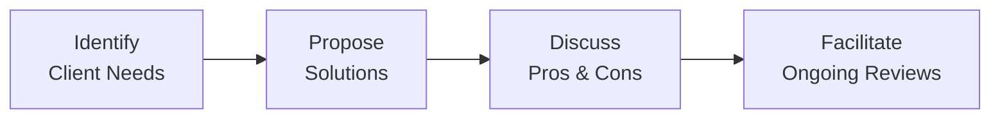
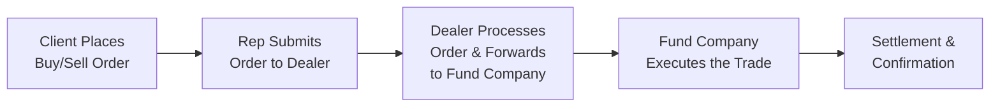

## 1.7 Mutual Fund Sales in Practice

Let’s dive right into one of the most important aspects of working as a Mutual Fund Sales Representative: how to navigate the actual sales process day to day. This is often the “in-the-trenches” work—talking to real people, figuring out what makes the most sense for them, and helping them meet their financial goals. One moment, you might be opening someone’s very first investment account, and the next moment, you might be rebalancing a large portfolio for a busy client who hasn’t had time to monitor their investments. 

I remember the first time I sat down with a client who was more anxious than excited about mutual funds. She told me, “Look, I’ve heard so many things about hidden fees, or that these funds might not actually do what I need them to do.” It was a great reminder that mutual fund sales aren’t just about ticking some boxes on a form; they’re about addressing personal concerns and matching products to specific needs. 

Below, we’ll explore the practical aspects of mutual fund sales, from opening the account to processing trades, plus the consultative approach that keeps clients engaged and comfortable. We’ll also look at best-practice disclosure methods and ongoing review procedures. All of these steps need to be carried out with full compliance in mind—particularly following the guidance set by the Canadian Investment Regulatory Organization (CIRO). If you’d like to explore CIRO’s most up-to-date rules, visit https://www.ciro.ca/rules-and-enforcement. 

Feel free to reference other chapters if and when you need a refresher: for example, 1.5 discusses the Know Your Client (KYC) rule, 1.8 reviews the broader regulatory environment, and so forth.

---

### Laying the Foundation: Consultative vs. Transactional Approach

If you’ve peeked at the mutual fund sales industry historically, you’ll notice that the approach used to be quite transactional: a client would come in and say, “I’d like to buy Fund X,” and the representative’s job was basically just to fill in the paperwork. But in the modern era—especially in the Canadian environment, guided by CIRO standards—the focus is far more consultative.

A consultative approach involves:  
• Identifying the client’s needs, goals, and risk tolerance.  
• Proposing potential solutions (i.e., suitable mutual funds or other managed products).  
• Discussing the pros and cons of each choice.  
• Facilitating ongoing reviews to ensure the client’s portfolio stays aligned with their objectives.

Below is a simple flowchart that summarizes this four-step consultative process:

• Identify Client Needs: This usually involves gathering KYC information—everything from financial circumstances to personal risk comfort.  
• Propose Solutions: Match the client’s needs with possible mutual funds. Keep your knowledge of markets and product features front and center here.  
• Discuss Pros & Cons: Transparency is critical. Clients won’t feel comfortable investing if they don’t know the potential downsides.  
• Facilitate Ongoing Reviews: Regular check-ins allow for portfolio rebalancing (when necessary) and keep the relationship strong.

---

### Opening Client Accounts

Opening a mutual fund account is often the first tangible step in this journey. You’ll gather personal information, have the client fill out a risk tolerance questionnaire, and discuss their time horizon—whether they’re saving for a house in five years or for retirement in twenty.  

This process typically includes completing a set of “Account Opening Documentation.” That might sound straightforward, but it can feel overwhelming for both you and the client if you’re new to it. Several documents must be filled out, including:  
• Personal Information Forms (Name, Address, Social Insurance Number, etc.).  
• KYC Data (Investment Objectives, Risk Tolerance, Time Horizon, Annual Income, Net Worth).  
• Any relevant compliance forms (e.g., identity verification, privacy disclosures).  

Try to keep the mood calm and supportive as the client signs these forms. “So,” you might say, “Let’s fill out a few details about your financial goals. It’s basically us learning exactly what you’re aiming for, so your investments can fit you perfectly rather than the other way around.” This approach helps highlight the purpose behind every signature.

---

### Completing Subscription Documents

The subscription documents formalize the purchase of a particular mutual fund. In practice, you’ll typically be guiding the client through forms that outline the fund’s details, fees, and redemption schedules. It can be a bit like reading the “Term and Conditions” for new software—there’s a lot of detail in there, but every piece is important.

One crucial piece of information is the “Fund Fact Sheet,” a concise summary of the fund’s objectives, past performance, fees, and risk level. In Chapter 10, you’ll find more on how mutual funds operate from top to bottom, but in the sales context, the real key is making sure the client actually understands the fund’s main characteristics before committing.

---

### Explaining Fund Fact Sheets in Plain Language

Clients often feel more at ease when you translate the dry facts of a fund into clear, everyday language:

• Investment Objective: “This is basically the fund’s mission statement—whether it’s growth, income, or a mix.”  
• Fees and Charges: “Here’s where you’ll see management expense ratios, any possible upfront sales commissions (if applicable), and ongoing costs. You want to pay special attention paid to how they might reduce your returns over time.”  
• Past Performance: “While historical returns don’t guarantee future results, it gives us a sense of how the fund has fared in different market conditions.”  
• Risk Level: “This rating is set by the fund company—often from Low to High—and it’s based on how volatile the fund’s returns have been.”

If a client is curious for deeper research tools, you might refer them to resources like Morningstar Canada (https://www.morningstar.ca/), where they can look up interactive charts and compare different funds side by side.

---

### Processing Trades

After the client is comfortable (and the subscription forms and disclosures are all done), you’ll move on to trade processing. In plain English, this means placing the order to buy or sell the mutual fund shares. Here’s a quick snapshot of the usual trade processing workflow:

• Client places buy/sell order: This might be in person, over the phone, or via an online platform (depending on the firm’s setup).  
• Rep submits order: You’ll typically use your dealer’s back-office system.  
• Dealer processes and forwards the order: This ensures compliance checks and documentation are in order.  
• Fund company executes the trade: The transaction is recorded at the day’s net asset value (NAV) if submitted before the market cut-off time, usually 4:00 p.m. EST.  
• Settlement & confirmation: The trade typically settles in one to three business days, depending on the type of fund. The client receives a confirmation notice detailing the transaction.

---

### The Role of Disclosure and Transparency

Disclosure is deeply rooted in ethical and legal responsibilities. For instance, you must always disclose:

• All fees and charges related to the purchase (e.g., management fees, deferred sales charges, early redemption fees).  
• The potential impact of these fees on the client’s net returns.  
• The fund’s risk classification and how it aligns with the client’s risk tolerance.  
• The presence of any conflicts of interest (e.g., if you receive additional compensation from certain funds).

In Canada, transparency isn’t just a best practice; it’s mandated by regulators like CIRO. If you discover that a client doesn’t fully grasp how deferred sales charges (DSCs) or management expense ratios (MERs) work, it’s time to pause and go over those details plainly. 

---

### Ongoing Monitoring and Rebalancing

Let’s say your client invests in a balanced mutual fund portfolio—maybe 60% equities, 40% bonds. Over time, the equity side might grow faster and end up at 70% of their portfolio, which, for some clients, can carry more risk than they originally wanted or can handle. That’s where “rebalancing” comes in.

Rebalancing is the act of bringing the portfolio back in line with the client’s desired asset allocation by selling or purchasing certain fund units. It’s a critical part of long-term portfolio management and should be done at least annually, or whenever there’s a significant shift in market conditions or in the client’s personal circumstances.

Earlier, when we discussed the consultative approach, we mentioned facilitating “ongoing reviews.” Here’s where that becomes concrete. You might set up a regular meeting—maybe every six or twelve months—to see if the client’s financial goals have changed or if the portfolio needs tweaking.

---

### Maintaining a Well-Structured Practice

Besides knowledge and empathy, a well-structured practice can make a world of difference. I once had a mentor who told me: “The best sales reps aren’t the best talkers, they’re the best listeners with a rock-solid system behind them.” Good systems include:

• Robust compliance protocols: Internal checklists so you don’t miss any key step—like verifying KYC data or obtaining the client’s signature on crucial forms.  
• Documentation procedures: Whether it’s a paper-based or digital platform, keep track of each interaction and every piece of data you collect.  
• Periodic training and continuing education: The financial world is always changing. New products, new regulatory updates, or new technologies can quickly make old approaches outdated.

CIRO requires all representatives to stay up-to-date with the rules in effect. Check out https://www.ciro.ca/rules-and-enforcement for the latest guidelines. Many professionals also complete continuing education modules through Canadian Securities Institute (CSI) or the IFSE Institute to keep their skill set sharp.

---

### Five Common Pitfalls and How to Avoid Them

Because we’re talking about real people’s money, there are plenty of ways the process can go wrong if you’re not careful:

Overlooking the KYC Update  
• Clients’ situations can change—maybe they got a raise, had a child, or inherited money. If your KYC isn’t up to date, you can’t recommend appropriate funds. 

Inadequate Disclosure  
• If a client doesn’t understand fees or redemption schedules, you risk damaging trust and even facing regulatory scrutiny.

Failing to Follow Up  
• Mutual funds aren’t “set it and forget it.” Without ongoing check-ins, you might miss big shifts in a client’s circumstances or the market.

Pushing a Single Product  
• Relying too heavily on one type of fund or failing to show alternatives can raise conflict-of-interest concerns and might not serve the client’s best interest.

Non-Compliance with CIRO Rules  
• Neglecting your compliance protocols or ignoring new rules can lead to fines—or worse.

---

### Real-World Scenario: The Overlooked Beneficiary

Just to put a personal spin on this, let me share a short anecdote: I once had a client who opened an account to buy a few mutual funds for her retirement. She was in her mid-50s, financially comfortable, and the process seemed straightforward. However, two years later, she told me she’d gotten married and wanted to change her beneficiary information as part of her estate planning. Imagine if I hadn’t followed up or updated her KYC? Her new spouse wouldn’t have been named, causing a potential legal headache down the line. 

The moral? Proactive follow-ups and keeping relevant documentation up to date save both the client and the representative from big hassles—sometimes emotional or legal—down the road.

---

### Integrating Technology into Your Practice

In modern mutual fund sales, technology is your ally. Online platforms, customer relationship management (CRM) tools, and client portals can streamline everything from e-signature collection to ongoing performance tracking. 

Many dealers have integrated direct links to external resources like Morningstar or fund company websites, letting you pop open interactive charts right in your office to show how a fund is doing in real time. This approach can significantly boost client engagement—nobody has to wait for a monthly statement if they can view it on an app.

That said, technology doesn’t replace personal interaction. Zoom calls or phone calls for those routine check-ins can be just as valuable as a face-to-face coffee meeting. The key is to match the client’s preference: some love digital tools, while others still prefer paper statements and in-person visits.

---

### Compliance Protocols in Action

It might feel a bit weird to talk so much about compliance, but it’s truly part of the daily routine (and safety net) for a good Mutual Fund Sales Representative. CIRO sets the national regulatory standard for best practices, including everything from how you open an account, to how you track performance, to how you share marketing materials. 

At your firm, you’ll likely have a “compliance officer” or “branch manager” who implements these rules on a day-to-day level. You might have a monthly meeting with them to ensure you haven’t overlooked anything. Keep a respectful and open dialogue with compliance—when an issue arises, it’s easier to fix it promptly with their support.

---

### Additional Resources

• CIRO’s Rules & Enforcement: https://www.ciro.ca/rules-and-enforcement  
• Morningstar Canada (https://www.morningstar.ca/): For fund research, comparisons, and screening.  
• Online educational platforms: CSI (https://www.csi.ca) and IFSE Institute (https://www.ifse.ca) offer courses that dive deeper into mutual fund sales practices, trade execution, and compliance regulations.  

Feel free to look back at Chapter 1.5 for a refresher on the Know Your Client (KYC) rule, or Chapter 1.8 to learn about the broader regulatory environment in Canada. And for an even deeper look at how a mutual fund is constructed and managed, you might find it helpful to glance at Chapter 10: “The Modern Mutual Fund” once you’re finished here.

---

### Practical Tips to Keep in Mind Daily

• Keep your KYC data current: Make a habit of confirming major changes in your client’s life.  
• Use visual aids: Charts, infographics, or short videos explaining fees can help demystify complicated topics.  
• Encourage questions: The more comfortable a client is asking questions, the stronger the relationship becomes.  
• Document everything: If it’s not documented, it didn’t happen—especially in regulatory eyes.  
• Stay educated: Regulations, products, and market conditions change quickly. Never stop learning.

---

### Bringing It All Together

Mutual fund sales in practice is really about people, processes, and compliance. You have a set of steps—account opening, subscription forms, explanations of fund fact sheets, trade processing, and ongoing monitoring. Then you’ve got compliance protocols that act as the guardrails. The consultative approach is the glue, keeping you and your clients aligned on common ground: ensuring the portfolio meets their evolving needs.

It’s okay to feel a bit overwhelmed at first; there’s a lot of detail in each of these steps. But the more you practice, the more you’ll develop a flow. Before you know it, you’ll be helping clients feel comfortable and confident in their investments, maybe even surprising yourself at how natural the process becomes.

Remember, you’re helping shape someone’s financial future, so be patient, transparent, and thorough. With the right mix of empathy, knowledge, and structure, your mutual fund sales practice will be a valuable service for clients, and it’ll meet the high standard expected by Canada’s regulatory framework—both historically from the MFDA and IIROC, and now primarily through CIRO.

---

## Essential Strategies for Mutual Fund Sales: Quiz



### Which step in the consultative approach involves discussing the potential upside and downside of a recommended fund?

- [ ] Identify client needs
- [ ] Propose solutions
- [x] Discuss pros & cons
- [ ] Facilitate ongoing reviews

> **Explanation:** In the third step of the consultative approach, you focus on disclosing both advantages and potential risks associated with a particular fund so that the client is well-informed.

### Which document typically summarizes the fund’s objectives, past performance, fees, and risk classification?

- [x] Fund Fact Sheet
- [ ] Subscription Agreement
- [ ] Client Relationship Form
- [ ] Prospectus Supplement

> **Explanation:** A Fund Fact Sheet is designed to give a concise overview of the fund’s main features, including its strategy, fees, performance data, and risk rating.

### When does rebalancing typically occur in a client's mutual fund portfolio?

- [x] When the asset allocation drifts significantly from its initial target
- [ ] Only during the client’s yearly tax filing
- [ ] After every trade order, regardless of portfolio changes
- [ ] Once every five years, mandated by regulators

> **Explanation:** Rebalancing typically happens when the proportions between equities, fixed income, and other assets shift notably from the client's target allocation, often due to market movements or life events.

### What is the primary goal of KYC (Know Your Client) data collection?

- [x] To tailor investment recommendations to the client’s unique financial goals and risk tolerance
- [ ] To comply with marketing initiatives of the firm
- [ ] To minimize required disclosure
- [ ] To allow trading of unverified products

> **Explanation:** KYC ensures the representative’s recommendations match the client’s personal situation, including their capacity for risk, financial goals, and investment timeframe.

### Which tool is often used to compare different mutual funds on factors like performance and fees?

- [x] Morningstar Canada
- [ ] Canada Revenue Agency’s website
- [x] Firm’s internal marketing handout
- [ ] Canadian Investor Protection Fund’s website

> **Explanation:** Morningstar Canada provides fund comparisons (fees, performance, etc.) to help investors and representatives make informed decisions. Firms often have internal tools as well, though they may not be as comprehensive.

### Why is transparency about fees particularly important in mutual fund sales?

- [x] Clients need to know how fees can impact long-term returns
- [ ] Only regulators care about fees
- [ ] Fees rarely affect overall performance
- [ ] Fees are not publicly disclosed

> **Explanation:** Fees can significantly influence a fund’s net returns. Disclosing them openly helps clients make informed decisions and maintains trust.

### Which of the following is least likely to be included as part of the account opening documentation?

- [x] Transfer of Title Deeds for a house
- [ ] KYC data (risk tolerance, objectives)
- [x] Personal identification documents
- [ ] Client consent regarding electronic delivery of documents

> **Explanation:** Title Deeds for a house are not relevant to the typical mutual fund account opening process, whereas KYC data, proof of identity, and e-delivery consent are standard components.

### What is the main purpose of periodic training for mutual fund representatives?

- [x] To stay updated on product changes, regulatory shifts, and best practices
- [ ] To learn basic office administration tasks
- [ ] To eliminate the need for compliance checks
- [ ] To perform personal tax filings for clients

> **Explanation:** Continuous professional development ensures representatives remain knowledgeable about the latest regulations, product innovations, and industry standards.

### Which regulatory body currently oversees mutual fund dealers in Canada?

- [x] CIRO, formed from the amalgamation of MFDA and IIROC
- [ ] The defunct Mutual Fund Dealers Association (MFDA)
- [ ] A provincial agent for each province
- [ ] The Canadian Investor Protection Fund (CIPF)

> **Explanation:** Since January 1, 2023, the Mutual Fund Dealers Association (MFDA) and the Investment Industry Regulatory Organization of Canada (IIROC) no longer exist as separate entities. They merged into the Canadian Investment Regulatory Organization (CIRO).

### The consultative approach to mutual fund sales is primarily aligned with which type of client interaction?

- [x] Relationship-focused, emphasizing ongoing reviews and personalized solutions
- [ ] Strictly product-focused, with minimal client interaction
- [ ] Marketing-driven, prioritizing new fund promotions over client needs
- [ ] Fee-based, excluding all other aspects of client service

> **Explanation:** A consultative approach prioritizes the relationship with the client, focusing on continuous engagement, tailored recommendations, and recurring portfolio reviews.


