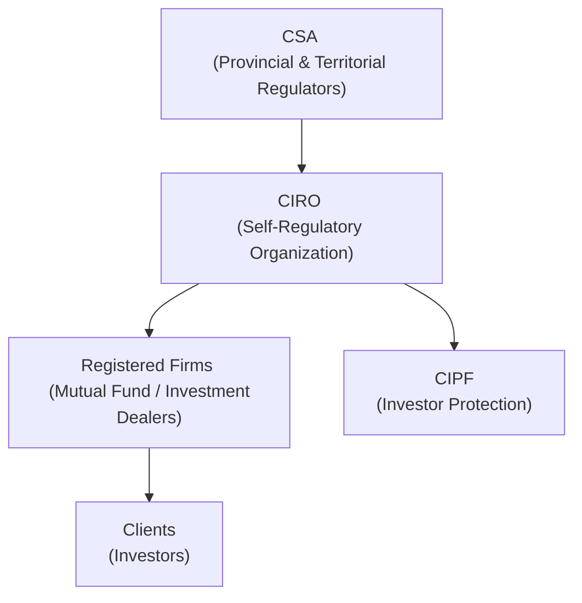

## 1.8 The Regulatory Environment in Canada

Imagine you’re just starting out in the mutual fund industry. You’re excited—maybe even a bit nervous—about the idea of guiding clients and helping them invest for the future. Then you discover there’s a web of rules, regulations, and oversight bodies you need to understand. Yep, that can feel overwhelming. But don’t worry—this section aims to help you make sense of these layers of protection and structure. The Canadian securities regulatory environment is designed to ensure that market participants, including you, operate under guidelines that protect investors and promote efficient capital markets. 

Below, we’ll unravel essential concepts, including how various regulators coordinate, what responsibilities you’ll have, and where to look if you want to dig deeper into official regulations. We’ll also discuss the newly formed Canadian Investment Regulatory Organization (CIRO) and how it sits atop Canada’s self-regulatory side of the industry. By the end, you should feel more comfortable (and maybe even slightly relieved) about how everything ties together.

## The Purpose and Scope of Regulation

Securities regulators in Canada protect investors and maintain trust in financial markets. That goal might sound simple, but the system that implements it is far-reaching. In practical terms, the regulatory environment covers:

• Ensuring investment products (like mutual funds) are distributed legally and fairly.  
• Overseeing dealers and advisors to ensure they act ethically and in the best interests of their clients.  
• Providing frameworks for ongoing compliance, such as disclosure rules and suitability assessments.  
• Enforcing rules around product manufacturing, distribution, marketing, and fees.  

All these elements exist so that your clients—perhaps someone like your neighbor saving for retirement or a friend investing for their child’s education—can make informed decisions in a stable marketplace. When you realize how these layers protect the people you care about, it feels more meaningful than just, “Here are a bunch of rules.”

## The Emergence of CIRO

If you spent any time in Canadian financial services before 2023, you’d have heard of the Mutual Fund Dealers Association of Canada (MFDA) and the Investment Industry Regulatory Organization of Canada (IIROC). Well, as of January 1, 2023, they amalgamated into one new self-regulatory organization. This new body was renamed the Canadian Investment Regulatory Organization (CIRO) on June 1, 2023. 

In other words, CIRO is now Canada’s single, national self-regulatory organization (SRO) overseeing:

• Investment dealers  
• Mutual fund dealers  
• Marketplace integrity and regulation for equity and debt securities  

When the MFDA and IIROC existed as separate entities, it occasionally led to confusion—especially for new representatives. You’d wonder, “Which SRO do I report to if I’m dealing with both mutual funds and certain other equities?” That complication is (mostly) gone. CIRO is now your main SRO. 

Even though MFDA and IIROC are referenced historically, all new or ongoing rules, guidance, and resources come from CIRO. So, if someone mentions the old MFDA or IIROC, just remember: they are defunct. CIRO is where you turn for the latest requirements on sales practices, complaint handling, and other investor protection guidelines.

## Coordinating with the CSA

Alongside CIRO, you’ll see references to the Canadian Securities Administrators (CSA). The CSA is a cooperative body made up of each province and territory’s securities regulator (e.g., Ontario Securities Commission, Autorité des marchés financiers in Quebec, etc.). While each province has its own physical office, they communicate through the CSA to implement harmonized rules. 

Why multiple regulators instead of just one? Canada’s constitution places securities laws under provincial jurisdiction, which means each province and territory can pass its own legislation. But hey, no client wants to be left guessing about widely differing rules from one province to the next. So, the CSA works to streamline everything, creating “National Instruments” that apply across provinces. A key example is National Instrument 31-103, which outlines registration requirements and ongoing obligations for dealers and advisors. 

In day-to-day practice, if you’re a mutual fund sales rep, your firm will guide you on compliance with your home-province rules, but you’ll also see references to the CSA’s national guidelines—so it feels more or less consistent from coast to coast.

## A Visual Overview of Regulation

Sometimes a diagram can help show the relationships between these regulators and entities. Here’s a simple depiction in Mermaid.js. Just take a look below:

The CSA sets the overarching rules (legislation) through a network of provincial regulators. CIRO, as a self-regulatory organization, focuses on how the industry implements these rules, providing day-to-day oversight for registered firms and the representatives who work there. CIPF (Canadian Investor Protection Fund) stands alongside CIRO to protect client assets if a member firm goes insolvent.  

## Registration and Who Does What

When you’re a mutual fund sales representative, you must be “sponsored” or employed by a CIRO member firm. That’s your ticket to registration in the correct category, which in turn allows you to advise clients on mutual fund investments. Without this registration, you essentially can’t hang a shingle and call yourself a mutual fund pro. 

Your responsibility goes beyond simply getting registered. You must comply with guidelines on:

• Know Your Client (KYC)  
• Suitability  
• Ethical conduct  
• fee and cost transparency  

We’ll dive deeper into these obligations in other chapters, but it’s worth noting that the entire reason these rules exist is to keep the playing field fair and protect both you and your clients from unscrupulous practices.

## A Personal Glimpse into the Regulatory Maze

I clearly remember my first week as a rookie mutual fund rep—my manager dropped a thick binder on my desk. It was crammed with regulatory directives, client disclosure forms, and compliance checklists. Honestly, I was so overwhelmed, I considered that maybe I should’ve just stayed in my safe, cozy job at the local bank. But once I started digging in, I realized that these regulations weren’t about burying me in paperwork. They were actually providing a roadmap to ensure I was doing right by my clients. The binder, in all its monstrous size, was my manual to ethical, client-focused service. 

For you, that sense of security comes from the knowledge that robust systems are in place if a conflict arises. If you follow the guidelines—respect KYC, keep up with continuing education, and so forth—you’ll find that compliance is actually your ally. It keeps your practice disciplined and your clients trusting in you.

## The Assessment-Centric Proficiency Model

Early in your career, you might hear rumblings about the “Assessment-Centric Proficiency Model.” CIRO has proposed a shift where representatives demonstrate their abilities through performance-based assessments, rather than just passing a series of courses. The idea is to ensure that reps actually can apply regulatory knowledge in real-world situations. 

• If it’s approved by the CSA (which must review and bless these changes), the new model may require demonstration of real skills: reading client fact files, diagnosing suitable products, and so on.  
• It’s not official at the time of writing, but the industry is buzzing about how it could reshape the training and licensing path for new entrants.  

Why might you care? Well, if you’re reading this while the model’s still in development, you might be required to pass certain pilot assessments. Or maybe you’ll still take course-based exams. Either way, the message is: stay tuned! Regulatory requirements aren’t stagnant, so part of your job is to keep up with changes that influence your licensing path.

## Investor Protection and CIPF

Another major piece of the Canadian puzzle is investor protection. If, for instance, your dealer firm suddenly becomes insolvent (which hopefully never happens), the Canadian Investor Protection Fund (CIPF) is there as a safety net for client assets held by that firm. CIPF was formed when the MFDA’s IPC (Investor Protection Corporation) merged with CIPF on January 1, 2023. Now there is a single national fund that kicks in if a CIRO dealer goes under. 

But keep in mind that CIPF is independent from CIRO. It’s not part of the regulatory chain—rather, it’s a separate entity mandated to protect eligible client property, usually up to certain limits, held at member firms. It’s one of those behind-the-scenes safety measures that hopefully never gets tested but offers immense peace of mind to the investing public. 

## Case Study: A New Rep’s Registration Journey

Let’s say Olivia, a recent finance graduate, lands a job at a CIRO member firm. She’s bright-eyed and eager to start. Her new employer says, “We’ll register you as a mutual fund sales rep,” and helps her with the forms and the background checks. She also needs to pass recognized proficiency courses so she meets the baseline for product knowledge and ethical conduct. In the near future, she might be required to demonstrate specific competencies through an assessment-based system.

In her first few months, Olivia is introduced to the compliance department, where she is taught:

• How to document KYC information and maintain suitability notes  
• Which disclosure forms to provide clients before opening accounts  
• How to interpret her firm’s internal compliance manual, which references both CSA guidelines and CIRO rules  

At first, Olivia wonders why so many layers exist. But once she has her first nervous conversation with a client who’s worried about their retirement portfolio, Olivia appreciates the comfort in having robust frameworks. Rather than winging it, she can point to an established set of rules that help guide advice-giving and ethical practice.

## Common Pitfalls and How to Avoid Them

While the regulatory framework is there to help you, it’s easy to slip up. A few pitfalls:

• Failing to properly document client conversations: This can lead to compliance nightmares if a client complains you never asked about their risk tolerance.  
• Overlooking fee disclosure and cost transparency obligations: Clients must understand the fees associated with their mutual fund investments.  
• Taking shortcuts on KYC or suitability: Recommending an unsuitable investment can lead to regulatory scrutiny and potential disciplinary actions.  
• Not staying current with continuing education or proficiency updates: The rules evolve, and knowledge can become outdated quickly.  

Your best bet is to build good habits from day one. If you have a new checklist from your compliance group, utilize it. Ask for feedback from colleagues who have been around longer. Keep your records in shape, and if you ever feel something is a gray area, consult your firm’s compliance officer. They’re there to be a resource, not just enforcers.  

## Best Practices for Representatives

• Put clients first: Always remember the “client-first” principle. If a product doesn’t align with a client’s financial goals and risk profile, it’s not the right fit.  
• Cultivate continuous learning: Attend webinars, read circulars published by CIRO, and keep an eye on CSA updates. The better informed you are, the fewer compliance landmines you’ll step on.  
• Maintain thorough documentation: Good notes can defend your recommendations and demonstrate that you acted diligently.  
• Embrace technology: Modern “regtech” solutions can keep you up-to-date on compliance obligations, making sure you never miss an update to a regulation or a product transparency notice.  

## The Broader Financial Marketplace Context

The story doesn’t end with mutual funds alone. Many reps eventually expand into other financial products—insurance, segregated funds, ETFs, or even specialized offerings unique to certain client segments. The reason we mention this is that your knowledge of the regulatory environment for mutual funds sets the foundation for working with a broader set of products. But each product will likely have its own layer of regulatory guidelines (for instance, segregated funds are overseen by provincial insurance regulators).

Still, the fundamentals remain the same: KYC, suitability, thorough disclosure, and abiding by SRO guidance. If you keep these basics in mind, you’ll stand in good stead no matter what else you choose to sell or advise on.

## Looking Ahead: Why This Matters

You might be wondering: After reading about all these overlapping agencies and rules, is the system too complicated? The short answer is that while it might seem complex, the structure is designed to provide multiple layers of oversight. This ensures that if one layer misses something, another can catch it. Further:

• Your clients get peace of mind from investor protection funds like CIPF.  
• The emphasis on ethical conduct and full disclosure fosters trust in the broader financial markets.  
• A national SRO (CIRO) ensures consistent standards across Canada, reducing confusion.  

In an ever-evolving market—where new products pop up with new risks—there’s a comfort in knowing you can rely on an established, well-tested regulatory system. 

## Additional Resources

For those wanting to dive into original regulatory documents or official announcements, here are some key places to start:

• [CIRO official site](https://www.ciro.ca/)  
• [Canadian Securities Administrators](https://www.securities-administrators.ca/)  
• “National Instrument 31-103” – The gold standard for registration requirements and obligations.  
• “CSC” or “CPH®” educational materials from the Canadian Securities Institute, which break down specific topics in more depth.  
• Open-source tools for Canadian financial markets data, like certain GitHub repositories that track market changes, can be helpful if you’re a data enthusiast.  

If you’re curious about how licensing requirements might shift, keep an eye on both CIRO press releases and CSA notices. They’ll give you breaking news on whether the assessment-centric approach to proficiency is coming your way sooner rather than later.

## Conclusion

Canadian securities regulation may seem vast, but once you see how each piece of the puzzle fits together, you recognize the ultimate aim: protecting investors and ensuring a vibrant financial marketplace. CIRO, with the backing of provincial regulators under the CSA, champions the rules that keep dealers and representatives in check. For you, as an aspiring (or practicing) mutual fund sales rep, understanding this environment is critical. Know how to register, be aware of your duties, and always put client interests first.

In the next chapters, we’ll expand on more day-to-day application of these rules, from KYC and suitability to handling client complaints and much more. The lesson here is that strong regulations are your ally, not your enemy. Embrace them, keep learning, and build a practice that’s both compliant and client-centric.

## Mastering Canada’s Regulatory Framework: Your Quiz for Success



### Which entity currently acts as the single, national self-regulatory organization (SRO) overseeing mutual fund dealers and investment dealers in Canada?

- [ ] Canadian Investor Protection Fund (CIPF)
- [ ] Mutual Fund Dealers Association of Canada (MFDA)
- [ ] Investment Industry Regulatory Organization of Canada (IIROC)
- [x] Canadian Investment Regulatory Organization (CIRO)

> **Explanation:** MFDA and IIROC have amalgamated to form CIRO, which now oversees mutual fund dealers and investment dealers nationally.

### Why did the MFDA and IIROC amalgamate into CIRO?

- [x] To streamline operations under a single SRO and reduce confusion among dealers and investors.
- [ ] To reduce investor protection coverage.
- [ ] To eliminate provincial licensing requirements.
- [ ] Because the federal government mandated a single bank regulator.

> **Explanation:** The primary goal was to bring consistency, clarity, and efficiency to the self-regulatory framework through one entity—CIRO—rather than two separate ones.

### What is the main purpose of having multiple provincial regulators coordinated through the CSA?

- [ ] To make provincial regulations different from each other.
- [ ] To replace SRO responsibilities entirely.
- [x] To harmonize and streamline securities rules across Canada, despite provincial jurisdiction.
- [ ] To create competing regulations so dealers can choose their regulator.

> **Explanation:** Securities law is under provincial jurisdiction, so the CSA was formed to coordinate across all provinces and territories, leading to consistent national regulations.

### Which statement best describes CIPF (Canadian Investor Protection Fund)?

- [ ] CIPF is a government agency for prosecuting fraud.
- [x] CIPF provides coverage for client assets if a CIRO member firm becomes insolvent.
- [ ] CIPF eliminates the need for KYC rules.
- [ ] CIPF sets the interest rates for fixed-income products.

> **Explanation:** CIPF protects eligible client property if a member firm goes bankrupt, ensuring investors don’t lose their custody assets due to firm insolvency.

### What does “assessment-centric proficiency model” refer to?

- [x] A proposed model where reps demonstrate real skills through performance-based evaluations.
- [ ] A mandatory additional fee structure measured by sales.
- [x] A design for competency requirements to focus on practical, on-the-job applications rather than just course completion.
- [ ] A methodology that automatically grants registration without exams.

> **Explanation:** CIRO has proposed that proficiency center on practical skills assessments, aiming to ensure that representatives can apply their knowledge in real-life scenarios.

### Which of the following actions best helps you avoid compliance pitfalls?

- [x] Keeping thorough documentation of all client interactions.
- [ ] Recommending the highest-fee product to maximize dealer revenue.
- [ ] Assuming the firm will cover any compliance oversight.
- [ ] Avoiding ongoing education requirements since they are optional.

> **Explanation:** Thorough documentation is key to supporting the suitability of recommendations and demonstrating compliance with KYC regulations.

### How can new mutual fund representatives stay current on regulatory changes?

- [x] By regularly reading CIRO bulletins and CSA notices.
- [ ] By ignoring any new guidance until their firm announces it.
- [x] By completing required continuing education and attending webinars.
- [ ] By relying on second-hand information from peers without confirmation.

> **Explanation:** Official communications and continuing education events keep reps informed of the latest regulatory developments, including rule changes and new guidance.

### Why do provinces each have their own securities commissions?

- [ ] To compete against each other for regulatory fees.
- [ ] To ensure each territory can create opposing rules for dealers.
- [ ] To make it more difficult for mutual fund reps to register.
- [x] Because securities regulation falls under provincial jurisdiction in Canada’s constitution.

> **Explanation:** Under the Canadian constitution, securities oversight is the responsibility of provincial and territorial governments, which coordinate through the CSA.

### What is the main purpose of the Know Your Client (KYC) rule?

- [x] To ensure that investment recommendations align with a client’s financial situation, objectives, and risk tolerance.
- [ ] To allow reps to bypass normal registration requirements.
- [ ] To force clients to reveal their net worth publicly.
- [ ] To guarantee that all clients must buy only GICs.

> **Explanation:** KYC is about collecting and understanding client data, including risk profile and investment objectives, so that suitable recommendations can be made.

### True or False: The creation of CIRO means the MFDA IPC has replaced CIPF as the main investor protection fund.

- [x] False
- [ ] True

> **Explanation:** CIPF remains the main (and sole) investor protection fund; the MFDA IPC merged into CIPF on January 1, 2023, consolidating investor protection under CIPF.


