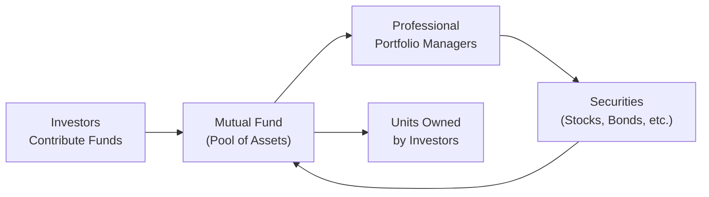

## 10.1 What is a Mutual Fund?

When I was a teenager, I remember flipping through the business section of my dad’s newspaper (yes, an actual paper newspaper!). One word kept popping up: “Mutual Fund.” At the time, it felt kind of mysterious—like a secret club for grown-ups. Now, looking back, I realize just how common and important mutual funds can be in helping folks invest, diversify, and aim for their financial goals. In this section, we’ll break down the core concepts in a friendly, informal way, so that the next time you see or hear about mutual funds, you’ll feel equipped to jump right in and say, “Ah, yes, I know what that is!”

---

### A Pool of Investments

At its simplest, a mutual fund is a big pool of money collected from numerous investors. This pooled capital is then used by professional portfolio managers to buy all sorts of different securities—like stocks, bonds, or money market instruments. Think of it like a giant bowl of mixed fruits: each piece (apple slice, banana piece, grape) is a security; together, they form a diversified fruit salad (the mutual fund) that aims to provide a balanced overall taste or a desired “flavor profile.”

Because these funds bring together money from potentially thousands of investors, you can tap into investing in more companies or bonds than you might realistically achieve on your own. That’s one of the big appeals: a range of investments, all wrapped up into a single fund that you can buy by purchasing units.

---

### Units: Your Slice of the Pie

When you hand over your money to invest in a mutual fund, you get back “units” (or shares) of that fund. These units represent your proportional ownership in the overall portfolio. So if the mutual fund was a literal pie, each unit would be one slice of that pie; the number of slices you own depends on how much money you put in relative to the fund’s total assets.

Here’s how it typically works:  
• You invest your money with the fund.  
• The mutual fund manager uses that money (plus everyone else’s) to purchase securities according to a defined strategy.  
• In return, you receive units that reflect your share of the fund’s net assets.

Ownership is proportionate. If you invest 1% of the total money in the fund, you effectively own 1% of its total assets (though not necessarily 1% of each security specifically—it’s more a matter of overall value).

---

### Diversification: The Secret Ingredient

Diversification simply means spreading your risk across a variety of investments. For example, if a mutual fund invests in multiple Canadian banks, some U.S. technology stocks, a handful of corporate bonds, and maybe a few government bills, you’re not putting all your eggs in one basket. This is a big deal for risk management: when one sector is underperforming, another might be doing better, smoothing out the overall bumps.

Some funds might aim for broad diversification across many industries, while others could be more specialized, focusing on a particular sector (e.g., technology) or region (e.g., emerging markets). But in any case, even a focused fund can often hold a basket of different securities to manage risk.

---

### Liquidity and Daily Pricing

Remember how my dad used to check the newspaper for stock prices? Well, mutual funds have something called a Net Asset Value per Unit (NAVPU). That’s the daily price at which you can buy or redeem your units. It’s calculated at the end of each business day. Essentially, the fund’s total assets—minus liabilities—are divided by the number of outstanding units to arrive at the NAVPU.

Because of this daily pricing, mutual funds are generally considered quite liquid. You can redeem (cash out) your investment on any business day (subject, of course, to any applicable redemption fees or back-end loads that might be part of the specific fund’s fee structure). This is one reason mutual funds are a popular choice for many investors: you’re typically not “locked in” for long periods like in some other investment vehicles.

---

### The Investment Mandate: Sticking to the Plan

Different funds have different goals or “investment mandates.” Some funds want to grow your money aggressively by focusing primarily on stocks. Others might look for slower, steadier growth through bonds and other fixed-income securities. Some funds aim for a balanced approach, mixing both growth and income. And guess what—some are specifically focused on providing short-term liquidity (like money market funds).

If, for instance, a mutual fund’s mandate is to invest in Canadian dividend-paying companies, then you shouldn’t expect it to go off-script and load up on European tech stocks. Managers are obligated to follow the fund’s stated strategy and objectives, which are outlined in legal documents like the simplified prospectus or the Fund Facts document.

---

### How the Value Changes Every Day

The value of the mutual fund goes up or down based on the market values of all the securities in the portfolio. If the stock market experiences a big upswing, you might see the NAVPU of your equity-heavy mutual fund rise. If the bond market dips, your bond fund’s price might reflect that. Essentially, it’s a rolling snapshot of the underlying investments’ performance.

It’s important to remember that mutual funds aren’t magic. They don’t eliminate risk—they just help manage it through diversification and professional management. The trade-off for that convenience and expertise is that you’ll pay management fees (and potentially other fees) to the fund company.

---

### Under the Hood: Legal Structures

In Canada, many mutual funds are typically structured as either trusts or corporations. When done as a trust, the legal framework is determined by a Trust Agreement. This trust arrangement can offer tax advantages and allow for streamlined manual oversight. When structured as corporations, they have a corporate charter that defines their legal, regulatory, and tax contexts. In either case, the vehicle ensures that each investor’s interests are protected and that the fund’s managers act in accordance with disclosed strategy and regulations.

---

### Regulatory Documentation

Before investing in any mutual fund in Canada, you’ll normally see at least two key documents:

• Fund Facts Document: A concise disclosure (often just a few pages) that covers the fund’s key features: fees, risks, performance, and basic investment objectives. It’s meant to be quick and easy to read.

• Simplified Prospectus: A more detailed legal document describing the fund’s strategies, distribution policy, risks, fees, and any restrictions on the fund’s operations.

Both are required by Canadian securities regulators so that investors know what they’re getting into. It’s kind of like reading the nutrition label before you buy a snack—only this “label” can be a lot more involved.

---

### Case Example: Bob’s Introduction to Mutual Funds

Let’s say Bob is fresh out of school and has started his first job. He wants to invest a bit of his monthly paycheck but doesn’t feel comfortable picking individual stocks. So he decides to get into a general Canadian equity mutual fund with a stated objective of long-term capital appreciation. He invests $2,000, and at the time, one unit of this particular mutual fund is priced at $20. That means Bob owns 100 units.

• If the mutual fund’s NAVPU goes up to $22, Bob’s investment is worth 100 × $22 = $2,200.  
• If it dips to $18, then it’s 100 × $18 = $1,800.

Because Bob is seeking a long-term investment, he might not worry too much about the daily price swings. As he continues to invest monthly, he’ll accumulate more units, and the fund’s portfolio managers do all the day-to-day buying and selling of individual securities, so Bob can breathe a little easier knowing it’s not all on his shoulders.

---

### A Visual Overview of How Mutual Funds Work

Below is a simple Mermaid diagram that shows the flow of money and investments in a mutual fund structure:

• Investors (A) put their money into the mutual fund (B).  
• Professional managers (C) decide which securities (D) to buy or sell.  
• The resulting portfolio remains in the mutual fund (B).  
• Investors receive units (E) that represent ownership in the pool.

---

### Best Practices and Common Pitfalls

• Read the Documents: Always flip through that Fund Facts document. Know what fees you’re paying and what the risk/reward profile looks like.  

• Fit the Mandate to Your Goals: A money market fund isn’t the same as a growth-focused equity fund. Make sure the fund’s mandate aligns with your personal financial objectives, time horizon, and risk tolerance (we touched on risk tolerance and time horizons in Chapter 4: Getting to Know the Client).  

• Remember Fees: Mutual funds can have management fees, operating expenses, and sometimes sales charges (front-end or back-end loads). Those fees can eat into your returns over time. Look for funds with competitive fee structures if possible.  

• Don’t Chase Returns: It can be tempting to jump into the fund that had the best returns last year, but last year’s top performer might not be next year’s star. Look for consistency, strong management, and an appropriate mandate for your needs.  

• Keep a Long-Term Perspective: Markets will rise and fall daily. If you’re investing for a goal that’s 10 or 20 years down the road, try not to panic when the market experiences short-term volatility.  

• Understand Taxes: Depending on your investment account type and the fund’s distribution policy, you may face annual taxes on realized capital gains and dividends the fund spins off, even if you reinvest them.  

---

### Personal Reflections: Investing for the Long Haul

I had a friend who was so excited when she first bought into a mutual fund—she basically checked the NAVPU every single day and panicked at every dip. After a while, she realized that if the fund’s mandate is long-term growth, it’s normal to see daily fluctuations. In her case, staying invested (and regularly contributing more) ended up paying off over a few years. That’s not a guarantee it will always work out that way, of course, but it’s a reminder that patience usually matters in investing.

---

### Summary

Mutual funds are among the most user-friendly ways to invest in a range of assets without needing a ton of starting capital or extensive knowledge about each security you buy. By pooling investments from many people, mutual funds provide diversified portfolios professionally managed to meet certain objectives—like growth, income, or stability. They’re priced daily at their net asset value (NAV), allowing investors to get in or out as needed. Whether someone’s a beginner just starting out, or an experienced investor looking for a convenient way to diversify, mutual funds can serve as a valuable component of a broader investment plan.

---

### References and Additional Resources

• Visit the Canadian Investment Regulatory Organization (CIRO) for updates on regulations and guidance on mutual fund products:  
  <https://www.ciro.ca>  

• Consult the Canadian Securities Administrators (CSA) resources on fund disclosure and investor protection:  
  <https://www.securities-administrators.ca/>  

• Review CSA Staff Notices for details on mutual fund prospectus requirements and Fund Facts documents.  

• Additional reading:  
  – “Canadian Securities Regulation” by Poonam Puri (book)  
  – Free online courses on mutual fund basics from the Canadian Foundation for Economic Education (CFEE):  
    <https://www.cfee.org/>

---

## Test Your Knowledge: Mutual Fund Essentials Quiz



### Mutual funds are considered liquid mainly because:

- [x] Investors can redeem their units at the fund’s NAVPU on any business day.  
- [ ] The funds never lose value.  
- [ ] They are insured by the government for their full value.  
- [ ] They are traded on an exchange throughout the day.

> **Explanation:** Liquidity stems from the ability to redeem units at the mutual fund’s end-of-day net asset value on any business day. This relative ease of transaction means investors can quickly convert their holdings into cash.

### Which of the following best describes diversification in a mutual fund?

- [x] Spreading investments across different securities to reduce risk.  
- [ ] Investing in just one stock that has the highest potential return.  
- [ ] Concentrating on a single sector strategy to maximize growth.  
- [ ] Keeping all assets in cash to avoid market risk.

> **Explanation:** Diversification is about spreading risk across multiple securities, industries, or geographic markets. By not putting all your eggs in one basket, you lower the overall portfolio risk.

### The Net Asset Value per Unit (NAVPU) of a mutual fund:

- [x] Represents the price at which investors buy or redeem their mutual fund units.  
- [ ] Is always higher than the unit price of an exchange-traded fund (ETF).  
- [ ] Remains the same throughout the trading day.  
- [ ] Is calculated by dividing the number of securities by total liabilities.

> **Explanation:** NAVPU is the total value of the fund’s assets (minus liabilities) divided by the number of outstanding units. It’s typically calculated at the end of each trading day.

### One reason mutual funds are a popular choice among beginners is:

- [x] Professional management of a diversified portfolio.  
- [ ] Guaranteed returns higher than individual stocks.  
- [ ] They never charge any fees.  
- [ ] They are exempt from market risk.

> **Explanation:** Investors benefit from professional expertise and broad diversification. However, market risk still exists, and fees do apply.

### In Canada, a mutual fund’s mandate:

- [x] Outlines the fund’s investment goals and restrictions.  
- [ ] Can be changed daily based on the manager’s personal preferences.  
- [x] Is included in official documents like simplified prospectuses.  
- [ ] Allows the manager to invest in anything at any time without restriction.

> **Explanation:** Mutual fund mandates outline what types of securities the fund invests in, its diversification approach, and any sector/industry/geographic restrictions. These objectives are part of the fund’s regulatory documentation.

### The ability to redeem a mutual fund at the end-of-day price is best described as:

- [x] Liquidity.  
- [ ] Diversification.  
- [ ] Market risk.  
- [ ] Capital preservation.

> **Explanation:** Liquidity means you can easily convert the investment to cash (subject to any fees), which is a hallmark feature of mutual funds.

### Reading the Fund Facts document is important because:

- [x] It provides key information about fees, risks, and performance.  
- [ ] It completely protects you from investment losses.  
- [x] It’s required by Canadian securities regulators.  
- [ ] It replaces any need to do further research.

> **Explanation:** The Fund Facts document is mandated by regulators to offer concise information about the fund’s fees, performance, and risks. However, it does not ensure against losses, and investors should consider additional research.

### How is the value of a mutual fund most commonly affected?

- [x] By changes in the market value of its underlying securities.  
- [ ] By daily investor sentiment polls.  
- [ ] Exclusively by government-imposed capital requirements.  
- [ ] By random adjustments from the fund manager.

> **Explanation:** The fund’s market value is directly influenced by the price changes in the securities held in its portfolio.

### A core benefit of mutual fund diversification is:

- [x] Reduced exposure to the failure of any single security.  
- [ ] Guaranteed prevention of loss in volatile markets.  
- [ ] Total elimination of all investment risk.  
- [ ] Avoidance of any market influences on performance.

> **Explanation:** Even though diversification helps spread risk, it doesn’t eliminate it. Poor market performance can impact all securities if conditions are broadly negative, but diversification does help mitigate the impact of any single security’s poor performance.

### True or False: Mutual funds must follow their stated investment objective as outlined in legal documents.

- [x] True  
- [ ] False

> **Explanation:** Mutual fund managers are obligated to adhere to the fund’s legal and regulatory documents (e.g., simplified prospectus). They can’t deviate at will from the stated strategy.


