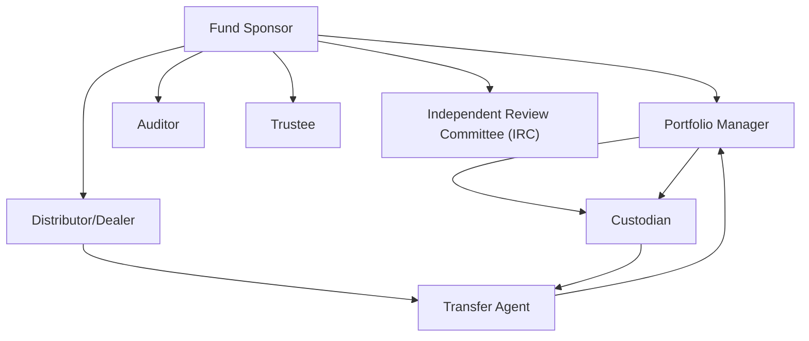

## 10.2 Key Players in a Mutual Fund

When many of us hear “mutual fund,” we often imagine a simple product that magically grows our money over time. However, there’s a whole team of individuals, institutions, and (sometimes) fancy technology behind the scenes making it all happen. It’s sort of like watching a movie: the actors might be on screen, but the directors, producers, camera crew, lighting pros, and makeup artists are just as critical to the final picture. In the world of mutual funds, these supporting players include the fund sponsor, portfolio manager, distributor, custodian, transfer agent, auditor, trustee, and the Independent Review Committee (IRC). Each of them performs tasks that keep the fund running smoothly and—most importantly—keep investor interests protected.

This section will introduce you to the primary roles in a modern mutual fund. We’ll chat (in straightforward terms) about what each key player does, explain why it matters, offer a few personal anecdotes for flavor, and weave in a few practical examples so you can see how all these parties work together. Whether you’re brand new to mutual funds or a seasoned investor looking for clarity, read on for a quick backstage pass to the mutual fund world.

--------------------------------------------------------------------------------

### The Fund Sponsor (or Fund Company)

You know that friend who’s always organizing the group outing, booking the reservation, and sending out calendar invites? In mutual fund terms, that’s the fund sponsor. The sponsor, sometimes called the “fund company,” is the organization that creates the fund in the first place.

• **Creation and Branding:** Sponsors develop the fund’s structure and strategy, set up the fund under applicable securities regulations, and handle the marketing (a bit like naming the group chat, designing the itinerary, and inviting folks to join). Well-known Canadian sponsors might include large financial institutions like the big banks or independent investment firms.

• **Administration and Management Services:** It’s not unusual for the sponsor to also provide administrative and day-to-day management support. So if you’re wondering who’s behind those statements you receive in the mail or the secure online portal you log into, the sponsor is usually responsible for coordinating that.

• **Regulatory Setup:** Before opening its doors to investors, the fund sponsor must ensure the fund is fully compliant with regulations set by the Canadian Securities Administrators (CSA) and CIRO (the Canadian Investment Regulatory Organization). Historically, the MFDA or IIROC might have been mentioned here, but these organizations have now been merged into CIRO to act as Canada’s single self-regulatory organization.

**Example:** Let’s say ABC Global Investments (a hypothetical sponsor) decides to launch a new fund called the ABC Canadian Equity Leaders Fund. ABC Global handles absolutely everything from registering that fund under National Instruments to filing the prospectus with the relevant securities commissions, to building a marketing campaign calling attention to the fund’s potential benefits.

--------------------------------------------------------------------------------

### The Portfolio Manager (or Investment Advisor)

If the sponsor is the organizer, the portfolio manager is the chef in the kitchen deciding on the perfect recipe. This is the person (or team) who actively makes day-to-day investing decisions—buying and selling securities that align with the fund’s stated objectives and risk profile. Sometimes, one manager might oversee multiple funds, or a big team might co-manage a single, bigger fund.

• **Expertise and Registration:** Portfolio managers are required to hold specific credentials, pass rigorous licensing requirements, and remain in good standing with CIRO (previously, you may have heard of MFDA or IIROC—both now defunct). They must demonstrate proficiency and abide by ongoing compliance to maintain that license.

• **Investment Strategy:** If a particular fund is an equity fund, the portfolio manager might focus on Canadian blue-chip stocks. If it’s a fixed-income fund, the portfolio managers might buy government and corporate bonds. Their job is to stay on top of market developments, interest rate shifts, corporate news, and more.

• **Fiduciary Duty:** Portfolio managers have a fiduciary duty to act in the best interests of the fund’s investors. This concept underpins every decision made in the portfolio—no matter how large or small. In other words, they can’t just invest in random tech companies because they personally like the brand. They must follow the fund’s objectives and guidelines.

**Anecdote:** I once chatted with a portfolio manager who said he felt like an “investment detective”—every day, he was researching companies, analyzing macroeconomic data, and testing various financial models. He loved it because, in his words, “there’s always a new case to crack.”

--------------------------------------------------------------------------------

### Distributor or Dealer

Picture a ticket seller standing at the entrance to a bustling concert venue. The distributor or dealer is your gateway to the mutual fund “show.” These are the folks or firms that connect investors with mutual funds. They can be banks, investment dealers, online discount brokerages, robo-advisors, or full-service professionals—each channel giving you a different path to buy (or redeem) your fund units.

• **Registration Requirements:** Dealers and distributors are also overseen by CIRO. They must follow KYC (“Know Your Client”) rules, suitability obligations, and other obligations to ensure that any fund they recommend is actually appropriate for the client’s needs and risk tolerance.

• **Client Education:** In many cases, it’s the distributor that helps investors understand the fund’s prospectus, highlights key features, and ensures the investor has the full story before putting any money in.

• **Variations in Services:** Some distributors provide thorough advice, while others offer more basic order-execution services (for folks who do their own research). With a full-service dealer, you might receive in-depth asset allocation consultations, whereas a discount broker just executes the trades you choose.

**Case Study:** Let’s say you’re opening a TFSA (Tax-Free Savings Account) at your local bank. The bank’s financial advisor (registered under CIRO) might recommend a few in-house mutual funds that align with your preference for moderate risk. That advisor, or the bank itself, is effectively the distributor.

--------------------------------------------------------------------------------

### Custodian

If the portfolio manager is the talented chef, the custodian is the safe (and very careful!) host who stores all the ingredients and valuables—even the recipes—under lock and key until they’re needed. In finance terms, the custodian is a bank or trust company that holds and safeguards the mutual fund’s assets.

• **Safekeeping of Assets:** The custodian is in charge of physically holding the stocks, bonds, or other securities that the mutual fund has purchased. This might mean literally holding share certificates or more commonly holding them electronically in a secure account.

• **Oversight and Record-Keeping:** Custodians track every share, every coupon payment, and every deposit or withdrawal. This is crucial for accurate net asset value (NAV) calculations.

• **Reducing Fraud Risks:** By requiring the involvement of an independent custodian, it’s harder for unscrupulous individuals to gain direct access to investor funds. The separation of responsibilities ensures a higher level of safety.

**Practical Note:** In Canada, it’s pretty standard for a large financial institution—like a major bank—to act as custodian for many different mutual funds.

--------------------------------------------------------------------------------

### Transfer Agent

Think of the transfer agent as the “memory” of the mutual fund’s operations. This entity keeps track of investor accounts, processes any new purchases or redemptions, issues updated statements, and basically ensures that everyone knows where their money is and how many units they hold.

• **Transactional Record-Keeping:** Whenever you buy mutual fund units, the transaction is recorded by the transfer agent. Same if you sell (redeem) them or switch from one fund to another within the same family of funds.

• **Issuing Investor Statements:** The transfer agent ensures you get that quarterly or monthly statement with all the relevant updates—any distributions (interest or dividends) you received, your current holdings, and the total market value of your investment.

• **Customer Service:** If you need to rectify or update personal details—like changing your contact information or requesting a new statement—many times, you’re effectively reaching out to the transfer agent.

--------------------------------------------------------------------------------

### Auditor

At some point or another in life, most of us have dreaded some form of an “audit.” In mutual funds, however, the auditor is not here to scare you; they’re here to make sure everything’s honest and transparent. An auditor is an independent accounting professional who examines the mutual fund’s financial statements.

• **Financial Statement Verification:** The auditor checks whether the reported profits and losses, asset figures, liabilities, and other disclosures are accurate according to Canadian accounting standards.

• **Confidence for Investors:** By providing an unqualified (or “clean”) audit opinion, the auditor signals that the financial statements can be relied upon by investors. If the auditor has concerns, they’re obligated to voice them.

• **Regulatory Requirement:** The auditor’s role is mandated by securities legislation. Mutual funds must produce audited financial statements at least annually, giving investors a consistent and reliable touchpoint to gauge how the fund is doing.

--------------------------------------------------------------------------------

### Trustee

In many fund structures, the mutual fund is organized as a trust. Under that structure, the trustee holds the legal title of the fund’s assets “in trust” for the investors (the beneficiaries). If you think about a family trust, the trustee is the person who manages assets for the ultimate benefit of the family. A mutual fund trustee does something similar but at a larger, more formal scale.

• **Legal Ownership vs. Beneficial Ownership:** The trustee holds the legal title, but the fund’s unitholders (investors) own the beneficial interest. The trustee must keep these assets separate from any other business or personal assets.

• **Fiduciary Obligation:** The trustee has a fiduciary responsibility to act in the best interest of unitholders, comply with the terms of the trust deed, and ensure that the fund’s activities align with the stated objectives and regulatory requirements.

• **Coordination with the Sponsor:** Often, the trustee role is closely aligned with the fund sponsor’s administrative department. However, legally speaking, they are separate roles to ensure there’s a safety net for investor protection.

--------------------------------------------------------------------------------

### Independent Review Committee (IRC)

Picture a group of seasoned professionals sitting around a table, quietly sorting out conflicts of interest so that the fund stays on track and stays fair to investors. That’s the IRC in a nutshell. The Independent Review Committee is a requirement in Canada for many investment funds, intended to oversee conflict-of-interest matters that might arise in how the fund is managed.

• **Conflict of Interest Oversight:** Let’s say a portfolio manager wants to buy shares of a company in which the fund sponsor has a financial interest. Or maybe the manager wants to direct trades through a particular brokerage that’s affiliated with the sponsor. The IRC examines these scenarios and ensures decisions are made in the best interests of the fund’s unitholders.

• **Independent Members:** The IRC must be made up of independent members with relevant expertise (e.g., law, accounting, finance, governance). They can’t have ties that create conflicts with the fund sponsor or manager.

• **Reporting:** By law, the IRC must produce at least an annual report on its activities and decisions, giving investors a window into how potential conflicts have been handled.

--------------------------------------------------------------------------------

### Visualizing How They All Fit Together

The relationships can feel a bit complicated, so let’s take a quick look at a diagram summarizing how these roles connect (the arrows here just show the interactions, not necessarily the direction of money flow):

• The Fund Sponsor (A) collaborates with the Portfolio Manager (B), Distributor/Dealer (C), Auditor (F), Trustee (G), and the IRC (H).  
• The Portfolio Manager (B) directs the Custodian (D) where to hold or move assets.  
• The Distributor/Dealer (C) works closely with the Transfer Agent (E), which in turn manages record-keeping that loops back to the Portfolio Manager (B) and the Custodian (D) for up-to-date net asset value (NAV) and transaction records.  
• The IRC ensures any conflict-of-interest issues are addressed fairly.

While this might look like a busy spiderweb, each node plays a crucial role that, ultimately, benefits you, the investor, by ensuring checks and balances throughout the system.

--------------------------------------------------------------------------------

### Why These Roles Matter to You

So, you might be wondering, “Why do I need to know about all these behind-the-scenes players?” Trust me, it’s worth knowing. Whether you’re saving for retirement, a down payment on a home, or your children’s education, you should feel confident that your money is in good hands.

• **Investor Protection:** Most of these roles—custodians, trustees, auditors, and IRCs—are specifically designed to protect your interests. Personally, I’ve found comfort in the thought that a third-party custodian is handling my money and not mixing it with a sponsor’s or manager’s other activities.

• **Professional Management:** A specialized, experienced portfolio manager is at the helm, actively rebalancing and monitoring your investments. You’re paying for this expertise, so it’s good to understand how that expertise is organized.

• **Transparency and Compliance:** The fund’s sponsor, distributor, and auditor all work together to ensure the required disclosure documents (like Fund Facts and prospectuses) are accurate and up to date. That means you have solid information to base your decisions on.

• **Regulatory Oversight:** CIRO and the various provincial securities regulators keep an eagle eye on these structures. Over the years, regulatory frameworks in Canada have evolved significantly, and learning about them helps you appreciate the system’s growing robustness.

--------------------------------------------------------------------------------

### Best Practices and Common Pitfalls

• **Overlooking the Fine Print:** Investors sometimes skip reading the simplified prospectus or the Fund Facts. Don’t skim. That’s where you learn about fees, strategies, and potential conflicts of interest.

• **Assuming All Funds Are the Same:** Just because two funds share the term “equity” in their names doesn’t mean they operate the same way. Look at the sponsor’s approach, check who the portfolio manager is, examine the track record and distribution channel.

• **Failing to Ask Questions:** Don’t be shy about asking your financial representative how the custodian is chosen or how the IRC deals with conflicts of interest. If your financial advisor or robot-advisor platform can’t explain it clearly, that might be a red flag.

• **Not Staying Current:** Compliance changes (like the shift from separate MFDA and IIROC entities to the single CIRO) can impact processes and policies. Stay up to date by checking official resources at https://www.ciro.ca.

--------------------------------------------------------------------------------

### Real-World Scenario: Putting It All Together

Let’s imagine you decide to invest in a high-yield corporate bond fund. Here’s what might happen in the background:

1. **Fund Sponsor Launches:** “XYZ Fixed Income Inc.” sets up the High-Yield Corporate Bond Fund. They register it, define its investment objectives, file the necessary documents with regulators, and hire a seasoned portfolio manager.

2. **You Meet the Distributor:** Your local bank or a CIRO-registered investment dealer offers you the High-Yield Corporate Bond Fund. Upon assessing your KYC information, the fund is recommended to you because it aligns with your risk tolerance and income goals.

3. **Custodian Takes Charge:** The moment you invest, those dollars are passed on to the custodian, who keeps track of your investment. The portfolio manager instructs the custodian to invest in specific corporate bonds.

4. **Transfer Agent Tracks It:** Simultaneously, the transfer agent updates your account with the number of units purchased and ensures future statements reflect your holdings.

5. **Auditor Steps In:** Each year (and potentially every quarter or semi-annually, for interim statements), an auditor checks the fund’s financials to confirm everything is reported accurately.

6. **Independent Review Committee Stays Vigilant:** If the portfolio manager wants to buy bonds from an issuer that has a close relationship with XYZ Fixed Income Inc., the matter gets referred to the IRC, which ensures the purchase is in the best interest of unitholders.

7. **Trustee Monitors the Trust Deed:** If the fund is organized as a trust, a trustee ensures all the legal provisions are being respected. That means abiding by the trust’s stipulated guidelines and ensuring the sponsor and manager act in unitholders’ best interests.

8. **Ongoing Regulation and Oversight:** CIRO and the relevant provincial securities commissions keep tabs on the entire setup, stepping in if they detect or suspect wrongdoing.

End result? You (hopefully) receive a steady stream of interest income from your high-yield corporate bond investment, plus all the normal fluctuations that come with bond market movements, while feeling more comfortable knowing that multiple checks and balances are in place.

--------------------------------------------------------------------------------

### Further Reading

If you’re hungry for more detail:

• **CIRO Registration and Proficiency Requirements**  
  Check out https://www.ciro.ca/registration-and-qualifications for up-to-date regulations, documents, and guidelines on who is qualified to manage and distribute mutual funds.

• **Canadian Securities Administrators (CSA) Publications**  
  CSA issues National Instruments like NI 31-103 (Registration Requirements), which detail how fund sponsors, managers, and dealers must operate.

• **Investment Fund Governance Resources**  
  Search for “Investment Fund Governance: Regulatory and Best Practice” for deeper industry research on how boards and IRCs can ensure ethical fund operations.

--------------------------------------------------------------------------------

## Essential Key Players in a Mutual Fund: Comprehensive Quiz



### Which entity is primarily responsible for launching and marketing a mutual fund?  
- [x] The fund sponsor  
- [ ] The independent review committee (IRC)  
- [ ] The custodian  
- [ ] The transfer agent  

> **Explanation:** The fund sponsor (or fund company) creates and markets the mutual fund, handling administrative tasks and often providing additional management services.

### Who oversees day-to-day investment decisions to align with a mutual fund’s objectives?  
- [ ] The trustee  
- [x] The portfolio manager  
- [ ] The distributor  
- [ ] The auditor  

> **Explanation:** The portfolio manager makes daily investment choices and monitors the market to ensure the fund’s assets fit its investment objectives.

### Which role generally holds a mutual fund’s securities and other assets for safekeeping?  
- [ ] The sponsor  
- [ ] The IRC  
- [ ] The dealer  
- [x] The custodian  

> **Explanation:** The custodian is a bank or trust company that stores the fund’s securities, ensuring protection and proper record-keeping.

### Who maintains the record of each unit holder’s account and processes redemptions?  
- [ ] The portfolio manager  
- [ ] The trustee  
- [x] The transfer agent  
- [ ] The custodian  

> **Explanation:** The transfer agent keeps track of investor accounts, records transactions, and issues statements to unitholders.

### What is one of the main responsibilities of the Independent Review Committee (IRC)?  
- [x] Oversee conflict-of-interest matters for the benefit of unitholders  
- [ ] Identify high-performing stocks for the portfolio manager  
- [x] Ensure the fund’s decisions are made in the best interest of investors  
- [ ] Handle the custody of corporate bonds  

> **Explanation:** The IRC monitors potential conflicts of interest, ensuring fairness and transparency in the fund’s operations.

### In a trust-based mutual fund, who typically holds the legal title to the fund’s assets?  
- [ ] The fund sponsor  
- [ ] The portfolio manager  
- [ ] The custodian  
- [x] The trustee  

> **Explanation:** When a fund is structured as a trust, the trustee holds legal title to the fund’s assets and acts on behalf of unitholders.

### How often must a mutual fund typically have its financial statements reviewed by an external auditor?  
- [x] Annually (with interim reviews often semi-annually or quarterly)  
- [ ] Only once at inception  
- [x] Every 5 years  
- [ ] Once every two years  

> **Explanation:** By law, mutual funds must produce audited financial statements at least annually. Some also undergo unaudited reviews for interim periods.

### Which regulatory body emerged from the amalgamation of the MFDA and IIROC, now overseeing mutual fund dealers and investment dealers in Canada?  
- [x] CIRO  
- [ ] CSA  
- [ ] CIPF  
- [ ] OSFI  

> **Explanation:** Effective June 1, 2023, the Mutual Fund Dealers Association of Canada (MFDA) and the Investment Industry Regulatory Organization of Canada (IIROC) combined to form the Canadian Investment Regulatory Organization (CIRO).

### If you invest in a fund at your local bank, who or what is most directly acting as the distributor to you?  
- [x] Your bank (provided it’s a CIRO-registered dealer)  
- [ ] The auditor  
- [ ] The trustee  
- [ ] The transfer agent  

> **Explanation:** The bank, as a CIRO-registered dealer, is distributing the mutual fund to you, facilitating your purchase and advising on suitability.

### The term “fiduciary duty” means the fund’s managers must:  
- [x] Always act in the best interest of the fund’s investors  
- [ ] Maximize the fund sponsor’s profits at any cost  
- [ ] Focus primarily on short-term returns  
- [ ] Establish quarterly dividend payments regardless of performance  

> **Explanation:** Fiduciary responsibility requires the fund manager (and other relevant parties) to put the fund investors’ best interests first at all times.


