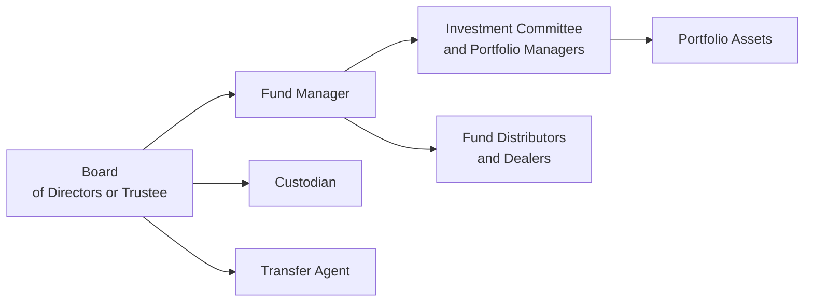

## 10.3 How are Mutual Funds Organized?

Let’s be honest: when someone first told me, “Hey, did you know mutual funds can actually be trusts, corporations, or even partnerships?” I remember blinking in surprise—like, wait, how many forms can one product take? It’s funny how there’s a whole world under the hood of these funds we often just buy off a shelf. Yet the legal and practical underpinnings of mutual funds are super important because they shape not only how income and returns are taxed, but also how fees are charged, how investors hold their units or shares, and who’s responsible for the fund’s oversight.

I’m going to walk you through how mutual funds are organized in Canada, as well as some of the rationale behind these setups. This discussion builds on the broader context of “The Modern Mutual Fund” in Chapter 10, so if you need more background on mutual fund basics, you might want to circle back to sections 10.1 and 10.2. Anyway, let’s dive in.

Why So Many Structures?

One reason for the variety of organizational structures is simply historical. Canadian tax rules and industry practices evolved to encourage trust-based funds. Additionally, mutual apps, financial advisors, and large institutions realized that a trust structure offered flexibility and favorable tax treatment, which, in turn, made mutual funds more appealing to investors. Still, you’ll sometimes see corporate funds, or in rarer cases, limited partnerships for specialized or niche funds. But if we’re talking mainstream, trust structures tend to rule the roost.

––––––––––––––––––––
Trust, Corporate, and Partnership Structures
––––––––––––––––––––

Trust Structure

A big chunk of Canadian mutual funds are set up as trusts. That might sound arcane—some dusty legal concept your lawyer friend might mention—but in practical terms, it means a trustee holds legal title to the fund’s assets for the benefit of the unitholders. This also sets the stage for flow-through taxation: a trust generally passes income directly to unitholders, who then report that income on their personal tax returns, thus avoiding taxation at the fund level (provided the fund meets certain distribution and structural requirements).

• Declaration of Trust: The formal “rule book” that establishes the fund as a trust. It spells out operational details like investment objectives, distribution policies, and how the trustee is appointed or replaced. Since it’s a living document, it might be amended from time to time—though major changes often require unitholder consent or regulatory approval.

• Units: Trust-based mutual funds issue “units” rather than shares, though the difference might be largely semantic for day-to-day investors. Each unit generally carries the same rights, including receiving distributions, voting on certain governance issues, and redeeming units at net asset value (NAV).

Corporate Structure

Yes, some funds are legally structured as corporations. Instead of a declaration of trust, a corporate fund has a corporate charter and bylaws. This arrangement can offer certain organizational benefits. For instance, a corporation can have multiple share classes or series to differentiate, say, management fee rates or distribution preferences. However, there can also be separate taxation complexities. Canadian regulations allow a corporation’s net income and capital gains to be allocated to shareholders in a way that can resemble the flow-through nature of trusts, but the details can get a bit complicated to set up.

• Corporate Charter: The founding document that lays out the corporation’s purpose and provides for the issuance of shares, the appointment of directors, and so forth.

• Shares: Corporate funds issue shares rather than units. If you’re investing in a corporate fund, you’re technically a shareholder, which brings certain rights like voting privileges and entitlement to dividends or other distributions (including capital gains dividends).

Partnership Structure

You might stumble on a specialized hedge fund or alternative product set up as a limited partnership (LP). While these are less common in the conventional mutual fund space, the partnership structure can be advantageous for certain investment strategies, often due to more flexible tax treatment and/or reduced regulatory constraints. That said, your everyday retail mutual fund is far more likely to be a trust or corporation than a partnership.

––––––––––––––––––––
Classes and Series of Units or Shares
––––––––––––––––––––

Now, let’s say you’ve picked a mutual fund—why does the fund name sometimes say “Series A” or “Class F” or “Class I?” In my early days, I often found this a bit baffling. The short answer: multiple classes or series exist within a single mutual fund to tailor the product to investors with different needs or preferences. This might include:

• Fee Structures: Some classes charge front-end or back-end loads, while others might be no-load. There could also be differences in management fees or trailing commissions for advisors.

• Service Levels or Special Arrangements: Institutions and high net-worth investors may get lower fees or special perks, resulting in classes dedicated to them.

• Distribution Options: One series might reinvest dividends automatically, while another might pay them out in cash monthly.

• Currency Options: Sometimes a fund with a global mandate might offer separate series for CAD vs. USD investments.

Each of these classes or series has distinct fees and distribution policies, but they’re all part of the same underlying fund strategy. Legally, these can exist under one “umbrella” but maintain separate net asset values to ensure each class pays for only its share of costs.

––––––––––––––––––––
Umbrella Structure and Fund Families
––––––––––––––––––––

Picture a big financial institution with 25 different mutual funds, each focusing on a specific sector or asset class: say, a Canadian equity fund, a U.S. equity fund, a bond fund, and so forth. Rather than create 25 entirely separate legal entities, many sponsors set up an umbrella structure—essentially a family of funds that share brand identity, distribution channels, and certain administrative resources. This is super convenient from a marketing perspective. Investors can pick and choose among funds in that family with relative ease. And from an operational viewpoint, economies of scale can be significant. For instance, the sponsor can centralize administrative and recordkeeping services across multiple funds, which can help keep costs lower (at least in theory!).

Often, marketing materials will highlight the “Family of Funds” approach. Each fund remains legally distinct (with its own trust or corporate documents), but they share a common manager or sponsor, a brand identity, and potentially some back-office resources.

––––––––––––––––––––
Governance: Trustees, Boards, and Oversight
––––––––––––––––––––

Alright, so who’s really holding the reins to ensure your money is managed wisely and ethically? In a trust structure, the trustee has a fiduciary obligation to act in the best interests of unitholders. In a corporate structure, that role falls to the board of directors. Both the trustee (or board) and the fund manager have to comply with securities laws, the Canadian Securities Administrators’ (CSA) regulations, and the Self-Regulatory Organization rules that apply to mutual fund dealers or investment dealers.

Currently, CIRO (the Canadian Investment Regulatory Organization) is the single self-regulatory organization for both mutual fund dealers and investment dealers in Canada. Historically, you might have heard about the MFDA or IIROC, but as of 2023, they’ve merged into CIRO. Regardless of structure, the key idea remains: there must be a guardrail in place to protect unitholders and ensure compliance with the fund’s stated objectives, with relevant national and provincial rules, and with prudent portfolio management practices.

Let’s visualize the structure. Sure, it might not be the most exciting flowchart in the world, but it can help clarify who reports to whom:

Explanation of diagram:
• The Board of Directors or Trustee (A) oversees the fund’s major decisions and ensures legal compliance.  
• The Fund Manager (B) is responsible for day-to-day operations such as asset allocation, research, trading decisions, and portfolio strategies, often supported by an Investment Committee and Portfolio Managers (C).  
• The Custodian (E) securely holds the fund’s cash and investments.  
• The Transfer Agent (F) handles unitholder recordkeeping, including purchase, redemption, and distribution records.  
• Distributors and Dealers (D) are the entities like financial advisors, banks, or online platforms that help investors buy or sell fund units.  

––––––––––––––––––––
Fees and Expenses
––––––––––––––––––––

Another area that’s directly tied to how mutual funds are organized: fees and expenses. Trust or corporation, it won’t matter much to you if the fund’s fees are too high. Seriously, if there’s one personal anecdote I’d share here, it’s the time I realized how seemingly small differences in expense ratios can erode returns drastically over years of compounding. I learned that the hard way, especially in a prolonged low-growth environment.

• Management Fee: The portion going to the manager for portfolio oversight, research, and distribution costs. 
• Operating Expenses: Costs like legal fees, audit costs, custodial charges, and other day-to-day operational expenses. 
• Performance Fees: Certain specialized or alternative mutual funds might charge a performance-based fee, though this is more common in hedge funds.
• Total Expense Ratio (TER): An overall measure of the fund’s annual operating costs as a percentage of average net assets. This can also appear as the Management Expense Ratio (MER). Either way, be on the lookout for that figure.

Regardless of structure, these fees come off the top of the fund’s assets. They reduce the net returns that eventually flow to you, the unitholder. So it might be worth shopping around or exploring different classes or series to see what overall cost structure best suits your investment plans.

––––––––––––––––––––
Regulatory Requirements and Recordkeeping
––––––––––––––––––––

Every mutual fund in Canada operates under provincial and territorial securities laws, as coordinated through instruments created by the CSA. Two key sets of rules, among others, are:

• National Instrument 81-102 (Investment Funds) – the big one that lays out guidelines for fund investments, restrictions, and operational practices.  
• National Instrument 81-101 (Mutual Fund Prospectus Disclosure) – covers disclosure requirements, prospectus rules, and how investor documents must be presented.

Additionally, CIRO has its own guidelines that dealers and representatives must follow when selling mutual funds. On top of that, the fund’s documentation, such as a Declaration of Trust or corporate charter, must meet the appropriate legal requirements. 

From a day-to-day perspective, mutual funds must keep accurate records of every unitholder transaction—purchases, redemptions, distributions, changes in the number of outstanding units, you name it. The Transfer Agent typically handles this. This recordkeeping is crucial for tax reporting too, ensuring unitholders get the correct T-slips (like T3s or T5s) for any distributions.

––––––––––––––––––––
Practical Example: “Johnson Family of Funds”
––––––––––––––––––––

Let’s imagine a fictional example. Suppose you see marketing for something called the “Johnson Family of Funds,” a brand name under which 10 different mutual funds are offered. You find out each is a separate trust, with each trust having a Declaration of Trust. Despite being distinct, they share a common trustee (Johnson Trustees Inc.) and the same fund manager (Johnson Investment Management Co.). Their fees might differ significantly, depending on the fund’s complexity—like a simple money market fund vs. a sophisticated global equity fund. However, because they share an umbrella brand, you can get combined statements for all your Johnson funds, and the sponsor can advertise them as a cohesive set of investment options. This arrangement makes your life easier, because you have a “one-stop shop” for your diversified portfolio. Meanwhile, behind the scenes, Johnson gets operational efficiencies by centralizing compliance, distribution, and marketing efforts across all 10 funds.

––––––––––––––––––––
Best Practices and Common Pitfalls
––––––––––––––––––––

• Understand the Fund’s Legal Documents: Trust or corporation, you should at least glance at the fund’s Declaration of Trust or corporate prospectus sections. It’s not necessarily a page-turner, but it can confirm the fund’s objectives, how fees are deducted, and your voting rights.  
• Watch for Classes and Series Differences: Some funds offer multiple series that are basically the same portfolio but with varying fees or currency hedges. Make sure you pick the most cost-effective one for your situation.  
• Monitor Fee Creep: Over time, if you’re not paying attention, management fees or other expenses might incrementally erode your returns. Keep an eye on the MER or TER.  
• Don’t Ignore Oversight: A robust board or trustee can protect your interests. If you’re an institutional or large retail investor, you might weigh the governance structure more seriously.  
• Keep Up with Regulatory Updates: Rules change. Sometimes the CSA or CIRO modifies guidelines, which can affect how funds are set up or managed.

––––––––––––––––––––
Continuous Learning
––––––––––––––––––––

The story of mutual fund organization doesn’t end here. If you want to dive deeper into how these structures compare internationally, for instance in the United States or Europe, you’ll find interesting differences in governance and disclosure. Or maybe you’re curious about how to interpret the cryptic legal statements in a prospectus. Chapter 9 of this course deals with Understanding Financial Statements, which can help you see how a fund’s organizational structure shapes its reporting. And if you want to see how it influences returns and your ultimate selection of a fund, check out Chapter 15 on Selecting a Mutual Fund, where fees, portfolio composition, and organizational structure all come into play.

––––––––––––––––––––
References and Additional Resources
––––––––––––––––––––

• National Instrument 81-102 (Investment Funds) – Guidance on investment restrictions and practices for mutual funds in Canada.  
• National Instrument 81-101 (Mutual Fund Prospectus Disclosure) – Key requirements for fund prospectus disclosure.  
• CIRO website – https://www.ciro.ca – for current guidelines and regulatory information.  
• “Canadian Mutual Funds: Principles and Practices” – seminal text covering structures, highlights, and best practices.  
• Additional modules from the Canadian Securities Institute (CSI) that detail the complexities of fund structures and their implications for investors.

And that’s it— hopefully, you now have a clearer view of how mutual funds are organized in Canada, and why it matters whether your fund is a trust, a corporation, or part of a neat umbrella structure.

## Test Your Knowledge: Mutual Fund Structures and Organization



### Which of the following is the most common form of mutual fund organization in Canada?

- [ ] Corporations
- [ ] Partnerships
- [x] Trusts
- [ ] Proprietorships

> **Explanation:** Although mutual funds can be organized as corporations or partnerships, the trust structure is by far the most common in Canada, largely due to tax efficiencies and straightforward operational frameworks.

### A “declaration of trust” primarily:

- [x] Establishes the mutual fund as a trust and outlines its operational rules.
- [ ] Reviews the annual performance of the fund.
- [ ] Serves as a marketing document to attract investors.
- [ ] Lists only the fees payable by unitholders.

> **Explanation:** The declaration of trust is the official document that creates the trust and spells out how it will operate, including the fund’s investment objectives and governance rules.

### In a corporate mutual fund structure, the foundational legal document is referred to as:

- [ ] Declaration of partnership
- [x] Corporate charter
- [ ] Operating agreement
- [ ] Umbrella structure

> **Explanation:** A corporate charter is the key document used when a mutual fund is organized as a corporation. It specifies rights and obligations and sets the stage for the fund’s governance.

### Why might a mutual fund offer multiple classes or series of its units or shares?

- [x] To provide differentiated fee structures or distribution options for various investors.
- [ ] Only to comply with tax regulations in foreign jurisdictions.
- [ ] To reduce fund performance volatility.
- [ ] To eliminate the need for a board of directors or trustee.

> **Explanation:** Multiple classes or series let funds tailor different fee rates, service levels, or distribution frameworks to meet diverse investor needs.

### Which of the following best describes an umbrella structure in mutual funds?

- [ ] A single mutual fund issuing multiple series of shares.
- [x] A group of related funds under one sponsor, sharing brand and administrative services.
- [ ] A corporate mutual fund that holds ETFs under it.
- [ ] A mutual fund that invests solely in real estate properties.

> **Explanation:** Umbrella structures involve multiple related funds that share a common brand or sponsor for marketing and operational efficiencies. Each fund maintains its own legal existence but benefits from central administration.

### Performance fees are typically associated with:

- [ ] Basic money market funds.
- [ ] Standard bond funds.
- [ ] Standard equity funds.
- [x] Certain specialized or alternative funds.

> **Explanation:** Performance fees are more common with specialized or alternative strategies, such as hedge funds, and are less prevalent among mainstream, traditional mutual funds.

### A trustee in a mutual fund organized as a trust holds what kind of responsibility?

- [ ] Casual guidance with non-binding recommendations.
- [x] Fiduciary responsibility to protect unitholder interests.
- [ ] Oversees only marketing campaigns.
- [ ] Guarantees returns on unitholder investments.

> **Explanation:** A trustee (or the board in a corporate fund) has a fiduciary duty to act in the best interest of unitholders, ensuring that the fund’s assets and operations align with its stated objectives and regulatory obligations.

### Under an umbrella structure, funds typically:

- [x] Retain distinct legal identities but share administrative resources. 
- [ ] Merge into a single legal entity.
- [ ] Operate under a partnership agreement.
- [ ] Eliminate the need for a custodian.

> **Explanation:** Even though they share a sponsor and branding, each fund under an umbrella has its own documentation and remains legally separate, while using the same back-office, marketing, and administrative support.

### The total expense ratio (TER) or management expense ratio (MER) indicates:

- [ ] The performance of the portfolio manager only.
- [ ] The current price of each unit in the fund.
- [x] The annual operating costs of the fund expressed as a percentage of assets.
- [ ] The total profit distribution rate for unitholders.

> **Explanation:** TER (or MER) measures the relative costs (e.g., management fees, operating expenses) borne by the fund compared to its total assets, informing investors how much they pay each year to hold the fund.

### Management of mutual funds in Canada is overseen by:

- [x] A combination of provincial and territorial securities regulators, CIRO, and the fund’s own trustees or board.
- [ ] Only the federal government.
- [ ] Solely by the TSX.
- [ ] The Canadian Investor Protection Fund (CIPF).

> **Explanation:** Mutual funds must comply with CSA rules at the provincial/territorial level, follow operational guidelines from CIRO, and adhere to oversight by their trustee or board. CIPF is an investor protection fund, not a regulator.


