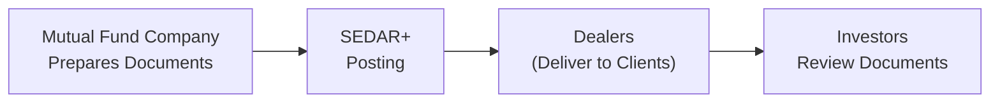

## 10.5 Mutual Fund Disclosure Documents and Fund Facts

If you’ve ever had to make a big purchase—like a house or a car—you probably spent a lot of time looking at different options, reading up on features, and getting a feel for what matters most to you. Well, investing in mutual funds is similar. In Canada, regulators have made it easier for investors to access the essential facts through two main documents: the Fund Facts and the simplified prospectus. Let’s walk through the ins and outs of these documents, exploring how they help you understand a mutual fund’s strategy, risks, costs, and ongoing performance. We’ll also take a look at continuous disclosures like the Management Report of Fund Performance (MRFP) and the financial statements, plus where you can find these documents (hint: it’s SEDAR+). By the end of this chapter, you’ll see just how important these disclosures are in making informed—and confident—investment decisions.

Remember, the Canadian Investment Regulatory Organization (CIRO) plays a big role in overseeing that dealers meet their disclosure obligations, so these documents go hand in hand with regulatory requirements. Let’s dig in.

### The Purpose of Mutual Fund Disclosure
We’ve all heard that phrase “knowledge is power,” and when it comes to investing, that absolutely holds true. Disclosure documents take critical, and sometimes complicated, mutual fund information and make it accessible and relevant. Prime examples include:

• Fund Facts document (the point-of-sale companion)  
• Simplified prospectus (the more detailed legal overview)  
• Continuous disclosure documents (MRFPs and financial statements)  

The main goal? Empowering you—or your clients, if you’re an advisor—to understand exactly what you’re getting into before you invest a single dollar.

### Fund Facts: A Snapshot of Key Information
Fund Facts is basically the “CliffsNotes” (super-condensed summary) of a mutual fund. If a friend asked you, “What’s really important about this fund?” you’d be giving them the Fund Facts. This two- to four-page document covers:

• Investment objectives  
• Performance history  
• Possible risks  
• Costs and fees  
• Quick fact data (fund size, date established, portfolio manager, etc.)  

Investors often see it at (or before) the time of sale. Dealers have a regulatory obligation to deliver Fund Facts to you before you buy. Let’s break it down further.

#### What’s Inside Fund Facts
1. Overview: Typically includes a concise description of the fund’s primary investment objectives and strategies.  
2. Past performance: Shows how the fund has performed over time (usually the last 10 years). Quick tip: historical returns aren’t a guarantee of future performance, but they can give you a sense of how the fund behaves across different market conditions.  
3. Risks: Often represented with a risk scale—ranging from “Low” on one end to “High” on the other.  
4. Fees and expenses: Discloses the management expense ratio (MER), any short-term trading fees, or switch fees. These can significantly affect an investor’s returns.  
5. Other essential details: The fund’s top 10 holdings, portfolio mix, and contact information for the manager or the firm.

#### Why Fund Facts Matter
The reason regulators introduced Fund Facts was pretty straightforward: the simpler the disclosure, the sooner the investor can evaluate the product. If you have only three minutes to decide whether a potential fund fits your risk tolerance and long-term goals, Fund Facts is your best friend. It’s standardized, easy to compare across different funds, and designed to be, well, actually readable.  

I once had a friend—let’s call him Andy—who never bothered looking at Fund Facts and ended up investing in a sector fund that was way more volatile than he realized. So it’s definitely worth the quick read. No one wants to be caught off-guard when the market gyrates.

### Simplified Prospectus: The Deeper Dive
Fund Facts is short, but if you’re a detail-oriented person (or if your client is), the simplified prospectus is where you’ll get a full picture. It covers virtually every nook and cranny of the fund, including:

• In-depth discussion of its investment strategies and objectives  
• Comprehensive risk assessments  
• Conflicts of interest  
• Detailed fee structure (including trailing commissions, if applicable)  
• Distribution policy (how often dividends or distributions are paid)  
• Material change disclosures (how the fund manages significant changes to its business or strategy)  

The simplified prospectus is mandated by Canadian securities regulations (CSA National Instrument 81-101) to be written in plain language. Ironically, it’s still a fairly substantial document, but far more approachable than a 200-page legal prospectus full of industry jargon.

#### Distinguishing Features
If the Fund Facts document is your quick summary, the simplified prospectus is your thorough reference text. It’s an excellent resource for clients with specific questions that can’t be answered in Fund Facts—like the exact nature of derivative usage in the fund or any potential conflicts of interest from affiliate companies. Usually, advisers keep digital copies of these prospectuses on hand to email or print for clients upon request.

### The Risk Scale: “Low” to “High”
Okay, so we’ve all got different definitions of “risk.” Some folks hear “risk” and picture bungee jumping off a cliff, while others just think about mild investment fluctuations. Mutual fund providers typically standardize a five-category scale: Low, Low to Medium, Medium, Medium to High, and High. In Fund Facts:

• Low risk funds might include money market or certain government bond funds.  
• Medium risk usually encompasses broad-based equity funds.  
• High risk can apply to leveraged or specialized sector funds.  

This classification is largely derived from the historic volatility of the fund. Before you invest, always see where the dial sits on that scale. If “High” risk is outside your comfort zone, you might want to ask more questions or consider a different fund. 

### Real-World Example: Fund Fact Meets Reality
Picture a family planning a long vacation in retirement. They have a moderate risk tolerance and a 20-year horizon. They open the Fund Facts for a balanced mutual fund and discover that it’s labeled “Low to Medium” risk. That may be a good sign—compared to a pure equity fund that might be “Medium to High.” Then, flipping the page, they see the MER is 2.2%. That might be okay for some, but if they find a comparable fund with an MER of 1.5%, they might have second thoughts. That’s the power of Fund Facts. Quick, clear comparisons.

### Timely Updates and Material Changes
Funds aren’t static. Their strategies, management teams, or even fundamental operations can change. For instance, a technology fund might shift to global equities if market conditions change drastically. When significant or “material” changes happen, the fund is obligated to update its disclosure documents.  

• Fund Facts must be kept current.  
• The simplified prospectus and annual information form must reflect major revisions.  
• A material change triggers an amendment or supplement, letting investors know about the shift.  

If you bought the fund some time ago, your dealer will typically inform you about these changes, though methods might vary (postal mail, email notification, or statement inserts). It’s also wise to check for updates every now and then if you’re actively monitoring your portfolio.

### Continuous Disclosure: MRFP and Financial Statements
Investing in a mutual fund isn’t a one-and-done thing. You keep your money in for months or years, so it’s crucial to know how the fund’s doing along the way. That’s why continuous disclosure documents exist. They include:

**Management Report of Fund Performance (MRFP)**  
• Published quarterly, semi-annually, or annually, depending on the fund’s guidelines.  
• Discusses how the fund performed during the reporting period, what market factors influenced returns, and commentary from the portfolio manager.  
• Looks ahead to the fund’s prospects, usually mentioning potential headwinds or engine drivers in the market.  

**Financial Statements**  
• Annual and semi-annual statements are common.  
• Show the fund’s net assets, income, and expenses.  
• Reveal changes in net assets compared to prior periods and a schedule of the fund’s investment holdings.  

Let’s say you have a global equity fund. The MRFP might highlight that European markets lagged last quarter, dragging overall returns. It might also mention strategic adjustments, like shifting investment into North American stocks due to emerging economic data. This insight helps you or your advisor assess if the fund is still aligned with your goals.  

If a friend or client forgets to look at these statements, they might be missing out on crucial info—imagine not realizing your once “steady” bond fund is suddenly packed with high-yield corporate debt. Yikes.

### Delivery Obligations and Timing
Dealers—those who actually sell you the mutual fund—have a regulatory obligation to deliver Fund Facts. In practice, this means they’ll provide the document before or at the time you’re ready to buy. Usually, you’ll get an electronic copy via email, or a paper copy if you prefer.  

Canadian securities rules aim to ensure that you make your purchase decision with the most current, relevant information. This was a big shift in Canada’s regulatory environment, focusing on a “point-of-sale” regime. In other words, you shouldn’t have to chase after documents in hindsight; you get them proactively, so you can read and clearly understand what you’re buying.

### Where to Find Disclosure Documents: SEDAR+
SEDAR+ is the short form for “System for Electronic Document Analysis and Retrieval +.” It’s basically an online repository of all regulatory filings made by public companies and investment funds in Canada. If you want to read the official, up-to-date version of any mutual fund’s:

• Fund Facts  
• Simplified Prospectus  
• Annual Information Form  
• MRFP  
• Financial Statements  

… you’ll find them all on SEDAR+ (https://sedar.com/). The site is open to the public and free to use.  

#### Quick Mermaid Diagram: Document Flow

As shown in the diagram:  
1. The mutual fund company prepares or updates the disclosure documents.  
2. They are posted and made publicly available on SEDAR+.  
3. Dealers then have a duty to deliver these materials to investors (often electronically).  
4. Investors review the documents to make informed decisions.  

### Best Practices When Using Disclosure Documents
Let’s be honest: sometimes you might be tempted to skim these materials or skip them entirely because you’re busy and they look a bit “official.” But reading them—or at least the highlights—can save you from unpleasant surprises later. A few tips:

• Read the risk scale and see if it matches your risk tolerance.  
• Check the fee section for the management expense ratio (MER) and any additional fees.  
• Look at top 10 holdings to see if you’re comfortable with the fund’s exposure.  
• Keep an eye on performance, but also note that past returns do not guarantee future success.  
• Watch for any disclaimers or special notes about conflicts of interest.  

Periodically, it’s good practice to review the MRFP and financial statements—especially if you sense a market shift or read news about changes in the fund’s sector. It’s a quick way to see if the manager is pivoting strategy or if the fund remains consistent with your personal investing philosophy.

### Common Pitfalls and How to Avoid Them
1. **Ignoring risk disclaimers:** Let’s face it, ignoring that “High risk” label because the returns looked attractive is tempting. But if your timeframe or temperament isn’t suited to roller-coaster returns, you could regret it.  
2. **Overlooking MER and fees:** Management fees, performance fees, and trading costs can eat into returns. A 2.5% fee might sound small, but over 10 or 20 years, that difference is significant.  
3. **Neglecting updates:** Funds do change. If you’re not aware of major changes, you may suddenly hold an investment that doesn’t align with your original goals.  
4. **Comparing only performance, ignoring fund strategy:** Funds differ by mandate. A global equity fund invests differently from a Canadian balanced fund. Performance comparisons are only meaningful if you compare funds with similar objectives and constraints.

### Case Study: Emily’s Surprise
Let’s consider Emily, a fictional investor who bought a Medium risk fund, based on the Fund Facts. A few months later, the fund manager shifted a big chunk of the portfolio into emerging market equities, triggering an upward reclassification of the fund’s risk from “Medium” to “Medium to High.” The manager promptly filed an updated Fund Facts and prospectus. Emily ignored all the notices and never updated her knowledge of the fund’s current portfolio.  

When markets dipped, her fund dropped more than she was prepared for, and she panicked, selling low. If Emily had paid attention to the updated risk rating and read the MRFP, she might have decided to reduce her holding or switch to a fund with less volatility—potentially saving her some stress (and money).

### Regulatory Environment and CIRO Oversight
In Canada, the Canadian Investment Regulatory Organization (CIRO)—formed after the amalgamation of the Mutual Fund Dealers Association (MFDA) and Investment Industry Regulatory Organization of Canada (IIROC)—is the national self-regulatory organization. CIRO enforces the rules for dealing representatives and their firms. This includes making sure:

• Fund Facts really do get delivered before the transaction.  
• Representatives fill out Know Your Client (KYC) forms correctly.  
• Suitability obligations are met.  

CIRO, along with the Canadian Securities Administrators (CSA), continues to refine the disclosure rules so that conflicts of interest are transparent, fees are crystal clear, and your rights as an investor remain protected.

### Glossary Recap
• **Fund Facts:** The quick, 2- to 4-page essential summary of mutual fund details, risks, and costs.  
• **Simplified Prospectus:** A more comprehensive (yet still fairly readable) legal document that delves into the fund’s structure, fees, conflicts of interest, and strategies.  
• **Risk Scale:** A standardized measure, usually from “Low” to “High,” that indicates fund volatility.  
• **Management Report of Fund Performance (MRFP):** A continuous disclosure document providing updates on the fund’s performance, market outlook, and portfolio changes.  
• **Financial Statements:** Reports detailing the fund’s net assets, income, and expenses, giving you insight into how well the fund is managed from a financial standpoint.  
• **Disclosure:** Mandated information provided to investors so they can make well-informed investment decisions.  
• **Material Change:** A significant alteration in the fund’s operations or investment strategy that might affect its risk profile or performance.  
• **SEDAR+:** The centralized electronic platform where all official filings (Fund Facts, prospectuses, annual documents, etc.) are stored.

### References and Further Reading
If you or your clients want to dive deeper:  
• Consult the CSA National Instrument 81-101 Mutual Fund Prospectus Disclosure for comprehensive requirements.  
• Head over to SEDAR+ (https://sedar.com/) to find real-world documents filed by your favorite mutual fund.  
• Seek CIRO guidance at https://www.ciro.ca for additional clarifications about how dealers must provide disclosure.  
• Academic articles: “Investor Protection and Disclosure: Canadian Perspectives” (various authors) offers a deep dive into the evolution of disclosure rules in Canada.

### Concluding Thoughts
Mutual fund disclosure documents might seem a little dense at first, but they’re essential guardrails for investors and dealers alike. If you ever feel unsure, your simplified prospectus and Fund Facts can answer most questions about what the fund aims to do and how it plans to do it. The MRFP and financial statements keep you informed even while your money is doing its work. By taking advantage of these resources—instead of racing through them or ignoring them altogether—you’re far more likely to make confident decisions that match your objectives. 

Remember: reading about your investments is pretty much the best insurance policy you can ever buy. So even if you’re in a rush, take a moment to scan the disclosures. Your future self might thank you.

---

## Test Your Knowledge: Key Insights into Mutual Fund Disclosure and Fund Facts in Canada



### Which document provides a concise, two- to four-page summary of a mutual fund, including fees, risks, and past performance?

- [ ] The annual information form
- [ ] The management report of fund performance (MRFP)
- [x] The Fund Facts document
- [ ] The financial statements

> **Explanation:** The Fund Facts document is specifically designed to be a brief, user-friendly summary of a mutual fund’s features, fees, and risks, helping investors quickly understand what they’re buying.

### Which of the following best describes the purpose of a simplified prospectus?

- [x] It provides an in-depth, yet readable, legal overview of the fund’s strategy, risks, and fees.
- [ ] It is a marketing brochure with testimonials and promotional content.
- [x] It details potential conflicts of interest and the fund’s approach to derivatives.
- [ ] It contains only instructions for redeeming your fund holdings.

> **Explanation:** The simplified prospectus is a more detailed document than the Fund Facts. It goes beyond a simple overview and includes a full discussion of strategies, risks, conflicts of interest, and other legal disclosures.

### Which regulatory body in Canada oversees mutual fund dealers and enforces rules on delivering the relevant disclosure documents?

- [x] The Canadian Investment Regulatory Organization (CIRO)
- [ ] The Mutual Fund Dealers Association (MFDA)
- [ ] The Investment Industry Regulatory Organization of Canada (IIROC)
- [ ] The Canadian Investor Protection Fund (CIPF)

> **Explanation:** The MFDA and IIROC (both now defunct) combined to form the Canadian Investment Regulatory Organization (CIRO), which supervises ongoing compliance with mutual fund regulation and dealer disclosure obligations.

### What key information can you typically find in the Management Report of Fund Performance (MRFP)?

- [ ] Only the regulatory status of the fund manager
- [x] Commentary on performance, portfolio changes, and market factors affecting returns
- [ ] Detailed legal disclaimers about future expenses
- [ ] The exact guarantee of future returns

> **Explanation:** The MRFP is focused on the fund’s recent performance, factors influencing that performance, portfolio adjustments, and the outlook from the fund manager’s perspective.

### Which statement best describes a material change in relation to a mutual fund?

- [x] It’s a significant shift in the fund’s operations or investment strategy likely to affect its risk or performance.
- [ ] It’s a minor change related only to marketing materials.
- [x] It requires updated disclosure documents to be filed and circulated.
- [ ] It only refers to cosmetic changes, such as a new logo or fund name.

> **Explanation:** A material change can affect the nature of the fund’s investments or its overall operations, prompting amended disclosure documents so investors remain informed.

### Why is the “risk scale” in the Fund Facts important to investors?

- [x] It visually indicates the fund’s volatility level, aiding investors in aligning it with their risk tolerance.
- [ ] It guarantees that the fund’s returns will stay within a certain band.
- [ ] It serves primarily as a marketing tool to attract risk-averse clients.
- [ ] It is an optional and non-standardized metric.

> **Explanation:** The risk scale helps investors quickly gauge the fund’s historical volatility. While not a guarantee, it’s a critical snapshot of how the fund’s returns may fluctuate.

### How often do mutual funds typically issue a Management Report of Fund Performance (MRFP)?

- [x] Annually, semi-annually, or quarterly, depending on fund policies
- [ ] Only once, at the inception of the fund
- [x] Every five years for mature funds
- [ ] Never; MRFP is optional

> **Explanation:** MRFPs are part of continuous disclosure requirements, and funds issue them periodically—often every three, six, or twelve months, depending on regulatory and fund-specific practices.

### Which document is likely to provide in-depth commentary about recent changes in a fund’s top holdings and investment approach?

- [x] The Management Report of Fund Performance (MRFP)
- [ ] The Fund Facts document
- [ ] The annual information form
- [ ] The simplified prospectus

> **Explanation:** The MRFP offers current, ongoing commentary about the fund’s performance, portfolio makeup, and strategy changes, ensuring investors stay informed post-purchase.

### What is the main purpose of SEDAR+ in the context of mutual fund investing?

- [x] To serve as a central repository where investors can access Fund Facts, simplified prospectuses, MRFPs, and other regulatory filings
- [ ] To provide real-time stock market quotes
- [ ] To offer one-on-one investment advice for free
- [ ] To store only historical data for academic use

> **Explanation:** SEDAR+ is the platform where official disclosure documents are filed and made public, allowing investors to easily retrieve and review key information.

### The “Fund Facts” must be delivered to an investor before a purchase. True or False?

- [x] True
- [ ] False

> **Explanation:** Under Canadian securities regulations (CSA rules), dealers are required to deliver Fund Facts at or before the point of sale, ensuring investors can make an informed decision before committing funds.


