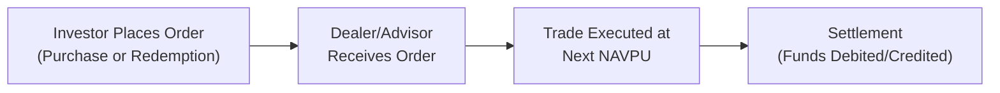

## 10.6 Purchasing and Redeeming Mutual Funds

Purchasing and redeeming mutual funds can feel like a big step, especially if you’re new to investing. Maybe you’ve heard stories about people seamlessly building a nest egg via mutual funds, or perhaps you’ve run into rumors about fees, complicated redemption schedules, and tricky financial jargon. Well, let’s clear the air and walk through, in plain language, how you can purchase and redeem mutual funds, what fees you might face, and what strategies could help you along the way—in a way that hopefully feels more like chatting with a friend than reading a textbook.

Why is this so important? For one thing, mutual funds remain a cornerstone of many Canadians’ investment plans. They’re regulated by the Canadian Securities Administrators (CSA) and overseen by the Canadian Investment Regulatory Organization (CIRO), which helps protect investors like you and ensures funds abide by industry rules. And if you’ve got your eyes on retirement (who doesn’t, right?), or want to systematically invest for a kids’ education or a new home, mutual funds can be one of the easiest ways to build a diversified portfolio—without having to pick individual stocks and bonds yourself.

In this chapter, we’ll walk step by step through the purchasing and redemption process, highlight common pitfalls and best practices, and talk about fees like front-end loads and back-end loads. We’ll also see how strategies like dollar-cost averaging work, and how you can take advantage of pre-authorized contributions and reinvestment of distributions. Let’s get started.

Purchasing a Mutual Fund – The Basics

Purchasing mutual funds generally involves completing an order form or simply calling or emailing your advisor (assuming they have your updated Know Your Client (KYC) information on file). You can buy mutual funds in two main ways:

• Directly from the mutual fund company.  
• Through an authorized dealer or advisor registered with CIRO.  

Today, you might also invest in mutual funds using online brokerage platforms or robo-advisors that handle the details for you digitally. But no matter how you go about it, the purchase procedure is essentially the same. The fund company or dealer ensures your money is invested based on the next calculated Net Asset Value Per Unit (NAVPU). The NAVPU is the price per unit of the mutual fund, which typically changes every business day based on the value of the assets in the fund.

Purchase Price and the Next Calculated NAVPU

When you purchase mutual fund units, you’ll often hit a small timing question: “What is the price I’ll pay?” In many cases, it’s the next NAVPU calculated after the order is received. Let’s say you place your order at 3:00 p.m. Eastern Time, and the mutual fund’s NAVPU is calculated at 4:00 p.m. You would get the price determined at 4:00 p.m. on that same day. If you place your order after the daily fund valuation cut-off (often 4:00 p.m. or 4:30 p.m. Eastern Time), you’d get the next business day’s closing NAVPU.

This mechanism is crucial to ensuring fairness. Everyone who gets their order in before the daily cut-off is treated equally, receiving that day’s closing price.

A Quick Look at a Purchase Flow

Below is a simple flowchart that highlights how a purchase order typically moves from you, the investor, all the way through to settlement.

• Step 1 – You place a buy or sell order for the mutual fund, either through your advisor, an online platform, or directly through the fund company.  
• Step 2 – The order is received by the dealer/advisor, who forwards it to the mutual fund company.  
• Step 3 – The transaction is executed at the next available NAVPU.  
• Step 4 – The money is taken (debited) from your account on settlement day, and you receive units of the mutual fund in your account.

Redemption of Mutual Fund Units – The Basics

Redeeming mutual fund units is essentially asking the fund to cash out some or all of your holdings. By law, a mutual fund in Canada must redeem units from you at the next calculated NAVPU. This is a fundamental aspect of open-end mutual funds: you have the right to liquidate your holdings at the fund’s fair market price (the NAVPU).

Let’s say you need $10,000 for a home renovation or to pay for a big trip. You can redeem the necessary amount, and the proceeds—less any fees—will typically be deposited into your bank account within a specified timeframe (often two or three business days). The redemption price is again based on that next calculated NAVPU once the fund company receives your request.

What about fees or charges on redemption? Some mutual funds might impose fees when you sell your units, especially if these funds were purchased under a back-end load or “deferred sales charge” arrangement. In other words, watch out for “back-end loads” if you’re planning to redeem units early. We’ll dive into these loads in the next section.

Front-End Load, Back-End Load, and No-Load Funds

The mutual fund landscape offers a mix of fee structures. Some of the most common fee structures are:

Front-End Loads  
A front-end load is a sales charge you pay when you buy the mutual fund. For example, suppose you invest $10,000 in a fund with a 3% front-end load. The $300 is taken off your initial investment at the time of purchase, and $9,700 goes directly into the fund. Front-end loads can often be negotiable, depending on your advisor and the dealer’s policies.

Back-End Loads (Deferred Sales Charges or DSC)  
Back-end loads, also known as deferred sales charges, are typically paid only if you redeem your units before a certain number of years have passed. The fee usually decreases over time, for example from 6% in the first year, down to 0% after six or seven years. That said, back-end loads have fallen out of favor in many corners of the industry, and certain provincial regulators limit or have phased them out. Nevertheless, you might still see DSC funds in existing portfolios or in older fund arrangements.

No-Load Funds  
No-load funds do not charge a direct sales fee at purchase or redemption, though they typically still charge ongoing operating expenses and management fees. A no-load fund may look less expensive up front, but do keep in mind that the management expense ratio (MER) might be somewhat higher in certain cases, or other fees can be embedded in the fund. The overall cost can vary widely, so read your Fund Facts document to understand the total fees.

Sales Charge Example – A Quick Story  
Years ago, I (like many newbie investors) had no clue about loads or fees. I remember walking into a bank branch, excited to invest my first $2,000. The mutual fund rep asked, “Is a front-end load fine?” and I nodded along. Next thing I knew, $1,940 went into my actual investment, and $60 was gone in fees. I was slightly shocked—though it was a small-ish amount, it was surprising. That was my first lesson in reading the fine print before just nodding along. You know, a little heads-up would have been nice.

Switch or Exchange Privileges

Many fund families allow investors to “switch” or “exchange” units from one mutual fund to another within the same fund family without incurring an additional sales charge (or at least at a reduced charge). Sometimes, these switches don’t trigger immediate capital gains taxes if the funds are considered different “series” or “classes” within the same trust structure. However, in many circumstances, switching from one fund to another—even within the same fund family—can be a deemed disposition for tax purposes unless you’re within a tax-sheltered plan (like an RRSP or TFSA). So while your dealer might not charge a fee for the switch, you’ll still have to watch for potential tax consequences in a non-registered account.

Exchange privileges can be convenient for rebalancing your portfolio or adjusting your asset allocation strategy over time. Some people systematically switch from growth-oriented equity funds to more conservative bond funds as they approach retirement, and they enjoy the convenience of doing it within the same fund family. It’s a strategy worth discussing with your advisor—just keep an eye on any short-term trading fees and always confirm the tax implications.

Dollar-Cost Averaging (DCA)

Dollar-cost averaging is one of those strategies that sounds fancy but is really just about investing a fixed amount of money at regular intervals, regardless of the price. For instance, you might decide to invest $500 into a mutual fund on the 15th of every month. When the market is down, that $500 buys more units; when the market is up, it buys fewer. Over time, the idea is that you “average out” the cost of your units, easing the emotional rollercoaster of trying to time the market.

Here’s a simplified example:

• January 15: You invest $500 at a NAVPU of $20 → You buy 25 units.  
• February 15: You invest $500 at a NAVPU of $25 → You buy 20 units.  
• March 15: You invest $500 at a NAVPU of $10 → You buy 50 units.  
• April 15: You invest $500 at a NAVPU of $25 → You buy 20 units.  

You end up with 115 units total for $2,000 of investment, averaging around $17.39 per unit. Over time, if the fund’s price rises above that average cost, you come out ahead. At the same time, you avoid the stress of deciding if the market is “too high” or “too low.” This is a popular strategy offered by many mutual fund companies through something known as a Systematic Investment Plan (SIP) or Pre-Authorized Contribution Plan (PAC).

Optional Features: Systematic Investment Plan and Distribution Reinvestment

Systematic investment plans (SIPs) and reinvestment of distributions can turbocharge your investing by automating it. With an SIP, you set up an arrangement with your advisor or directly with the fund company to deposit money into the mutual fund at specific intervals (weekly, monthly, quarterly—whatever suits your plans). This approach ties in nicely with dollar-cost averaging, as you’re effectively buying regularly regardless of the unit’s price on that day.

Meanwhile, many funds distribute interest or dividends (or even capital gains) if the underlying securities generate those. Rather than sending that money back to you in cash, you can opt to reinvest these amounts to buy more units of the same fund, letting your investment compound over time. It’s a strategy often recommended for investors focused on growth and not reliant on the fund’s income for day-to-day expenses.

Redemption Proceeds and Settlement Timelines

Once you decide to redeem your mutual fund units (maybe you need cash for a new car—or maybe times are tough, and you just want to de-risk your portfolio), the mutual fund is legally bound to redeem your units at the next NAVPU. Typically, you’ll receive the proceeds within two or three business days from the trade date. Some funds can turn it around faster; others might have special redemption rules or slightly longer settlement times, but two to three business days is the industry norm in Canada.

Be mindful that if you have a back-end load, or if you’re redeeming from a fund with short-term trading restrictions, fees may apply. Additionally, taxes might be triggered if you hold your mutual fund units in a non-registered account and the value of your holdings has appreciated. So it’s always wise to check with your advisor or read the Fund Facts before pulling the trigger to sell. On the bright side, for many typical mutual funds, there won’t be any special “lockup” or complicated procedure—redemption is a standard transaction, though it may come with cost or tax consequences.

Advisor Disclosures and Suitability

Under Canadian regulations, especially under CIRO’s purview, advisors are required to disclose all costs and fees associated with whichever fund you buy or redeem. This includes talking about the Management Expense Ratio (MER), sales charges, potential trailing commissions, or short-term trading fees. When you go through the process, you should come away with a sense of exactly how much you’re paying and what portion of your money is actually getting invested.

Additionally, advisors must follow the Know Your Client (KYC) and suitability requirements. This means they need to make sure the mutual fund aligns with your financial goals, risk tolerance, and time horizon. Whether you’re purchasing or redeeming, the decision should be consistent with your holistic plan. In other words, if you’re 25 years away from retirement, it might not be suitable for you to park all your funds in a super-conservative money market mutual fund. Then again, it might be more suitable if you just want a short-term holding place for your emergency fund. Your advisor’s job includes discussing these nuances and ensuring the solution is tailored to your needs.

Practical Example: Lisa’s Systematic Investment Journey

To make sense of all this, let’s take the case of Lisa, a 29-year-old teacher who wants to start building a retirement fund. She decides on a balanced mutual fund that invests in both equities and fixed-income securities. Here’s how she does it:

• She speaks with a CIRO-registered advisor, who updates her KYC profile and confirms that a balanced mutual fund aligns with her moderate risk tolerance and 25-year horizon.  
• She sets up a Pre-Authorized Contribution Plan to buy $300 worth of fund units on the 1st of every month. This is her “dollar-cost averaging” plan.  
• The fund has a front-end load of 2%, but Lisa negotiates it down to 1%, so only $2.97 out of every $3.00 invests in the fund. Alternatively, she could have searched for a no-load version, but it had a slightly higher MER. She weighed the pros and cons and decided this was the best fit.  
• After five years, Lisa has contributed $18,000 (60 months × $300), and the value of the fund is $22,000. She hasn’t sold any units, so there are no redemption fees or capital gains taxes to worry about right now (it’s in an RRSP, so taxes are deferred).  
• Lisa’s circumstances change, and she wants to shift a portion of her holdings to a more conservative bond fund within the same family. Her advisor initiates a “switch” from part of her balanced fund to a bond fund. Because it’s within the same fund family, there’s no additional load, though it triggers no immediate tax event since it’s within her RRSP. If she held these funds in a non-registered account, there might be capital gains tax implications.  
• Lisa continues her monthly contributions in the new ratio across both funds. If she ever needs to redeem some funds, she can do so at the next NAVPU and should get the proceeds in two or three business days, minus any back-end fees (which don’t apply here, because she opted for a front-end load approach) and any growth-based taxes if she’s in a non-registered environment.

This story highlights how fees, loads, and redemption rules can apply differently to every situation. Suitability is key—Lisa’s advisor helps her navigate the complexities, ensuring the strategies match her goals.

Common Pitfalls and Best Practices

• Not Checking the Time of Day: Ordering just after the cut-off for the day’s NAVPU might cause unexpected outcomes in your pricing.  
• Failing to Ask About Fees: Upfront, ongoing, and redemption fees vary. Always check the Fund Facts or ask your advisor.  
• Overlooking Taxes: Switching funds or redeeming can trigger capital gains if you’re not in a registered account.  
• Ignoring Short-Term Trading Fees: Some funds penalize you for flipping in and out quickly, so confirm if short-term penalties apply.  
• Neglecting Suitability: Even if a fund has a fantastic performance history, it might not fit your risk profile or time horizon.  

Regulatory Protections

CIRO is now Canada’s single self-regulatory organization overseeing investment dealers, mutual fund dealers, and marketplace integrity. Historically, the Mutual Fund Dealers Association (MFDA) and the Investment Industry Regulatory Organization of Canada (IIROC) were separate bodies, but they amalgamated into CIRO on January 1, 2023, to streamline regulation. If your dealer or advisor is a member in good standing with CIRO, they must adhere to specific rules, including proper disclosure of fees, the timely settlement of trades, and the KYC/suitability process.

Additionally, the Canadian Investor Protection Fund (CIPF) offers coverage in case your investment dealer becomes insolvent. This coverage is now universal for all CIRO member dealers, including those historically supervised by the MFDA and IIROC. Keep in mind, the CIPF covers only the insolvency of the firm—not market losses.

Helpful Tables and Charts

Below is a simple table illustrating different load types, how long the fees might apply, and typical considerations:

| Fee Structure        | When It’s Charged                      | Typical Range         | Key Considerations                                                                               |
|----------------------|----------------------------------------|-----------------------|--------------------------------------------------------------------------------------------------|
| Front-End Load       | At Purchase                            | 0% to 5% (Negotiable) | Immediately deducted from your contribution. Often negotiable and can reduce your invested amount. |
| Back-End Load (DSC)  | At Redemption (Declines Over Time)     | 0% to 6% (Year 1)     | Declines to 0% after ~6–7 years. Avoid early redemptions or switching outside fund family.         |
| No-Load Fund         | None at Purchase or Redemption         | 0%                    | Appears "cheaper" up front, but you still pay the fund’s MER.                                     |

Key Takeaways

1. Purchase Price is the Next NAVPU: Whether you buy or redeem, you generally get the next calculated NAVPU after your order is received.  
2. Fees Vary: Front-end loads, back-end loads, and no-load structures can drastically impact your costs.  
3. Redemption is Legally Guaranteed: By law, mutual funds must redeem your units at the next NAVPU, usually within a few business days.  
4. Switch Privileges Exist: Switching within the same fund family can save you from additional sales charges, but mind any tax triggers.  
5. Dollar-Cost Averaging Smoothing (DCA): Regular investing can help reduce the stress of market timing and potentially lower your average cost.  
6. Transparency is Mandatory: Advisors must disclose all fees and ensure suitability under CIRO rules. Always ask questions if something is unclear.  

References and Additional Resources

• CIRO:  
  https://www.ciro.ca/ (Rules, regulations, and membership requirements)  
• CSA Investor Tools:  
  https://www.securities-administrators.ca/ (Investor education and tips on mutual funds)  
• “The Basic Principles of Mutual Fund Investing” (various industry publications)  
• Dollar-Cost Averaging Articles: Search for “Dollar-Cost Averaging Guidance” for insights, or look for resources on “Systematic Investment Plans” at your chosen fund provider’s website.  

You’ve now got a roadmap to navigate the process of purchasing and redeeming mutual funds, including how the price is set, the fees you might face, and the strategies you can employ—like dollar-cost averaging and systematic plans—to make the most of your investments. Sure, there’s more to learn, but this is a solid foundation. Ask your advisor for clarifications whenever you’re unsure, keep your eye on fees, and remember that your best defense is a well-researched plan that fits your unique goals.

## Practice Quiz: Mutual Fund Purchases and Redemptions



### Which price will an investor typically pay when purchasing mutual fund units?

- [ ] The opening price on the day the trade is placed
- [x] The next calculated NAVPU after the purchase order is received
- [ ] The previous month’s average NAVPU
- [ ] The highest NAVPU of the trading day

> **Explanation:** Mutual funds are purchased or redeemed based on the next calculated NAVPU after the order is received (prior to the daily cut-off time).  

### In a Deferred Sales Charge (DSC) structure, when is the fee most commonly applied?

- [ ] Immediately upon purchase
- [ ] After five business days
- [x] When investors redeem their units, typically decreasing over time
- [ ] There are no fees applied under a DSC structure

> **Explanation:** Under a DSC agreement, the fee is deferred until redemption, and it usually decreases annually until it reaches zero, often within six to seven years.  

### Which of the following best describes dollar-cost averaging?

- [ ] Purchasing a one-time lump sum of units at the year’s lowest NAVPU
- [x] Investing a fixed amount regularly regardless of unit price
- [ ] Selling a portion of the fund every month to lock in gains
- [ ] Averaging the annual management fee over a set period

> **Explanation:** Dollar-cost averaging involves investing a fixed dollar amount at regular intervals, allowing investors to buy more units at lower prices and fewer at higher prices.  

### How soon do investors typically receive proceeds after redeeming mutual fund units?

- [ ] Immediately upon placing the sell order
- [x] Within two to three business days after the trade date
- [ ] At the next monthly settlement minus a 10% penalty
- [ ] Never, mutual funds do not have redemption privileges

> **Explanation:** By law, open-end mutual funds in Canada must process redemptions at the next NAVPU and typically deliver the proceeds to investors within two to three business days.  

### Which statement is TRUE regarding switching between mutual funds within the same fund family?

- [x] Some switches may not trigger additional sales charges within the same family
- [ ] Switching always triggers a penalty fee
- [x] Tax consequences may still apply in a non-registered account
- [ ] Switching within the same family is not permitted under Canadian regulations

> **Explanation:** Switching funds within the same family can sometimes be done without an additional sales charge, but in a non-registered account, each switch may be deemed a disposition, potentially triggering capital gains taxes.  

### What is a front-end load?

- [x] A sales charge applied at the time of purchase
- [ ] A fee charged when redeeming units
- [ ] A rebated fee that investors receive upon maturity
- [ ] An additional cost on management fees

> **Explanation:** A front-end load is a commission or fee deducted from the initial investment amount at the time of purchase.  

### CIRO’s role in mutual fund regulation includes:

- [x] Overseeing registration of dealer/advisor firms
- [ ] Selling mutual funds on behalf of unitholders
- [x] Setting standards for disclosure and investor protection
- [ ] Providing guaranteed returns through CIPF

> **Explanation:** CIRO (formed by the amalgamation of the MFDA and IIROC) regulates member dealers/advisors, enforces compliance with industry rules, and oversees investor protection standards. CIPF is separate and covers client assets in case of insolvency, not performance.  

### What is the primary benefit of reinvesting mutual fund distributions?

- [x] Compounding growth by purchasing additional fund units
- [ ] Avoiding taxes completely in non-registered accounts
- [ ] Receiving higher interest rates than T-bills
- [ ] Skipping out on management fees

> **Explanation:** Reinvesting distributions, such as dividends or interest, can increase the total number of units you hold, leveraging compound growth over time.  

### What potential consequence should investors be aware of when switching between funds in a non-registered account?

- [x] Triggering a capital gain (or loss) for tax purposes
- [ ] Causing a total forfeiture of distributions
- [ ] Incurring a penalty from CIRO
- [ ] Being disqualified from future fund purchases

> **Explanation:** Even if switching occurs within the same fund family, in a non-registered account you might still trigger capital gains or losses, creating a possible tax liability.  

### Is dollar-cost averaging guaranteed to outperform a lump-sum investment strategy?

- [x] True
- [ ] False

> **Explanation:** This statement is false in a strict sense. While dollar-cost averaging can reduce the emotional stress of investing and help average out purchase prices, it is not guaranteed to outperform lump-sum investments, especially in steadily rising markets.  


