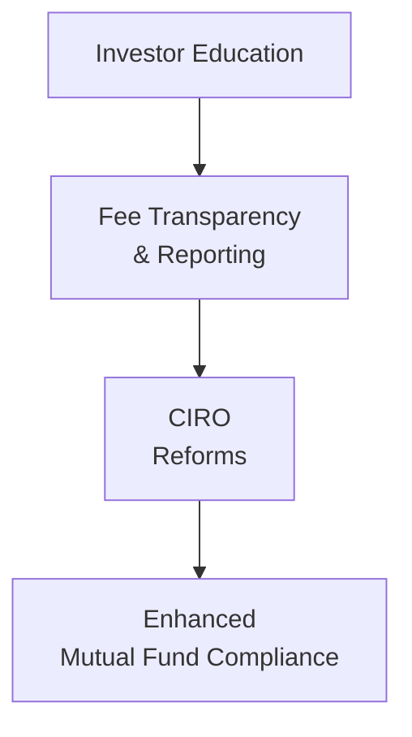

## 10.7 Additional Considerations in the Modern Mutual Fund

Imagine chatting with an old friend who asks: “So, you know, what’s so new about mutual funds these days? Isn’t a mutual fund just some big pot of stocks and bonds?” You take a sip of coffee and think—huh, I used to see it that way too, but the mutual fund industry has come a long way. These days, mutual funds continue to evolve in ways that would have surprised even the most visionary advisors from just a decade ago. Technology is reshaping how funds are distributed and managed, environmental and social factors are a bigger part of investment decisions, and regulators are calling for greater transparency every step of the way. Below, we’ll explore the main developments that drive today’s modern mutual fund market and the practical implications for investors and advisors alike.

<!-- START OF MAIN CONTENT -->

### Technological Innovations in Mutual Fund Access  
Technological innovations—well, they’re practically everywhere you look. In the mutual fund space, technology has done more than just spice up the user interface of online brokerages. It has fundamentally changed the relationship between investors, advisors, and fund companies.

• Online Brokerages and Platforms: Online brokerages first made headlines by allowing investors to buy and sell stocks for lower transaction fees. These platforms quickly extended their offerings to mutual funds—so, for example, you can click a few buttons at 2 AM and invest in your favorite fund without waiting for a branch to open. For self-directed investors, it’s convenient and budget-friendly.  
• Robo-Advisors: The next level of innovation introduced automated or “robo” advisory platforms. These platforms gather your preferences (such as risk tolerance, time horizon, and personal goals) through online questionnaires. The system then constructs and rebalances a portfolio—often using mutual funds or ETFs—based on algorithmic advice. Robo-advisors can also incorporate tax-loss harvesting or other advanced strategies automatically.  
• Mobile Apps and Constant Connectivity: We’re now at a point where real-time data, instant notifications, and portfolio updates are in the palm of your hand. Investors can see how their fund holdings are performing and even set up automated contribution plans from their smartphones.  

Of course, technology comes with its share of pitfalls. Automated services, for instance, may oversimplify complex client profiles or fail to capture nuanced life events—like a sudden windfall or job loss. Also, unless you’re engaged in ongoing education, “do-it-yourself” platforms can sometimes lull you into a false sense of security. The good news is that these digital offerings typically provide more transparency on returns, fees, and performance metrics, empowering you to make more informed decisions.  

### ESG Factors and Responsible Investing  
There’s a growing chorus of investors who say, “Hey, it’s not just about making money; I’d like to ensure my investments aren’t harming the planet or society.” This is the essence of Environmental, Social, and Governance (ESG) investing. Let’s be honest—ESG can sometimes feel like a buzzword. Is it legit or is it marketing fluff?  

In practice, ESG funds pledge to consider a company’s environmental impact, labor practices, board independence, and other intangible factors in selecting investments. Some funds explicitly exclude harmful industries—like tobacco or coal—while others weight holdings toward companies with more sustainable business models. Many large banks and specialized fund companies have created ESG-labeled mutual funds aimed at socially conscious investors.  

> A personal anecdote: I remember speaking with a friend who was horrified to see a tobacco company in her portfolio holdings. She immediately asked her advisor for a more “green” alternative. The advisor recommended an ESG equity fund that screens out tobacco, firearms, and certain fossil-fuel companies. By the end of the year, the fund performed quite competitively, so she felt good both financially and ethically.  

But keep in mind, a big challenge with ESG investing is that not every fund follows the same criteria or weighting. Some investors worry about “greenwashing,” where a fund claims to be ESG-friendly but merely tweaks its language without making meaningful changes to its holdings. Regulators have stepped in with ESG disclosure requirements, ensuring that fund managers clearly outline their selection criteria and risk assessments. In Canada, the Canadian Securities Administrators (CSA) have put forward notices guiding how ESG funds should disclose their strategies.  

### Evolving Performance Reporting  
Next on the list? Performance reporting. In the past, investors often received an annual statement with a generic performance figure. Maybe that statement told you a fund’s average annual return (net of fees) or how it benchmarked against a major index. These days, performance reporting has become more personalized and more frequent.  

• Personalized Rate-of-Return Statements: Advisors and fund companies now provide calculations tailored to each individual’s invested amount and holding period. This helps investors see the actual impact of things like dollar-cost averaging over time.  
• Interactive Dashboards: Many online platforms feature dashboards that break down your returns by asset class, region, or sector. Some even show you how specific contributions and withdrawals affected your overall performance.  
• Comparison with Financial Goals: Instead of measuring success solely against a major index like the S&P/TSX Composite, some statements compare actual results to the investor’s target. (For instance: “You aimed to save $50,000 for a future down payment over five years. After year two, you are on track or behind/above track.”)  

The impetus behind this trend partly comes from regulatory bodies, including the new Canadian Investment Regulatory Organization (CIRO). Under client-focused reforms (CFRs), advisors must ensure investors understand how their portfolios are performing in relation to their goals, not just the market average.  

### Greater Cost Transparency and Fee Structures  
Have you ever dug into a mutual fund’s Management Expense Ratio (MER) and thought, “Wait, what exactly am I paying for?” Don’t worry, you’re not alone. Historically, many investors were fuzzy about fees—trailed commissions, operating expenses, management fees, and more.  

But now there’s a big push, from regulators and industry associations, for mutual fund companies and dealers to present fees in plain language. That means:  

• Explicit Disclosure of MER and Management Fees: The MER includes management fees and operating expenses. It’s typically expressed as a percentage of the fund’s average net assets. If the MER is 1.5%, and you invest $10,000, you can expect to pay around $150 a year in fees (though this amount is taken out of the fund’s assets, not charged directly to you as a bill).  
• Trailing Commissions vs. Fee-Based Accounts: If your mutual fund pays a trailing commission to your dealer/advisor, you should see that cost disclosed separately. Advisors and dealers must inform you how these fees might impact your returns and whether there are alternative fee structures (like fee-based accounts) that could better align with your interests.  
• Ongoing Cost Reporting: Some statements now show how much of your money went to fees in dollar terms over the reporting period. This can be an eye-opener if you’re used to seeing just percentages.  

Yes, cost transparency can stir up tough conversations—especially if an investor realizes that high-fee funds are underperforming. Advisors are compelled to show their value in intangible ways, such as financial planning, behavioral coaching, and customized advice.  

### CIRO’s Client-Focused Reforms  
The new SRO in Canada, known as the Canadian Investment Regulatory Organization (CIRO), represents a merging of two former entities: the Mutual Fund Dealers Association of Canada (MFDA) and the Investment Industry Regulatory Organization of Canada (IIROC). As of January 1, 2023, these predecessor organizations no longer exist in their separate forms.  

Under CIRO’s client-focused reforms (CFRs), the industry has to move beyond transactional thinking. Advisors must:  

• Put Clients’ Interests First: Each recommended product or service should be vetted to ensure it aligns with the client’s investment objectives, risk tolerance, and time horizon. It’s not about pushing the “product of the month.”  
• Enhance Product Due Diligence: Before even hitting the “buy” button, advisors (and their dealing firms) must conduct thorough research on the mutual funds they offer—including features, risks, fees, and how the fund’s strategy fits into an investor’s portfolio.  
• Provide Meaningful Disclosure: The new environment encourages deeper conversations about conflicts of interest, compensation models, and risk.  

In other words, the relationship between advisor and client is more of a partnership than ever. Advisors have a professional and ethical obligation to educate and guide, while clients are encouraged to ask follow-up questions and understand the reasoning behind investment decisions.  

### Cross-Border Investing and Currency-Hedged Funds  
Another area that’s gaining traction among mutual fund investors is cross-border investing. Many Canadians realize that focusing solely on domestic markets can limit diversification opportunities. Maybe you see potential in the U.S. technology sector or want exposure to emerging markets in Southeast Asia.  

With such global outlooks, currency fluctuations become a major consideration. Enter the currency-hedged fund. A currency-hedged mutual fund aims to mitigate the impact of exchange rate changes by using derivative tools to lock in or offset currency exposure.  

Let’s illustrate:

• When It Helps: If the Canadian dollar unexpectedly strengthens against foreign currencies, your unhedged foreign investment could lose value in CAD terms. A currency hedge protects you against some of this downside.  
• Potential Costs: Hedging instruments are not free. They can slightly lower a fund’s net returns if the currency moves in your favor. In short, hedging can be viewed as an insurance policy—beneficial if exchange rates move against you, but a drag if they move in your favor.  

From a strategic perspective, cross-border diversification can reduce correlation among assets in your portfolio, potentially smoothing out overall returns. Funds that invest globally also open the door to industries and regions that might be more vibrant than the domestic market at a given point in time.  

### Investor Education in an Evolving Marketplace  
With a slew of new products, tools, and regulations on offer, investor education becomes downright critical. Advisors are no longer just gatekeepers of investment products; they’re also educators who help clients sift through mountains of information.  

• Plain Language Resources: Fund companies and regulators (including CIRO) have published brochures, guides, and online tutorials that break down the basics of mutual fund investing. Many of these focus on risk metrics, cost breakdowns, and the importance of having a personal financial plan.  
• Seminars and Webinars: Whether in person or virtual, educational events allow you to ask direct questions: “What’s the difference between an actively managed mutual fund and a passive index fund? What’s the difference between an ESG-themed fund and a standard equity fund?”  
• Role of Ongoing Communication: Market conditions can change fast. Remember March 2020, when the pandemic unsettled global markets? That’s when advisors had to proactively reach out to calm nerves, emphasize long-term perspectives, and adjust plans if needed.  

No two investors are alike—what might be suitable for your neighbor might not be the best choice for you, especially if you differ in risk tolerance, timeline, or even personal values. That’s why knowledge remains a powerful ally, helping you filter out noise and concentrate on the decisions that align with your own objectives.  

### Continuous Regulatory Reforms and Industry Feedback  
Finally, it’s essential to note that regulators perpetually consult with industry stakeholders, consumer groups, and investor advocates to refine existing rules. Themes like “greater transparency,” “fair dealing,” and “investor protection” always show up in these discussions, but the debates can heat up around how best to apply them.

• Enhanced Disclosure: Expect even clearer statements on fees, performance, and risk. The shift toward personalized reporting will likely intensify, giving investors a more accurate understanding of how their funds fare over time.  
• Focus on Conflicts of Interest: Regulators remain vigilant in ensuring that no hidden incentives or undisclosed affiliations undermine client welfare.  
• Adoption of New Technologies: As digital platforms evolve, so might the guidelines around data privacy, cybersecurity, and recordkeeping.  

These regulatory developments typically roll out in phases, with ample notice for industry participants to adapt. It’s a dynamic process, and whether you’re an advisor or investor, staying abreast of new guidelines helps you keep your financial plan in line with current best practices.  

---

### Practical Example: A Case Study in Modern Mutual Fund Investing  
Let’s say you’re a 35-year-old professional named Casey who wants to invest responsibly but also gain exposure to global markets. Casey logs onto a robo-advisory platform, which offers a recommended portfolio that includes:  

1. An ESG-oriented Canadian equity mutual fund (to align with Casey’s social values).  
2. A global equity mutual fund with partial currency hedging (to mitigate currency risk exposure).  
3. A small portion in a global bond fund for some fixed-income stability.  

A few months later, Casey notices that the personal rate-of-return statement is slightly lower than the generic fund performance listed in marketing materials. Why? Because Casey made monthly contributions, so timing and compounding played a role. The statement also indicates exactly how much in fees went toward the MER and how much was paid to trailing commissions.  

After seeing these fees laid out, Casey decides to open a conversation with a human advisor for a second opinion. The advisor explains that while the robo-advisor’s automated approach is cost-effective, sometimes an in-person consultation can help refine Casey’s asset allocation further—especially if there are changes in personal life events or new opportunities in alternative mutual funds.  

Ultimately, Casey feels more informed, appreciating both the convenience of technology and the tailored advice from a professional. It’s a modern scenario showcasing how technology, transparent reporting, and robust regulatory oversight can converge to support better investment outcomes.

---

### Best Practices, Common Pitfalls, and What to Watch Out For  
• Best Practices  
  – Embrace Technology Cautiously: Use online platforms or robo-advisors but keep educating yourself. Ask questions, attend webinars, or schedule check-ins with an advisor.  
  – Evaluate ESG Credentials: Read the fund’s prospectus to ensure it truly aligns with your values and not just marketing hype.  
  – Compare Fees and Returns: Look at both the MER and any additional costs. Sometimes a slightly higher-fee fund might offer better performance or specialized strategies.  
  – Stay Informed of Regulatory Changes: Keep track of updates from CIRO or the CSA to ensure your portfolio conforms to current rules and best practices.  

• Common Pitfalls  
  – Overlooking Currency Risk: Investing abroad without considering currency swings can lead to unexpected losses (or gains).  
  – Chasing Performance: Buying a fund just because it soared last year might lead you into a momentum trap. Past performance is not always indicative of future results.  
  – Ignoring Personal Circumstances: Even the best mutual fund can become a poor fit if it doesn’t align with your evolving risk tolerance or goals.  

---

**Diagram Explanation:**  
• Investor Education: The more educated clients become, the more effectively they can assess fees, returns, and fund mandates.  
• Fee Transparency & Reporting: Clear breakdowns of costs and performance data empower investors to make well-informed decisions.  
• CIRO Reforms: Enforcing client-focused mandates ensures products are suitable and aligned with investor needs, culminating in…  
• Enhanced Mutual Fund Compliance: The end result is a more trusting, efficient, and transparent environment that fosters the long-term success of both investors and the broader industry.

---

### References and Additional Resources  
• [CIRO](https://www.ciro.ca) – Canada’s national self-regulatory body overseeing investment dealers and mutual fund dealers; it offers ongoing updates on client-focused reforms.  
• [CSA Notices on ESG Disclosures](https://www.securities-administrators.ca/) – For detailed guidance on ESG requirements for fund managers in Canada.  
• [Responsible Investment Association (RIA)](https://www.riacanada.ca/) – A Canadian organization providing resources, reports, and educational tools for ESG and responsible investing.  
• Academic research and industry white papers – Look for comparative studies on currency-hedged vs. unhedged mutual funds.  

In short, modern mutual funds combine accessibility (through digital platforms), responsible mandates (via ESG considerations), clearer performance metrics, and robust regulatory guidance. As you move forward, be sure to keep an eye on how these trends evolve—and remember there’s a wealth of resources and experts ready to help you navigate this ever-changing financial landscape.

---

## Test Your Knowledge: Modern Mutual Fund Innovations and Responsibilities



### Which of the following best describes a “robo-advisor”?
- [ ] A professional advisor hired by the government to regulate mutual fund fees  
- [ ] A software add-on that tracks only your daily stock market gains  
- [ ] A social media platform that rates advisors based on popularity  
- [x] An online advisory platform that uses algorithms to provide automated portfolio management  

> **Explanation:** Robo-advisors employ automated software and algorithms to manage client portfolios, taking into account goals and risk tolerance.

### What is a primary concern regarding ESG mutual funds?  
- [ ] They avoid friendly shareholder activities  
- [ ] They generally invest only in short-term government bonds  
- [x] Some may overstate their “green” or responsible credentials (greenwashing)  
- [ ] They are illegal in many provinces  

> **Explanation:** Greenwashing can occur when a fund claims to follow ESG principles but fails to meaningfully implement ESG criteria in its investment strategies.

### One way that performance reporting has evolved is by:  
- [x] Providing personalized rate-of-return statements for each investor  
- [ ] Eliminating net asset value (NAV) calculations  
- [ ] Restricting all monthly statements to a single annual update  
- [ ] Refusing to compare fund performance to benchmarks  

> **Explanation:** Personalized rate-of-return statements help investors see performance based on their actual contribution and withdrawal history.

### What does the Management Expense Ratio (MER) primarily represent?  
- [ ] The total income the fund pays to its unitholders  
- [ ] The difference between the highest and lowest share price  
- [x] The annual cost of operating a mutual fund expressed as a percentage of net assets  
- [ ] The percentage of a mutual fund’s returns taxed by the federal government  

> **Explanation:** MER is a common fee measure that includes management fees and operating expenses, shown as a percentage of the fund’s average net assets.

### What key development in Canadian self-regulation took effect in January 2023?  
- [x] The merger of MFDA and IIROC to form CIRO  
- [ ] The prohibition of currency-hedged mutual funds  
- [x] The mandated shutdown of all robo-advisors  
- [ ] The elimination of mutual fund dealers in Saskatchewan  

> **Explanation:** As of January 1, 2023, MFDA and IIROC were amalgamated into the Canadian Investment Regulatory Organization (CIRO).

### CIRO’s client-focused reforms aim to ensure:  
- [x] Advisors prioritize client interests and enhance product due diligence  
- [ ] Fees remain entirely undisclosed to the general public  
- [ ] Investors rely solely on short-term returns for decision-making  
- [ ] Advisors are free to recommend any product without disclosure  

> **Explanation:** CFRs require that all investment recommendations align with the best interests of the client and meet clear suitability requirements.

### How might currency-hedged funds be beneficial to a Canadian investor in global markets?  
- [x] They can mitigate the risk of currency fluctuations impacting returns  
- [ ] They guarantee no capital losses  
- [x] They increase the probability of higher dividends from foreign companies  
- [ ] They are exempt from capital gains taxes  

> **Explanation:** Currency-hedged funds use derivatives to reduce the effect of exchange rate volatility on returns; this can either help or hinder returns depending on currency movements.

### Which statement about cost transparency is correct?  
- [x] New regulations often require explicit disclosure of both direct and indirect fees  
- [ ] Mutual fund providers are not obligated to explain trailing commissions  
- [ ] MERs do not need to be reported if below 1%  
- [ ] Annual statements generally combine fees for multiple funds into a single figure impossible to break down  

> **Explanation:** CIRO and other regulators stress the importance of clear disclosure, including MERs, trailing commissions, and overall costs.

### Which of the following is an advantage of global diversification in mutual funds?  
- [x] It can reduce a portfolio’s overall correlation and volatility  
- [ ] It eliminates all exchange rate risks  
- [ ] It guarantees higher returns than domestic-only funds  
- [ ] It has no link to the performance of global markets  

> **Explanation:** Global diversification can help spread risk across multiple markets and reduce the dependence on a single economy or region.

### True or False: Investor education has become more important due to the growth of robo-advisors and digital platforms.  
- [x] True  
- [ ] False  

> **Explanation:** With the rise of self-directed platforms and automated advice, individual investors need to understand more about fees, risk, and portfolio construction to make informed decisions.


