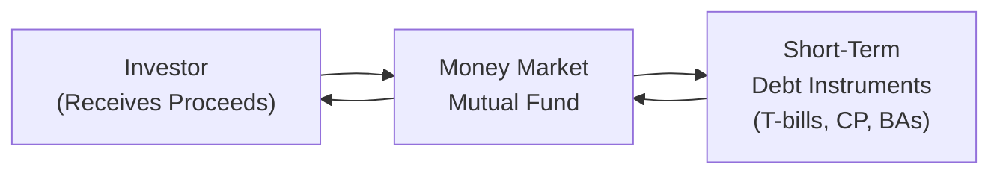

## 11.2 Money Market Mutual Funds

Money market mutual funds are often described as a “safe” haven for your money, but let’s pause for a moment—are they really so safe that you never have to worry about what’s inside them? Well, money market funds do tend to emphasize capital preservation and liquidity, and that’s super important for anyone who wants a temporary home for their cash. But, like with most financial products, it helps to understand how they actually work and which trade-offs come with the territory. 

Below, we’ll explore what these funds are, what they invest in, and why investors often consider them part of a conservative investment strategy. I’ll even share a bit about my own experiences, sprinkle in a personal anecdote or two, and show some common pitfalls to avoid along the way. Let’s get started.

### Key Characteristics of Money Market Mutual Funds

Money market mutual funds typically invest in high-quality, short-term debt instruments. If you’ve skimmed a fund’s factsheet, you might see these instruments labeled as Treasury bills (T-bills), commercial paper, and bankers’ acceptances, among others. The primary goal here? Capital preservation. Let’s face it: if you’re putting your money into a money market fund, you probably don’t want to hear about wild price swings.

• Treasury Bills (T-bills) are short-term government debt instruments, generally issued in maturities from a few days up to 12 months.  
• Commercial Paper (CP) is unsecured short-term debt issued by corporations with strong credit ratings.  
• Bankers’ Acceptances (BAs) are short-term credit instruments guaranteed by a bank—kind of like an IOU stamped with a bank’s guarantee.

These securities are usually very liquid, meaning you can convert them back to cash quickly without the fund incurring big transaction costs or moving the price too much. That’s why money market funds tend to be used as cash substitutes or to park emergency funds. But let’s not kid ourselves: they’re not literally as safe as a bank deposit insured by the Canada Deposit Insurance Corporation (CDIC). Money market mutual funds are not covered by CDIC. Instead, they’re regulated as securities, which means they fall under the supervision of the Canadian Investment Regulatory Organization (CIRO) and provincial regulators. 

Because money market funds primarily invest in short-term debt, they’re sensitive to short-term interest rates. If rates rise, returns on new holdings might climb. Conversely, if rates drop, investors may see more modest yields. But that fluctuation is usually quite small compared to equity funds or even longer-term fixed-income products.

### Personal Anecdote on Money Market Funds

I once worked with a client who was fresh to the investment scene, and the idea of diving right into the stock market gave her the jitters—understandably. She had $10,000 she wanted to keep safe but still wanted to earn something more than the bare-bones interest rate of a standard chequing account. So, we decided, you know what, let’s test the waters with a money market mutual fund. She appreciated how the value of her investment barely fluctuated, and it gave her peace of mind while she learned the ropes of more advanced investments. That’s basically money market funds in a nutshell: peace of mind for short-term needs.

### Primary Objectives: Capital Preservation and Liquidity

Money market funds are basically built around two main objectives:

• Capital Preservation: Nobody wants to lose money in a product that’s supposed to be nearly “cash equivalent.” The managers of these funds tend to focus on the safest short-term securities to lower credit risk and minimize volatility.

• Liquidity: Money market instruments trade frequently in large volumes, allowing the fund to keep enough cash or near-cash instruments on hand that you can redeem your investment quickly.

These objectives often make money market funds a go-to option for a short-term or temporary parking spot for excess cash—maybe you’re saving for a wedding, a vacation, or a new business idea and you want to ensure it stays relatively stable until the time is right.

### Average Maturity and Expense Considerations

Most money market funds keep average maturities that are very short—often under 90 days. That’s how they can slip in and out of positions quickly without incurring big interest-rate risk. A shorter maturity means the fund is less exposed to major fluctuations in interest rates (although not entirely free of them).

On the flip side, these funds often come with management fees and other expenses (commonly grouped into an expense ratio) that reduce their returns. Yields in money market funds tend to be modest, so a high expense ratio can literally eat up a big chunk of your gains. Always watch for the management expense ratio (MER). Even a difference of a fraction of a percentage point can really matter in a low-yield environment.

### Suitability for Investors

Money market funds may be well-suited for:

• Investors with a short-term investment horizon.  
• Individuals with upcoming expenses who want to keep their money safe and readily accessible.  
• People setting up an emergency fund, especially if they’d prefer to keep that money in something that can produce a better return than a no-interest cookie jar.  
• Investors who want to park cash in between active investments—for example, if they just sold equity mutual funds and are waiting for the right time to jump back in.

Some folks (like my friend I mentioned earlier) appreciate the sense of security. Even if the yield is minimal, knowing their principal is relatively safe can soothe a lot of nerves.

### Potential Risks and Considerations

Are money market funds completely risk-free? Not exactly. Here are some of the key risks:

• Credit Risk: If the issuer of the commercial paper or bankers’ acceptance faces financial trouble, it might fail to repay the principal at maturity. While money market funds typically only use high-rated issuers to minimize this risk, it’s never zero.  
• Interest Rate Risk: When interest rates rise quickly, a fund’s previously purchased short-term securities might yield less than newly issued securities. Over time, the fund will adjust its holdings, but in the near term, the return can lag behind current market rates.  
• Expense Risk: The fees and expenses reduce the return. This is not a “risk” in the usual sense—rather a factor you just can’t ignore when yields are already low.  
• Liquidity Constraints: Although money market funds normally invest in highly liquid assets, financial markets can seize up in times of crisis. In rare cases, there can be redemption restrictions or delays if truly extreme conditions occur.

### Government-Only Funds vs. Prime Funds

Under the umbrella of money market mutual funds, there are two main categories:

• Government-Only Funds (a.k.a. Treasury Bill Funds): These focus on government-issued T-bills or other government-backed short-term instruments. Because government issues are generally considered more secure, these funds often carry slightly lower yields.  
• Prime Funds: These hold a mix that can include corporate paper, bankers’ acceptances, and other high-quality instruments. Because corporate paper may offer a higher yield, prime funds might boost returns slightly—albeit with a bit more credit risk.

Which type should you choose? That depends on your personal comfort with even modest increments of extra credit risk. If you’re super risk-averse, government-only might make sense. If you’re okay with a small notch more risk for a small notch more yield, prime funds might be fine.

### Practical Example: Calculating a T-Bill Yield

It’s often helpful to see how yield is computed for a short-term instrument to understand what you might expect inside a money market mutual fund. T-bills are issued at a discount, and the yield calculation commonly looks like this:

\\( \displaystyle \text{Yield} = \left(\frac{\text{Discount}}{\text{Purchase Price}}\right) \times \frac{365}{\text{Days to Maturity}} \\)

For instance, if you buy a 90-day T-bill with a face value of $10,000 at a price of $9,950, your discount is $50. Assuming a 90-day maturity:

\\( \displaystyle \text{Yield} = \left(\frac{50}{9950}\right) \times \frac{365}{90} \approx 2.04\% \\)

When money market funds buy similar instruments, they often hold them for short durations and then roll over the proceeds into new short-term securities. But remember, a portion of that yield can be eaten up by management fees and other expenses. 

### Diagram: Flow of Capital in a Money Market Mutual Fund

Below is a simplified Mermaid diagram to visualize how money moves between the different participants in a money market mutual fund:

• The investor puts money into the fund.  
• The fund invests in short-term debt instruments.  
• Those investments earn interest and mature in a relatively short time.  
• The fund returns proceeds to investors when they redeem their units.

### Selecting a Money Market Mutual Fund

If you’re planning to use a money market fund as your emergency stash or a short-term holding spot, you might be thinking: “How do I pick the fund that’s right for me?” Here are a few tips:

• Review the Fund Facts: This is your cheat sheet on things like the management expense ratio, past performance, credit quality, and average maturity.  
• Check the Expense Ratio: A seemingly small difference of 0.2% in management fees can significantly impact your net returns if the annual yield is only around 1% to 3%.  
• Consider Credit Quality: Many funds outline the quality of the issuers they invest in. Government-only funds focus on T-bills, whereas prime funds might include corporate or bank paper.  
• Look at Historical Returns and Stability: Though historical performance is not a guarantee of future results, you can get a sense of how stable the returns have been, especially in times of market stress.  
• Understand the Redemption Process: Usually, money market funds allow daily redemptions, but confirm you know how quickly you can get your cash.

### Real-World Scenarios

• Parking Business Funds: Suppose you’re a small business owner who wants a short-term place to store your payroll or tax obligations. A money market fund could be a viable option over a zero-interest checking account, assuming you’re comfortable with the small risk.  
• Holding Place Between Trades: Maybe you sold your equity mutual fund but aren’t ready to invest in the bond market or something else. Instead of leaving it idle, you park it in a money market fund until you make your decision.  
• Conservative Retirement Strategy: Some retirees keep a portion of their capital in money market funds to deal with monthly expenses. It might not generate a ton of interest, but it offers easy access to funds without major risk to principal.

### Glossary

• Treasury Bill (T-bill): Short-term government debt instrument, generally with maturities up to one year, issued at a discount and redeemed at par.  
• Commercial Paper: Short-term unsecured promissory notes issued by corporations with high credit ratings.  
• Bankers’ Acceptances (BAs): Short-term debt instruments guaranteed by a bank, often traded at a discount.  
• Liquidity: How quickly and easily an asset can be converted to cash without significantly affecting its price.  
• Cash Equivalent: An investment so liquid and secure it’s considered almost as good as cash.  
• Expense Ratio: The annual fee (as a percentage of assets) that mutual funds charge their unitholders.  
• Credit Risk: The possibility that a debt issuer may be unable to make principal or interest payments.

### Regulatory and Institutional Landscape

In Canada, money market funds, like all mutual funds, are governed by the relevant securities legislation and monitored by CIRO (the Canadian Investment Regulatory Organization), which replaced the old IIROC and MFDA. Remember that money market mutual funds are usually not covered by the Canada Deposit Insurance Corporation (CDIC). CDIC only covers certain deposit products at member financial institutions (e.g., GICs under certain conditions, savings accounts, etc.).

It’s worth noting that the Canadian Investor Protection Fund (CIPF) now serves as Canada’s sole investor protection fund. CIPF might provide coverage if a CIRO dealer becomes insolvent—but that coverage focuses on missing property in your account, not investment losses. If the fund’s underlying securities lose value (though unlikely in a money market fund context), CIPF doesn’t insure you against that investment loss. 

### Additional Resources

If you want to keep digging:

• Visit CIRO’s website at [https://www.ciro.ca/](https://www.ciro.ca/) for ongoing updates on regulatory requirements and investor protection specifics.  
• Check out the Bank of Canada’s Money Market Operations at [https://www.bankofcanada.ca/markets/market-operations-liquidity-provision/](https://www.bankofcanada.ca/markets/market-operations-liquidity-provision/) to learn how monetary policy affects short-term rates.  
• Although money market funds aren’t CDIC-insured, read about deposit insurance at [https://www.cdic.ca/](https://www.cdic.ca/) to understand the broader safety net for individuals’ deposits in Canada.  
• “Guide to Money Market Investments” on Investopedia at [https://www.investopedia.com/](https://www.investopedia.com/) for a quick primer on various short-term instruments.  
• “Short-Term Financial Management” by John Zietlow, if you need a traditional textbook with deeper detail on cash management.  
• The Canadian Securities Institute (CSI) provides an array of courses, including “Investment Fundamentals,” to sharpen your knowledge of investment products.

---

## Test Your Knowledge: Money Market Mutual Funds & Conservative Investing



### Which of the following is the primary investment objective of money market mutual funds?
- [x] Capital preservation and liquidity
- [ ] Significant capital appreciation
- [ ] High long-term growth
- [ ] Speculative gains

> **Explanation:** Money market funds focus on preserving capital and providing high liquidity, not on delivering high growth or speculative gains.

### What is the typical maturity range for the short-term debt instruments in a money market mutual fund?
- [ ] 5 to 10 years
- [x] Often under 90 days
- [ ] Exactly 180 days
- [ ] At least 2 years

> **Explanation:** Money market mutual funds generally invest in instruments with very short maturities, often under 90 days, to maintain liquidity and stability.

### Which of the following best describes a Treasury bill (T-bill) in the context of money market investing?
- [x] A short-term government-issued debt instrument, sold at a discount and redeemed at par
- [ ] A long-term government bond with high yield
- [ ] An unsecured promissory note from a corporation
- [ ] A short-term deposit protected by CDIC

> **Explanation:** T-bills are short-term debt instruments issued by the government at a discount. They are not insured by CDIC, and they are not corporate securities.

### Which factor drastically reduces net returns in a money market fund, especially in lower interest-rate environments?
- [x] Management expense ratio (MER)
- [ ] Overdraft fees
- [ ] Brokerage account inactivity fees
- [ ] Currency exchange fees

> **Explanation:** The management expense ratio (MER) can significantly impact the net return in a low-yield environment, making a small difference in fees quite meaningful.

### Money market mutual funds typically:
- [x] Are considered conservative investments  
- [ ] Guarantee no credit risk  
- [x] Offer high liquidity  
- [ ] Mimic typical equity-like returns

> **Explanation:** Money market mutual funds are known for their conservative profile and liquidity, but they do not guarantee zero credit risk, and they do not offer equity-like returns.

### Which of the following is a key difference between Government-Only money market funds and Prime money market funds?
- [x] Government-Only funds focus on T-bills and government-backed securities, while Prime funds may include corporate paper
- [ ] Prime funds are fully insured by CDIC, whereas Government-Only funds are not
- [ ] Government-Only funds hold longer maturities  
- [ ] Prime funds typically carry no credit risk

> **Explanation:** Government-Only funds invest in T-bills or other government-guaranteed securities, whereas Prime funds may hold corporate and bank paper. Prime funds often aim for a marginally higher yield but may carry slightly higher credit risk, and neither type is insured by CDIC.

### Which scenario is best suited for money market mutual funds?
- [x] A short-term holding place for cash reserves  
- [ ] A long-term growth investment for retirement 30 years away  
- [x] Parking money temporarily between bigger investment decisions  
- [ ] Speculative trading with high volatility

> **Explanation:** Money market mutual funds are typically used for very short-term needs or as a parking place for cash because they prioritize safety and liquidity over growth or speculation.

### If interest rates rise sharply, how might an existing money market mutual fund’s yield respond in the short term?
- [x] It may lag behind current market rates temporarily
- [ ] It will immediately match the new market rate
- [ ] It will have no impact on the yield
- [ ] It will drop to zero

> **Explanation:** Because the fund holds short-term instruments purchased before rates rose, the yield might initially lag behind until the older holdings mature and are replaced with higher-yielding new instruments.

### What is credit risk in the context of money market mutual funds?
- [x] The potential that a debt issuer may not repay principal or interest
- [ ] The guarantee that an issuer will make all payments on time
- [ ] The certainty that all funds are CDIC-insured
- [ ] The risk of a bank run

> **Explanation:** Credit risk is the possibility that the issuer of the underlying debt instruments (e.g., commercial paper) could default on payment of principal or interest.

### True or False: Money market funds are covered by the Canada Deposit Insurance Corporation (CDIC).
- [x] True
- [ ] False

> **Explanation:** This is a trick question. The correct statement is that they are NOT covered by CDIC. So, if you chose True, you've checked the fact that the statement as displayed (“Money market funds are covered by the CDIC”) is false, meaning you’re acknowledging that money market funds are indeed not covered by CDIC. Always verify coverage details before investing.




