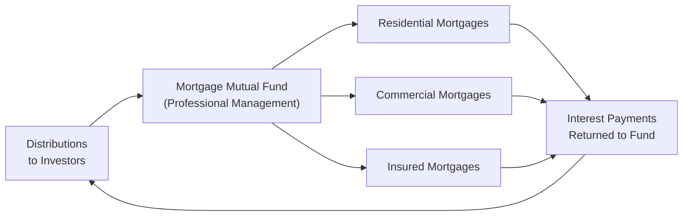

## 11.3 Mortgage Mutual Funds

Sometimes, when we hear “mortgage,” our minds jump straight to buying a home or maybe flipping through real estate listings online. I remember a time when my neighbor, anxious to buy his dream condo, took out a mortgage that felt absolutely massive to him—he’d say, “I really hope I’m making the right call!” Meanwhile, I was exploring the concept of mortgage mutual funds, which allow people like you and me to invest in mortgages without directly owning them. If that sounds intriguing, well, you’re not alone. Mortgage mutual funds are often seen as relatively conservative investments because they’re backed by real estate assets, but they still carry unique risks and nuances worth unpacking. So, let’s dig in.

### Understanding Mortgage Mutual Funds

Mortgage mutual funds invest primarily in pools of mortgage debt. In practical terms, that means the fund collects money from a group of investors and then invests it in various types of mortgages—whether residential, commercial, or insured. By investing in these funds, you (the investor) can potentially benefit from the interest income generated by the underlying mortgages. 

Mortgage mutual funds typically provide:
• A chance to earn returns that are often higher than those from simple bank savings products.  
• Direct but diversified exposure to the real estate market (without the complexity of owning investment property).  
• A steady stream of income derived from mortgage interest payments, which can attract investors seeking regular distributions.

### Types of Mortgage Products Held in Mortgage Mutual Funds

Mortgage mutual funds aren’t just big baskets of random mortgage loans. They often categorize mortgages based on factors like credit quality, maturity, and market (residential vs. commercial). Let’s break down the main categories you’ll likely see in a mortgage mutual fund’s portfolio:

1. **Residential Mortgages**  
   These mortgages are for individuals purchasing or refinancing their homes. Residential properties might range from single-family houses to condominiums. A residential mortgage typically involves an individual borrower whose ability to repay depends largely on personal income, employment stability, and overall creditworthiness.

2. **Commercial Mortgages**  
   Commercial mortgages finance spaces for businesses—like office buildings, retail shops, multi-residential units, and industrial properties. We’re talking about bigger projects, so the loan amounts can be substantially higher than residential mortgages. The creditworthiness of a commercial mortgage depends heavily on the business’s revenue and the property’s capacity to generate income (e.g., from tenant leases or operational activities).

3. **Insured Mortgages**  
   These are mortgages protected by insurance, often provided by the Canada Mortgage and Housing Corporation (CMHC) or other private insurers. An insured mortgage reduces the default risk for lenders because if a borrower defaults, the insurer covers the losses (subject to the terms of the insurance policy). By extension, when a mutual fund invests in insured mortgages, it’s effectively reducing its potential credit losses, though not eliminating risk entirely.

### Key Risk Factors

Even though mortgage mutual funds are categorized as conservative relative to, say, equity funds, they’re certainly not risk-free. Let’s go through some of the main factors:

#### 1. Default Risk

• **What It Is:** The chance that a borrower may fail to make mortgage payments.  
• **Impact on the Fund:** If defaults occur and the corresponding properties can’t be sold at sufficient value, the mortgage fund may incur losses.  
• **Mitigation:** Funds often invest in insured mortgages or thoroughly vetted borrowers (strong credit profile, lower loan-to-value (LTV) ratio). Insured mortgages enjoy protection from entities like CMHC, although you still face some administrative and timing complications if defaults happen.

#### 2. Interest Rate Sensitivity

• **What It Is:** Mortgage mutual funds are influenced by prevailing interest rates in the broader economy.  
• **Why It Matters:** When interest rates go up, it can become more expensive for borrowers to obtain or refinance mortgages, potentially affecting the fund’s ability to source attractive mortgage investments. On the flip side, if rates go down, returns from existing mortgages might look less appealing compared to new mortgage issuances.  
• **Mitigation:** A well-managed mortgage fund typically staggers mortgage maturities and invests in a variety of mortgage terms to reduce sensitivity to a single interest rate shock.

#### 3. Prepayment Risk

• **What It Is:** Borrowers often have the right to pay off mortgages early—whether by selling, refinancing, or making lump-sum payments.  
• **Why It Matters:** If borrowers prepay in an environment of falling interest rates, the fund might have to reinvest prepayment proceeds at lower yields. That can reduce overall returns.  
• **Mitigation:** Mortgage funds can maintain a diversified pool and pay close attention to the average mortgage term structure, balancing short, medium, and long terms.

### Suitability Considerations

Mortgage mutual funds may be a good fit if you’re:

• Looking for a steady income stream (from mortgage interest payments).  
• Someone who’s relatively comfortable with real estate market cycles. Real estate, after all, can experience ups and downs.  
• Desiring a degree of safety that’s potentially higher than many equity-based funds but still exposed to market fluctuations.  
• Willing to accept some interest rate and prepayment risk, along with the fundamentals of credit risk.  

This type of fund may not be a great fit if you need a guaranteed fixed income—like Government of Canada bonds. Mortgage mutual funds are more about balancing moderate risk and moderate return, relying on real estate’s stability over the medium to long term.

### Key Components of a Mortgage Mutual Fund

Many mortgage mutual funds feature a structure like the simplified flowchart below. You can see how money flows in from investors, is allocated to individual mortgages, and eventually generates returns (or distributions). This approach helps demystify exactly where your money goes.

In this structure:  
• You (the investor) put your capital into the pool (A → B).  
• The fund managers (B) allocate assets (C, D, E) depending on the fund’s investment strategy.  
• Monthly or quarterly mortgage payments eventually flow back (F) to the fund, which then redistributes a portion as income or dividends to investors (A).

### Example Scenario: Tracking a Typical Residential Mortgage Investment

Let’s walk through a simplified scenario. Assume a mortgage mutual fund invests 40% of its assets in residential mortgages, 40% in commercial mortgages, and 20% in insured mortgages:

• **Residential Mortgage:** A typical mortgage might carry a 5-year term with a 25-year amortization period, an LTV of 80%, and an interest rate of around 4%. If the borrower has strong credit, the risk of default is lower.  
• **Commercial Mortgage:** This might finance the purchase of an office building in a growing metropolitan area. It could carry a slightly higher interest rate (e.g., 5% to 6%) because of the higher loan amount and potentially higher risk.  
• **Insured Mortgage:** This might be a high-ratio mortgage (LTV above 80%) that’s insured by CMHC. The interest rate could be slightly higher than a conventional mortgage, but the default risk is significantly mitigated.  

If market interest rates suddenly jump, the rising rate environment could slow down new mortgage issuance, or existing borrowers might remain locked into older, lower-rate mortgages. The fund’s overall return is then partly dictated by these older mortgages until they come due (or are refinanced).

### Real Estate Market Cycles and Timing

The value of a property securing a mortgage doesn’t just sit still. Real estate markets swing with economic conditions, demographics, local supply and demand, and interest rates. If the real estate market corrects significantly, even insured mortgages can feel the impact through potential administrative hurdles and delayed cash flows in the event of borrower defaults. Knowing that property prices move in cycles can help you set realistic expectations for the performance of mortgage mutual funds over time.

### Regulatory Environment and Oversight

Mortgage mutual funds operate within Canada’s broader regulatory framework. They must comply with CIRO rules (formerly MFDA and IIROC before amalgamation), which we discussed in Chapter 17: Mutual Fund Dealer Regulation, as well as provincial and federal legislation related to mortgage underwriting. Some relevant regulatory bodies and laws include:

• **Office of the Superintendent of Financial Institutions (OSFI):** OSFI sets mortgage underwriting standards and capital requirements for banks and other regulated financial institutions in Canada. Mortgage mutual funds often adopt similar prudent guidelines to reduce risk exposure.  
• **Provincial Securities Commissions:** Oversee disclosures, compliance, and investor protection across provinces.  
• **Canada Mortgage and Housing Corporation (CMHC):** As a Crown corporation, CMHC insurance helps reduce default risk for certain residential mortgages.

### Best Practices for Investors

Investing in mortgage mutual funds can be a powerful strategy, but, like many decisions, it benefits from careful planning. Here are some best practices:

• **1. Read the Fund Facts and Prospectus:** Before investing, get to know the product’s composition, historical performance, and fee structure.  
• **2. Watch the Fee Load:** Management expense ratios (MERs) and other fees can erode returns. Ensure you understand how the fund charges fees.  
• **3. Diversify, Diversify, Diversify:** Don’t put all your eggs in one basket. Consider building a broader portfolio including fixed-income, equity, and perhaps even other conservative mutual funds such as bond or money market funds (see Sections 11.1–11.2).  
• **4. Assess the Fund’s Track Record:** Look at how the fund manager has handled different interest rate environments, including periods of rising or falling rates.  
• **5. Stay Aware of Real Estate Market Trends:** Although no one can perfectly time the market, keeping an eye on real estate indicators can help you understand potential short- and long-term movements.  

### Common Pitfalls and Challenges

Mortgage mutual funds, while conservative, can come with a few pitfalls if you’re not careful:

• **1. Overconcentration in Real Estate:** If your portfolio already includes significant direct real estate holdings or if you’re heavily reliant on interest-rate-sensitive assets, you can inadvertently end up with too much exposure to the same risks.  
• **2. Underestimating Prepayment Risk:** Early mortgage payoffs might reduce your expected interest income, especially in a lower-rate environment.  
• **3. Ignoring Liquidity Constraints:** If real estate conditions deteriorate, liquidity can be constrained—meaning it might be more difficult to close out certain positions quickly without taking losses.  
• **4. Skipping the Fine Print on Insured Mortgages:** Some investors rely too heavily on “insured” status without realizing that administrative delays or partial recoveries can still occur in default scenarios.  

### Quick Comparison: Mortgage Mutual Funds vs. Bond Funds

Below is a simple table comparing the general characteristics of mortgage mutual funds and traditional bond funds. Both are often deemed conservative, but they each respond differently to market conditions.

| Aspect                 | Mortgage Mutual Funds                                | Bond Funds                                          |
|------------------------|------------------------------------------------------|-----------------------------------------------------|
| Primary Investments    | Portfolios of residential, commercial, insured mortgages | Government bonds, corporate bonds, other debt securities |
| Main Risk Factors      | Default risk, interest rate risk, prepayment risk    | Credit risk (corporates), interest rate risk        |
| Typical Return Driver  | Interest income from mortgages; may be higher or lower based on real estate cycles  | Interest from various fixed-income instruments      |
| Liquidity             | Generally liquid (subject to fund redemption policies), but underlying mortgages can be less liquid | Generally liquid; bond markets are well-established |
| Sensitivity to Housing Market   | High (directly tied to real estate values & mortgage borrowers) | Varies (government vs. corporate vs. high-yield bonds) |
| Investor Profile       | Conservative to moderately conservative with real estate focus | Investors seeking interest income, with credit risk variation |

### Additional Tools and Resources

If you’re curious and want to expand your knowledge, here are a few resources:

- **Canada Mortgage and Housing Corporation (CMHC):**  
  • [https://www.cmhc-schl.gc.ca/](https://www.cmhc-schl.gc.ca/)  
  • Mortgage loan insurance, housing market data, and research tools.  

- **Office of the Superintendent of Financial Institutions (OSFI):**  
  • [https://www.osfi-bsif.gc.ca/](https://www.osfi-bsif.gc.ca/)  
  • Mortgage underwriting guidelines and best practices for Canadian financial institutions.  

- **Open-Source Tools & Resources:**  
  • CMHC Housing Market Information Portal: [https://www.cmhc-schl.gc.ca/en/professionals/housing-markets-data-and-research](https://www.cmhc-schl.gc.ca/en/professionals/housing-markets-data-and-research)  
    This portal can help you keep a pulse on real estate trends.

- **Recommended Readings:**  
  • “Real Estate Investing in Canada” by Don R. Campbell (digs deeper into market cycles and fundamentals).  
  • Articles in “The Globe and Mail – Real Estate” section (featuring mortgage trend updates).  
  • Online courses on real estate financing (Coursera, local community colleges).

Carefully reviewing these resources can help clarify mortgage-based investment strategies and demystify some of the complexities around mortgage mutual funds. And remember, no one approach is perfect for everybody. Combining a little bit of reading, a decent chunk of reflection, and a dash of expert advice is often the best recipe.

---

## Quiz: Mortgage Mutual Funds in Canada



### 1. Which of the following best describes a mortgage mutual fund?

- [x] A mutual fund that invests in pools of mortgages, aiming to generate interest income from residential, commercial, or insured mortgages.
- [ ] A type of fund that only invests in government bonds.
- [ ] A high-risk hedge fund focusing on global equities.
- [ ] A fund exclusively designed for short-term day trading.

> **Explanation:** Mortgage mutual funds pool investor capital in various mortgages (residential, commercial, insured) to generate interest income. They are different from bond funds or equity hedge funds.

---

### 2. What is a key advantage of investing in mortgage mutual funds?

- [x] They allow investors to gain exposure to real estate mortgages without directly owning property.
- [ ] They offer interest rates identical to government savings bonds.
- [ ] They eliminate default risk entirely.
- [ ] They are guaranteed never to fluctuate in value.

> **Explanation:** The main benefit is real estate exposure through mortgages without property ownership. Default risk cannot be fully eliminated, and the fund’s value may fluctuate.

---

### 3. Which of the following is a major type of mortgage included in many Canadian mortgage mutual funds?

- [x] Insured mortgages
- [ ] Cryptocurrency-based mortgages
- [ ] Unsecured personal loan pools
- [x] Residential mortgages

> **Explanation:** Common mortgage types in funds are residential, commercial, and often insured mortgages (e.g., insured by CMHC). Cryptocurrency-based mortgages or personal loan pools aren’t typical in mortgage mutual funds.

---

### 4. Why might a mortgage mutual fund face prepayment risk?

- [x] Because borrowers can pay off their mortgages earlier than expected.
- [ ] Because the property value always goes up.
- [ ] Because the fund invests purely in short-term money market instruments.
- [ ] Because OSFI requires prepayments.

> **Explanation:** Mortgage borrowers have the right to prepay. This can reduce the interest income if the fund has to reinvest at lower rates.

---

### 5. Which of the following strategies might help a mortgage mutual fund manager mitigate interest rate sensitivity?

- [x] Holding a diversified mix of short, medium, and long-term mortgages.
- [ ] Only investing in a single type of mortgage, preferably long-term.
- [ ] Avoiding mortgage investments entirely.
- [x] Insuring every single mortgage, regardless of cost.

> **Explanation:** Diversification by maturity can reduce sensitivity to one interest rate environment. Opting for all or only long-term mortgages could amplify interest rate risk. Insuring mortgages helps reduce default risk but does not address all aspects of interest rate sensitivity.

---

### 6. Which term refers to the ratio of a mortgage loan’s amount to the value of the property?

- [x] Loan-to-Value (LTV) ratio
- [ ] Mortgage Amortization ratio
- [ ] Capitalization ratio
- [ ] Yield-to-Maturity (YTM) ratio

> **Explanation:** Loan-to-Value (LTV) ratio measures the mortgage’s amount relative to the property’s value. It’s a key factor in determining the borrower’s equity and default risk.

---

### 7. A mortgage that is insured by CMHC is best described as:

- [x] A mortgage backed by a Crown corporation protecting against borrower default.
- [ ] A risk-free bond that never loses value.
- [x] A mortgage that may command a slightly higher interest rate if above 80% LTV.
- [ ] A mortgage product only available to commercial real estate owners.

> **Explanation:** CMHC-insured mortgages protect the lender (and indirectly fund investors) against borrower default, particularly for high-LTV mortgages. They often carry a slightly higher rate because of insurance premiums, although default risks are considerably decreased.

---

### 8. When real estate market conditions deteriorate and property values decline, which of the following outcomes is most likely for a mortgage mutual fund?

- [x] Potential increase in default rates and reduced returns if properties must be sold below the loan amount.
- [ ] Guaranteed profitability due to short selling.
- [ ] Complete immunity from losses, as all mortgages are fully insured.
- [ ] Increased liquidity for immediate redemptions without any market impact.

> **Explanation:** A declining real estate market can increase defaults and reduce fund returns, especially if the property must be sold for less than the loan amount. Funds are not fully immune, and liquidity can become constrained.

---

### 9. What is a prudent measure for investors considering mortgage mutual funds?

- [x] Reviewing the fund’s prospectus and understanding its fees.
- [ ] Resigning immediately after buying into the fund.
- [ ] Keeping 100% of an investment portfolio in a single mortgage mutual fund.
- [ ] Fully relying on historical returns in a low-interest environment as an infallible guide to future performance.

> **Explanation:** One of the best practices is to read the fund’s prospectus before investing. Blindly relying on past performance or overconcentrating in one product is risky.

---

### 10. A mortgage mutual fund is generally considered a conservative investment product, but can it still experience significant losses?

- [x] True
- [ ] False

> **Explanation:** Yes, while it is often more conservative than high-risk equity funds, losses can occur due to factors like borrower defaults, prepayment risks, and real estate market downturns.


