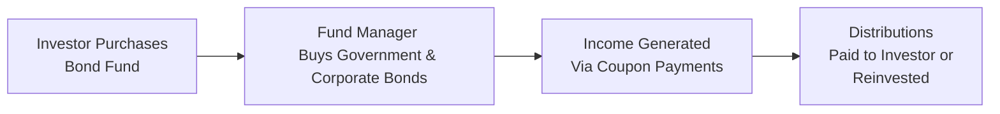

## 11.4 Bond and Other Fixed-Income Funds

If there was one thing that shocked me when I first ventured into the world of investing, it was how “steady” some investments promised to be. I remember thinking, “Wait, so my money can just sit there and earn interest without the wild roller-coaster ride I see in stocks?” That’s when I learned about Bond and Other Fixed-Income Funds—those relatively calm seas of the investment world (most of the time).

In this section, we’ll dive into these funds: their structures, the types of securities they hold, what influences their performance, how they manage risk, and who might find them suitable. Let’s take it step by step.

---

## Introduction to Bond and Other Fixed-Income Funds

Bond and other fixed-income funds are designed to invest primarily in debt securities, such as government bonds, corporate bonds, and sometimes specific niche products like strip bonds. The main goal? Generate a steady stream of interest income (known as coupon payments) for investors while preserving the original capital as much as possible. Of course, the reality can get more nuanced. Rising interest rates, changes in credit spreads, and fluctuations in bond prices can still make these funds move up or down. But compared to many equity funds, they typically offer a more conservative path—though “conservative” doesn’t mean risk-free.

### Key Objectives of Bond Funds

1. **Income Generation:** Bond funds pay out interest income earned on the underlying bond portfolio. This income can be distributed to investors in cash or reinvested into additional units (depending on the fund and investor preference).

2. **Capital Preservation:** Because bonds usually rank ahead of equity in a firm’s capital structure, they can often be less volatile. Government bonds, in particular, are seen as especially secure—though by no means guaranteed to avoid price fluctuation.

3. **Diversification:** Many bond funds hold a mix of government and corporate bonds. This spreads risk across different issuers, allowing investors to avoid “putting all their eggs in one basket.”

Let’s consider the main types of fixed-income holdings.

---

## Types of Fixed-Income Holdings

### Government Bonds

Issued by federal or provincial governments (and sometimes municipalities), government bonds generally carry lower default risk. For example, Government of Canada bonds are considered very safe because the Canadian government has strong credit and can raise taxes or issue more currency (within reason) to service its debts. Provincial bonds are also common in Canada, though they can carry slightly higher yields than federal bonds to compensate for somewhat higher perceived risk. Municipal bonds might be a smaller piece of the overall Canadian bond market but can vary in yield based on the municipality’s creditworthiness.

### Investment-Grade Corporate Bonds

These are bonds issued by corporations with solid financial strength, typically rated BBB- or higher by rating agencies like DBRS Morningstar, Moody’s, or Standard & Poor’s. Investment-grade corporate bonds generally offer a slightly higher yield than government bonds (to compensate for higher default risk). But among corporations, those with strong revenue, good cash flow, and stable operations tend to get better ratings—and thus are considered safer.

### High-Yield Bonds

Sometimes called “junk bonds,” these are issued by companies with lower credit ratings. They offer higher yields (interest rates), but the risk of default is higher as well. Some bond funds specialize in high-yield bonds, aiming for above-average returns while actively managing credit risk. This type of fixed-income investment is more volatile and sensitive to changes in the overall economic climate.

### Strip Bonds

Strip bonds are created by “stripping” the bond’s coupon payments from its principal amount and selling each component separately as zero-coupon bonds. For instance, imagine you have a bond paying a $50 coupon every year and $1,000 at maturity. That single bond can be split into multiple zero-coupon securities—one for each coupon payment date plus one for the final principal repayment. These trade at a significant discount to face value because they don’t pay current interest. Investors receive a lump-sum payment at maturity, which includes all accrued interest implied in the discount.

---

## Key Performance Drivers

Bond funds may appear straightforward at first, but their performance can shift due to several factors that affect bond pricing and yields.

### 1. Interest Rate Movements

When interest rates go up, bond prices generally go down. This inverse relationship arises because new bonds in the market offer higher coupons, making existing bonds less attractive unless their prices fall. Conversely, if interest rates drop, existing bonds generally become more appealing and increase in price.

Mathematically, bond prices can be approximated using the present value of future cash flows:


P = \sum_{t=1}^{T} \frac{C_t}{(1 + i)^t} + \frac{M}{(1 + i)^T}


Where:

• \\( P \\) = Bond Price  
• \\( C_t \\) = Coupon payment in year \\( t \\)  
• \\( i \\) = Discount rate or yield required by investors  
• \\( M \\) = Principal (face value) repaid at maturity  
• \\( T \\) = Number of years until maturity  

A change in \\( i \\) (interest rates) has an inverse effect on \\( P \\).

### 2. Credit Spread Changes

The credit spread is the difference in yield between government bonds and corporate bonds (or between higher-rated and lower-rated bonds). If market sentiment turns negative and investors become wary of corporate defaults, credit spreads widen. This means corporate bond yields rise relative to government bonds, and prices of corporate bonds might fall. On the other hand, if general confidence in corporate earnings is strong, spreads often tighten, boosting corporate bond prices.

### 3. Duration

Duration is like the “sensitivity gauge” of a bond or bond fund: it measures how much the fund’s value will change if interest rates shift. A longer duration means the investment is more sensitive to rate changes. So if your bond fund has a duration of, say, 6 years, then (roughly speaking) a 1% increase in interest rates could result in about a 6% decline in the fund’s value (all else being equal). The same principle operates in reverse if rates fall.

---

## Risk Management Strategies Within Bond Funds

Even though bonds are often viewed as more stable than equities, risks still exist. Bond fund managers employ various strategies to protect investors while aiming for consistent income.

1. **Diversification**  
   Managers often invest across different maturities (short-term, medium-term, and long-term), different economic sectors (government, financial, industrial, etc.), and different issuers to reduce the impact of any single bond defaulting.

2. **Interest Rate Hedging**  
   In some cases, particularly in more sophisticated funds, managers might use derivatives to hedge interest rate exposure. This could include interest rate futures or swaps that offset some of the risk associated with bond price movements.

3. **Credit Research**  
   Analyzing the creditworthiness of an issuer is crucial. Managers keep a close eye on financial statements, market conditions, and credit rating changes to avoid potential defaults or downgrades. If a bond’s issuer is downgraded from investment-grade to high-yield, its price can fall sharply.

4. **Active Management of Maturities**  
   In a rising-rate environment, managers might reduce the fund’s average maturity, aiming to minimize losses. Conversely, if they expect rates to fall, they may extend maturities to lock in higher coupons and capture price gains.

---

## Suitability of Bond and Fixed-Income Funds

Who typically invests in bond or fixed-income funds? Let’s break it down:

• **Income Seekers and Conservative Investors**: Retirees or individuals nearing retirement often value stable income and capital preservation. They may allocate a portion of their portfolio to bond funds to smooth out the volatility of the stock market.  
• **Moderate to Low Risk Tolerance**: If you know you can’t stomach big price fluctuations—like a 30% drop in a bear market—a higher allocation to bond funds could reduce overall volatility.  
• **Balancing Equity Exposure**: Even aggressive investors may add some bond exposure to temper equity market swings. This is the basis of many asset allocation models (e.g., 60% equity and 40% fixed income).  
• **Anyone Who Understands That Bonds Can Lose Value**: No matter how careful we are, there is no perfect shield against rising rates or credit woes. Bonds are sensitive to the economic environment, and funds containing longer-duration instruments or lower-credit bonds can experience more pronounced price movement.

---

## Practical Examples and Case Studies

### Case Study 1: Rising Interest Rates

Imagine a scenario where the Bank of Canada starts raising its overnight lending rate to combat inflation. Bond yields across the market rise in tandem, making older, lower-yielding bonds less attractive. A provincial government bond paying a 2.5% coupon could see its price drop as newly issued bonds start featuring 3.5% coupons. Bond fund managers might respond by readjusting their holdings to mitigate losses—perhaps moving more towards shorter-maturity or floating-rate bonds.

### Case Study 2: Widening Credit Spreads

Let’s say there’s uncertainty in the energy sector due to global economic headwinds, causing corporate bond investors to demand a higher yield to compensate for increased risk. Corporate bond spreads relative to Government of Canada bonds widen. As a result, some high-yield energy bonds drop in price significantly. If a bond fund holds a large allocation to that sector, it will likely see a drop in NAV (Net Asset Value). Skilled managers might pivot into other sectors or even switch to safer government bonds if they anticipate further turmoil.

### Case Study 3: Buy and Hold Strategy

An investor named Sarah wants a predictable income stream and invests in a short-duration bond fund that primarily holds Government of Canada bonds and top-rated corporate bonds. This fund doesn’t trade frequently and simply rolls bonds when they mature, reinvesting in new short-term issues. Over time, Sarah sees minimal volatility, and though her overall return isn’t sky-high, she appreciates the relative steadiness, especially compared to some of her equity funds.

---

## Diagrams and Visual Aids

Below is a simple flowchart illustrating how a bond fund operates:

• Investors buy units of the bond fund.  
• The fund manager allocates capital among various bonds (government, corporate, etc.) based on the fund’s strategy and outlook.  
• These bonds generate coupon payments.  
• The fund either (1) distributes these payments to investors or (2) reinvests them, depending on the fund’s distribution policy and the investor’s preference.

---

## Glossary of Key Terms

• **Duration:** A measure of a bond fund’s price sensitivity to interest rate changes. Longer duration = greater sensitivity.  
• **Yield to Maturity (YTM):** The total return anticipated on a bond if held to maturity, factoring in coupon payments and price differences from face value.  
• **Coupon Rate:** The annual interest rate paid on a bond’s face value (e.g., if a $1,000 face-value bond pays $50 per year, that’s a 5% coupon).  
• **Credit Spread:** The difference in yield between securities of different credit ratings, often measured against a government benchmark (e.g., Government of Canada bonds).  
• **Investment-Grade Bond:** Typically rated BBB- (or equivalent) or higher, indicating decent credit quality.  
• **High-Yield Bond (Junk Bond):** Bonds rated below BBB- (or equivalent). They carry higher default risk but offer potentially higher returns.  
• **Zero-Coupon Bond:** A bond with no coupon payments that trades at a discount from the face value, offering a profit at maturity when it’s redeemed at face value.

---

## Best Practices and Common Pitfalls

Before you (or your clients) chase after bond funds, let’s highlight some best practices and common pitfalls:

### Best Practices

1. **Understand Duration:** Don’t buy a long-duration fund without recognizing its sensitivity to rising rates.  
2. **Check Credit Quality:** Make sure you’re comfortable with the types of bonds in the fund. If the fund invests heavily in high-yield debt, it will be more volatile.  
3. **Look at Fees:** Management expense ratios (MERs) can eat into returns, especially at a time when bond yields may be modest.  
4. **Monitor Economic Indicators:** Keep an eye on inflation, central bank rate decisions, and corporate earnings outlooks. These heavily shape bond performance.  
5. **Stay Diversified:** Even if you love the yield story in corporate bonds, try not to put all your money into one market segment.

### Common Pitfalls

1. **Ignoring Interest Rate Risk:** Investors sometimes assume bonds don’t lose value. Rising rates can cause capital losses, which can surprise those expecting stable returns.  
2. **Chasing Yield:** Higher yield often means higher risk, particularly with lower-rated bonds. Always check the fund’s holdings!  
3. **Overlooking Fund Mandate:** Some funds use derivatives or can be leveraged, which changes their risk profile. A quick read of the prospectus or Fund Facts can reveal if you’re in the right fund.  
4. **Neglecting the Impact of Fees:** A bond fund yielding only 3% but charging a 1.5% MER might net you only 1.5%—which could barely outpace inflation (if at all).

---

## Regulatory Context and Canadian Considerations

In Canada, bond and other fixed-income fund offerings are regulated by securities authorities to ensure transparency and fairness. A few key references:

• **Canadian Securities Administrators (CSA)** – [https://www.securities-administrators.ca/](https://www.securities-administrators.ca/)  
  The CSA coordinates regulation across provincial and territorial authorities.

• **Canadian Investment Regulatory Organization (CIRO)** – [https://www.ciro.ca](https://www.ciro.ca)  
  Effective June 1, 2023, CIRO is the national self-regulatory organization supervising Canada’s investment dealers and mutual fund dealers, as well as marketplace integrity. It replaced the Mutual Fund Dealers Association (MFDA) and the Investment Industry Regulatory Organization of Canada (IIROC). Historical references to these entities exist, but CIRO is the present authority.

Dealers and representatives follow Know Your Client (KYC) and suitability guidelines in recommending any mutual fund product. Bond funds might be suitable for clients who demonstrate moderate or lower risk tolerance, or for a variety of other personal financial goals.

---

## Additional Resources & Tools

If you want to go deeper:

• **Morningstar Canada** or **Fund Library**: These open-source tools let you examine bond fund performance, holdings, and credit breakdowns.  
• **Bank of Canada**: [https://www.bankofcanada.ca/](https://www.bankofcanada.ca/) – Great place to keep track of interest rate announcements and macroeconomic data.  
• **Books**:  
  - “The Bond Book” by Annette Thau – A thorough resource on bonds and bond funds.  
  - “Fixed Income Markets and Their Derivatives” by Suresh Sundaresan – More advanced, covering complex fixed-income instruments.  
• **Online Courses**:  
  - The Canadian Securities Institute (CSI) offers courses like “Fixed Income Fundamentals.”  
  - Coursera and edX have various fixed income or bond trading courses.

---

## Concluding Thoughts

So, is a bond or fixed-income fund right for everyone? Likely not. But for many investors—especially those wanting stability, predictable income, or a balance to more volatile equities—bond funds provide an appealing middle ground. My own experience? I’ve come to really appreciate the calmer days they bring to my portfolio. Then again, when interest rates jump, or companies run into trouble, you still get a reminder that no investment is completely risk-free.

By understanding the types of bonds, the impact of interest rates, how credit spreads work, and what “duration” truly means, you’ll have a solid foundation to navigate bond fund choices confidently. It all comes down to matching your (or your client’s) risk tolerance, time horizon, and desired income level with the right mix of fixed-income products.

---

## Quiz: Bond and Other Fixed-Income Funds Mastery



### Which of the following is generally considered the safest type of Canadian bond investment?

- [x] Government of Canada bonds
- [ ] Investment-grade corporate bonds
- [ ] High-yield junk bonds
- [ ] Municipal bonds

> **Explanation:** Government of Canada bonds are typically considered to have the lowest credit risk in the Canadian bond market, given the federal government’s ability to tax and manage monetary policy.

### What happens to bond prices when interest rates rise?

- [x] Bond prices typically fall
- [ ] Bond prices typically rise
- [ ] Bond prices remain unchanged
- [ ] Bond prices become zero

> **Explanation:** There is an inverse relationship between bond prices and interest rates. When rates go up, existing bonds become less attractive, so their prices fall.

### Strip bonds differ from traditional coupon bonds because strip bonds:

- [x] Do not pay regular coupon payments
- [ ] Pay higher coupons than face-value bonds
- [ ] Are issued only by corporations
- [ ] Are risk-free

> **Explanation:** Strip bonds are zero-coupon bonds that have had their coupon payments removed (“stripped”), and they trade at a discount to face value.

### In evaluating a bond fund’s sensitivity to changes in interest rates, investors should examine:

- [x] The fund’s duration
- [ ] The fund’s standard deviation
- [ ] The fund’s alpha
- [ ] The fund’s price-to-earnings ratio

> **Explanation:** Duration measures the percentage change in a bond’s price for a 1% change in interest rates. The higher the duration, the more sensitive the bond (or bond portfolio) is to rate changes.

### Which of the following statements is correct about “credit spreads”?

- [x] A widening credit spread suggests increased risk for corporate bonds relative to government bonds
- [ ] A tightening credit spread indicates corporate bonds are becoming more risky
- [x] Credit spreads measure the difference in yield between different credit quality bonds
- [ ] Credit spreads remain constant over the business cycle

> **Explanation:** Credit spreads typically widen when the market perceives higher risk in corporate bonds compared to government bonds. They measure the yield gap between these securities.

### A bond fund that invests primarily in below-BBB-rated securities is known as:

- [x] A high-yield (junk) bond fund
- [ ] An investment-grade bond fund
- [ ] A government bond fund
- [ ] A municipal bond fund

> **Explanation:** Below-BBB indicates a non-investment-grade or high-yield rating, often referred to as junk bonds.

### Which strategy might a bond fund manager use to reduce interest rate risk?

- [x] Shorten the fund’s overall duration
- [ ] Invest exclusively in long-term bonds
- [x] Use derivatives such as interest rate swaps for hedging
- [ ] Only invest in zero-coupon bonds

> **Explanation:** Shorter duration and hedging tools like interest rate swaps are common methods to manage or reduce interest rate risk.

### Which best practice should bond fund investors follow?

- [x] Review the fund’s credit quality mix
- [ ] Ignore duration measures
- [ ] Only invest in the highest-yielding bond fund available
- [ ] Overweight a single issuer to maximize returns

> **Explanation:** Assessing credit quality is crucial in understanding default risk. Meanwhile, ignoring duration or overweighting a single issuer can lead to unbalanced and risky portfolios.

### One potential “common pitfall” for bond investors is:

- [x] Underestimating the possibility of capital loss if interest rates rise
- [ ] Diversifying across maturities
- [ ] Monitoring credit ratings
- [ ] Checking management fees

> **Explanation:** Many new bond investors assume that bonds are risk-free and can be caught off-guard when rising rates push bond prices down.

### Bond funds are entirely free from risk. True or False?

- [x] False
- [ ] True

> **Explanation:** While generally regarded as more conservative compared to equity funds, bond funds are subject to interest rate risk, credit risk, and market risk. They can experience fluctuations in net asset value and potential losses.


