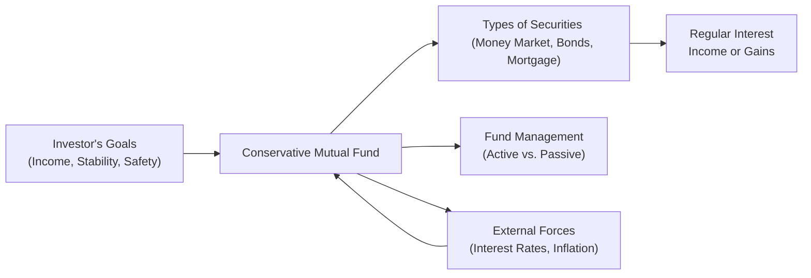

## 11.5 Additional Key Considerations for Conservative Mutual Funds

So, I remember a time when my uncle was ready to retire—he had spent decades working in a stable job, earning a steady salary, and investing in a variety of mutual funds. When retirement was just around the corner, I noticed his portfolio was gradually shifting more heavily into what we typically call “conservative” investments—things like bond funds, money market funds, and mortgage funds. At first, I didn’t really understand why. But over time, I realized that as folks get closer to retirement, they often want more stability and less risk. In Canada, conservative mutual funds abound to match those needs. However, there’s a lot more to them than simply “playing it safe.” Let’s talk about the crucial considerations you’ll want to keep in mind when evaluating or recommending these funds.

It’s all about understanding how fee structures, fund management, regulatory requirements, and market conditions can affect the performance and suitability of these products. Let’s explore each of those areas, and then wrap up with a broader view on how best to integrate conservative mutual funds into an investor’s overall outlook—accompanied, of course, by compliance with Canadian regulatory standards under CIRO and the CSA.

---

## Assessing Fee Structures

One of the first points to consider for conservative mutual funds is the fee structure. You know how we always complain about those tiny fees that somehow eat into our monthly bills? This principle scales up significantly in the investment world, too. Fees can make a real dent in net returns, especially for conservative mutual funds that typically generate more modest returns compared to aggressive growth funds.

• Management Expense Ratio (MER):  
  The MER is an annual percentage of a mutual fund’s average net assets that goes toward covering management fees, operating expenses, taxes, and so on. If a conservative fund is only making a relatively modest yield—maybe 2–3% per year—an MER of, say, 1.5% can start to feel like a big chunk of those earnings.  
  → It’s important to look at the “all-in” cost of owning these funds, especially if the objective is a stable income or slow-and-steady growth. High fees can negate much of that benefit.

• Sales Charges:  
  – Front-End Loads: Paid upfront when you buy the fund; typically a percentage of the amount you invest. For instance, if an investor puts $10,000 into a conservative fund with a 2% front-end load, they’re basically starting their investment at $9,800.  
  – Back-End Loads (Deferred Sales Charges): Instead of paying fees when you purchase the fund, you might pay them when you sell. Often, these fees decrease over a set schedule—like 6% if you sell in the first year, 5% if you sell in the second, and so on. These charges tend to discourage short-term exits.

• Other Fees:  
  – Switching Fees: Sometimes investors are charged for moving between different funds within the same family.  
  – Ongoing Service Fees / Trailing Commissions: These can be baked into the MER but can also sometimes appear as a separate line item.  

The overall lesson is to watch how cumulative fees might impact that net return. For a highly conservative fund, every fraction of a percent can matter more than you might expect in the long run.

---

## Evaluating Fund Management

Handing over your assets to a fund manager can feel a bit like trusting a chauffeur with your car. You hope they’ll steer you to the right destination, but you also have to check out their track record first! For conservative mutual funds, stable performance over time is typically more important than big gains.

• Consistency of Returns and the Manager’s Track Record:  
  – Low Volatility: A hallmark of conservative funds is relatively low volatility compared to equity-heavy portfolios. But it’s still important to vet how the fund performs in different interest rate environments or economic conditions.  
  – Manager Turnover: Even the best manager in the business could leave a fund, causing style changes or performance shifts. So, keep an eye on who’s actually steering the ship.

• Active vs. Passive Management:  
  – Active Management: This approach relies on professional portfolio managers to pick investments, rebalance frequently, and (hopefully) outperform a certain benchmark. With conservative funds, active managers may employ strategies that aim to mitigate interest rate risk, exploit minor mispricing in fixed-income instruments, or carefully manage durations to protect from inflation.  
  – Passive Management: Some conservative funds simply track indexes. For instance, a bond index fund might replicate the composition of a broad market bond index. This approach can often deliver lower fees, but might also limit the potential for outperformance if the manager has strong expertise.

Picking between active and passive might come down to how comfortable you or your client are with fees and the fund manager’s ability to generate returns above benchmarks. For many conservative investors, the reliability of a straightforward bond or money market index could be appealing.

---

## Regulatory and Disclosure Requirements

The regulatory environment in Canada (and around the world, for that matter) aims to protect investors by promoting transparency and responsible fund management practices. Right now, if you’re working with or investing in mutual funds in Canada, it’s important to note that the Mutual Fund Dealers Association (MFDA) and the Investment Industry Regulatory Organization of Canada (IIROC) have merged into the Canadian Investment Regulatory Organization (CIRO). That happened on January 1, 2023, with the organization renamed as of June 1, 2023. When you see references to the MFDA or IIROC, those are historical references only; CIRO is the national self-regulatory organization overseeing investment dealers and mutual fund dealers.

• Fund Facts Documents:  
  These are a key tool provided to investors, summarizing the main features, fees, performance history, and risks of a fund. The Canadian Securities Administrators (CSA) mandate that these documents remain up to date and easily accessible, typically at or before the time of sale. It’s a concise document often limited to a few pages, so definitely read it before purchasing any mutual fund.

• CIRO and CSA Guidelines:  
  – CIRO ensures that dealers and their representatives follow a code of conduct, comply with disclosure rules, and adhere to “Know Your Client” (KYC) and suitability requirements.  
  – The CSA (Canadian Securities Administrators) is an umbrella organization coordinating the securities regulators for each province and territory. Together, these frameworks help protect investors from fraud and ensure that funds operate transparently and ethically.

• CIPF (Canadian Investor Protection Fund):  
  The CIPF (formerly combined with the MFDA Investor Protection Corporation) offers limited protection of client assets if a dealer becomes insolvent. While this doesn’t guarantee returns on a specific fund, it does provide a safety net if a CIRO member firm were to go bankrupt.

Always remember: regulations are mostly about ensuring fair play. The more you understand them, the better you can safeguard your or your client’s interests.

---

## Monitoring Changing Economic Conditions

Even conservative mutual funds aren’t entirely immune to economic shifts. Let’s say interest rates suddenly spike—what happens to bond prices? They typically go down because newly issued bonds pay higher coupons. So, if you’re stuck holding older bonds that offer lower coupons, those become less appealing. This is just one example of how external forces tilt the dynamics of conservative funds.

Below is a quick depiction of how a conservative mutual fund might be influenced by external factors:

• Interest Rate Risk:  
  Bond funds, for example, can experience price drops if interest rates rise. Money market funds might benefit somewhat if new short-term instruments start offering higher yields, but bond funds with longer durations can see a decline in their net asset value.

• Inflation Risk:  
  If inflation creeps up, fixed coupon payments won’t buy the same goods and services as before. This matters for longer-term fixed-income funds and can erode real returns.

• Market Liquidity:  
  In times of financial stress, even safer fixed-income instruments can experience liquidity crunches. Mortgage funds can especially be subject to changes in real estate market conditions.

• Regular Review and Rebalancing:  
  A best practice is to look at your portfolio periodically—maybe at least once a year—to see if the allocation between conservative and growth assets still matches your risk profile and goals.

---

## Suitability for Different Investor Profiles

Conservative funds certainly aren’t just “for grandma.” They can meet the diverse needs of various individuals, from brand-new investors looking to dip a toe in the water, to seasoned retirees wanting to lock in stable income flows.

• Retirees:  
  Many retirees like conservative funds because they often provide predictable income and protect capital relatively well. Bond and mortgage funds, for example, can generate monthly or quarterly distributions that help with living expenses in retirement.

• Younger Investors:  
  A younger investor might still hold a small portion of conservative funds in their portfolio for near-term needs—maybe an emergency fund or down-payment savings. It can also help an overall portfolio remain balanced and reduce total volatility during market headwinds.

• Multi-Goal Portfolios:  
  Sometimes an investor might have specific savings goals with different timelines. Conservative funds can be used for medium-term targets (e.g., saving for a wedding in three years) while the rest of the portfolio is more growth-oriented.

• Balancing Risk:  
  A balanced or “core-and-satellite” approach might mix stable, conservative mutual funds as a core, with a satellite of growth-oriented funds or equities. That offers a blend of stability plus upside potential.

Anyway, the key is to think about the time horizon, cash flow needs, and personal preference for risk. Not everyone wants their portfolio value bouncing up and down like a rollercoaster.

---

## Diversification Within Conservative Investments

A conservative portfolio doesn’t mean putting all your eggs in a single type of basket. Even within the realm of low-volatility products, you can diversify:

• Money Market Funds:  
  – Typically invest in short-term debt securities such as T-bills and commercial paper.  
  – Often used for parking cash that might be needed soon.  
  – Offer liquidity and stability, but the returns can be quite modest.

• Bond Funds:  
  – Can feature government bonds, corporate bonds, or a blend.  
  – Vary in maturity (short-term, medium-term, long-term).  
  – Shorter-term bond funds often have less interest rate sensitivity, while longer-term might yield a bit more income but come with higher interest rate risk.

• Mortgage Funds:  
  – Invest in pools of mortgages.  
  – Returns can be slightly higher than pure government bond funds, but they carry unique risks related to the real estate market.  
  – Sensitivity to interest rates, property default rates, and regional economic conditions.

Balancing these can be powerful. For example, combining a short-term money market fund with a medium-term bond fund could help offset the volatility that might come from changes in rates or defaults in one fixed-income segment. Meanwhile, including a mortgage fund can add a little extra yield potential, but it’s important to watch the properties in which the fund invests.

A quick table to illustrate different risk/return profiles within conservative funds:

| Category           | Potential Return | Interest Rate Sensitivity | Liquidity  | Typical Investor Usage                             |
|--------------------|------------------|---------------------------|------------|----------------------------------------------------|
| Money Market Funds | Low              | Low                       | High       | Parking cash, emergency reserves                   |
| Short-Term Bonds   | Low-Medium       | Low-Medium                | Medium-High| Short-term stability, moderate interest returns    |
| Medium-Term Bonds  | Medium           | Medium                    | Medium     | Moderate income, can accept moderate rate changes  |
| Mortgage Funds     | Slightly Higher  | Medium                    | Medium     | Income with higher yield potential vs. gov’t bonds |

---

## Best Practices and Pitfalls

It’s easy to think: “Oh, a conservative fund. That means it’s always safe!” But that mindset can lead to some pitfalls:

• Overconfidence in Safety:  
  While conservative funds are less risky than aggressive equity funds, they’re not risk-free. Rising interest rates or a juicy bout of inflation can still hammer bond prices. Mortgage funds are not immune to real estate bubbles or defaults, either.

• Not Reviewing the Fund Facts Document:  
  The legally required disclosure offers a lot of relevant info—fees, performance history, who manages the fund, etc. Skipping that info is like buying a car without checking the mileage or service history.

• Focusing Only on Yield:  
  A small yield might look unappealing, but in a stable fund, a modest yield could actually make sense if it aligns with your goals. Don’t chase yield at the expense of higher fee structures or more hidden risk.

• Ignoring Tax Implications:  
  Some distributions are taxed differently, and if a fund’s main source of income is interest, that might be taxed as regular income in your non-registered account. Keep that in mind or consider tax-sheltered accounts (like RRSPs, TFSAs) if appropriate.

---

## Case Study Example

Let’s consider a hypothetical scenario. Suppose there’s a 45-year-old investor named Marcia who has a teenage daughter. Marcia wants to set aside money for her daughter’s college tuition, which is only a few years away. She decides to invest in a blend of conservative funds to make sure the money’s relatively safe but still earning something above a savings account interest rate. Her plan might look like this:

• 50% in a short-term bond fund for a moderate interest return;  
• 30% in a money market fund for liquidity, just in case she needs some of that cash sooner (maybe for a computer or educational resources);  
• 20% in a mortgage fund to slightly increase return potential.

After about three years, interest rates rise unexpectedly. The short-term bond fund definitely has some price fluctuations, but because the bond durations are lower, it’s not as dramatically impacted. The money market fund even benefits from higher short-term rates, so that portion sees a slightly better yield. The mortgage fund experiences a mild slump in net asset value due to a weaker real estate market, but overall, the portfolio remains relatively stable. It’s not shooting the lights out with returns, but it successfully preserves value and provides a small, steady income—exactly what Marcia wants before paying for her daughter’s higher education costs.

---

## Glossary

• MER (Management Expense Ratio):  
  An annual measure of the total costs (management fees, operating expenses, taxes, etc.) to hold a mutual fund, expressed as a percentage of its average net assets.

• Front-End Load:  
  A commission charged when you initially purchase fund units/shares.

• Back-End Load (Deferred Sales Charge):  
  A commission charged when you sell fund units. This fee may diminish over time.

• Active Management:  
  A hands-on strategy where managers choose securities in an attempt to outperform a benchmark.

• Passive Management:  
  A strategy that mirrors a particular index or benchmark with minimal trading activity.

• Inflation Risk:  
  The risk that rising prices will erode the real value (purchasing power) of the investment returns.

• Rebalancing:  
  Adjusting the proportions of different assets in your portfolio to maintain your desired level of risk and return.

---

## Additional Resources and References

Below is a quick list of links and resources that can help you keep building your understanding:

• CIRO (Canadian Investment Regulatory Organization):  
  – https://www.ciro.ca  
  For compliance rules affecting fund dealers, as well as resources for investor protection. (CIRO oversees the functions formerly handled by the MFDA and IIROC.)

• Canadian Securities Administrators (CSA):  
  – https://www.securities-administrators.ca  
  Check out their guidelines on Fund Facts disclosure requirements and other investor protections.

• CIPF (Canadian Investor Protection Fund):  
  Offers coverage if a CIRO member firm becomes insolvent. https://www.cipf.ca

• Further Readings:  
  – “Canadian Securities Course (CSC)®” or “Investment Funds in Canada (IFC)” offered by CSI, for foundational knowledge on Canadian securities and mutual fund regulations.  
  – CFA Institute: Articles on fixed-income investing and conservative asset allocation.  
  – Personal Finance Canada subreddit (https://www.reddit.com/r/PersonalFinanceCanada/) for real community conversations, success stories, and cautionary tales about conservative funds (unofficial resource).

---

In the end, we can think of conservative mutual funds like a well-traveled highway: typically smoother, with fewer bumps, but not necessarily free of tolls (fees!). By understanding fee structures, fund management philosophy, the intricacies of regulations and disclosure requirements, and how the market environment can shape returns, investors and advisors alike can feel more confident about heading down this path. Regular rebalancing, diversification within the conservative space, and staying informed about economic shifts can go a long way toward ensuring that “conservative” remains a reassuring word in a portfolio, not a misleading one.

Anyway, I hope this discussion leaves you with a sense of how these funds work and a clearer idea of how to fit them into a broader financial plan. Remember: there’s no permanent “safe zone”—only investments whose risks (interest rate fluctuations, inflation, liquidity constraints, and so forth) suit your goals and personal comfort level.

---

## Test Your Knowledge: Key Considerations for Conservative Mutual Funds



### Which fee structure can significantly impact net returns on conservative mutual funds that typically have lower yields?

- [ ] Switching fees
- [x] Management Expense Ratio (MER)
- [ ] Performance fees only applicable to hedge funds
- [ ] Capital gains tax

> **Explanation:** Because conservative funds often produce more modest returns compared to aggressive funds, the Management Expense Ratio (MER) can eat up a larger portion of returns, causing a noticeable impact on net gains.

### What is one advantage of passive management for conservative mutual funds?

- [x] Lower fees compared to actively managed funds
- [ ] Ability to outperform the market with high frequency
- [ ] Guaranteed stability during interest rate hikes
- [ ] Guaranteed zero risk of capital loss

> **Explanation:** Passive management often results in lower fees, which can be beneficial for conservative funds that generally yield lower returns. It does not guarantee stability or eliminate risk but can reduce costs.

### Which of the following is true about interest rate risk in bond funds?

- [x] Rising interest rates generally cause bond prices to fall
- [ ] Rising interest rates cause bond prices to rise
- [ ] Interest rate changes have no impact on bond funds
- [ ] Bond funds are unaffected by market liquidity constraints

> **Explanation:** Bond prices usually move inversely to interest rates. When interest rates go up, existing bonds paying lower coupons become less attractive, thereby decreasing in price.

### Why is regular rebalancing important for a conservative portfolio?

- [x] It helps maintain the desired allocation despite market fluctuations
- [ ] It guarantees higher returns than an all-equity portfolio
- [ ] It eliminates inflation risk
- [ ] It removes the need for diverse investments

> **Explanation:** Rebalancing involves adjusting the proportions of assets to maintain a targeted risk-return profile. It doesn’t guarantee higher returns or eliminate risks but can help keep a portfolio aligned with the investor’s goals.

### Which of the following is an example of a money market instrument typically held in a money market mutual fund?

- [x] Treasury Bill
- [ ] 30-year government bond
- [x] Commercial Paper
- [ ] Equity shares

> **Explanation:** Money market funds invest in short-term debt securities such as T-bills and commercial paper. These instruments offer liquidity and lower returns but are often viewed as lower risk compared to longer-term instruments or equities.

### Which regulatory body currently oversees mutual fund dealers in Canada (post-2023), replacing the MFDA?

- [x] CIRO (Canadian Investment Regulatory Organization)
- [ ] IIROC (Investment Industry Regulatory Organization of Canada)
- [ ] OSC (Ontario Securities Commission)
- [ ] CSA (Canadian Securities Administrators)

> **Explanation:** The MFDA and IIROC merged into the Canadian Investment Regulatory Organization (CIRO), the new self-regulatory organization for mutual fund dealers and investment dealers.

### Which key piece of documentation must be provided to investors to ensure transparency and informed decision-making regarding a mutual fund’s structure, fees, and risks?

- [x] Fund Facts document
- [ ] Annual Press Release
- [x] Monthly Statement
- [ ] Non-audited transaction summary only

> **Explanation:** The Fund Facts document is a concise, mandatory disclosure that highlights the fund’s features, fees, risks, and past performance. It’s required by Canadian regulations to help investors make informed choices.

### What caution should an investor take if they solely focus on the yield of a conservative fund?

- [x] Higher yields could come with higher risk or fees
- [ ] Conservative funds are always risk-free
- [ ] Yield always equates to net profit
- [ ] The Fund Facts document becomes irrelevant

> **Explanation:** Chasing higher yield without considering associated risks or costs (like higher fees) can be problematic. Even conservative funds have risk tradeoffs, such as interest rate sensitivity and credit risk.

### What is one possible benefit of mixing mortgage funds with short-term bond funds?

- [x] Balancing interest rate risk and potentially higher yield
- [ ] Eliminating inflation risk
- [ ] Introducing extreme volatility to the portfolio
- [ ] Guaranteeing a boost in return each month

> **Explanation:** Mortgage funds can offer slightly higher yields, while short-term bond funds can help reduce interest rate sensitivity. This combination can help spread out risk and still aim for moderate returns.

### When might a younger investor find conservative mutual funds helpful?

- [x] When saving for short-term goals or establishing an emergency fund
- [ ] To achieve the maximum possible capital gains in the shortest time
- [ ] To eliminate the need for any diversification
- [ ] Only upon retirement

> **Explanation:** Younger investors might use conservative funds for near-term or emergency savings, since these funds can provide stability and liquidity. They’re not strictly for retirees.


