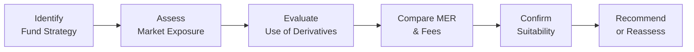

## 12.1 Introduction to Riskier Mutual Fund Products

It’s fair to say that when most folks first hear the phrase “riskier mutual fund,” they might imagine big spikes and drops in value—kind of like a roller coaster that dips and soars and can be simultaneously thrilling and nerve-wracking. In the grand landscape of mutual funds, these more volatile funds are often the ones striving for higher returns through equity-based strategies, emerging market exposure, or specialized investment tactics. But let’s pause for a moment: “Risky” doesn’t always mean “bad.” Instead, it reminds us that these investments come with the potential for substantial upsides and downsides. In many cases, they’re designed to reward investors who can handle the emotional and financial bumps along the way.

Below, we’ll examine what makes these funds riskier, why some advisors and investors might like them, and how they fit into client portfolios. We’ll also reflect on why it’s so important that mutual fund representatives—especially here in Canada—observe the Know Your Client (KYC) and suitability rules set out by the Canadian Investment Regulatory Organization (CIRO) and the broader rules governed by the Canadian Securities Administrators (CSA). By the end of this section, you’ll have a robust understanding of riskier mutual fund products, the methods used to identify them, and the best practices that help manage these challenges in real-world scenarios.

---

**What Makes a Mutual Fund “Riskier”?**

There’s a continuum of risk among mutual funds. On one end, you’ll find conservative or low-risk funds (like money market or short-term bond funds). On the opposite end, there are funds that may invest heavily in equities, derivatives, or specialized strategies. The fundamental elements that often increase a fund’s risk profile include:

• A significant allocation to stocks (particularly small-cap or growth stocks).  
• An inclination toward emerging or frontier markets.  
• Frequent or active trading, sometimes employing sophisticated hedging or leverage strategies.  
• Concentrated positions in a single sector (like tech, biotech, or precious metals).  
• Use of derivatives for speculation or high-yield strategies.

When we talk about “heightened risk,” we’re generally referring to increased *volatility*, or the degree to which a fund’s returns may fluctuate. If you’ve ever watched a stock market index bounce around from one day to the next, you know that equities, especially in newer or rapidly developing markets, can swing more abruptly than, say, Government of Canada bonds. Funds that harness advanced or aggressive tactics (like short sales, leverage, or complex derivative positions) may see these swings amplified.

---

**Volatility and Drawdowns: Two Sides of the Riskier Coin**

When folks say an investment is “volatile,” they typically mean that day-to-day (or month-to-month) fluctuations are large. It’s like watching a sailboat out on a windy day—the boat’s forever reacting to the gusts, moving unpredictably. One measure that matters a lot here is *drawdown*, the peak-to-trough decline in value an investment can go through. For instance, if a fund invests in emerging tech companies, it might climb 30% during a hot market, only to plummet 20% if those companies fail to meet growth targets. While volatility can unnerve some investors, it also creates opportunities for higher gains, especially if the fund manager can skillfully navigate market ups and downs.

---

**The Role of Active Management**

In practice, many of these riskier funds lean on *active management*. This means the portfolio managers aim to outperform a benchmark by selecting specific stocks, sectors, or timing trades to capitalize on market conditions. Picture a chef tasting the soup every few minutes and adding in a pinch of salt or pepper to keep it just right. That’s active management—managers frequently adjust holdings based on research and market analysis. Although these strategies can yield higher returns, they also come with higher fees and the possibility of manager underperformance relative to benchmarks.

---

**Emerging Markets: Greater Growth Potential, Bigger Swings**

A key hallmark of some riskier funds is exposure to *emerging markets*. Emerging markets are basically countries or regions in the rapid phases of industrialization or economic development—places like China, India, Brazil, or parts of Eastern Europe. They often have younger populations, increasing infrastructure needs, and rising consumer demand. While that spells potential for growth, these markets can also be prone to political instability, currency fluctuations, or less transparent regulatory frameworks. If you’re used to the stability of blue-chip Canadian or U.S. equities, stepping into emerging markets can feel like hiking a steep mountain trail: The view at the top might be glorious, but it’s a more treacherous climb.

---

**Why Invest in Riskier Funds at All?**

Reading all this talk about “higher volatility” and “drawdowns,” you might wonder, “So why bother with these funds?” The short answer: potential for higher returns and a shot at diversifying your overall portfolio. While the cliché “higher risk, higher reward” doesn’t always ring true, many experienced investors integrate riskier funds into a broad mix of holdings for *long-term growth*. Think of it like balancing a diet: You need more than just bread and water to stay healthy. Sure, bread and water (comparable to GICs or low-risk bonds) are essential staples, but you might add some nutrient-rich or spicier foods (akin to equities, derivatives, or emerging market funds) to round out the meal.

In a portfolio context, a small portion allocated to these riskier segments can sometimes elevate overall returns without disproportionately skyrocketing total risk—thanks to what’s known as *diversification*. Indeed, if your Canadian equity fund isn’t performing as well, maybe your emerging market fund picks up the slack. After a downturn, riskier assets can be among the first to rally, providing a robust push upward. But remember, risk has a real cost, which is usually the possibility of deeper losses.

---

**Importance of KYC and Suitability**

We’ve emphasized in earlier chapters the principle of Know Your Client (KYC). Before recommending or permitting an investment in a higher-risk mutual fund, *it is critical* for the mutual fund sales representative to thoroughly review the client’s risk tolerance, investment knowledge, time horizon, and financial objectives. In Canada, CIRO (the Canadian Investment Regulatory Organization) sets out clear guidelines about how dealers and representatives must assess and document these factors. Suitability is not just a box you tick; it’s a fundamental protection for clients against mismatched or excessively risky investments.

I remember a new rep at our firm—let’s call her Samantha—who was super eager to recommend a trending biotech equity fund to almost every client, thinking, “It’s hot right now; everyone should jump in!” Not only was that a compliance nightmare waiting to happen, but it risked harming clients with shorter time horizons or lower risk tolerance. She soon learned that suitability means looking at the bigger picture: retirement needs, major upcoming life events, or even the possibility that certain clients just can’t sleep at night if they see their portfolio drop 5% in a day.

---

**When These Funds Go Wrong: Potential Pitfalls**

While high-risk funds are not inherently “bad,” they do have pitfalls if misused or poorly understood:

• **Emotional Overdrive:** Volatility can lead investors to hit the panic button, selling off at the worst possible time.  
• **Overconcentration:** If too much of a portfolio is dedicated to one risky fund, the investor might face severe losses if that sector or region crashes.  
• **Fees and Costs:** Actively managed and specialized funds often come with higher Management Expense Ratios (MERs), which can eat into returns over time.  
• **Liquidity Concerns:** Some specialized funds might invest in illiquid assets, making it harder for investors to cash out quickly.  
• **Misinterpretation of Active Strategies:** Complex derivative strategies can be tough to understand, leading to confusion about the actual level of embedded risk.

For mutual fund representatives, it’s crucial to help clients manage these pitfalls by explaining prospective outcomes, the nature of drawdowns, and the importance of a properly diversified strategy. This ties into ongoing portfolio reviews—particularly when your client’s circumstances change (or if they suddenly realize they’re not as comfortable with big fluctuations as they originally thought).

---

**Examples and Case Studies**

Let’s consider a hypothetical scenario:

• **Case Study: Chris and the Emerging Markets Fund**  
  Chris is in his early 40s, with about 20 years left until retirement. He has an above-average risk tolerance and is currently invested mostly in broad Canadian equity and bond index funds. After discussing with his representative, Chris adds a 15% allocation to an emerging markets mutual fund known for focusing on Asian tech startups. Over a five-year period, Chris’s total portfolio grows at a robust rate, outperforming his old portfolio (which had zero emerging market exposure). That said, there were some sleepless nights when political instability in certain regions caused a short-term 10% drop in that particular fund. Chris weathered the turbulence, thanks to a suitable overall allocation and a temperament that could handle volatility.  
  The lesson? Even “risky” investments can be beneficial if matched properly to a client’s circumstances, horizons, and emotions.

• **Case Study: Paula and the Aggressive Equity Fund**  
  Paula was 60, heading into retirement in a few years, but felt she should “make up for lost time” by jumping into a hot aggressive equity mutual fund. Her representative, upon conducting the KYC process, realized that Paula’s nest egg couldn’t afford a major short-term drawdown—especially since she planned to retire in the next three to five years. After carefully explaining the trade-offs, they agreed on a smaller 5% allocation to the fund, balancing Paula’s desire for higher returns with the real possibility of near-term losses. Result: Paula slept better, and her portfolio was still diversified enough to capture moderate growth.  
  The lesson? Even if a client has the appetite for risk, their life stage might temper exactly how much risk is appropriate.

---

**Classification of These Funds and Canadian Regulations**

The Canadian Securities Administrators (CSA) sets out the guidelines and frameworks that mutual funds must adhere to, including disclosure obligations. Funds typically provide a classification or risk rating (often a scale from “low” to “high”), but it’s essential to look beyond that single label. As a representative, you should encourage your clients to comb through the *prospectus*, the simplified prospectus, or Fund Facts document. These documents detail:

• Investment objectives and strategies.  
• Potential risks (including volatility, foreign currency risk, political risk, etc.).  
• Management fees and operating expenses.  
• The fund manager’s track record and approach.

Also, keep in mind that with the introduction of new strategies and exotic instruments, new riskier funds keep popping up in the market. Products labeled as “alternative mutual funds” (sometimes referred to as “liquid alt funds”) might use derivatives or short selling. Under the updated rules in Canada, these will still fall under CIRO oversight, meaning the same robust KYC, suitability, and disclosure responsibilities apply.

---

**Continuous Professional Development and Market Monitoring**

Markets are dynamic. A once “stable” investment category can become riskier if the environment shifts—consider what happened to certain property or energy sectors at times of global disruption. For that reason, it’s vital to keep updating your knowledge, whether by reading up-to-date analyses, completing advanced courses, or attending industry conferences. CIRO (established 2023 from the amalgamation of the MFDA and IIROC—both now defunct) often updates its guidance and rules, so staying informed helps ensure you’re providing the best possible counsel to your clients.

---

**Key Considerations for Advisors and Investors**

1. **Knowing Yourself (or Your Client)**  
   Before jumping in, confirm whether this level of volatility matches the client’s risk tolerance and financial goals. Large swings can be psychologically tough, requiring a solid emotional backbone.

2. **Time Horizon**  
   Riskier investments typically suit those with a longer time horizon. Periodic volatility matters less if the investor can remain invested for multiple market cycles.

3. **Diversification**  
   It’s rarely wise to put all your eggs in one basket, especially a high-risk basket. Combining riskier funds with more conservative holdings can smooth out the bumps.

4. **Costs and Fees**  
   Investigate the fund’s Management Expense Ratio (MER) and other charges. Higher potential returns can be offset by steep fees if not carefully evaluated.

5. **Regulatory Compliance**  
   Make sure you adhere to or educate your clients about the compliance standards set by CIRO and the CSA. Proper documentation of suitability assessments is crucial.

6. **Ongoing Review**  
   Keep track of any changes in the client’s personal circumstances or in global markets that might shift the risk/return profile of these funds.

---

**Practical Example: Risk Classification Flowchart**

Below is a simplified visual that shows a basic process you might follow when classifying whether or not a particular mutual fund is riskier. Note how this merges your knowledge of the fund’s investment approach with the client’s preferences and guidelines.

In many cases, you’ll circle back if you find that the product is not suitable. The point is that a multi-step approach ensures you’re not missing critical risk factors.

---

**References for Further Exploration**

• **CIRO Website (https://www.ciro.ca/):** The go-to source for the latest rules on mutual fund distribution, suitability, and client relationship guidelines.  
• **CSA Website (https://www.securities-administrators.ca/):** Ideal for checking National Instruments on mutual fund regulation, prospectus requirements, and risk classification.  
• **SEDAR+ Search Platform (https://www.sedarplus.ca/):** Free search tool for publicly available filings, financial statements, and prospectuses for Canadian mutual funds.  
• **Canadian Securities Course (CSC®) Handbook, CSI:** Provides additional background on regulatory structures and product classifications.  
• **“Mutual Funds for Canadians for Dummies” by Andrew Bell:** An approachable resource that breaks down the fundamentals of mutual funds, including risk considerations.  

Don’t forget that you can look beyond Canadian sources to get a global perspective—particularly useful if the fund you’re researching invests internationally. However, always prioritize compliance with Canada’s regulations when advising local clients.

---

**Bringing It All Together**

For some individuals, a riskier mutual fund is just that—too nerve-racking, too volatile, or simply not aligned with their short-term needs. For others, it can form an essential piece of a well-diversified strategy seeking higher growth. The key is understanding what these “riskier” mutual funds bring to the table: *potential for greater returns, higher volatility, and a need for rigorous suitability checks.* Always remember that you’re not alone in navigating these waters: you have CIRO guidelines, CSA regulations, and a wealth of resources to keep you on the right path. Ultimately, risk management is part art, part science, and always about serving the client’s best interests.

At the end of the day, if you can confidently articulate the pros, cons, and practical realities of riskier mutual funds, you’ll be in a solid position to meet your fiduciary and professional duties—and help clients steer through sometimes choppy investment seas.

---

## Test Your Knowledge: Riskier Mutual Fund Products in Canada



### Which of the following factors often indicates a mutual fund is riskier than average?

- [x] Significant holdings in equities and emerging markets
- [ ] Predominantly investing in government-backed bonds
- [ ] Maintaining a tight focus on guaranteed investment certificates
- [ ] Focusing exclusively on money market instruments

> **Explanation:** Higher equity exposure, especially in emerging markets, generally exhibits greater volatility than government bonds or GICs, making a fund riskier.

### What term describes the peak-to-trough decline in value for an investment?

- [ ] Volatility
- [ ] Leverage
- [ ] Asset allocation
- [x] Drawdown

> **Explanation:** Drawdown measures how much an investment’s value falls from its peak before recovering, highlighting its worst-case loss in a given period.

### Which statement about emerging markets is TRUE?

- [ ] They are risk-free environments for higher returns.
- [x] They can provide significant growth potential with higher volatility.
- [ ] They are more transparent and less volatile than developed markets.
- [ ] They do not require regulatory disclosures or prospectus reviews.

> **Explanation:** Emerging markets can deliver substantial growth but they’re also more prone to economic, regulatory, and political upheavals.

### Why is the Know Your Client (KYC) principle especially important for riskier mutual fund products?

- [ ] So clients can select any product they like, regardless of their situation.
- [x] To ensure the chosen fund aligns with the client’s objectives and risk tolerance.
- [ ] To limit the variety of funds available to the client.
- [ ] To reduce the need for documentation when recommending a fund.

> **Explanation:** KYC helps determine the suitability of higher-volatility funds by matching them with a client’s risk tolerance, investment horizon, and financial goals.

### Which of the following is a benefit of adding a riskier mutual fund to a diversified portfolio?

- [x] Potential for higher returns
- [ ] Guaranteed protection from losses
- [x] Enhanced exposure to emerging markets
- [ ] Elimination of management fees

> **Explanation:** Riskier funds often aim for higher returns and can provide exposure to unique market segments (such as emerging markets) within a diversified strategy.

### What is a potential pitfall if an investor places too much of their portfolio in a single aggressive equity fund?

- [x] Overconcentration leading to severe losses if the sector underperforms
- [ ] Eliminating volatility in the broader portfolio
- [ ] Automatic diversification within that single fund
- [ ] Guaranteed outperformance of all market benchmarks

> **Explanation:** Concentrating heavily in one riskier fund can lead to large drawdowns if that sector or strategy struggles.

### Why might the Management Expense Ratio (MER) matter more in higher-risk funds?

- [x] Higher fees can eat into the fund’s returns, especially in actively managed strategies
- [ ] Because no fees are ever disclosed
- [x] Riskier funds often have more frequent trading and added costs
- [ ] MER isn’t relevant for mutual funds

> **Explanation:** Actively managed, high-risk strategies can have frequent trading and elevated expenses; these costs can significantly reduce net returns over time.

### How might liquidity concerns arise in certain riskier mutual funds?

- [ ] They invest only in fully liquid, government-guaranteed securities.
- [x] They may hold complex or illiquid assets, making it hard to redeem shares quickly.
- [ ] They trade exclusively on large, centralized exchanges with minimal volatility.
- [ ] They are not subject to any regulatory scrutiny regarding liquidity.

> **Explanation:** Some riskier funds invest in less liquid assets (e.g., private placements, small-cap stocks, or specialized bonds) that may not be easily sold at fair market value.

### What is the primary regulatory body overseeing mutual fund dealers in Canada today?

- [ ] Mutual Fund Dealers Association (MFDA)
- [ ] Investment Industry Regulatory Organization of Canada (IIROC)
- [x] Canadian Investment Regulatory Organization (CIRO)
- [ ] Canadian Investor Protection Fund (CIPF)

> **Explanation:** The MFDA and IIROC merged to form CIRO in 2023. CIRO oversees investment and mutual fund dealers as well as marketplace integrity.

### True or False: Emerging technical or “liquid alternative” funds still fall under Canada’s usual KYC and suitability rules.

- [x] True
- [ ] False

> **Explanation:** Regardless of how innovative or “alternative” a fund may be, it remains subject to the same robust KYC and suitability standards set by CIRO and the CSA.


