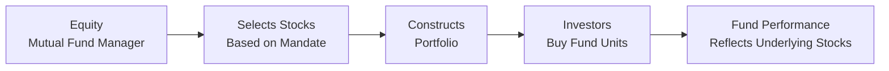

## 12.2 Equity Mutual Funds

### Introduction
Let’s be honest. When I first heard about equity mutual funds, I was a little overwhelmed. Stocks, dividends, sector risk—I wasn’t even sure where to begin. But over time, I realized that equity mutual funds are basically a way for everyday folks (like us) to access a diversified portfolio of stocks through a single investment product. These funds typically hold common shares of publicly traded corporations, seeking to deliver capital appreciation (i.e., stock price growth) and, in some cases, dividend income.

Equity mutual funds usually carry more risk than their conservative or fixed-income counterparts (see Chapter 11 for details on conservative mutual fund products). But with this increased risk, there’s often a greater potential for long-term growth, which is why they’re such a popular choice for growth-oriented portfolios. This portion of Chapter 12 dives into exactly what equity mutual funds are, how they’re structured, the potential rewards, and the risks you and your clients should consider.

### Key Characteristics of Equity Mutual Funds
An equity mutual fund pools money from many investors and invests primarily in stocks. Depending on a fund’s investment mandate, it might focus on:

• Large-cap “blue chip” companies  
• Small-cap or mid-cap firms with higher growth potential  
• Specific sectors or industries (e.g., technology, healthcare, energy)  
• A particular region or a global approach  

Because they are heavily anchored in equity markets, these funds typically face significant price volatility. When equity markets are thriving, returns can look wonderful. But during downturns, drops can be just as dramatic. Many investors, however, still find equity funds worthwhile because of the potential for long-term capital appreciation.

### Risk and Return of Equity Mutual Funds
If you’re considering equity mutual funds, you know they can swing up and down more dramatically than funds primarily composed of bonds or other fixed-income instruments (Chapter 11.4 covers bond and fixed-income funds in more depth). Remember, no one can guarantee that your initial investment will be preserved—there’s a genuine possibility of loss, especially in bear markets.

Still, that’s kind of the point. Equity funds typically provide higher potential returns, particularly over longer periods. Historically, well-diversified equity portfolios have outperformed inflation and have often grown customers’ wealth—though past performance certainly doesn’t guarantee future results.

### The Growth vs. Value Debate
Equity funds often follow certain investment styles. If you hear “growth fund,” think of shares of companies whose revenues or earnings are growing faster than average. These growth-oriented businesses often reinvest profits rather than paying high dividends, aiming for capital appreciation. So in practice, you might be paying a bit more now for a share in the hopes it’ll grow significantly over time.

“Value funds,” on the other hand, look for stocks that are underpriced relative to their fundamentals. These are companies that many might have overlooked—or even abandoned—but that have the potential to bounce back once the market recognizes their true worth. Value stocks often pay dividends, because many value companies are more mature with stable earnings, though not always.

### Sector-Specific Funds
Take a moment to think about how interesting it is to invest in a single sliver of the market. For instance, if you’re a tech enthusiast, you might be drawn to technology-focused equity funds. These sector funds can be exciting, but be prepared for more volatility. If the entire tech market dips—maybe due to global supply chain hiccups or new regulations—tech-heavy sector funds feel the pain acutely.

Sector funds also exist in areas such as healthcare, consumer goods, and energy. Chapter 12.5 (Specialty Mutual Funds) takes a bigger look at some niche categories, but the general point remains the same: more specialized focus equals higher risk if the sector experiences downturns.

### Market Capitalization
You might hear about a mutual fund being large-cap, mid-cap, or small-cap. That’s basically referring to the market capitalization (the total dollar value of a company’s outstanding shares). Usually:

• Large-cap stocks are well-established, stable, and often pay dividends. Think “blue chip.”  
• Mid-cap stocks are established enough but still have significant growth potential.  
• Small-cap stocks can be nimble, fast-growing, or sometimes more speculative—higher risk, possibly higher reward.  

You’ll likely see funds combining different caps in a single portfolio, or focusing on one cap category. The risk and volatility of small-cap or emerging market funds can be significantly higher than large-cap, so choose carefully to align with your (or your client's) investment objectives.

### Geographic Focus
Equity mutual funds often specify whether they target Canadian, U.S., international, or global stocks. Depending on the economy and market climate, some geographic regions could provide more promising returns. Of course, you’ll want to evaluate exchange rate considerations, economic indicators, local political stability, and more. If you recall from Chapter 12.4 (Global Mutual Funds), investing outside Canada can bring both additional risks (like currency fluctuations) and new opportunities for diversification.

### How Equity Mutual Funds Operate: A Visual Perspective
Here’s a quick flowchart to illustrate how a typical equity mutual fund operates:

• The manager (A) decides which stocks to buy and sell (B)  
• Then they assemble a portfolio of equities consistent with the fund’s investment style (C)  
• Investors (D) purchase units of the fund, pooling their resources together  
• Gains or losses (E) stem from the changes in the prices of the stocks in the portfolio  

### Turnover Ratio and Active Management
The turnover ratio indicates how often the fund’s holdings are traded. A higher turnover might imply the manager is actively adjusting the portfolio to capture gains. This can drive up transaction costs (e.g., commissions and spreads) and potentially create taxable capital gains distributions for unitholders.

So if you’re looking at an equity mutual fund’s summary or fund facts, check out that turnover ratio. A fund with excessive turnover isn’t necessarily a bad choice, but it may have some negative implications for after-tax returns. Keep in mind that more active management generally comes with higher management expense ratios (MERs). On the upside, a skilled manager might deliver solid returns even after accounting for these expenses—though it’s never guaranteed.

### Monitoring Economic Cycles and Market Trends
If you read Chapters 3 and 8, you’ll already have a pretty good sense of how economic factors—like interest rates, GDP growth, unemployment, and corporate earnings—can affect the performance of stocks. Whether it’s a looming recession or a sudden bull market, equity mutual funds reflect what’s happening out there in the big world of finance.

For example, when interest rates rise, some investors shift away from growth stocks that have long-term return horizons, because higher rates can dampen the present value of those future earnings. Meanwhile, certain value stocks might hold up better. This interplay between broad economic forces and sector or style-based investment approaches can have a big influence on your fund’s returns.

### Aligning with Regulations and Client Objectives
From a compliance perspective, keep in mind that under the Canadian Investment Regulatory Organization (CIRO) guidelines, advisors must ensure that they apply Know Your Client (KYC) and suitability assessments properly (covered thoroughly in Chapter 17.4). Equity mutual funds can be a perfect match for clients who:

• Have a longer time horizon  
• Can cope with volatility  
• Are seeking higher returns than typical fixed-income products  
• Understand the risk of potential losses  

If you’re working as a financial professional, you’ll definitely want to document these considerations so your clients understand the pros and cons. CIRO’s Conduct and Practice Handbook (CPH) underscores the importance of communicating these risks clearly and often.

### Personal Anecdote
I remember once speaking to a friend who invested in a high-growth small-cap equity fund on a whim. It soared by 25% in about six months. He was thrilled—until the next few months rolled around and it dropped just as quickly. Luckily, he’d spread his investments across different funds (including some stable blue chip and balanced funds), which helped mitigate the blow. That story always reminds me how crucial diversification (see Chapter 8 on portfolio analysis) is when dealing with high-volatility funds.

### Practical Example: Calculating Potential Portfolio Impact
Suppose you invest in an equity fund for C$10,000 at a net asset value (NAV) per unit of C$50. You acquire 200 units. Over the next year:

• The fund’s NAV grows to C$55 per unit.  
• The fund also pays you a C$1.00 distribution per unit during the year (which you re-invest).  

Your total return, ignoring any commissions or taxes, is calculated like this:

Let initial NAV = C$50  
Let final NAV = C$55  
Distribution = C$1  

Using a simple total return formula in KaTeX:


\text{Total Return} = \frac{(\text{Final NAV} - \text{Initial NAV}) + \text{Distribution}}{\text{Initial NAV}} \times 100\%



\text{Total Return} = \frac{(55 - 50) + 1}{50} \times 100\% = \frac{6}{50} \times 100\% = 12\%


So your hypothetical equity mutual fund brought in a 12% return for the year. That’s a simplified illustration, but it shows how price appreciation plus dividend or distribution income can add to your overall gains.

### Managing Risks
• Diversify: Instead of putting all your money into a single equity fund, consider a broader approach. You can augment with fixed-income or balanced funds.  
• Align with Goals: Ensure the level of equity risk matches your time horizon and investment objectives.  
• Monitor Sector Exposure: With certain sector funds, watch out for concentrated risk.  
• Keep an Eye on Fees: High fees can erode returns, especially for actively managed funds with high turnover.  
• Understand Tax Implications: If your fund has a high turnover ratio, you might face larger taxable distributions.  

### Common Pitfalls and How to Avoid Them
• Chasing Past Performance: Don’t jump into a fund just because it performed well last year.  
• Overconcentration: Going “all in” on a single style (say, 100% aggressive growth) can be dangerous.  
• Ignoring Fees: In some cases, the cost of management can eat away at your gains (see Chapter 16 on Mutual Fund Fees).  
• Market Timing: Attempting to buy low and sell high is notoriously difficult to do consistently.  

### Glossary of Key Terms
• **Blue Chip**: Large, stable companies known for steady earnings and dividends.  
• **Market Capitalization (Market Cap)**: The total value of a company’s outstanding shares.  
• **Turnover Ratio**: How frequently a fund’s holdings are traded; higher turnover typically means higher transaction costs.  
• **Growth Stock**: A stock expected to grow revenues and earnings faster than the market average.  
• **Value Stock**: A stock considered undervalued relative to its fundamentals.  
• **Dividend**: A portion of a company’s earnings distributed to shareholders in cash or shares.  
• **Sector Fund**: A fund focusing on a specific industry or sector (e.g., tech, healthcare).  

### Additional Resources 
• CIRO (https://www.ciro.ca) – Canada’s national self-regulatory body for investment dealers, overseeing mutual fund dealers and market integrity on equity and debt marketplaces.  
• Morningstar Canada (https://www.morningstar.ca/) – Offers research, screening tools, and performance data for Canadian equity funds.  
• “The Little Book of Common Sense Investing” by John Bogle – Discusses the fundamentals of equity investing and potential pitfalls.  
• Chapters 8 and 17 of this course – Chapter 8 covers Portfolio Analysis and Management, while Chapter 17 looks at the regulatory obligations that apply to mutual fund dealing representatives.  

It seems to me that equity mutual funds can be a powerful tool—just make sure you understand the risks, keep a close eye on fees, and align your investment decisions with your personal or client objectives. If you stay informed and practice good risk management, you can help maximize the benefits these funds potentially offer.

## Master Your Knowledge of Equity Mutual Funds Quiz



### Which primary asset class do equity mutual funds invest in?

- [x] Common shares of publicly traded corporations
- [ ] Corporate bonds
- [ ] Real estate assets
- [ ] Precious metals like gold
  
> **Explanation:** Equity mutual funds focus on stocks (equities) issued by publicly traded companies. They don't primarily invest in bonds, real estate, or commodities.

### What type of equity mutual fund focuses on companies that are believed to be underpriced by the market?

- [ ] Growth fund
- [x] Value fund
- [ ] Sector fund
- [ ] Multi-cap fund

> **Explanation:** Value funds look for stocks trading below their intrinsic worth. Growth funds, in contrast, seek companies with above-average growth potential.

### Which factor often increases the costs and tax implications for investors in an equity mutual fund?

- [ ] Low management fee
- [ ] Low turnover ratio
- [x] High turnover ratio
- [ ] Narrow sector focus

> **Explanation:** A high turnover ratio indicates frequent trading, which can generate higher transaction costs and taxable capital gains distributions.

### Which term describes well-established organizations that often have large market capitalizations and a history of steady earnings and dividends?

- [ ] Growth stocks
- [ ] Value stocks
- [x] Blue chip
- [ ] Penny stocks

> **Explanation:** Blue chip companies are typically stable, large-cap firms with a track record of strong performance and dividend payments over time.

### Which factor commonly contributes to the higher volatility of equity mutual funds compared to fixed-income funds?

- [x] Equity funds invest primarily in stocks
- [ ] Stocks face less regulatory oversight
- [x] Equity funds have the potential for higher returns
- [ ] Equity funds only invest in emerging markets

> **Explanation:** Stocks inherently carry more price volatility than bonds, and while they often offer higher returns over the long term, they can experience more dramatic up-and-down swings.

### What is a possible downside of focusing on sector-specific equity funds?

- [x] Higher risk due to lack of diversification
- [ ] Lower risk when inflation rises
- [ ] Guaranteed performance stability
- [ ] Minimal transaction costs

> **Explanation:** Sector-specific funds may magnify gains when a specific industry booms, but they can also be more vulnerable to concentrated losses if that sector struggles.

### Which statement is correct regarding large-cap and small-cap funds?

- [x] Large-cap funds generally invest in established companies with stable earnings
- [ ] Small-cap funds often have zero volatility
- [x] Small-cap funds may offer higher growth but carry more risk
- [ ] Large-cap funds always generate higher returns than small-cap funds

> **Explanation:** Large-cap companies are usually more mature and stable, while small-cap companies may offer higher growth prospects along with higher volatility.

### Which factor most influences a growth-oriented fund?

- [ ] Dividends paid annually
- [x] Prospects for above-average revenue and earnings increases
- [ ] Below-market prices relative to fundamentals
- [ ] Focus on bond coupons and interest rates

> **Explanation:** Growth funds prioritize companies expected to grow faster than the market average, which usually means emphasizing revenue and earnings growth over dividends.

### What is one reason why a high turnover ratio may lead to lower after-tax returns?

- [x] Frequent trading can trigger taxable capital gains
- [ ] Frequent trading eliminates the need for professional management
- [ ] Frequent trading has no impact on returns
- [ ] Frequent trading automatically creates higher dividends

> **Explanation:** High turnover often generates capital gains within the fund, which then gets passed along to investors as taxable distributions.

### Equity mutual funds generally have higher expected returns than fixed-income mutual funds. True or False?

- [x] True
- [ ] False

> **Explanation:** Over the long term, equities typically offer higher potential returns compared to bonds, although with greater volatility and risk of loss.


