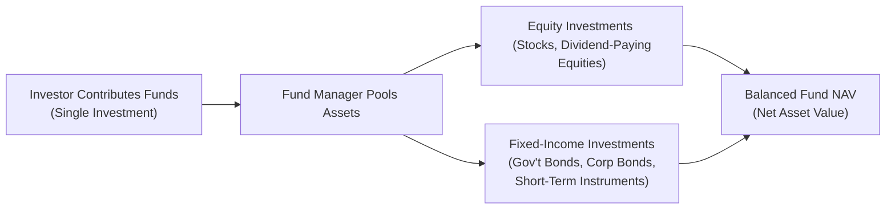

## 12.3 Balanced Mutual Funds

Imagine you’re sitting with a close friend over coffee, and they say, “I don’t want all my eggs in one basket, but I also don’t want to juggle multiple funds. Is there one product that blends stocks and bonds in a single package?” That’s basically what balanced mutual funds aim to do. They combine equities and fixed-income securities (bonds or money market instruments) within a single portfolio. In theory, these funds can provide some growth from the equity portion while the fixed-income component seeks to smooth out returns and reduce dramatic market swings.

But let’s not overlook an important point: even though many folks consider balanced mutual funds a “moderate” option, there is still a noticeable level of risk here—especially when the fund tilts more heavily toward equities. So, balanced mutual funds can sometimes be riskier than purely fixed-income mutual funds. Let’s unpack the details of how these funds work, explore their pros and cons, and offer real-world scenarios and practical tips for both new and experienced investors.

---

### The Essence of Balanced Funds

A balanced fund invests in both equities (i.e., shares of publicly listed companies) and fixed-income securities (bonds, debentures, convertible bonds, money market instruments, etc.). Why combine these two? Historically, equities have offered higher growth potential over the long run, while bonds have generally provided more stable income (through coupon payments) and have been less volatile than stocks. By blending the two, these funds aim to provide moderate long-term growth with lower volatility than an all-equity fund.

But you know how it goes: we can’t just rely on historical patterns to predict the future with certainty. Equities have their ups and downs, and bonds aren’t always stable—especially if interest rates spike. The “balanced” idea, though, is that when stocks hit a rough patch, bond returns might help cushion the blow. Conversely, when bonds lag due to rising interest rates or other factors, stock performance can help pick up the slack.

#### A Personal Anecdote
I once spoke with an investor who felt overwhelmed balancing multiple positions in her portfolio: she had a small handful of dividend-paying stocks and a bunch of random bonds, but she had trouble monitoring each security. And she was always wondering if her asset mix was still appropriate. Eventually, she moved part of her portfolio to a balanced mutual fund. She remarked that it felt like handing the reins over to a professional, so she did not have to constantly recalibrate how much to keep in stocks vs. bonds. That sense of simplicity and diversification was the biggest draw.

---

### Composition and Allocation

Balanced funds typically feature a set ratio of stocks to bonds—commonly around 60% equities and 40% fixed income. Some funds follow that ratio quite rigidly. Others may adopt more flexible mandates, employing what’s known as a “tactical asset allocation” approach, in which the fund manager adjusts the equity-bond mix in response to market conditions. That freedom can be both a blessing and a curse: a skilled manager could, in theory, capitalize on short-term market opportunities, but if those market calls go wrong, you’re exposed to manager risk.

Many balanced mutual funds also include dividend-paying stocks in the equity portion, providing a bit of income. The fixed-income portion can range from high-quality government bonds to more adventurous corporate bonds, and sometimes shorter-term instruments for liquidity and stability. The result can be a neatly packaged “single-fund solution” for an investor who wants diversification without needing to juggle multiple mutual funds.

---

### Why Balanced Funds Can Be Riskier Than You Might Expect

It’s tempting to say, “Hey, balanced means safe, right?” Well, not exactly. While balanced funds might smooth out the wildest swings relative to an all-equity strategy, the presence of equities still introduces market risk. If the fund’s equity portion is significant—say 70% or more—then large stock market corrections can leave a noticeable dent in the fund’s value. And on the bond side, interest-rate risk looms large: when interest rates climb, bond prices typically fall. 

A balanced mutual fund is still subject to:
• Equity Risk: Stock markets can fluctuate dramatically due to a variety of factors (e.g., economic reports, corporate earnings, geopolitical events).  
• Interest-Rate Risk: Bond values generally decline if rates increase, eroding part of the fund’s bond portion.  
• Credit Risk: If the fund invests in lower-quality bonds, there’s a possibility the issuer might default on interest or principal payments.  
• Currency Risk: If the fund is globally diversified and holds foreign assets, currency movements can affect returns.  

Even though the diversification aspect can mitigate some of these risks, it does not eliminate them.

---

### Main Goals of Balanced Mutual Funds

1. **Growth**: Capture the upside potential of equities over the long term.  
2. **Income**: Provide interest income (from bonds) and possibly dividends (from dividend-paying stocks).  
3. **Volatility Dampening**: Offer a relatively smoother ride than pure equity funds, thanks to the stabilizing influence of fixed income.  

At their core, balanced funds cater to investors seeking a moderate risk-return profile who might not have the time or inclination to manage a handful of specialized funds. Indeed, some of these funds position themselves as a “one-stop shop” for folks wanting a single product that covers multiple asset classes.

---

### Balanced Funds in the Canadian Regulatory Environment

Since you’re reading the Conduct and Practices Handbook Course (CPH®) offered by the Canadian Securities Institute (CSI), you’re probably aware that Canada’s investment world operates under a set of robust regulations. Balanced funds fall under the same guidelines that govern mutual funds in general, including full disclosure, the Know Your Client (KYC) rules, and so forth. Specifically, CSA National Instrument 81-101 prescribes disclosure requirements for simplified prospectuses, ensuring investors have a clear view of the composition, objectives, and risks of each balanced fund.

Now, from a regulatory perspective, make sure you’re noting that as of 2023, the Mutual Fund Dealers Association of Canada (MFDA) and the Investment Industry Regulatory Organization of Canada (IIROC) have amalgamated into the Canadian Investment Regulatory Organization (CIRO). CIRO is the new self-regulatory organization overseeing investment dealers, mutual fund dealers, and market integrity on Canada’s marketplaces. So, references to the old SROs—MFDA and IIROC—are strictly historical. And for investor protection, the Canadian Investor Protection Fund (CIPF) stands as Canada’s sole investor protection fund, safeguarding client assets if a CIRO member firm becomes insolvent.

Why bring this up? Because balanced mutual funds—like any other retail fund—must comply with CIRO rules. From a mutual fund salesperson’s standpoint, you need to ensure that you’re always abiding by the KYC and suitability requirements and properly disclosing fees and characteristics as mandated by applicable regulations.

---

### Tactical vs. Strategic Asset Allocation

It’s worth drawing a line between strategic and tactical asset allocation within balanced funds. Some funds maintain a static or near-static allocation: for instance, 60% equities and 40% fixed income (the “60/40” approach). This is pretty typical. Managers rebalance periodically to bring the portfolio back in line with that fixed ratio.

Other funds go tactical, shifting between, say, 50% equities and 70% equities based on their outlook for the markets. These moves might hinge on economic indicators (unemployment, inflation, etc.) or technical analysis. Tactical funds can capture opportunities if the manager times the shifts well, but this introduces more reliance on the manager’s skill (and luck). It can also mean higher potential transaction costs and sometimes more volatility.

---

### An Illustrative Example

Let’s say you invest $10,000 in a balanced fund that typically maintains about 60% in equities and 40% in bonds. Over a given year:

• The equity portion rises by +10%.  
• The bond portion gains a modest +2%.  

Roughly speaking, your new total might be calculated like this (assuming no major changes in allocations during that period):
(60% of $10,000 x 1.10) + (40% of $10,000 x 1.02)  
= $6,600 + $4,080  
= $10,680  

That’s about a 6.8% overall return.

But let’s flip the scenario. Suppose stocks fall by –10% and your bonds go up by +2%. You’d get:
(60% of $10,000 x 0.90) + (40% of $10,000 x 1.02)  
= $5,400 + $4,080  
= $9,480  

Now you see you’re down about 5.2%. Even in a balanced approach, you can still have negative returns in rough equity markets. Nevertheless, the loss might have been steeper in an all-equity fund.

---

### Case Study: “Road to Retirement”

Connie, a 45-year-old marketing consultant, is looking to invest for retirement, which she envisions happening in about 15 to 20 years. She’s not entirely comfortable investing 100% in equity funds—but she doesn’t want the relatively low returns of a fully fixed-income fund. Her time horizon is moderate-to-long, and her risk tolerance is middle-of-the-road.

After discussing her goals and analyzing her finances, Connie’s advisor suggests a balanced mutual fund with a mandate that splits its portfolio around 65% equities and 35% fixed-income securities. The advisor also points out that, according to the fund’s Investment Policy Statement (IPS), the manager is allowed to shift this allocation by up to 10% in either direction as market conditions change.

Connie appreciates not having to manage two or three separate funds herself. She likes that the balanced fund could potentially capture equity growth, but with some cushion from bonds. However, the advisor makes sure Connie understands that (1) there’s still a risk of loss during equity downturns, and (2) if interest rates rise sharply, bond prices may drop, which could also weigh on the fund’s performance.

---

### Understanding Balanced Fund Holdings

To visualize how the different pieces fit together, take a look at a conceptual diagram showing a simplified breakdown of a balanced mutual fund. The ratio of equities to fixed income can vary significantly among funds, but a 60/40 mix is a common illustration.

In this simplified flowchart, your single contribution goes into a pooled asset base managed by the fund’s portfolio manager. The manager allocates a portion to equities and another portion to bonds or money market instruments. Both the equity portion and the fixed-income portion generate returns (positive or negative), which determine the fund’s Net Asset Value (NAV).  

---

### Balanced Funds in a Rising-Rate Environment

One crucial consideration is how balanced funds fare in a rising-rate environment. Take a scenario where the Bank of Canada is steadily increasing interest rates in response to inflation. In that climate, bond values may drop—a phenomenon known as interest-rate risk. The equity portion of the fund might or might not help. Sometimes, if rates rise too fast, the stock market reacts negatively. That could lead to a situation where both stocks and bonds struggle. Balanced funds might cushion the blow compared to a full equity fund, but it’s also possible that both parts of the portfolio experience headwinds at the same time. 

---

### Suitability and the KYC Requirement

As a mutual fund salesperson or representative under CIRO, you need to ensure that you’re placing clients in products that match their profile as per KYC rules. Balanced funds often appeal to individuals who:

• Want diversification in one place.  
• Have moderate risk tolerance (they can handle some equity swings but don’t want full exposure to the stock market).  
• Have an intermediate to long-term horizon.  
• Seek a one-stop approach, rather than juggling multiple funds or positions.  

However, if your client is extremely risk-averse, a balanced fund loaded with 70% equities may be too aggressive. Conversely, if your client truly wants high returns and can stomach the risk, an all-equity fund or a combination of thematic equity mutual funds may be more appropriate. The fundamental principle is to align the investment with the client’s risk appetite, time horizon, and objectives.

---

### Fees and Expenses

Like all mutual funds, balanced funds charge management fees, which typically include a Management Expense Ratio (MER). Typically, MERs for balanced funds can be a bit higher than pure fixed-income funds but roughly in line with many equity funds. Investors should be aware of:

• MER and other operating costs.  
• Sales charges (front-end load, back-end load, or no-load).  
• Potential performance fees in some niche or tactically managed balanced funds.  

Sales representatives and advisors must disclose these details in line with regulatory requirements. A prospectus or Fund Facts document—mandated by National Instrument 81-101—will outline the fees, investment objectives, and portfolio composition. As a best practice, direct clients to thoroughly read these documents and ask questions if something is unclear.

---

### Pros and Cons at a Glance

Here’s a quick table summarizing some of the major pros and cons:

| Pros                                                     | Cons                                                     |
|----------------------------------------------------------|----------------------------------------------------------|
| Provides both growth (equities) and income (bonds).      | Not as stable as pure fixed-income funds.                |
| Offers built-in diversification in a single product.     | Still exposed to equity risk and interest-rate risk.     |
| May reduce volatility vs. an all-equity portfolio.       | Tactical mandates can introduce manager risk.            |
| Simplifies decision-making for certain investors.        | Fees may be higher than building your own portfolio.     |
| Potentially suitable for moderate risk profiles.         | Allocation might not fit everyone’s exact preferences.   |

---

### Best Practices and Tips

• **Check the Fund Mandate**: Always read or refer to the fund’s Investment Policy Statement (IPS) to see how flexible the manager is in adjusting asset-class weightings.  

• **Monitor Equity Weight**: A balanced fund might lean more heavily toward equities than its name suggests if the manager sees more upside in the market. Stay informed of any fluctuations over time.  

• **Assess Performance in Various Markets**: Look at how the fund performed in both equity bull markets and bond bull markets, as well as during corrections.  

• **Consider Time Horizon**: Balanced funds are typically ideal for investors with a medium-to-long horizon. Short-term investors may face fluctuations they’re not prepared for.  

• **Don’t Overlook Fees**: Compare fees among balanced funds. Sometimes, there can be a large disparity in MERs.  

• **Diversify Further?**: Yes, the fund is “balanced,” but an investor might still diversify by holding other types of investments (e.g., real estate, alternative funds) to further widen the net.  

---

### Common Pitfalls

• **Ignoring the Equity Risk**: Investors might treat a balanced fund as if it’s nearly as safe as a GIC. It isn’t. There are still equity market ups and downs that can affect returns.  

• **Not Realizing Bond Risk**: Bonds are not always stable. Sharp increases in interest rates can lead to capital losses on the bond portion.  

• **Selecting the Wrong Allocation**: Some balanced funds take on fairly aggressive equity stances, which might be unsuitable for conservative investors. Others may tilt more to fixed income. Align your client’s preference with the fund’s approach.  

• **Performance Chasing**: Investors may see a balanced fund that performed well last year and jump in, only to find that the allocation is no longer positioned for future market conditions.  

• **Overreliance on a Single Fund**: Even a balanced fund is not a magical shield against all risks. While it helps diversify between equities and bonds, external events or broad market declines can still impact both segments.

---

### Practical Steps for Advisors

1. **Know Your Client (KYC)**: Understand their financial situation, investment objectives, time horizon, and risk tolerance.  
2. **Clarify Risk-Return Expectations**: Make sure clients understand that balanced funds attempt to blend growth and risk mitigation, but they are not risk-free.  
3. **Use Client-Friendly Illustrations**: During client meetings, show hypothetical scenarios or past performance snapshots to illustrate potential ups and downs.  
4. **Discuss Fee Structures**: Be transparent about fees and how they affect net returns.  
5. **Revisit Suitability Annually**: Market conditions change, so reevaluate if the balanced fund still meets the client’s objectives and risk tolerance.  
6. **Stay Current with Regulatory Changes**: Refer clients and yourself to CIRO resources (https://www.ciro.ca) for updated rules and guidelines.

---

### Additional Resources for Further Exploration

• **CSA National Instrument 81-101**: Details on mutual fund prospectus and disclosure requirements.  
• **Canadian Securities Institute’s “Investment Funds in Canada (IFC)”**: A valuable resource for deeper coverage on asset-allocation strategies.  
• **CIRO Website (https://www.ciro.ca)**: For updates on regulatory changes and investor protection guidelines.  
• **Investopedia’s “Balanced Funds” Article**: https://www.investopedia.com/terms/b/balancedfund.asp  
• **“Modern Portfolio Theory” Introductions**: Books by Harry Markowitz or simpler articles explaining the rationale behind diversification.  

---

### Glossary

• **Asset Allocation**: The process of dividing investments among different asset classes (stocks, bonds, cash, etc.) to optimize risk and return. Balanced funds embody this principle by blending multiple asset classes in one product.  

• **Investment Policy Statement (IPS)**: A written document outlining the rules or guidelines a fund manager follows, including target asset mix, risk parameters, and allowed deviations from the benchmark.  

• **Tactical Asset Allocation**: An active approach where the manager shifts between asset classes based on projections of market or economic conditions.  

• **Interest-Rate Risk**: The possibility that a bond’s market value will drop as interest rates rise.  

• **Dividend-Paying Stocks**: Equities that distribute portions of their earnings to shareholders—often large “blue-chip” companies. These can provide some income stability and a partial cushion against market downturns.  

---

### Concluding Thoughts

So, that’s the scoop on balanced mutual funds. They’re a time-honored staple for investors hoping to capture some of the upside of equities while mitigating volatility through the inclusion of fixed income. Yes, it can be an attractive “one-stop” approach—but not a cure-all. If your client’s risk tolerance changes or the manager’s asset allocation strategy no longer aligns with your investor’s needs, they may have to adjust course.

In the end, balanced mutual funds can be a powerful tool, but as with any investment, due diligence, transparency, and continual review are key. Remember to keep the lines of communication open with your clients, highlight the potential risks, and walk them through the fund’s objectives, fee structure, and historical performance. A well-informed investor is typically a happier, more confident investor.

---

## Balanced Mutual Funds Knowledge Check – Diversification and Risk Quiz



### Which primary characteristic distinguishes balanced funds from purely equity funds?

- [ ] Shorter investment time horizons  
- [x] Their inclusion of both stocks and bonds  
- [ ] Their focus on small-cap companies  
- [ ] Their exclusive use of exchange-traded derivatives  

> **Explanation:** Balanced funds incorporate both equities (stocks) and fixed-income securities (bonds) in one portfolio. This is what makes them "balanced," as opposed to funds that focus solely on equities.

### What is the intention behind combining equities and fixed-income securities in a single product?

- [ ] To guarantee a fixed rate of return  
- [x] To offer growth potential alongside risk mitigation  
- [ ] To access only short-term cash instruments  
- [ ] To eliminate the impact of inflation  

> **Explanation:** By blending stocks (for potential growth) and bonds (for relative stability and income), balanced funds aim to offer moderate growth with reduced volatility compared to all-equity products.

### Which factor does NOT typically affect the performance of a balanced mutual fund?

- [ ] Equity market fluctuations  
- [ ] Interest-rate changes  
- [ ] Credit risk in bond holdings  
- [x] Lot size availability for an individual equity  

> **Explanation:** Balanced mutual funds are affected by equity prices, bond prices (which can change with interest rates), and credit risk of debt securities. However, the "lot size availability" of a single equity generally is not a major factor for diversified mutual funds.

### Why might a balanced mutual fund still be considered riskier than a pure fixed-income fund?

- [ ] They hold currency in foreign countries  
- [ ] They are required to hold 100% of assets in cash  
- [x] They have exposure to the volatility of equities  
- [ ] They have no legal mandate to maintain any record-keeping  

> **Explanation:** The equity exposure in a balanced fund can create more volatility compared to funds limited to bonds or money market instruments alone.

### Which regulatory instrument prescribes simplified prospectus requirements for mutual funds in Canada?

- [ ] National Instrument 54-101  
- [ ] Provincial Pension Legislation  
- [x] National Instrument 81-101  
- [ ] Canadian Derivatives Regulation 10-202  

> **Explanation:** National Instrument 81-101 sets out the form and content requirements for simplified prospectuses, ensuring clarity and transparency for investors in mutual funds (including balanced funds).

### A fund manager who shifts the stock-bond allocation based on market forecasts is using which approach?

- [ ] Strategic asset allocation  
- [x] Tactical asset allocation  
- [ ] Passive asset allocation  
- [ ] Guaranteed allocation  

> **Explanation:** Tactical asset allocation involves adjusting the portfolio’s weightings in different asset classes in response to market conditions. A strategic approach typically maintains a more static allocation.

### When interest rates rise, how might the bond portion of a balanced fund be impacted?

- [x] Bond prices typically decline, reducing the bond portion’s value  
- [ ] Bond prices rise sharply and reduce overall fund volatility  
- [x] Bonds pay no interest during rising-rate periods  
- [ ] Interest on bonds is no longer taxed  

> **Explanation:** Generally, as interest rates go up, existing bond prices go down. This can reduce the bond portion’s market value within a balanced fund.

### Which of the following is a key advantage of balanced funds?

- [ ] Guaranteed principal protection  
- [ ] Immediate liquidity with no fees  
- [x] Built-in diversification between stocks and bonds  
- [ ] Zero risk of capital loss  

> **Explanation:** One big advantage of balanced funds is diversification: they hold both equities and fixed-income assets, which can help mitigate—but not eliminate—volatility and risk.

### Which investor profile typically suits a balanced mutual fund?

- [x] Medium risk tolerance, moderate time horizon  
- [ ] Extremely high risk tolerance, very short time horizon  
- [ ] Zero risk tolerance, one-year time horizon  
- [ ] Individuals who want to day trade equities  

> **Explanation:** Balanced funds are typically aimed at investors with a moderate risk tolerance and a longer time horizon. They are not usually suitable for extremely conservative or highly aggressive strategies.

### Balanced funds are free from equity risk and interest-rate risk. True or False?

- [ ] True  
- [x] False  

> **Explanation:** Balanced funds do carry both equity and interest-rate risk due to their ownership of stocks and bonds, respectively. There is no guarantee of avoiding losses because both asset classes can decline in value under certain market conditions.


