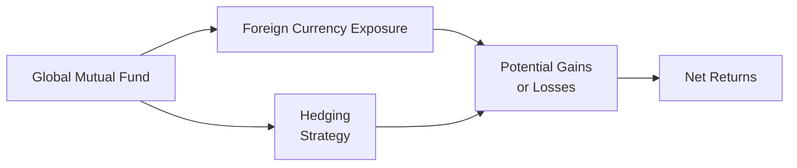
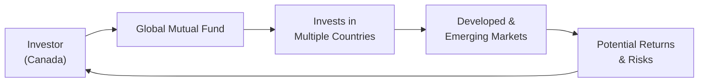

## 12.4 Global Mutual Funds

Global mutual funds are pretty interesting—at least, that’s always been my take on them. I still remember talking to a friend who was giddy about investing in emerging market equities because he’d heard about rapid growth in certain parts of Asia. The possibility of tapping into industries and trends that could outpace anything available at home was, well, exciting. But as we chatted, it quickly became clear that the approach also came with a big dose of complexity—like currency swings, political shifts, and just plain unpredictability. And so, that’s basically the short story on why we need to take a more measured approach when dealing with global mutual funds: they’ve got amazing potential, but also more moving parts. Below, we’ll walk through the essentials—like the sorts of global funds available, how they can fit into your portfolios, and what you need to keep an eye on to manage risk.

### Why Consider Investing Globally?

If you’ve read the earlier sections of Chapter 12, you’ll already know that riskier mutual fund products can be part of a strategically balanced portfolio, provided you understand what you’re getting into. Global mutual funds—and that includes funds labeled “international,” “worldwide,” “global balanced,” or “regional”—allow investors to diversify across many regions, economies, and currencies. The rationale is straightforward: by not confining your investments to one country’s economy, you may reduce the impact of local downturns, while taking advantage of potential gains elsewhere.

• Access to high-growth regions: Certain countries (like those in Asia or Latin America) might be going through periods of faster economic growth. This can present higher return potential.  
• Broader industry exposure: Wherever the best-for-return, best-for-risk industries are—whether that’s tech in the United States, pharmaceutical manufacturing in Europe, or consumer goods in emerging markets—global funds let you capture them.  
• Enhanced diversification: It’s often said that the Canadian market is heavily concentrated in certain sectors, such as financials and resources. A global approach can sweep in everything from multinational healthcare to semiconductor tech abroad.

Still, it goes without saying: investing worldwide involves more puzzle pieces.

### Key Risks in International Investing

Global funds can indeed present sweet rewards, but they also have risk factors that aren’t always top-of-mind when you invest strictly in your home country. Here are some biggies:

• Currency risk. It’s possible that even if a stock in your global portfolio does well, a nasty swing in foreign exchange rates can chip away (or add to) your returns.  
• Geopolitical tensions. Emerging market governments can sometimes be less stable, or a trade dispute can heat up, drastically affecting market sentiment.  
• Different market regulations. Ever tried reading about local corporate governance standards in a foreign country? It’s a mouthful, possibly in a different language, and it can impact the reliability of company data.  
• Market liquidity. If you hold securities from smaller or less accessible markets, it might be harder to get in and out of positions without affecting price.  
• Varying accounting standards. This can be a real headache, because not all markets measure and report financial statements in the same ways, so you might be comparing apples to oranges in some cases.

### Types of Global Funds

Global mutual funds come in many shapes and flavors, each aiming to capture returns from varied geographical areas or styles of money management. Let’s look at some common types.

#### Worldwide Equity Funds
These funds invest almost exclusively in equities (stocks) found all over the globe. The manager can pick securities from developed markets like Canada, the U.S., and Europe, as well as from fast-growing emerging markets such as India or Brazil. Usually, the goal is capital growth. Risk can be fairly high, though, because these funds have wide latitude to invest in riskier markets and industries for bigger potential gains.

#### Global Balanced Funds
If you prefer something that’s a bit more conservative (though still global in nature), a global balanced fund might fit. These funds typically combine international equities with global fixed-income instruments—corporate bonds, government debt from different countries, and so on. The idea is to achieve capital growth with some buffer during down markets, courtesy of a bond component. However, keep in mind that foreign bonds also carry interest-rate risk, credit risk, and currency risk.

#### Regional Funds
Regional funds focus on a specific region, such as Europe, Asia-Pacific, or Latin America. Some investors like them because they can pick a region they believe will outperform others. Of course, if something negative happens in that region—a political standoff, a currency collapse, or broader economic slowdown—returns can suffer because the investment is so concentrated there.

#### Country-Specific Funds
These laser in on a single country, like China, India, or Brazil. Again, concentration risk is front and center. While it can pay off if your chosen country experiences big growth, it can just as easily magnify losses if the country’s economy goes south or faces major political shocks.

### Understanding Currency Risk

One of the more intriguing aspects of global investing is that unexpected moves in foreign exchange rates can either goose up your returns or whittle them down. If you’re a Canadian investor and your fund invests in assets denominated in, say, U.S. dollars, Japanese yen, or Euros, then the exchange rate between your home currency (the Canadian dollar) and whichever foreign currency your fund holds becomes a crucial driver of performance. While currency risk can provide a diversification benefit (sometimes, foreign currency gains help offset domestic market downturns), it’s also an additional variable of uncertainty.

### How Hedging Can Help (or Hinder) Returns

Some global mutual funds hedge their currency exposure in an attempt to reduce volatility. They often do this by using derivative instruments (like futures or forwards) designed to offset potential losses from unfavorable currency moves. That might sound great—who wouldn’t want to manage volatility by removing at least one big risk factor? But hedging comes at a cost, and sometimes a currency hedge can backfire if exchange rates move in a favorable direction. So while hedging provides stability, it can also mean you give up potential currency windfalls.

Below is a simple visual diagram showing how hedging might fit in a global mutual fund’s overall strategy.

In this illustration, the fund invests internationally (and thus is exposed to foreign currencies). Hedging strategies (derivatives, currency forwards, etc.) may offset part of the currency impact on returns.

### Looking Under the Hood: Accounting Standards and Corporate Governance

Global funds give you exposure to firms running businesses all over the world, which is both a blessing and a curse. Different countries have different:

• Accounting Standards: Some follow International Financial Reporting Standards (IFRS), while others might use local variations. Understanding (or at least acknowledging) these differences is key.  
• Corporate Governance Norms: Investor rights, transparency requirements, executive compensation rules—these can vary, and it matters a lot for how well-managed and shareholder-friendly certain companies are.

Reading financial reports from companies based overseas can be, let’s say, eye-opening if you’re used to the straightforward approach (strict IFRS or GAAP) of local markets. There may be subtle differences in how revenue, expenses, or intangible assets are reported. When you invest through a global fund, the fund manager does the heavy lifting here, but it still helps to know that these variations can affect valuations and performance.

### Geopolitical Risk and Market Liquidity

Geopolitical risk looms large in the global context. Political tensions, sudden regulatory changes, or even unexpected events (wars, sanctions, etc.) can cause volatility in a foreign market. Additionally, some markets are less liquid than others—meaning if you needed to liquidate your positions, you could face wide bid-ask spreads or big price moves. That’s why some funds focus on large, well-followed markets, while others embrace more “frontier” regions in exchange for potentially bigger gains.

### Evaluating Suitability with CIRO Guidelines

In Canada, the Canadian Investment Regulatory Organization (CIRO) oversees regulatory obligations for mutual fund dealers. Its guidelines, which replaced the former MFDA and IIROC frameworks historically used, emphasize how important it is for dealers and representatives to evaluate a client’s capacity to handle currency risk, market risk, and geopolitical uncertainty in global funds. The project is part of ensuring these investments fit within the “Know Your Client” (KYC) and “suitability” obligations introduced in Chapter 17 of this course. If your client can’t stomach large fluctuations or the complexities of an international environment, global funds may not be appropriate—or might be used only in a moderate proportion of the portfolio.

### Best Practices for Advisors

It’s not enough to just say, “Global funds are riskier; buyer beware.” Good representatives will help clients understand:

• The potential for higher returns from faster-growing economies and markets.  
• The possibility that currency shifts or geopolitical turmoil could magnify losses.  
• The difference between, say, a global balanced fund and a single-country equity fund.  
• The cost and effectiveness of hedging strategies used by different global funds.  
• Regulatory differences that could complicate cross-border investments.

### A Quick Personal Reflection

Back in my early days of advising, I had a client who was fascinated by emerging markets, especially those in Southeast Asia. We included a small slice of a diversified Asian equity fund in his long-term portfolio. Over a few years, the growth was dramatic—until a regional currency crisis eventually caused the fund to tumble. Ultimately, the client still ended up with positive returns, but the ride was bumpy, and it taught both of us the value of ongoing monitoring and appropriate position sizing.

### Visualizing a Typical Global Mutual Fund Flow

Below is a simplified diagram showing how a global mutual fund handles capital flows across the world.

The big idea is that you (the investor) entrust your money to a global fund manager, who allocates assets across various markets. The results circle back in the form of risk and return.

### Practical Examples and Case Studies

Imagine a global equity fund that invests all over North America, Europe, and Asia. Perhaps 20% is in the U.S. technology sector, 10% in European telecoms, 15% in emerging Southeast Asian consumer goods, and so on. Now suppose the U.S. dollar dips against the Canadian dollar, while Asia sees a short-term slowdown, but Europe surges on renewed growth. The fund’s performance is a blend, so there’s diversification in action. On the flip side, there’s a swirl of currency movements, local economic factors, and possible political disruptions. In a single-country, single-currency environment, you wouldn’t juggle so many variables.

Or, consider a specialized country-specific fund in India. You might ride a wave of economic expansion—especially if the country invests heavily in infrastructure and technology. But if India’s currency were to devalue significantly against the Canadian dollar, or if a policy shift spooked global investors, that same fund might experience an outsized fall.

### Glossary

• Currency Risk (Exchange Rate Risk): The possibility that changes in the value of foreign currencies relative to the Canadian dollar will affect the returns of the fund.  
• Hedging: A financial strategy using derivatives or other instruments to offset potential losses from exposure to market fluctuations—most commonly, exchange rate changes.  
• Geopolitical Risk: The likelihood that political events (e.g., war, political instability, changes in government) will impact investment returns.  
• Market Liquidity: The degree to which an asset can be quickly bought or sold without significantly affecting its market price.

### Connecting to Relevant Tools and References

• CIRO Suitability Guidelines: Emphasize the same KYC fundamentals you’ve read in earlier chapters, focusing on foreign investment risk.  
• International Monetary Fund (IMF) (https://www.imf.org/): Offers macroeconomic indicators, country reports, and economic outlooks—handy when assessing a fund’s macro backdrop.  
• World Bank’s “Global Economic Prospects” (https://www.worldbank.org/): Another open resource for global data, emphasizing development trends and regional risks.  
• “International Financial Statement Analysis” (CFA Institute Investment Series): A deeper dive into analyzing global companies, bridging the gap in accounting standards and valuations.

### Final Thoughts

Global mutual funds can be an exciting way to diversify a portfolio beyond national borders and potentially seize opportunities in higher-growth markets. But remember: with more opportunities come more complexities—currency swings, shifting politics, uncertain regulations, and widely different corporate environments. Balancing these factors is crucial, and that balance hinges on good research, a client’s risk appetite, and consistent monitoring.

If you’re looking to add global mutual funds to your client’s portfolio, ask these questions: “Can the client handle the volatility that might come from foreign currency exposures? Are they long-term investors who can ride out market downturns in various countries? Do they understand that accounting standards can vary and that the fund manager’s skill in navigating those differences is crucial?” By addressing these, you can help ensure you’re recommending a product that aligns with both the spirit and the letter of compliance under CIRO and the broader Canadian regulatory landscape.

As always, keep that open dialogue with your clients. This approach not only meets regulatory requirements but genuinely helps them understand why their holdings might spike or dip based on a central bank announcement in a far-off land.

## Test Your Knowledge: Global Mutual Fund Strategies and Risks



### Which of the following best characterizes the appeal of global mutual funds?
- [x] They allow for diversification across different economies and currencies, potentially reducing home-country risk.  
- [ ] They are simpler to manage than single-country mutual funds.  
- [ ] They eliminate all currency fluctuation issues.  
- [ ] They are guaranteed to outperform domestic equity funds.  

> **Explanation:** Global mutual funds can offer geographical diversification and access to varied markets. They do not eliminate currency risk nor provide guaranteed outperformance.

### What is the main difference between worldwide equity funds and global balanced funds?
- [x] Global balanced funds combine equities and fixed-income securities worldwide, whereas worldwide equity funds focus solely on global stocks.  
- [ ] Worldwide equity funds invest only in emerging markets, while global balanced funds invest in safe domestic bonds.  
- [x] Global balanced funds tend to have slightly lower volatility due to bond allocations, while worldwide equity funds are typically higher risk.  
- [ ] Worldwide equity funds generally have no currency risk.  

> **Explanation:** A worldwide equity fund invests in equities globally, which can be quite volatile, whereas a global balanced fund blends equities with bonds to mitigate volatility.

### How can currency risk affect global mutual fund returns?
- [x] Fluctuations in exchange rates can amplify either gains or losses when converting foreign currencies back to Canadian dollars.  
- [ ] Currency risk always improves returns for Canadian investors.  
- [ ] Currency risk has no effect on a global fund holding only foreign stocks.  
- [ ] Currency risk is relevant only for short-term traders.  

> **Explanation:** Currency swings can drastically change the effective return once investments are converted into Canadian dollars, impacting overall performance.

### Why might an investor choose a country-specific fund?
- [x] They believe that country will experience significant economic growth and outperformance relative to the rest of the world.  
- [ ] Country-specific funds are guaranteed to have lower fees.  
- [ ] Country-specific funds are always less risky.  
- [ ] Country-specific funds have no geopolitical risk.  

> **Explanation:** Investors might focus on a single country if they’re convinced it has strong growth prospects. However, there’s also elevated risk due to lack of diversification.

### In global investing, what is the primary drawback of hedging currency exposure?
- [x] It can reduce overall returns if currency movements end up being favorable, and hedging strategies can be costly.  
- [ ] It removes the possibility of any profit from the fund’s investments.  
- [x] It eliminates the need for due diligence on foreign exchange fluctuations.  
- [ ] It always provides a significant tax advantage.  

> **Explanation:** While hedging helps manage downside currency risk, it may mean giving up unexpected gains from favorable exchange rate moves, and hedging itself can incur costs.

### What is geopolitical risk in the context of global mutual funds?
- [x] The impact of political events, such as wars or sudden government changes, that may drastically affect investments.  
- [ ] The guarantee that governments will support investor profits.  
- [ ] The reduction of currency volatility through government intervention.  
- [ ] None of the above.  

> **Explanation:** Geopolitical events can sway markets significantly, from asset values to currency rates, making it a key consideration for global fund investors.

### How does CIRO (Canadian Investment Regulatory Organization) influence investing in global mutual funds?
- [x] It provides guidelines ensuring that advisors assess client risk tolerance and the suitability of investments in foreign markets.  
- [ ] It limits global funds to only invest in emerging markets.  
- [x] It eliminates all currency risks for foreign investments.  
- [ ] It sets fixed returns for all global funds.  

> **Explanation:** CIRO requires dealers and representatives to meet robust KYC and suitability requirements, especially when higher-risk global products are being recommended.

### Which statement best describes market liquidity risk?
- [x] Some global markets may make it challenging to sell an asset quickly without moving its price.  
- [ ] Liquidity risk never affects global mutual funds.  
- [ ] Liquidity risk only arises in highly developed markets.  
- [ ] Liquidity risk affects only bond funds, not equity funds.  

> **Explanation:** Market liquidity risk refers to difficulty entering or exiting positions without great price impact, which can be especially pronounced in less developed or niche foreign markets.

### Why do different accounting standards abroad matter for global fund managers?
- [x] Variations in how financial data is recorded and presented can make it tough to compare company performance across countries.  
- [ ] Accounting differences automatically lead to better results for shareholders.  
- [ ] International standards guarantee uniform corporate governance everywhere.  
- [ ] Investors never need to worry about accounting when a mutual fund is managed by professionals.  

> **Explanation:** Understanding how a company’s financials are compiled and reported matters to accurate valuation and risk assessment in global investing.

### A global mutual fund that invests in both emerging and developed markets is always risk-free.  
- [x] True  
- [ ] False  

> **Explanation:** This statement is false. Global funds do not eliminate risk; they can diversify it across various economies, but market, currency, and geopolitical risks remain.


