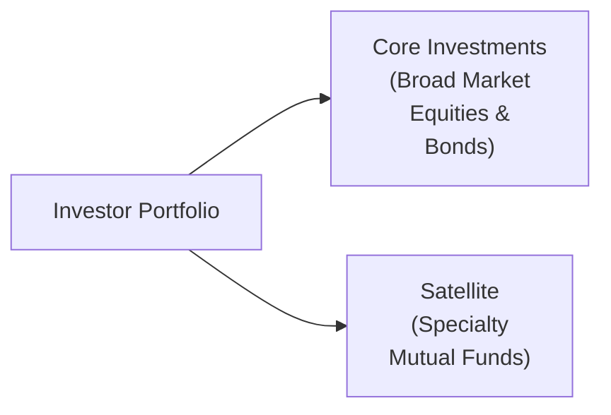

## 12.5 Specialty Mutual Funds

Have you ever heard someone talk about gold funds that soared right when the price of gold took off, but also dropped hard like a rock when the metals market stumbled? That’s pretty much the world of specialty mutual funds in a nutshell. Specialty mutual funds focus on a narrower field or adopt specialized investment strategies, which can make them a bit like a high-octane sports car: thrilling when things go well, but potentially disastrous if you lose control.

In general, specialty funds include sector funds (precious metals, real estate, energy, biotech, etc.), thematic funds (environmental, social, governance [ESG] or electric vehicles), and alternative-strategy funds (leveraged or inverse). Because they zero in on one market segment or theme, they can be significantly more volatile and unpredictable than more diversified funds. That doesn’t mean specialty funds are “bad.” It just means they come with unique considerations around risk, diversification, fees, and time horizon. Let’s walk through these important details so you can figure out whether a specialty fund has a place in your portfolio (or in your client’s portfolio if you’re a mutual fund sales representative).

Remember from Chapter 4 (“Getting to Know the Client”) and Chapter 5 (“Behavioural Finance”) that suitability is key. Specialty mutual fund recommendations should make sense for the client’s risk tolerance, objectives, and time horizon. If you’re an investor yourself, you want to know precisely how a specialty fund might fit (or not fit) into your long-term investment plan.

---

## What Makes a Mutual Fund “Specialty”?

When we talk about “specialty” or “niche” strategies, we’re really talking about funds that deviate from the typical broad-based approach (e.g., an all-equity fund tracking the S&P/TSX Composite). Instead, they might focus on a single area like technology stocks or, say, an “ESG innovators” theme. Because these funds often invest in smaller slices of the market, they can exhibit big swings in performance. Sometimes, a specialty fund sees spectacular returns in bull markets but experiences equally spectacular falls when sentiment shifts.

### Common Specialty Categories

• Sector Funds (Precious Metals, Real Estate, Energy, Biotech): These funds revolve around one industry—imagine a fund that only buys gold-mining companies or invests exclusively in biotech startups.  
• Thematic Funds (ESG, Electric Vehicles, Robotics): These funds embrace a specific trend or idea. For instance, an ESG-themed fund invests primarily in companies with compelling environmental, social, or governance track records.  
• Alternative-Strategy Funds (Leveraged or Inverse): These funds use derivatives or borrowing to either amplify market returns (or losses) or move in the opposite direction of their benchmark.

### Concentration Risk

From Chapter 8 on “Constructing Investment Portfolios,” we know diversification is a key tool for managing risk. Specialty funds basically tilt the opposite way: they funnel assets into a concentrated theme. This means a drop in that narrow sector can cause the entire fund to nosedive. For example, if you invest in a precious metals fund and gold prices collapse, well, you can imagine your fund’s daily performance chart looking pretty scary. Concentration risk is real, so always keep that in mind.

---

## Why Use Specialty Mutual Funds?

If specialty funds are so volatile, why bother? Sometimes, these funds can be useful satellite positions in a broader portfolio approach. You might remember from Chapter 10 (“The Modern Mutual Fund”) that some folks like to use a “core-satellite” strategy. In that setup, the “core” portion of the portfolio holds stable, diversified investments—like broad-based equity, bond, or balanced funds—while the “satellites” might be these more specialized or tactical funds. The idea is that even modest exposure to a soaring sector can boost overall returns, but you’re not putting everything on the line.

For example, a portfolio might have 80% in a global balanced fund (the core) and 20% in satellites such as:

• A real estate sector fund (for exposure to property markets).  
• An ESG-focused thematic fund (to capitalize on sustainability trends).  
• A precious metals fund (a potential hedge against inflation or economic uncertainty).

That’s not to say such a strategy always works out. If real estate declines simultaneously with the metals market, that 20% might really drag down your returns. But used carefully, these specialty funds can add some spice to an otherwise plain vanilla portfolio.

---

## Higher Volatility, Higher Fees

Who doesn’t love the possibility of higher returns? Well, be careful: with specialty funds, that potential often comes hand in hand with higher fees. You might see:

• More complex portfolios that require an active portfolio management team with specialized expertise (especially in alternative funds using derivatives).  
• Increased trading costs if the fund manager is frequently adjusting positions to exploit short-term moves in the sector.  
• Greater risk leading to possible performance fees if the fund is structured more like an alternative product (though mutual funds rarely charge “performance fees” in the same sense as hedge funds, some do have structures that can be more expensive, especially if they incorporate derivative overlays).

### Digging into Derivatives

Specialty funds sometimes use derivatives (options, futures, forwards, swaps) for both hedging and speculative purposes. For instance, a manager might short certain securities to reduce the fund’s risk (hedging) or might enter leveraged positions to attempt to boost returns. Derivatives can be helpful, but they also add layers of complexity. If used incorrectly, they can magnify losses in a hurry.

We know from Chapter 7 (“Types of Investment Products and How They Are Traded”) that derivatives aren’t inherently evil, but they require knowledge, skill, and risk management. As an investor or representative, it’s critical to check:

• Does the fund’s management team have a strong background in derivatives?  
• Is there a clear explanation of how the fund uses derivatives in the Fund Facts document?  
• Are the costs of derivative strategies transparent?

---

## Regulatory Perspective: Disclosure and Suitability

In Chapter 17 (“Mutual Fund Dealer Regulation”), we discuss how the Canadian Investment Regulatory Organization (CIRO) provides oversight for mutual fund dealers. As of January 1, 2023, the Mutual Fund Dealers Association (MFDA) and the Investment Industry Regulatory Organization of Canada (IIROC) amalgamated into this new SRO. If you come across references to MFDA or IIROC, remember those are now historical bodies as of 2023; everything is under CIRO’s umbrella. Because specialty funds involve more nuanced risks, there’s special emphasis on disclosure. Representatives might need to explain to clients:

• The presence of higher volatility  
• How concentration risk impacts the fund  
• Potential for amplified losses if derivatives are used  
• The role (or non-role) of these funds in a long-term plan

Additionally, each mutual fund in Canada is required to provide a “Fund Facts” document. This is a short, plain-language document that outlines key information including fees, performance, and risks. With a specialty fund, the “Risk” section typically highlights that the fund invests in a narrow market segment and may be susceptible to big price swings.

---

## Examples of Specialty Mutual Funds in Action

Below are a few scenarios that illustrate how specialty funds behave:

### 1. Precious Metals Fund During a Commodity Boom  
Let’s say we have a precious metals fund that invests heavily in gold-mining companies. If the price of gold spikes due to macroeconomic fears or currency debasement concerns, this fund might double in a few months, outpacing broader equity markets. But if gold prices reverse, that same fund can tumble just as quickly.

### 2. ESG Thematic Fund in a Growing Sector  
An ESG fund might concentrate on industries like clean energy and electric vehicles. If government subsidies and changing consumer preferences drive up demand for these technologies, your ESG fund might flourish. But if these sectors hit speed bumps—like regulatory changes or supply constraints—the specialized focus can work against the fund.

### 3. Leveraged & Inverse Funds for Speculation or Hedging  
Some funds use leverage to amplify exposure to a particular index. If the underlying index goes up 5%, a 2× leveraged fund might go up 10%. That’s awesome when the market rises, but if the index drops 5%, the fund could lose 10%. An inverse fund aims to move in the opposite direction of its benchmark—often used by investors looking to profit from (or hedge against) a declining market. However, these funds typically “reset” daily, making them more suitable for short-term or tactical moves rather than long-term investing.

---

## Using Specialty Funds within a Broader Portfolio

Often, specialty mutual funds are used as a satellite or tactical component. The core-satellite approach helps ensure that the majority of your portfolio is well-diversified but still offers the freedom to capitalize on targeted opportunities. Let’s visualize that with a Mermaid diagram:

In this simple illustration, your main portfolio (A) is split into two chunks: the “Core” (B), typically large diversified holdings, and the “Satellite” (C), your narrower, higher-risk specialty funds.

### Things to Keep in Mind

1. **Limit Your Allocation**: For a lot of investors, it makes sense to cap exposure to specialty funds. Maybe 5–15% of the total portfolio, depending on risk tolerance.  
2. **Monitor Regularly**: Specialty funds can whip around with market trends, so active monitoring is vital.  
3. **Rebalance**: If your specialty investments soar, rebalancing helps lock in gains and keeps your overall risk in check.

---

## Real-World Anecdote: My Friend’s Gold Fund Journey

I remember a friend of mine—let’s call him Dave—who got super excited about a gold fund right when the metal was trending upwards. Dave doubled his investment in six months, bragged about his new “strategy,” and decided to hold all of it, convinced gold was an unstoppable rocket. Then the price corrected, supply and demand shifted, general inflation concerns cooled off, and Dave’s gold fund plummeted to well below his purchase price. It served as a stark lesson: ignoring the inherent volatility of concentrated funds can be an expensive mistake.

---

## Potential Pitfalls

• **Limited Diversification**: Overexposure to a single industry, theme, or strategy.  
• **High Sensitivity to External Shocks**: Regulation, market sentiment, and commodity prices can all heavily sway certain sectors.  
• **Derivative Complexity**: Leveraged/inverse strategies can magnify losses, and rolling derivative contracts might eat into returns.  
• **Timing Risk**: Investors often jump into these funds after they’ve already soared, only to watch them deflate shortly thereafter.

---

## Considering Fees and Expenses

As mentioned earlier, these funds can come with steeper management expense ratios (MERs) than broad-based funds:

• **Specialized Managers**: You’re paying for teams with specialized knowledge (e.g., geologists analyzing mining stocks).  
• **Higher Turnover**: Specialty strategies often have more frequent trading, possibly incurring higher transaction costs.  
• **Derivative Costs**: Options, futures, or swaps can incur costs that eat into fund returns.

Always check Fund Facts to see the MER and the Trading Expense Ratio (TER), if relevant. If you’re a representative, it’s essential to highlight these fees in client discussions.

---

## Regulatory Guidance & Resources

### CIRO Guidance

• CIRO, the new combined SRO in Canada, has guidelines about recommending non-traditional or alternative funds. You’ll want to ensure stricter disclosure of risks and complexities.  
• The “Know Your Client” (KYC) and “suitability” obligations remain absolutely crucial, especially for these higher-risk strategies.

### Fund Facts Requirements

• By Canadian regulation, each mutual fund must provide a concise “Fund Facts” document. Specialty funds often label themselves with higher risk on the scale you’ll see in these documents, from “Low” to “High.”  
• The summary in Fund Facts outlines the investment’s aim, main risks, historical returns, and fees. Always review it.

### Industry Tools

• **Morningstar’s “Category”**: You can explore or compare specialized categories—for example, “Sector Equity Precious Metals” or “Sector Equity Energy.”  
• **The Hedge Fund Mirage by Simon Lack**: While this book primarily looks at hedge funds, many insights apply to complex or alternative strategies in general. It’s a cautionary tale about fees, transparency, and the illusions of outsized returns.

---

## Practical Guidelines for Representatives

• **Educate Your Clients**: Plainly explain what “specialty” means, what concentration risk is, and how derivative usage might lead to larger losses.  
• **Focus on Suitability**: Tie your recommendation back to the client’s time horizon, risk tolerance, and goals (Chapters 4 and 5).  
• **Highlight the Role in Portfolio**: Emphasize that specialty funds might be a smaller slice of the bigger pie, especially if the client can’t handle wide performance swings.  
• **Document the Advice**: Make sure you have a paper trail (or digital trail) explaining why it’s suitable.  
• **Stay Updated on Regulatory Changes**: Monitor CIRO bulletins and updates at https://www.ciro.ca for any new guidance.

---

## Putting It All Together

Specialty mutual funds can enhance a portfolio’s returns (and excitement!) when used wisely, but they bring real risks. Whether we’re talking about a fund that focuses on biotech or one that invests in precious metals, you’re essentially betting on a narrower slice of the market. If that slice does well, you win. If not, it can be painful. For investors, the best approach is typically to use these funds like seasoning. A pinch might add flavor, but you don’t want to pour the entire salt shaker onto your steak.

Financial professionals recommending these products need to thoroughly understand how they work, the nuances of derivatives, and the potential for heavier losses. Make sure to communicate all this clearly to clients—and, of course, confirm it aligns with their long-term plan. When used carefully and sparingly, specialty funds can be a powerful tool in achieving unique financial goals.

---

## References & Additional Resources

• CIRO Website: [https://www.ciro.ca](https://www.ciro.ca) – For the latest updates, regulatory guidance, and educational resources.  
• Fund Facts: Visit the relevant mutual fund company’s website for the specific short-form disclosure.  
• Morningstar: [https://www.morningstar.ca](https://www.morningstar.ca) – Offers tools to classify and compare funds by sector, theme, and category.  
• The Hedge Fund Mirage by Simon Lack – A cautionary perspective on hedge funds, but relevant for any complex investment instrument.  
• “Core-satellite” Strategy: For more details, see Chapter 10 (“The Modern Mutual Fund”) on how managers blend broad and niche investments.  
• See Chapter 17 (“Mutual Fund Dealer Regulation”) for more on compliance and guidance for dealers.

---

## Quiz: Specialty Mutual Funds: Risk, Strategy & Concentration



### In specialty mutual funds, "concentration risk" primarily refers to:
- [ ] The risk of stock markets falling globally.
- [ ] The risk of having too many diversified holdings.
- [x] The risk of investing heavily in one market or theme.
- [ ] The risk that fund managers will overuse derivatives.

> **Explanation:** Concentration risk occurs when a fund invests in a narrow theme, market, or sector, making it vulnerable to downturns in that specific area.

### Which of the following funds is most likely to use derivatives to profit when a market index declines?
- [ ] ESG thematic fund.
- [x] Inverse fund.
- [ ] Real estate sector fund.
- [ ] Precious metals fund.

> **Explanation:** Inverse funds are designed to move in the opposite direction of a specific market index, often using derivatives to achieve this inverse exposure.

### According to a core-satellite approach, specialty mutual funds generally:
- [ ] Take up the majority of the total portfolio.
- [x] Act as smaller “satellite” holdings to complement a broad core.
- [ ] Should replace all broad-based funds when markets are volatile.
- [ ] Are suitable for all investors as a core holding.

> **Explanation:** Specialty funds typically play a limited “satellite” role in a broadly diversified portfolio, while the “core” holdings remain diversified.

### A precious metals fund investing in gold-mining companies is especially susceptible to:
- [x] Commodity price fluctuations.
- [ ] Unrelated industries like retail or technology.
- [ ] Global interest rate risk alone.
- [ ] Complete immunity from any market downturns.

> **Explanation:** A fund that concentrates on gold-mining companies is highly sensitive to changes in commodity prices like gold prices, making it prone to volatility.

### What should a representative highlight to clients when recommending specialty funds?
- [x] Potential for higher volatility and limited diversification.
- [x] Unique fees, including possible derivative costs.
- [ ] That it’s always low-risk.
- [ ] That they are a perfect substitute for core equity funds.

> **Explanation:** Because specialty funds can have higher volatility, derivatives usage, and narrower focuses, it’s crucial to disclose these characteristics, including fees and concentration risk.

### Which regulatory body oversees Canadian mutual fund dealers as of 2023?
- [x] CIRO
- [ ] IIROC
- [ ] MFDA
- [ ] OSFI

> **Explanation:** The Mutual Fund Dealers Association (MFDA) and Investment Industry Regulatory Organization of Canada (IIROC) amalgamated into the Canadian Investment Regulatory Organization (CIRO) effective January 1, 2023.

### True or False: Leveraged funds often magnify both potential gains and losses.
- [x] True
- [ ] False

> **Explanation:** Leveraged funds amplify exposure, so if the underlying index rises, gains are multiplied. If it drops, losses are multiplied too.

### Which document provides concise, plain-language information on risks, performance, and fees for a specialty mutual fund?
- [ ] Hedge Fund Prospectus
- [ ] Financial Statements
- [x] Fund Facts
- [ ] Corporate Press Release

> **Explanation:** The Fund Facts document outlines a mutual fund’s key info in a simplified format mandated by Canadian regulations.

### A short-term investor who anticipates a decline in the biotech sector might consider:
- [x] An inverse biotech fund.
- [ ] A broad global equity fund.
- [ ] A real estate sector fund.
- [ ] No investment in derivatives or alternative strategies.

> **Explanation:** An inverse sector fund seeks to profit from a decline in that sector, making it suitable for a short-term, more tactical bet on a downturn.

### Specialty funds that use derivatives for hedging or speculative purposes may have:
- [x] Higher fees and complexity.
- [ ] No additional costs compared to regular funds.
- [ ] A guaranteed return regardless of market conditions.
- [ ] Zero concentration risk.

> **Explanation:** Using derivatives can increase both fees and the level of complexity. It does not guarantee returns and does not eliminate concentration risk if the fund invests in a narrow sector.


