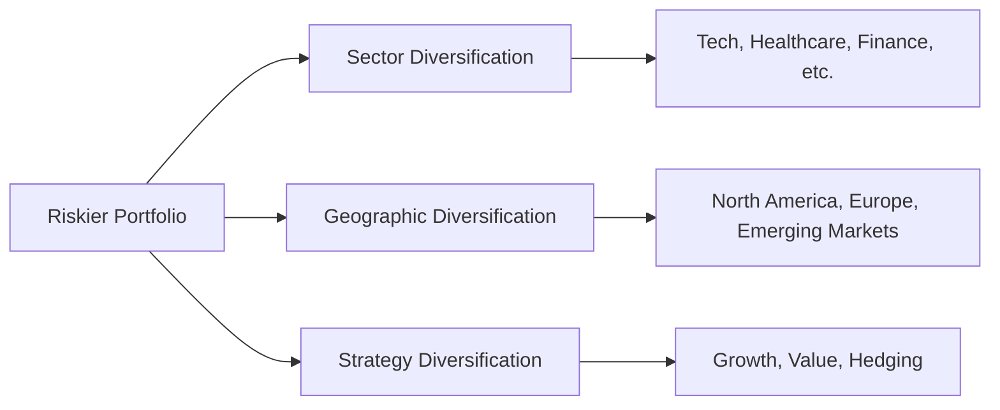
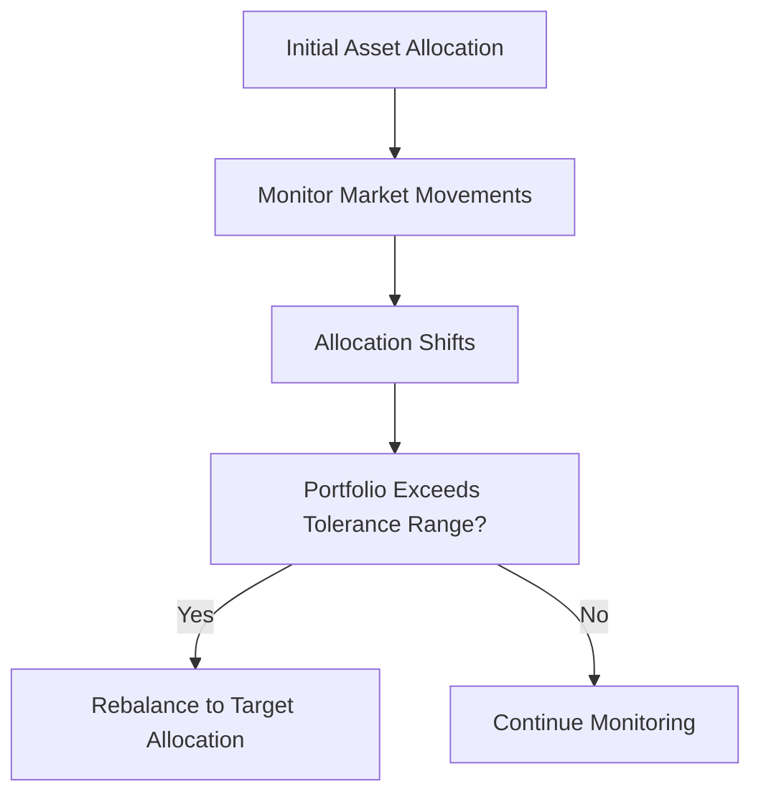

## 12.6 Additional Risk Management Considerations for Riskier Mutual Fund Products

Sometimes, stepping into the realm of higher-risk mutual fund products feels like navigating turbulent waters. You’re hoping to catch the waves just right, but you’re also aware that things can get a little choppy out there. I remember the first time I helped a friend assess a high-volatility emerging markets fund for their portfolio. We both learned (the hard way, I might add) that a client’s capacity for loss could be very different from what they initially imagine. In this section, we’ll unpack these higher-level risk considerations with a friendly, conversational approach—so it doesn’t feel quite so daunting.

Use this guidance to enhance your knowledge of how to approach, recommend, and monitor riskier mutual fund products while meeting the Canadian Investment Regulatory Organization (CIRO) standard of care. We’ll also look at some practical ways to manage risk through diversification, ongoing monitoring, and stress testing.

## Understanding the Bigger Picture

When we talk about riskier mutual fund products, we typically mean equity mutual funds, global or emerging markets products, specialty funds concentrating on niche industries, or other higher-volatility strategies. These might look appealing for their growth potential, but they also come with unique complexities—think currency risk, political risk, liquidity constraints, or higher sensitivity to market swings.

The real key? You’ve got to align those characteristics with the client’s personal and financial situation. Which is why the first step is to make sure you truly understand your client’s risk capacity, not just their stated “I can handle it!” risk tolerance.

## Risk Factor Assessment

A common pitfall is focusing solely on a client’s stated willingness to accept risk without actually assessing how a potential loss might affect their finances. If I offered my father a 30% decline in his portfolio, he’d probably panic even though, at times, he claims to be “totally comfortable with risk.” Clients might be comfortable when markets are up, but that comfort can evaporate when things get bumpy.

• Time Horizon: Longer investment horizons often let clients ride out short-term volatility. If someone is retiring in two years, though, a portfolio wracked by sudden sharp declines might not recover in time.  
• Potential Loss Aversion: Loss aversion creeps up in times of market turbulence, when people suddenly realize they dislike losing money more than they like making it.  
• Other Assets: If your client’s net worth is widely spread amongst real estate or stable bond holdings, they might be able to absorb more risk in smaller, higher-volatility funds. Conversely, if a client’s next largest asset is a private business that’s already risky, layering on a high-volatility mutual fund might be unwise.  

## KYC and Suitability

The Know Your Client (KYC) obligation is the bedrock of delivering sound advice. Under CIRO’s updated guidelines, you need a thorough and current client profile. It’s not enough to ask about risk tolerance when you first open the account; you must keep track of personal changes that can shift the profile—anything from marriage or divorce, a new job, or an inheritance.

• Ongoing Profile Reviews: Market fluctuations, changing personal circumstances, or broader economic shifts can render initial KYC data outdated. Don’t wait for your clients to prompt you; schedule reviews periodically.  
• Life Events: A client who experiences a big life change—job loss, new dependents, or large medical expenses—may now be more sensitive to volatility. Keep the lines of communication open.  
• Suitability Checkpoints: Merge risk tolerance with risk capacity. Even if a client indicates moderate-to-high risk tolerance, their capacity (in terms of future financial goals) may not allow it.

## Diversification within Riskier Assets

One big myth is that “risky equals no diversification.” Actually, you can still spread out your bets even under the umbrella of high-volatility investments.

Here’s a quick everyday analogy: If you go to an ice cream parlor and max out on toppings, you can still choose different kinds of toppings—some crunchy, some sweet—to make sure you don’t end up with an overwhelmingly single-flavor meltdown. Similarly, for riskier mutual funds:

• Diversify by Sector: An emerging markets equity fund that focuses on technology stocks might pair with a global resources fund, so you’re not concentrated in just one industry.  
• Diversify by Region: Combine North American small-cap funds with an Asia-Pacific growth fund for geographical balance.  
• Diversify by Strategy: You might combine an aggressive growth methodology with a more value-oriented approach or a fund that invests in shorting strategies to manage overall volatility.

This diversification principle can be visualized with a simple diagram:

Even if all the funds you choose are “high-octane,” the variety can help cushion extreme volatility in one particular area.

## Ongoing Monitoring and Rebalancing

Remember that a riskier mutual fund demands more frequent attention. My cousin, who set up a technology-focused mutual fund in his investment account, assumed he could leave it alone for years. When he finally checked back during a tech industry downturn, the fund no longer suited his original portfolio target. The lesson? Proactivity matters.

• Market Volatility Can Shift Allocations: If technology stocks surge, you might suddenly find your tech fund overshadowing other allocations.  
• Periodic Check-Ins: Schedule calls or emails to discuss performance. Many new advisors just wait for annual reviews, but quarter-by-quarter monitoring can be more effective for high-volatility products.  
• Rebalancing: Consider setting a threshold (e.g., if an asset class drifts 5% beyond target). Rebalancing helps maintain a risk profile aligned with your original strategy.

It can help to illustrate the cycle of risk management and rebalancing in a diagram:

## Stress Testing

Have you ever tried to mentally “simulate” what might happen if your portfolio faced a crisis like the 2008 financial meltdown or a swift pandemic-driven market crash? Stress testing is basically that, but with data.

• Scenario Analysis: Tools such as Portfolio Visualizer (https://www.portfoliovisualizer.com/) can simulate historical returns—like replaying major events from the last decade—to show approximate economic impacts.  
• Designing “What-Ifs”: “What if interest rates suddenly spike?” “What if an emerging market experiences political instability?” The answers can inform how big an overweight in that fund your client should be.  
• Communicate Results: Explain to clients how stress testing works. Emphasize that no simulation is perfect, but it’s far better to have an approximate idea of worst-case scenarios than none at all.

## Disclosure and Transparency

I once had a client who was deeply involved in a biotech fund that soared 40% in one year—only to plummet 50% the next. She was stunned because she hadn’t realized the fund concentrated in experimental gene therapy startups. Being transparent from the get-go could have reduced her shock.

• Clear Explanations: Spell out the main risks of the fund. Is it leveraged? Does it have exposure to exotic financial instruments?  
• Comprehensive Documentation: Provide a Fund Facts document (in line with CIRO guidelines) and highlight the most relevant parts (e.g., risk rating, recent performance, top holdings).  
• Risk Warnings: Let clients know that if the fund invests in small-cap companies, especially in emerging markets, performance swings might be dramatic.

## Regulatory and Legal Compliance

Even though the Mutual Fund Dealers Association (MFDA) and the Investment Industry Regulatory Organization of Canada (IIROC) were the separate self-regulatory organizations historically overseeing mutual fund activity and investment dealers, they’ve since become the Canadian Investment Regulatory Organization (CIRO). Today, CIRO’s rules and guidelines govern dealer and representative obligations.

• Product Due Diligence: CIRO expects thorough research on the product’s strategy, risk factors, and performance history before recommendation.  
• Risk Disclosure: You are responsible for communicating both the potential upside and the potential downsides. Explanations must be in plain language.  
• Suitability Documentation: Document your rationale for the recommendation. Keep track of conversations in your records in case you need an audit trail.  
• CIPF Coverage: The Canadian Investor Protection Fund (CIPF) is Canada’s sole investor protection fund. It offers protection if a CIRO-registered firm becomes insolvent. Remind clients that CIPF coverage doesn’t shield them from market losses; it only safeguards member assets where the firm fails.

For official references, consider:  
• CIRO Rule Book on suitability and KYC obligations (https://www.ciro.ca/)  
• CSA National Instrument 31-103 for registration requirements and client relationship rules  
• Portfolio Visualization Tools (https://www.portfoliovisualizer.com/) for backtesting and stress testing  
• “Investment Risk and Financial Markets” (CFA Institute) for advanced risk management strategies  

## A Personal Example: The Emerging Markets Conundrum

Let me share a real (but anonymized) story. A mid-career professional, Sam, approached me to discuss a hot new emerging markets fund. Sam had seen headlines about massive gains in various frontier economies. He had decent savings, a stable job, and no large upcoming expenses. So, was it automatically a fit?

1. We started with Sam’s risk capacity. Could he endure a 25% drop without impacting his child’s education funds or future travel plans? Actually, yes—because he had separate savings for those goals.  
2. We also tested his true comfort level by showing him some simulated stress tests of past emerging markets crashes (e.g., the 1998 Asian financial crisis, the 2008 global meltdown, and more recent corrections). Understanding the scale of possible drops made Sam pause.  
3. We diversified, splitting his “emerging markets slice” into two funds: one focusing on Asia and the other on Latin America. That way, a downturn in one region wouldn’t wholly cripple that portion of his portfolio.  
4. We created a schedule for ongoing monitoring and rebalancing. If the emerging markets portion rose or fell by more than 5% from our initial target, we’d review and rebalance.  

Now, Sam sleeps a bit better at night, even though the fund can have wild fluctuations. He understands the structure behind his investment.

## Glossary

• Risk Capacity: The financial ability of an investor to absorb potential losses without jeopardizing future goals.  
• Stress Testing: Simulating various adverse market scenarios to estimate the potential impact on a portfolio or fund.  
• Rebalancing: Adjusting asset allocations back to intended targets to manage risk and align with the client’s investment plan.  
• Client Profile: A comprehensive overview of a client’s personal and financial information, including objectives, income, net worth, time horizon, and risk tolerance.

## Final Thoughts

At the heart of it all, risk management with higher-volatility mutual funds is about trust and communication. Your role is not just to place trades, but also to guide, educate, and calm clients when the seas get rough. In my opinion, there’s no foolproof formula for risk management, but you have an arsenal of strategies—ranging from thorough KYC processes and diversification to frequent rebalancing and stress testing. Keep refining your approach, stay updated on CIRO’s guidelines, and make sure you document everything diligently.

If you’re curious to learn more, check out open-source portfolio tools like Portfolio Visualizer, or dive into the Canadian Securities Administrators (CSA) website to read National Instrument 31-103. By blending best practices, regulatory compliance, and a dose of empathy for clients’ financial well-being, you’ll navigate the riskier side of mutual funds with confidence and professionalism.

----

## Test Your Knowledge: Risk Management Strategies for Higher-Volatility Mutual Funds



### Which factor best describes a client’s ability to endure losses without compromising their future goals?

- [ ] Time horizon
- [ ] Asset allocation
- [x] Risk capacity
- [ ] KYC updates

> **Explanation:** Risk capacity refers specifically to the potential financial impact of losses on a client’s life goals, not just the emotional comfort level.

### When discussing higher-risk mutual fund recommendations, why is it essential to do ongoing profile reviews with clients?

- [x] Because risk tolerance can shift in response to life events or market conditions
- [ ] Because historical performance consistently predicts future returns
- [ ] Because it reduces the need for KYC documentation
- [ ] Because it allows you to avoid rebalancing

> **Explanation:** Clients’ circumstances (marriage, divorce, job change, inheritance) or market volatility can alter their capacity and tolerance for risk, making periodic reviews essential.

### Which strategy can help mitigate risk even within a high-risk mutual fund allocation?

- [x] Diversification across sectors, regions, and strategies
- [ ] Allocating 80% of the portfolio to a single fund
- [ ] Avoiding rebalancing entirely
- [ ] Inputting only historical data without scenario testing

> **Explanation:** Diversification is crucial, even within riskier asset classes, to reduce reliance on a single market or strategy.

### What is portfolio stress testing?

- [ ] A way to guarantee no losses 
- [x] A simulation of potential adverse outcomes based on historical or hypothetical scenarios
- [ ] A daily recalculation of the net asset value (NAV)
- [ ] A tool for guaranteeing a certain return

> **Explanation:** Stress testing helps advisors and clients estimate how a portfolio might react to extreme market events, identifying potential vulnerabilities.

### Which of the following is a correct statement about rebalancing?

- [x] It involves realigning portfolio allocations to original or revised targets.
- [ ] It is only necessary when markets are stable.
- [x] It may require selling winners and buying underperformers to maintain targets.
- [ ] It is only appropriate for conservative portfolios.

> **Explanation:** Rebalancing is a standard practice to maintain desired asset allocations, often involving selling assets that have appreciated beyond their intended weighting and buying those that have lagged.

### Why is transparent disclosure crucial when recommending riskier mutual funds?

- [x] Clients need to understand how strategies could lead to severe downturns.
- [ ] To avoid providing necessary Fund Facts documents.
- [ ] To confuse the client with complex terminology.
- [ ] So the representative can reduce compliance documentation.

> **Explanation:** Clearly explaining potential risks ensures clients are fully informed and not surprised by volatility or concentration risks.

### Why are CIRO rules around suitability and risk disclosure important?

- [x] They ensure representatives make recommendations aligned with each client’s situation.
- [ ] They encourage product pushing without due diligence.
- [x] They mandate thorough research and open communication about risks.
- [ ] They eliminate the need for client signatures.

> **Explanation:** CIRO dictates that representatives thoroughly understand the funds they recommend and ensure each recommendation meets the client’s unique goals and constraints.

### What impact does market volatility have on a riskier mutual fund allocation?

- [x] It may alter the allocation more quickly, necessitating prompt rebalancing.
- [ ] It completely nullifies the need for a time horizon.
- [ ] It automatically increases performance.
- [ ] It eliminates the requirement for stress tests.

> **Explanation:** High volatility can cause an allocation to drift away from target levels, requiring more frequent reviews and possible rebalancing.

### How do scenario analyses benefit clients considering riskier funds?

- [x] They show how the fund might respond to historical crises or hypothetical downturns.
- [ ] They guarantee symmetrical returns.
- [ ] They remove the need for client disclosures.
- [ ] They replace the necessity for a KYC process.

> **Explanation:** Scenario analyses (or stress tests) offer insights into how a portfolio might behave under extreme conditions, informing better risk management decisions.

### Is the Canadian Investor Protection Fund (CIPF) designed to protect investors from market losses?

- [x] True
- [ ] False

> **Explanation:** CIPF coverage protects client assets only if a CIRO-member firm becomes insolvent. It does not cover losses due to market fluctuations.


