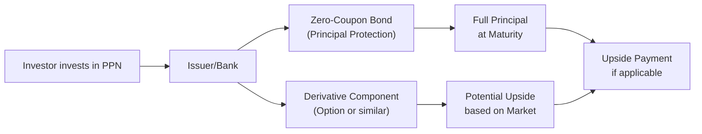

## 13.1 Principal-Protected Notes (PPNs)

Have you ever worried about losing hard-earned savings in a market downturn? I remember, a few years ago, one of my closest friends confessed that she couldn’t handle the stress of watching her investment portfolio rise and fall every week. She wanted some upside from the market but was terrified of losing her initial principal. This is the kind of scenario that often sparks curiosity about Principal-Protected Notes (PPNs). Let’s dive in and see how PPNs are built, what makes them tick, and whether they might fit your clients’ or your personal goals.

You might recall from other chapters (particularly those on risk and return or constructing investment portfolios) that most market investments come with the risk of losing some principal. PPNs, on the other hand, aim to strike a balance: they guarantee, if held to maturity and if the issuer stays solvent, the original investment (i.e., the principal) while offering some form of participation in markets—whether that’s an index, a basket of stocks, or other assets. Now, that’s the promise, but as you’ll see, there’s more to these products than meets the eye.

### PPN Structure and Rationale

Principal-Protected Notes are typically put together using two key components:

• A zero-coupon bond (or a deposit note)  
• A derivative instrument, often an option on an underlying index or other asset  

The zero-coupon bond ensures that the principal (the amount invested) will be returned at maturity, assuming the issuer doesn’t default. “Maturity” could be anywhere from a few years to over ten years. Meanwhile, the derivative component is designed to track (or partially track) the performance of a specific market index or asset. This means you won’t earn coupon payments like with regular bonds, but, if the market goes up, you can get a bonus “top-up” on your principal.

In more human terms, think of the zero-coupon bond as the safety net: it grows to reach the face value (equal to your initial investment) at the end of the PPN’s term. The derivative is like the “gain-chasing” part; if the referenced market or index goes up, that derivative pays out part of the upside. If the market goes nowhere or even negative, you still keep your principal because of the bond component. This is the big draw for anyone who wants protection but doesn’t want to miss out on potential market gains altogether.

### A Visual Look at PPNs

Sometimes a picture is worth a thousand words. Here’s a quick flowchart illustrating the basic structure of a PPN. Notice how the principal-protection component and the market-linked component work together:

Explanation of the diagram:  
• The investor hands over funds to the issuing bank (or financial institution).  
• The bank splits these funds: a large chunk buys a zero-coupon bond, while a smaller piece funds an option or similar derivative.  
• Over time, the zero-coupon bond grows to the original investment amount.  
• The derivative’s payoff depends on the underlying market—if it goes up, you receive some upside at maturity.  
• At the end of the term, the bond returns your principal, and the derivative may add extra gains.

### Key Features of PPNs

Below is a quick table summarizing the key features and trade-offs of PPNs:

| Feature             | Description                                                  | Example/Note                                                           |
|---------------------|--------------------------------------------------------------|-------------------------------------------------------------------------|
| Principal Guarantee | Issuer pledges to return the original investment at maturity | Subject to issuer’s creditworthiness (e.g., a major bank).             |
| Limited Upside      | Often capped or subject to a participation rate             | Could be 80% of index returns, or returns capped at 30% total.         |
| Term                | Range from a few years to more than a decade                | Common terms: 3, 5, 7, 10 years; early withdrawal may forfeit guarantee|
| Credit Risk         | Depends on issuer’s ability to repay                        | If issuer defaults, principal protection might vanish.                 |
| Liquidity           | May be difficult to exit early and may incur fees           | Charges or secondary market uncertainties can apply.                   |
| Market Link         | Usually references equity indices, baskets of stocks, or other assets | Derivative portion could also track commodities or interest rates.     |
| Fees                | Can be embedded or explicit                                  | Affects participation rate or total return.                             |

### Creditworthiness: The First Consideration

If you’re thinking, “Wait a second—what if the issuer can’t pay me back?” then you’ve already grasped the core risk with PPNs: credit risk. When you invest in a Principal-Protected Note, you’re relying on the institution’s promise to give you your principal at maturity (plus any market-linked gains). If that institution defaults—like how some big banks ran into trouble in the financial crisis—you could lose some or all of your investment. So, it’s critical to look at the credit rating or the financial health of the issuer.  

In Canada, we have respected rating agencies like DBRS Morningstar, S&P Global, and Moody’s that issue ratings on banks and other institutions. A good rating is like a “seal of approval,” but it’s not 100% foolproof. Keep in mind that credit ratings can change over time, so it’s best to stay informed.

### Typical Underlying Assets: Indices, Baskets, or Thematic Plays

The performance of the derivative portion of a PPN ultimately depends on the underlying asset or index. Common choices include:

• Broad market indices (e.g., S&P/TSX Composite, S&P 500)  
• Global, sector, or thematic baskets (e.g., a technology stock basket)  
• Commodity indices (e.g., gold or oil)  
• Currency or interest rate derivatives (less common for retail investors)

A note of caution: not all “linked” assets are equally volatile. When you see an “equity index PPN,” that typically has higher volatility than a money-market-linked structure. Generally, the more volatile the underlying asset, the more potential for bigger ups and downs. Be sure to understand the correlation between the underlying asset’s volatility and the actual distribution of returns coming to you.

### Caps, Participation Rates, and Other Constraints

One reality check for PPNs is the potential limitation on upside returns. Because so much of the investment typically goes into the zero-coupon bond to preserve principal, the derivative component might be comparatively small. As a result, issuers often impose:

1. Participation Rates: You may only get a fraction of the underlying gains (e.g., 80% of the index upside). If the index grows by 10%, you get 8%.  
2. Return Caps: A maximum overall gain (e.g., 30% total over 5 years). If the market skyrockets well beyond that, you’re still limited to 30%.  
3. Performance Thresholds: Some PPNs only pay out if the index return exceeds a certain threshold.  

Imagine you’re purchasing a 5-year PPN on a popular equity index with a 90% participation rate. If that index soars by 50% over 5 years, your effective gain is 45% (0.90 × 50%). Not bad, but it’s not the entire 50%. Some might feel shortchanged if the index does exceptionally well, but recall that the trade-off is guaranteed principal protection if the market tanks.

### Maturity and Liquidity

One surprising point for many new PPN investors is that principal protection generally only holds if you keep the note until maturity. If you cash out early, the bank or the market maker might only give you the current market value, which can be influenced by interest rates, changes in volatility, and the performance (or lack thereof) of the underlying asset. Some PPNs may charge hefty early redemption fees or may not be redeemable at all until a certain lock-up period expires.  

This means your money could be tied up in the product for years. Hence, PPNs often appeal to investors who can set aside funds they don’t need immediate access to—similar to GICs (Guaranteed Investment Certificates) with a twist of market potential. That said, always check the fine print. If you can’t accept the possibility of limited liquidity, a PPN might not be your ideal investment.

### Suitability: Who Buys PPNs?

• Conservative Investors Seeking Some Upside: PPNs are typically pitched to individuals who want a guarantee (subject to credit risk) on their principal but still don’t want to miss all market upside.  
• Investors Concerned About Volatility: If you can’t stomach the daily or monthly fluctuations of stocks, PPNs might offer peace of mind that more direct equity investments can’t always provide.  
• Long Investment Horizon: PPN brochures often emphasize the “set it and forget it” approach, meaning you’re parking your money for several years.  
• Estate Planning or Specific Goals: Individuals who have a specific future cash flow goal or anticipate passing assets to heirs might find the principal guarantee comforting.

But PPNs are far from a universal solution. Some potential disadvantages include:

• Limited absolute returns in very bullish markets.  
• Trapped capital if you need to exit early.  
• Exposure to a single issuer’s credit risk.  
• Fees or complexities that might reduce transparency compared to straightforward investments.

### Example: Deploying $100,000 in a PPN

Let’s walk through a simple hypothetical example:

• Tina invests $100,000 in a 5-year Principal-Protected Note linked to a Canadian equity index.  
• 85% of her money is allocated to a zero-coupon bond that will grow to $100,000 in 5 years, ensuring her principal is returned if she holds it until maturity.  
• The remaining 15% covers the purchase of an option on that Canadian equity index, with a participation rate of 90% on any gains over the 5-year term.  
• The PPN has a 3% annual cap if the index grows significantly (so effectively, her maximum total return might be around 15% over the 5 years, if we assume simple capping).  

Scenario A: The index grows 10% in total over 5 years. Tina’s derivative pays her 90% of 10% = 9%. Thus, she ends with $109,000.  

Scenario B: The index is flat at the end of 5 years. Tina’s derivative expires worthless. She ends up with $100,000—her principal.  

Scenario C: The index shoots up 50%. Due to the 3% annual cap or some other internal cap, Tina’s return is limited to 15% total. She ends up with $115,000. The rest of the gains above 15% effectively go to the issuer, not to Tina.  

This example helps show that while Tina’s risk of losing principal is minimal (barring issuer insolvency), she might forego substantially higher market gains.

### Regulatory and Compliance Considerations

In Canada, the regulation of PPNs involves more than just a single entity. You’ll find guidance from:

• CIRO (Canadian Investment Regulatory Organization): https://www.ciro.ca/  
• Canadian Securities Administrators (CSA): https://www.securities-administrators.ca/  
• Office of the Superintendent of Financial Institutions (OSFI): https://www.osfi-bsif.gc.ca/  
• Provincial securities regulators

Each regulator provides rules or guidelines about how these products must be marketed, disclosed, and sold to clients. Representatives recommending PPNs to retail clients must do a robust Know Your Client (KYC) and suitability assessment per CIRO’s guidelines. Explaining how a PPN works—especially details such as the credit risk, potential caps or participation rates, liquidity constraints, and fees—should be handled with clarity and fairness. 

### Common Pitfalls and Best Practices

• Overlooking Early Redemption Fees: If your client is likely to redeem before maturity, PPNs might not be suitable.  
• Ignoring the Issuer’s Credit Rating: Always verify the financial stability of the issuer; it’s the backbone of the principal guarantee.  
• Glossing Over Caps or Participation Rates: Some clients are disappointed if the market soars but their PPN’s gains are capped. Don’t let that be a surprise.  
• Assuming Liquidity: Not every PPN provides a seamless exit route.  
• Failing to Compare Alternatives: There might be other ways to achieve partial downside protection, like using balanced funds or certain derivatives. Always weigh the pros and cons.  

### Linking to Other Concepts

From a broader portfolio management perspective (see Chapter 8 on Constructing Investment Portfolios), PPNs can sometimes act like a portfolio diversifier. They behave a bit like a bond (for the principal protection) combined with a call option (for upside). The presence of a principal guarantee might help some investors sleep more comfortably at night. However, it’s important to keep an eye on correlations and the overall asset allocation strategy—especially because the derivative portion might correlate strongly with the equity side of your portfolio.

### Practical Tools and Additional Resources

If you want to dive deeper into the mechanics behind structured products, check out the following sources:

• CIRO – Canada’s national self-regulatory organization for investment and mutual fund dealers: https://www.ciro.ca/  
• Canadian Securities Administrators (CSA) – Coordinating the various provincial securities commissions: https://www.securities-administrators.ca/  
• Office of the Superintendent of Financial Institutions (OSFI) – Overseeing banks and insurance companies: https://www.osfi-bsif.gc.ca/  
• Bank of Canada Glossary – https://www.bankofcanada.ca/ for definitions and explanatory notes on financial instruments  
• “Structured Products in Canada” (various editions, by industry experts) – A deep dive into the mechanics, regulations, and examples of PPNs and other structured products  
• Credit Rating Agencies (DBRS Morningstar, S&P Global, Moody’s) for issuer creditworthiness details  

In addition, if you’re a financial professional seeking open-source financial tools, there are Python and R libraries that can help you price or analyze PPN structures by performing bond and option pricing simulations. While these might not be necessary for a typical client conversation, they can deepen your theoretical understanding.

### Summary

At this point, you’ve likely realized that PPNs aren’t a silver bullet, but they do have a place in certain portfolios—particularly for investors who need some equity market participation yet can’t afford or can’t bear any risk of capital loss at maturity. The zero-coupon bond plus derivative combination can provide a sense of reassurance, but remember to weigh that against limitations on upside, credit dependence on the issuer, and a lack of liquidity prior to maturity.

For many individuals, the big question is: “Does the comfort of principal protection offset the potential missed opportunity if markets shoot for the moon?” Often, the answer comes down to personal risk tolerance, the credit strength of the issuer, the length of the investment horizon, and how PPNs fit alongside other portfolio holdings.

If you keep these considerations in mind—along with your client’s financial plan, timeline, and risk tolerance (chapters 4 and 5 in this text can be good refreshers on KYC and Behavioural Finance)—you’ll be in a strong position to advise whether PPNs make sense. It’s all about matching the right structured product to the right investor profile, ensuring they understand how PPNs work, and highlighting any constraints they should anticipate.  

And there you have it—Principal-Protected Notes in a nutshell. Well, maybe not such a tiny nutshell, but hopefully a good starting point for you to explore these structured products more confidently.  

---

## Test Your Knowledge: Principal-Protected Notes in the Canadian Market



### Which of the following best describes the structure of a Principal-Protected Note (PPN)?

- [x] A combination of a zero-coupon bond and a derivative component
- [ ] A standard coupon-paying bond with no market exposure
- [ ] A high-yield bond fund bolstered by leverage
- [ ] A share of a diversified equity mutual fund

> **Explanation:** PPNs generally feature a zero-coupon bond (to protect principal at maturity) and a derivative instrument (to provide market-linked returns).

### In a PPN, which component is primarily responsible for guaranteeing the return of principal at maturity?

- [x] The zero-coupon bond portion
- [ ] The derivative option portion
- [ ] The collateralized loan obligation (CLO)
- [ ] The equity portion of the structured fund

> **Explanation:** The zero-coupon (or deposit) bond locks in the full return of principal at maturity, assuming the issuer remains solvent.

### What is one key risk that investors in PPNs should consider?

- [x] The creditworthiness of the issuer
- [ ] The overall health of the global real estate market
- [ ] The daily trading volume of ETFs
- [ ] The expense ratio of money market funds

> **Explanation:** If the bank or financial institution that issues the PPN defaults on its obligations, principal protection isn’t guaranteed.

### If an investor in a PPN redeems their position before maturity, what is the likely outcome?

- [x] They may receive less than their original principal
- [ ] They will automatically receive the full principal plus any gains
- [ ] They will earn guaranteed interest
- [ ] They will be entitled to 100% of market gains

> **Explanation:** The principal protection typically applies only at maturity. Early redemption can result in a lower market value or additional fees.

### A participation rate of 75% in a PPN means:

- [x] The investor receives 75% of the underlying asset’s positive performance
- [ ] The investor’s principal is 75% protected
- [x] The investor receives 75% of any gains but is still fully protected on principal
- [ ] The investor is guaranteed a 75% annual return

> **Explanation:** Participation rate refers to how much of the underlying's upside is passed on to the investor. Principal protection remains intact, but the upside is limited to 75% of the market’s total gain.

### What role does the derivative play in a Principal-Protected Note?

- [x] It provides the potential for market-linked returns
- [ ] It reduces the credit risk to zero
- [ ] It automatically eliminates fees
- [ ] It converts the note into a fixed-income product

> **Explanation:** The derivative is the “growth” engine of the PPN, tied to an index or asset for potential upside.

### Which of the following best describes the impact of an upside cap on a PPN?

- [x] It limits the maximum return the investor can earn
- [ ] It guarantees a minimum return rate
- [x] It sets a ceiling on how much the investor can gain from the underlying asset
- [ ] It removes early redemption penalties

> **Explanation:** A cap ensures there is a maximum gain, preventing the investor from realizing extreme upside if the underlying asset or index performs exceptionally well.

### PPNs in Canada are regulated under guidelines provided by CIRO and the CSA. To remain compliant, advisors recommending PPNs should:

- [x] Conduct appropriate KYC procedures and explain key product features, including risks
- [ ] Encourage clients to ignore issuer credit ratings
- [ ] Guarantee returns even if the client redeems the product early
- [ ] Avoid mentioning any fees or redemption schedules

> **Explanation:** Representatives must ensure that PPNs are suitable for their clients and fully disclose features like credit risk, fees, and caps.

### Compared to a direct equity investment, a main advantage of a PPN is:

- [x] Principal is protected at maturity (subject to issuer solvency)
- [ ] Unlimited access to short-selling strategies
- [ ] Daily dividend payouts
- [ ] Guaranteed highest returns in any market condition

> **Explanation:** The hallmark of PPNs is principal protection at maturity. That’s their fundamental selling point versus direct equity risk.

### True or False: Principal protection in PPNs is guaranteed by a government agency like the Canadian Investor Protection Fund (CIPF).

- [x] True
- [ ] False

> **Explanation:** This is a bit nuanced. The CIPF generally protects brokerage accounts if a member firm becomes insolvent but does not guarantee product performance or principal outside of what the issuer can cover. However, some PPNs are deposit notes from federally regulated financial institutions, which may have other forms of protection. It’s vital to check precisely how protection is structured. (In many cases, the “true” guarantee depends on the issuer’s creditworthiness, not CIPF. Provincial deposit insurance-like coverage may or may not apply to deposit notes depending on the jurisdiction. Always verify the details.)


