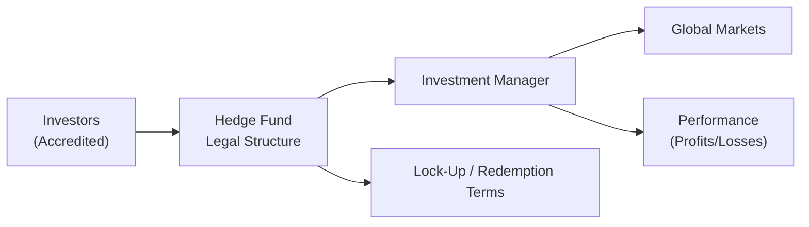

## 13.2 Hedge Funds

Hedge funds. The name alone can spark intrigue—and maybe a bit of confusion. I remember the first time I heard about them: I was sitting in a college café, half-listening to two classmates chat about “global macro,” “long/short positions,” and “2-and-20” fees. I honestly had no idea what they were talking about. But as it turns out, hedge funds aren’t just for super-sophisticated billionaires or financial wizards in fancy suits—they’re simply alternative investment vehicles that can take a very different path than more conventional products like mutual funds or ETFs. 

If you recall from Chapter 7 (Types of Investment Products) and Chapter 8 (Constructing Investment Portfolios), mutual funds must typically abide by constraints on leverage, short selling, and the kinds of securities they can hold. Hedge funds, on the other hand, have historically enjoyed far more flexibility. And, well, with more freedom often comes higher levels of risk. 

Below, we’ll dig into all things hedge funds: how they differ from traditional pooled investments, what strategies they use, how fees are structured, the regulatory snap-shots in Canada, and much more. We’ll even explore some real-life examples and pinch in a few informal anecdotes, just to help all these somewhat complex topics feel more digestible.

---

### Introduction

Hedge funds are sometimes described as “private investment partnerships” where managers can pursue a wide range of investment strategies. These strategies often include the use of derivatives, short selling, and leverage to seek what’s often called an “absolute return.” In simpler terms, a hedge fund manager isn’t necessarily trying to just “beat the market”—they may aim to make money whether the market goes up, down, or tangles along sideways.

Hedge funds can look pretty exciting from the outside, and they have often been associated with star managers who become news celebrities. But they’re not for everyone. They typically cater to accredited investors, who meet certain net worth or income thresholds, because the regulators and the funds themselves recognize the complexity and risks involved. 

---

### Distinguishing Hedge Funds from Traditional Investments

While a mutual fund invests on behalf of many unitholders with certain constraints (like limits on how much they can leverage, strict guidelines concerning short positions, and so on), hedge funds usually enjoy broader latitude. Traditional mutual funds also tend to be highly liquid—investors can typically redeem their shares on a daily or near-daily basis. In contrast, hedge funds might allow redemptions only monthly or quarterly. Some funds impose a lock-up period where no redemptions are allowed for months or even years after you first invest. 

Also, unlike a typical mutual fund that needs to strictly follow—and publicly disclose—a certain mandate, hedge fund managers typically have a broad mandate. They can jump from currency speculation in one month to a distressed bond investment in the next, if that’s what they believe will deliver returns. This dynamic, flexible approach can be liberating from an investment perspective, but also increases the complexity and risk.

#### A Brief Note on Absolute Returns
An “absolute return” strategy is all about generating positive returns regardless of the market environment. This stands in contrast to a “relative return” strategy, where your performance might simply be measured against an index (like the S&P/TSX Composite). So if an absolute return fund is up 2% during a period when the equity market is tanking by 10%, that’s considered a “win.” Of course, it could also lose money if the manager’s bets don’t pay off.

---

### Strategies Employed by Hedge Funds

Hedge fund strategies can vary dramatically—and that’s one reason it’s challenging to lump them all together under a neat one-size-fits-all risk label. Let’s explore some of the more common strategies you might encounter:

#### Long/Short Equity
Managers take long positions in equities they believe are undervalued and short positions in equities they believe are overvalued. For instance, they might buy (go long) shares of a tech company they expect to soar and simultaneously short (sell borrowed shares of) a rival they think is destined for a downward correction. The goal is to profit from pricing discrepancies.

#### Global Macro
These funds focus on macroeconomic trends across countries, often using currencies, commodities, interest-rate futures, or equity indices to place bets on where markets might move next. It could be as simple as wagering that a central bank in Country A will raise rates sooner than expected, giving an advantage to that country’s currency.

#### Event-Driven
These strategies revolve around corporate events like mergers, acquisitions, bankruptcies, or restructurings. Managers try to anticipate how such events could affect a firm’s share price or bond prices, aiming to profit if they predict the outcome correctly.

#### Quantitative (Quant) Strategies
Quant-oriented funds rely on computer models and statistical data to pinpoint trading opportunities. You might see managers talking about “mean reversion” or “statistical arbitrage.” They let the algorithms do the heavy lifting, analyzing huge data sets to detect patterns that (they hope) the broader market has yet to exploit.

#### Other Specialty Approaches
The range is nearly limitless. Some hedge funds focus on distressed debt, making investments in companies on the verge of bankruptcy. Others might revolve around activism, where the manager takes an influential (or controlling) stake in a corporation to push for governance changes, spin-offs, or reorganization. 

---

### Common Fee Structures

One of the biggest differences you’ll notice when comparing hedge funds to more conventional funds is their fee structure. Many hedge funds follow what’s famously known as the “2-and-20” model: 

• A management fee of around 2% of assets under management (AUM).  
• A performance (incentive) fee of around 20% of any gains (although the actual percentage can vary).

Let’s visualize a simplified formula for performance fees using KaTeX:

$$
\text{Performance Fee} = \alpha \times \max\bigl(R - H,\ 0\bigr)
$$

where:

- \\( R \\) is the fund’s return for the period,  
- \\( H \\) is the hurdle rate (e.g., a 5% annual threshold that must be surpassed),  
- \\( \alpha \\) is the performance fee rate (often 20%).  

If the fund’s return \\( R \\) is below \\( H \\), no performance fee is charged. This structure is designed to reward the manager for strong performance, though critics say it can encourage managers to take bigger risks in hopes of hitting that high return. On top of that, some funds have a high-water-mark provision, meaning a manager must recover past losses before they can charge a performance fee again.

---

### Liquidity and Lock-Up Periods

Hedge fund investing typically requires that investors commit their money for a certain period, known as a lock-up period. During this lock-up, withdrawals or redemptions are not permitted. After the expiration of the lock-up, a fund might still only allow redemptions at specific intervals, such as quarterly or semi-annually. This limited liquidity is usually attributed to the types of assets hedge funds might hold—some of which can be illiquid or require careful (and sometimes lengthy) exit strategies.

In practice, this means if you might need your money at a moment’s notice, a hedge fund probably isn’t the best fit. Any investor—especially a retail investor—should compare their liquidity needs with the fund’s redemption terms.

---

### Regulation in Canada

Here in Canada, hedge funds are largely governed by the provincial securities regulators under what is called the “exempt market.” These funds often avoid the full rigours of a prospectus by selling to accredited investors—investors who meet specific net worth or income thresholds established by the Canadian Securities Administrators (CSA). 

Since January 1, 2023, the Canadian Investment Regulatory Organization (CIRO) is the national self-regulatory organization that oversees both investment dealers and mutual fund dealers. It replaced the mutual fund dealer framework once covered by the Mutual Fund Dealers Association (MFDA) and the investment industry framework once covered by the Investment Industry Regulatory Organization of Canada (IIROC). Those two bodies are now considered defunct predecessor SROs. 

It’s important to note that even though CIRO sets guidelines for dealer conduct, hedge fund offerings may not be as heavily regulated in the sense of day-to-day oversight. The idea is that accredited investors tend to be more sophisticated and presumably better able to handle complex strategies and potential losses. 

For more specifics on accredited investor rules or filing requirements for exempt offerings (like hedge funds), you can check out:  
• The Canadian Securities Administrators’ website  
• SEDAR+ (System for Electronic Document Analysis and Retrieval) for fund documents: [https://www.sedarplus.ca/](https://www.sedarplus.ca/)  
• CIRO guidance on alternative products: [https://www.ciro.ca/](https://www.ciro.ca/)  

---

### Suitability and Risk Management

Because of their complexity, hedge funds are not for every investor. Advisors must thoroughly assess suitability, ensuring the investor’s risk tolerance, time horizon, experience level, and liquidity needs align with what a hedge fund offers. Some key concerns include:

• **Market Risk**: Many hedge funds use derivatives and leverage, amplifying both gains and losses.  
• **Liquidity Risk**: Lock-up periods and redemption windows mean you can’t tap your money whenever you please.  
• **Transparency**: Hedge funds aren’t always obligated to disclose their holdings as frequently or as thoroughly as mutual funds.  
• **High Fees**: The 2-and-20 model (or similar) can cut meaningfully into net returns.  
• **Manager Risk**: Hedge funds often revolve around a star manager’s skill. If that manager leaves, the fund may change drastically.  

In a KYC (Know Your Client) environment—detailed in Chapter 17 (Mutual Fund Dealer Regulation) and throughout this book—an advisor must carefully weigh a hedge fund’s profile against the client’s financial situation and investment objectives. 

**Caution**: Hedge funds can be extremely risky and might even fail completely if markets move against them or if their managers take on too much leverage. Indeed, we’ve seen hedge funds blow up spectacularly in the past. Always do thorough due diligence.

---

### Case Studies and Real-World Examples

Let’s talk about a (not so hypothetical) scenario: You have a hedge fund manager who is convinced that rising interest rates will severely hurt certain overleveraged corporations. To profit, this manager might short the bonds of those companies while going long safer, government-backed bonds. If the manager is correct, the fund can reap a tidy absolute return—potentially uncorrelated with a stock market meltdown happening at the same time. 

Another example might be a global macro fund that sees political turmoil in a major oil-producing region. This event pushes them to go long on oil futures. If the turmoil does trigger supply disruptions, prices rise and the fund profits. If, though, the crisis resolves peacefully—and quickly—the fund’s position could generate losses. Hedge funds take on these kinds of bigger, more idiosyncratic bets.

Let’s visualize in broad strokes how money flows within a theoretical hedge fund structure:

In this diagram:  
• Investors (accredited) commit capital to the hedge fund structure.  
• The Investment Manager deploys this capital into global markets using a variety of strategies.  
• Returns flow back to the fund and ultimately to the investors, subject to fees and lock-up/redemption restrictions.  

---

### Glossary

• **Accredited Investor**: An individual or institution meeting specific financial criteria (such as income or net worth) that qualifies them to invest in higher-risk securities in the exempt market.  
• **Absolute Return**: An investment strategy aiming for positive returns regardless of the market’s overall direction.  
• **Lock-Up Period**: A set duration when investors cannot withdraw their money from a hedge fund.  
• **Performance Fee**: A fee, typically a percentage (often 20%), charged on the fund’s profits.  
• **Hurdle Rate**: A minimum rate of return that a manager must attain before collecting any performance fee.  
• **Long/Short Equity**: A popular strategy where the fund takes long positions in equities it sees as undervalued and short positions in equities it views as overvalued.  
• **Global Macro**: A strategy that bets on macroeconomic trends using broad instruments such as currencies, interest rates, and commodities.  
• **Due Diligence**: A comprehensive examination of a fund’s viability, including its investment strategies, operational processes, and risk management approach.

---

### Additional Resources

If you’re hooked by the complexities of hedge funds and hungry for more, here are a few resources you might explore:

• **CIRO Guidance on Alternative Products**: The Canadian Investment Regulatory Organization’s website at [https://www.ciro.ca/](https://www.ciro.ca/) offers updated information on regulatory approaches.  
• **Canadian Securities Administrators (CSA)**: Great for official rulebooks and exempt market guidelines, including accredited investor definitions.  
• **SEDAR+**: Find official filings and offering documents at [https://www.sedarplus.ca/](https://www.sedarplus.ca/).  
• **Hedge Fund Market Wizards by Jack D. Schwager**: Real-world interviews with top-performing managers, offering insights into how strategies and personalities shape hedge funds.  
• **Chartered Alternative Investment Analyst (CAIA)**: A specialized program for deeper education in alternative investments, including hedge funds.  

---

### Conclusion

If you’ve come this far, you’re probably beginning to understand that a hedge fund is not just a “glorified mutual fund.” It’s a whole different beast, with unique strategies, fee structures, regulatory requirements, and risk profiles. In Canada, the hedge fund realm remains largely an arena for accredited investors, meaning it’s typically beyond everyday retail investing. 

However, as the market evolves, we may see more alternative products with hedge-fund-like features made available to a broader audience. For now, the main thing to remember is that hedge funds can be powerful tools for diversification if used correctly, but they come with hefty risks and complexities. If you or your client is considering investing in a hedge fund, it’s crucial to lean on due diligence, remain aware of your liquidity constraints, and keep a close eye on how that fund fits into your broader portfolio strategy.  

At the end of the day, hedge funds can be both exhilarating and intimidating. So take a breath, do your homework, and maybe, just maybe, you can harness the potential of these agile and sometimes daring alternative investments.  

---

## Hedge Funds Knowledge and Suitability Quiz



### 1. Which of the following best describes an absolute return strategy?

- [ ] A strategy seeking to outperform a stock market index.
- [ ] A strategy limited to long-only equity investments. 
- [x] A strategy aiming for positive returns regardless of market direction.
- [ ] A strategy with mandatory daily liquidity.

> **Explanation:** An absolute return strategy strives to deliver a profit even if the overall market is declining. Traditional strategies typically compare performance against a benchmark, whereas absolute return strategies focus on achieving a positive return in most market environments.

### 2. In Canada, hedge funds are often sold under which category?

- [ ] Government-insured investments. 
- [x] Exempt market offerings restricted to accredited investors.
- [ ] Standard mutual funds purchased through a prospectus. 
- [ ] Guaranteed investment certificates under a bank deposit contract.

> **Explanation:** Hedge funds in Canada are commonly distributed under an exempt distribution framework, which requires investors to be accredited or otherwise eligible under provincial securities regulations.

### 3. What is one typical difference between a mutual fund and a hedge fund?

- [x] Hedge funds often charge both a management fee and a performance-based fee.
- [ ] Mutual funds usually impose lock-up periods. 
- [ ] Hedge funds typically have lower fees. 
- [ ] Mutual funds use significantly more leverage.

> **Explanation:** Mutual funds might charge a management (MER) fee but rarely impose performance fees. Meanwhile, hedge funds commonly charge both a management fee (like 2%) and a performance fee (like 20% of profits).

### 4. Which of the following best describes a lock-up period in a hedge fund?

- [x] A timeframe when investors cannot redeem their capital.
- [ ] A time designated for changes in the fund’s strategy.
- [ ] A mandatory marketing hold for new investors.
- [ ] A freeze on the use of derivatives.

> **Explanation:** A lock-up period is set by the fund to restrict redemptions for a certain duration, ensuring the manager can deploy capital for longer-range strategies without sudden investor withdrawals.

### 5. Which statement is most accurate about the “2-and-20” fee structure?

- [x] It includes around 2% management fee plus 20% of net profits.
- [ ] It is charged by mutual funds for short-selling activities.
- [x] Sometimes it has a hurdle rate that must be met before the 20% is applied.
- [ ] It only applies when markets decline.

> **Explanation:** The common hedge fund fee arrangement is a 2% management fee on assets plus 20% of profits above a particular hurdle rate. It’s not typically used by mutual funds and applies to positive net gains (not only market declines).

### 6. Why might an investor consider a global macro strategy?

- [x] To capitalize on broad economic shifts using diverse instruments. 
- [ ] To invest solely in local real estate properties.
- [ ] To avoid currency exposure and short selling.
- [ ] To guarantee a fixed return above inflation.

> **Explanation:** Global macro strategies focus on macroeconomic trends (interest rates, geopolitical events, commodities, currencies) and can utilize a variety of instruments to profit from anticipated market directions.

### 7. What term refers to the practice of researching and evaluating a hedge fund’s viability, operations, and risks before investing?

- [x] Due diligence 
- [ ] Passive indexing 
- [x] Event-driven screening 
- [ ] Cherry picking

> **Explanation:** “Due diligence” is the process by which potential investors rigorously appraise an investment’s operational and financial details before committing capital. Event-driven is a strategy, not a practice of research.

### 8. Who oversees national self-regulation of mutual fund dealers and investment dealers in Canada as of 2025?

- [x] CIRO 
- [ ] MFDA
- [ ] IIROC 
- [ ] OSFI

> **Explanation:** The Canadian Investment Regulatory Organization (CIRO) is currently the national self-regulatory organization, formed from the amalgamation of the defunct predecessor SROs MFDA and IIROC.

### 9. For which type of investor are hedge funds most suitable?

- [x] Accredited, high-net-worth investors with high tolerance for risk.
- [ ] Investors seeking guaranteed principal protection.
- [ ] Individuals requiring daily liquidity for emergencies.
- [ ] Conservative investors reliant on fixed income only.

> **Explanation:** Hedge funds typically suit accredited investors who have the financial capacity and risk tolerance to handle potentially significant volatility and limited liquidity constraints.

### 10. Hedge fund managers are generally required to publicly disclose all positions on a weekly basis. True or False?

- [x] False 
- [ ] True

> **Explanation:** Unlike most mutual funds, hedge funds face fewer disclosure requirements and typically do not reveal their holdings as frequently. Transparency levels vary and are often far lower than in traditional funds.




